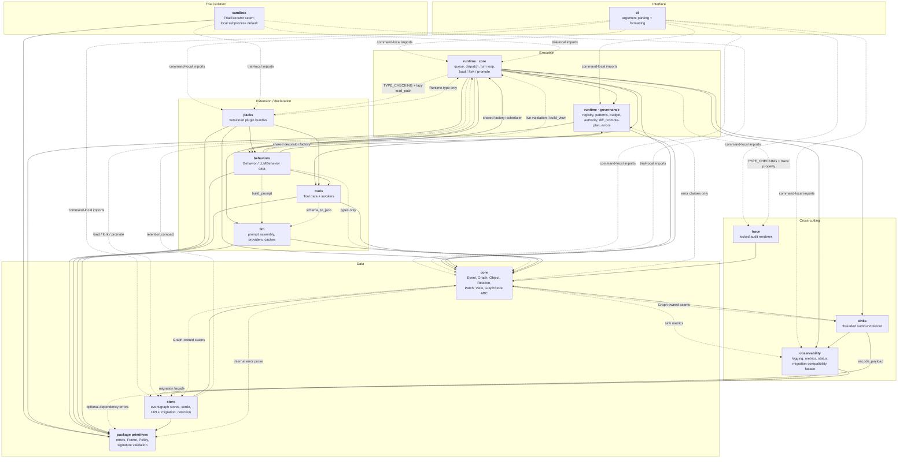

# activegraph — System Overview

`activegraph` (v1.10.0) is an **event-sourced graph runtime for agent systems**. An append-only
event log is the sole source of truth. Ordinary events project through the single `apply_event`
path (`activegraph/core/graph.py:1027-1103`); a compacted run first materializes its hash-verified
snapshot sidecar, then replays the hot suffix (`activegraph/runtime/runtime.py:5031-5091`).
`Graph.emit` is the only live graph-state mutator (`activegraph/core/graph.py:584-626`). On top of that log a
single-threaded FIFO runtime dispatches **behaviors** — plain Python functions, relation-scoped
functions, or LLM-backed handlers — that read a point-in-time `View` and mutate only through a
provenance-stamping wrapper. Every consequential act (an LLM request, a tool call, a budget
exhaustion, a behavior failure, a pack load, a promotion) is itself written back to the log as an
event, which is what makes a run replayable and diffable. SQLite-backed runs may fork at an event
outside a promote block, and a direct SQLite child may be promoted back into its parent. Around
that spine sit pluggable persistence and migration (`store/`), best-effort
outbound observation (`sinks/`), a frozen plugin format (`packs/`), a subprocess trial harness
(`sandbox/`) behind a provider-neutral trial-executor seam, an operator-facing
metrics/logging/status surface (`observability/`), a locked audit
renderer (`trace/`), and a thin CLI. The package exposes 143 names from
`activegraph/__init__.py:168-312`.

---

## System map

Solid arrows are module-level imports. Dashed arrows are **deferred edges** — function-local or
`TYPE_CHECKING`-only imports. Labelled solid arrows call out the specific module-level seam. A
solid cycle at this subsystem granularity can still be importable because its two arrows terminate
in different leaf modules; the exact Python-module graph, not this grouping, determines import
cycles. See the callout below.

The layering the diagram asserts is real but not perfectly clean, and two facts are worth stating
up front:

- **`core/` has zero module-level imports of any other `activegraph` subpackage.** Every
  cross-package reference in `core/` is under `if TYPE_CHECKING:` or inside a function body
  (`activegraph/core/__init__.py:1` — *"Core primitives. Knows nothing about runtime or behaviors."*).
  It is genuinely the bottom of the graph.
- **`observability/`'s logging, metrics, status, prometheus and otel modules have no activegraph
  imports at all** (except lazy `errors.MissingOptionalDependency` imports in the optional metric
  adapters). They sit *below* `core` precisely so `core` and `runtime` can import them without a
  cycle. `observability/migration.py` is the outlier: it is now a compatibility facade that
  re-exports the implementation from `store/migration.py` (`activegraph/observability/migration.py:3-14`).

Two subsystems sit outside the main flow:

- **`sandbox/` has no in-package callers at all.** Nothing under `activegraph/` imports it and it is
  deliberately not re-exported from `activegraph/__init__.py`. It is a dangling public boundary
  that exports serialized trial specifications, a provider-neutral `TrialExecutor`, and the local
  subprocess implementation (`activegraph/sandbox/executor.py:40-75,224-269`).
- **`trace/` has no public top-level surface.** `Trace` is not in `__all__`; its normal public
  facade is the `Runtime.trace` property
  (`activegraph/runtime/runtime.py:3617-3621`), while the CLI imports the printer directly.

---

## Subsystems

| Subsystem | One-line responsibility | Spec |
|---|---|---|
| `core` | Event-sourced data model — `Event`, `Graph`, `Object`, `Relation`, `Patch`, `View`, the projector, and the `GraphStore` ABC. | [01-core.md](01-core.md) |
| `runtime` (core loop) | The execution engine: FIFO event queue, behavior dispatch, LLM turn loop, tool invocation, `activate_after` scheduling, and the run-level time-travel surface (`save_state` / `load` / `fork` / `diff` / `promote`). | [02-runtime-core.md](02-runtime-core.md) |
| `runtime` (governance) | Decision logic held outside the loop: registry matching, the Cypher-subset pattern language, budget accounting, action-class authority, dev-override receipts, diff, promote planning, and the typed error taxonomy. | [03-runtime-governance.md](03-runtime-governance.md) |
| `store` | Persistence: the `EventStore` protocol and its in-memory/SQLite/Postgres backends, the `GraphStore` ABC and in-memory/FalkorDB projections, JSON wire format, store-URL grammar, migrations, conformance suites, and offline compaction. | [04-store.md](04-store.md) |
| `sinks` | Outbound observation of already-accepted events — one daemon thread and one bounded FIFO per attachment, at-most-once with declared, counted loss. | [05-sinks.md](05-sinks.md) |
| `sandbox` | Defines serialized trial specifications and a provider-neutral `TrialExecutor`; its default implementation runs candidate pack code in a fresh interpreter subprocess against a fork of a saved run, from hash-pinned artifacts. Crash/state isolation, explicitly not a security sandbox. | [06-sandbox.md](06-sandbox.md) |
| `packs` | The plugin format: the frozen `Pack` value object and pack-local decorators, `manifest.toml` and its content/bundle hashing, the prevalidating loader that namespaces contributions into a live `Runtime`, and a scaffolder. | [07-packs.md](07-packs.md) |
| `llm` | The external-model boundary: deterministic prompt assembly, the provider Protocols, vendor wire translation, content-keyed replay caches, and the LLM error taxonomy. Owns no orchestration. | [08-llm.md](08-llm.md) |
| `tools` + `behaviors` | The two extension-point declaration subsystems — metadata plus a callable, pushed onto module-level registries. Neither executes anything itself. | [09-tools-behaviors.md](09-tools-behaviors.md) |
| `observability` + `trace` + `cli` | Operator surface (structured logging, a three-method metrics protocol, and a frozen status snapshot), the locked audit-trace renderer and causal-chain walker, and the thin CLI shell over those facilities plus store operations. | [10-observability-trace-cli.md](10-observability-trace-cli.md) |

Cross-cutting flows that span several of these are diagrammed in
[11-sequence-diagrams.md](11-sequence-diagrams.md) and [12-data-flow.md](12-data-flow.md).

---

## Callout: the apparent cycles

The package-level import graph shows `core → runtime`, `store → runtime`, `behaviors → runtime`
and `packs → runtime` alongside the obvious forward edges. All four are real and import-time
acyclic, but they are different kinds of seam: exception taxonomy in `core`, an exception plus an
orchestration call in `store`, decorator construction/validation in `behaviors`, and a
`TYPE_CHECKING`-only `Runtime` annotation in `packs`.

### `core ↔ runtime` — error classes only

`core/` imports from `runtime/` at seven sites, all inside function bodies, all exception classes.
There is no `TYPE_CHECKING` runtime import and no protocol or callback import.

| core site | imported symbol | raised when |
|---|---|---|
| `activegraph/core/graph.py:133` | `runtime.exec_errors.ReservedFieldError` | caller `data`/`updates`/`value` contains a reserved key |
| `activegraph/core/graph.py:547` | `runtime.config_errors.IncompatibleRuntimeState` | `attach_store` called a second time with a different store |
| `activegraph/core/graph.py:811` | `runtime.exec_errors.ObjectNotFoundError` | `patch_object` cannot find its target |
| `activegraph/core/graph.py:915` | `runtime.exec_errors.ApplyPatchNotFoundError` | `apply_patch` cannot find its patch |
| `activegraph/core/graph.py:919` | `runtime.exec_errors.InvalidPatchLifecycleState` | `apply_patch` sees a non-`proposed` patch |
| `activegraph/core/graph.py:972` | `runtime.exec_errors.RejectPatchNotFoundError` | `reject_patch` cannot find its patch |
| `activegraph/core/graph.py:1163-1165` | `runtime.exec_errors.InternalEvaluatorError` | `evaluate_where` sees an operator outside `_OPS` |

The reverse direction is unambiguous and heavy: `runtime/runtime.py:91-95` imports `Event`, `Graph`,
`GraphStore`, `IDGen` and `View` at module scope, plus `behavior_graph.py:16-18`,
`view_builder.py:8-10`, `context_reads.py:47-48`, `registry.py:20-22`, `promote.py:37-38`,
`diff.py:19-20`, and `queue.py:8`.

So the cycle is a **naming** coupling: the error hierarchy lives in `runtime/`, and six execution
leaves (`ObjectNotFoundError`, `ApplyPatchNotFoundError`,
`RejectPatchNotFoundError`, `InvalidPatchLifecycleState`, `InternalEvaluatorError`, and
`ReservedFieldError`, at `activegraph/runtime/exec_errors.py:154-385`) are raised exclusively from
`core/graph.py`. `InternalEvaluatorError`'s own docstring names `activegraph/core/graph.py` as its
user (`activegraph/runtime/exec_errors.py:304-317`). The diagram therefore labels this as an
"error taxonomy" edge rather than a behavioral dependency.

There is a second, non-import inversion in the same area: `packs/loader.py` writes
`graph._pack_object_validator` and `graph._pack_relation_validator`
(`activegraph/packs/loader.py:918-926`), which `core.Graph.add_object` / `add_relation` call back
into (`activegraph/core/graph.py:662-663`, `:712-715`). That is a **callback seam** — there is no
`core → packs` import edge at all.

### `store ↔ runtime` — one error class and one real call

Exactly two function-local imports, confirmed by grep over `activegraph/store/*.py`:

1. **`activegraph/store/postgres.py:111`** — `runtime.config_errors.InvalidArgumentType`, raised
   when `PostgresEventStore(target=...)` gets something that is not a URL string, a
   `psycopg.Connection`, or a `ConnectionPool` (`activegraph/store/postgres.py:100-145`). Pure
   error-taxonomy coupling; the class's own docstring names `PostgresEventStore` as its motivating
   case (`activegraph/runtime/config_errors.py:68-74`).

2. **`activegraph/store/retention.py:273`** — `from activegraph.runtime.runtime import Runtime`
   inside `compact()`. This one is a **genuine functional dependency**: `compact` calls
   `Runtime.load(path, run_id=..., behaviors=[])` to rebuild the projected state it needs to
   snapshot (`activegraph/store/retention.py:275-280`), then emits the `runtime.snapshot` event
   through `rt.graph.emit(...)` (`:282-303`). `retention.compact` is therefore an *orchestration*
   function that happens to live under `store/` — architecturally it sits **above** the runtime,
   not beside the other store modules, and the function-local import is what stops
   `import activegraph.store` from cycling.

The forward direction is the normal one: `Runtime.__init__` opens or attaches a store
(`activegraph/runtime/runtime.py:594-601`), and `Graph.emit` owns live per-event persistence
(`activegraph/core/graph.py:584-596`). Late `Runtime.save_state` attachment separately backfills
the existing in-memory log with direct `store.append` calls
(`activegraph/runtime/runtime.py:3732-3741`). `Runtime.load` / `fork` / `promote` reach into
backend-specific extras that are not on the `EventStore` protocol. The shared opener remains typed
`Any` because callers use the persistent-backend-only `upsert_run`
(`activegraph/runtime/runtime.py:4628-4645`).

### `behaviors ↔ runtime`; `packs → runtime` — construction and type seams

The global behavior decorators and the pack-local decorators now share the construction functions
in `behaviors/_factory.py`; pattern and delay parsing happen there at module scope. Live-runtime
validation and prompt construction remain function-local. `packs/loader.py:52` itself imports
`Runtime` only under `TYPE_CHECKING`. The behavior-side runtime seams are:

- `runtime.patterns.parse(pattern).compile()` and
  `runtime.scheduler.parse_activate_after(spec)` — imported by
  `activegraph/behaviors/_factory.py:14-15` and called by `_prepare_timing` at `:24-33`. This is the
  "compile once at decoration" guarantee: a bad pattern raises `UnsupportedPatternError` before
  runtime dispatch. Both `behaviors/decorators.py:133-143` and `packs/__init__.py:788-798` delegate
  to that factory.
- `runtime._live.validate_behavior_against_live_runtimes(obj)` —
  `activegraph/behaviors/decorators.py:101-103,255-257`, which cross-checks a declared model against every
  live `Runtime` in a module-level `WeakSet`.
- `runtime.view_builder.build_view` / `_resolve_event_path` inside `LLMBehavior.build_prompt`
  (`activegraph/behaviors/base.py:161-167`), so a developer can inspect an assembled prompt without
  constructing a `Runtime`.

**Resolved:** the former `behaviors/__init__.py:1` claim that the package imported core only is
gone. The current direct edge set is `behaviors → {core (types only), tools, llm, runtime}`; the
replacement package docstring names core, llm, and runtime but currently omits tools.

### Test-only edges

The `sinks → runtime` edge exists **only in the conformance suite**:
`activegraph/sinks/conformance.py:19-24` imports `Runtime`, `Graph` and `InMemoryEventStore`
(and `pytest`) at module scope. By contrast, `sinks → store` is a production edge through
`activegraph/sinks/jsonl.py:12` → `store.serde.encode_payload`; conformance merely adds another
store import. The same shipped-module-imports-pytest
pattern appears in `store/conformance.py`, `sandbox/conformance.py` and
`sinks/conformance.py`; `store/graph_conformance.py` deliberately avoids the module-scope import.

Similarly, the `packs → llm` edge is **example-pack-only**: the pack machinery has no
`activegraph.llm` import; the edge comes solely from
`activegraph/packs/diligence/fixtures/__init__.py:19,205`.
