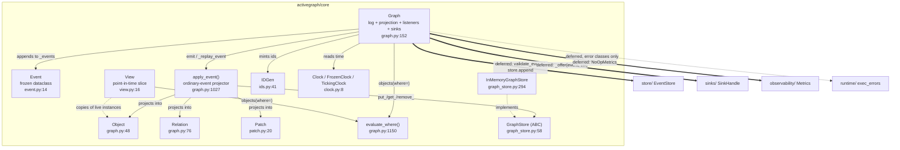

# Core — Event-Sourced Graph Data Model

## Responsibility

`core/` is the event-sourced graph data model and its projector. The append-only event log is
the source of truth (CONTRACT #2) and `Graph.emit` is the only live mutator; objects, relations,
patches, and views are all *projections* derived from that log
(`activegraph/core/event.py:1-6`, `activegraph/core/graph.py:1-23`). The subsystem owns five
primitives — `Event`, `Object`, `Relation`, `Patch`, `View` — plus the ID generator, the clock
abstraction, the `where` predicate evaluator, and the `GraphStore` ABC that storage backends
implement against. Its boundary is stated in one line: *"Core primitives. Knows nothing about
runtime or behaviors."* (`activegraph/core/__init__.py:1`).

That boundary is enforced at import time: **`core/` has zero module-level imports of any other
`activegraph` subpackage.** Cross-package references are under `if TYPE_CHECKING:` or imported
inside functions. Runtime nevertheless has deliberate private reconstruction/control seams into
core, including snapshot hydration of `graph._state` (`activegraph/runtime/runtime.py:5065-5091`).

## Component map



Solid arrows are intra-core. Bold arrows (`==>`) are core's outbound collaborator calls; their
types are import-time-deferred, while the injected store itself is called through its protocol.
The dotted arrow to `runtime/` is a naming-only coupling (exception classes), not a behavioral
dependency.

## Key types & entry points

- `Event` — frozen dataclass; one immutable record in the append-only log. Fields `id, type, payload, actor, frame_id, caused_by, timestamp` — `activegraph/core/event.py:14-43`
- `Object` — typed node in the projection: `id, type, data, version, provenance` — `activegraph/core/graph.py:48-73`
- `Relation` — typed edge: `id, source, target, type, data, provenance`. Dangling endpoints are legal — `activegraph/core/graph.py:76-103`
- `Patch` — proposed single-target mutation: `id, target, op, value, expected_version, proposed_by, rationale, evidence, status, rejection_reason, provenance` — `activegraph/core/patch.py:20-58`
- `PATCH_OPS = {"update","replace"}` — `activegraph/core/patch.py:17`. Object creation/removal are
  handled by `Graph.add_object`/`Graph.remove_object` directly, not by patches.
- `Graph` — the aggregate: log + projection + listeners + sinks + optional `EventStore` — `activegraph/core/graph.py:152-1021`
- `Graph.emit(event) -> Event` — **the only live mutator** — `activegraph/core/graph.py:584-626`
- `Graph._replay_event(event) -> None` — the replay mutator; silent (no persist, no sinks, no listeners) — `activegraph/core/graph.py:630-638`
- `apply_event(graph, event) -> None` — module-level ordinary-event projector; snapshot materialization is the separate reconstruction path — `activegraph/core/graph.py:1027-1103`, `activegraph/runtime/runtime.py:5031-5091`
- `Graph._provenance(...)` — framework-written provenance dict for every object/relation/patch — `activegraph/core/graph.py:994-1021`
- `_reject_reserved_fields(data, api=, param=)` — module-level helper that raises `ReservedFieldError` on reserved-key collision — `activegraph/core/graph.py:109-136`
- `RESERVED_DATA_FIELDS = frozenset({"provenance"})` — one table for all four mutation surfaces — `activegraph/core/graph.py:109-114`
- `GraphStore` (ABC) — pluggable materialized-state backend — `activegraph/core/graph_store.py:58-291`
- `InMemoryGraphStore` — the default, dict-backed, no-copy backend — `activegraph/core/graph_store.py:294-356`
- `ChainMatch` — frozen dataclass `{objects, relations}` returned by `match_chain` — `activegraph/core/graph_store.py:43-55`
- `View` — point-in-time filtering slice handed to behaviors as `ctx.view`; returned entities are live — `activegraph/core/view.py:21-75`
- `IDGen` — per-graph monotonic ID generator + `reseed_from_events` — `activegraph/core/ids.py:41-136`
- `Clock` / `FrozenClock` / `TickingClock` — ISO-8601-second UTC time source — `activegraph/core/clock.py:8-63`
- `evaluate_where(where, root) -> bool` — predicate evaluator shared by `Graph.objects`, `View.objects`, and `runtime.registry` — `activegraph/core/graph.py:1150-1197`

## Interfaces & contracts at each seam

Inbound reach was verified against the current source: **10 of 11 other source subpackages import
core** (`behaviors`, `cli`, `llm`, `packs`, `runtime`, `sandbox`, `sinks`, `store`, `tools`, and
`trace`); `observability` does not. Several deliberate private seams are documented below. The
public re-export surface is
`activegraph/__init__.py:15-20` (`Clock, FrozenClock, TickingClock, Event, Graph, Object,
Relation, IDGen, Patch, View`); `GraphStore` / `InMemoryGraphStore` reach the top level
indirectly via `activegraph/store/__init__.py:14` and are listed in `__all__` at
`activegraph/__init__.py:202,205`.

### core <-> runtime (Graph control surface)

`runtime/` is core's largest consumer. `runtime/runtime.py:91-95` imports `Event`, `Graph`,
`GraphStore`, `IDGen`, and `View` at module level; `runtime/registry.py:21-22` imports
`evaluate_where`. The
runtime constructs the `Graph`, attaches itself as a listener so behaviors fire on accepted
events, attaches the durable store, and drives replay on load/fork.

```ebnf
graph-construction  ::= Graph( [ids: IDGen] , [clock: Clock] ,
                               [run_id: str] , [graph_store: GraphStore] )
                        (* run_id defaults to ids.run() — a ULID *)

live-mutation       ::= graph.emit(Event) "->" Event
                      | sugar-mutation

sugar-mutation      ::= add_object(type, data, *, actor="system", caused_by?,
                                   frame_id?, evidence?, llm_request_event_id?,
                                   tool_request_event_ids?) "->" Object
                      | add_relation(source, target, type, data?, *, actor="system",
                                     caused_by?, frame_id?, llm_request_event_id?,
                                     tool_request_event_ids?) "->" Relation
                      | remove_object(object_id, *, actor="system", ...) "->" None
                      | remove_relation(relation_id, *, actor="system", ...) "->" None
                      | patch_object(target, updates, *, actor="system", rationale?,
                                     evidence?, ...) "->" Patch
                      | propose_patch(target, op, value, *, proposed_by,
                                      rationale?, evidence?, ...) "->" Patch
                      | apply_patch(patch_id, *, approved_by="system", ...) "->" Event
                      | reject_patch(patch_id, reason, *, actor="system", ...) "->" Event

replay-mutation     ::= graph._replay_event(Event) "->" None   (* silent *)

listener-attach     ::= graph.add_listener( (Event) "->" None ) "->" None
listener-detach     ::= graph._remove_listener(fn) "->" bool

store-attach        ::= graph.attach_store(EventStore) "->" None
                      | raises IncompatibleRuntimeState

read-surface        ::= objects(type?, where?) "->" [Object]
                      | query(object_type?, where?) "->" [Object]     (* alias *)
                      | relations(source?, target?, type?) "->" [Relation]
                      | get_relations(object_id?, type?, direction) "->" [Relation]
                      | neighborhood(object_id, depth=1) "->" ([Object],[Relation])
                      | match_chain([type?], [(rel_type?, dir)]) "->" [ChainMatch]
                      | objects_in_types([str]) "->" [Object]
                      | has_object_of_type(str) "->" bool
                      | get_object|get_relation|get_patch(id) "->" T | None
                      | all_objects() | all_relations() "->" [T]
                      | events "->" [Event]           (* property, copied list *)
                      | replayed_ids "->" frozenset[str]
                      | store "->" EventStore | None
direction           ::= "outgoing" | "incoming" | "both" | other  (* other == ignore object_id *)

errors              ::= ObjectNotFoundError          (* patch_object target miss;
                                                        also KeyError *)
                      | PatchNotFoundError            (* shared apply/reject catch *)
                      | ApplyPatchNotFoundError       (* apply miss; also KeyError,
                                                        never AttributeError *)
                      | RejectPatchNotFoundError      (* reject miss; also AttributeError,
                                                        never KeyError *)
                      | InvalidPatchLifecycleState   (* apply_patch on non-proposed *)
                      | ReservedFieldError           (* reserved key in caller data *)
                      | IncompatibleRuntimeState     (* second attach_store *)
                      | InternalEvaluatorError       (* unknown where operator *)
```

Call sites: `graph.add_listener(self._on_event)` — `activegraph/runtime/runtime.py:635`, listener
signature `(Event) -> None` at `activegraph/runtime/runtime.py:1060-1068`.
Store attachment occurs at `activegraph/runtime/runtime.py:600-601,3741,3817,4011`.
Listener detach occurs at `activegraph/runtime/runtime.py:642,3900,4102` (implementation
`activegraph/core/graph.py:362-370`). Replay loops are at
`activegraph/runtime/runtime.py:3815,4009,4861`, plus
`activegraph/runtime/promote.py:169-173`, `activegraph/store/retention.py:349-363`, and the
compatibility helper `activegraph/store/base.py:82-92`. Graph construction occurs at
`activegraph/runtime/runtime.py:3807,4001,4811`, `activegraph/runtime/promote.py:169`, and
`activegraph/store/retention.py:361`.

Other runtime modules importing core types: `behavior_graph.py:16-18`, `context_reads.py:47-48`,
`dev_override.py:8`, `diff.py:19-20`, `patterns.py:45-46` (TYPE_CHECKING), `promote.py:37-38`,
`queue.py:8`, `registry.py:21-22`, and `view_builder.py:8-10`.

Contract notes:

- **Emit ordering (CONTRACT v1.8 #2)** — `activegraph/core/graph.py:584-626`, strictly:
  (1) `validate_event` — only if a store is attached; (2) append to `_events`; (3) `apply_event`
  (project); (4) `store.append` (durable); (5) offer to sinks; (6) release lock; (7) call
  listeners synchronously. Sinks are offered *after* projection + durable append and *before*
  legacy listeners, so a listener re-entering `emit` cannot reverse observation order and a
  listener failure cannot suppress observation of an already-accepted event
  (`activegraph/core/graph.py:597-625`). Listeners run **outside** `_emit_lock` (an RLock,
  `activegraph/core/graph.py:191-196`) so a listener that spawns a second emitting thread and
  waits on it does not deadlock (`activegraph/core/graph.py:620-625`).
- **Replay is silent (CONTRACT v0.5 #14)** — `_replay_event` appends, projects, and records the
  id in `_replayed_ids`, but never persists, never offers sinks, never fires listeners
  (`activegraph/core/graph.py:630-638`): "replay rebuilds graph state; it does NOT fire
  behaviors."
- **Store attachment is once-per-graph-lifetime** — `attach_store` is idempotent on the same
  store; a *different* store raises `IncompatibleRuntimeState` with a full what/why/how-to-fix
  (`activegraph/core/graph.py:539-576`). Rationale: re-attach would either split the log across
  two stores or silently perform a migration.
- **Provenance is framework-written (CONTRACT #5 / v1.10 #2)** — every object/relation/patch
  carries provenance written by `Graph._provenance`, never by the caller
  (`activegraph/core/graph.py:994-1021`). `_reject_reserved_fields` raises `ReservedFieldError`
  on collision from `add_object:655-657`, `add_relation:708-710`, `patch_object:814-816`, and
  `propose_patch:871-873`. Pre-v1.10 this was a *silent strip*, which meant "a caller who thought
  they attached provenance had attached nothing" (`activegraph/core/graph.py:122-127`). Non-dict
  input passes through unchanged (`activegraph/core/graph.py:129-130`).
- **Versioning + optimistic concurrency (CONTRACT #4, #12)** — an existing target object's
  `version` bumps by exactly 1 when `patch.applied` projects
  (`activegraph/core/graph.py:1085-1096`). A `Patch.expected_version`
  mismatch does **not** raise — it emits `patch.rejected` with reason
  `"version mismatch: expected N, got M"` (`activegraph/core/graph.py:923-948`). `apply_patch` on
  a non-`proposed` patch raises `InvalidPatchLifecycleState`
  (`activegraph/core/graph.py:919-922`), enforcing the one-shot patch lifecycle.
  A patch targets exactly one object and an object is never mutated except by an applied patch's
  event (`activegraph/core/patch.py:22-31`); lifecycle is `proposed → applied` XOR
  `proposed → rejected` (`activegraph/core/patch.py:4-6`). `patch_object` is the auto-apply
  shortcut — status `"applied"` from birth, emits `patch.applied` directly
  (`activegraph/core/graph.py:795-851`); `propose_patch` emits `patch.proposed` and waits for
  explicit approval (`activegraph/core/graph.py:853-903`), stripping an `"object:"`/`"relation:"`
  prefix from `target` and defaulting `expected_version` to `0` for an unknown target
  (`activegraph/core/graph.py:867-870`).
- **Lookup failures are typed and atomic** — `patch_object` raises
  `ObjectNotFoundError(ExecutionError, KeyError)` for an unknown target; `apply_patch` and
  `reject_patch` raise operation leaves under the shared `PatchNotFoundError(ExecutionError)`.
  The apply leaf alone retains `KeyError`, and the reject leaf alone retains `AttributeError`,
  so ordered legacy handlers select the same branch as before. Every miss is checked before id
  allocation, event emission, object-version mutation, or lifecycle mutation. The three raised
  leaves use structured framework rendering and one-element `args == (str(error),)`; that
  rendering intentionally replaces the old quoted `KeyError` strings and reject's incidental
  `NoneType.target` message.
- **Removal semantics** — `remove_object` / `remove_relation` are no-ops on an unknown id; they
  return before emitting, so no event is written (`activegraph/core/graph.py:761-762,782-783`).
  `object.removed` cascades: the projector drops every relation touching the removed id, deduped
  so a self-loop is removed once (`activegraph/core/graph.py:1049-1063`). `relation.removed` does
  NOT cascade to objects.
- **`where` evaluator** — operators `> < >= <= == != in "not in"`
  (`activegraph/core/graph.py:1124-1133`); ordering ops are `None`-safe by returning `False`.
  Keys are dotted paths resolved through dicts then attributes
  (`activegraph/core/graph.py:1136-1147`); both top-level dict entries and
  `{op: value}` dicts are accepted (`activegraph/core/graph.py:1150-1159`). An unknown operator
  raises `InternalEvaluatorError` — treated as a framework bug, not user error
  (`activegraph/core/graph.py:1160-1191`).

### core -> store (durability: the EventStore)

`Graph` persists through an optional `EventStore` attached at runtime. The reference is
TYPE_CHECKING-only (`activegraph/core/graph.py:42`); the serialization guard is a function-local
import, while append is an injected protocol call (`activegraph/core/graph.py:589-596`).
`EventStore` is a `Protocol` (`activegraph/store/base.py:45-79`), so core never names a concrete
backend. `store/base.replay_into` is a compatibility helper; runtime load/fork use explicit
`_replay_event` loops (`activegraph/store/base.py:82-92`).

```ebnf
pre-append-check ::= validate_event(Event) "->" None | raises serde-error
                     (* only when a store is attached; graph.py:589-592 *)
durable-append   ::= store.append(Event) "->" None
event-store-iface::= { run_id: str
                     , append(Event) -> None
                     , iter_events(after?, until?) -> Iterator[Event]
                     , get_event(event_id) -> Event | None
                     , count() -> int
                     , truncate_after(event_id) -> None
                     , close() -> None }
replay-entry     ::= replay_into(Graph, Iterable[Event]) "->" int
                     (* store/base.py:82-92 — compatibility helper;
                        runtime load/fork have their own replay loops *)
ordering         ::= append-to-log , project , durable-append , offer-sinks ,
                     release-lock , notify-listeners
```

Contract notes:

- `validate_event(event: Event) -> None` calls `encode_payload(event.payload)` so invalid values
  cannot reach durable storage; a store-less graph deliberately skips the check
  (`activegraph/store/serde.py:201-203`; `activegraph/core/graph.py:587-596`).
- `replay_into(graph, events) -> int` at `activegraph/store/base.py:82-92` calls
  `graph._replay_event(ev)` with an explicit `# noqa: SLF001 — internal seam by design`.
- Other `store/` imports include Event-log modules (`base.py:20,23`, `serde.py:21`, `memory.py:11`,
  `sqlite.py:50`, `postgres.py:26`, `retention.py:72`, `conformance.py:22`,
  `migration.py:17`), graph-state backends (`falkordb.py:70-72`,
  `graph_conformance.py:18-19`), and retention's function-local `Graph`/`IDGen` imports
  (`retention.py:349-350`).

### core <- store (the GraphStore ABC, implemented by backends)

`GraphStore` is core's *inbound* storage seam: core defines the materialized-state interface and
storage backends subclass it. Ordinary-event projection writes through it, and compacted snapshot
hydration also writes through `graph._state` directly (`activegraph/core/graph.py:1037-1103`;
`activegraph/runtime/runtime.py:5064-5084`). `graph_store.py:38-40` imports `Object, Relation, Patch` under
TYPE_CHECKING only — deliberately, so backends "stay decoupled from query-language details and
there is no import cycle with core.graph" (`activegraph/core/graph_store.py:118-126`).

```ebnf
graph-store       ::= required-ops , optional-hooks , lifecycle
required-ops      ::= put_object(Object) -> None
                    | get_object(id) -> Object | None
                    | remove_object(id) -> None
                    | all_objects() -> [Object]          (* order unspecified *)
                    | put_relation(Relation) -> None
                    | get_relation(id) -> Relation | None
                    | remove_relation(id) -> None
                    | all_relations() -> [Relation]
                    | put_patch(Patch) -> None
                    | get_patch(id) -> Patch | None
                    | all_patches() -> [Patch]
optional-hooks    ::= find_objects(type?) -> [Object]
                    | find_objects_in_types([str]) -> [Object]   (* order-preserving *)
                    | find_relations(source?, target?, type?) -> [Relation]  (* AND *)
                    | neighborhood(id, depth=1) -> ([Object],[Relation])
                    | match_chain([type?], [(rel_type?, dir)]) -> [ChainMatch]
dir               ::= "right"   (* (a)-[]->(b) *)
                    | "left"    (* (a)<-[]-(b) *)
ChainMatch        ::= { objects: [Object] (* len == n *)
                      , relations: [Relation] (* len == n-1 *) }
lifecycle         ::= clear() -> None | remove_patch(id) -> None | close() -> None
conformance       ::= subclass GraphStoreConformance , implement make_store() ,
                      [override cleanup()]
override-rule     ::= "an override MUST return exactly what the default would"
```

Contract notes (CONTRACT v1.2 #1, #5):

- **A GraphStore is NOT an EventStore.** Losing a GraphStore is recoverable (replay the log);
  losing the EventStore is not (`activegraph/core/graph_store.py:12-15`).
- `put_*` is upsert; `get_*` returns `None` for unknown ids; `remove_*` is a no-op for unknown
  ids (`activegraph/core/graph_store.py:58-66`).
- `all_objects()` / `all_relations()` / `all_patches()` order is **unspecified**
  (`activegraph/core/graph_store.py:84, 102, 116`).
- The five optional pushdown hooks have working Python defaults, so the base class *is* the
  canonical semantics; an override MUST return exactly what the default would, pinned by
  `GraphStoreConformance` (`activegraph/core/graph_store.py:118-126`,
  `activegraph/store/graph_conformance.py:22-39`).
- `find_objects_in_types` MUST preserve single-pass `all_objects` order even when pushed down
  (`activegraph/core/graph_store.py:137-148`).
- `match_chain` is explicitly **homomorphic** — one object or relation may fill more than one
  position, matching FalkorDB, neither enforcing node/relation uniqueness
  (`activegraph/core/graph_store.py:204-225`). Requires `len(rels) == len(node_types) - 1`
  (`activegraph/core/graph_store.py:211-215`).
- The rich `where` predicate is deliberately **not** a hook — it stays in Python in
  `core/graph.py` because it is hard to translate faithfully
  (`activegraph/core/graph_store.py:25-29`).
- `neighborhood` is an undirected BFS; endpoints that are not materialized objects are skipped;
  returns `([], [])` for an unknown start (`activegraph/core/graph_store.py:170-178`).
- `remove_patch` on the ABC raises `NotImplementedError`; subclasses storing patches MUST
  override (`activegraph/core/graph_store.py:281-288`).
- `InMemoryGraphStore` returns live instances with **no copy**, so the projector's in-place
  mutations (`obj.data.update(...)`, `obj.version += 1`) work as they did pre-v1.2
  (`activegraph/core/graph_store.py:294-302`). The projector still calls `put_object(obj)` after
  mutating — a no-op in memory, but what makes a remote backend correct
  (`activegraph/core/graph.py:1085-1096`).
- Backend implementation reference: `store/falkordb.py:70-72` imports `Object`, `Relation`,
  `ChainMatch`, `GraphStore`, and `FalkorDBGraphStore` overrides all five optional hooks
  (`find_objects:416`, `find_objects_in_types:435`, `find_relations:458`, `neighborhood:485`,
  `match_chain:550`) to push work into Cypher.

### core -> sinks (accepted-event fanout, CONTRACT v1.8)

`Graph` fans accepted events out to registered sinks inside `emit`, after durable append and
before legacy listeners. Types are TYPE_CHECKING-only at `activegraph/core/graph.py:38-42`
(`EventSink`, `OverflowPolicy`, `SinkStatus`, `SinkHandle`); `add_sink` and `emit` both use
deferred imports. Core treats sinks as a pure observation channel: return values are ignored and
exceptions are contained, so an observer bug can never become graph control flow.

```ebnf
sink-attach   ::= graph.add_sink(EventSink, *, name?, queue_capacity=1024,
                                 overflow_policy="drop_newest", metrics?) "->" SinkHandle
                | raises TypeError   (* not an EventSink Protocol *)
                | raises ValueError  (* empty name | duplicate name *)
sink-detach   ::= graph.remove_sink(name | SinkHandle, *, timeout=5.0) "->" bool
sink-flush    ::= graph.flush_sinks(timeout=5.0) "->" bool
sink-closeall ::= graph.close_sinks(timeout=5.0) "->" bool
sink-status   ::= graph.sink_statuses() "->" (SinkStatus, ...)
                  (* active ++ closing ++ retained-terminal *)

offer         ::= handle._offer(Event, DeliveryContext) "->" bool
                  (* non-throwing by design; core wraps in except-continue anyway *)
DeliveryContext ::= { run_id: nonempty-str
                    , sequence: int >= 1      (* len(graph._events) after append *)
                    , mode: "live" }          (* replay never offers *)
EventSink     ::= { open() -> None, on_event(Event, DeliveryContext) -> None,
                    flush() -> None, close() -> None }
                  (* all return values ignored; all exceptions isolated *)
OverflowPolicy::= "drop_newest" | "drop_oldest" | "fail_sink"
```

Contract notes:

- `add_sink` deferred-imports `EventSink` (isinstance-checked as a runtime-checkable Protocol),
  `OverflowPolicy`, `SinkHandle`, and `NoOpMetrics` (`activegraph/core/graph.py:394-397`), then
  constructs the handle at `activegraph/core/graph.py:412-420`.
- `emit` deferred-imports `DeliveryContext` (`activegraph/core/graph.py:601-608`) and calls
  `sink._offer(event, context)` per attached handle inside a bare `except Exception: continue`
  containment boundary (`activegraph/core/graph.py:609-619`). `SinkHandle._offer` is documented
  non-throwing at `activegraph/sinks/dispatch.py:142-189`; the guard is a belt-and-braces
  boundary.
- Lifecycle passthrough: `remove_sink` / `close_sinks` call `handle._close_worker(...)` and
  `handle._is_terminal()` — `activegraph/core/graph.py:450-459,524-534`.
- Inbound from `sinks/`: `sinks/base.py:13`, `dispatch.py:16`, `jsonl.py:10`, `testing.py:9`
  import `Event`; `sinks/conformance.py:19-20` imports `Event` and `Graph` and constructs real
  `Graph` instances to exercise emit-order (`activegraph/sinks/conformance.py:97-140`).

### core -> observability (metrics collaborator)

Core never records a metric. It accepts an optional `Metrics` collaborator on `add_sink` and
forwards it into the `SinkHandle`, defaulting to `NoOpMetrics` when none is given. `Metrics` is
TYPE_CHECKING-only at `activegraph/core/graph.py:39`; `NoOpMetrics` is deferred-imported at
`activegraph/core/graph.py:394,418`.

```ebnf
metrics-passthrough ::= graph.add_sink(..., metrics = Metrics | None)
                        (* None -> NoOpMetrics(); forwarded into SinkHandle *)
Metrics             ::= { counter(name, tags, value=1.0) -> None
                        , histogram(name, tags, value) -> None
                        , gauge(name, tags, value) -> None }
                        (* best-effort, non-throwing, concurrency-tolerant *)
```

Contract note: `Metrics` is a 3-method Protocol, all methods best-effort and non-throwing
(`activegraph/observability/metrics.py:150-161`). Canonical migration imports `Event` from
`activegraph/store/migration.py:17`; `observability/migration.py:1-31` is only a compatibility
re-export and no longer imports core.

### core -> runtime (error taxonomy only — the apparent cycle)

Core imports from `runtime/` only function-locally, and only for exception classes.
There is no TYPE_CHECKING runtime import and no protocol or callback import, so the cycle is
error-taxonomy-only and import-time-acyclic.

| core site | imported symbol | raised when |
|---|---|---|
| `activegraph/core/graph.py:133` | `runtime.exec_errors.ReservedFieldError` | caller `data`/`updates`/`value` contains a reserved key |
| `activegraph/core/graph.py:547-575` | `runtime.config_errors.IncompatibleRuntimeState` | `attach_store` called twice with different stores |
| `activegraph/core/graph.py:811-813` | `runtime.exec_errors.ObjectNotFoundError` | `patch_object` target id is absent |
| `activegraph/core/graph.py:915-917` | `runtime.exec_errors.ApplyPatchNotFoundError` | `apply_patch` patch id is absent |
| `activegraph/core/graph.py:919-922` | `runtime.exec_errors.InvalidPatchLifecycleState` | `apply_patch` on a non-`proposed` patch |
| `activegraph/core/graph.py:972-974` | `runtime.exec_errors.RejectPatchNotFoundError` | `reject_patch` patch id is absent |
| `activegraph/core/graph.py:1162-1191` | `activegraph.errors.internal_bug_fields` + `runtime.exec_errors.InternalEvaluatorError` | `evaluate_where` sees an operator not in `_OPS` |

```ebnf
deferred-error-import ::= "inside function body" , from-runtime-errors , raise
from-runtime-errors   ::= ReservedFieldError(field=, api=, param=)
                        | ObjectNotFoundError(object_id=)
                        | ApplyPatchNotFoundError(patch_id=)
                        | RejectPatchNotFoundError(patch_id=)
                        | InvalidPatchLifecycleState(patch_id=, current_status=)
                        | InternalEvaluatorError(summary, what_failed=, why=,
                                                 how_to_fix=, context=)
                        | IncompatibleRuntimeState(summary, what_failed=, why=,
                                                   how_to_fix=)
(* Id/field leaves are keyword-only. InternalEvaluatorError and
   IncompatibleRuntimeState take a positional summary plus keyword details.
   No runtime type, protocol, or callback is imported by core. *)
```

Contract note: this is a *naming* coupling, not a behavioral one. The object/patch lookup leaves,
`ReservedFieldError`, and `InvalidPatchLifecycleState` are raised from `core/graph.py`; their
placement in `runtime/exec_errors.py` keeps them under the public `ExecutionError` taxonomy.
`InternalEvaluatorError` likewise names `activegraph/core/graph.py` as its user. See Open
Question 6.

### core <- packs (schema validator injection)

`packs.loader` installs two callables directly onto the `Graph` instance after loading a pack's
schema, so `add_object` / `add_relation` enforce pack-declared types without core ever knowing
what a pack is. Both default to `None`, preserving untyped v0.8 semantics.

```ebnf
validator-install ::= graph._pack_object_validator   := (type: str, data: dict) -> dict
                    | graph._pack_relation_validator := (type: str,
                                                         src_type: str|None,
                                                         tgt_type: str|None) -> None
call-sites        ::= add_object   -> object_validator(type, clean)    (* result replaces data *)
                    | add_relation -> relation_validator(type, src.type?, tgt.type?)
default           ::= None   (* untyped v0.8 semantics preserved *)
```

Contract note: `packs.loader` imports Event at `activegraph/packs/loader.py:37`. Validators are
installed at `activegraph/packs/loader.py:918-926`
(`graph._pack_object_validator = _make_object_validator(state)` /
`graph._pack_relation_validator = _make_relation_validator(state)`), read back by runtime at
`activegraph/runtime/runtime.py:4261-4265`. Graph invokes them at
`activegraph/core/graph.py:662-663,712-719`; the object validator's **return value replaces the
data dict** (`activegraph/packs/loader.py:929-944`), while the relation validator is checked only
for its exception (`activegraph/packs/loader.py:947-967`).

### core -> runtime / behaviors / llm (the View)

`View` is the read surface behaviors get instead of the live graph (CONTRACT #11). Behaviors
receive `BehaviorGraph`, not raw `Graph`; collection reads go through `ctx.view`, while point reads
are exposed through `BehaviorGraph.get_object/get_relation`
(`activegraph/runtime/behavior_graph.py:7,155-169`). Decorator `view=` metadata tells the runtime
how to build the `View` before invocation. `runtime/view_builder.build_view` is the production
plain-`View` constructor (`activegraph/runtime/view_builder.py:16-52`): it reads `graph.all_objects()`,
`graph.all_relations()`, `graph.neighborhood(center_id, depth)`,
`graph.objects_in_types(include_types)`, and `graph.events[-n:]`, then hands the slice over.

```ebnf
view-construction ::= build_view(Behavior | RelationBehavior, Event, Graph) "->" View
view-spec         ::= { around?: "event.payload.<path>"
                      , depth?: int = 1
                      , include_types?: [str]
                      , recent_events?: int = 50 }
view-read         ::= view.objects(type?, where?) "->" [Object]
                    | view.relations(type?) "->" [Relation]
                    | view.events(type?) "->" [Event]
traced-view       ::= TracedView(View, ReadRecorder)   (* overrides objects() only *)
                      "->" records post-filter object ids into context.read payload
invariant         ::= "View filtering methods do not mutate the graph;
                       returned Object/Relation references are live"
```

Contract notes:

- A `View` is a point-in-time filtering slice. Its filtering methods do not mutate the graph, but
  returned Object/Relation references are live and mutation of them can mutate graph state
  (`activegraph/core/view.py:21-31,44-75`).
- `runtime/context_reads.TracedView(View)` subclasses `View` and reaches into the protected
  fields `view._objects / _relations / _events`
  (`activegraph/runtime/context_reads.py:92-114`) — a deliberate but fragile coupling.
- Downstream readers: `behaviors/base.py:27-28` (TYPE_CHECKING
  only), `llm/prompt.py:43-44` (`Event`, `View` — renders the view into prompts).

### core -> everything (the universal DTO and its payload schemas)

`Event` is the principal cross-boundary DTO, and the projector's payload
expectations are the implicit wire contract every producer must satisfy. Remaining consumers
that import only `Event`: `llm/cache.py:36`, `llm/embedding_cache.py:17`, `tools/cache.py:31`,
`trace/causal.py:18-19` and `trace/printer.py:20-21` (also `Graph`), `cli/main.py:608,817`
(`IDGen`, `Event`; deferred/function-local), `sandbox/__init__.py:508` (deferred).

```ebnf
Event        ::= { id: str , type: event-type , payload: dict
                 , actor: str | None , frame_id: str | None
                 , caused_by: str | None , timestamp: iso8601-Z }
                 (* frozen dataclass; payload NOT deeply frozen *)
event-type   ::= projected-type | passthrough-type
projected-type   ::= "object.created" | "object.removed"
                   | "relation.created" | "relation.removed"
                   | "patch.proposed" | "patch.applied" | "patch.rejected"
passthrough-type ::= any other dotted name  (* projector no-op *)
serialization    ::= event.to_dict() -> { id, type, payload, actor,
                                          frame_id, caused_by, timestamp }

object.created   ::= { object: { id, type, data, version, provenance }, id }
object.removed   ::= { id }                (* cascades: drop relations touching id *)
relation.created ::= { relation: { id, source, target, type, data, provenance }
                     , id, source, target }
relation.removed ::= { id }
patch.proposed   ::= { patch: patch-dict }
patch.applied    ::= { patch: patch-dict , target , diff , [approved_by] }
patch.rejected   ::= { patch_id , target , reason , current_version }
patch-dict       ::= { id, target, op, value, expected_version, proposed_by,
                       rationale, evidence, status, rejection_reason, provenance }
op               ::= "update" | "replace"
                     (* propose_patch raises InvalidPatchOperationError for
                        anything else; object create/remove are Graph.add_object/
                        Graph.remove_object, not patch ops *)
status           ::= "proposed" | "applied" | "rejected"
diff             ::= { field: { old , new } }   (* only fields that actually change *)
provenance       ::= { created_by, caused_by_event, frame_id, timestamp,
                       evidence: [str], run_id
                     , [llm_request_event_id], [tool_request_event_ids: [str]] }
```

Contract notes:

- **The projector is deliberately partial.** `apply_event` handles exactly the 7 projected types
  above (`activegraph/core/graph.py:1037-1103`) and has **no `else` branch**: every other event
  type in the system (`behavior.started`, `llm.requested`, `approval.granted`,
  `promote.applied`, `runtime.snapshot`, `authority.decision`, …) is silently a projection no-op.
  A leading `runtime.snapshot` is separately interpreted by `_materialize_snapshot` before the
  event itself replays as a projector no-op (`activegraph/runtime/runtime.py:3809-3815,5031-5084`).
- **Events are frozen; payloads are not deeply frozen.** Immutability after `emit` is by
  convention only (`activegraph/core/event.py:3-5`). Unenforced invariant.
- **ID generation (CONTRACT #1, v0.5 #6)** — `activegraph/core/ids.py:41-86`. Objects share ONE
  global counter prefixed by type: `task#1, task#2, claim#3` — not `claim#1`
  (`activegraph/core/ids.py:53-56, 63-65`). Events/relations/patches/frames each get their own
  zero-padded 3-digit sequence (`evt_001`, `rel_001`, `patch_001`, `frame_001`) —
  `activegraph/core/ids.py:67-81`. `run()` returns a 26-char Crockford-base32 ULID, deliberately
  *not* counter-based because runs live in storage and are looked up by id, so cross-file
  collisions are the risk (`activegraph/core/ids.py:83-86, :21-34`); explicitly **not** strictly
  monotonic within a millisecond (`activegraph/core/ids.py:22-25`). Replay does NOT call the
  generator — recorded events carry their ids, which is what keeps forked/reloaded runs aligned
  with their logs (`activegraph/core/ids.py:47-49`). `reseed_from_events(events)` sets each
  counter past the highest id seen using `max(current, seen)` so it never regresses
  (`activegraph/core/ids.py:90-136`); object ids parse as `^(?P<type>[^#]+)#(?P<n>\d+)$`, the
  rest as `^[a-zA-Z]+_(?P<n>\d+)$` (`activegraph/core/ids.py:37-38`). **Not thread-safe**
  (`activegraph/core/ids.py:42`) — see Open Question 3.
- **Clock contract (CONTRACT #8)** — graph/event timestamps are injectable through `Clock`, so
  deterministic runs can use `FrozenClock`/`TickingClock` and replay does not regenerate event
  times (`activegraph/core/clock.py:1-22`). Runtime also deliberately uses wall/monotonic time for
  store metadata, budgets, and latency (`activegraph/runtime/runtime.py:597,1532-1547,3734,
  4565-4570`); those operational clocks are outside this abstraction.

## Sequence: a behavior patches an object through `patch_object`

The flow that best shows what core is for: a caller proposes a mutation, core mints ids and
provenance, builds the event, and `emit` runs the seven-step ordering — validate, log, project,
persist, fan out, unlock, notify. Note that `ids.event()` is called *before* the lock is taken
(Open Question 3), and that the projector writes back through `GraphStore` even when the store
returned a live instance.

```mermaid
sequenceDiagram
    participant Caller as runtime / behavior
    participant G as Graph
    participant IDs as IDGen
    participant Serde as store.serde
    participant P as apply_event
    participant GS as GraphStore
    participant ES as EventStore
    participant SH as SinkHandle
    participant L as listeners

    Caller->>G: patch_object(target, updates, actor=...)
    G->>GS: get_object(target)
    GS-->>G: Object or None
    Note over G,GS: unknown target raises before any id allocation
    G->>G: _reject_reserved_fields(updates, api="patch_object")
    Note over G: raises ReservedFieldError on "provenance"
    G->>IDs: patch()
    IDs-->>G: "patch_001"
    G->>G: _provenance(...) yields created_by, caused_by_event,<br/>frame_id, timestamp, evidence, run_id
    G->>G: build Patch(status="applied")
    G->>IDs: event()
    IDs-->>G: "evt_007"
    G->>G: build Event("patch.applied")
    G->>G: emit(event)

    activate G
    Note over G: acquire _emit_lock (RLock)
    opt store attached
        G->>Serde: validate_event(event)
        Serde-->>G: ok
    end
    G->>G: _events.append(event)
    G->>P: apply_event(graph, event)
    P->>GS: put_patch(patch)
    P->>GS: get_object(target)
    GS-->>P: Object (live instance, no copy in-memory)
    P->>P: obj.data.update(patch.value); obj.version += 1
    P->>GS: put_object(obj)
    P-->>G: None
    opt store attached
        G->>ES: store.append(event)
    end
    G->>SH: _offer(event, DeliveryContext(run_id, sequence, "live"))
    Note over G,SH: exceptions contained by except Exception, continue
    Note over G: release _emit_lock
    deactivate G

    G->>L: listener(event)  (synchronous, outside the lock)
    L-->>G: (exceptions propagate)
    G-->>Caller: Patch
```

## Open questions

1. **Resolved — `PATCH_OPS` narrowed to match the ops the projector actually implements.**
   `activegraph/core/patch.py:17` now defines `PATCH_OPS = {"update", "replace"}` and `Patch.op`'s
   docstring matches. Object creation/removal are `Graph.add_object`/`Graph.remove_object`'s job,
   not a patch taxonomy entry — those were never implemented as patch ops and would duplicate the
   existing dedicated paths.

2. **Resolved — `propose_patch` validates `op` against `PATCH_OPS`.** `propose_patch`
   (`activegraph/core/graph.py:853-903`) now raises `InvalidPatchOperationError` for any `op`
   outside `{"update", "replace"}`, before any patch/event construction — a rejected op has zero
   side effects.

3. **`IDGen` is documented not-thread-safe, but `Graph` is explicitly hardened for concurrent
   emitters.** `activegraph/core/ids.py:42` says "Not thread-safe (single-threaded loop)", while
   `activegraph/core/graph.py:191-196` adds an RLock precisely because "concurrent callers cannot
   reverse log/sink order". Every convenience builder calls `self.ids.event()` *before* entering
   `emit`'s lock (for example `activegraph/core/graph.py:654,683,707,742,818,838`), so two threads
   calling `add_object` concurrently can race the counters. Unclear whether concurrent *sugar*
   calls are supported, or only concurrent raw `emit` of pre-built events.

4. **Resolved — graph mutation lookup failures use structured framework leaves.**
   `patch_object` now raises `ObjectNotFoundError`; `apply_patch` and `reject_patch` raise
   operation-specific leaves under `PatchNotFoundError`. The apply leaf retains only the old
   `KeyError` route, while the reject leaf retains only the old `AttributeError` route. This
   preserves ordered legacy handler selection without exposing the previous incidental
   `NoneType.target` text, and every check occurs before mutation
   (`activegraph/core/graph.py:809-813,913-922,970-974`;
   `activegraph/runtime/exec_errors.py:154-251`).

5. **Resolved — the source comment accurately scopes serialization validation to durable
   storage.** `validate_event` remains store-conditional by design, and the comment now says bad
   payloads never reach durable storage (`activegraph/core/graph.py:587-592`).

6. **The `core` → `runtime` error-class naming seam.** Import-time acyclic (the seven sites are
   function-local: `activegraph/core/graph.py:133,547,811,915,919,972,1162-1191`), so it is not a
   correctness problem — but `ReservedFieldError` and `InvalidPatchLifecycleState` are raised *only* from
   `core/graph.py` while living in `runtime/exec_errors.py`, and `InternalEvaluatorError`'s
   docstring names core as its user (`activegraph/runtime/exec_errors.py:304-317`). Candidate for
   relocation into `core/` or a shared `errors/` module.

7. **Resolved — the View contract now explicitly documents live returned entities.** Filtering
   methods do not mutate graph state, but mutating returned Object/Relation references can
   (`activegraph/core/view.py:21-31`). `Event.payload` is separately shallow-mutable by convention
   (`activegraph/core/event.py:3-5`).

8. **Resolved — Graph and View share one authoritative object-query root.** The root starts with
   object data to preserve ordinary bare-field shorthand, then overwrites `id`, `type`,
   `version`, `data`, and `provenance` with framework metadata. Thus the two public APIs agree;
   bare framework names have exactly one meaning, while a colliding domain value remains
   addressable as `data.<field>` (and a dict-valued domain field named `data` through
   `data.data.<nested>`). `evaluate_where` grammar itself is unchanged
   (`activegraph/core/graph.py:1200-1219`; `activegraph/core/view.py:13-18,44-63`).

9. **`GraphStore.clear()`'s default depends on `remove_patch`, which the ABC raises
   `NotImplementedError` for** (`activegraph/core/graph_store.py:272-288`). A backend that
   implements the three abstract patch methods but forgets `remove_patch` passes
   `@abstractmethod` checks and then fails at `clear()`, not at `remove_patch`.
   The reusable conformance test exercises `clear` (`activegraph/store/graph_conformance.py:190-201`),
   so participating backends are caught at test time, but the ABC's own shape allows the hole.

10. **`Graph._replay_event` is prefixed private but is a documented public seam** — used from
    `store/base.py:90`, `runtime/runtime.py:3815,4009,4861`, `runtime/promote.py:172`, and
    `store/retention.py:363`. Same for `_remove_listener`, validators, sink lifecycle calls, and
    snapshot `_state`/ID-counter hydration (`activegraph/runtime/runtime.py:5065-5091`). These are
    first-class interfaces despite the underscore.
