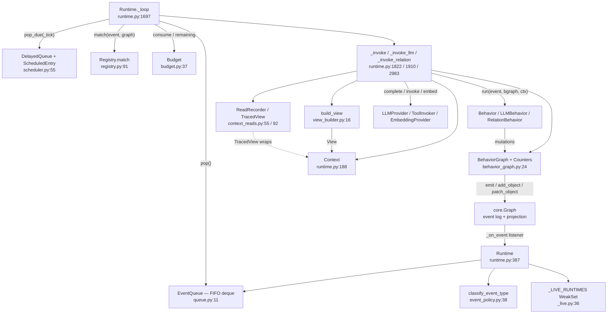

# Runtime Core

## Responsibility

`runtime-core` is the execution engine of `activegraph`. It subscribes to the event-sourced
`core.Graph`, classifies accepted events, enqueues behavior-schedulable ones into a single
in-process FIFO, pops them one at a time, asks the `Registry` which behaviors match, and invokes
each matching behavior against a runtime-built scoped `View` with a read-only query surface (its
returned handles are live, `activegraph/core/view.py:21-31`) plus a constrained mutation wrapper
(`BehaviorGraph`). Everything a behavior does —
mutations, LLM calls, tool calls, failures — is written back to the log as more events, which
re-enter the queue, until the queue drains (`runtime.idle`) or the `Budget` ends the run
(`runtime.budget_exhausted`). Dispatch is explicitly single-threaded, FIFO, no priority, no async
(`activegraph/runtime/queue.py:1`, `activegraph/runtime/runtime.py:1`).

The subsystem also owns the run-level time-travel surface — `save_state`, `Runtime.load`, `fork`,
`diff`, `promote` — because replay determinism is a property of the dispatch loop, not of the store.

Modules in scope: `runtime.py` (5204 lines), `scheduler.py`, `queue.py`, `behavior_graph.py`,
`view_builder.py`, `_live.py`, `context_reads.py`, and `event_policy.py`.

## Component map



Dispatch loop, verbatim in shape (`activegraph/runtime/runtime.py:1697-1734`):

```
while (queue or delayed) and budget_remaining:
    if stop(): return
    if queue:
        event = queue.pop()                                   # FIFO
        budget.consume("max_events")
        self._tick += 1                                       # the activate_after time axis
        for (b, rels, p_matches) in registry.match(event, graph):   # registration order
            if not budget_remaining: break
            if b.activate_after is not None: _schedule(b, event, p_matches); continue
            if p_matches: _emit_pattern_matched(b, event, p_matches)
            RelationBehavior -> for r in rels:
                                    if not budget_remaining: break
                                    _invoke_relation(b, r, event, p_matches)
            LLMBehavior      -> _invoke_llm(b, event, p_matches)
            else             -> _invoke(b, event, p_matches)
    _fire_due_delayed()                                       # all three behavior kinds
```

Entry points differ only in the `stop` predicate and whether they emit a terminal marker:

| Entry point | `stop` predicate | emits idle / exhausted |
|---|---|---|
| `run_goal` | `lambda: False` (delegates to `run_until_idle`) | yes |
| `run_until_idle` | `lambda: False` — `runtime.py:1494-1501` | idempotent idle/exhausted marker |
| `run_until(pred)` | `lambda: pred(self.graph)` — `runtime.py:1557-1564` | idempotent idle/exhausted marker |
| `run_quantum` | tick-count OR wall deadline — `runtime.py:1503-1555` | only if actually idle or exhausted |

## Key types & entry points

### Public API — the `Runtime` class

- `Runtime` — the orchestrator; its docstring states the whole execution model — `activegraph/runtime/runtime.py:387-405`
- `Runtime.__init__(graph, behaviors=None, frame=None, policy=None, budget=None, seed=0, *, persist_to=None, store=None, ...)` — `activegraph/runtime/runtime.py:407-448`
- `Runtime.close(timeout=5.0) -> bool`, `__enter__`, `__exit__` — deterministic sink shutdown and closed-state ownership; stores/listeners remain open — `activegraph/runtime/runtime.py:709-755`
- `Runtime.run_goal(goal, *, actor="user") -> None` — seeds a `goal.created` event, starts the budget, drains — `activegraph/runtime/runtime.py:1468-1492`
- `Runtime.run_until_idle() -> None` — drain to empty — `activegraph/runtime/runtime.py:1494-1501`
- `Runtime.run_quantum(*, max_queue_events=25, max_seconds=0.25) -> RunQuantumResult` — bounded cooperative drain — `activegraph/runtime/runtime.py:1503-1555`
- `Runtime.run_until(predicate: Callable[[Graph], bool]) -> None` — `activegraph/runtime/runtime.py:1557-1564`
- `Runtime.embed(texts, *, model=None, actor="runtime", caused_by=None) -> list[list[float]]` — the recorded/replayable embedding path — `activegraph/runtime/runtime.py:1566-1693`
- `Runtime.status(recent=20) -> RuntimeStatus` — frozen snapshot of log and process-local drain state — `activegraph/runtime/runtime.py:3069-3185`
- `Runtime.errors -> list[BehaviorFailure]` — uncached projection over `graph._events`, recomputed on each access — `activegraph/runtime/runtime.py:765-794`
- `Runtime.save_state(path=None) -> str`; `load`; `fork`; `diff`; `promote` — `activegraph/runtime/runtime.py:3646-4409`
- Sinks: `add_sink / remove_sink / sink_statuses / flush_sinks / close_sinks` — `activegraph/runtime/runtime.py:798-857`; `sink_statuses()` returns a tuple
- Packs: `load_pack / loaded_packs / disable_pack / get_behavior / get_tool` — `activegraph/runtime/runtime.py:3261-3487`
- Approvals: `pending_approvals / approve` — `activegraph/runtime/runtime.py:3491-3615`
- Governance: `dev_override / dev_overrides / validate_dev_override`; authority methods — `activegraph/runtime/runtime.py:859-1056`
- Trace: `trace` property plus `print_trace / export_trace / print_graph` methods — `activegraph/runtime/runtime.py:3618-3642`

### Data types owned here

- `Context` and helpers — invocation state and sanctioned embedding/proposal access — `activegraph/runtime/runtime.py:188-269`. Only an LLM invocation receives the configured provider; plain/relation contexts retain `None`.
- `BehaviorFailure` — NamedTuple of `behavior, event_id, reason, exception_type, message, failed_event_id` — `activegraph/runtime/runtime.py:275-299`
- `RunQuantumResult` — frozen dataclass; `elapsed_seconds` is deliberately never written to the log — `activegraph/runtime/runtime.py:301-316`

### Supporting modules

- `EventQueue` — `deque`-backed FIFO; `push` / `pop` / `__len__` / `__bool__`, no locking — `activegraph/runtime/queue.py:11-27`
- `DelayedQueue` + `ScheduledEntry` — pending `activate_after` invocations — `activegraph/runtime/scheduler.py:55-102`
- `parse_activate_after(spec) -> int` — accepts `int N>=1`, `"N"`, `"N event(s)"`; rejects `bool`, wall-clock units, `n < 1` — `activegraph/runtime/scheduler.py:154-233`
- `InvalidActivateAfter(RegistrationError, ValueError)` — `activegraph/runtime/scheduler.py:118-151`
- `BehaviorGraph` — the constrained mutation wrapper (`add_object`, `add_relation`, `patch_object`, `propose_patch`, `emit`, `get_object`, `get_relation`) plus `Counters` — `activegraph/runtime/behavior_graph.py:24-169`
- `build_view(behavior, event, graph) -> View` — `activegraph/runtime/view_builder.py:16-52`; `DEFAULT_RECENT_EVENTS = 50` at `activegraph/runtime/view_builder.py:13`
- `ReadRecorder`, `TracedView`, `context_read_payload`, `CONTEXT_READ_ID_CAP = 200` — `activegraph/runtime/context_reads.py:52-143`
- `track_runtime` / `untrack_runtime` / `live_runtimes` / validation over a module-level `_LIVE_RUNTIMES: WeakSet` — `activegraph/runtime/_live.py:39-90`

## Interfaces & contracts at each seam

### runtime-core ↔ core

The primary seam is mostly runtime-to-core at import level: runtime imports core types from
`activegraph/runtime/runtime.py:91-95`, `behavior_graph.py:16-18`, `view_builder.py:8-10`, and
`context_reads.py:47-48`. Core has a deliberate reverse edge through function-local runtime error
imports (`activegraph/core/graph.py:133,547,811,915,919,972,1162-1191`), keeping import-time
initialization acyclic. Control flows the other direction at runtime:
`Runtime.__init__` registers `self._on_event` as a graph listener
(`activegraph/runtime/runtime.py:635`), and `Graph.emit` appends → projects → optionally persists → offers to
sinks → *then* calls listeners synchronously outside the sink lock
(`activegraph/core/graph.py:584-625`). The runtime sees an event after in-memory acceptance and,
when a store is attached, durable append; a listener re-entering `emit` cannot reorder sink
observation.

```ebnf
accept-notification ::= listener( event )
listener            ::= Runtime._on_event                     (* runtime.py:1060-1092 *)
event               ::= Event { id, type, payload, actor, frame_id, caused_by, timestamp }

policy              ::= classify_event_type(event.type)
disposition         ::= Suppressed | Enqueued
Suppressed          ::= runtime._promote_quiescent | not policy.schedules_behaviors
Enqueued            ::= policy.schedules_behaviors , queue.push(event),
                        gauge("activegraph_queue_depth")

graph-calls         ::= graph.emit( event )
                      | graph.add_object | add_relation | patch_object | propose_patch
                      | graph.get_object | get_relation
                      | graph.all_objects | all_relations
                      | graph.neighborhood( center, depth ) | objects_in_types( types )
                      | graph.ids.event | .frame | .run | graph.clock.now
                      | graph.attach_store( store )
internal-seam       ::= graph._replay_event( ev )             (* load / fork only *)
                      | graph.ids.reseed_from_events( events )
                      | graph._state.put_object | put_relation  (* snapshot materialization *)
                      | graph._sink_names_in_use()             (* duplicate-name pre-flight *)
                      | graph._remove_listener( listener )      (* construction rollback *)
```

Contract notes:

- `pack.loaded` and `pack.disabled` are queue-visible because `pack.` is not a bookkeeping prefix
  (`activegraph/runtime/event_policy.py:13-54`; `activegraph/packs/loader.py:306-318`;
  `activegraph/runtime/runtime.py:3399-3416`).
- Every emitted event increments `activegraph_events_emitted_total{event_type}`, lifecycle or not,
  and LLM/tool response metrics are recorded before suppression
  (`activegraph/runtime/runtime.py:1060-1079`).
- `_tick` advances only on popped queue events, so policy-suppressed events never move the
  `activate_after` time axis (`activegraph/runtime/runtime.py:1703-1709`).
- Constructor rollback removes the listener and any partially attached sinks and avoids live-set
  registration (`activegraph/runtime/runtime.py:635-663`). It is not a transaction over earlier
  store attachment or run-row creation.
- Snapshot materialization is fail-loud: a missing blob or hash mismatch raises
  `SnapshotIntegrityError` rather than silently producing wrong state
  (`activegraph/runtime/runtime.py:5031-5091`).
- The `_replay_event`, `_state.put_*`, `_sink_names_in_use`, and `_remove_listener` calls are
  underscore reaches marked `# noqa: SLF001 — internal seam by design`; they are named seams, not
  leaks. The replay seam is documented on the `core` side at `activegraph/core/graph.py:630-638`.

### runtime-core ↔ behaviors

`behaviors/` declares *what* should run (`on=`, `where=`, `pattern=`, `view=`, `activate_after=`,
`model=`, `tools=`, `output_schema=`); runtime-core decides *when* and supplies the execution frame.
The reverse direction is registration-time construction/validation: ordinary and pack decorators
call the shared factory (`activegraph/behaviors/decorators.py:133,226,285`;
`activegraph/packs/__init__.py:788,844,900`), whose timing parser delegates to
`parse_activate_after` (`activegraph/behaviors/_factory.py:24-33`). Global and LLM registration
paths validate against live runtimes (`activegraph/behaviors/decorators.py:101-102,255-256`).
`behaviors/base.py:146-183` calls `build_view` / `_resolve_event_path` /
`DEFAULT_RECENT_EVENTS` at runtime so a developer can inspect a prompt without a `Runtime`
(CONTRACT v0.6 #20). `Context` is imported in `behaviors/base.py:26` under `TYPE_CHECKING` only.

`priority` is preserved, reserved behavior metadata, not a dispatch input. The runtime iterates the registry
in registration order for plain, LLM, and relation behaviors; global/explicit behaviors precede
pack wrappers, delayed entries due on one tick remain FIFO, and
`Runtime.status().registered_behaviors` reports that same order. Unequal values and ties have
identical ordering semantics (`activegraph/runtime/registry.py:30-38,91-103`;
`activegraph/runtime/runtime.py:3146-3164`; CONTRACT #10).

```ebnf
invocation          ::= plain-invoke | llm-invoke | relation-invoke

plain-invoke        ::= "behavior.started"
                        behavior.run( event, behavior-graph, ctx )     (* runtime.py:1822-1908 *)
                        terminal
relation-invoke     ::= "relation_behavior.started"
                        behavior.run( relation, event, behavior-graph, ctx )
                        terminal                                        (* runtime.py:2983-3065 *)
llm-invoke          ::= "behavior.started" turn-loop
                        handler( event, behavior-graph, ctx, parsed )  (* runtime.py:1910-2561 *)
                        terminal

terminal            ::= completed | failed
completed           ::= "behavior.completed" { objects_created, relations_created,
                                               patches_applied, patches_proposed,
                                               events_emitted [, tool_calls] }
                        [ context-read ]
failed              ::= "behavior.failed" { behavior, event_id, exception_type,
                                            message, traceback [, reason] [, extras] }
                        [ context-read ]
context-read        ::= "context.read" { behavior, event_id, execution_event_id,
                                         object_ids, count [, truncated ] }
                        (* only when trace_context_reads AND read-set non-empty *)

ctx                 ::= Context { view, frame, policy, random, clock,
                                  llm_provider?, matches, settings,
                                  _runtime, _behavior_name, _event_id }
behavior-graph      ::= BehaviorGraph { actor, caused_by, frame_id,
                                        llm_request_event_id?, tool_request_event_ids,
                                        read_recorder? }

(* mutation surface offered back to the behavior — behavior_graph.py:72-169 *)
mutation            ::= graph.add_object( type, data )                 "->" Object
                      | graph.add_relation( source, target, type, data? ) "->" Relation
                      | graph.patch_object( target, updates )          "->" Patch
                      | graph.propose_patch( target, op?, value?, rationale?, evidence? ) "->" Patch
                      | graph.emit( event_type, payload )              "->" Event
read                ::= graph.get_object( id )      "->" Object?       (* traced on hit *)
                      | graph.get_relation( id )    "->" Relation?     (* never traced *)
                      | ctx.view.objects( type?, where? ) "->" [Object] (* traced *)
                      | ctx.view.relations(...) | ctx.view.events(...) (* untraced *)
ctx-helper          ::= ctx.pack_settings( pack_name ) "->" Settings?
                      | ctx.propose_object( object_type, data, reason? ) "->" proposal_id
                      | ctx.embed( texts, model? )     "->" [[float]]
provenance          ::= { actor, caused_by, frame_id,
                          llm_request_event_id?, tool_request_event_ids }

(* declarative surface the behavior owns, resolved by runtime-core *)
view-spec           ::= nil | "{" [ around ] [ depth ] [ include_types ] [ recent_events ] "}"
around              ::= "around" ":" event-path                        (* e.g. event.payload.object.id *)
depth               ::= "depth" ":" int                                (* default 1 *)
include_types       ::= "include_types" ":" [ string ]
recent_events       ::= "recent_events" ":" int                        (* default 50 *)
view-resolution     ::= nil-spec | anchored | typed | full             (* view_builder.py:16-52 *)
nil-spec            ::= all_objects, all_relations, events[-50:]
anchored            ::= graph.neighborhood(center, depth) [ filtered by include_types ]
typed               ::= graph.objects_in_types(include_types), all_relations
full                ::= all_objects, all_relations

activate-after-spec ::= int (* >= 1 *) | "N" | "N event" | "N events"
                        (* wall-clock units rejected: InvalidActivateAfter *)

registration-check  ::= constructor-bind | ensure-registry-bind | later-decoration-bind
capability-verdict  ::= Pass | raise InvalidRuntimeConfiguration
failure             ::= generation-controls-not-acknowledged
                      | deterministic-without-sampling-controls
                      | hard-cost-limit-without-output-bound-and-input-counter
model-verdict       ::= provider-recognizes-model
                      | no shipped provider recognizes model
                      | raise InvalidRuntimeConfiguration

runtime-owned-abort ::= ReplayDivergenceError | PromptIdentityError
```

Contract notes:

- Behaviors never receive the raw `Graph` — only `BehaviorGraph`
  (`activegraph/runtime/behavior_graph.py:1-8`). Provenance is stamped automatically and cannot be
  forged by the behavior (`activegraph/runtime/behavior_graph.py:36-67`).
- Plain, LLM, and relation terminal/context event shapes are emitted at
  `activegraph/runtime/runtime.py:1857-1908,1968-2000,2549-2561,3021-3065,3202-3228`.
- A behavior fires **once per event** regardless of how many pattern bindings matched; iterating
  `ctx.matches` is the developer's job (`activegraph/runtime/runtime.py:197-205`).
- Behavior failures are events, not exceptions: "Failures inside behaviors become `behavior.failed`
  events, not exceptions (CONTRACT v1.0 #4b) — read them from `errors`; exceptions surface only at
  construction and entry points" (`activegraph/runtime/runtime.py:398-400`). Exactly one WARNING log
  line is produced per failure because every failure routes through `_emit_behavior_failed`
  (`activegraph/runtime/runtime.py:2969-2979`).
- Runtime-owned replay/identity aborts escape translation: `ReplayDivergenceError` is re-raised in
  all three invocation paths (`activegraph/runtime/runtime.py:1867-1871,2529-2533,3031-3036`), and
  `PromptIdentityError` is re-raised before retry/translation (`:2250-2254`). Graph, store, and
  lifecycle acceptance can also fail independently of handler execution.
- Quantum bounds are cooperative between queue events (`activegraph/runtime/runtime.py:1535-1540`),
  while budget gates also occur within relation fan-out (`:1724-1728`), delayed relation fan-out
  (`:1792-1796`), the LLM turn/retry loop (`:2063-2141`), and tool dispatch (`:2409-2431`).
- `ctx.embed` is the sanctioned embedding path; calling `runtime.embedding_provider.embed` directly
  bypasses the event pair and the replay cache — the docstring notes this "cannot be prohibited in
  Python" (`activegraph/runtime/runtime.py:249-269`).
- `activate_after` is event-count only, never wall-clock, because wall-clock would break replay
  determinism (`activegraph/runtime/scheduler.py:1-8`, `:33-34`, `:155-171`).
- Binding validation runs at constructor, registry rebuild, and later decoration, including when
  `model=None` (`activegraph/runtime/_live.py:65-201`;
  `activegraph/runtime/runtime.py:628-633,1263-1277`). Cross-provider model checks consider all
  four shipped candidates and report every match (`activegraph/runtime/_live.py:204-325`); names
  no provider recognizes remain permissive.

### runtime-core ↔ runtime-governance

Governance (`registry.py`, `budget.py`, `authority.py`, `patterns.py`, `promote.py`, `diff.py`,
`dev_override.py`, and the error modules) sits in the same `runtime/` package but is a distinct
responsibility: it answers *which* behaviors match, *whether* the run may continue, and *what*
happened between two runs. The dispatch loop calls into it once per popped event (`registry.match`)
and once per invocation boundary (`budget.remaining` / `budget.consume`); the time-travel API calls
into `promote.py` and `diff.py`.

```ebnf
dispatch-query      ::= registry.match( event, graph ) "->" match-list   (* registry.py:52-112 *)
match-list          ::= { match-triple }                (* registration order *)
match-triple        ::= "(" behavior "," relation-list "," pattern-bindings ")"
behavior            ::= Behavior | LLMBehavior | RelationBehavior
relation-list       ::= { Relation }                    (* non-empty only for RelationBehavior *)
pattern-bindings    ::= { binding }                     (* empty when no pattern= *)

match-gate          ::= on-gate & pattern-only-policy-gate & pattern-gate & where-gate
on-gate             ::= behavior.on = {} | event.type in behavior.on
pattern-only-policy-gate ::= behavior.on != {}
                      | classify_event_type(event.type).triggers_pattern_only
pattern-gate        ::= behavior.pattern_matcher = nil
                      | behavior.pattern_matcher.matches(event, graph) != {}
where-gate          ::= behavior.where = nil | evaluate_where(behavior.where, event.payload)

budget-calls        ::= budget.start( read_wall_clock )
                      | budget.remaining( check_wall_clock ) "->" bool
                      | budget.consume( "max_events" | "max_behavior_calls"
                                      | "max_llm_calls" | "max_tool_calls" )
                      | budget.has_cost_limit() | cost_remaining(amount)
                      | cost_remaining_amount() | add_cost(x)
                      | budget.mark_exhausted(name) | exhausted_by() | snapshot()
budget-reason       ::= _budget_reason( name )  "->" v0.6 #11 reason code
                        (* runtime.py:4521-4525 *)

governance-api      ::= authority_ceiling | set_authority_ceiling
                      | evaluate_capability_authority                   (* runtime.py:963-1056 *)
                      | dev_override | dev_overrides | validate_dev_override (* :859-961 *)
                      | Runtime.diff( other ) "->" compute_diff( ... ) "->" Diff
                      | Runtime.promote( fork, dry_run? ) "->" PromotePlan | PromoteResult

governance-errors   ::= ReplayDivergenceError            (* errors.py — re-raised, never swallowed *)
                      | RuntimeClosedError               (* config_errors.py — closed mutator *)
                      | RuntimeContextRequiredError      (* exec_errors.py — Context helpers *)
                      | PromoteConflictError | PromoteLineageError
                      | InvalidRuntimeConfiguration      (* configuration/capability binding *)
                      | IncompatibleRuntimeState
                      | InvalidToolRegistration
```

Contract notes:

- Mutating entry points enforce the Runtime closed state and raise `RuntimeClosedError`
  (`activegraph/runtime/runtime.py:709-715`; `activegraph/runtime/config_errors.py:129-154`).
  Capability-binding failures are `InvalidRuntimeConfiguration` leaves
  (`activegraph/runtime/_live.py:93-201`).
- Registration order decides behavior order for a single event
  (`activegraph/runtime/registry.py:30-38,91-103`).
- `_ensure_registry` fails loud rather than at first call: `MissingProviderError` when an
  `LLMBehavior` exists with no provider (`activegraph/runtime/runtime.py:1256-1262`),
  `MissingToolError` when a behavior names an unregistered tool
  (`activegraph/runtime/runtime.py:1330-1387`), `InvalidToolRegistration` for non-`Tool` entries
  (`activegraph/runtime/runtime.py:1305-1312`). It rebuilds `self.tool_registry` and immutable
  per-behavior tool bindings on each entry-point pass (`:1284-1396`).
- Promote application is quiescent: delta events append/project/persist but never enqueue. The single
  reaction point is the `promote.applied` marker, emitted *before* the quiescent flag is raised so it
  alone is queue-visible (`activegraph/runtime/runtime.py:4282-4306`, quiescent delta at
  `:4324-4399`). Promote delta events are never requeued, identified by `actor` starting with
  `"promote:"` (`activegraph/runtime/runtime.py:4715-4721`).
- Promote is fail-closed and atomic: both-sides changes raise `PromoteConflictError` *before any
  mutation*; there is no semantic merge (`activegraph/runtime/runtime.py:4242-4249`). It trusts the
  store's lineage records over the caller's claim and requires direct same-store SQLite lineage
  (`:4160-4224`), then performs schema preflight (`:4251-4280`).
- Under strict replay the budget is clock-free: `_start_budget(read_wall_clock=False)` plus a
  recorded `_strict_wall_stop_sequence` reproduces the recorded wall stop by event count
  (`activegraph/runtime/runtime.py:1438-1466,4925-4952`).
- `patterns.py` is reached indirectly, via `behavior.pattern_matcher.matches(event, graph)`
  (`activegraph/runtime/registry.py:52-89`).

### runtime-core ↔ llm

`_invoke_llm` (`activegraph/runtime/runtime.py:1910-2000`) is a thin wrapper — budget consumption,
recorder/view/bgraph/ctx construction, `behavior.started`, then `_invoke_llm_body`, then
`_emit_context_read`. The split exists so the read-trace commit wraps all ~15 failure returns of the
body without restructuring the loop (`activegraph/runtime/runtime.py:1968-2000`); runtime-owned
replay/identity aborts skip trace emission because they are aborts, not commits. The wrapper consumes
its one `max_llm_calls` unit in `finally`. `_invoke_llm_body`
(`activegraph/runtime/runtime.py:2002-2561`) runs the turn loop. `Runtime.embed` is the separate,
recorded embedding path.

```ebnf
llm-turn            ::= llm-requested provider-call ( llm-success | llm-error )
llm-requested       ::= "llm.requested" { behavior, model, prompt_hash, deterministic,
                                          cache_hit, turn_index, prompt_normalized,
                                          [structured_output_mode], [attempt_index],
                                          [max_attempts], [retry_of], [prompt],
                                          [estimated_input_tokens], [estimated_cost_usd],
                                          [budget_remaining_usd] }
provider-call       ::= provider.complete( system, messages, model, max_tokens,
                                           temperature, top_p, output_schema,
                                           timeout_seconds, tools
                                           [, structured_output_mode="native"]
                                           [, prompt_hash, deterministic] )
                        "->" LLMResponse | raise LLMBehaviorError
                      | raise PromptIdentityError
llm-success         ::= "llm.responded" response.to_dict()
                        union { behavior, prompt_hash, turn_index }
llm-error           ::= "llm.responded" { behavior, prompt_hash, model, error,
                                           cache_hit, retryable, attempt_index,
                                           max_attempts, latency_seconds, cost_usd }

cost-gate           ::= provider.count_tokens( system, messages, model ) "->" int
                        provider.estimate_cost( input_tokens, output_tokens, model ) "->" Decimal
capability-probe    ::= provider.supports_native_structured_output( model ) "->" bool
                      | provider.recognizes_model( name ) "->" bool
                        (* both getattr-guarded: absent method = "no" *)
retryable-reason    ::= "llm.network_error" | "llm.rate_limited"      (* runtime.py:4438-4440 *)

embed-call          ::= embedding-requested ( cached | provider-embed )
                        ( embedding-success | embedding-error )
embedding-requested ::= "embedding.requested" { inputs_hash, model, input_count, cache_hit }
                        (* inputs_hash only — the input TEXT is never logged *)
provider-embed      ::= provider.embed( texts, model ) "->" [[float]]
embedding-success   ::= "embedding.responded" { inputs_hash, model, vectors, vector_count,
                                                 dimensions, cache_hit, error=nil }
embedding-error     ::= "embedding.responded" { inputs_hash, model, vectors=nil,
                                                 cache_hit=false, error }

turn-loop-failure   ::= "llm.prompt_assembly_error"
                      | "tool.max_turns_exhausted"
                      | _budget_reason( name )
```

Contract notes:

- Successful `llm.responded` adds behavior/hash/turn to `LLMResponse.to_dict()`; failed attempts use
  the separate error shape and omit `turn_index` (`activegraph/runtime/runtime.py:2370-2381,
  2872-2917`). Embedding success includes vector counts/dimensions, while its error shape omits
  those success-only fields (`:1678-1692,2825-2850`); request events never log input text
  (`:1598-1616`).
- Retry contract: `_is_transient_llm_reason` is
  `frozenset({"llm.network_error", "llm.rate_limited"})` (`activegraph/runtime/runtime.py:4438-4440`).
  Retries emit a fresh `llm.requested` carrying `attempt_index`, `max_attempts`, and `retry_of`
  pointing at the first attempt's id (`activegraph/runtime/runtime.py:2160-2164`); `caused_by` chains
  to the previous error event (`:2183-2187,2271-2281`). The full prompt body rides only turn 0 /
  attempt 0 (`:2165-2169`).
- Provenance stamping: `bgraph._llm_request_event_id` is set to the request whose response actually
  fed the handler (never a failed attempt), and `bgraph._tool_request_event_ids` to every tool request
  in the turn loop — both set just before the handler runs
  (`activegraph/runtime/runtime.py:2520-2527`), so every object/relation/patch the handler creates
  carries them (`activegraph/runtime/behavior_graph.py:51-62`).
- Strict replay never touches the network: `Runtime.embed` under `replay_strict` raises
  `ReplayDivergenceError` on a cache miss even when a provider is configured
  (`activegraph/runtime/runtime.py:1618-1645`).
- Strict replay pins prompt hashes: a live re-assembled prompt whose hash differs from the next
  recorded one raises `ReplayDivergenceError` pinned to the *new* `llm.requested` id
  (`activegraph/runtime/runtime.py:2193-2211`); the same holds for embedding hashes (`:1618-1645`).
- `recognizes_model` and `supports_native_structured_output` are both `getattr`-guarded, so a provider
  lacking either method is treated as answering "no" (`activegraph/runtime/_live.py:204-285`,
  `activegraph/runtime/runtime.py:1214-1241`). Prompt identity kwargs are conditional on
  `provider.accepts_prompt_identity` (`activegraph/runtime/runtime.py:2229-2249`).

### runtime-core ↔ tools

`_invoke_tool(*, behavior, event, tool, call, last_llm_request_id, ctx_frame) -> Optional[str]`
(`activegraph/runtime/runtime.py:2565-2579`) is called from inside the LLM turn loop, once per tool
call the model requested. It returns the `tool.requested` event id on success and `None` on failure —
by the time it returns `None` it has already emitted `behavior.failed`, so the caller only has to
bail out.

```ebnf
tool-dispatch       ::= tool-requested invoke tool-responded
tool-requested      ::= "tool.requested" { behavior, tool, args_hash, args,
                                           call_id, cache_hit [, deterministic] }
invoke              ::= tool_invoker.invoke( tool, input_obj, tool_ctx )
                        "->" ToolResponse | raise ToolError
tool_ctx            ::= ToolContext { behavior_name, event_id, frame, idempotency_key,
                                      timeout_seconds, logger,
                                      external_io_mode="runtime_recorded" }
tool-responded      ::= "tool.responded" { behavior, tool, args_hash,
                                           ( output | error ), cache_hit,
                                           latency_seconds, cost_usd [, deterministic] }
echo-back           ::= LLMMessage { role="tool", content=json(output),
                                     tool_use_id=call.id, tool_name=tool.name }

dispatch-order      ::= consume("max_tool_calls") hash-args validate-input
                        cache-lookup cost-gate emit-requested invoke
                        validate-output emit-responded stash-message
invoke-failure      ::= "tool.invalid_input" | "tool.invalid_output" | ToolError.reason
tool-loop-failure   ::= "tool.unknown_tool" | "tool.max_turns_exhausted"
```

Contract notes:

- An input-schema validation failure still emits a *complete* `tool.requested` + `tool.responded`
  (error) pair before failing, so the trace never shows a request without a response
  (`activegraph/runtime/runtime.py:2592-2628`).
- The `ToolContext` is built with `external_io_mode="runtime_recorded"` and a fresh
  `idempotency_key=uuid4()` per call (`activegraph/runtime/runtime.py:2672-2680`).
- A tool the LLM names must be declared on the behavior; an undeclared name fails the invocation
  rather than reaching the registry (`activegraph/runtime/runtime.py:2344-2359,2432-2457`).
- The tool result is handed back to the turn loop through `self._last_tool_result_message`
  (`activegraph/runtime/runtime.py:2770-2780`).
- Default invoker is `DirectToolInvoker()` (`activegraph/runtime/runtime.py:529`). Effective tools
  are resolved to immutable per-behavior tuples (`activegraph/runtime/runtime.py:1319-1396`), and
  provider definitions, authorization, canonicalization, and dispatch share that binding
  (`:2016-2021,2344-2350,2432-2457`).

### runtime-core ↔ store

Persistence is attached to the `Graph`, not held by the `Runtime`; runtime-core owns the *run-level*
operations — `save_state`, `load`, `fork`, `promote` — that read and write the store directly.
The backend-aware helper sends URLs through `activegraph.store.open_store` and bare paths through
SQLite (`activegraph/runtime/runtime.py:4610-4645`). Load accepts Postgres; fork and promote remain
SQLite-only (`:3783-3784,3945-3981,4160-4193`).

```ebnf
attach              ::= graph.attach_store( store )
persist             ::= store.append( event )                (* via Graph.emit *)
run-row             ::= store.upsert_run( created_at [, goal] [, frame_id] )

load                ::= Runtime.load( path, run_id?, **config ) "->" Runtime
load-sequence       ::= choose-run replay-log reseed attach rebuild-caches construct-dormant
                        requeue rebuild-approvals [verify] activate-metrics-and-sinks
choose-run          ::= run_id | _most_recent_run_id( path )   (* else FileNotFoundError *)
replay-log          ::= [ materialize-snapshot ] { graph._replay_event( ev ) }
materialize-snapshot::= (* iff events[0].type = "runtime.snapshot" *)
                        store.get_snapshot( state_hash )
                        "->" verify-hash "->" put_object* put_relation* prime-id-counters
                        (* mismatch => SnapshotIntegrityError *)
requeue             ::= { queue.push(e) | e in events after last "runtime.idle",
                                          classify_event_type(e.type).schedules_behaviors,
                                          e.id not in fired_on,
                                          not e.actor.startswith("promote:") }

fork                ::= Runtime.fork( at_event, label?, **config ) "->" Runtime
fork-precondition   ::= store isa SQLiteEventStore    (* else IncompatibleRuntimeState *)
                      & not mid_promote_block( at_event )
fork-copy           ::= SQLiteEventStore.fork_run( path, parent_run_id, new_run_id,
                                                   at_event_id, label, created_at )

promote             ::= Runtime.promote( fork, dry_run? ) "->" PromotePlan | PromoteResult
promote-precondition::= both isa SQLiteEventStore                (* IncompatibleRuntimeState *)
                      & same store path                          (* PromoteLineageError *)
                      & fork.record.parent_run_id = self.run_id  (* PromoteLineageError *)
                      & fork.record.forked_at_event_id != nil    (* PromoteLineageError *)
```

Contract notes:

- Both-or-neither on persistence: passing both `persist_to=` and `store=` raises
  `InvalidRuntimeConfiguration` — there is no silent precedence
  (`activegraph/runtime/runtime.py:564-601`).
- `save_state` cannot redirect an already-attached store
  (`activegraph/runtime/runtime.py:3646-3742`) and requires `path=` when none is attached.
- Load chooses/opens/replays/snapshot-materializes/attaches at
  `activegraph/runtime/runtime.py:3801-3817`, rebuilds caches at `:3819-3829`, constructs with
  dormant metrics/sinks at `:3831-3856`, requeues and approvals at `:3861-3872`, verifies at
  `:3874-3893`, then activates metrics/sinks at `:3895-3902`.
- Requeue uses the shared scheduling policy (`activegraph/runtime/event_policy.py:13-54`;
  `activegraph/runtime/runtime.py:4690-4725`). The high-water mark is the last `runtime.idle`, **not**
  `runtime.budget_exhausted`, which fires with a possibly non-empty queue and is exactly the resume
  case v0.5 #8 exists for (`activegraph/runtime/runtime.py:4648-4725`).
- Fork requires SQLite (`activegraph/runtime/runtime.py:3945-4000`); a fork cut must not slice a
  promote block (`activegraph/runtime/runtime.py:5146-5180`).
- Forks get a fresh budget and `seed=0` but inherit
  `frame`, `policy`, `llm_provider`, `native_structured_output`, `trace_context_reads`, and the retry
  settings (`activegraph/runtime/runtime.py:4040-4087`).
- A fork's LLM, tool, and embedding caches are independently built from the **parent's** full log,
  not the truncated fork (`activegraph/runtime/runtime.py:4019-4037`).
- Structural bookkeeping and exact `context.read` are excluded from strict-replay stream
  comparison, so a verify pass (which runs with
  tracing off) never diverges on trace markers (`activegraph/runtime/event_policy.py:25-53`;
  `activegraph/runtime/runtime.py:4769-4775,4889-4910`). `Runtime.close()` deliberately does not
  close the attached store (`activegraph/runtime/runtime.py:717-733`).

### runtime-core ↔ sinks

Five sink methods delegate to `self.graph` and inject runtime metrics
(`activegraph/runtime/runtime.py:798-857`); `Runtime.close()` additionally owns deterministic
shutdown, closed-state transition, retry, and live-runtime untracking (`:709-755`). Config
normalization and attachment live at `activegraph/runtime/runtime.py:4573-4600,646-663`. In the
inbound direction, `sinks/conformance.py:21` imports `Runtime` at module level to
drive a real runtime — the only non-`TYPE_CHECKING`, non-lazy import of `Runtime` outside
`activegraph/__init__.py`.

```ebnf
sink-api            ::= runtime.add_sink( sink | config ) "->" delegate( graph, metrics )
                      | runtime.remove_sink( name )
                      | runtime.sink_statuses() "->" tuple[ SinkStatus, ... ]
                      | runtime.flush_sinks() | runtime.close_sinks()
preflight           ::= graph._sink_names_in_use()          (* duplicate-name check, runtime.py:449-461 *)
attach              ::= _attach_sink_configs( configs )
                        (* all-or-nothing: partial attachment is rolled back *)
failure             ::= raise ... after rollback + graph._remove_listener(self._on_event)
```

Contract notes:

- Sink attachment is atomic from the caller's view: partial attachment is rolled back
  (`activegraph/runtime/runtime.py:646-663`), and a construction that fails during attachment removes
  the graph listener before re-raising (`:635-644`).
- `Graph.emit` offers to sinks *before* notifying listeners, so sink ordering is unaffected by
  behaviors re-entering `emit` (`activegraph/core/graph.py:584-625`).

### runtime-core ↔ observability

Structured logging, metrics, and the frozen status DTOs. `get_logger("activegraph.runtime")` plus
`runtime_log_extra(...)` produce the INFO enqueue and WARNING failure lines; the native-fallback
DEBUG line is direct (`activegraph/runtime/runtime.py:550,1084-1092,1234-1239,2969-2979`).
`Metrics` defaults to `NoOpMetrics` (`:542-550`). `Runtime.status()` assembles
`RuntimeStatus`, `BehaviorInfo`, `BudgetSnapshot`, `EventSummary`, `FrameSnapshot`
(`activegraph/observability/status.py:26-79`; `activegraph/runtime/runtime.py:3069-3185`).

```ebnf
metric              ::= counter | gauge | histogram
counter             ::= "activegraph_events_emitted_total"    { event_type }
                      | "activegraph_behaviors_invoked_total" { behavior }
                      | "activegraph_behaviors_failed_total"  { behavior, reason }
                      | "activegraph_llm_calls_total" | "activegraph_llm_cache_hits_total"
                      | "activegraph_llm_failed_total"
                      | "activegraph_tools_calls_total" | "activegraph_tools_cache_hits_total"
                      | "activegraph_tools_failed_total"
                      | "activegraph_patterns_evaluated_total"
                      | "activegraph_replay_divergence_detected_total"
gauge               ::= "activegraph_queue_depth"
                      | "activegraph_budget_cost_remaining_usd"
                      | "activegraph_budget_events_remaining"
histogram           ::= "activegraph_behaviors_duration_seconds"
                      | "activegraph_llm_tokens_in" | "activegraph_llm_tokens_out"
                      | "activegraph_llm_cost_usd" | "activegraph_tools_duration_seconds"
                      | "activegraph_patterns_evaluation_duration_seconds"

log-line            ::= INFO  "event emitted"   extra{ run_id, event_id }
                      | WARN  "behavior failed" extra{ run_id, event_id, behavior, reason,
                                                       error_type, error_message, doc_url }
                      | DEBUG "schema outside native subset"
doc_url             ::= DOCS_BASE_URL "/errors/" slug
slug                ::= "llm-behavior-error"  (* reason "llm.*"    *)
                      | "tool-error"          (* reason "tool.*"   *)
                      | "budget-exhausted"    (* reason "budget.*" *)
                      | "execution-error"     (* default           *)

status              ::= runtime.status( recent? ) "->" RuntimeStatus
                        { run_id, state, behaviors, budget, recent_events, frame, ... }
```

Contract notes:

- `_REASON_PREFIX_TO_DOC_SLUG` (`activegraph/runtime/runtime.py:339-357`) maps a failure reason prefix
  to the `doc_url` attached to the single WARNING line per failure.
- During a local public drain, `status()` overlays `running` through a reference-counted lock; only
  dormant state scans backward for idle/exhausted, so a freshly loaded dormant runtime agrees with
  the saved log (`activegraph/runtime/runtime.py:3123-3137`).
- `Runtime.errors` is a pure projection with no caching and no listener, recomputed from
  `graph._events` on every access — by explicit design
  (`activegraph/runtime/runtime.py:765-794`).
- `trace/` is imported under `TYPE_CHECKING` only (`activegraph/runtime/runtime.py:156-158`); the
  `trace` property and print/export delegates are at `:3618-3642`.
- Runtime produces the 20 names above at `activegraph/runtime/runtime.py:665-705,1060-1212,
  1850-1893,1934-1937,2542-2547,2961-2967,2990-2993,3044-3049`; the authoritative catalog and tag
  sets are `activegraph/observability/metrics.py:202-347`.
- Load/fork keep requested metrics dormant during reconstruction, then activate them only after
  replay/verification (`activegraph/runtime/runtime.py:3798-3801,3831-3850,3895-3902,
  3941-3944,4069-4070,4097-4104`).

### runtime-core ↔ packs

`Runtime.load_pack` is the public front door (`activegraph/runtime/runtime.py:3261-3273`) and
delegates to `load_pack_into_runtime(rt, pack, settings=...)` (`activegraph/packs/loader.py:55`),
which prepares staged copies before committing loaded/settings/owner/spec/policy state, canonical
tool/behavior lists, registry invalidation, and validators (`activegraph/packs/loader.py:234-304`),
then emits `pack.loaded` (`:306-318`). `_ensure_registry` merges pack behaviors/tools and resolves
bindings (`activegraph/runtime/runtime.py:1249-1396`). Pack decorators reuse the same behavior
factory (`activegraph/packs/__init__.py:788,844,900`;
`activegraph/behaviors/_factory.py:24-33`).

```ebnf
pack-load           ::= runtime.load_pack( pack, settings? ) "->" bool
                        (* True = first load; False = same (name, version) already loaded *)
delegate            ::= load_pack_into_runtime( rt, pack, settings )
mutations           ::= rt._pack_behaviors.extend( behaviors )
                      | rt._pack_tools.extend( canonical_tool_copies )
                      | rt._pack_state.pack_settings[ name ] = settings_obj
merge-point         ::= _ensure_registry()   (* next run; rebuilds tool_registry wholesale *)
lookup              ::= runtime.get_behavior( name ) | runtime.get_tool( name )
                      | runtime.loaded_packs() | runtime.disable_pack( name )
settings-read       ::= ctx.pack_settings( pack_name ) "->" Settings?
failure             ::= PackVersionConflictError | PackConflictError
                      | PackSettingsMissingError | invalid-tool-membership
                        (* conflicts/settings preparation precede substantive registry/schema mutation;
                           the final pack.loaded emit is not covered by absolute rollback *)
```

Contract note: `pack.loaded` is deliberately kept queue-visible (CONTRACT v0.9 #13) so pack-aware
behaviors can subscribe to it (`activegraph/runtime/event_policy.py:13-54`). Invalid tool
membership is rejected at `activegraph/packs/loader.py:63-66`, and missing/invalid settings at
`:560-584,627-660`.

### runtime-core ↔ cli / sandbox / store.retention (inbound run drivers)

Persisted-run inspection/manipulation paths load logs. Sandbox and retention explicitly isolate
from the decorator registry with `behaviors=[]`; fresh-run quickstart constructs `Runtime`
directly (`activegraph/cli/quickstart.py:110,408`).

```ebnf
cli-driver          ::= Runtime.load( path [, run_id ] )
                        (* cli/main.py:301,538,821,857-858,946-947,1038;
                           persisted CLI paths normally omit behaviors=[] *)
                        rt.status( recent=tail )              (* cli/main.py:322,375 *)
                        rt.diff( other ) | rt.promote( fork, dry_run? )
private-reach       ::= from activegraph.runtime.runtime import _now_iso  (* cli/main.py:609 *)

sandbox-child       ::= Runtime.load( ... ) rt.run_until_idle()
                        (* sandbox/_child.py:255-260 — the child process's whole job *)
sandbox-fork        ::= Runtime.load( store_path, run_id=parent_run_id, behaviors=[] )
                        parent_rt.fork( at_event=..., label=..., behaviors=[] )
                        (* sandbox/__init__.py:435,506 *)

retention-driver    ::= Runtime.load( path, run_id=run_id, behaviors=[] )
                        (* store/retention.py:273-276 — load purely to read projected state *)

package-surface     ::= from activegraph.runtime.runtime import
                            BehaviorFailure, RunQuantumResult, Runtime   (* __init__.py:73 *)
                      | from activegraph.runtime.scheduler import
                            InvalidActivateAfter                          (* __init__.py:39 *)
```

Contract notes:

- `run_quantum` validates its arguments strictly — `TypeError` for `bool` / non-`int`
  `max_queue_events`, `ValueError` for `< 1`; `TypeError` for non-number `max_seconds`, `ValueError`
  for non-finite or `<= 0` (`activegraph/runtime/runtime.py:1518-1526`). Its key promise to a host is
  that **it must not claim false idle**: no `runtime.idle` marker while work remains
  (`:1535-1555`).
- `RunQuantumResult.elapsed_seconds` is deliberately never written to the log, "so hosts can schedule
  fairly without weakening replay determinism" (`activegraph/runtime/runtime.py:301-307`).
- `_emit_idle_or_exhausted` (`activegraph/runtime/runtime.py:3230-3255`) is idempotent via
  `_idle_emitted`, and on a `max_seconds` exhaustion additionally records a `stop_position` block
  (`accepted_sequence`, `event_tick`, `queue_depth`, `delayed_depth`).
- Private-symbol seams a public-API doc should name explicitly: `cli/main.py:609` imports `_now_iso`;
  `packs/loader.py` writes `rt._pack_behaviors` / `rt._pack_tools`; `_requeue_unfired` writes
  `rt._queue` and `rt._idle_emitted` directly, bypassing `_on_event`
  (`activegraph/runtime/runtime.py:4722-4725`).

### Internal contract: `activate_after` scheduling and context-read tracing

Both live entirely inside runtime-core but define observable event contracts, so they are recorded
here rather than under a package seam.

```ebnf
schedule-request    ::= "behavior.scheduled" { behavior, event_id, activate_after,
                                               fire_at_tick, current_tick }
                        delayed.push( entry )                   (* runtime.py:1738-1763 *)
entry               ::= ScheduledEntry { behavior, behavior_name, triggering_event_id,
                                         fire_at_event_count, scheduled_event_id }
fire-query          ::= delayed.pop_due( tick ) "->" { entry }  (* scheduler.py:86-99 *)
                        (* entry.fire_at_event_count <= tick *)
fire-decision       ::= Skip | Fire | Defer
Skip                ::= behavior-identity-gone-or-renamed | event-gone
                      | current-registry-rematch-fails
                        (* silent — absence of behavior.started is the only evidence *)
Defer               ::= budget-exhausted "->" restore-entire-unstarted-due-suffix, break
Fire                ::= plain-invoke | llm-invoke | relation-invoke

traced-read         ::= ctx.view.objects( ... )                 (* context_reads.py:92-114 *)
                      | bgraph.get_object( id ) on HIT only     (* behavior_graph.py:157-163 *)
                      | prompt-serialized objects (LLM only)    (* runtime.py:2042-2048 *)
untraced-read       ::= ctx.view.relations | ctx.view.events
                      | bgraph.get_relation( id )               (* behavior_graph.py:165-169 *)
                      | pushed event / relation arguments
                      | tool reads through a closed-over raw Graph
                      | runtime-internal reads (pattern matching, view construction)
commit              ::= "context.read" emitted once per COMMITTED execution,
                        immediately after the terminal lifecycle event,
                        only if the read set is non-empty      (* runtime.py:3202-3228 *)
cap                 ::= 200 ids; `count` exact past the cap; `truncated: true` marks the cut
                        (* CONTEXT_READ_ID_CAP — context_reads.py:50-52, :133-142 *)
```

Contract notes:

- `_fire_due_delayed` runs after every tick. Pre-entry exhaustion restores the entire unstarted due
  suffix at the front; exact behavior identity/name, triggering-event existence, and current
  registry re-match determine silent skip/fire (`activegraph/runtime/runtime.py:1765-1800`;
  `activegraph/runtime/scheduler.py:86-99`; `activegraph/runtime/registry.py:52-89,114-128`).
  Relation fan-out checks budget between relations and is non-resumable once started
  (`activegraph/runtime/runtime.py:1792-1796`; `activegraph/runtime/scheduler.py:25-33`).
- Context-read tracing is opt-in via `trace_context_reads=True`, default `False`, so pre-v1.10 logs
  stay byte-identical (`activegraph/runtime/runtime.py:444-448`). A *failed* frame still commits its
  trace (`:1882-1887,1977-2000,3036-3043`).
- Prompt-serialized objects are recorded at assembly time on the **unwrapped** view, so the
  bookkeeping never re-enters the traced accessor (`activegraph/runtime/runtime.py:2042-2048`).
- Read-set order is first-read insertion order — a plain list plus a set, no timestamps, no set
  iteration (`activegraph/runtime/context_reads.py:55-83`).

## Sequence: an LLM behavior fires, calls a tool, and its mutation re-enters the queue

```mermaid
sequenceDiagram
    autonumber
    participant App as caller
    participant RT as Runtime
    participant G as core.Graph
    participant Q as EventQueue
    participant REG as Registry
    participant B as LLMBehavior
    participant P as LLMProvider
    participant T as Tool

    App->>RT: run_goal(goal)
    RT->>RT: _ensure_registry()
    RT->>G: emit(goal.created)
    G-->>RT: _on_event(goal.created)
    RT->>Q: push(goal.created)
    RT->>RT: _loop(stop)
    RT->>Q: pop()
    Q-->>RT: goal.created
    RT->>RT: budget.consume("max_events"); _tick += 1
    RT->>REG: match(event, graph)
    REG-->>RT: [(behavior, [], pattern_matches)]
    RT->>RT: _invoke_llm: build_view / BehaviorGraph / Context
    RT->>G: emit(behavior.started)
    RT->>RT: build tool_defs from resolved bound tools
    RT->>B: build_prompt(event, graph, frame, structured_output_mode)
    B-->>RT: AssembledPrompt
    RT->>G: emit(llm.requested) [turn 0]
    RT->>P: complete(system, messages, model, tools,<br/>optional native/prompt-identity kwargs)
    P-->>RT: LLMResponse(tool_calls=[call])
    RT->>G: emit(llm.responded)
    RT->>G: emit(tool.requested)
    RT->>T: tool_invoker.invoke(tool, input_obj, tool_ctx)
    T-->>RT: output
    RT->>G: emit(tool.responded)
    RT->>G: emit(llm.requested) [turn 1, + tool result message]
    RT->>P: complete(...)
    P-->>RT: LLMResponse(parsed)
    RT->>G: emit(llm.responded)
    RT->>RT: stamp bgraph provenance ids
    RT->>B: handler(event, bgraph, ctx, parsed)
    B->>G: bgraph.add_object(type, data)
    G-->>RT: _on_event(object.created)
    RT->>Q: push(object.created)
    RT->>G: emit(behavior.completed)
    opt trace_context_reads and non-empty read set
        RT->>G: emit(context.read)
    end
    RT->>RT: _fire_due_delayed()
    Note over RT,Q: loop repeats on object.created, then drains
    RT->>G: emit(runtime.idle)
```

Every `llm.*`, `tool.*`, `behavior.*`, `embedding.*`, and `context.read` event is classified as
bookkeeping and excluded from scheduling (`activegraph/runtime/event_policy.py:13-54`;
`activegraph/runtime/runtime.py:1060-1083`). Within this sequence, only `object.created` re-enters
the queue, which is what makes the loop converge. Current anchors are
`activegraph/runtime/runtime.py:1468-1501,1697-1734,1910-2781,3189-3228`.

## Open questions

1. **Resolved — `_inside_dispatch` was removed.** Current constructor state is
   `activegraph/runtime/runtime.py:449-644`; no live source path reads or writes that vestige.

2. **Resolved — `where_recheck_path` was removed.** `ScheduledEntry` stores the exact behavior
   object plus four identity/scheduling fields (`activegraph/runtime/scheduler.py:55-61`), and
   delayed fire delegates current re-match to `Registry._match_behavior`
   (`activegraph/runtime/runtime.py:1784`; `activegraph/runtime/registry.py:52-89`).

3. **Resolved — the abandoned running-message variable was removed.** The working handoff is
   `_last_tool_result_message` (`activegraph/runtime/runtime.py:536-539,2462-2467,2770-2780`).

4. **Resolved — event-type policy has one shared owner with purpose-specific fields.**
   `classify_event_type` distinguishes scheduling/pattern-only triggers, diff inclusion, and strict
   replay inclusion (`activegraph/runtime/event_policy.py:13-54`). Scheduling and pattern-only
   triggers exclude all bookkeeping prefixes plus exact `context.read`; diff excludes only
   structural `behavior.` / `relation_behavior.` / `runtime.`; strict replay excludes those
   structural prefixes plus exact `context.read`. Live dispatch, requeue, registry, diff, and
   strict replay use those fields (`activegraph/runtime/runtime.py:1078,4711,4773,4890,4901,4909`;
   `activegraph/runtime/registry.py:65`; `activegraph/runtime/diff.py:104-107`). Consequently,
   `embedding.*` neither enqueues nor advances `_tick`, even for explicit `on=` subscriptions.

5. **Resolved — delayed relation behaviors dispatch against current candidates and pattern state.**
   Exact behavior identity prevents rebuilt registries from inheriting old work; pack disable
   cancels owned entries; pre-entry exhaustion restores the FIFO suffix; started relation fan-out
   is non-resumable (`activegraph/runtime/runtime.py:1765-1800,3380-3386`;
   `activegraph/runtime/scheduler.py:55-99`).

6. **Resolved — the redundant conditional-expression LLM cache write was removed.** Successful
   uncached response handling has one ordinary cache block
   (`activegraph/runtime/runtime.py:2361-2368`).

7. **Resolved boundary — core's reverse edge is lazy error imports.** The seven current sites are
   `activegraph/core/graph.py:133,547,811,915,919,972,1162-1191`; no runtime behavior/protocol is
   imported at core module initialization.

**Performance observations (not correctness):**

- `_find_event(event_id)` is a linear scan of the entire event log
  (`activegraph/runtime/runtime.py:1802-1806`), called by delayed fire (`:1781`) and
  `validate_dev_override` (`:933`). O(n) per lookup against a log that grows for the life of the
  run.
- `Runtime.errors` walks all of `graph._events` on every property access
  (`activegraph/runtime/runtime.py:765-794`), by explicit design.
- `_ensure_registry` rebuilds the tool registry and bindings at
  `activegraph/runtime/runtime.py:1284-1328`; every drain entry calls it
  (`:1471,1497,1529,1560`). For a host driving quanta in a tight loop this is per-quantum work
  proportional to tool/binding count.
