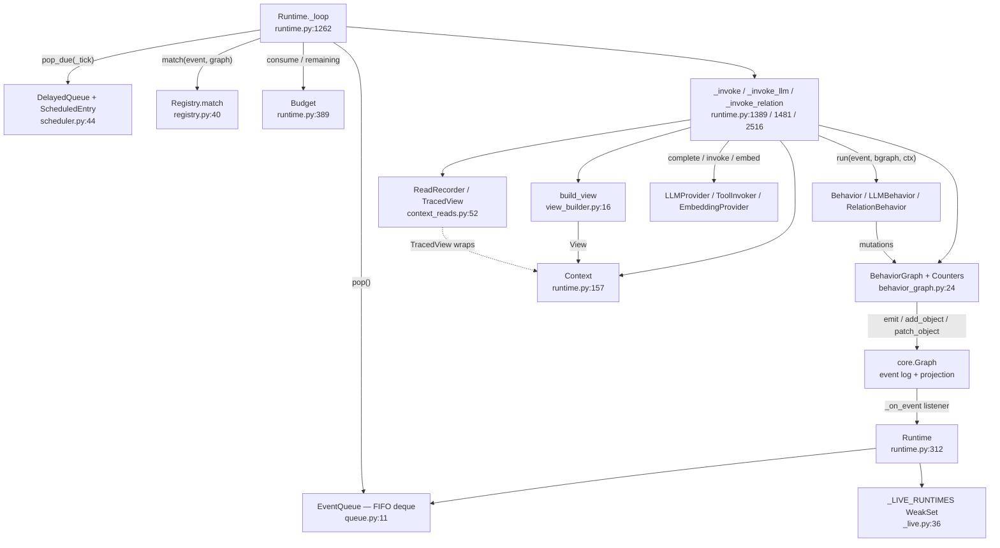

# Runtime Core

## Responsibility

`runtime-core` is the execution engine of `activegraph`. It subscribes to the event-sourced
`core.Graph`, enqueues accepted events into a single in-process FIFO, pops them one at a time, asks
the `Registry` which behaviors match, and invokes each matching behavior against a runtime-built
read-only `View` plus a constrained mutation wrapper (`BehaviorGraph`). Everything a behavior does —
mutations, LLM calls, tool calls, failures — is written back to the log as more events, which
re-enter the queue, until the queue drains (`runtime.idle`) or the `Budget` ends the run
(`runtime.budget_exhausted`). Dispatch is explicitly single-threaded, FIFO, no priority, no async
(`activegraph/runtime/queue.py:1`, `activegraph/runtime/runtime.py:1`).

The subsystem also owns the run-level time-travel surface — `save_state`, `Runtime.load`, `fork`,
`diff`, `promote` — because replay determinism is a property of the dispatch loop, not of the store.

Modules in scope: `runtime.py` (4662 lines), `scheduler.py`, `queue.py`, `behavior_graph.py`,
`view_builder.py`, `_live.py`, `context_reads.py`.

## Component map



Dispatch loop, verbatim in shape (`activegraph/runtime/runtime.py:1262-1298`):

```
while (queue or delayed) and budget_remaining:
    if stop(): return
    if queue:
        event = queue.pop()                                   # FIFO
        budget.consume("max_events")
        self._tick += 1                                       # the activate_after time axis
        for (b, rels, p_matches) in registry.match(event, graph):   # registration order
            if not budget_remaining: break
            if b.activate_after is not None: _schedule(b, event, p_matches); continue
            if p_matches: _emit_pattern_matched(b, event, p_matches)
            RelationBehavior -> for r in rels: _invoke_relation(b, r, event, p_matches)
            LLMBehavior      -> _invoke_llm(b, event, p_matches)
            else             -> _invoke(b, event, p_matches)
    _fire_due_delayed()                                       # after EVERY tick
```

Entry points differ only in the `stop` predicate and whether they emit a terminal marker:

| Entry point | `stop` predicate | emits idle / exhausted |
|---|---|---|
| `run_goal` | `lambda: False` (delegates to `run_until_idle`) | yes |
| `run_until_idle` | `lambda: False` — `runtime.py:1076` | always — `runtime.py:1077` |
| `run_until(pred)` | `lambda: pred(self.graph)` — `runtime.py:1133` | always — `runtime.py:1134` |
| `run_quantum` | tick-count OR wall deadline — `runtime.py:1109-1114` | only if actually idle or exhausted — `runtime.py:1117-1118` |

## Key types & entry points

### Public API — the `Runtime` class

- `Runtime` — the orchestrator; its docstring states the whole execution model — `activegraph/runtime/runtime.py:312-330`
- `Runtime.__init__(graph, behaviors=None, frame=None, policy=None, budget=None, seed=0, *, persist_to, store, replay_strict, llm_provider, replay_llm_cache, llm_cache, llm_retry_*, tools, replay_tool_cache, tool_cache, replay_reinvoke_deterministic, tool_invoker, metrics, sinks, native_structured_output, embedding_provider, replay_embedding_cache, embedding_cache, trace_context_reads)` — `activegraph/runtime/runtime.py:332-373`
- `Runtime.run_goal(goal, *, actor="user") -> None` — seeds a `goal.created` event, starts the budget, drains — `activegraph/runtime/runtime.py:1050-1070`
- `Runtime.run_until_idle() -> None` — drain to empty — `activegraph/runtime/runtime.py:1072-1077`
- `Runtime.run_quantum(*, max_queue_events=25, max_seconds=0.25) -> RunQuantumResult` — bounded cooperative drain — `activegraph/runtime/runtime.py:1079-1127`
- `Runtime.run_until(predicate: Callable[[Graph], bool]) -> None` — `activegraph/runtime/runtime.py:1129-1134`
- `Runtime.embed(texts, *, model=None, actor="runtime", caused_by=None) -> list[list[float]]` — the recorded/replayable embedding path — `activegraph/runtime/runtime.py:1136-1258`
- `Runtime.status(recent=20) -> RuntimeStatus` — frozen snapshot derived from the log — `activegraph/runtime/runtime.py:2592-2701`
- `Runtime.errors -> list[BehaviorFailure]` — uncached projection over `graph._events`, recomputed on each access — `activegraph/runtime/runtime.py:573-603`
- `Runtime.save_state(path=None) -> str` — `activegraph/runtime/runtime.py:3152-3247`
- `Runtime.load(path, run_id=None, **kw) -> Runtime` (classmethod) — `activegraph/runtime/runtime.py:3249-3391`
- `Runtime.fork(at_event, label=None, **kw) -> Runtime` — `activegraph/runtime/runtime.py:3393-3581`
- `Runtime.diff(other) -> Diff` — one-line delegate to `compute_diff` — `activegraph/runtime/runtime.py:3583-3584`
- `Runtime.promote(fork, *, dry_run=False) -> PromotePlan | PromoteResult` — `activegraph/runtime/runtime.py:3586-3887`
- Sinks: `add_sink / remove_sink / sink_statuses / flush_sinks / close_sinks` — thin delegates to `self.graph` — `activegraph/runtime/runtime.py:607-653`
- Packs: `load_pack / loaded_packs / disable_pack / get_behavior / get_tool` — `activegraph/runtime/runtime.py:2777-3010`
- Approvals: `pending_approvals / approve` — `activegraph/runtime/runtime.py:3024-3122`
- Governance: `dev_override / dev_overrides / validate_dev_override` — `activegraph/runtime/runtime.py:655-732`; `authority_ceiling / set_authority_ceiling / evaluate_capability_authority` — `activegraph/runtime/runtime.py:736-851`
- Trace: `trace / print_trace / export_trace / print_graph` — `activegraph/runtime/runtime.py:3124-3150`

### Data types owned here

- `Context` — the `ctx` every behavior receives: `view`, `frame`, `policy`, `random`, `clock`, `llm_provider`, `matches`, `settings`, `_runtime`, `_behavior_name`, `_event_id` — `activegraph/runtime/runtime.py:157-239`
- `Context.pack_settings(pack_name)` / `Context.propose_object(...)` / `Context.embed(...)` — `activegraph/runtime/runtime.py:182-239`
- `BehaviorFailure` — NamedTuple of `behavior, event_id, reason, exception_type, message, failed_event_id` — `activegraph/runtime/runtime.py:242-265`
- `RunQuantumResult` — frozen dataclass; `elapsed_seconds` is deliberately never written to the log — `activegraph/runtime/runtime.py:268-283`

### Supporting modules

- `EventQueue` — `deque`-backed FIFO; `push` / `pop` / `__len__` / `__bool__`, no locking — `activegraph/runtime/queue.py:11-27`
- `DelayedQueue` + `ScheduledEntry` — pending `activate_after` invocations — `activegraph/runtime/scheduler.py:44-75`
- `parse_activate_after(spec) -> int` — accepts `int N>=1`, `"N"`, `"N event(s)"`; rejects `bool`, wall-clock units, `n < 1` — `activegraph/runtime/scheduler.py:127-206`
- `InvalidActivateAfter(RegistrationError, ValueError)` — `activegraph/runtime/scheduler.py:91-124`
- `BehaviorGraph` — the constrained mutation wrapper (`add_object`, `add_relation`, `patch_object`, `propose_patch`, `emit`, `get_object`, `get_relation`) plus `Counters` — `activegraph/runtime/behavior_graph.py:24-169`
- `build_view(behavior, event, graph) -> View` — `activegraph/runtime/view_builder.py:16-52`; `DEFAULT_RECENT_EVENTS = 50` at `activegraph/runtime/view_builder.py:13`
- `ReadRecorder`, `TracedView`, `context_read_payload`, `CONTEXT_READ_ID_CAP = 200` — `activegraph/runtime/context_reads.py:52-143`
- `track_runtime` / `live_runtimes` / `validate_behavior_against_live_runtimes` over a module-level `_LIVE_RUNTIMES: WeakSet` — `activegraph/runtime/_live.py:36-148`

## Interfaces & contracts at each seam

### runtime-core ↔ core

The primary seam, and one-way at the import level: runtime-core imports `Event`, `Graph`,
`evaluate_where`, `GraphStore`, `IDGen`, `View`, `Object`, `Relation`, `Patch` from `core`
(`activegraph/runtime/runtime.py:81-87`, `activegraph/runtime/behavior_graph.py:16-18`,
`activegraph/runtime/view_builder.py:8-10`, `activegraph/runtime/context_reads.py:47-48`). No file in
runtime-core is imported by `core/`. Control flows the other direction at runtime:
`Runtime.__init__` registers `self._on_event` as a graph listener
(`activegraph/runtime/runtime.py:472`), and `Graph.emit` appends → projects → persists → offers to
sinks → *then* calls listeners synchronously outside the sink lock
(`activegraph/core/graph.py:564-606`). The runtime therefore sees an event only after it is durably
accepted, and a listener re-entering `emit` cannot reorder sink observation.

```ebnf
accept-notification ::= listener( event )
listener            ::= Runtime._on_event                     (* runtime.py:853 *)
event               ::= Event { id, type, payload, actor, frame_id, caused_by, timestamp }

disposition         ::= Suppressed | Enqueued
Suppressed          ::= quiescent-promote | lifecycle-type
quiescent-promote   ::= runtime._promote_quiescent = true     (* runtime.py:866 *)
lifecycle-type      ::= "behavior."          prefix | "relation_behavior." prefix
                      | "runtime."           prefix | "llm."               prefix
                      | "tool."              prefix | "pattern."           prefix
                      | "approval."          prefix | "dev."               prefix
                      | "authority."         prefix | "context.read"       (* exact *)
Enqueued            ::= queue.push(event) , gauge("activegraph_queue_depth")

graph-calls         ::= graph.emit( event )
                      | graph.add_object | add_relation | patch_object | propose_patch
                      | graph.get_object | get_relation
                      | graph.all_objects | all_relations
                      | graph.neighborhood( center, depth ) | objects_in_types( types )
                      | graph.ids.event | .frame | .run | graph.clock.now
                      | graph.attach_store( store )
internal-seam       ::= graph._replay_event( ev )             (* load / fork only *)
                      | graph.ids.reseed_from_events( events )
                      | graph._state.put_object | put_relation  (* snapshot materialization *)
                      | graph._sink_names_in_use()             (* duplicate-name pre-flight *)
                      | graph._remove_listener( listener )      (* construction rollback *)
```

Contract notes:

- `pack.loaded` is deliberately *not* suppressed, so pack-aware behaviors can subscribe
  (`activegraph/runtime/runtime.py:880-882`).
- Every emitted event increments `activegraph_events_emitted_total{event_type}`, lifecycle or not,
  before any suppression check (`activegraph/runtime/runtime.py:858-861`).
- `_tick` advances only on popped queue events, so suppressed lifecycle events never move the
  `activate_after` time axis (`activegraph/runtime/runtime.py:1272`).
- Construction is atomic with respect to the listener: if sink attachment throws, the listener is
  removed before re-raising (`activegraph/runtime/runtime.py:541-545`), and a failed construction
  never enters `_LIVE_RUNTIMES` (`activegraph/runtime/runtime.py:525-546`,
  `activegraph/runtime/_live.py:33-36`).
- Snapshot materialization is fail-loud: a missing blob or hash mismatch raises
  `SnapshotIntegrityError` rather than silently producing wrong state
  (`activegraph/runtime/runtime.py:4509-4520`).
- The `_replay_event`, `_state.put_*`, `_sink_names_in_use`, and `_remove_listener` calls are
  underscore reaches marked `# noqa: SLF001 — internal seam by design`; they are named seams, not
  leaks. The replay seam is documented on the `core` side at `activegraph/core/graph.py:610-613`.

### runtime-core ↔ behaviors

`behaviors/` declares *what* should run (`on=`, `where=`, `pattern=`, `view=`, `activate_after=`,
`model=`, `tools=`, `output_schema=`); runtime-core decides *when* and supplies the execution frame.
The reverse direction is registration-time validation: `behaviors/decorators.py` calls
`parse_activate_after` (`activegraph/behaviors/decorators.py:177,286,368`) and
`validate_behavior_against_live_runtimes` (`activegraph/behaviors/decorators.py:148,341`) at
decoration time, and `behaviors/base.py:155-161` calls `build_view` / `_resolve_event_path` /
`DEFAULT_RECENT_EVENTS` at runtime so a developer can inspect a prompt without a `Runtime`
(CONTRACT v0.6 #20). `Context` is imported in `behaviors/base.py:26` under `TYPE_CHECKING` only.

`priority` is preserved, reserved behavior metadata, not a dispatch input. The runtime iterates the registry
in registration order for plain, LLM, and relation behaviors; global/explicit behaviors precede
pack wrappers, delayed entries due on one tick remain FIFO, and
`Runtime.status().registered_behaviors` reports that same order. Unequal values and ties have
identical ordering semantics (CONTRACT #10).

```ebnf
invocation          ::= plain-invoke | llm-invoke | relation-invoke

plain-invoke        ::= "behavior.started"
                        behavior.run( event, behavior-graph, ctx )     (* runtime.py:1435 *)
                        terminal
relation-invoke     ::= "relation_behavior.started"
                        behavior.run( relation, event, behavior-graph, ctx )
                        terminal                                        (* runtime.py:2516 *)
llm-invoke          ::= "behavior.started" turn-loop
                        handler( event, behavior-graph, ctx, parsed )  (* runtime.py:2064 *)
                        terminal

terminal            ::= completed | failed
completed           ::= "behavior.completed" { objects_created, relations_created,
                                               patches_applied, patches_proposed,
                                               events_emitted [, tool_calls] }
                        [ context-read ]
failed              ::= "behavior.failed" { behavior, event_id, exception_type,
                                            message, traceback [, reason] [, extras] }
                        [ context-read ]
context-read        ::= "context.read" { behavior, event_id, execution_event_id,
                                         object_ids, count [, truncated ] }
                        (* only when trace_context_reads AND read-set non-empty *)

ctx                 ::= Context { view, frame, policy, random, clock,
                                  llm_provider?, matches, settings,
                                  _runtime, _behavior_name, _event_id }
behavior-graph      ::= BehaviorGraph { actor, caused_by, frame_id,
                                        llm_request_event_id?, tool_request_event_ids,
                                        read_recorder? }

(* mutation surface offered back to the behavior — behavior_graph.py:72-169 *)
mutation            ::= graph.add_object( type, data )                 "->" Object
                      | graph.add_relation( source, target, type, data? ) "->" Relation
                      | graph.patch_object( target, updates )          "->" Patch
                      | graph.propose_patch( target, op?, value?, rationale?, evidence? ) "->" Patch
                      | graph.emit( event_type, payload )              "->" Event
read                ::= graph.get_object( id )      "->" Object?       (* traced on hit *)
                      | graph.get_relation( id )    "->" Relation?     (* never traced *)
                      | ctx.view.objects( type?, where? ) "->" [Object] (* traced *)
                      | ctx.view.relations(...) | ctx.view.events(...) (* untraced *)
ctx-helper          ::= ctx.pack_settings( pack_name ) "->" Settings?
                      | ctx.propose_object( object_type, data, reason? ) "->" proposal_id
                      | ctx.embed( texts, model? )     "->" [[float]]
provenance          ::= { actor, caused_by, frame_id,
                          llm_request_event_id?, tool_request_event_ids }

(* declarative surface the behavior owns, resolved by runtime-core *)
view-spec           ::= nil | "{" [ around ] [ depth ] [ include_types ] [ recent_events ] "}"
around              ::= "around" ":" event-path                        (* e.g. event.payload.object.id *)
depth               ::= "depth" ":" int                                (* default 1 *)
include_types       ::= "include_types" ":" [ string ]
recent_events       ::= "recent_events" ":" int                        (* default 50 *)
view-resolution     ::= nil-spec | anchored | typed | full             (* view_builder.py:16-52 *)
nil-spec            ::= all_objects, all_relations, events[-50:]
anchored            ::= graph.neighborhood(center, depth) [ filtered by include_types ]
typed               ::= graph.objects_in_types(include_types), all_relations
full                ::= all_objects, all_relations

activate-after-spec ::= int (* >= 1 *) | "N" | "N event" | "N events"
                        (* wall-clock units rejected: InvalidActivateAfter *)

registration-check  ::= validate_behavior_against_live_runtimes( behavior )   (* _live.py:59 *)
applies-when        ::= behavior isa LLMBehavior & behavior.model != nil
                        & live_runtimes() != {}
verdict             ::= Pass | raise InvalidRuntimeConfiguration
Pass                ::= provider.recognizes_model( model )
                      | not exists other shipped provider claiming model      (* permissive *)

(* the ONLY exception permitted to escape a behavior *)
escape              ::= ReplayDivergenceError
```

Contract notes:

- Behaviors never receive the raw `Graph` — only `BehaviorGraph`
  (`activegraph/runtime/behavior_graph.py:1-8`). Provenance is stamped automatically and cannot be
  forged by the behavior (`activegraph/runtime/behavior_graph.py:36-67`).
- A behavior fires **once per event** regardless of how many pattern bindings matched; iterating
  `ctx.matches` is the developer's job (`activegraph/runtime/runtime.py:165-169`).
- Behavior failures are events, not exceptions: "Failures inside behaviors become `behavior.failed`
  events, not exceptions (CONTRACT v1.0 #4b) — read them from `errors`; exceptions surface only at
  construction and entry points" (`activegraph/runtime/runtime.py:325-327`). Exactly one WARNING log
  line is produced per failure because every failure routes through `_emit_behavior_failed`
  (`activegraph/runtime/runtime.py:2468-2478`).
- `ReplayDivergenceError` is caught and re-raised ahead of the generic handler in all three invoke
  paths (`activegraph/runtime/runtime.py:1436-1437`, `:2069-2070`, `:2563-2564`).
- Run-to-completion: one behavior invocation is atomic. The budget is re-checked only *between*
  invocations (`activegraph/runtime/runtime.py:1275`) and between queue events for `run_quantum`
  (`activegraph/runtime/runtime.py:1088-1090`).
- `ctx.embed` is the sanctioned embedding path; calling `runtime.embedding_provider.embed` directly
  bypasses the event pair and the replay cache — the docstring notes this "cannot be prohibited in
  Python" (`activegraph/runtime/runtime.py:222-227`).
- `activate_after` is event-count only, never wall-clock, because wall-clock would break replay
  determinism (`activegraph/runtime/scheduler.py:1-8`, `:33-34`, `:155-171`).
- Cross-provider model validation fires at **both** binding moments — `Runtime(...)` construction and
  `register()` / `@llm_behavior` decoration — via the module-level `WeakSet`
  (`activegraph/runtime/_live.py:1-19`, `:59-77`). It is permissive by default: names no shipped
  provider recognizes pass silently; only a *recognized* cross-provider mismatch raises
  (`activegraph/runtime/_live.py:85-100`).

### runtime-core ↔ runtime-governance

Governance (`registry.py`, `budget.py`, `authority.py`, `patterns.py`, `promote.py`, `diff.py`,
`dev_override.py`, and the error modules) sits in the same `runtime/` package but is a distinct
responsibility: it answers *which* behaviors match, *whether* the run may continue, and *what*
happened between two runs. The dispatch loop calls into it once per popped event (`registry.match`)
and once per invocation boundary (`budget.remaining` / `budget.consume`); the time-travel API calls
into `promote.py` and `diff.py`.

```ebnf
dispatch-query      ::= registry.match( event, graph ) "->" match-list   (* registry.py:40-70 *)
match-list          ::= { match-triple }                (* registration order *)
match-triple        ::= "(" behavior "," relation-list "," pattern-bindings ")"
behavior            ::= Behavior | LLMBehavior | RelationBehavior
relation-list       ::= { Relation }                    (* non-empty only for RelationBehavior *)
pattern-bindings    ::= { binding }                     (* empty when no pattern= *)

match-gate          ::= on-gate & lifecycle-gate & pattern-gate & where-gate
on-gate             ::= behavior.on = {} | event.type in behavior.on
lifecycle-gate      ::= behavior.on != {} | not is_lifecycle(event)
pattern-gate        ::= behavior.pattern_matcher = nil
                      | behavior.pattern_matcher.matches(event, graph) != {}
where-gate          ::= behavior.where = nil | evaluate_where(behavior.where, event.payload)

budget-calls        ::= budget.start( read_wall_clock )
                      | budget.remaining( check_wall_clock ) "->" bool
                      | budget.consume( "max_events" | "max_behavior_calls"
                                      | "max_llm_calls" | "max_tool_calls" )
                      | budget.has_cost_limit() | cost_remaining(amount)
                      | cost_remaining_amount() | add_cost(x)
                      | budget.mark_exhausted(name) | exhausted_by() | snapshot()
budget-reason       ::= _budget_reason( name )  "->" v0.6 #11 reason code
                        (* _BUDGET_REASON_MAP — runtime.py:3902, :3968 *)

governance-api      ::= authority_ceiling | set_authority_ceiling
                      | evaluate_capability_authority                   (* runtime.py:736-851 *)
                      | dev_override | dev_overrides | validate_dev_override (* :655-732 *)
                      | Runtime.diff( other ) "->" compute_diff( ... ) "->" Diff
                      | Runtime.promote( fork, dry_run? ) "->" PromotePlan | PromoteResult

governance-errors   ::= ReplayDivergenceError            (* errors.py — re-raised, never swallowed *)
                      | RuntimeContextRequiredError      (* exec_errors.py — runtime.py:209, :230 *)
                      | PromoteConflictError | PromoteLineageError      (* runtime.py:3629-3632 *)
                      | InvalidRuntimeConfiguration      (* config_errors.py — runtime.py:477 *)
                      | IncompatibleRuntimeState         (* runtime.py:3433, :3640 *)
                      | InvalidToolRegistration          (* registration_errors.py — runtime.py:1008 *)
```

Contract notes:

- Registration order decides behavior order for a single event
  (`activegraph/runtime/registry.py:1`, `:48-69`).
- `_ensure_registry` fails loud rather than at first call: `MissingProviderError` when an
  `LLMBehavior` exists with no provider (`activegraph/runtime/runtime.py:965-968`),
  `MissingToolError` when a behavior names an unregistered tool
  (`activegraph/runtime/runtime.py:1024-1029`), `InvalidToolRegistration` for non-`Tool` entries
  (`activegraph/runtime/runtime.py:1007-1011`). It rebuilds `self.tool_registry` from scratch on
  every entry-point call (`activegraph/runtime/runtime.py:984-1018`).
- Promote application is quiescent: delta events append/project/persist but never enqueue. The single
  reaction point is the `promote.applied` marker, emitted *before* the quiescent flag is raised so it
  alone is queue-visible (`activegraph/runtime/runtime.py:862-867`, flag set at `:3798`, cleared at
  `:3873`). Promote delta events are never requeued, identified by `actor` starting with `"promote:"`
  (`activegraph/runtime/runtime.py:4165-4171`).
- Promote is fail-closed and atomic: both-sides changes raise `PromoteConflictError` *before any
  mutation*; there is no semantic merge (`activegraph/runtime/runtime.py:3596-3605`). It trusts the
  store's lineage records over the caller's claim (`:3653-3658`) and requires both runtimes on the
  same SQLite file (`:3668-3690`).
- Under strict replay the budget is clock-free: `_start_budget(read_wall_clock=False)` plus a
  recorded `_strict_wall_stop_sequence` reproduces the recorded wall stop by event count
  (`activegraph/runtime/runtime.py:1031-1048`).
- `patterns.py` is reached indirectly, via `behavior.pattern_matcher.matches(event, graph)`
  (`activegraph/runtime/runtime.py:1355`, `activegraph/runtime/registry.py:59`).

### runtime-core ↔ llm

`_invoke_llm` (`activegraph/runtime/runtime.py:1481-1560`) is a thin wrapper — budget consumption,
recorder/view/bgraph/ctx construction, `behavior.started`, then `_invoke_llm_body`, then
`_emit_context_read`. The split exists so the read-trace commit wraps all ~15 failure returns of the
body without restructuring the loop (`activegraph/runtime/runtime.py:1546-1551`); a propagating
`ReplayDivergenceError` skips trace emission by design, because it is an abort, not a commit.
`_invoke_llm_body` (`activegraph/runtime/runtime.py:1562-2093`) runs the turn loop documented at
`activegraph/runtime/runtime.py:1487-1503`. `Runtime.embed` is the separate, recorded embedding path.

```ebnf
llm-turn            ::= llm-requested provider-call llm-responded
llm-requested       ::= "llm.requested" { behavior, model, prompt_hash, deterministic,
                                          cache_hit, turn_index, prompt_normalized,
                                          [structured_output_mode], [attempt_index],
                                          [max_attempts], [retry_of], [prompt],
                                          [estimated_input_tokens], [estimated_cost_usd],
                                          [budget_remaining_usd] }
provider-call       ::= provider.complete( system, messages, model, max_tokens,
                                           temperature, top_p, output_schema,
                                           timeout_seconds, tools
                                           [, structured_output_mode="native"] )
                        "->" LLMResponse | raise LLMBehaviorError    (* runtime.py:1798-1809 *)
llm-responded       ::= "llm.responded" ( response.to_dict() | error-block )
                        union { behavior, prompt_hash, turn_index }
error-block         ::= { reason, message, attempt_index, max_attempts,
                          retryable, latency_seconds, ... }

cost-gate           ::= provider.count_tokens( system, messages, model ) "->" int
                        provider.estimate_cost( input_tokens, output_tokens, model ) "->" Decimal
capability-probe    ::= provider.supports_native_structured_output( model ) "->" bool
                      | provider.recognizes_model( name ) "->" bool
                        (* both getattr-guarded: absent method = "no" *)
retryable-reason    ::= "llm.network_error" | "llm.rate_limited"      (* runtime.py:3909 *)

embed-call          ::= embedding-requested ( cached | provider-embed ) embedding-responded
embedding-requested ::= "embedding.requested" { inputs_hash, model, input_count, cache_hit }
                        (* inputs_hash only — the input TEXT is never logged *)
provider-embed      ::= provider.embed( texts, model ) "->" [[float]]
embedding-responded ::= "embedding.responded" { inputs_hash, model, vectors, vector_count,
                                                dimensions, cache_hit, error }

turn-loop-failure   ::= "llm.prompt_assembly_error"                   (* runtime.py:1598-1603 *)
                      | "tool.max_turns_exhausted"                    (* runtime.py:2010-2022 *)
                      | _budget_reason( name )                        (* runtime.py:1635-1642 *)
```

Contract notes:

- Retry contract: `_is_transient_llm_reason` is
  `frozenset({"llm.network_error", "llm.rate_limited"})` (`activegraph/runtime/runtime.py:3909`).
  Retries emit a fresh `llm.requested` carrying `attempt_index`, `max_attempts`, and `retry_of`
  pointing at the first attempt's id (`activegraph/runtime/runtime.py:1731-1735`); `caused_by` chains
  to the previous error event (`:1754-1758`). The full prompt body rides only turn 0 / attempt 0
  (`:1736-1740`).
- Provenance stamping: `bgraph._llm_request_event_id` is set to the request whose response actually
  fed the handler (never a failed attempt), and `bgraph._tool_request_event_ids` to every tool request
  in the turn loop — both set just before the handler runs
  (`activegraph/runtime/runtime.py:2064-2066`), so every object/relation/patch the handler creates
  carries them (`activegraph/runtime/behavior_graph.py:51-62`).
- Strict replay never touches the network: `Runtime.embed` under `replay_strict` raises
  `ReplayDivergenceError` on a cache miss even when a provider is configured
  (`activegraph/runtime/runtime.py:1203-1210`).
- Strict replay pins prompt hashes: a live re-assembled prompt whose hash differs from the next
  recorded one raises `ReplayDivergenceError` pinned to the *new* `llm.requested` id
  (`activegraph/runtime/runtime.py:1764-1780`); the same holds for embedding hashes (`:1187-1198`).
- `recognizes_model` and `supports_native_structured_output` are both `getattr`-guarded, so a provider
  lacking either method is treated as answering "no" (`activegraph/runtime/_live.py:95`,
  `activegraph/runtime/runtime.py:932-935`).

### runtime-core ↔ tools

`_invoke_tool(*, behavior, event, tool, call, last_llm_request_id, ctx_frame) -> Optional[str]`
(`activegraph/runtime/runtime.py:2097-2321`) is called from inside the LLM turn loop, once per tool
call the model requested. It returns the `tool.requested` event id on success and `None` on failure —
by the time it returns `None` it has already emitted `behavior.failed`, so the caller only has to
bail out.

```ebnf
tool-dispatch       ::= tool-requested invoke tool-responded
tool-requested      ::= "tool.requested" { behavior, tool, args_hash, args,
                                           call_id, cache_hit [, deterministic] }
invoke              ::= tool_invoker.invoke( tool, input_obj, tool_ctx )
                        "->" ToolResponse | raise ToolError            (* runtime.py:2214 *)
tool_ctx            ::= ToolContext { behavior_name, event_id, frame, idempotency_key,
                                      timeout_seconds, logger,
                                      external_io_mode="runtime_recorded" }
tool-responded      ::= "tool.responded" { behavior, tool, args_hash,
                                           ( output | error ), cache_hit,
                                           latency_seconds, cost_usd [, deterministic] }
echo-back           ::= LLMMessage { role="tool", content=json(output),
                                     tool_use_id=call.id, tool_name=tool.name }

dispatch-order      ::= consume("max_tool_calls") hash-args validate-input
                        cache-lookup cost-gate emit-requested invoke
                        validate-output emit-responded stash-message
tool-failure-reason ::= "tool.invalid_input" | "tool.invalid_output"
                      | "tool.unknown_tool"  | "tool.max_turns_exhausted"
                      | ToolError.reason
```

Contract notes:

- An input-schema validation failure still emits a *complete* `tool.requested` + `tool.responded`
  (error) pair before failing, so the trace never shows a request without a response
  (`activegraph/runtime/runtime.py:2125-2160`).
- The `ToolContext` is built with `external_io_mode="runtime_recorded"` and a fresh
  `idempotency_key=uuid4()` per call (`activegraph/runtime/runtime.py:2204-2212`).
- A tool the LLM names must be declared on the behavior; an undeclared name fails the invocation
  rather than reaching the registry (`activegraph/runtime/runtime.py:1966-1987`).
- The tool result is handed back to the turn loop through `self._last_tool_result_message`
  (`activegraph/runtime/runtime.py:2004-2006`).
- Default invoker is `DirectToolInvoker()` (`activegraph/runtime/runtime.py:442`); `tools=` and
  `get_tool_registry()` feed `_ensure_registry`, which also registers globally-exported pack tools
  under a short name (`activegraph/runtime/runtime.py:1015-1018`).

### runtime-core ↔ store

Persistence is attached to the `Graph`, not held by the `Runtime`; runtime-core owns the *run-level*
operations — `save_state`, `load`, `fork`, `promote` — that read and write the store directly.
`SQLiteEventStore` is imported lazily inside those methods (`activegraph/runtime/runtime.py:3429`,
`:3633`).

```ebnf
attach              ::= graph.attach_store( store )
persist             ::= store.append( event )                (* via Graph.emit *)
run-row             ::= store.upsert_run( created_at [, goal] [, frame_id] )

load                ::= Runtime.load( path, run_id?, **config ) "->" Runtime
load-sequence       ::= choose-run replay-log reseed attach requeue rebuild-approvals [verify]
choose-run          ::= run_id | _most_recent_run_id( path )   (* else FileNotFoundError *)
replay-log          ::= [ materialize-snapshot ] { graph._replay_event( ev ) }
materialize-snapshot::= (* iff events[0].type = "runtime.snapshot" *)
                        store.get_snapshot( state_hash )
                        "->" verify-hash "->" put_object* put_relation* prime-id-counters
                        (* mismatch => SnapshotIntegrityError *)
requeue             ::= { queue.push(e) | e in events after last "runtime.idle",
                                          not is_lifecycle(e),
                                          e.id not in fired_on,
                                          not e.actor.startswith("promote:") }

fork                ::= Runtime.fork( at_event, label?, **config ) "->" Runtime
fork-precondition   ::= store isa SQLiteEventStore    (* else IncompatibleRuntimeState *)
                      & not mid_promote_block( at_event )
fork-copy           ::= SQLiteEventStore.fork_run( path, parent_run_id, new_run_id,
                                                   at_event_id, label, created_at )

promote             ::= Runtime.promote( fork, dry_run? ) "->" PromotePlan | PromoteResult
promote-precondition::= both isa SQLiteEventStore                (* IncompatibleRuntimeState *)
                      & same store path                          (* PromoteLineageError *)
                      & fork.record.parent_run_id = self.run_id  (* PromoteLineageError *)
                      & fork.record.forked_at_event_id != nil    (* PromoteLineageError *)
```

Contract notes:

- Both-or-neither on persistence: passing both `persist_to=` and `store=` raises
  `InvalidRuntimeConfiguration` — there is no silent precedence
  (`activegraph/runtime/runtime.py:476-504`).
- `save_state` cannot redirect an already-attached store
  (`activegraph/runtime/runtime.py:3164-3196`) and requires `path=` when none is attached (`:3206-3235`).
- The `_requeue_unfired` invariant: an event has either been popped (so all matching behaviors got
  `behavior.started`) or the runtime stopped before popping it — there is no partial-fanout state
  (`activegraph/runtime/runtime.py:4106-4110`). The high-water mark is the last `runtime.idle`, **not**
  `runtime.budget_exhausted`, which fires with a possibly non-empty queue and is exactly the resume
  case v0.5 #8 exists for (`activegraph/runtime/runtime.py:4122-4133`).
- Fork requires SQLite (`activegraph/runtime/runtime.py:3432-3464`); a fork cut must not slice a
  promote block (`_reject_mid_promote_block_fork`, `:3466-3472`, `:4604`).
- Forks get a fresh budget (`activegraph/runtime/runtime.py:3528`) and `seed=0` (`:3529`) but inherit
  `frame`, `policy`, `llm_provider`, `native_structured_output`, `trace_context_reads`, and the retry
  settings.
- A fork's LLM cache is built from the **parent's** full log, not the fork's truncated log, so a
  diverging fork that regenerates an identical prompt still hits cache
  (`activegraph/runtime/runtime.py:3502-3509`).
- `context.read` is excluded from strict-replay stream comparison, so a verify pass (which runs with
  tracing off) never diverges on trace markers (`activegraph/runtime/runtime.py:4482-4485`).

### runtime-core ↔ sinks

Pure delegation. `Runtime.add_sink / remove_sink / sink_statuses / flush_sinks / close_sinks` all
forward to `self.graph` (`activegraph/runtime/runtime.py:607-653`); the only value the runtime adds is
passing `metrics=self.metrics` (`:627`). Config normalization and attachment live here:
`_normalize_sink_configs` (`activegraph/runtime/runtime.py:4026`) and `_attach_sink_configs`
(`:548-565`). In the inbound direction, `sinks/conformance.py:21` imports `Runtime` at module level to
drive a real runtime — the only non-`TYPE_CHECKING`, non-lazy import of `Runtime` outside
`activegraph/__init__.py`.

```ebnf
sink-api            ::= runtime.add_sink( sink | config ) "->" delegate( graph, metrics )
                      | runtime.remove_sink( name )
                      | runtime.sink_statuses() "->" [ SinkStatus ]
                      | runtime.flush_sinks() | runtime.close_sinks()
preflight           ::= graph._sink_names_in_use()          (* duplicate-name check, runtime.py:375 *)
attach              ::= _attach_sink_configs( configs )
                        (* all-or-nothing: partial attachment is rolled back *)
failure             ::= raise ... after rollback + graph._remove_listener(self._on_event)
```

Contract notes:

- Sink attachment is atomic from the caller's view: partial attachment is rolled back
  (`activegraph/runtime/runtime.py:548-565`), and a construction that fails during attachment removes
  the graph listener before re-raising (`:541-545`).
- `Graph.emit` offers to sinks *before* notifying listeners, so sink ordering is unaffected by
  behaviors re-entering `emit` (`activegraph/core/graph.py:577-580`).

### runtime-core ↔ observability

Structured logging, metrics, and the frozen status DTOs. `get_logger("activegraph.runtime")` plus
`runtime_log_extra(...)` produce every log line (`activegraph/runtime/runtime.py:459`, `:910-916`,
`:2502-2513`); `Metrics` defaults to `NoOpMetrics` (`:458`). `Runtime.status()` assembles
`RuntimeStatus`, `BehaviorInfo`, `BudgetSnapshot`, `EventSummary`, `FrameSnapshot`
(`activegraph/runtime/runtime.py:145-152`, built at `:2632-2701`).

```ebnf
metric              ::= counter | gauge | histogram
counter             ::= "activegraph_events_emitted_total"    { event_type }
                      | "activegraph_behaviors_invoked_total" { behavior }
                      | "activegraph_behaviors_failed_total"  { behavior, reason }
gauge               ::= "activegraph_queue_depth"             {}          "->" float
histogram           ::= "activegraph_behaviors_duration_seconds" { behavior } "->" float

log-line            ::= INFO  "event emitted"   extra{ run_id, event_id }
                      | WARN  "behavior failed" extra{ run_id, event_id, behavior, reason,
                                                       error_type, error_message, doc_url }
                      | DEBUG "schema outside native subset"
doc_url             ::= DOCS_BASE_URL "/errors/" slug
slug                ::= "llm-behavior-error"  (* reason "llm.*"    *)
                      | "tool-error"          (* reason "tool.*"   *)
                      | "budget-exhausted"    (* reason "budget.*" *)
                      | "execution-error"     (* default           *)

status              ::= runtime.status( recent? ) "->" RuntimeStatus
                        { run_id, state, behaviors, budget, recent_events, frame, ... }
```

Contract notes:

- `_REASON_PREFIX_TO_DOC_SLUG` (`activegraph/runtime/runtime.py:291-309`) maps a failure reason prefix
  to the `doc_url` attached to the single WARNING line per failure.
- `status()` derives state from the log by walking back for the most recent terminal lifecycle event,
  so a freshly loaded runtime and the one that saved the log agree
  (`activegraph/runtime/runtime.py:2641-2653`).
- `Runtime.errors` is a pure projection with no caching and no listener, recomputed from
  `graph._events` on every access — by explicit design
  (`activegraph/runtime/runtime.py:575-587`).
- `trace/` is imported under `TYPE_CHECKING` only (`activegraph/runtime/runtime.py:137`); `trace()`,
  `print_trace()`, `export_trace(path)`, `print_graph()` are delegates (`:3124-3150`).

### runtime-core ↔ packs

`Runtime.load_pack` is the public front door (`activegraph/runtime/runtime.py:2777-2788`) and
delegates to `load_pack_into_runtime(rt, pack, settings=...)` (`activegraph/packs/loader.py:55`),
which reaches into runtime privates: `rt._pack_tools` (`activegraph/packs/loader.py:269`),
`rt._pack_behaviors` (`:291`), and `state.pack_settings` (`:245`). `_ensure_registry` merges those
lists on the next entry-point call (`activegraph/runtime/runtime.py:960-961`, `:993-994`). Packs also
reuse `parse_activate_after` to validate their own manifests
(`activegraph/packs/__init__.py:732`, `:804`, `:877`).

```ebnf
pack-load           ::= runtime.load_pack( pack, settings? ) "->" bool
                        (* True = first load; False = same (name, version) already loaded *)
delegate            ::= load_pack_into_runtime( rt, pack, settings )
mutations           ::= rt._pack_behaviors.extend( behaviors )
                      | rt._pack_tools.append( tool )
                      | rt._pack_state.pack_settings[ name ] = settings_obj
merge-point         ::= _ensure_registry()   (* next run; rebuilds tool_registry wholesale *)
lookup              ::= runtime.get_behavior( name ) | runtime.get_tool( name )
                      | runtime.loaded_packs() | runtime.disable_pack( name )
settings-read       ::= ctx.pack_settings( pack_name ) "->" Settings?
failure             ::= PackVersionConflictError | PackConflictError
                        (* pre-mutation: a failed load leaves the runtime unchanged *)
```

Contract note: `pack.loaded` is deliberately kept queue-visible (CONTRACT v0.9 #13) so pack-aware
behaviors can subscribe to it (`activegraph/runtime/runtime.py:880-882`).

### runtime-core ↔ cli / sandbox / store.retention (inbound run drivers)

Every out-of-process consumer constructs a `Runtime` through `Runtime.load(...)`, never through the
bare constructor, and non-executing callers pass `behaviors=[]` (an empty list, not `None`) as the
"do not touch the global decorator registry" idiom.

```ebnf
cli-driver          ::= Runtime.load( path [, run_id ] )
                        (* cli/main.py:280, :516, :797, :832-833, :921-922, :931, :1012 *)
                        rt.status( recent=tail )              (* cli/main.py:301, :354 *)
                        rt.diff( other ) | rt.promote( fork, dry_run? )
private-reach       ::= from activegraph.runtime.runtime import _now_iso  (* cli/main.py:587 *)

sandbox-child       ::= Runtime.load( ... ) rt.run_until_idle()
                        (* sandbox/_child.py:254, :271 — the child process's whole job *)
sandbox-fork        ::= Runtime.load( store_path, run_id=parent_run_id, behaviors=[] )
                        parent_rt.fork( at_event=..., label=..., behaviors=[] )
                        (* sandbox/__init__.py:422-424, read-only view at :493 *)

retention-driver    ::= Runtime.load( path, run_id=run_id, behaviors=[] )
                        (* store/retention.py:273-275 — load purely to read projected state *)

package-surface     ::= from activegraph.runtime.runtime import
                            BehaviorFailure, RunQuantumResult, Runtime   (* __init__.py:68 *)
                      | from activegraph.runtime.scheduler import
                            InvalidActivateAfter                          (* __init__.py:39 *)
```

Contract notes:

- `run_quantum` validates its arguments strictly — `TypeError` for `bool` / non-`int`
  `max_queue_events`, `ValueError` for `< 1`; `TypeError` for non-number `max_seconds`, `ValueError`
  for non-finite or `<= 0` (`activegraph/runtime/runtime.py:1094-1101`). Its key promise to a host is
  that **it must not claim false idle**: no `runtime.idle` marker while work remains
  (`:1085-1091`, `:1116-1118`).
- `RunQuantumResult.elapsed_seconds` is deliberately never written to the log, "so hosts can schedule
  fairly without weakening replay determinism" (`activegraph/runtime/runtime.py:270-275`).
- `_emit_idle_or_exhausted` (`activegraph/runtime/runtime.py:2746-2771`) is idempotent via
  `_idle_emitted`, and on a `max_seconds` exhaustion additionally records a `stop_position` block
  (`accepted_sequence`, `event_tick`, `queue_depth`, `delayed_depth`) — `:2755-2761`.
- Private-symbol seams a public-API doc should name explicitly: `cli/main.py:587` imports `_now_iso`;
  `packs/loader.py` writes `rt._pack_behaviors` / `rt._pack_tools`; `_requeue_unfired` writes
  `rt._queue` and `rt._idle_emitted` directly, bypassing `_on_event`
  (`activegraph/runtime/runtime.py:4172`).

### Internal contract: `activate_after` scheduling and context-read tracing

Both live entirely inside runtime-core but define observable event contracts, so they are recorded
here rather than under a package seam.

```ebnf
schedule-request    ::= "behavior.scheduled" { behavior, event_id, activate_after,
                                               fire_at_tick, current_tick }
                        delayed.push( entry )                   (* runtime.py:1302-1328 *)
entry               ::= ScheduledEntry { behavior_name, behavior_index, triggering_event_id,
                                         fire_at_event_count, where_recheck_path,
                                         scheduled_event_id }
fire-query          ::= delayed.pop_due( tick ) "->" { entry }  (* scheduler.py:63-72 *)
                        (* entry.fire_at_event_count <= tick *)
fire-decision       ::= Skip | Fire | Defer
Skip                ::= event-gone | where-no-longer-holds | pattern-no-longer-matches
                        (* silent — absence of behavior.started is the only evidence *)
Defer               ::= budget-exhausted "->" re-push(entry), break
Fire                ::= plain-invoke | llm-invoke
                        (* RelationBehavior: unimplemented, silently skipped *)

traced-read         ::= ctx.view.objects( ... )                 (* context_reads.py:107-114 *)
                      | bgraph.get_object( id ) on HIT only     (* behavior_graph.py:157-163 *)
                      | prompt-serialized objects (LLM only)    (* runtime.py:1613-1619 *)
untraced-read       ::= ctx.view.relations | ctx.view.events
                      | bgraph.get_relation( id )               (* behavior_graph.py:165-169 *)
                      | pushed event / relation arguments
                      | tool reads through a closed-over raw Graph
                      | runtime-internal reads (pattern matching, view construction)
commit              ::= "context.read" emitted once per COMMITTED execution,
                        immediately after the terminal lifecycle event,
                        only if the read set is non-empty      (* runtime.py:2718-2744 *)
cap                 ::= 200 ids; `count` exact past the cap; `truncated: true` marks the cut
                        (* CONTEXT_READ_ID_CAP — context_reads.py:50-52, :133-142 *)
```

Contract notes:

- `_fire_due_delayed` (`activegraph/runtime/runtime.py:1330-1367`) runs after **every** tick, not on a
  timer (`:1297-1298`). It re-fetches the triggering event and skips if gone (`:1340-1342`), re-checks
  `where=` against the latest graph state (`:1343-1349`, `activegraph/runtime/scheduler.py:22-26`),
  and re-checks the pattern (`:1350-1357`) — all skips silent. Budget exhaustion mid-drain re-pushes
  the entry and breaks, preserving it for the next run (`:1333-1337`).
- Context-read tracing is opt-in via `trace_context_reads=True`, default `False`, so pre-v1.10 logs
  stay byte-identical (`activegraph/runtime/runtime.py:369-372`). A *failed* frame still commits its
  trace (`:1454-1457`, `:2570-2571`).
- Prompt-serialized objects are recorded at assembly time on the **unwrapped** view, so the
  bookkeeping never re-enters the traced accessor (`activegraph/runtime/runtime.py:1509-1513`,
  `:1613-1619`).
- Read-set order is first-read insertion order — a plain list plus a set, no timestamps, no set
  iteration (`activegraph/runtime/context_reads.py:37-40`, `:55-61`).

## Sequence: an LLM behavior fires, calls a tool, and its mutation re-enters the queue

```mermaid
sequenceDiagram
    autonumber
    participant App as caller
    participant RT as Runtime
    participant G as core.Graph
    participant Q as EventQueue
    participant REG as Registry
    participant B as LLMBehavior
    participant P as LLMProvider
    participant T as Tool

    App->>RT: run_goal(goal)
    RT->>RT: _ensure_registry()
    RT->>G: emit(goal.created)
    G-->>RT: _on_event(goal.created)
    RT->>Q: push(goal.created)
    RT->>RT: _loop(stop)
    RT->>Q: pop()
    Q-->>RT: goal.created
    RT->>RT: budget.consume("max_events"); _tick += 1
    RT->>REG: match(event, graph)
    REG-->>RT: [(behavior, [], pattern_matches)]
    RT->>RT: _invoke_llm: build_view / BehaviorGraph / Context
    RT->>G: emit(behavior.started)
    RT->>B: build_prompt(event, graph, frame, structured_output_mode)
    B-->>RT: prompt, messages, tool_defs
    RT->>G: emit(llm.requested) [turn 0]
    RT->>P: complete(system, messages, model, tools, ...)
    P-->>RT: LLMResponse(tool_calls=[call])
    RT->>G: emit(llm.responded)
    RT->>G: emit(tool.requested)
    RT->>T: tool_invoker.invoke(tool, input_obj, tool_ctx)
    T-->>RT: output
    RT->>G: emit(tool.responded)
    RT->>G: emit(llm.requested) [turn 1, + tool result message]
    RT->>P: complete(...)
    P-->>RT: LLMResponse(parsed)
    RT->>G: emit(llm.responded)
    RT->>RT: stamp bgraph provenance ids
    RT->>B: handler(event, bgraph, ctx, parsed)
    B->>G: bgraph.add_object(type, data)
    G-->>RT: _on_event(object.created)
    RT->>Q: push(object.created)
    RT->>G: emit(behavior.completed)
    RT->>G: emit(context.read)
    RT->>RT: _fire_due_delayed()
    Note over RT,Q: loop repeats on object.created, then drains
    RT->>G: emit(runtime.idle)
```

Every `llm.*`, `tool.*`, `behavior.*`, and `context.read` event above passes through `_on_event` and
is suppressed there (`activegraph/runtime/runtime.py:873-897`); only `object.created` re-enters the
queue, which is what makes the loop converge.

## Open questions

**Confirmed dead code** (grepped repo-wide, single occurrence each):

1. `Runtime._inside_dispatch` — assigned `False` at `activegraph/runtime/runtime.py:471` and never
   read or written again anywhere in the repo. Looks like the vestige of a re-entrancy guard.
2. `ScheduledEntry.where_recheck_path` — declared at `activegraph/runtime/scheduler.py:50` with the
   comment "behavior's `where=` payload path is kept", but the only construction site passes `None`
   unconditionally (`activegraph/runtime/runtime.py:1325`) and the actual re-check reads
   `behavior.where` directly (`:1344`). The field is never read.
3. `activegraph/runtime/runtime.py:2304-2314` inside `_invoke_tool` —
   `running_messages_append = getattr(self, "_current_running_messages", None)` is assigned and never
   used; `_current_running_messages` exists nowhere else in the repo. The surrounding eight lines are
   an in-code narration of an abandoned refactor. The working mechanism is
   `self._last_tool_result_message` two lines below. Stale-comment/dead-variable cleanup, not a bug.

**Three different "is this a lifecycle event?" definitions — is the divergence intentional?**

| Predicate | Location | Covers |
|---|---|---|
| `_on_event` suppression | `activegraph/runtime/runtime.py:873-897` | `behavior.` `relation_behavior.` `runtime.` `llm.` `tool.` `pattern.` `approval.` `dev.` `authority.` `context.read` |
| `registry._is_lifecycle` | `activegraph/runtime/registry.py:73-82` | `behavior.` `relation_behavior.` `runtime.` `llm.` `tool.` `embedding.` `dev.` |
| `runtime._is_lifecycle` | `activegraph/runtime/runtime.py:4477-4486` | `behavior.` `relation_behavior.` `runtime.` `context.read` |

Two consequences that could not be resolved from the code alone:

- **`embedding.*` asymmetry.** `embedding.` is in `registry._is_lifecycle` but **not** in `_on_event`'s
  suppression list. So `embedding.requested` / `embedding.responded` *do* enqueue and *do* advance
  `_tick`, and a behavior declaring `on=["embedding.responded"]` would fire on them — while a
  pattern-only behavior would not (blocked by `registry._is_lifecycle`). Deliberate, or an oversight
  when the embedding seam landed in v1.8 R5?
- **`_requeue_unfired` uses the narrowest predicate.** It skips only `behavior.*`,
  `relation_behavior.*`, `runtime.*`, `context.read` (`activegraph/runtime/runtime.py:4161` →
  `:4477`). So `llm.requested`, `llm.responded`, `tool.requested`, `tool.responded`, `pattern.matched`,
  `approval.*`, `authority.*`, and `dev.*` emitted **after the last `runtime.idle`** are pushed back
  into the live queue on `load` / `fork`. The docstring at `activegraph/runtime/runtime.py:4114-4120`
  names exactly these event types as the false-requeue problem, and the fix chosen was the
  `runtime.idle` high-water mark rather than widening the filter — so the suffix window is presumably
  small enough not to matter. But `_on_event` would have refused every one of these, and
  `_requeue_unfired` bypasses `_on_event` by pushing to `rt._queue` directly (`:4172`). Worth
  confirming against `CONTRACT.md` whether the narrow filter is intended.

**Acknowledged gap, not a bug:** `activate_after` combined with `RelationBehavior` is silently a
no-op — `_fire_due_delayed` `continue`s past relation behaviors with the comment "Defer this rare
combination to a future enhancement" (`activegraph/runtime/runtime.py:1360-1363`). The behavior *is*
scheduled (a `behavior.scheduled` event is emitted at `:1309`) but never fires, so the trace shows a
scheduled-but-never-started entry indistinguishable from a `where=`-recheck skip.

**Performance observations (not correctness):**

- `_find_event(event_id)` is a linear scan of the entire event log
  (`activegraph/runtime/runtime.py:1369-1373`), called once per due delayed entry (`:1340`) and once
  per `validate_dev_override` (`:728`). O(n) per lookup against a log that grows for the life of the
  run.
- `Runtime.errors` walks all of `graph._events` on every property access
  (`activegraph/runtime/runtime.py:588-589`), by explicit design ("No caching" — `:577-580`).
- `_ensure_registry` rebuilds `tool_registry` from scratch on every entry-point call
  (`activegraph/runtime/runtime.py:1005`), including every `run_quantum` call. For a host driving
  quanta in a tight loop this is per-quantum work proportional to the tool count.

**Odd but harmless:** `activegraph/runtime/runtime.py:1889-1896` uses a conditional *expression* as a
statement (`self._llm_cache.record(...) if self._llm_cache is not None else None`) immediately
followed by `if self._llm_cache is None: self._llm_cache = LLMCache(); ...record(...)`. Functionally
correct — the cache is lazily created and recorded into either way — but reads as two half-finished
edits.

**Cross-package note:** the system-map brief flagged `core -> runtime` as a bidirectional edge. No
file in runtime-core is imported by `core/`; every `core -> runtime` import must originate elsewhere
in `core/` (most likely error-type imports in `core/graph.py`). Whoever covers `core/` should pin the
exact symbol.
