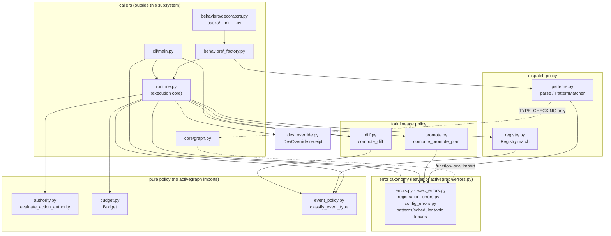
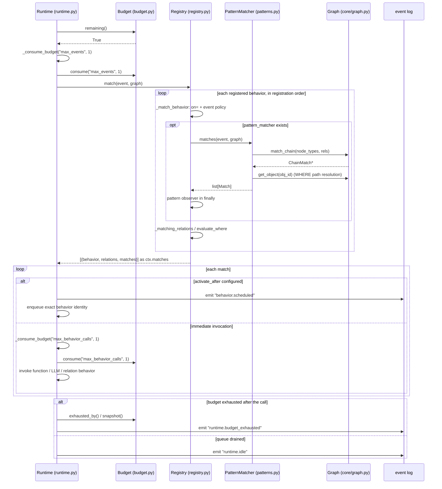

# Runtime Governance & Policy

## Responsibility

This subsystem holds the runtime's decision logic, kept deliberately outside the execution loop. Each module answers exactly one policy question as (mostly) pure functions over immutable inputs: *may this capability act automatically?* (`authority.py`), *did a local operator record an exact bypass receipt?* (`dev_override.py`), *does this event type schedule behaviors, trigger pattern-only matching, participate in diff, or participate in strict replay?* (`event_policy.py`), *does this behavior subscribe to this event?* (`registry.py`, `patterns.py`), *is there still room in this run?* (`budget.py`), *what changed between two runs, and may the fork's outcome be adopted by its parent?* (`diff.py`, `promote.py`). The four `*errors.py` modules hold the primary runtime error taxonomy, supplemented by topic-owned leaves in `patterns.py` and `scheduler.py`. Their public leaves render the locked summary plus `what_failed / why / how_to_fix / context` fields under the seven `activegraph.errors` category bases (`activegraph/errors.py:64-136`).

The consistent architectural move is a split of *rule* from *record*: these modules own the rule and return a value describing the decision; `runtime.py` owns the event log and emits the audit event. `authority.py`, `budget.py`, and `event_policy.py` import nothing from `activegraph` at all — they are fully pure (`activegraph/runtime/authority.py:26-29`, `activegraph/runtime/budget.py:12-16`, `activegraph/runtime/event_policy.py:8-10`).

## Component map



## Key types & entry points

**Authority** (action-class policy, CONTRACT v1.9 / ADR 0016)

- `ACTION_CLASSES = ("R0","R1","R2","R3","R4")` — closed consequence-class set — `activegraph/runtime/authority.py:32`
- `AUTHORITY_CEILINGS = ("none","R0","R1","R2")` — closed ceiling set; R3/R4 deliberately unrepresentable — `activegraph/runtime/authority.py:35-41`
- `DECISION_AUTO_APPROVE` / `DECISION_REQUIRE_APPROVAL` / `DECISION_GOVERNANCE_GATE` — `activegraph/runtime/authority.py:43-45`
- `AuthorityDecision` — frozen dataclass with `.auto_approved` — `activegraph/runtime/authority.py:54-85`
- `validate_ceiling(value) -> None`, raises `ValueError` — `activegraph/runtime/authority.py:88-100`
- `evaluate_action_authority(*, capability, action_class, ceiling, capability_ceiling=None) -> AuthorityDecision` — the one policy function — `activegraph/runtime/authority.py:103-257`

**Dev overrides** (CONTRACT v1.8 #13–#15)

- `DEV_AUTHORITIES = ("R0","R1","R2","R3")` — R4 absent by construction — `activegraph/runtime/dev_override.py:11`
- `_FORBIDDEN_EXACT_GATES` — `event_log`, `event.logging`, `event.log`, `logging`, `log` — `activegraph/runtime/dev_override.py:13-19`
- `DevOverride` — frozen receipt dataclass — `activegraph/runtime/dev_override.py:22-36`
- `validate_override_request(...) -> None`, raises `ValueError` — `activegraph/runtime/dev_override.py:39-65`
- `gate_is_forbidden(target_gate) -> bool` — `activegraph/runtime/dev_override.py:68-80`
- `receipt_from_event(event, *, run_id) -> DevOverride | None` — `activegraph/runtime/dev_override.py:83-122`
- `authority_allows(granted, required) -> bool` — `activegraph/runtime/dev_override.py:125-134`

**Event-type policy** (purpose-specific scheduling/diff/replay classification)

- `EventTypePolicy` — frozen four-field policy value — `activegraph/runtime/event_policy.py:30-35`
- `classify_event_type(event_type: str) -> EventTypePolicy` — shared owner for Runtime, Registry, Diff, and strict replay — `activegraph/runtime/event_policy.py:38-54`

**Registry** (event→behavior matching, CONTRACT #10 / v0.7 #11)

- `Registry(behaviors, *, pattern_observer=None)` with `.all()`, `.index_of(behavior)`, `.contains_identity(behavior)`, `._match_behavior(...)`, and `.match(event, graph)` — `activegraph/runtime/registry.py:26-104`; `.index_of()` is retained but has no production caller
- `_matching_relations(rb, event, graph)` — relation-behavior candidate filter — `activegraph/runtime/registry.py:106-119`

**Patterns** (Cypher subset parser + matcher, CONTRACT v0.7 #8/#9/#11/#12)

- `parse(pattern: str) -> Pattern` — public entry point — `activegraph/runtime/patterns.py:682-686`
- `Pattern.compile() -> PatternMatcher` — `activegraph/runtime/patterns.py:324-325`
- `PatternMatcher.matches(event, graph) -> list[Match]` — `activegraph/runtime/patterns.py:712-753`
- `Match.bindings: dict[str, str]` — var → object_id / relation_id — `activegraph/runtime/patterns.py:692-709`
- AST nodes `NodePat`, `RelPat`, `MatchClause`, `Comparison`, `NotExpr`, `NotExists`, `AndExpr` — `activegraph/runtime/patterns.py:262-315`
- `UnsupportedPatternError` with factories `.refused_feature(...)` / `.syntax_error(...)` — `activegraph/runtime/patterns.py:60-179`
- `_FORBIDDEN_KEYWORDS` (17) — `activegraph/runtime/patterns.py:367-371`; per-keyword recovery prose in `_KEYWORD_WORKAROUNDS` — `activegraph/runtime/patterns.py:185-256`

**Budget** (CONTRACT v0.6 #9)

- `KNOWN_LIMITS` — 8 dimensions — `activegraph/runtime/budget.py:19-28`
- `Budget(limits)` with `.start(read_wall_clock=)`, `.consume(key, amount)`, `.remaining(check_wall_clock=)`, `.exhausted_by()`, `.mark_exhausted(key)`, `.has_cost_limit()`, `.add_cost(Decimal)`, `.cost_remaining(prospective)`, `.cost_remaining_amount()`, `.snapshot()` — `activegraph/runtime/budget.py:37-148`

**Diff** (CONTRACT v0.5 #10)

- `compute_diff(parent, fork, parent_run_id, fork_run_id) -> Diff` — `activegraph/runtime/diff.py:102-158`
- `Diff` (`.is_identical`), `DivergentObject`, `DivergentRelation` (both with `.summary()`) — `activegraph/runtime/diff.py:24-99`

**Promote** (CONTRACT v1.3 #4; design `promote-design.md`)

- `compute_promote_plan(parent, fork, *, forked_at_event, warnings=None) -> PromotePlan` — pure three-way comparison — `activegraph/runtime/promote.py:187-352`
- `build_base_graph(parent, forked_at_event) -> Graph`, raises `LookupError` — `activegraph/runtime/promote.py:160-181`
- `promote_warnings(parent_rt, fork_rt, *, forked_at_event) -> list[str]` — `activegraph/runtime/promote.py:355-410`
- `PromotePlan` (`.is_promotable`, `.is_empty`), `PromoteConflict`, `PromoteResult` (`.computed_against`) — `activegraph/runtime/promote.py:41-130`

**Error leaves** (each subclasses a category base from `activegraph/errors.py`)

- `ReplayDivergenceError` — `activegraph/runtime/errors.py:38-78`
- `ApprovalNotFoundError`, `RuntimeContextRequiredError`, `ObjectNotFoundError`, `PatchNotFoundError`, `ApplyPatchNotFoundError`, `RejectPatchNotFoundError`, `InvalidPatchLifecycleState`, `InternalEvaluatorError`, `ReservedFieldError`, `PromoteLineageError`, `PromoteConflictError` — `activegraph/runtime/exec_errors.py:47,105,154,192,232,243,254,304,341,404,460`
- `BehaviorNotFoundError`, `AmbiguousBehaviorError`, `ToolNotFoundError`, `AmbiguousToolError`, `InvalidToolRegistration` — `activegraph/runtime/registration_errors.py:21,79,140,193,250`
- `InvalidActivateAfter` — topic-owned scheduler leaf — `activegraph/runtime/scheduler.py:118-151`
- `InvalidRuntimeConfiguration`, `InvalidArgumentType`, `IncompatibleRuntimeState`, `RuntimeClosedError` — `activegraph/runtime/config_errors.py:35,68,98,129`

## Interfaces & contracts at each seam

### runtime-governance <-> runtime-core (authority)

`runtime.py` imports the authority module at module level (`activegraph/runtime/runtime.py:108-113`) and wraps it in three methods that supply the log and the audit trail. `Runtime.authority_ceiling()` folds the currently materialized `graph.events`, defaulting to `"none"` and ignoring payload values outside `AUTHORITY_CEILINGS` (`activegraph/runtime/runtime.py:941-958`). There is no dedicated ceiling snapshot field; after compaction this fold sees the hot log beginning at `runtime.snapshot`, because the state sidecar contains objects and relations only (`activegraph/store/retention.py:153-171`). `Runtime.set_authority_ceiling()` is the loud path: it calls `validate_ceiling` and requires non-empty `actor`/`reason` before emitting (`activegraph/runtime/runtime.py:960-1002`). `Runtime.evaluate_capability_authority()` calls the pure function, emits `authority.decision`, and returns `replace(decision, event_id=event.id)` (`activegraph/runtime/runtime.py:1004-1056`).

```ebnf
authority-eval    ::= evaluate_action_authority( capability , action_class ,
                                                 ceiling , [ capability_ceiling ] )
capability        ::= string                  (* opaque capability key *)
action_class      ::= "R0" | "R1" | "R2" | "R3" | "R4" | "" | <any-other-string>
ceiling           ::= "none" | "R0" | "R1" | "R2"
capability_ceiling::= ceiling | nil | <any-other-string>

authority-result  ::= AuthorityDecision { capability , action_class , ceiling ,
                        capability_ceiling , effective_ceiling ,
                        matched_policy , decision , reason , event_id }
decision          ::= "auto_approve" | "require_approval" | "governance_gate"
matched_policy    ::= "fail_closed_missing_action_class"
                    | "fail_closed_invalid_action_class"
                    | "fail_closed_invalid_capability_ceiling"
                    | "governance_gate_r4" | "approval_required_r3"
                    | "within_ceiling" | "stricter_local_policy" | "above_ceiling"

ceiling-set       ::= validate_ceiling( ceiling ) -> unit | raise ValueError
audit-event       ::= "authority.decision" "{" capability , action_class , ceiling ,
                        capability_ceiling , effective_ceiling , matched_policy ,
                        decision , reason "}"
ceiling-event     ::= "authority.ceiling_changed" "{" ceiling , previous_ceiling ,
                        actor , reason "}"
```

Contract notes:

1. **Both sets are closed, with two failure modes.** A missing/invalid `action_class` or invalid non-`None` `capability_ceiling` fails closed to `require_approval` (`activegraph/runtime/authority.py:130-173`); an invalid instance `ceiling` raises through `validate_ceiling` (`:88-100,128`).
2. **No `risk_class` mapping exists, by construction** — the legacy `low|medium|high|critical` vocabulary is never an input (`activegraph/runtime/authority.py:14-16, 124-126`).
3. **Fixed evaluation order** (`activegraph/runtime/authority.py:112-126`): missing class → invalid class → invalid `capability_ceiling` → R4 → R3 → ceiling comparison. The three fail-closed branches run *before* R4/R3, so garbled input can never reach the governance gate.
4. **R4 always → `governance_gate`; R3 always → `require_approval`**, at every ceiling and every level (`activegraph/runtime/authority.py:175-202`).
5. **Local policy can only lower.** The effective ceiling is `min(instance_ceiling, capability_ceiling)`; a higher `capability_ceiling` is silently ignored because only `local_rank < effective_rank` replaces it (`activegraph/runtime/authority.py:205-213`).
6. **Every rejection names its rule** via the closed `matched_policy` vocabulary (`activegraph/runtime/authority.py:136,152,166,182,195,221,235,251`).
7. **Loud vs. fail-closed split**: bad `action_class` and `capability_ceiling` values fail closed, while a bad instance `ceiling` raises on both the setter and pure-function paths (`activegraph/runtime/authority.py:88-100,128-173`).
8. `AuthorityDecision` is `frozen=True` — the runtime attaches `event_id` via `dataclasses.replace`, never mutation (`activegraph/runtime/authority.py:54`, `activegraph/runtime/runtime.py:1056`).

### runtime-governance <-> runtime-core (dev overrides)

`runtime.py` imports the override module at module level (`activegraph/runtime/runtime.py:122-128`). `Runtime.dev_override()` validates *before* emission, emits `dev.override`, then re-hydrates the receipt from the accepted event (`activegraph/runtime/runtime.py:859-901`). `Runtime.dev_overrides()` rebuilds all receipts by log replay (`activegraph/runtime/runtime.py:903-911`). The gate side is `Runtime.validate_dev_override()`, a five-way exact check (`activegraph/runtime/runtime.py:913-937`).

```ebnf
override-request  ::= dev_override( actor , reason , target_gate , scope ,
                                   resulting_authority )
actor             ::= non-empty-string
reason            ::= non-empty-string
scope             ::= non-empty-string
target_gate       ::= non-empty-string - forbidden-gate
forbidden-gate    ::= "event_log" | "event.logging" | "event.log" | "logging" | "log"
                    | "promote" | "promote." ident | "promotion" | "promotion." ident
                    | "event_log." ident | "event.logging." ident
resulting_authority ::= "R0" | "R1" | "R2" | "R3"        (* never R4 *)

override-outcome  ::= DevOverride { event_id , run_id , actor , reason ,
                                    target_gate , scope , resulting_authority }
                    | raise ValueError
override-event    ::= "dev.override" "{" actor , reason , target_gate , scope ,
                        resulting_authority "}"           (* event.actor = actor *)

gate-check        ::= validate_dev_override( receipt , target_gate , scope ,
                                             required_authority ) -> boolean
gate-check-true   ::= receipt.run_id = current_run
                    ∧ ¬forbidden(target_gate)
                    ∧ target_gate = receipt.target_gate
                    ∧ scope = receipt.scope
                    ∧ rank(required_authority) ≤ rank(receipt.resulting_authority)
                    ∧ receipt = rehydrate(log_event(receipt.event_id))
```

Contract notes:

1. **A receipt grants nothing on its own** — "it grants nothing until that same gate validates it through the runtime" (`activegraph/runtime/dev_override.py:26-27`).
2. **R4 is never obtainable** — `DEV_AUTHORITIES` stops at R3 (`activegraph/runtime/dev_override.py:11, 57-61`).
3. **Promotion and event-logging gates are non-bypassable**, matched by exact name *and* prefix (`activegraph/runtime/dev_override.py:13-19, 68-80`).
4. **All four string fields must be non-empty** — no untraceable overrides (`activegraph/runtime/dev_override.py:49-56`).
5. **Actor must match the event's actor** — a receipt cannot be minted for someone else (`activegraph/runtime/dev_override.py:102-103`).
6. **Validation happens twice**: before emission (`activegraph/runtime/runtime.py:875-881`) and again on hydration from the log (`activegraph/runtime/dev_override.py:104-113`), so a receipt reconstructed from a tampered log fails to hydrate rather than granting.
7. **Exact match only at the gate** — no wildcard, prefix, cross-run, promotion, event-log or R4 match is possible, and the referenced event must still exist with identical fields (`activegraph/runtime/runtime.py:927-937`).
8. **Run-scoped**: `receipt.run_id != self.graph.run_id → False` (`activegraph/runtime/runtime.py:927`).

### runtime-governance <-> runtime-core (registry dispatch)

`Runtime._ensure_registry()` builds the `Registry` from explicit behaviors, the global `@behavior` registry, and `_pack_behaviors`, and supplies the pattern-metric observer (`activegraph/runtime/runtime.py:1243-1282`). The drain loop calls `registry.match(event, self.graph)` once per popped event (`activegraph/runtime/runtime.py:1709`); the returned triples become `ctx.matches`. Delayed entries store the exact behavior object (`activegraph/runtime/scheduler.py:55-61`; scheduling at `activegraph/runtime/runtime.py:1738-1763`). At fire time the runtime requires that exact identity still be registered, validates its name, reloads the original event, and reuses `Registry._match_behavior` (`activegraph/runtime/runtime.py:1765-1800`). `registry.all()` remains a status/inspection seam (`activegraph/runtime/runtime.py:3150-3164`); `.index_of()` is retained but no longer participates in scheduling.

```ebnf
match-request  ::= registry.match( event , graph ) -> match-triple*
match-triple   ::= "(" behavior , relation* , pattern-match* ")"
pattern-match  ::= Match { bindings : ident -> ( object_id | relation_id ) }

fires(behavior, event) ::= ( behavior.on = ∅ ∨ event.type ∈ behavior.on )
                         ∧ ( behavior.on ≠ ∅ ∨ triggers-pattern-only(event.type) )
                         ∧ ( behavior.pattern_matcher = nil ∨ pattern-match* ≠ ∅ )
                         ∧ where-gate(behavior, event)
where-gate     ::= ( behavior : RelationBehavior )
                     -> matching_relations(behavior, event, graph) ≠ ∅
                 | ( behavior.where = nil
                     ∨ evaluate_where(behavior.where, event.payload) )
bookkeeping-prefix ::= "behavior." | "relation_behavior." | "runtime."
                     | "llm." | "tool." | "pattern." | "approval."
                     | "embedding." | "dev." | "authority."
triggers-pattern-only(t) ::= ¬t.startswith(bookkeeping-prefix)
                             ∧ t != "context.read"
ordering       ::= registration-order                  (* CONTRACT #10 *)
delayed-owner  ::= ScheduledEntry.behavior = exact behavior object
fire-resolve   ::= registry.contains_identity(behavior)
                 ∧ registry._match_behavior(behavior, original_event, graph)
```

Contract notes:

1. **Registration order decides ties** — `match()` iterates `self._behaviors` in insertion order and returns in that order (`activegraph/runtime/registry.py:98-104`).
2. **`on=` and `pattern=` are AND, not OR** — both must hold (`activegraph/runtime/registry.py:3-7,59-81`).
3. **Pattern-only behaviors never fire on bookkeeping events or `context.read`** — Registry reads the shared policy's `triggers_pattern_only` field (`activegraph/runtime/registry.py:63-66`; policy at `activegraph/runtime/event_policy.py:13-54`).
4. **A `RelationBehavior` fires only if at least one candidate relation survives** the `relation_type` + `where` filter (`activegraph/runtime/registry.py:82-88,106-119`).
5. **A non-relation behavior fires once per event, not once per pattern match** — `ctx.matches` carries the full list; relation behaviors fan out once per surviving relation (`activegraph/runtime/runtime.py:1710-1732`; `activegraph/runtime/patterns.py:692-703`).

### runtime-governance <-> behaviors / packs (pattern compilation)

Global and pack-scoped decorators share `activegraph/behaviors/_factory.py`. The global module imports it at `activegraph/behaviors/decorators.py:19` and calls its three builders at `:133-143,226-247,285-296`; packs import the same factory at `activegraph/packs/__init__.py:67` and call it at `:788-798,844-865,900-911`. `_prepare_timing` performs `parse_pattern(pattern).compile()` and `parse_activate_after` when the outer decorator call is evaluated (`activegraph/behaviors/_factory.py:14-33`), and the builders store the compiled matcher (`:80-100,129-160,181-202`). This preserves the CONTRACT v0.7 #9 "compile once at registration" guarantee: bad timing syntax raises before runtime matching.

```ebnf
pattern-registration ::= parse( pattern-source ) "." compile() -> PatternMatcher
                       | raise UnsupportedPatternError

pattern-source ::= match-clause [ "WHERE" bool-expr ]
match-clause   ::= node { rel node }
node           ::= "(" [ ident ] [ ":" type ] [ "{" prop-list "}" ] ")"
prop-list      ::= prop { "," prop }
prop           ::= ident ":" literal                 (* equality only *)
rel            ::= "-" "[" [ ident ] ":" type "]" "->"
                 | "<-" "[" [ ident ] ":" type "]" "-"
                 (* undirected "-[...]-" and variable-length "-[*..]-" are refused *)
bool-expr      ::= unary { "AND" unary }             (* OR is refused *)
unary          ::= "NOT" "EXISTS" "{" match-clause "}"
                 | "NOT" unary
                 | "(" bool-expr ")"
                 | comparison
comparison     ::= path op ( literal | path )
op             ::= "=" | "<>" | "!=" | "<" | "<=" | ">" | ">="
path           ::= ident { "." ident }               (* a, a.id, a.type, a.version,
                                                        a.data.x; a.<field> ⇒ a.data.<field> *)
literal        ::= number | string | "TRUE" | "FALSE" | "NULL"
refused-kw     ::= "RETURN"|"OPTIONAL"|"WITH"|"MATCH"|"UNWIND"|"UNION"|"CREATE"
                 | "MERGE"|"SET"|"DELETE"|"DETACH"|"REMOVE"|"FOREACH"|"CALL"
                 | "LIMIT"|"SKIP"|"ORDER"
```

Contract notes:

1. **Compile at registration, not at match** (`activegraph/runtime/patterns.py:32-33`; `activegraph/behaviors/_factory.py:24-33`).
2. **The subset is locked and refuses at parse time**: no `OR` (`activegraph/runtime/patterns.py:580-601`), no undirected relationships (`:501-511`), no variable-length paths (`:534-544`), relationship type mandatory (`:550-555`), and 17 forbidden keywords each with a specific workaround (`:367-371`, `:185-256`). Node `{prop: value}` is equality-only; comparisons must go in `WHERE` (`:18`).
3. **A repeated variable must bind one id** — `_bind_chain` returns `None` on conflict and the chain is dropped (`activegraph/runtime/patterns.py:756-777`).
4. **Comparison against `None` is false, not an error** — `>`, `<`, `>=`, `<=` all guard `a is not None and b is not None` (`activegraph/runtime/patterns.py:797-800`).
5. **Two framework-bug refusals** rather than silent mis-evaluation: unknown operator (`activegraph/runtime/patterns.py:812-840`) and unrecognized AST node (`:864-890`), both via `internal_bug_fields`.
6. **Relations have no property access in v0.7** — `_resolve_path` returns `None` for a relation binding (`activegraph/runtime/patterns.py:899-902`).

### runtime-governance <-> core (pattern push-down)

`PatternMatcher.matches` pushes the structural chain down to the graph (and thence the store) via `graph.match_chain(node_types, rels)` (`activegraph/runtime/patterns.py:740`, target `activegraph/core/graph.py:295-304`), then resolves `WHERE` paths in Python with `graph.get_object(obj_id)` (`activegraph/runtime/patterns.py:903`). Both `core.event` and `core.graph` imports are `TYPE_CHECKING`-only (`activegraph/runtime/patterns.py:44-46`) — one concrete reason the package-level core↔runtime edge looks bidirectional but is not at runtime.

```ebnf
chain-query    ::= graph.match_chain( node_types , rels ) -> chain-match*
node_types     ::= "[" { type | nil } "]"
rels           ::= "[" { "(" ( type | nil ) "," direction ")" } "]"
direction      ::= "right" | "left"
chain-match    ::= ChainMatch { objects : Object* , relations : Relation* }
prop-lookup    ::= graph.get_object( object_id ) -> Object | nil
(* node {prop:value} equality, variable-consistency and WHERE stay in Python *)
```

Contract notes: the push-down covers node types, relation types and direction only. Property equality on nodes, repeated-variable consistency and the whole `WHERE` expression are evaluated after the chain returns, so `match_chain` may over-return and the matcher narrows.

### runtime-governance <-> runtime-core (budget accounting)

`Runtime` constructs `self.budget = Budget(budget or {})` (`activegraph/runtime/runtime.py:470`) and drives it throughout the drain loop. Budget mutation goes through `_consume_budget` and `_add_budget_cost`, which also refresh public gauges (`activegraph/runtime/runtime.py:672-705`). `_start_budget()` controls wall-clock reads (`:1438-1443`); `_budget_remaining()` either checks live time or marks recorded strict-replay exhaustion (`:1456-1466`). Consumption sites are `max_events` per drained event (`:1707`), `max_behavior_calls` in the three invocation paths (`:1823,1934,2990`), `max_llm_calls` (`:1999`), and `max_tool_calls` (`:2583`). Cost is gated before uncached LLM/tool calls (`:2083-2121,2639-2651`) and real response cost is charged through the metric wrapper (`:2339-2342,2708-2711`).

```ebnf
budget-init    ::= Budget( "{" { limit-key ":" number } "}" )
limit-key      ::= "max_events" | "max_behavior_calls" | "max_llm_calls"
                 | "max_tool_calls" | "max_patches" | "max_depth"
                 | "max_seconds" | "max_cost_usd"
budget-start   ::= budget.start( read_wall_clock : boolean )
budget-charge  ::= budget.consume( limit-key , amount )
                 | budget.add_cost( Decimal )
budget-gate    ::= budget.remaining( check_wall_clock ) -> boolean
                 | budget.cost_remaining( Decimal ) -> boolean
budget-forced  ::= budget.mark_exhausted( limit-key )
budget-report  ::= budget.snapshot() -> "{" used , limits ,
                     cost_used_usd : decimal-string ,
                     cost_limit_usd : decimal-string | nil "}"
exhaust-event  ::= "runtime.budget_exhausted" "{" exhausted_by : limit-key ,
                     snapshot , [ stop_position ] "}"
                 | "runtime.idle" "{" snapshot "}"
stop_position  ::= "{" accepted_sequence , event_tick , queue_depth ,
                     delayed_depth "}"                 (* only for max_seconds *)
reason-code    ::= "budget.tool_calls_exhausted" | "budget.cost_exhausted"
                 | "budget.llm_calls_exhausted"
                 | "budget." <limit-key minus "max_"> "_exhausted"
                 | "budget.exhausted"
```

Contract notes:

1. **Budgets end runs gracefully; they never raise** (`activegraph/runtime/budget.py:38`).
2. **Omitted dimension = unlimited** (`float("inf")`) — `activegraph/runtime/budget.py:65`.
3. **Cost accumulates in `Decimal`**, mirrored to a float snapshot for readers (`activegraph/runtime/budget.py:56-63, 121-124`).
4. **Exhaustion is `>=`, not `>`** — hitting the limit exactly exhausts (`activegraph/runtime/budget.py:102, 106`).
5. **`_exhausted_by` records which dimension ended the run**, set by `remaining()` or forced by `mark_exhausted()` for recorded replay (`activegraph/runtime/budget.py:98, 104, 107, 111-114`).
6. **Strict replay does not read the wall clock** — `start(read_wall_clock=False)` zeroes `_start` and `remaining(check_wall_clock=False)` skips `max_seconds` (`activegraph/runtime/budget.py:73-80, 92-95`).
7. **The pre-call cost check is conservative and conditional** — it uses `max_tokens` as the output estimate and runs only when `max_cost_usd` is finite and no cached response was found (`activegraph/runtime/budget.py:6-9`; `activegraph/runtime/runtime.py:2083-2121`).
8. `snapshot()` renders `inf` limits as `None` and exposes cost as Decimal-strings so consumers pick their own precision (`activegraph/runtime/budget.py:139-148`).
9. **Private-attribute seam**: `self.budget._start` is read directly by the runtime at `activegraph/runtime/runtime.py:1498,1530,1561` — see Open questions.
10. Reason-code mapping lives on the runtime side in `_budget_reason(name)` / `_BUDGET_REASON_MAP` (`activegraph/runtime/runtime.py:4428-4432,4521-4524`).

### runtime-governance <-> runtime-core / cli (promote)

`Runtime.promote(fork, *, dry_run=False)` (`activegraph/runtime/runtime.py:4110-4408`) is the production caller of the promote module (imports at `:129-134`). Its order of operations is load-bearing: backend and lineage checks run first (`:4160-4224`); warnings and the three-way plan follow, with a `LookupError` from `build_base_graph` translated to `PromoteLineageError` (`:4226-4240`). `dry_run` returns the plan even when it contains conflicts (`:4242-4243`); only apply mode raises `PromoteConflictError`, before any mutation (`:4245-4249`). The delta is then revalidated against *this* runtime's pack schemas (`:4251-4280`), the `promote.applied` marker is emitted first (`:4282-4306`), and the delta events follow quiescently in their fixed order (`:4308-4399`), ending with id-generator reseeding (`:4401-4403`). The CLI calls the Runtime facade and maps lineage/apply conflicts, while a conflicted dry-run plan separately exits with divergence (`activegraph/cli/main.py:918-922,955-1010`).

```ebnf
promote-call   ::= runtime.promote( fork : Runtime , dry_run : boolean )
                   -> PromotePlan | PromoteResult
                    | raise IncompatibleRuntimeState      (* non-SQLite store *)
                    | raise PromoteLineageError           (* not a direct fork *)
                    | raise PromoteConflictError          (* apply mode only *)

plan-compute   ::= compute_promote_plan( parent : Graph , fork : Graph ,
                                         forked_at_event , warnings ) -> PromotePlan
base-build     ::= build_base_graph( parent , forked_at_event )
                   -> Graph | raise LookupError

PromotePlan    ::= "{" from_run , into_run , forked_at_event , computed_against ,
                     object_creates : entity-payload* ,
                     object_patches : entity-payload* ,
                     object_removes : id* ,
                     relation_creates : rel-payload* ,
                     relation_removes : id* ,
                     conflicts : conflict* , warnings : string* "}"
entity-payload ::= "{" id , type , data "}"
rel-payload    ::= "{" id , source , target , type , data "}"
conflict       ::= "{" kind , entity , id , detail ,
                     in_base? , in_parent? , in_fork? "}"
kind           ::= "both_changed" | "dangling_relation" | "orphaning_removal"
entity         ::= "object" | "relation"

PromoteResult  ::= "{" plan , marker_event_id , applied_event_ids : id* "}"
apply-sequence ::= marker , relation.removed* , object.removed* ,
                   object.created* , patch.applied* , relation.created*
marker         ::= "promote.applied" "{" from_run , forked_at_event ,
                     computed_against , objects_created , objects_patched ,
                     objects_removed , relations_created , relations_removed ,
                     warnings "}"                         (* actor = "runtime" *)
delta-event    ::= <projection event> with actor = "promote:" from_run
                                     ∧ caused_by = marker.id
                                     ∧ quiescent (never enqueued)
cli-exit       ::= PromoteLineageError -> EXIT_NOT_FOUND
                 | PromoteConflictError -> EXIT_DIVERGENCE
                 | ( dry_run ∧ plan.conflicts ≠ ∅ ) -> EXIT_DIVERGENCE
```

Contract notes:

1. **State application, not event replay** — three-way base/parent-now/fork-now comparison; fork-only promotes, both-sides conflicts, parent-only is left alone (`activegraph/runtime/promote.py:10-17,213-266`).
2. **"State" is type + data (+ endpoints for relations)** — version counters and provenance are bookkeeping (`activegraph/runtime/promote.py:28-29,135-150`).
3. **Fail-closed and atomic in apply mode** — one conflict fails the whole apply before mutation; dry-run returns the conflicted plan for inspection (`activegraph/runtime/runtime.py:4242-4249`).
4. **Identical concurrent edits still conflict** — no semantic judgment in v1 (`activegraph/runtime/promote.py:241-245`).
5. **No `force=` flag; the escape hatch is re-fork** (`activegraph/runtime/promote.py:16-17`; `activegraph/runtime/exec_errors.py:460-518`).
6. **Referential integrity is part of the conflict check** — `dangling_relation` when a promoted relation's endpoint would not survive (`activegraph/runtime/promote.py:293-313`), `orphaning_removal` when a promoted object removal would cascade away an untouched parent relation (`:315-337`).
7. **Relation "patches" are modeled as remove+create** — the projection has no relation-patch event (`activegraph/runtime/promote.py:273-280`).
8. **Quiescent apply** — delta events project and persist but never enqueue for behavior matching; the single reaction point is the `promote.applied` marker (`activegraph/runtime/promote.py:21-23`; `activegraph/runtime/runtime.py:4282-4399`, quiescence check at `:1074`).
9. **Apply order is load-bearing**: relation removals → object removals → object creates → object patches → relation creates (`activegraph/runtime/runtime.py:4324-4397`).
10. **Plans are advisory** — `dry_run` records `computed_against` (the parent tip event id at plan time) and apply always recomputes; a stale plan cannot be handed back in (`activegraph/runtime/promote.py:24-26,209`; `activegraph/runtime/runtime.py:4110-4243`).
11. **Pack code is never adopted** — fork-only pack loads and `pack.settings_overridden` events surface as `plan.warnings` only (`activegraph/runtime/promote.py:355-410`). Fork-only-ness is *positional* (everything after `forked_at_event` in the fork's log), never an event-id membership check, because ids are run-scoped (`:362-365`).
12. **Lineage comes from the store, not the caller** — `runs.parent_run_id` / `forked_at_event_id` are the authority; grandchildren promote one level at a time (`activegraph/runtime/exec_errors.py:404-459`; `activegraph/runtime/runtime.py:4178-4224`).
13. **Promoted ids are preserved, then generators are reseeded past them** (`activegraph/runtime/runtime.py:4401-4403`).
14. **`compute_promote_plan` is pure and deterministic** — sorted by entity id throughout, mutates nothing (`activegraph/runtime/promote.py:197-198,225,351-352`).

Outbound coupling: promote uses `Graph`, `Object`, `Relation` and `IDGen` (`activegraph/runtime/promote.py:37-38`), `graph.all_objects()` / `graph.all_relations()` (`:155-156`), `to_dict()` (`:137,143`), and the private `base._replay_event(ev)` seam that `fork()` also uses (`:172`). `promote_warnings` reads `parent_rt.graph.events` / `fork_rt.graph.events` through duck-typed `Any` parameters (`:355-410`). It has no code dependency on `diff.py`.

### runtime-governance <-> runtime-core / cli (diff)

`runtime.py` imports `Diff, compute_diff` (`activegraph/runtime/runtime.py:121`) and exposes its wrapper at `:4107-4108`; the CLI's `activegraph diff` imports `compute_diff` directly and prints the summary (`activegraph/cli/main.py:852,866`).

```ebnf
diff-call      ::= compute_diff( parent : Graph , fork : Graph ,
                                 parent_run_id , fork_run_id ) -> Diff
Diff           ::= "{" parent_run_id , fork_run_id ,
                     shared_events : Event* ,
                     parent_only_events : Event* , fork_only_events : Event* ,
                     divergent_objects : DivergentObject* ,
                     divergent_relations : DivergentRelation* "}"
DivergentObject   ::= "{" id , in_parent : snapshot|nil , in_fork : snapshot|nil "}"
DivergentRelation ::= "{" id , in_parent : snapshot|nil , in_fork : snapshot|nil "}"
snapshot       ::= to_dict() minus "provenance"
shared-prefix  ::= longest i such that ∀ k<i :
                     parent[k].id = fork[k].id ∧ .type = .type ∧ .payload = .payload
                   over events with included_in_diff = true
diff-excluded-prefix ::= "behavior." | "relation_behavior." | "runtime."
```

Contract notes:

1. **Structural only** — semantic comparison is explicitly a behavior's job (`activegraph/runtime/diff.py:4-7, 84-88`).
2. **Only structural runtime prefixes are excluded from the event partition** (`behavior.*`, `relation_behavior.*`, `runtime.*`) through the shared policy's `included_in_diff` field (`activegraph/runtime/event_policy.py:25,45-50`; consumer `activegraph/runtime/diff.py:103-108`). LLM/tool/pattern/approval/embedding/dev/authority events remain in diff by design.
3. **Shared prefix requires id AND type AND payload equality** — logical ids are run-scoped (CONTRACT #12), so a same-id/different-payload pair must not be flattened into "shared" (`activegraph/runtime/diff.py:110-124`).
4. **Provenance is stripped before comparison** so equality is structural, not timestamp noise (`activegraph/runtime/diff.py:161-171`).
5. Output ordering is deterministic — object/relation ids `sorted()` (`activegraph/runtime/diff.py:130,142`).

### runtime-governance <-> everything (error taxonomy)

The four `*errors.py` modules define the primary runtime-specific leaves; topic-owned pattern, scheduler, LLM, and tool errors stay beside their policies. `core` reaches the runtime taxonomy through *function-local* imports, so no module-level cycle exists: current sites are `activegraph/core/graph.py:133,547,811,915,919,972,1163`, covering reserved-field, store-state, typed object/patch lookup, patch-lifecycle, and evaluator failures. `store` raises `InvalidArgumentType` at Postgres construction (`activegraph/store/postgres.py:111-116`); `runtime/_live.py` raises `InvalidRuntimeConfiguration` for provider/model mismatch (`activegraph/runtime/_live.py:113-177,214-255`). The package public API imports and re-exports these runtime leaves and governance values (`activegraph/__init__.py:21-73,168-312`).

```ebnf
framework-error ::= ActiveGraphError { summary , what_failed , why ,
                                       how_to_fix , context , doc_url }
category        ::= ConfigurationError | RegistrationError | ExecutionError
                  | ReplayError | StorageError | PatternError | PackError

configuration-leaf ::= InvalidRuntimeConfiguration   (* + ValueError *)
                     | InvalidArgumentType           (* + TypeError *)
                     | IncompatibleRuntimeState      (* + RuntimeError *)
                     | RuntimeClosedError            (* inherits IncompatibleRuntimeState *)
registration-leaf  ::= BehaviorNotFoundError         (* + LookupError *)
                     | ToolNotFoundError             (* + LookupError *)
                     | AmbiguousBehaviorError        (* + ValueError *)
                     | AmbiguousToolError            (* + ValueError *)
                     | InvalidToolRegistration       (* + TypeError *)
                     | InvalidActivateAfter          (* + ValueError; scheduler-owned *)
execution-leaf     ::= ApprovalNotFoundError         (* + LookupError *)
                     | RuntimeContextRequiredError   (* + RuntimeError *)
                     | ObjectNotFoundError           (* + KeyError *)
                     | PatchNotFoundError
                     | ApplyPatchNotFoundError       (* PatchNotFoundError + KeyError *)
                     | RejectPatchNotFoundError      (* PatchNotFoundError + AttributeError *)
                     | InvalidPatchLifecycleState    (* + ValueError *)
                     | InternalEvaluatorError        (* + ValueError *)
                     | ReservedFieldError            (* + ValueError *)
                     | PromoteLineageError           (* + ValueError *)
                     | PromoteConflictError          (* + ValueError *)
replay-leaf        ::= ReplayDivergenceError
pattern-leaf       ::= UnsupportedPatternError       (* + SyntaxError *)

replay-kind     ::= "prompt_hash_mismatch" | "embedding_hash_mismatch"
                  | "type_mismatch" | "length_mismatch"
replay-discrim  ::= expected startswith "prompt_hash="    -> prompt_hash_mismatch
                  | expected startswith "embedding_hash=" -> embedding_hash_mismatch
                  | expected = "<no recorded event>" ∨ actual = nil
                                                          -> length_mismatch
                  | otherwise                             -> type_mismatch

rendered-message ::= class-name ": " summary NL NL
                     "What failed:" NL indent(what_failed) NL NL
                     "Why:" NL indent(why) NL NL
                     "How to fix:" NL indent(how_to_fix) NL NL
                     "More:" NL indent(doc_url)
doc_url          ::= "https://docs.activegraph.ai/errors/" doc-slug
```

Contract notes:

1. **Every leaf carries the four-part structure** and renders through `ActiveGraphError._format()` (`activegraph/errors.py:117-129`).
2. **Every public leaf resolves a `_doc_slug`**, directly or by inheritance, which becomes `https://docs.activegraph.ai/errors/{slug}` (`activegraph/errors.py:43,113-115`). `RuntimeClosedError` intentionally inherits the `IncompatibleRuntimeState` slug (`activegraph/runtime/config_errors.py:98-129`).
3. **Leaves retain historical builtin compatibility where applicable.** Examples include `UnsupportedPatternError(PatternError, SyntaxError)` (`activegraph/runtime/patterns.py:60`), the three general config leaves (`activegraph/runtime/config_errors.py:35,68,98`), typed execution lookups (`activegraph/runtime/exec_errors.py:154,192-251`), and the five registration leaves (`activegraph/runtime/registration_errors.py:21,79,140,193,250`). The common `PatchNotFoundError` base and `ReplayDivergenceError` do not add a builtin themselves.
4. **`ReplayDivergenceError` discriminates its four shapes from the input shape**, not from an explicit kind argument (`activegraph/runtime/errors.py:80-98`). The v0.5 signature is preserved deliberately (`:23-25`).
5. **Lookup failures never fuzzy-match or no-op** — a wrong dispatch would silently corrupt the audit trail (`activegraph/runtime/registration_errors.py:55-62, 173-179`).
6. **Short names are convenience; `pack_name.thing` is canonical** — ambiguity is refused rather than resolved by load order (CONTRACT v0.9 #8/#9; `activegraph/runtime/registration_errors.py:116-124, 231-237`).
7. **`ReservedFieldError` is the v1.10 silent-strip → loud-refusal migration**: `provenance` in caller data used to be dropped silently (`activegraph/runtime/exec_errors.py:341-385`).
8. **Patch lifecycle is one-shot**: `proposed → applied | rejected`, exactly once; re-application would emit a duplicate `patch.applied` and break replay (`activegraph/runtime/exec_errors.py:254-301`).

### Events this layer causes the runtime to emit

`authority.ceiling_changed` (`activegraph/runtime/runtime.py:989-1001`), `authority.decision` (`:1039-1055`), `dev.override` (`:883-900`), `promote.applied` and its caused-by delta (`:4286-4322`), `runtime.budget_exhausted` / `runtime.idle` (`:3230-3255`), `behavior.scheduled` (`:1744-1763`), and the pattern-matched marker (`:1808-1818`).

## Sequence: one event drains through dispatch and budget



Authority is not an automatic stage of behavior dispatch. It is an explicit host call:
`Runtime.evaluate_capability_authority(...)` invokes the pure policy, emits
`authority.decision`, and returns the frozen decision with its event id attached
(`activegraph/runtime/runtime.py:1004-1056`).

## Open questions

1. **Resolved — `promote.py` no longer imports `Event`.** Its only ActiveGraph imports are `Graph`, `Object`, `Relation`, and `IDGen` (`activegraph/runtime/promote.py:37-38`); the former promote→`core.event` edge is gone.
2. **`PatternMatcher.matches()` ignores its `event` argument entirely** (`activegraph/runtime/patterns.py:718-723`). The code comments say so and flag it as a future extension point (binding `$event.payload.x`). So a `pattern=`-only behavior is evaluated purely against post-event graph state, which means it can fire on an event that has nothing to do with the matched subgraph, as long as the subgraph exists. This is a real semantic, not an oversight — but it is easy to misread.
3. **Resolved — one purpose-specific event policy owns every consumer.** The duplicate `_is_lifecycle` functions are gone. `EventTypePolicy` exposes distinct scheduling, pattern-only, diff, and strict-replay fields (`activegraph/runtime/event_policy.py:30-54`), consumed by Runtime, Registry, and Diff. The narrower structural rule intentionally keeps `llm.*` / `tool.*` / `dev.*` events in diff.
4. **`Registry._matching_relations` evaluates `rb.where` inside the candidate loop** (`activegraph/runtime/registry.py:114-117`) even though the predicate depends only on `event.payload`, not on the candidate relation. Behaviorally correct, but re-evaluated once per candidate. Possibly intentional simplicity.
5. **The action-class authority path has no CLI surface and no in-package caller other than `runtime.py`.** `evaluate_capability_authority`, `set_authority_ceiling` and `validate_dev_override` are referenced only by `activegraph/runtime/runtime.py`, `tests/test_authority.py` and `tests/test_dev_override.py`. `authority.py` and `dev_override.py` are therefore a *published API for embedders* (both types re-exported at `activegraph/__init__.py:43, 46`), not something the framework consumes internally — the governance gate is a hook the host application is expected to call.
6. **`Runtime.promote` reaches into three private seams**: `graph._pack_object_validator` / `_pack_relation_validator` (`activegraph/runtime/runtime.py:4261,4265`), `graph._provenance` (`:4337,4366,4379`), and `build_base_graph` uses `Graph._replay_event` (`activegraph/runtime/promote.py:172`). All are annotated `# noqa: SLF001`, so they are acknowledged seams — but promote is coupled to `core.graph` internals in a way the public API does not express.
7. **`runtime.py` reads `self.budget._start` directly** at three sites (`activegraph/runtime/runtime.py:1498,1530,1561`) — a private attribute with no accessor. If `Budget` is documented as a closed interface, this is the exception.
8. **Two overlapping exhaustion signals.** `Budget` never raises, but `runtime.py` layers a second cost gate on top: a failing `budget.cost_remaining(pre_estimate)` produces a `reason="budget.cost_exhausted"` outcome inside the LLM/tool paths (`activegraph/runtime/runtime.py:2107-2121,2640-2651`) that is distinct from the terminal `runtime.budget_exhausted` lifecycle event (`:3230-3255`), despite overlapping reason strings.
9. **`_KEYWORD_WORKAROUNDS` and `_FORBIDDEN_KEYWORDS` both have 17 entries** and they match (`activegraph/runtime/patterns.py:185-256` vs `:367-371`), so the `.get(upper, <generic fallback>)` at `:392-396` is currently unreachable. Not a bug — the fallback is defensive.
10. **The first three `config_errors.py` classes are structurally identical** — each forwards to `ConfigurationError.__init__` with no added fields (`activegraph/runtime/config_errors.py:49-65,79-95,110-126`). Only class identity, `_doc_slug`, and the multi-inherited builtin distinguish them. `RuntimeClosedError` is the specialized fourth class with its own constructor (`:129-154`).
11. **`compute_promote_plan` has no `relation_patches` category** — relation patches are folded into both `rel_removes` and `rel_creates` (`activegraph/runtime/promote.py:273-280`), so a "patch" is a remove+create pair sharing one id. Easy to misread as a missing field.
12. **CONTRACT references above identify the source files' own contract annotations.** This map verifies the current implementation behind those annotations; it does not restate the full 429 KiB `CONTRACT.md`.
