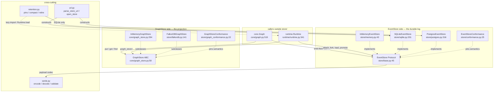
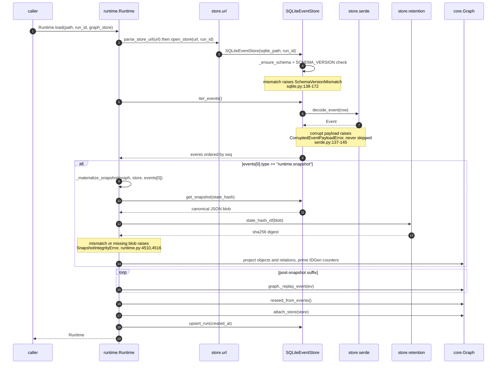

# Store — the persistence seam

## Responsibility

`store/` is the persistence seam of `activegraph`. It owns two deliberately-separated
interfaces: the **`EventStore`** — a per-run, append-only *event log* that is the durable source
of truth (`activegraph/store/base.py:1-9`) — and the **`GraphStore`** — the *materialized
current-state projection*, which is disposable because it can always be rebuilt by replaying the
log. The asymmetry is stated normatively: "Losing a GraphStore is recoverable (replay the log);
losing the EventStore is not" (`activegraph/core/graph_store.py:12-15`). `GraphStore` is defined
in `core/` and re-exported here (`activegraph/store/__init__.py:14`), so `store/` is the single
import surface for both.

The package also owns the connection-URL grammar (`url.py`), the JSON wire format for event
payloads (`serde.py`), two reusable pytest conformance suites that *are* the written storage
contract (`conformance.py`, `graph_conformance.py`), and the offline compaction/retention policy
(`retention.py`). The `EventStore` protocol is intentionally tiny — "append, iterate, count,
lookup, truncate-after. No queries, no indexes beyond what the backend ships. This is an event
log, not a database" (`activegraph/store/base.py:7-9`).

## Component map



## Key types & entry points

### EventStore side (the durable log)

- `EventStore` — `typing.Protocol`, six methods plus a `run_id` attribute; the seam everything
  codes against — `activegraph/store/base.py:45-73`
- `RunRecord` — dataclass, the canonical `runs`-table row (fork lineage, label, goal, frame) —
  `activegraph/store/base.py:26-42`
- `replay_into(graph, events) -> int` — module-level replay helper — `activegraph/store/base.py:76-86`
  (see Open questions #1: no in-package callers)
- `InMemoryEventStore` — volatile list+dict reference implementation — `activegraph/store/memory.py:43-128`
- `SQLiteEventStore` — durable single-file; the only backend with compaction and fork primitives —
  `activegraph/store/sqlite.py:201-599`
- `PostgresEventStore` — shared-state multi-process; optional `psycopg>=3.1,<4` dependency —
  `activegraph/store/postgres.py:316-609`
- `EventStoreConformance` — reusable pytest ABC pinning EventStore semantics —
  `activegraph/store/conformance.py:25-161`

### GraphStore side (the projection)

- `GraphStore` — ABC, 11 abstract methods plus 5 overridable query hooks —
  `activegraph/core/graph_store.py:58-291`, re-exported at `activegraph/store/__init__.py:14`
- `ChainMatch` — frozen dataclass `(objects, relations)` for pattern pushdown —
  `activegraph/core/graph_store.py:43-55`
- `InMemoryGraphStore` — dict-backed default; returns live instances **without copying** so the
  projector's in-place mutation still works — `activegraph/core/graph_store.py:294-357`
- `FalkorDBGraphStore` — Cypher-backed; overrides all 5 query hooks to push down —
  `activegraph/store/falkordb.py:141-648`
- `GraphStoreConformance` — reusable pytest ABC pinning GraphStore semantics —
  `activegraph/store/graph_conformance.py:22-491`

### Cross-cutting

- `parse_store_url(url) -> StoreURL` — `activegraph/store/url.py:87`
- `open_store(url, run_id) -> EventStore` — `activegraph/store/url.py:207`
- `encode_payload` / `decode_payload` / `encode_event` / `decode_event` / `validate_event` —
  `activegraph/store/serde.py:51,116,175,188,201`
- `compact` / `retire` / `pins` / `verify_snapshot` / `state_hash_of` —
  `activegraph/store/retention.py:253,312,179,337,174`
- Error leaves: `SchemaVersionMismatch`, `EventNotFoundError` (+`KeyError`), `DuplicateEventError`
  (+`ValueError`), `CorruptedEventPayloadError` — `activegraph/store/errors.py:27,41,53,66`; plus
  `NonSerializableEventError` (+`TypeError`) at `activegraph/store/serde.py:26` and
  `InvalidStoreURL` (+`ValueError`) at `activegraph/store/url.py:42`. All descend from
  `activegraph.errors.StorageError` (`activegraph/errors.py:179`).

### Public re-export surface

`activegraph/__init__.py:81-97` re-exports `EventStore`, `GraphStore`, `InMemoryEventStore`,
`InMemoryGraphStore`, `SQLiteEventStore`, `FalkorDBGraphStore`, `RunRecord`, `open_store`,
`parse_store_url`, and all four `store.errors` leaves. **`PostgresEventStore` is not re-exported**
at either level — it is absent from `activegraph/store/__init__.py:28-46`'s `__all__` and reachable
only as `from activegraph.store.postgres import PostgresEventStore`.

## Interfaces & contracts at each seam

### store <-> core (durability: `Graph` -> `EventStore`)

`core.graph.Graph` is the only writer on the hot path. A graph accepts at most one store for its
whole lifetime: `Graph.attach_store` is idempotent on the *same* store and raises
`IncompatibleRuntimeState` when handed a different one (`activegraph/core/graph.py:519-556`).
`Graph.emit` is the sole caller of `store.append` (`activegraph/core/graph.py:564-576`), and its
step order is contractual. The `EventStore` type import is `TYPE_CHECKING`-only
(`activegraph/core/graph.py:42`); the runtime import of `validate_event` is function-local
(`activegraph/core/graph.py:570`), so `core` never imports `store` at module scope.

```ebnf
store-attach   ::= graph.attach_store( event-store ) -> None
                 | !! IncompatibleRuntimeState        (* second, different store *)

event-store    ::= { run_id : run-id ,
                     append, iter_events, get_event, count,
                     truncate_after, close }

append         ::= store.append( event ) -> None
                 | !! DuplicateEventError             (* in-memory only *)
                 | !! sqlite3.IntegrityError          (* sqlite, unwrapped *)
                 | !! psycopg.errors.UniqueViolation  (* postgres, unwrapped *)

iter_events    ::= store.iter_events( [after], [until] ) -> Iterator<event>
                   (* after: EXCLUSIVE ; until: INCLUSIVE ; order = seq *)
                 | !! EventNotFoundError              (* after/until names unknown id *)

get_event      ::= store.get_event( event-id ) -> event | None   (* never raises *)
count          ::= store.count() -> int                          (* this run only *)
truncate_after ::= store.truncate_after( event-id ) -> None
                 | !! EventNotFoundError
close          ::= store.close() -> None                         (* idempotent *)

emit-path      ::= validate_event(event)
                   -> graph._events.append(event)
                   -> apply_event(graph, event)
                   -> store.append(event)
                   -> sink._offer(event, delivery-context)
                   -> listeners
                   (* activegraph/core/graph.py:564-596 *)

event          ::= { id, type, payload, actor, frame_id, caused_by, timestamp }
```

**Contract notes.** The conformance suite (`activegraph/store/conformance.py:25-161`) is the
normative statement of this seam; every backend subclasses it
(`tests/test_store_conformance.py:19,26`, `tests/test_postgres_store.py:26`):

| Invariant | Test | Line |
|---|---|---|
| Iteration returns events in **append order**, not timestamp order | `test_append_then_iter_in_order` | `conformance.py:66-74` |
| `count()` is 0 on a fresh store and tracks appends | `test_count` | `conformance.py:76-84` |
| `get_event(unknown)` returns **`None`**, does not raise | `test_get_event_known_and_unknown` | `conformance.py:86-95` |
| `iter_events(after=X)` is **exclusive** of X | `test_iter_after_skips_inclusive_boundary` | `conformance.py:97-105` |
| `iter_events(until=Y)` is **inclusive** of Y | `test_iter_until_includes_boundary` | `conformance.py:107-115` |
| `truncate_after(X)` keeps X, drops everything after | `test_truncate_after_drops_tail` | `conformance.py:117-126` |
| Payloads round-trip nested dicts/lists, unicode, empty lists, `None` byte-identically | `test_payload_round_trip_preserves_structure` | `conformance.py:128-142` |
| A duplicate event id in the same run raises **something** (deliberately untyped `pytest.raises(Exception)`) | `test_duplicate_id_in_same_run_is_rejected` | `conformance.py:144-151` |
| `close()` is idempotent | `test_close_is_idempotent` | `conformance.py:153-161` |

Structural invariants beyond the suite:

- A store instance is scoped to exactly one `run_id`, even when runs share a backing file
  (`activegraph/store/base.py:4-6`, `activegraph/store/sqlite.py:38-41`). Cross-run access requires
  a second instance.
- Logical event ids are **scoped to `run_id`, not globally unique** — the constraint is
  `UNIQUE(id, run_id)` precisely so a fork can preserve the parent's `evt_017`
  (`activegraph/store/sqlite.py:31-36`, `activegraph/store/postgres.py:5-7`).
- **`seq` (AUTOINCREMENT / BIGSERIAL) is the ordering authority, not `timestamp`** — "wall clocks
  can lie; AUTOINCREMENT cannot" (`activegraph/store/sqlite.py:28-29`). Every `iter_events` sorts
  `ORDER BY seq` (`activegraph/store/sqlite.py:256`, `activegraph/store/postgres.py:363`).
- Fork **copies rows, never shares them** (CONTRACT v0.5 #11) — `activegraph/store/sqlite.py:476-477`,
  `activegraph/store/postgres.py:532`.
- The log is the source of truth; **the graph projection is never stored in the EventStore**
  (`activegraph/store/base.py:53-54`).
- Storage failures **raise rather than emit**: "a store that can't be trusted can't record its own
  failure" (`activegraph/errors.py:186-187`).
- Duplicate-append is **not portable across backends today** — see Open questions #2.

Transactionality differs per backend and is part of the contract:

- **SQLite** opens with `isolation_level=None`, i.e. autocommit — every `append` is its own
  transaction (`activegraph/store/sqlite.py:227`). WAL and `synchronous=NORMAL` are set on every
  open (`activegraph/store/sqlite.py:122-127`): crash-safe against process crash, may lose the last
  committed transactions on OS crash, never corrupts. The only explicit transaction is
  `archive_prefix`'s `BEGIN IMMEDIATE … COMMIT/ROLLBACK` (`activegraph/store/sqlite.py:388-407`).
- **Postgres** routes through `_ConnectionSource`, supporting three ownership shapes — URL (store
  owns the connection), borrowed `psycopg.Connection`, or `ConnectionPool` with getconn/putconn per
  operation (`activegraph/store/postgres.py:82-163`). Per-operation cursors run `autocommit=True`
  (`activegraph/store/postgres.py:179`); `_TxCtx` flips autocommit off for a real transaction and
  restores it after (`activegraph/store/postgres.py:194-229`).

### store <-> core (projection: `Graph` -> `GraphStore`)

`Graph.__init__(..., graph_store=None)` defaults to `InMemoryGraphStore()`
(`activegraph/core/graph.py:171,183`), so every graph has a projection backend. The projector reads
and writes entities through the 11 abstract methods; the 5 query hooks exist so a backend such as
FalkorDB can push queries down to the engine instead of scanning in Python.

```ebnf
graph-store   ::= entity-ops , query-hooks , lifecycle

entity-ops    ::= put_object( object ) -> None          (* upsert *)
                | get_object( id ) -> object | None
                | remove_object( id ) -> None           (* no-op if absent *)
                | all_objects() -> [object]             (* order unspecified *)
                | put_relation( relation ) -> None
                | get_relation( id ) -> relation | None
                | remove_relation( id ) -> None
                | all_relations() -> [relation]
                | put_patch( patch ) -> None
                | get_patch( id ) -> patch | None
                | all_patches() -> [patch]
                | remove_patch( id ) -> None            (* required by clear() *)

query-hooks   ::= find_objects( [type] ) -> [object]
                | find_objects_in_types( [type…] ) -> [object]              (* [] -> [] *)
                | find_relations( [source], [target], [type] ) -> [relation] (* AND *)
                | neighborhood( id, depth ) -> ( [object] , [relation] )
                | match_chain( node-types , hops ) -> [chain-match]
                  (* an override MUST return exactly what the base-class default returns *)

hops          ::= { ( rel-type | null , direction ) }
direction     ::= "right"   (* (a)-[]->(b) *)
                | "left"    (* (a)<-[]-(b) *)
chain-match   ::= { objects : [object] , relations : [relation] }
                  (* len(relations) == len(objects) - 1 ; HOMOMORPHIC *)

lifecycle     ::= clear() -> None | close() -> None

object        ::= { id, type, data, version, provenance }
relation      ::= { id, source, target, type, data, provenance }

(* NOT part of this seam: the `where` predicate language — it stays in core.graph and is
   evaluated in Python over whatever find_objects returns. core/graph_store.py:25-29 *)
```

**Contract notes** (pinned by `activegraph/store/graph_conformance.py`):

- `put_*` is an **upsert**; `get_*` returns `None` for an unknown id; `remove_*` on an unknown id is
  a **no-op, not an error** (`activegraph/core/graph_store.py:62-66`, pinned at
  `graph_conformance.py:111-120`).
- The 5 query hooks ship working Python defaults, so **the base class is the single source of truth
  for their semantics**; an override "MUST return exactly what the default would"
  (`activegraph/core/graph_store.py:118-126,143,224-225`).
- `find_objects_in_types([])` returns `[]`, **not** every object (`graph_conformance.py:247`).
- `neighborhood` is an **undirected** BFS. Endpoints that are not materialized objects are traversed
  but excluded from the result ("placeholders") — `activegraph/core/graph_store.py:170-202`, pinned
  by `test_neighborhood_walks_through_placeholder` (`graph_conformance.py:303-331`) and
  `test_neighborhood_handles_cycle` (`graph_conformance.py:333-355`). `depth=0` returns just the
  start node (`graph_conformance.py:291-301`).
- `match_chain` is **homomorphic, not isomorphic** — one node or edge may fill multiple positions.
  `test_match_chain_homomorphic_self_loop` pins that "no backend silently switches to
  relationship-isomorphism" (`graph_conformance.py:438-454`; semantics at
  `activegraph/core/graph_store.py:219-223`).
- **Identity semantics are backend-dependent.** `InMemoryGraphStore` returns live instances without
  copying, so the projector's in-place mutations (`obj.data.update(...)`, `obj.version += 1`) behave
  exactly as pre-v1.2 (`activegraph/core/graph_store.py:298-302`). `FalkorDBGraphStore` necessarily
  cannot — it reconstructs `Object`/`Relation` from Cypher rows on every read. Projector code that
  relies on identity-mutation is not portable.

FalkorDB-specific invariants:

- Entity model: `(:AGNode:AGObject {id,type,version,data,provenance})`, native edges
  `(s:AGNode)-[:AGRelation {id,type,data,provenance}]->(t:AGNode)`, standalone `(:AGPatch {id,doc})`
  — `activegraph/store/falkordb.py:24-38`.
- The shared `:AGNode` label is load-bearing: `put_relation` MERGEs endpoints before creating the
  edge, so a relation may reference a not-yet-existing object and the endpoint becomes a bare
  **placeholder**. This preserves the in-memory store's dangling-relation semantics with true edges
  (`activegraph/store/falkordb.py:40-49`).
- Placeholder-ness is **derived** (`:AGNode AND NOT :AGObject`), never stored — one source of truth,
  no label churn (`activegraph/store/falkordb.py:47-49`).
- `remove_object` **demotes to placeholder rather than deleting**, keeping edges alive long enough
  for the projector's cascade to enumerate them; the node is deleted only at degree 0
  (`activegraph/store/falkordb.py:268-286`).
- **Security invariant:** relations use a fixed relationship type so every value crosses the Cypher
  boundary as a bound `$param` (`activegraph/store/falkordb.py:59-61`). The only spliced tokens are
  a validated `int` hop count in `neighborhood` (`activegraph/store/falkordb.py:466-467`) and
  generated names `n0/r0…` plus arrow directions drawn from the closed set `{"right","left"}` in
  `match_chain` (`activegraph/store/falkordb.py:528-530`). Neither splice accepts caller text.
- Connection resolution order: explicit `graph=` -> `url=`/`host=` -> `FALKORDB_URL` /
  `FALKORDB_HOST` env -> embedded `falkordblite` (`activegraph/store/falkordb.py:105-138,164-166`).

### store <-> runtime (lifecycle, fork, load, promote, compaction)

`runtime.Runtime` owns store lifecycle. It opens or accepts a store at construction, replays on
`load`, and drives the SQLite-only fork/promote/compaction primitives. The reverse direction exists
but is narrow: exactly two function-local imports from `store/` into `runtime/` — no module-scope
`store -> runtime` import exists anywhere (`activegraph/store/postgres.py:109` for
`InvalidArgumentType`, `activegraph/store/retention.py:273` for `Runtime.load`).

```ebnf
(* Persistent-backend extras. NOT on the EventStore protocol — reached by duck-typing or
   isinstance. Runtime._open_sqlite_store is typed Any precisely because of this:
   activegraph/runtime/runtime.py:4084-4086 *)

runtime-init      ::= Runtime( … , persist_to = path-or-url )
                    | Runtime( … , store = event-store )
                      (* mutually exclusive; both -> config error, runtime.py:476-504 *)
                      -> _open_sqlite_store -> store.upsert_run(…) -> graph.attach_store(store)

open-dispatch     ::= _open_sqlite_store( path-or-url , run-id )
                      (* bare path      => SQLiteEventStore
                         contains "://" => store.open_store       runtime.py:4081-4098 *)

run-metadata      ::= store.get_run() -> run-record | None
                    | store.upsert_run( created_at ,
                                        [parent_run_id], [forked_at_event_id],
                                        [label], [goal], [frame_id] ) -> None
                      (* None NEVER clears a stored value — COALESCE upsert *)

run-record        ::= { run_id, parent_run_id, forked_at_event_id,
                        label, created_at, goal, frame_id }

file-level        ::= SQLiteEventStore.list_runs( path ) -> [run-record]
                    | SQLiteEventStore.most_recent_run_id( path ) -> run-id | None
                    | SQLiteEventStore.fork_run( path, parent_run_id, new_run_id,
                                                 at_event_id, label, created_at ) -> int
                    | PostgresEventStore.list_runs( target ) -> [run-record]
                    | PostgresEventStore.most_recent_run_id( target ) -> run-id | None
                    | PostgresEventStore.fork_run( target, … ) -> int

compaction-tier   ::= store.put_snapshot( state_hash, blob, created_at ) -> None
                    | store.get_snapshot( state_hash ) -> blob | None
                    | store.archive_prefix( before_seq, archived_at ) -> int
                    | store.archive_run( archived_at ) -> int
                    | store.iter_archived() -> Iterator<event>
                    | store.has_archived() -> bool
                      (* SQLiteEventStore ONLY — Postgres has no archive/snapshot tables *)

pins              ::= pins( sqlite-path , run-id ) -> [pin-reason]
                      (* [] == unpinned ; read-only ; point-in-time *)
pin-reason        ::= "promoted-from: …"      (* another run's promote.applied names us *)
                    | "live-lineage: …"       (* a child fork's hot log is non-empty *)
                    | "pending-approvals: …"  (* approval.proposed \ approval.granted *)
                    | "proposed-patches: …"   (* patch.proposed, neither applied nor rejected *)

compact           ::= compact( sqlite-path , run-id ) -> snapshot-event-id
                    | !! RetentionPinnedError { run_id, operation, reasons }
                      (* order: emit snapshot event -> put_snapshot(blob)
                                -> archive_prefix(snapshot_seq) *)

snapshot-event    ::= Event{ type = "runtime.snapshot" , actor = "runtime" ,
                             payload = { state_hash     : "sha256:" hex ,
                                         covers_through : event-id | null ,
                                         events_covered : int ,
                                         id_counters    : { object, event, relation,
                                                            patch, frame } } }

retire            ::= retire( sqlite-path , run-id ) -> rows-moved:int
                    | !! RetentionPinnedError
verify            ::= verify_snapshot( sqlite-path , run-id ) -> true
                    | !! SnapshotIntegrityError  (* archive replays to a different hash *)
                    | !! LookupError             (* run has no runtime.snapshot event *)

load-with-snapshot::= Runtime.load(…) sees events[0].type == "runtime.snapshot"
                      -> _materialize_snapshot( graph, store, events[0] )
                      -> store.get_snapshot( state_hash )
                      -> assert state_hash_of(blob) == recorded
                      -> project objects/relations, prime id counters
                      -> replay the post-snapshot suffix
                      (* runtime.py:3311-3318, 4489-4549 *)
```

**Contract notes.**

- `_most_recent_run_id` dispatches backend-aware through `parse_store_url` to
  `PostgresEventStore.most_recent_run_id` / `SQLiteEventStore.most_recent_run_id`
  (`activegraph/runtime/runtime.py:4063-4078`).
- `Runtime.load(path, run_id=…, graph_store=…)` (`activegraph/runtime/runtime.py:3308-3361`,
  signature at `:3271`): open store -> `iter_events()` -> optional `_materialize_snapshot` ->
  replay -> `reseed_from_events` -> `attach_store` -> `upsert_run(created_at=…)`. The `graph_store`
  argument is threaded into `Graph(..., graph_store=...)` (`:3309`) and likewise on `fork`
  (`:3409`, `:3484`).
- **`Runtime.fork` requires `SQLiteEventStore` specifically** and raises when the attached store is
  anything else (`activegraph/runtime/runtime.py:3431-3463`), then calls
  `SQLiteEventStore.fork_run(store.path, …)` (`:3475`) and opens a second
  `SQLiteEventStore(store.path, run_id=new_run_id)` (`:3483`).
- **`Runtime.promote(fork)` requires both sides on `SQLiteEventStore` and on the same `path`**
  (`activegraph/runtime/runtime.py:3637-3678`), then reads lineage via `fork_store.get_run()` (`:3679`).
- `Runtime.save_state(path)` late-binds a SQLite store and replays all in-memory events into it
  (`activegraph/runtime/runtime.py:3237-3246`).
- `_materialize_snapshot` calls `store.get_snapshot(hash)` and `retention.state_hash_of`, raising
  `SnapshotIntegrityError` on a missing or mismatched blob
  (`activegraph/runtime/runtime.py:4489-4549`, raised at `:4510` and `:4516`) — "replaying from it
  would silently produce wrong state" (`activegraph/store/retention.py:116-146`).
- Retention policy: **"never deletion"** — compaction moves rows to an `events_archive` tier inside
  the same store file (`activegraph/store/retention.py:1`, `activegraph/store/sqlite.py:95-110`).
  **The pin set dominates retention unconditionally**; any window/age policy a host builds is sugar
  over `pins()` and "can never override a pin" (`activegraph/store/retention.py:13-16`). Pins are
  implemented at `activegraph/store/retention.py:179-250`.
- **"Offline" is per-RUN, not per-file** (v1.6.x ruling, `activegraph/store/retention.py:30-47`):
  every statement is `WHERE run_id = ?`-scoped, WAL readers never block the writer, live appends are
  single-statement autocommit, and the archive move is one short `BEGIN IMMEDIATE` a contender waits
  out (5s busy timeout -> `OperationalError`, never corruption). Two caveats are explicitly left to
  the caller (`activegraph/store/retention.py:49-62`): `pins -> archive` is **check-then-act, not
  atomic**, and a large run's archive move holds the write lock for the whole transaction.
- Compaction order is crash-safe by design: snapshot event -> blob -> archive move (idempotent) —
  `activegraph/store/retention.py:258-259`, implemented at `:282-308`. The snapshot blob is canonical
  JSON with provenance included, sorted ids and sorted keys; `state_hash = "sha256:" + hex` over
  exactly those bytes (`activegraph/store/retention.py:153-176`).
- **Forking below the compaction horizon refuses loudly:** `SQLiteEventStore.fork_run` checks
  `events_archive` and raises a dedicated `EventNotFoundError` — "compaction narrows where you can
  branch history, never what state is" (`activegraph/store/sqlite.py:490-525`).
- Phase-1 limits stated up front (`activegraph/store/retention.py:24-28`): the archive tier is a
  table in the same file, `causal_chain` does not read the archive, there is no CLI, and proposed
  patches block compaction.
- Schema versioning: both backends carry `SCHEMA_VERSION = "1"` in a `meta` table
  (`activegraph/store/sqlite.py:54`, `activegraph/store/postgres.py:29`) and raise
  `SchemaVersionMismatch` on open when it differs (`activegraph/store/sqlite.py:138-172`,
  `activegraph/store/postgres.py:243-275`). Refusal is **bidirectional** — newer *and* older —
  because either direction "would corrupt the audit trail." The v1.5 compaction tables were added as
  additive `IF NOT EXISTS` so `schema_version` stays `"1"`
  (`activegraph/store/sqlite.py:91-94`).

### store <-> cli (the operator surface)

`cli/main.py` is the human entry point to stores. It never constructs a backend directly; it routes
through `store.open_store` and maps `store/` error leaves onto process exit codes.

```ebnf
open-or-die       ::= _open_store_or_die( url , run-id ) -> event-store
                    | InvalidStoreURL    -> EXIT_USAGE_ERROR
                    | FileNotFoundError  -> EXIT_NOT_FOUND
                    | SchemaVersionMismatch -> stderr-once , EXIT_CORRUPTION
                    | RuntimeError["schema_version"] -> EXIT_CORRUPTION
                      (* compatibility fallback for older/custom open paths *)

list-runs         ::= _list_runs_or_die( url )
                      -> SQLiteEventStore.list_runs | PostgresEventStore.list_runs
                    | SchemaVersionMismatch -> stderr-once , EXIT_CORRUPTION
                      (* cli/main.py:109-123 *)
recent-run        ::= _most_recent_run_id_or_die( url ) (* cli/main.py:78-106 *)
                    | SchemaVersionMismatch -> stderr-once , EXIT_CORRUPTION

fork-cmd          ::= "activegraph fork" -> SQLiteEventStore.fork_run
                                          | PostgresEventStore.fork_run
                    | KeyError (i.e. EventNotFoundError) -> EXIT_NOT_FOUND
                      (* cli/main.py:626-651 ; cross-store fork REFUSED at :600-605 *)

promote-cmd       ::= "activegraph promote" -> validate run ids via _list_runs_or_die
                                             -> Runtime.load
                      (* cli/main.py:910-913 — load upserts a phantom run row
                         for unknown ids, so validation must precede it *)

migrate-cmd       ::= "activegraph migrate" -> parse_store_url(src) , parse_store_url(dst)
                                             -> list-runs(src)       (* source first *)
                                             -> list-runs(dst)       (* destination second *)
                                             -> observability.migration.migrate
                      (* cli/main.py:1102-1113 *)
```

The exact typed mapping also encloses every direct CLI store boundary:
`Runtime.load` in inspect, replay, fork override recording, diff, promote,
and export-trace, plus the driver `fork_run` call. Direct Python callers
continue to receive `SchemaVersionMismatch`. Nested helpers convert the leaf
to `SystemExit`, so the CLI cannot print it twice. Migration preflights the
source before opening the destination; a fresh destination is eagerly
initialized with only the current schema and metadata after the source passes.
This is compatibility validation, not cross-version schema translation.

**Contract notes.** The multi-inheritance in the error taxonomy is what makes this seam work:
`EventNotFoundError(StorageError, KeyError)` lets `activegraph fork` catch a bare `KeyError` and map
fork-point-not-found to `EXIT_NOT_FOUND` (`activegraph/store/errors.py:9-13,41`,
`activegraph/cli/main.py:648-650`). Sibling leaves follow the same pattern:
`DuplicateEventError(StorageError, ValueError)` (`errors.py:53`),
`NonSerializableEventError(StorageError, TypeError)` (`serde.py:26`),
`InvalidStoreURL(StorageError, ValueError)` (`url.py:42`). DB-driver errors
(`sqlite3.OperationalError`, `psycopg.OperationalError`) are **explicitly not wrapped**, deferred
because "the recovery prose varies enough per mode" (`activegraph/errors.py:14-19`).

### store <-> observability (cross-store migration)

`observability/migration.py` copies runs between backends. It imports `EventStore`, `RunRecord`,
`CorruptedEventPayloadError`, `decode_event`, and `parse_store_url` at module level
(`activegraph/observability/migration.py:27-30`), and a `_StoreFacade` unifies the SQLite/Postgres
call shapes for `list_runs`, `open_run`, and `write_run_transactionally`
(`activegraph/observability/migration.py:271-330`). This is the tightest coupling into `store/` in
the codebase and it is **not mediated by any protocol** — see Open questions #7.

```ebnf
migrate          ::= migrate( source-url , dest-url ,
                              [only_run_ids] , [skip_corrupted] , [on_progress] )
                     -> migration-report

direct-source-mismatch ::= raise SchemaVersionMismatch
direct-dest-mismatch   ::= failed run-report( error = "write failure: ..." )
(* CLI preflight changes neither direct-library behavior above *)

migration-report ::= { source_url, dest_url, runs : [ run-report ] }
run-report       ::= { run_id ,
                       status : "ok" | "skipped" | "failed" ,
                       events_migrated : int ,
                       error : string | null ,
                       skipped_events : ( event-id … ) }
```

**Contract notes.** One transaction per run against the destination; writes use
`INSERT … ON CONFLICT (id, run_id) DO NOTHING` against the `UNIQUE(id, run_id)` constraint, so a
rerun after a partial failure is idempotent (`activegraph/observability/migration.py:1-10,330-420`).
The operation is one-directional — no sync, no rollback; to go back, migrate the other way.
`--skip-corrupted` is the sanctioned escape hatch for `CorruptedEventPayloadError`
(`activegraph/store/serde.py:137-145`). The module reaches into store privates —
`activegraph.store.sqlite._ensure_schema` (`migration.py:324`),
`activegraph.store.postgres._ConnectionSource` (`migration.py:274,373`), `_EVENT_COLUMNS` and
`_ensure_schema` (`migration.py:373-377`) — justified by "driver-specific raw row iteration is
required because Python generators die after raising" (`migration.py:16-18`).

### store <-> sinks (serde reuse only)

`sinks/` does not touch the EventStore protocol; it borrows the serializer so an exported record is
byte-identical to a stored one. `sinks/jsonl.py:12,48-51` imports `encode_payload` and calls it as
"the EventStore normalization authority", then `json.loads` back — so a JSONL sink writes exactly
the normalization the store does (`Decimal` -> str, `datetime` -> ISO, `set` -> sorted list).
`sinks/conformance.py:24,179` uses `InMemoryEventStore` as a test fixture.

```ebnf
sink-normalize   ::= encode_payload( payload ) -> json-text
                     -> json.loads( json-text ) -> json-object
                     (* sinks/jsonl.py:48-51 — same normalization the store applies *)
```

**Contract note.** This is a one-way dependency on `serde` only; nothing in `sinks/` depends on
store durability, run scoping, or ordering.

### store <-> backing engine (URL grammar and wire format)

The two seams that face outward at the process boundary: the connection URL an operator types, and
the JSON bytes that land in a column.

```ebnf
store-url         ::= sqlite-url | postgres-url      (* anything else -> InvalidStoreURL *)

sqlite-url        ::= "sqlite" "://" "/" fs-path
fs-path           ::= relative-path | "/" absolute-path
                      (* THREE slashes total for relative: sqlite:///run.db
                         FOUR slashes total for absolute:  sqlite:////abs/run.db
                         urlparse yields "/run.db" / "//abs/run.db"; exactly one
                         leading slash is stripped — url.py:126-171 *)

postgres-url      ::= postgres-scheme "://" [ userinfo "@" ] authority [ "/" dbname ]
postgres-scheme   ::= "postgres" | "postgresql"      (* normalised to "postgres" *)
userinfo          ::= user [ ":" password ]
authority         ::= host [ ":" port ]              (* at least one of host / dbname *)

parse             ::= parse_store_url( string ) -> store-url-record
                    | !! InvalidStoreURL   (* empty | no-scheme | no-path
                                              | no-host-and-no-db | unknown-scheme *)
store-url-record  ::= { scheme : ("sqlite"|"postgres") , raw : string ,
                        sqlite_path : string | None }
open              ::= open_store( store-url , run-id ) -> event-store
                      (* sqlite   -> SQLiteEventStore(sqlite_path, run_id)
                         postgres -> PostgresEventStore(raw, run_id) *)

(* HARD RULE: a bare path with NO scheme is ALWAYS refused, never coerced. *)

stored-row        ::= { id        : string ,
                        type      : string ,
                        payload   : json-text ,   (* sqlite: TEXT ; postgres: JSONB *)
                        actor     : string | null ,
                        frame_id  : string | null ,
                        caused_by : string | null ,
                        timestamp : iso8601 }

encode-adapters   ::= Decimal         -> string (canonical form)
                    | datetime | date -> iso8601 string
                    | set | frozenset -> sorted json-array
                    | anything-else   -> !! NonSerializableEventError
                                            { context: { path, type } }
decode            ::= decode_payload( json-text ) -> json-object
                    | !! CorruptedEventPayloadError
                         { context: { line, column, preview, underlying_msg } }
```

**Contract notes.**

- **The framework never guesses a URL.** A bare filesystem path is refused with a message naming the
  exact fix, `sqlite:///<that path>` (`activegraph/store/url.py:110-125`). The rationale is stated
  once as `_WHY_NO_GUESS` and reused by every leaf (`activegraph/store/url.py:62-69`): guessing wrong
  "would either corrupt the audit trail or open an unintended store."
- `parse_store_url` is the **single validation entry point**; `open_store` and the CLI both route
  through it "so a malformed URL fails identically everywhere" (`activegraph/store/url.py:92-94`).
  Drivers are imported lazily inside `open_store` so the Postgres dependency stays optional
  (`activegraph/store/url.py:212-223`), and the unsupported-scheme error explicitly points at
  `store/base.py` as the extension path for new backends (`activegraph/store/url.py:200-201`).
- Optional dependencies: `psycopg>=3.1,<4` via `_require_psycopg`
  (`activegraph/store/postgres.py:69-79`, extras `postgres`); `falkordb` via
  `_require_falkordb_client` and embedded `redislite.falkordb_client` via `_require_falkordblite`
  (`activegraph/store/falkordb.py:75-102`, extras `falkordb` / `falkordb-embedded`). All missing
  deps raise `MissingOptionalDependency`.
- Serialization is **JSON only and human-inspectable** (`activegraph/store/serde.py:1`), and
  **encoding is one-way**: loading does not reconstruct `Decimal`/`datetime` — "payload semantics
  stay flat dicts of JSON primitives" (`activegraph/store/serde.py:8-11`). This asymmetry is
  contractual, not an oversight.
- `validate_event` is a fail-fast pre-check called from `Graph.emit` *before* any state mutation
  (`activegraph/store/serde.py:201-203`, `activegraph/core/graph.py:569-572`) — but only when a
  store is attached; see Open questions #4.
- Encode-side and decode-side failures are deliberately distinct types with distinct recoveries. On
  encode failure the framework walks the payload to name the offending field path
  (`_find_non_serializable`, `activegraph/store/serde.py:90-113`) and puts it in the message and
  `context`. Decode failure **refuses to skip the row**: skipping "would make the replay contract
  unverifiable, and the next fork or diff would lie about what happened"
  (`activegraph/store/serde.py:137-145`).

## Sequence: loading a compacted run (`Runtime.load` over a snapshot)

The flow that best shows what `store/` is for: the log is the source of truth, the projection is
rebuilt from it, and a compaction snapshot is trusted only after its hash is re-derived.



## Open questions

1. **`replay_into` has no in-package callers.** Defined at `activegraph/store/base.py:76-86` and
   documented as "the single replay entry point — used by `Runtime.load` and `Runtime.fork`," but a
   repo-wide grep finds zero callers: `Runtime.load` (`runtime.py:3316-3317`) and `Runtime.fork`
   (`runtime.py:3487-3492`) both inline their own `for ev in events: graph._replay_event(ev)` loop.
   Its only remaining role is as a re-exported public API symbol
   (`activegraph/store/__init__.py:15,45`; it is *not* in `activegraph/__init__.py`'s list). The
   docstring is stale.

2. **Duplicate-append raises three different exception types across backends.**
   `InMemoryEventStore.append` raises a rich `DuplicateEventError` (`memory.py:60-84`);
   `SQLiteEventStore.append` (`sqlite.py:233-241`) and `PostgresEventStore.append`
   (`postgres.py:326-344`) do no duplicate check at all, so the raw `sqlite3.IntegrityError` /
   `psycopg` `UniqueViolation` escapes. The conformance suite papers over this with
   `pytest.raises(Exception)` (`conformance.py:148`) and `errors.py:14-19` says wrapping driver
   errors is deliberately deferred. Consequence: **`except DuplicateEventError` is not portable
   across backends today.**

3. **`EventNotFoundError`'s docstring contradicts the conformance suite.** `errors.py:46-47` says it
   "Fires from every `store.get_event(event_id)`", but all three backends return `None` for an
   unknown id (`memory.py:106-110`, `sqlite.py:260-265`, `postgres.py:372-379`) and
   `conformance.py:93` explicitly asserts `store.get_event("evt_missing") is None`. The error
   actually fires from `iter_events(after=/until=)`, `truncate_after`, and `fork_run`. Docstring bug,
   not a behavior bug — but it will mislead anyone writing a new backend.

4. **`Graph.emit` validates serializability only when a store is attached**
   (`core/graph.py:569-572`). The comment one line above claims the check exists "so bad payloads
   never land in the in-memory log either," but the guard defeats that for store-less graphs. A run
   that works in memory can therefore fail the moment it is persisted or `save_state`d. Possibly
   intentional (avoiding the JSON round-trip cost on ephemeral runs), but it is not what the comment
   says.

5. **Compaction is SQLite-only, and the capability split is not expressed in any type.**
   `events_archive` / `snapshots` exist only in `sqlite.py:95-117`; `postgres.py:32-66` has neither.
   `retention.py:74` imports `SQLiteEventStore` at module scope and `compact` asserts
   `isinstance(store, SQLiteEventStore)` (`retention.py:305`). `Runtime.fork` (`runtime.py:3431-3463`)
   and `Runtime.promote` (`runtime.py:3637-3666`) hard-require SQLite too. **The effective backend
   capability tiers are therefore InMemory < Postgres < SQLite** — the "shared-state, multi-process"
   backend is strictly *less* capable than the single-file one. This inversion is the most surprising
   thing in the subsystem.

6. **`store -> runtime` is exactly two lazy imports.** `postgres.py:109`
   (`InvalidArgumentType`, error taxonomy only, raised when `PostgresEventStore(target=…)` is handed
   something that is not a URL string, a `psycopg.Connection`, or a `psycopg_pool.ConnectionPool` —
   `postgres.py:108-143`; the class docstring at `runtime/config_errors.py:70-72` names
   `PostgresEventStore` as its motivating case) and `retention.py:273`
   (`Runtime.load`, a genuine functional call — `retention.py:275-303`). The second means
   `retention.compact` is an *orchestration* function living in the storage package: architecturally
   it sits above the runtime, not beside the other store modules. It may deserve to move to
   `runtime/` or a new `ops/` layer.

7. **`observability/migration.py` imports store privates** — `_ensure_schema` (`migration.py:324`),
   `_ConnectionSource` (`:274`, `:373`), `_EVENT_COLUMNS` (`:373`). The module docstring justifies it
   (`migration.py:16-18`), but it means the `store/` public surface is not sufficient for migration,
   and any refactor of those privates breaks `observability/`.

8. **`retention.pins` leaks SQLite connections.** It constructs a `SQLiteEventStore` for the target
   run (`retention.py:191`) and one per *other* run in the file (`:198`, `:215`) and never calls
   `close()` on any of them; `retire` does the same (`:333`). On a store with many runs this opens
   O(runs) connections per `pins()` call, released only by GC. Not a correctness bug (WAL readers do
   not block), but a real resource issue for the "housekeeping window" usage the module docstring
   describes.

9. **`SQLiteEventStore.fork_run` is not transactional** (`sqlite.py:481-599`, row-by-row insert loop
   on an `isolation_level=None` autocommit connection), whereas `PostgresEventStore.fork_run` is
   (`postgres.py:538-607`, single `INSERT … SELECT` inside `_TxCtx`). An interrupted SQLite fork
   leaves a partially populated destination run with a valid-looking `runs` row. Given fork is
   SQLite-only in the runtime (item 5), this is the *only* path most users take. No test covering
   interrupted fork was found.

10. **`pins()` has no "Pin 3".** Comments run `Pin 1` (`retention.py:193`), `Pin 2` (`:211`),
    `Pin 4` (`:222`). Either a pin was removed and the numbering not reflowed, or a designed pin is
    unimplemented. `compaction-design.md` would settle it; it was not read.

11. **Resolved: every CLI store boundary maps the exact typed schema leaf.**
    `SchemaVersionMismatch(StorageError)` remains intentionally outside `RuntimeError`. A narrow
    CLI context manager prints that leaf once and exits `EXIT_CORRUPTION` (4) around helpers,
    direct `Runtime.load`, driver fork, and migration-preflight calls. The older
    `RuntimeError["schema_version"]` match remains only in the two helpers that already supported
    custom or legacy backends. Direct migration-library source-raise and destination-report
    behavior is unchanged.

12. **`falkordb.py:226-229` swallows every exception from `CREATE INDEX`.** The comment says
    index-exists is "the only expected case," but an auth failure, a syntax error against a future
    FalkorDB version, or a connection drop would also be silently absorbed — leaving the store
    running full scans with no signal.
