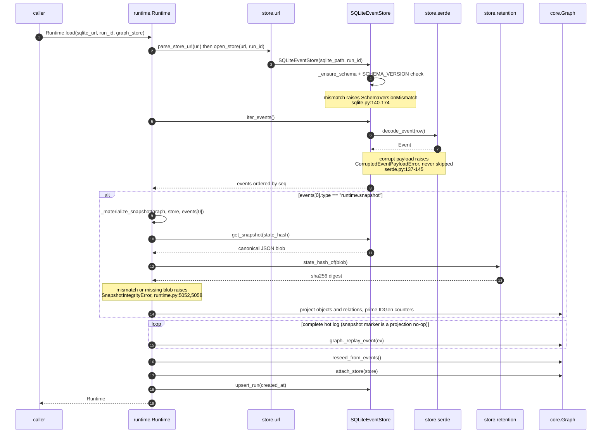

# Store — the persistence seam

## Responsibility

`store/` is the persistence seam of `activegraph`. It owns two deliberately-separated
interfaces: the **`EventStore`** — a per-run, append-only *event log* that is the durable source
of truth (`activegraph/store/base.py:1-9`) — and the **`GraphStore`** — the *materialized
current-state projection*, which is disposable because it can always be rebuilt by replaying the
log. The asymmetry is stated normatively: "Losing a GraphStore is recoverable (replay the log);
losing the EventStore is not" (`activegraph/core/graph_store.py:12-15`). `GraphStore` is defined
in `core/` and re-exported here (`activegraph/store/__init__.py:14`), so `store/` is the single
import surface for both.

The package also owns the connection-URL grammar (`url.py`), the shared JSON codec and validation
policy for event payloads (`serde.py`), the separate administrative migration-provider seam
(`migration.py`), two
reusable pytest conformance suites that *are* the written storage contract (`conformance.py`,
`graph_conformance.py`), and the offline compaction/retention policy (`retention.py`). The
`EventStore` protocol is intentionally tiny — "append, iterate, count, lookup, truncate-after. No
queries, no indexes beyond what the backend ships. This is an event log, not a database"
(`activegraph/store/base.py:7-9`). Multi-run migration does not widen that hot-path protocol; it
uses `MigrationBackend` and `MigrationBackendProvider` (`activegraph/store/migration.py:1-68`).

## Component map

```mermaid
graph TD
    subgraph consumers["callers outside store/"]
        Graph["core.Graph<br/>core/graph.py:152"]
        Runtime["runtime.Runtime<br/>runtime/runtime.py:387"]
    end

    subgraph log["EventStore side — the durable log"]
        Base["EventStore Protocol<br/>store/base.py:45"]
        Mem["InMemoryEventStore<br/>store/memory.py:43"]
        SQL["SQLiteEventStore<br/>store/sqlite.py:319"]
        PG["PostgresEventStore<br/>store/postgres.py:430"]
        Conf["EventStoreConformance + fork atomicity<br/>store/conformance.py:26 / 217"]
    end

    subgraph proj["GraphStore side — the projection"]
        GS["GraphStore ABC<br/>core/graph_store.py:58"]
        MemGS["InMemoryGraphStore<br/>core/graph_store.py:294"]
        Falkor["FalkorDBGraphStore<br/>store/falkordb.py:168"]
        GConf["GraphStoreConformance<br/>store/graph_conformance.py:22"]
    end

    subgraph xcut["cross-cutting"]
        URL["url.py<br/>parse_store_url / open_store"]
        Serde["serde.py<br/>encode / decode / validate"]
        PGJSON["Postgres writes<br/>direct json.dumps (current)"]
        Mig["migration.py<br/>provider registry + migrate"]
        Ret["retention.py<br/>pins / compact / retire"]
    end

    Graph -->|"emit then append"| Base
    Graph -->|"put / get / find"| GS
    Runtime -->|"attach, fork, load, promote"| Base
    Runtime -->|"graph_store="| GS
    Mem -.implements.-> Base
    SQL -.implements.-> Base
    PG -.implements.-> Base
    Conf -.pins semantics.-> Base
    MemGS -.subclasses.-> GS
    Falkor -.subclasses.-> GS
    GConf -.pins semantics.-> GS
    URL -->|constructs| SQL
    URL -->|constructs| PG
    SQL -->|payload codec| Serde
    PG -->|payload codec| PGJSON
    Mig -->|built-in provider| SQL
    Mig -->|built-in provider| PG
    Ret -->|SQLite only| SQL
    Ret -.->|"lazy import: Runtime.load"| Runtime
```



## Key types & entry points

### EventStore side (the durable log)

- `EventStore` — `typing.Protocol`, six methods plus a `run_id` attribute; the seam ordinary
  runtime persistence codes against — `activegraph/store/base.py:45-79`
- `RunRecord` — dataclass, the canonical `runs`-table row (fork lineage, label, goal, frame) —
  `activegraph/store/base.py:27-42`
- `replay_into(graph, events) -> int` — public module-level replay helper; its docstring accurately
  notes that `Runtime.load` and `Runtime.fork` do not call it — `activegraph/store/base.py:82-92`
- `InMemoryEventStore` — volatile list+dict reference implementation — `activegraph/store/memory.py:43-107`
- `SQLiteEventStore` — durable single-file; the only backend with snapshot/archive compaction, and
  one of two backends with an atomic `fork_run` primitive —
  `activegraph/store/sqlite.py:319-727`
- `PostgresEventStore` — shared-state multi-process; optional `psycopg>=3.1,<4` dependency —
  `activegraph/store/postgres.py:430-727`
- `EventStoreConformance` — reusable pytest ABC pinning EventStore semantics —
  `activegraph/store/conformance.py:26-214`
- `ForkRunAtomicityConformance` — reusable durable-backend suite pinning rollback and complete-prefix
  commit semantics — `activegraph/store/conformance.py:217-336`

### GraphStore side (the projection)

- `GraphStore` — ABC, 12 abstract methods plus 5 overridable query hooks —
  `activegraph/core/graph_store.py:58-291`, re-exported at `activegraph/store/__init__.py:14`
- `ChainMatch` — frozen dataclass `(objects, relations)` for pattern pushdown —
  `activegraph/core/graph_store.py:43-55`
- `InMemoryGraphStore` — dict-backed default; returns live instances **without copying**, unlike
  external stores that reconstruct values — `activegraph/core/graph_store.py:294-356`
- `FalkorDBGraphStore` — Cypher-backed; overrides all 5 query hooks to push down —
  `activegraph/store/falkordb.py:168-679`
- `GraphStoreConformance` — reusable pytest ABC pinning GraphStore semantics —
  `activegraph/store/graph_conformance.py:22-491`

### Cross-cutting

- `parse_store_url(url) -> StoreURL` — `activegraph/store/url.py:87`
- `open_store(url, run_id) -> EventStore` — `activegraph/store/url.py:209`
- `encode_payload` / `decode_payload` / `encode_event` / `decode_event` / `validate_event` —
  `activegraph/store/serde.py:51,116,175,188,201`
- `compact` / `retire` / `pins` / `verify_snapshot` / `state_hash_of` —
  `activegraph/store/retention.py:253,312,179,340,174`
- `MigrationBackend` / `MigrationBackendProvider` — capability protocols separate from `EventStore`
  — `activegraph/store/migration.py:44-68`
- `register_migration_backend` / `resolve_migration_backend` / `migrate` — explicit registration,
  entry-point discovery, capability gating, and per-run copy —
  `activegraph/store/migration.py:176-201,268-316,363-417`
- Error leaves: `SchemaVersionMismatch`, `EventNotFoundError` (+`KeyError`), `DuplicateEventError`
  (+`ValueError`), `CorruptedEventPayloadError`, and five migration-provider leaves —
  `activegraph/store/errors.py:36-259`; plus
  `NonSerializableEventError` (+`TypeError`) at `activegraph/store/serde.py:26` and
  `InvalidStoreURL` (+`ValueError`) at `activegraph/store/url.py:42`. All descend from
  `activegraph.errors.StorageError` (`activegraph/errors.py:186-197`).

### Public re-export surface

`activegraph/__init__.py:87-120` re-exports the ordinary store surface plus the migration protocols,
reports, registration/resolution functions, and typed migration errors. **`PostgresEventStore` is
still not re-exported** at either level — it is absent from
`activegraph/store/__init__.py:47-82`'s `__all__` and reachable only as
`from activegraph.store.postgres import PostgresEventStore`.

## Interfaces & contracts at each seam

### store <-> core (durability: `Graph` -> `EventStore`)

`core.graph.Graph` is the only writer on the hot path. A graph accepts at most one store for its
whole lifetime: `Graph.attach_store` is idempotent on the *same* store and raises
`IncompatibleRuntimeState` when handed a different one (`activegraph/core/graph.py:539-576`).
`Graph.emit` is the sole live hot-path caller of `store.append`
(`activegraph/core/graph.py:584-596`); `Runtime.save_state` also uses `append` to copy detached
in-memory history into a newly attached store (`activegraph/runtime/runtime.py:3732-3741`). The
emit step order is contractual. The `EventStore` type import is `TYPE_CHECKING`-only
(`activegraph/core/graph.py:42`); the runtime import of `validate_event` is function-local
(`activegraph/core/graph.py:590`), so `core` never imports `store` at module scope.

```ebnf
store-attach   ::= graph.attach_store( event-store ) -> None
                 | !! IncompatibleRuntimeState        (* second, different store *)

event-store    ::= { run_id : run-id ,
                     append, iter_events, get_event, count,
                     truncate_after, close }

append         ::= store.append( event ) -> None
                 | !! DuplicateEventError             (* every backend *)

iter_events    ::= store.iter_events( [after], [until] ) -> Iterator<event>
                   (* after: EXCLUSIVE ; until: INCLUSIVE ; order = seq *)
                 | !! EventNotFoundError              (* after/until names unknown id *)

get_event      ::= store.get_event( event-id ) -> event | None
                   (* unknown id -> None; decode/driver failures may still raise *)
count          ::= store.count() -> int                          (* this run only *)
truncate_after ::= store.truncate_after( event-id ) -> None
                 | !! EventNotFoundError
close          ::= store.close() -> None                         (* idempotent *)

emit-path      ::= [ validate_event(event) ]             (* iff store attached *)
                   -> graph._events.append(event)
                   -> apply_event(graph, event)
                   -> [ store.append(event) ]             (* iff store attached *)
                   -> sink._offer(event, delivery-context)
                   -> listeners
                   (* activegraph/core/graph.py:584-625 *)

event          ::= { id, type, payload, actor, frame_id, caused_by, timestamp }
```

**Contract notes.** The ordinary conformance suite (`activegraph/store/conformance.py:26-214`) is the
normative statement of this seam; every backend subclasses it
(`tests/test_store_conformance.py:19,26`, `tests/test_postgres_store.py:26`):

| Invariant | Test | Line |
|---|---|---|
| Iteration returns events in **append order**, not timestamp order | `test_append_then_iter_in_order` | `conformance.py:79-87` |
| `count()` is 0 on a fresh store and tracks appends | `test_count` | `conformance.py:89-97` |
| `get_event(unknown)` returns **`None`**, does not raise | `test_get_event_known_and_unknown` | `conformance.py:99-108` |
| `iter_events(after=X)` is **exclusive** of X | `test_iter_after_skips_inclusive_boundary` | `conformance.py:110-118` |
| `iter_events(until=Y)` is **inclusive** of Y | `test_iter_until_includes_boundary` | `conformance.py:120-128` |
| `truncate_after(X)` keeps X, drops everything after | `test_truncate_after_drops_tail` | `conformance.py:130-139` |
| Payloads round-trip nested dicts/lists, unicode, empty lists, `None` by structural equality | `test_payload_round_trip_preserves_structure` | `conformance.py:141-155` |
| A same-run duplicate raises `DuplicateEventError`, preserves the original row/count, and names the backend | `test_duplicate_id_in_same_run_is_rejected` | `conformance.py:157-181` |
| The same logical event id is allowed in two runs | `test_same_event_id_is_allowed_in_distinct_runs` | `conformance.py:183-204` |
| `close()` is idempotent | `test_close_is_idempotent` | `conformance.py:206-214` |

Structural invariants beyond the suite:

- A store instance is scoped to exactly one `run_id`, even when runs share a backing file
  (`activegraph/store/base.py:4-6`, `activegraph/store/sqlite.py:38-41`). Cross-run access requires
  a second instance.
- Logical event ids are **scoped to `run_id`, not globally unique** — the constraint is
  `UNIQUE(id, run_id)` precisely so a fork can preserve the parent's `evt_017`
  (`activegraph/store/sqlite.py:31-36`, `activegraph/store/postgres.py:5-7`).
- **`seq` (AUTOINCREMENT / BIGSERIAL) is the ordering authority, not `timestamp`** — "wall clocks
  can lie; AUTOINCREMENT cannot" (`activegraph/store/sqlite.py:28-29`). Every `iter_events` sorts
  `ORDER BY seq` (`activegraph/store/sqlite.py:379`, `activegraph/store/postgres.py:477-480`).
- Fork **copies rows, never shares them** (CONTRACT v0.5 #11), and destination metadata plus the
  complete prefix commit atomically — `activegraph/store/sqlite.py:589-727`,
  `activegraph/store/postgres.py:639-727`; rollback/success parity is pinned by
  `ForkRunAtomicityConformance` (`activegraph/store/conformance.py:217-336`).
- The log is the source of truth; **the graph projection is never stored in the EventStore**
  (`activegraph/store/base.py:53-54`).
- Storage failures **raise rather than emit**: "a store that can't be trusted can't record its own
  failure" (`activegraph/errors.py:186-187`).
- Duplicate-append is portable: all three backends raise the same `DuplicateEventError` with
  `{event_id, run_id, backend}` context (`activegraph/store/errors.py:62-100`).

Transactionality differs per backend and is part of the contract:

- **SQLite** opens with `isolation_level=None`, i.e. autocommit — every `append` is its own
  transaction (`activegraph/store/sqlite.py:345,351-364`). WAL and `synchronous=NORMAL` are set on every
  open (`activegraph/store/sqlite.py:122-127`): crash-safe against process crash, may lose the last
  committed transactions on OS crash, never corrupts. Migration writes, `archive_prefix`, and
  `fork_run` use explicit transactions (`activegraph/store/sqlite.py:243-290,507-531,589-727`).
- **Postgres** routes through `_ConnectionSource`, supporting three ownership shapes — URL (store
  owns the connection), borrowed `psycopg.Connection`, or `ConnectionPool` with getconn/putconn per
  operation (`activegraph/store/postgres.py:84-173`). URL-owned connections open with
  `autocommit=True`, and pool checkouts are temporarily forced to autocommit for ordinary
  operations; borrowed connections retain their caller-selected mode
  (`activegraph/store/postgres.py:100-109,176-203`). `_TxCtx` temporarily disables and restores
  autocommit for a real transaction (`activegraph/store/postgres.py:205-240`).
- **Current codec divergence:** SQLite `append` and its migration writer call the shared
  `encode_event`, but Postgres `append` and its migration writer call plain
  `json.dumps(event.payload)` (`activegraph/store/sqlite.py:243-290,351-359`,
  `activegraph/store/postgres.py:361-403,440-458`). Consequently Postgres writes do not honor
  serde's `Decimal` / date / set adapters even though `Graph.emit` validates with serde first.

### store <-> core (projection: `Graph` -> `GraphStore`)

`Graph.__init__(..., graph_store=None)` defaults to `InMemoryGraphStore()`
(`activegraph/core/graph.py:171,183`), so every graph has a projection backend. The projector reads
and writes entities through the 12 abstract methods; the 5 query hooks exist so a backend such as
FalkorDB can push queries down to the engine instead of scanning in Python.

```ebnf
graph-store   ::= entity-ops , query-hooks , lifecycle

entity-ops    ::= put_object( object ) -> None          (* upsert *)
                | get_object( id ) -> object | None
                | remove_object( id ) -> None           (* no-op if absent *)
                | all_objects() -> [object]             (* order unspecified *)
                | put_relation( relation ) -> None
                | get_relation( id ) -> relation | None
                | remove_relation( id ) -> None
                | all_relations() -> [relation]
                | put_patch( patch ) -> None
                | get_patch( id ) -> patch | None
                | all_patches() -> [patch]
                | remove_patch( id ) -> None            (* abstract: required by clear();
                                                            subclasses that omit it now fail
                                                            fast at construction, not at the
                                                            first clear() call *)

query-hooks   ::= find_objects( [type] ) -> [object]
                | find_objects_in_types( [type…] ) -> [object]              (* [] -> [] *)
                | find_relations( [source], [target], [type] ) -> [relation] (* AND *)
                | neighborhood( id, depth ) -> ( [object] , [relation] )
                | match_chain( node-types , hops ) -> [chain-match]
                  (* an override MUST return exactly what the base-class default returns *)

hops          ::= { ( rel-type | null , direction ) }
direction     ::= "right"   (* (a)-[]->(b) *)
                | "left"    (* (a)<-[]-(b) *)
chain-match   ::= { objects : [object] , relations : [relation] }
                  (* len(relations) == len(objects) - 1 ; HOMOMORPHIC *)

lifecycle     ::= clear() -> None | close() -> None

object        ::= { id, type, data, version, provenance }
relation      ::= { id, source, target, type, data, provenance }

(* NOT part of this seam: the `where` predicate language — it stays in core.graph and is
   evaluated in Python over whatever find_objects returns. core/graph_store.py:25-29 *)
```

**Contract notes** (pinned by `activegraph/store/graph_conformance.py`):

- `put_*` is an **upsert**; `get_*` returns `None` for an unknown id; `remove_*` on an unknown id is
  a **no-op, not an error** (`activegraph/core/graph_store.py:61-65`, pinned at
  `graph_conformance.py:111-120`).
- The 5 query hooks ship working Python defaults, so **the base class is the single source of truth
  for their semantics**; an override "MUST return exactly what the default would"
  (`activegraph/core/graph_store.py:118-126,143,224-225`).
- `find_objects_in_types([])` returns `[]`, **not** every object (`graph_conformance.py:247`).
- `neighborhood` is an **undirected** BFS. Endpoints that are not materialized objects are traversed
  but excluded from the result ("placeholders") — `activegraph/core/graph_store.py:170-202`, pinned
  by `test_neighborhood_walks_through_placeholder` (`graph_conformance.py:303-331`) and
  `test_neighborhood_handles_cycle` (`graph_conformance.py:333-355`). `depth=0` returns just the
  start node (`graph_conformance.py:291-301`).
- `match_chain` is **homomorphic, not isomorphic** — one node or edge may fill multiple positions.
  `test_match_chain_homomorphic_self_loop` pins that "no backend silently switches to
  relationship-isomorphism" (`graph_conformance.py:438-454`; semantics at
  `activegraph/core/graph_store.py:219-223`).
- **Identity semantics are backend-dependent.** `InMemoryGraphStore` returns live instances without
  copying (`activegraph/core/graph_store.py:294-302`); `FalkorDBGraphStore` reconstructs
  `Object`/`Relation` values from Cypher rows. The projector is portable across both because it
  writes each mutated object or patch back through `put_object` / `put_patch`
  (`activegraph/core/graph.py:1085-1103`), but external callers must not assume object identity.

FalkorDB-specific invariants:

- Entity model: `(:AGNode:AGObject {id,type,version,data,provenance})`, native edges
  `(s:AGNode)-[:AGRelation {id,type,data,provenance}]->(t:AGNode)`, standalone `(:AGPatch {id,doc})`
  — `activegraph/store/falkordb.py:24-38`.
- The shared `:AGNode` label is load-bearing: `put_relation` MERGEs endpoints before creating the
  edge, so a relation may reference a not-yet-existing object and the endpoint becomes a bare
  **placeholder**. This preserves the in-memory store's dangling-relation semantics with true edges
  (`activegraph/store/falkordb.py:40-49`).
- Placeholder-ness is **derived** (`:AGNode AND NOT :AGObject`), never stored — one source of truth,
  no label churn (`activegraph/store/falkordb.py:47-49`).
- `remove_object` **demotes to placeholder rather than deleting**, keeping edges alive long enough
  for the projector's cascade to enumerate them; the node is deleted only at degree 0
  (`activegraph/store/falkordb.py:300-318`).
- **Security invariant:** relations use a fixed relationship type so every value crosses the Cypher
  boundary as a bound `$param` (`activegraph/store/falkordb.py:59-61`). The only spliced tokens are
  a validated `int` hop count in `neighborhood` (`activegraph/store/falkordb.py:496-530`) and
  generated names `n0/r0…` plus arrow directions drawn from the closed set `{"right","left"}` in
  `match_chain` (`activegraph/store/falkordb.py:550-605`). Neither splice accepts caller text.
- Connection resolution order: explicit `graph=` -> `url=`/`host=` -> `FALKORDB_URL` /
  `FALKORDB_HOST` env -> embedded `falkordblite` (`activegraph/store/falkordb.py:105-138,200-246`).
- Index creation suppresses only the verified FalkorDB duplicate-index `ResponseError`; auth,
  syntax, and connection failures propagate, and owned connections close on constructor failure
  (`activegraph/store/falkordb.py:141-165,213-263`).

### store <-> runtime (lifecycle, fork, load, promote, compaction)

`runtime.Runtime` coordinates store opening/attachment and run-level replay, save, fork, and
promote, but `Runtime.close()` deliberately closes only sinks and leaves stores/listeners open
(`activegraph/runtime/runtime.py:717-725`). Retention owns and drives compaction, using
`Runtime.load` to rebuild projection state. The reverse direction exists
but is narrow: exactly two function-local imports from `store/` into `runtime/` — no module-scope
`store -> runtime` import exists anywhere (`activegraph/store/postgres.py:111` for
`InvalidArgumentType`, `activegraph/store/retention.py:273` for `Runtime.load`).

```ebnf
(* Persistent-backend extras. NOT on the EventStore protocol — reached by duck-typing or
   isinstance. Runtime._open_sqlite_store is typed Any precisely because of this:
   activegraph/runtime/runtime.py:4628-4633 *)

runtime-init      ::= Runtime( … , persist_to = path-or-url )
                    | Runtime( … , store = event-store )
                      (* mutually exclusive; both -> config error, runtime.py:562-590 *)
                      -> _open_sqlite_store -> store.upsert_run(…) -> graph.attach_store(store)

open-dispatch     ::= _open_sqlite_store( path-or-url , run-id )
                      (* bare path      => SQLiteEventStore
                         contains "://" => store.open_store       runtime.py:4628-4645 *)

run-metadata      ::= store.get_run() -> run-record | None
                    | store.upsert_run( created_at ,
                                        [parent_run_id], [forked_at_event_id],
                                        [label], [goal], [frame_id] ) -> None
                      (* None NEVER clears a stored value — COALESCE upsert *)

run-record        ::= { run_id, parent_run_id, forked_at_event_id,
                        label, created_at, goal, frame_id }

file-level        ::= SQLiteEventStore.list_runs( path ) -> [run-record]
                    | SQLiteEventStore.most_recent_run_id( path ) -> run-id | None
                    | SQLiteEventStore.fork_run( path, parent_run_id, new_run_id,
                                                 at_event_id, label, created_at ) -> int
                    | PostgresEventStore.list_runs( target ) -> [run-record]
                    | PostgresEventStore.most_recent_run_id( target ) -> run-id | None
                    | PostgresEventStore.fork_run( target, … ) -> int

compaction-tier   ::= store.put_snapshot( state_hash, blob, created_at ) -> None
                    | store.get_snapshot( state_hash ) -> blob | None
                    | store.archive_prefix( before_seq, archived_at ) -> int
                    | store.archive_run( archived_at ) -> int
                    | store.iter_archived() -> Iterator<event>
                    | store.has_archived() -> bool
                      (* SQLiteEventStore ONLY — Postgres has no archive/snapshot tables *)

pins              ::= pins( sqlite-path , run-id ) -> [pin-reason]
                      (* [] == unpinned ; read-only ; point-in-time *)
pin-reason        ::= "promoted-from: …"      (* another run's promote.applied names us *)
                    | "live-lineage: …"       (* a child fork's hot log is non-empty *)
                    | "pending-approvals: …"  (* approval.proposed \ approval.granted *)
                    | "proposed-patches: …"   (* patch.proposed, neither applied nor rejected *)

compact           ::= compact( sqlite-path , run-id ) -> snapshot-event-id
                    | !! RetentionPinnedError { run_id, operation, reasons }
                      (* order: emit snapshot event -> put_snapshot(blob)
                                -> archive_prefix(snapshot_seq) *)

snapshot-event    ::= Event{ type = "runtime.snapshot" , actor = "runtime" ,
                             payload = { state_hash     : "sha256:" hex ,
                                         covers_through : event-id | null ,
                                         events_covered : int ,
                                         id_counters    : { object, event, relation,
                                                            patch, frame } } }

retire            ::= retire( sqlite-path , run-id ) -> rows-moved:int
                    | !! RetentionPinnedError
verify            ::= verify_snapshot( sqlite-path , run-id ) -> true
                    | !! SnapshotIntegrityError  (* archive replays to a different hash *)
                    | !! LookupError             (* run has no runtime.snapshot event *)

load-with-snapshot::= Runtime.load(…) sees events[0].type == "runtime.snapshot"
                      -> _materialize_snapshot( graph, store, events[0] )
                      -> store.get_snapshot( state_hash )
                      -> assert state_hash_of(blob) == recorded
                      -> project objects/relations, prime id counters
                      -> replay the complete hot log (snapshot marker is a projection no-op)
                      (* runtime.py:3806-3817, 5031-5091 *)
```

**Contract notes.**

- `_most_recent_run_id` dispatches backend-aware through `parse_store_url` to
  `PostgresEventStore.most_recent_run_id` / `SQLiteEventStore.most_recent_run_id`
  (`activegraph/runtime/runtime.py:4610-4625`).
- `Runtime.load(path, run_id=…, graph_store=…)` (`activegraph/runtime/runtime.py:3745-3903`):
  open store -> `iter_events()` -> optional `_materialize_snapshot` ->
  replay -> `reseed_from_events` -> `attach_store` -> `upsert_run(created_at=…)`. The `graph_store`
  argument is threaded into `Graph(..., graph_store=...)` (`:3807`) and likewise on `fork`
  (`:3921`, `:4001`).
- **`Runtime.fork` requires `SQLiteEventStore` specifically** and raises when the attached store is
  anything else (`activegraph/runtime/runtime.py:3945-3981`), then calls
  `SQLiteEventStore.fork_run(store.path, …)` (`:3992`) and opens a second
  `SQLiteEventStore(store.path, run_id=new_run_id)` (`:4000`).
- **`Runtime.promote(fork)` requires both sides on `SQLiteEventStore` and on the same `path`**
  (`activegraph/runtime/runtime.py:4158-4205`), then validates the stored lineage (`:4205-4224`).
- `Runtime.save_state(path_or_url)` late-binds through `_open_sqlite_store` and replays all in-memory
  events into it: a bare path selects SQLite, while a URL delegates to `open_store` and may select
  SQLite or Postgres (`activegraph/runtime/runtime.py:3732-3742,4628-4645`).
- `_materialize_snapshot` calls `store.get_snapshot(hash)` and `retention.state_hash_of`, raising
  `SnapshotIntegrityError` on a missing or mismatched blob
  (`activegraph/runtime/runtime.py:5031-5091`, raised at `:5052` and `:5058`) — "replaying from it
  would silently produce wrong state" (`activegraph/store/retention.py:116-146`).
- Retention policy: **"never deletion"** — compaction moves rows to an `events_archive` tier inside
  the same store file (`activegraph/store/retention.py:1`, `activegraph/store/sqlite.py:95-110`).
  **The pin set dominates retention unconditionally**; any window/age policy a host builds is sugar
  over `pins()` and "can never override a pin" (`activegraph/store/retention.py:13-16`). Pins are
  implemented at `activegraph/store/retention.py:179-250`.
- **"Offline" is per-RUN, not per-file** (v1.6.x ruling, `activegraph/store/retention.py:30-47`):
  every statement is `WHERE run_id = ?`-scoped, WAL readers never block the writer, live appends are
  single-statement autocommit, and the archive move is one short `BEGIN IMMEDIATE` a contender waits
  out (5s busy timeout -> `OperationalError`, never corruption). Two caveats are explicitly left to
  the caller (`activegraph/store/retention.py:49-62`): `pins -> archive` is **check-then-act, not
  atomic**, and a large run's archive move holds the write lock for the whole transaction.
- Compaction order is crash-safe by design: snapshot event -> blob -> archive move (idempotent) —
  `activegraph/store/retention.py:258-259`, implemented at `:282-308`. The snapshot blob is canonical
  JSON with provenance included, sorted ids and sorted keys; `state_hash = "sha256:" + hex` over
  exactly those bytes (`activegraph/store/retention.py:153-176`).
- **Forking below the compaction horizon refuses loudly:** `SQLiteEventStore.fork_run` checks
  `events_archive` and raises a dedicated `EventNotFoundError` — "compaction narrows where you can
  branch history, never what state is" (`activegraph/store/sqlite.py:598-656`).
- Phase-1 limits stated up front (`activegraph/store/retention.py:24-28`): the archive tier is a
  table in the same file, `causal_chain` does not read the archive, there is no CLI, and proposed
  patches block compaction.
- Schema versioning: both backends carry `SCHEMA_VERSION = "1"` in a `meta` table
  (`activegraph/store/sqlite.py:56`, `activegraph/store/postgres.py:31`) and raise
  `SchemaVersionMismatch` on open when it differs (`activegraph/store/sqlite.py:140-174`,
  `activegraph/store/postgres.py:243-286`). Refusal is **bidirectional** — newer *and* older —
  because either direction "would corrupt the audit trail." The v1.5 compaction tables were added as
  additive `IF NOT EXISTS` so `schema_version` stays `"1"`
  (`activegraph/store/sqlite.py:91-94`).

### store <-> cli (the operator surface)

`cli/main.py` is the human entry point to stores. Ordinary per-run opening routes through
`store.open_store`, while recent/list/fork commands dispatch directly to concrete SQLite/Postgres
class helpers (`activegraph/cli/main.py:92-143,647-671`). All of these boundaries map store error
leaves onto process exit codes.

```ebnf
open-or-die       ::= _open_store_or_die( url , run-id ) -> event-store
                    | InvalidStoreURL    -> EXIT_USAGE_ERROR
                    | FileNotFoundError  -> EXIT_NOT_FOUND
                    | SchemaVersionMismatch -> stderr-once , EXIT_CORRUPTION
                    | RuntimeError["schema_version"] -> EXIT_CORRUPTION
                      (* compatibility fallback for older/custom open paths *)

list-runs         ::= _list_runs_or_die( url )
                      -> SQLiteEventStore.list_runs | PostgresEventStore.list_runs
                    | SchemaVersionMismatch -> stderr-once , EXIT_CORRUPTION
                      (* cli/main.py:128-143 *)
recent-run        ::= _most_recent_run_id_or_die( url ) (* cli/main.py:92-125 *)
                    | SchemaVersionMismatch -> stderr-once , EXIT_CORRUPTION

fork-cmd          ::= "activegraph fork" -> SQLiteEventStore.fork_run
                                          | PostgresEventStore.fork_run
                    | KeyError (i.e. EventNotFoundError) -> EXIT_NOT_FOUND
                      (* cli/main.py:647-674 ; cross-store fork REFUSED at :621-627 *)

promote-cmd       ::= "activegraph promote" -> validate run ids via _list_runs_or_die
                                             -> Runtime.load
                      (* cli/main.py:935-947 — load upserts a phantom run row
                         for unknown ids, so validation must precede it *)

migrate-cmd       ::= "activegraph migrate"
                      -> store.migration.migrate(src, dst)
                      -> resolve source(read), resolve destination(write)
                      -> open source, then open destination
                      (* cli/main.py:1090-1141; store/migration.py:363-417 *)
```

The exact typed mapping also encloses every direct CLI store boundary:
`Runtime.load` in inspect, replay, fork override recording, diff, promote,
and export-trace, plus the driver `fork_run` call. Direct Python callers
continue to receive `SchemaVersionMismatch`. Nested helpers convert the leaf to `SystemExit`, so
the CLI cannot print it twice. Migration resolves both endpoint capabilities before opening either
backend, then opens the source before the destination. Schema mismatches raised while either
provider opens propagate directly rather than becoming per-run `"failed"` reports; a source
mismatch occurs before the destination opens. Third-party migration-only schemes reach this
resolver without being rejected by the ordinary built-in-only URL dispatcher
(`activegraph/cli/main.py:1118-1132`). This is compatibility validation, not cross-version schema
translation.

**Contract notes.** The multi-inheritance in the error taxonomy is what makes this seam work:
`EventNotFoundError(StorageError, KeyError)` lets `activegraph fork` catch a bare `KeyError` and map
fork-point-not-found to `EXIT_NOT_FOUND` (`activegraph/store/errors.py:9-12,50`,
`activegraph/cli/main.py:647-674`). Sibling leaves follow the same pattern:
`DuplicateEventError(StorageError, ValueError)` (`errors.py:62`),
`NonSerializableEventError(StorageError, TypeError)` (`serde.py:26`),
`InvalidStoreURL(StorageError, ValueError)` (`url.py:42`). DB-driver errors
(`sqlite3.OperationalError`, `psycopg.OperationalError`) are **explicitly not wrapped**, deferred
because "the recovery prose varies enough per mode" (`activegraph/store/errors.py:14-21`).

### store <-> migration providers / observability compatibility

`activegraph.store.migration` is now the canonical cross-store migration owner. The former
`activegraph.observability.migration` module is a compatibility-only re-export shim
(`activegraph/observability/migration.py:1-31`). Migration is mediated by two runtime-checkable
protocols: a URL-bound `MigrationBackend`, and a provider that declares URL schemes plus `read` /
`write` capabilities (`activegraph/store/migration.py:44-68`). Built-in SQLite and Postgres
providers live beside their drivers (`activegraph/store/sqlite.py:203-317`,
`activegraph/store/postgres.py:327-427`); third parties register explicitly or through the
`activegraph.migration_backends` entry-point group.

```ebnf
migrate          ::= resolve( source-url, require="read" )
                     resolve( dest-url, require="write" )
                     open-source open-destination { migrate-run } close-both
                     -> migration-report

resolve          ::= explicit-registration
                   | built-in-provider
                   | unique-entry-point
                   | !! MigrationBackendConflictError
                   | !! UnsupportedMigrationBackendError
                   | !! UnsupportedMigrationCapabilityError
                   | !! MigrationBackendLoadError

migrate-run      ::= source.iter_run( run-id )
                     destination.write_run_transactionally( record, events )
                     -> run-report

migration-report ::= { source_url, dest_url, runs : [ run-report ] }
run-report       ::= { run_id ,
                       status : "ok" | "failed" ,
                       events_migrated : int ,
                       error : string | null ,
                       skipped_events : ( event-id … ) }
```

**Contract notes.** One transaction per run against the destination; writes use
`INSERT … ON CONFLICT (id, run_id) DO NOTHING` against the `UNIQUE(id, run_id)` constraint, so a
rerun after a partial failure is idempotent (`activegraph/store/sqlite.py:243-290`,
`activegraph/store/postgres.py:361-403`). The operation is one-directional — no sync, no rollback;
to go back, migrate the other way. `--skip-corrupted` is the sanctioned escape hatch for
`CorruptedEventPayloadError` (`activegraph/store/migration.py:319-360`). Providers are completely
resolved and URL-validated before either endpoint opens (`:268-316,373-382`); open order is source
then destination, and both are closed in reverse order. A close failure is raised as
`MigrationBackendCloseError` only when no earlier failure is active; otherwise it is attached as a
note to the primary failure (`:400-417`).

### store <-> sinks (serde reuse only)

`sinks/` does not touch the EventStore protocol; it borrows the shared serializer.
`sinks/jsonl.py:12,48-51` imports `encode_payload`, calls it as "the EventStore normalization
authority", then `json.loads` back. A JSONL sink therefore writes the same normalized JSON value
as SQLite's event and migration writers (`Decimal` -> str, `datetime` -> ISO, `set` -> sorted
list), without claiming byte formatting is identical. The current Postgres divergence described
above means this equivalence does not hold for its event or migration writer.
`sinks/conformance.py:24,179` uses `InMemoryEventStore` as a test fixture.

```ebnf
sink-normalize   ::= encode_payload( payload ) -> json-text
                     -> json.loads( json-text ) -> json-object
                     (* sinks/jsonl.py:48-51 — shared serde normalization *)
```

**Contract note.** This is a one-way dependency on `serde` only; nothing in `sinks/` depends on
store durability, run scoping, or ordering.

### store <-> backing engine (URL grammar and wire format)

The two seams that face outward at the process boundary: the connection URL an operator types, and
the JSON bytes that land in a column.

```ebnf
store-url         ::= sqlite-url | postgres-url      (* anything else -> InvalidStoreURL *)

sqlite-url        ::= "sqlite" "://" "/" fs-path
                    | "sqlite" "://" authority "/" fs-path
                      (* nonstandard compatibility form; netloc becomes part of path *)
fs-path           ::= relative-path | "/" absolute-path
                      (* THREE slashes total for relative: sqlite:///run.db
                         FOUR slashes total for absolute:  sqlite:////abs/run.db
                         urlparse yields "/run.db" / "//abs/run.db"; exactly one
                         leading slash is stripped — url.py:128-173 *)

postgres-url      ::= postgres-scheme "://" [ userinfo "@" ] authority [ "/" dbname ]
postgres-scheme   ::= "postgres" | "postgresql"      (* normalised to "postgres" *)
userinfo          ::= user [ ":" password ]
authority         ::= host [ ":" port ]              (* at least one of host / dbname *)

parse             ::= parse_store_url( string ) -> store-url-record
                    | !! InvalidStoreURL   (* empty | no-scheme | no-path
                                              | no-host-and-no-db | unknown-scheme *)
store-url-record  ::= { scheme : ("sqlite"|"postgres") , raw : string ,
                        sqlite_path : string | None }
open              ::= open_store( store-url , run-id ) -> event-store
                      (* sqlite   -> SQLiteEventStore(sqlite_path, run_id)
                         postgres -> PostgresEventStore(raw, run_id) *)

(* HARD RULE FOR parse_store_url/open_store/URL-based CLI: a bare path is refused.
   Runtime's backward-compatible path_or_url helpers still treat a bare path as SQLite. *)

stored-row        ::= { id        : string ,
                        type      : string ,
                        payload   : json-text ,   (* sqlite: TEXT ; postgres: JSONB *)
                        actor     : string | null ,
                        frame_id  : string | null ,
                        caused_by : string | null ,
                        timestamp : iso8601 }

encode-adapters   ::= Decimal         -> string (canonical form)
                    | datetime | date -> iso8601 string
                    | set | frozenset -> sorted json-array
                    | anything-else   -> !! NonSerializableEventError
                                            { context: { path, type } }
decode            ::= decode_payload( json-text ) -> json-object
                    | !! CorruptedEventPayloadError
                         { context: { line, column, preview, underlying_msg } }
```

**Contract notes.**

- **The ordinary URL parser never guesses a URL.** A bare filesystem path is refused with a message
  naming the exact fix, `sqlite:///<that path>` (`activegraph/store/url.py:111-127`). The rationale is stated
  once as `_WHY_NO_GUESS` and reused by every leaf (`activegraph/store/url.py:62-69`): guessing wrong
  "would either corrupt the audit trail or open an unintended store."
- The documented SQLite forms use three slashes for relative paths and four for absolute paths.
  For compatibility, the parser also tolerates nonstandard `sqlite://host/path` and folds the
  netloc into the filesystem path (`activegraph/store/url.py:128-173`).
- `parse_store_url` is the **ordinary runtime-store validation entry point**; `open_store` and
  non-migration CLI commands route through it (`activegraph/store/url.py:87-96`). Administrative
  migration resolves its own extensible provider registry first, then each selected provider
  validates its URL, so third-party migration-only schemes do not broaden `open_store`.
  Drivers are imported lazily inside `open_store` so the Postgres dependency stays optional
  (`activegraph/store/url.py:209-225`), and the unsupported-scheme error explicitly points at
  `store/base.py` as the extension path for ordinary runtime backends (`activegraph/store/url.py:191-204`).
- Optional dependencies: `psycopg>=3.1,<4` via `_require_psycopg`
  (`activegraph/store/postgres.py:69-79`, extras `postgres`); `falkordb` via
  `_require_falkordb_client` and embedded `redislite.falkordb_client` via `_require_falkordblite`
  (`activegraph/store/falkordb.py:75-102`, extras `falkordb` / `falkordb-embedded`). All missing
  deps raise `MissingOptionalDependency`.
- The shared serde format is **JSON only and human-inspectable** (`activegraph/store/serde.py:1`), and
  **encoding is one-way**: loading does not reconstruct `Decimal`/`datetime` — "payload semantics
  stay flat dicts of JSON primitives" (`activegraph/store/serde.py:8-11`). This asymmetry is
  contractual, not an oversight.
- `validate_event` is a fail-fast pre-check called from `Graph.emit` *before* any state mutation
  (`activegraph/store/serde.py:201-203`, `activegraph/core/graph.py:584-596`) only when a store is
  attached. Ephemeral graphs deliberately do not pay this JSON validation cost; the adjacent source
  comment now states the narrower durable-storage guarantee exactly.
- Encode-side and decode-side failures are deliberately distinct types with distinct recoveries. On
  encode failure the framework walks the payload to name the offending field path
  (`_find_non_serializable`, `activegraph/store/serde.py:90-113`) and puts it in the message and
  `context`. Decode failure **refuses to skip the row**: skipping "would make the replay contract
  unverifiable, and the next fork or diff would lie about what happened"
  (`activegraph/store/serde.py:137-145`).

## Sequence: loading a compacted run (`Runtime.load` over a snapshot)

The flow that best shows what `store/` is for: the log is the source of truth, the projection is
rebuilt from it, and a compaction snapshot is trusted only after its hash is re-derived.



## Finding status and remaining open questions

1. **Resolved: `replay_into` documentation.** The public helper still has no in-package callers, but
   its docstring now says explicitly that `Runtime.load` and `Runtime.fork` do not call it
   (`activegraph/store/base.py:82-92`). It remains re-exported by `activegraph.store`, not by the
   top-level package (`activegraph/store/__init__.py:15,79`).

2. **Resolved: duplicate-append errors are portable.** Memory, SQLite, and Postgres all raise the
   shared `DuplicateEventError` with `{event_id, run_id, backend}` context, preserving the existing
   row and count (`activegraph/store/errors.py:62-100`; conformance at `store/conformance.py:157-204`).

3. **Resolved: `EventNotFoundError` documentation.** It now states that
   `store.get_event(event_id)` returns `None` for a missing id
   (`activegraph/store/errors.py:50-57`).

4. **Resolved documentation; conditional behavior retained.** `Graph.emit` still validates JSON
   serializability only when a store is attached, and its adjacent comment now states exactly that
   durable-storage guarantee (`activegraph/core/graph.py:584-596`). Ephemeral graphs may therefore
   hold payloads that a later persistence step rejects; this is no longer contradicted by source prose.

5. **Open: runtime time-travel and retention capabilities remain concrete-backend checks.** Both
   SQLite and Postgres expose atomic file/database-level `fork_run`, and the CLI supports both, but
   `Runtime.fork` and `Runtime.promote` still require `SQLiteEventStore`
   (`activegraph/runtime/runtime.py:3945-4000,4158-4194`). Compaction/snapshots are SQLite-only:
   `events_archive` / `snapshots` exist at `activegraph/store/sqlite.py:93-119`, while Postgres has
   neither, and `retention.compact` asserts the concrete SQLite type (`retention.py:304-305`). The
   migration provider seam types administrative `read` / `write`, but no corresponding
   fork/promote/retention capability protocol exists.

6. **Open: `store -> runtime` is exactly two lazy imports.** `postgres.py:111`
   (`InvalidArgumentType`, error taxonomy only, raised when `PostgresEventStore(target=…)` is handed
   something that is not a URL string, a `psycopg.Connection`, or a `psycopg_pool.ConnectionPool` —
   `postgres.py:93-145`; the class docstring at `runtime/config_errors.py:70-72` names
   `PostgresEventStore` as its motivating case) and `retention.py:273`
   (`Runtime.load`, a genuine functional call — `retention.py:275-309`). The second means
   `retention.compact` is an *orchestration* function living in the storage package: architecturally
   it sits above the runtime, not beside the other store modules. It may deserve to move to
   `runtime/` or a new `ops/` layer.

7. **Resolved: migration has a public store-owned protocol.** Canonical migration now lives behind
   `MigrationBackend` / `MigrationBackendProvider` in `activegraph/store/migration.py:44-68`; the
   observability module is only a compatibility re-export shim.

8. **Open: retention helpers leak SQLite connections.** `pins` constructs a store for the target
   run (`retention.py:191`) and one per *other* run in the file (`:198`, `:215`) and never calls
   `close()` before returning at `:250`. `retire` now closes its handle in `finally`
   (`retention.py:333-337`), but `compact` leaves the store loaded by `Runtime.load` open (`:273-309`)
   and `verify_snapshot` opens at `:352` without closing through `:371`. On a file with many runs,
   one `pins()` call alone opens O(runs) handles that are released only by GC.

9. **Resolved: durable forks are atomic.** SQLite now uses `BEGIN IMMEDIATE`, one
   `INSERT … SELECT`, commit, and rollback (`activegraph/store/sqlite.py:589-727`), with shared
   SQLite/Postgres rollback and successful-prefix coverage in
   `activegraph/store/conformance.py:217-336`.

10. **Resolved: retention pin numbering.** Comments are consecutively numbered 1, 2, and 3
    (`activegraph/store/retention.py:193,211,222`).

11. **Resolved: every CLI store boundary maps the exact typed schema leaf.**
    `SchemaVersionMismatch(StorageError)` remains intentionally outside `RuntimeError`. A narrow
    CLI context manager prints that leaf once and exits `EXIT_CORRUPTION` (4) around helpers,
    direct `Runtime.load`, driver fork, and migration calls. The older
    `RuntimeError["schema_version"]` match remains only in the two helpers that already supported
    custom or legacy backends (`activegraph/cli/main.py:59-143`).

12. **Resolved: FalkorDB index setup fails loud.** It suppresses only the exact verified
    duplicate-index `ResponseError`; authentication, syntax, and connection failures propagate
    (`activegraph/store/falkordb.py:141-165,248-261`).

13. **Open code defect: Postgres writes bypass the shared codec.** `Graph.emit` accepts payloads
    supported by serde's strict adapters, then mutates the projection before persistence, but
    `PostgresEventStore.append` uses plain `json.dumps` instead of `encode_event`. A payload
    containing `Decimal`, date/datetime, set, or frozenset can therefore pass fail-fast validation
    and then raise an untyped `TypeError` after graph state has changed. The Postgres migration
    writer has the same codec divergence
    (`activegraph/core/graph.py:584-596`, `activegraph/store/serde.py:36-48,201-203`,
    `activegraph/store/postgres.py:361-403,440-458`).

14. **Open code/documentation defect: repeat compaction is not refused.** `compact`'s docstring says
    an already-compacted run with no new events is rejected, but the implementation goes directly
    from `pins` to `Runtime.load` and emits another snapshot; there is no corresponding guard
    (`activegraph/store/retention.py:253-275`).

15. **Open source guidance defect: `Runtime.fork` describes Postgres forking as unimplemented.**
    Its SQLite-only error says to file an issue for a Postgres-native primitive, although
    `PostgresEventStore.fork_run` already performs the transactional prefix copy and the CLI already
    dispatches to it (`activegraph/runtime/runtime.py:3953-3978`,
    `activegraph/store/postgres.py:639-727`, `activegraph/cli/main.py:661-671`). The Runtime API
    restriction itself remains real; the explanation and recovery guidance are stale.

16. **Open source documentation defect: the URL module's opening example reverses SQLite slash
    semantics.** It labels `sqlite:///absolute/path` as absolute, while the parser and its inline
    grammar treat three slashes as relative and four as absolute
    (`activegraph/store/url.py:1-7,128-173`).
