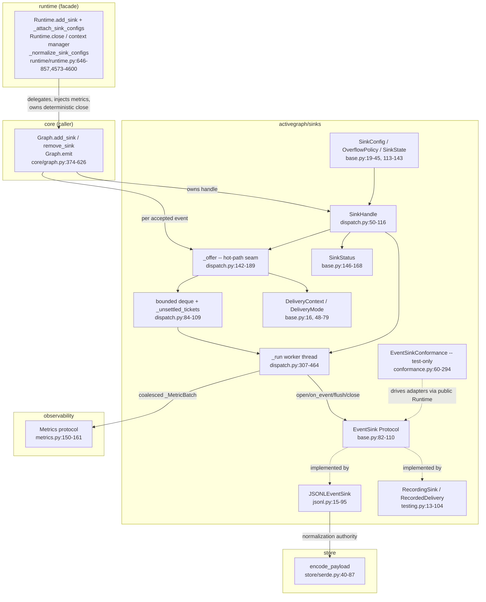
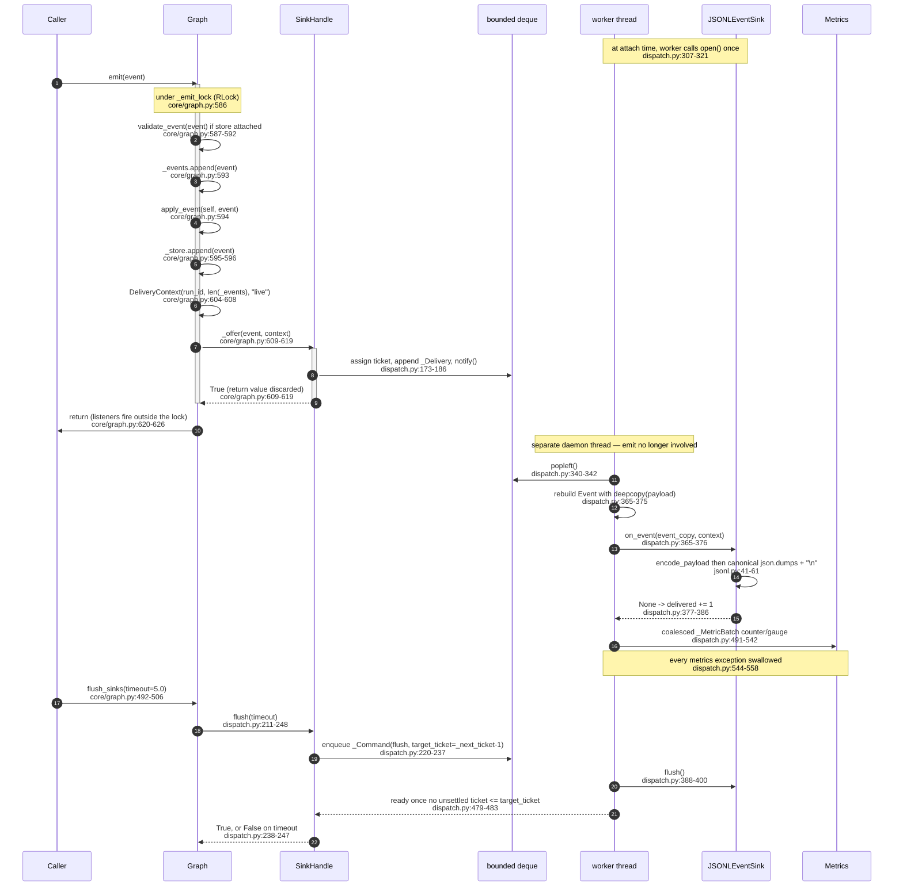

# Sinks — the outbound observation seam

## Responsibility

`activegraph/sinks/` lets external destinations watch events the graph has **already accepted**,
without giving those destinations any authority over the run. A sink "observes facts the runtime has
already accepted; it is neither another state store nor a behavior hook" (CONTRACT.md:7711-7715).
Every attachment gets its own daemon worker thread and its own bounded FIFO, so the emit path never
runs adapter code, never waits for queue capacity, and never lets an adapter exception cross back
into graph mutation, behavior scheduling, replay, fork, diff, or promotion
(activegraph/sinks/base.py:1-5,82-110; CONTRACT.md:7744-7749,7781-7788). This is deliberately *not*
the durability path — `EventStore` is durability (`activegraph/core/graph.py:539-626`); sinks are
best-effort observation with declared, counted loss.

## Component map



## Key types & entry points

- `EventSink` — 4-method runtime-checkable Protocol (`open`/`on_event`/`flush`/`close`), all
  returning `None` — `activegraph/sinks/base.py:82-110`
- `DeliveryContext` — frozen `(run_id, sequence, mode)` metadata per delivery —
  `activegraph/sinks/base.py:48-79`
- `DeliveryMode` — `Literal["live", "replay_export"]` — `activegraph/sinks/base.py:16`
- `OverflowPolicy` — `DROP_NEWEST` | `DROP_OLDEST` | `FAIL_SINK` str-Enum —
  `activegraph/sinks/base.py:19-30`
- `SinkState` — `OPENING`/`RUNNING`/`CLOSING`/`CLOSED`/`FAILED` — `activegraph/sinks/base.py:33-45`
- `SinkConfig` — frozen attachment config `(sink, name=None, queue_capacity=1024,
  overflow_policy=DROP_NEWEST)` with `__post_init__` validation — `activegraph/sinks/base.py:113-143`
- `SinkStatus` — frozen exact-count status snapshot — `activegraph/sinks/base.py:146-168`
- `SinkHandle` — the dispatcher: one bounded deque plus one daemon worker thread per attachment —
  `activegraph/sinks/dispatch.py:50-116`
- `SinkHandle._offer(event, context) -> bool` — the runtime-facing hot-path seam; non-blocking and
  non-throwing by design — `activegraph/sinks/dispatch.py:142-189`
- `SinkHandle.flush(timeout=5.0)` / `close(timeout=5.0)` — the only blocking operations in the
  dispatcher — `activegraph/sinks/dispatch.py:211-295`
- `Runtime.close(timeout=5.0) -> bool` and `Runtime.__enter__` / `__exit__` — deterministic
  graph-wide sink ownership; close is retryable and does not close stores or listeners —
  `activegraph/runtime/runtime.py:709-758`
- `JSONLEventSink` — first-party append-only JSONL adapter, refcounted open/close —
  `activegraph/sinks/jsonl.py:15-95`
- `RecordingSink` / `RecordedDelivery` — thread-safe public test double with `wait_for` —
  `activegraph/sinks/testing.py:13-104`
- `EventSinkConformance` — pytest-collectable ABC that drives candidate adapters only through the
  public `Runtime`/`Graph` boundary — `activegraph/sinks/conformance.py:60-294`

Internal-only dataclasses in dispatch: `_Delivery` (ticket/event/context,
`activegraph/sinks/dispatch.py:27-31`), `_Command` (flush|close + `target_ticket` +
`threading.Event`, `activegraph/sinks/dispatch.py:34-39`), `_MetricBatch` (coalesced metric
publication, `activegraph/sinks/dispatch.py:42-48`).

## Interfaces & contracts at each seam

### sinks <-> core (`core.Graph`)

`Graph` is the production owner of every handle. It crosses the boundary on two distinct
surfaces. On the **control plane**, `Graph.add_sink` constructs the handle and starts its worker
(`activegraph/core/graph.py:374-423`), importing `EventSink`, `OverflowPolicy` and `SinkHandle`
lazily inside the function body (`activegraph/core/graph.py:394-397`) because the module-level
imports are `TYPE_CHECKING`-only (`activegraph/core/graph.py:38-42`). On the **delivery hot path**,
`Graph.emit` fans out to every attached handle after the event has been logged, projected and
persisted (`activegraph/core/graph.py:584-626`). `Graph._replay_event` deliberately does *not* offer
sinks and does not fire listeners (`activegraph/core/graph.py:630-638`) — that is what makes normal
replay silent.

```ebnf
accepted-emit      ::= validate? , log-append , project , persist? , sink-fanout , listener-fanout
validate           ::= validate_event(event)              (* only when a store is attached
                                                             core/graph.py:587-592 *)
log-append         ::= graph._events.append(event)                        (* core/graph.py:593 *)
project            ::= apply_event(graph, event)                          (* core/graph.py:594 *)
persist            ::= EventStore.append(event)   (* raising here skips sink-fanout
                                                             core/graph.py:595-596 *)

sink-fanout        ::= { offer }             (* one per attached handle, snapshot order
                                                             core/graph.py:601-619 *)
offer              ::= SinkHandle._offer(event, context) "->" bool
context            ::= DeliveryContext(run_id, sequence, "live")          (* core/graph.py:604-608 *)
sequence           ::= positive-int          (* len(graph._events) after append -- the one-based
                                                materialized-log position, NOT the store seq column
                                                core/graph.py:604-608, CONTRACT.md:7733-7742 *)

offer-outcome      ::= Enqueued | Dropped(reason) | Refused
Enqueued           ::= true                  (* ticket assigned, worker notified
                                                             dispatch.py:173-186 *)
Dropped            ::= false | true          (* drop_oldest evicts AND enqueues -> true
                                                             dispatch.py:157-171 *)
Refused            ::= false                 (* handle not accepting; counted as sink.not_accepting
                                                             dispatch.py:153-156 *)
reason             ::= "overflow.drop_newest" | "overflow.drop_oldest" | "overflow.fail_sink"
                     | "sink.not_accepting"                (* dispatch.py:153-171 *)

attach             ::= Graph.add_sink(sink, name?, queue_capacity?, overflow_policy?, metrics?)
                       "->" SinkHandle | TypeError | ValueError            (* core/graph.py:374-423 *)
detach             ::= Graph.remove_sink(name | handle, timeout?) "->" bool  (* core/graph.py:425-460 *)
                     | SinkHandle.close(timeout?) "->" bool  (* routes via _owner_close
                                                             core/graph.py:421, dispatch.py:250-268 *)
lifecycle-query    ::= Graph.sink_statuses() "->" SinkStatus*  (* active + closing + retained
                                                                  terminal, core/graph.py:469-484 *)
                     | Graph._sink_names_in_use() "->" frozenset[str]     (* core/graph.py:486-490 *)
bulk               ::= Graph.flush_sinks(timeout?) "->" bool               (* core/graph.py:492-506 *)
                     | Graph.close_sinks(timeout?) "->" bool               (* core/graph.py:508-535 *)
                       (* bool = all() over per-attachment results; timeout applies PER sink *)
```

Contract notes:

- **Ordering promise.** Sinks are offered *before* legacy listeners, so a re-entrant listener cannot
  emit event N+1 before sinks saw N, and a listener exception cannot suppress observation of an
  accepted event (`activegraph/core/graph.py:597-625`; CONTRACT.md:7773-7779). Steps 1-5 all run
  under `Graph._emit_lock`, an RLock (`activegraph/core/graph.py:191-196,586`); listeners run after
  the lock is released (`activegraph/core/graph.py:620-625`).
- **Containment.** `_offer`'s return value is discarded and the call is wrapped in a bare
  `except Exception: continue` as a final containment boundary
  (`activegraph/core/graph.py:609-619`).
- **Precondition on attach.** `TypeError` if the object fails `isinstance(sink, EventSink)`
  (`activegraph/core/graph.py:399-402`); `ValueError` on blank or duplicate name
  (`activegraph/core/graph.py:403-410`). Names are unique per graph and double as both status keys
  and metric label values (CONTRACT.md:7753-7762).
- **Lock discipline on detach.** `remove_sink` moves the handle from `_sinks` to `_closing_sinks`
  under `_emit_lock`, then calls `handle._close_worker(timeout)` **outside** the lock
  (`activegraph/core/graph.py:433-452`).
- **Terminal status retention.** Failed close statuses are kept in `Graph._terminal_sink_statuses`
  until the name is reused or explicitly removed (`activegraph/core/graph.py:421,444-459,
  469-484,528-534`).
- **Default metrics backend is `NoOpMetrics`** when attaching straight to a `Graph` without an
  explicit `metrics=` argument; the docstring states that boundary (`activegraph/core/graph.py:383-392,418`).

### sinks <-> runtime (`runtime.Runtime`)

`Runtime` is a thin facade plus construction-time config normalization. Unlike `Graph` it imports
the sink types at module level — `EventSink`, `OverflowPolicy`, `SinkConfig`, `SinkStatus`
(`activegraph/runtime/runtime.py:140-145`) and `SinkHandle`
(`activegraph/runtime/runtime.py:146`). Its load-bearing contributions are (a) injecting the
runtime metrics backend, (b) guaranteeing that history replay finishes *before* any sink is
attached, so `load` and `fork` never redeliver the past, and (c) owning deterministic graph-wide
sink shutdown through `close()` and context management.

```ebnf
attach             ::= Runtime.add_sink(sink, name?, queue_capacity?, overflow_policy?)
                                                              (* runtime/runtime.py:798-820 *)
                     | Runtime(graph, ..., sinks=sink-spec-list)
                     | Runtime.load(path, ..., sinks=sink-spec-list)
                     | Runtime.fork(at_event, ..., sinks=sink-spec-list)

sink-spec-list     ::= { sink-spec }
sink-spec          ::= EventSink | SinkConfig                 (* runtime/runtime.py:4573-4600 *)
SinkConfig         ::= "(" sink , name? , queue_capacity? , overflow_policy? ")"
name               ::= non-blank-string                       (* default: type(sink).__name__ *)
queue_capacity     ::= positive-int                           (* default 1024 *)
overflow_policy    ::= "drop_newest" | "drop_oldest" | "fail_sink"   (* default drop_newest *)

normalize          ::= _normalize_sink_configs(sinks) "->" list[SinkConfig]
                                                              (* runtime/runtime.py:4573-4600 *)
                       | TypeError                            (* runtime/runtime.py:4587-4592 *)
                       | ValueError                           (* duplicate resolved name,
                                                                 runtime/runtime.py:4593-4599 *)
cross-check        ::= Runtime.__init__ vs graph._sink_names_in_use() "->" ValueError
                                                              (* runtime/runtime.py:449-460 *)
attach-batch       ::= Runtime._attach_sink_configs(configs)  (* runtime/runtime.py:646-663 *)
                       (* on any failure: remove_sink(..., timeout=1.0) every already-attached
                          handle, then re-raise *)
delegation         ::= Runtime.remove_sink | sink_statuses | flush_sinks | close_sinks
                                                              (* runtime/runtime.py:822-857 *)
runtime-close      ::= Runtime.close(timeout?) "->" bool      (* closes all graph sinks;
                                                                 stores/listeners stay open;
                                                                 runtime/runtime.py:717-733 *)
context-ownership  ::= Runtime.__enter__ , user-block , Runtime.__exit__
                                                              (* runtime/runtime.py:735-758 *)
post-close-mutate  ::= Runtime.add_sink | Runtime.remove_sink | other mutator
                       "->" RuntimeClosedError
```

Contract notes:

- **Runtime attachment automatically injects `self.metrics`** (`activegraph/runtime/runtime.py:798-820`).
  Direct `Graph.add_sink` attachment defaults to `NoOpMetrics`, but a direct caller may explicitly
  supply another `metrics=` implementation.
- **Normalization runs before any worker starts**, so a late duplicate name cannot leak threads out
  of a half-built `Runtime` (`activegraph/runtime/runtime.py:4576-4600`).
- **Replay-before-attach invariant.** `_attach_sink_configs` is called at the *end* of `__init__`
  (`activegraph/runtime/runtime.py:646-663`, with listener-detach compensation on failure) and,
  critically, **after full history replay** in `Runtime.load`
  (`activegraph/runtime/runtime.py:3801-3817,3831-3856,3874-3898`) and `Runtime.fork`
  (`activegraph/runtime/runtime.py:3940-3944,4000-4011,4040-4070,4093-4100`). Strict replay's
  verification runtime therefore inherits no sinks (CONTRACT.md:7844-7852).
- **Rollback is all-or-nothing** on batch attach (`activegraph/runtime/runtime.py:646-663`).
- **Deterministic ownership.** `Runtime.close()` marks the runtime closed on first call, delegates
  to the Graph close path, permits explicit close retries, and untracks a successful close;
  `with Runtime(...)` calls the same boundary without suppressing user exceptions
  (`activegraph/runtime/runtime.py:709-758`; `CONTRACT.md:9151-9164`).
- The production code in `activegraph/sinks/` imports nothing from `activegraph/runtime/`; the
  reverse-direction import edge exists only in the test-support conformance module
  (`activegraph/sinks/conformance.py:20-24`).

### sinks <-> observability (`observability.metrics`)

`SinkHandle` publishes four metrics, and only from the worker thread. Counts accumulate into
`_pending_*` fields on the emit side and are published in a coalesced `_MetricBatch` on the worker
(`activegraph/sinks/dispatch.py:103-109,491-542`), so a blocked metrics backend can stall only that
one sink and never the emit path.

```ebnf
metric-publication ::= { counter-call | gauge-call }     (* worker thread only, coalesced *)
counter-call       ::= Metrics.counter(name, tags, value) "->" ignored-including-exceptions
gauge-call         ::= Metrics.gauge(name, tags, value)   "->" ignored-including-exceptions

name               ::= "activegraph_sink_events_delivered_total"   tags={sink}
                     | "activegraph_sink_events_dropped_total"     tags={sink,reason}
                     | "activegraph_sink_errors_total"             tags={sink,operation}
                     | "activegraph_sink_queue_depth"              tags={sink,run_id}   (* gauge *)
reason             ::= "overflow.drop_newest" | "overflow.drop_oldest" | "overflow.fail_sink"
                     | "sink.not_accepting" | "sink.open_failed"
                                                     (* dispatch.py:153-171,425-433 *)
operation          ::= "open" | "on_event" | "flush" | "close"
                                     (* dispatch.py:313, 377, 392/409/450, 410/438/454 *)
```

Contract notes:

- **Cardinality rule: `run_id` appears ONLY on the gauge, never on a counter**
  (`activegraph/observability/metrics.py:293-315`; CONTRACT.md:7836-7842).
- `Metrics` is imported as a protocol at `activegraph/sinks/dispatch.py:17` and used only through
  `_safe_counter` / `_safe_gauge`, both of which swallow every exception
  (`activegraph/sinks/dispatch.py:544-558`). A refusal recorded after a terminal worker has stopped
  remains exact in `SinkStatus`, even though no worker remains to publish that pending metric batch.

### sinks <-> store (`store.serde`, plus a test-only `store.memory` edge)

The only production edge is `JSONLEventSink` treating `encode_payload` as its **normalization
authority**: encode to JSON, `json.loads` back, then re-dump with `sort_keys=True` and compact
separators (`activegraph/sinks/jsonl.py:41-61`). The second edge — `InMemoryEventStore` at
`activegraph/sinks/conformance.py:24` — is test-support only.

```ebnf
jsonl-line         ::= canonical-json , "\n"                            (* jsonl.py:41-61 *)
canonical-json     ::= json.dumps(normalized, ensure_ascii=False, sort_keys=True,
                                  separators=(",", ":"))
normalized         ::= json.loads(encode_payload(envelope))             (* store/serde.py:40-87 *)
envelope           ::= "{" "context" ":" context.to_dict() ","
                           "event"   ":" event.to_dict()   "}"
context.to_dict    ::= "{" "mode" "," "run_id" "," "sequence" "}"       (* base.py:72-79 *)
event.to_dict      ::= "{" id, type, payload, actor, frame_id, caused_by, timestamp "}"
                                                                        (* core/event.py:34-43 *)
```

Contract notes:

- `encode_payload` normalizes `Decimal -> str`, `date`/`datetime` -> ISO 8601, `set` -> sorted list
  (`activegraph/sinks/jsonl.py:45-50`; `activegraph/store/serde.py:40-87`) and raises
  `NonSerializableEventError` on unencodable values (`activegraph/store/serde.py:58-87`). In practice
  this cannot trigger for a sink delivery because `Graph.emit` already ran `validate_event` before
  acceptance (`activegraph/core/graph.py:587-592`) — but only when a store is attached.
- Line shape is pinned in CONTRACT.md:7861-7874.
- The file is opened in append mode and is never rotated or truncated
  (`activegraph/sinks/jsonl.py:38`). `open`/`close` are reference-counted so one instance can serve
  several concurrent run attachments (`activegraph/sinks/jsonl.py:39, 73-77`). `on_event` before
  `open` raises `RuntimeError` (`activegraph/sinks/jsonl.py:59-60`). `close` raises the single
  flush/close error, or an `ExceptionGroup` if both fail (`activegraph/sinks/jsonl.py:80-95`).
  Cross-instance and cross-process writers to the same path do **not** coordinate
  (`activegraph/sinks/jsonl.py:22-24`).

### sinks <-> external adapters (the public `EventSink` boundary)

The worker thread is the only caller of adapter code. This is the seam third-party destinations
implement, re-exported at package top level with `DeliveryContext`, `DeliveryMode`, `EventSink`,
`JSONLEventSink`, `OverflowPolicy`, `RecordedDelivery`, `RecordingSink`, `SinkConfig`, `SinkHandle`,
`SinkState`, and `SinkStatus` (`activegraph/__init__.py:74-86,185-195,236-280`).

```ebnf
sink-session       ::= open-outcome , { delivery } , teardown
open-outcome       ::= Ok | Raise(exc)
                       (* Raise => state FAILED, queue dropped as "sink.open_failed",
                          close() still attempted best-effort   dispatch.py:307-321,425-444 *)

delivery           ::= EventSink.on_event(event-copy, context) "->" ignored
event-copy         ::= Event(id, type, deepcopy(payload), actor, frame_id, caused_by, timestamp)
                                                              (* dispatch.py:365-375 *)
ignored            ::= None | Raise(exc)
                       (* None  => delivered += 1
                          Raise => errors += 1, last_error recorded, worker continues
                                                                 dispatch.py:365-386 *)

teardown           ::= flush-call , close-call
flush-call         ::= EventSink.flush() "->" None | Raise(exc)
close-call         ::= EventSink.close() "->" None | Raise(exc)
                       (* any raise => terminal state FAILED, not CLOSED   dispatch.py:388-423 *)

conformance-subclass ::= class C(EventSinkConformance) with __test__ = True
                       , make_sink() "->" EventSink                    (* conformance.py:72-75 *)
                       , read_deliveries(sink) "->" Sequence[RecordedDelivery]
                                                                       (* conformance.py:76-80 *)
                       , cleanup()?                                    (* conformance.py:82-83 *)
inherited-cases    ::= live-order | unicode-round-trip | concurrent-run-order
                     | rejected-not-delivered | sibling-isolation | bounded-overflow
                     | load-does-not-redeliver
                     (* all drive the adapter only through Runtime(graph, behaviors=[],
                        sinks=[...])   conformance.py:60-294 *)
```

Contract notes:

- **Delivery guarantee: at-most-once, best-effort, with declared and counted loss.** There is no
  retry, no backoff and no dead-letter path anywhere in `dispatch.py`. `_deliver` catches the adapter
  exception, records it, and settles the ticket in a `finally`
  (`activegraph/sinks/dispatch.py:365-386`) — the event is never redelivered. Loss is *declared*
  (chosen by `OverflowPolicy`) and *counted* (`SinkStatus.dropped_by_reason`). CONTRACT.md:7781-7788.
- **Adapter obligations:** thread-safe if shared across runs; `close()` idempotent; return values are
  never consulted (`activegraph/sinks/base.py:82-110`; CONTRACT.md:7744-7749).
- **Ordering.** Within one attachment, per run: strict FIFO — a monotonic `_next_ticket` is assigned
  under the condition lock (`activegraph/sinks/dispatch.py:173-186`) and one worker `popleft()`s
  (`activegraph/sinks/dispatch.py:340-342`). Across attachments: no order promise (separate threads).
  Across runs sharing one adapter instance: no total order, and the adapter must be thread-safe
  (CONTRACT.md:7781-7788). Both first-party adapters take an internal lock —
  `activegraph/sinks/jsonl.py:29, 58` and `activegraph/sinks/testing.py:34, 59`.
- **No backpressure, by design.** `_offer` never waits for capacity
  (`activegraph/sinks/dispatch.py:142-189`; CONTRACT.md:7781-7788). The emit thread's total
  sink cost is: take the handle's condition lock, append to a deque, `notify()`.
- **Bounded control plane.** `flush(timeout=5.0)` and `close(timeout=5.0)` are the only places
  anything waits, and both return `False` on timeout rather than blocking forever
  (`activegraph/sinks/dispatch.py:211-295`; CONTRACT.md:7822-7827). A `flush` command
  carries `target_ticket = _next_ticket - 1` and only becomes ready when no unsettled ticket
  `<= target_ticket` remains (`activegraph/sinks/dispatch.py:220-237,479-483`) — that is the "flush
  covers everything accepted before this call" promise. A timed-out flush removes its own command
  from the deque so repeated timeouts do not accumulate commands
  (`activegraph/sinks/dispatch.py:238-247`), and a `flush()` racing a close coalesces onto the
  existing close command (`activegraph/sinks/dispatch.py:220-237`). `Runtime.close()` and
  `__exit__` delegate to the same graph-wide close path.
- **Failure isolation matrix:**

  | failure | effect | citation |
  |---|---|---|
  | `open()` raises | state `FAILED`, all queued entries dropped as `sink.open_failed`, `close()` still attempted best-effort | dispatch.py:307-321,425-444 |
  | `on_event()` raises | `errors += 1`, `delivered` NOT incremented, worker continues to next delivery | dispatch.py:365-386 |
  | `flush()` raises | that flush command returns `success=False` | dispatch.py:388-400 |
  | `close()` raises | final state becomes `FAILED` instead of `CLOSED` | dispatch.py:402-423 |
  | adapter hangs in `on_event` | only that attachment's queue fills; siblings and emit unaffected | CONTRACT.md:7781-7788 |
  | metrics backend raises | swallowed, returns | dispatch.py:544-558 |
  | `_offer` somehow raises | swallowed by `Graph.emit` | core/graph.py:609-619 |

- **Structural invariants:**
  - `_unsettled_tickets` is bounded by `queue_capacity + 1` even when `DROP_OLDEST` evicts an
    unbounded stream behind a hung delivery (`activegraph/sinks/dispatch.py:84-93,161-165`).
  - `SinkStatus.queue_depth` **excludes** an item currently executing inside `on_event`
    (`activegraph/sinks/base.py:146-168` vs. `activegraph/sinks/dispatch.py:340-342`).
  - `queue_capacity` is validated in `SinkHandle.__init__`
    (`activegraph/sinks/dispatch.py:70-75`) **before** `Thread(...).start()`
    (`activegraph/sinks/dispatch.py:111-116`) — a bad capacity never leaks a thread.
  - `DeliveryContext.__post_init__` rejects empty `run_id`, `sequence < 1`, and unknown `mode` with
    `ValueError` (`activegraph/sinks/base.py:62-70`).
  - `SinkConfig.__post_init__` rejects blank names and non-positive/bool capacities with
    `ValueError`, and coerces a string `overflow_policy` into the enum via `object.__setattr__`
    (`activegraph/sinks/base.py:127-143`).
  - Events are isolated copies: mutating a delivered payload cannot touch the graph's log
    (`activegraph/sinks/dispatch.py:365-375`; pinned by `tests/test_event_sinks.py:620-648`).
  - Promotion delta events *are* observed even though scheduling applies them quiescently
    (CONTRACT.md:7790-7793; pinned by `tests/test_event_sinks.py:1611-1633`).
  - `mode="replay_export"` is a reserved stub — no production path constructs it; `Graph.emit`
    hardcodes `mode="live"` (`activegraph/core/graph.py:604-608`; CONTRACT.md:7854-7859).

## Sequence: one accepted event reaches a JSONL file



## Open questions

1. **Resolved — non-accepting offers are exact-counted.** `_offer` records every refusal as
   `sink.not_accepting` before returning `False` (`activegraph/sinks/dispatch.py:153-156`), including
   offers made after `FAIL_SINK` stops the worker. The terminal status is the authoritative count;
   a stopped worker may have no opportunity to publish the final pending metric batch
   (CONTRACT.md:7836-7842).

2. **Resolved documentation boundary — direct `Graph` attachment defaults to `NoOpMetrics`.** The
   `Graph.add_sink` docstring now states that default (`activegraph/core/graph.py:383-392,418`).
   `Runtime.add_sink` injects `self.metrics` (`activegraph/runtime/runtime.py:798-820`), while a
   direct caller may deliberately pass another `metrics=` implementation.

3. **Resolved — `Runtime` owns deterministic sink shutdown.** `Runtime.close()` closes all graph
   sinks, and `Runtime.__enter__` / `__exit__` provide a context-managed ownership boundary
   (`activegraph/runtime/runtime.py:709-758`; CONTRACT.md:9151-9164). There is intentionally no
   `__del__` or `atexit` shutdown hook: callers use `close()` or `with Runtime(...)` when adapter
   resources must be reaped deterministically.

4. **Resolved boundary — `replay_export` remains a reserved compatibility stub.** The type and
   validation accept it (`activegraph/sinks/base.py:48-70`), while live `Graph.emit` is still the
   only producer and hardcodes `"live"` (`activegraph/core/graph.py:604-608`; CONTRACT.md:7854-7859).

5. **Resolved boundary — the `sinks -> runtime` and conformance `sinks -> store.memory` edges are
   test-support only.** They live in `activegraph/sinks/conformance.py:17-24`; ordinary sink exports
   do not import the conformance module (`activegraph/sinks/__init__.py:3-28`). The production
   `sinks -> store` edge remains `JSONLEventSink -> store.serde`
   (`activegraph/sinks/jsonl.py:10-12`).

6. **Resolved — `DeliveryMode` is exported at both public levels.** It is exported from
   `activegraph.sinks` (`activegraph/sinks/__init__.py:3-28`) and from the top-level package
   (`activegraph/__init__.py:74-86,185-195`).

7. **Resolved — flush is non-owning; close and remove reap terminal ownership.** `flush_sinks`
   leaves every attachment registered, while `close_sinks` moves active handles through the closing
   registry and retains terminal failure status (`activegraph/core/graph.py:492-535`;
   CONTRACT.md:7822-7827). A close attempt can return `False` even if the worker subsequently
   becomes terminal; registry cleanup and the retained status describe that final outcome.
