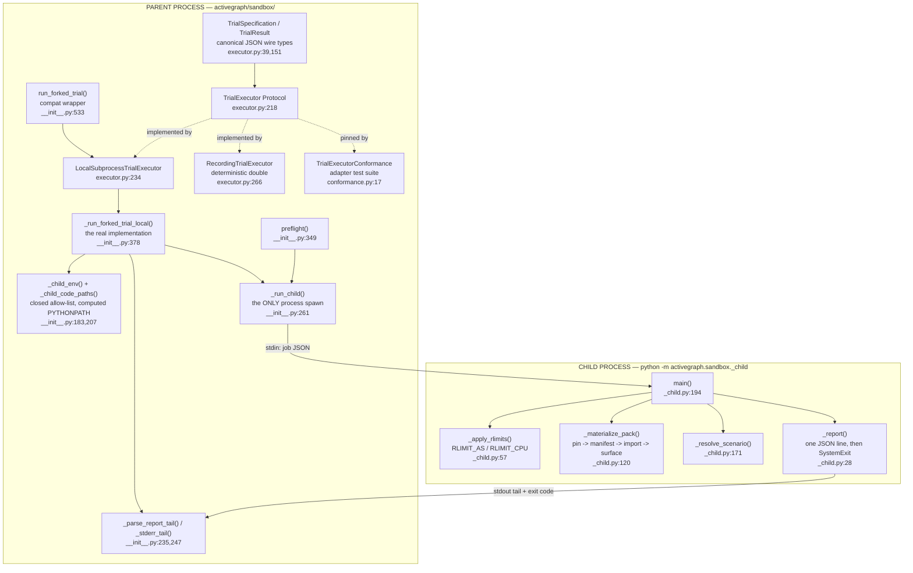
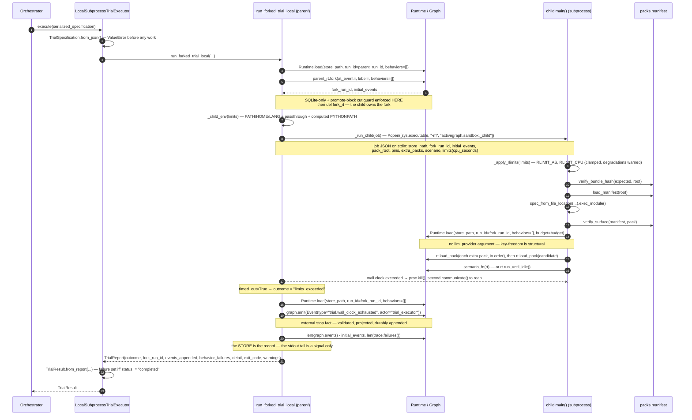

# Sandbox — Subprocess-Isolated Pack Trials

## Responsibility

`sandbox/` runs candidate pack code under trial in a **fresh interpreter subprocess**, against a
**fork** of a saved run, from artifacts **pinned by bundle hash** — so the parent process is
outside the blast radius of a runaway candidate, and the bytes trialed are the bytes a proposal
recorded (`activegraph/sandbox/__init__.py:1-8`). The division of authority is fixed: the parent
creates the fork with full `fork()` semantics and hands the child only the fork's **run id**; the
child appends to that run and nothing else (`activegraph/sandbox/__init__.py:11-14`,
`CONTRACT.md:7456-7459`).

This is explicitly **crash/state isolation, not a security sandbox** — there is no syscall,
network, or filesystem confinement, and the shared-SQLite caveat (a hostile child could open the
store file directly and touch other runs) is *stated rather than solved*
(`activegraph/sandbox/__init__.py:46-56`, `CONTRACT.md:7485-7490`). Those limits are encoded as
machine-readable contract data, not prose (`activegraph/sandbox/executor.py:25-36`).

CONTRACT v1.8 #9–#12 lifted the implementation behind a serialized, provider-neutral
`TrialExecutor` protocol. `run_forked_trial` is now a compatibility wrapper over the default local
adapter, not a second execution path (`activegraph/sandbox/__init__.py:58-61`,
`CONTRACT.md:8057-8064`).

## Component map



## Key types & entry points

### Parent side — `activegraph/sandbox/__init__.py` (598 lines)

- `TRIAL_OUTCOMES` — the closed outcome set: `completed | scenario_failed | limits_exceeded | materialization_failed | crashed` — `activegraph/sandbox/__init__.py:82-88`
- `_EXIT_TO_OUTCOME` — child exit-code → outcome map (`0/30/40/50`) — `activegraph/sandbox/__init__.py:91-96`
- `PackSource(root_dir, expected_bundle_hash, manifest_required=True)` — the hash is required and must be exact lowercase `sha256:` plus 64 hex characters (`activegraph/sandbox/__init__.py`)
- `TrialLimits(wall_clock_seconds=120.0, max_rss_bytes=None, max_events=2000, max_llm_calls=0, env_passthrough=())` — `activegraph/sandbox/__init__.py:118-142`
- `TrialReport(outcome, fork_run_id, events_appended, behavior_failures, detail, exit_code, warnings=())` — `activegraph/sandbox/__init__.py:145-169`
- `SandboxStartupError(RuntimeError)` — `activegraph/sandbox/__init__.py:172-180`
- `_child_code_paths() -> list[str]` — resolves the explicit code channel from the parent's `sys.path` — `activegraph/sandbox/__init__.py:183-204`
- `_child_env(limits) -> dict[str,str]` — closed allow-list plus computed `PYTHONPATH` — `activegraph/sandbox/__init__.py:207-232`
- `_stderr_tail(stderr, max_lines=20, max_chars=1500)` — `activegraph/sandbox/__init__.py:235-244`
- `_parse_report_tail(stdout) -> dict` — last valid JSON line carrying `outcome` or `preflight` — `activegraph/sandbox/__init__.py:247-258`
- `_run_child(job, *, env, wall_clock, python_flags=())` — the **only** process spawn in the subsystem — `activegraph/sandbox/__init__.py:261-292`
- `_PREFLIGHT_PROBE_RSS = 1024 * 2**20` — `activegraph/sandbox/__init__.py:302`
- `_limits_job_block(limits, *, probe)` — derives `cpu_seconds` for the child — `activegraph/sandbox/__init__.py:305-317`
- `_preflight_with(env, *, limits, python_flags, timeout=30.0)` — testable seam — `activegraph/sandbox/__init__.py:320-346`
- `preflight(*, limits=TrialLimits(), timeout=30.0) -> tuple[str, ...]` — `activegraph/sandbox/__init__.py:349-375`
- `_run_forked_trial_local(...) -> TrialReport` — the real implementation — `activegraph/sandbox/__init__.py:378-530`
- `run_forked_trial(...) -> TrialReport` — compatibility wrapper over the local adapter — `activegraph/sandbox/__init__.py:533-563`

### Provider-neutral seam — `activegraph/sandbox/executor.py` (392 lines)

- `TrialIsolationGuarantees(process, filesystem, network, syscalls, environment, security_sandbox, notes=())` — `activegraph/sandbox/executor.py:12-22`
- `LOCAL_SUBPROCESS_ISOLATION` — the local adapter's declared claims, `security_sandbox=False` — `activegraph/sandbox/executor.py:25-36`
- `TrialSpecification` with `.to_json()` / `.from_json()` — `activegraph/sandbox/executor.py:39-112`
- `TrialBudgetUse(events_appended, behavior_failures, limits)` — `activegraph/sandbox/executor.py:115-121`
- `TrialArtifactReference(name, uri, media_type=None, digest=None)` — `activegraph/sandbox/executor.py:124-131`
- `TrialEventLogReference(store_path, run_id)` — `activegraph/sandbox/executor.py:134-139`
- `TrialFailureDetails(kind, message, exit_code=None)` — `activegraph/sandbox/executor.py:142-148`
- `TrialResult` with `.from_report()` / `.to_report()` — `activegraph/sandbox/executor.py:151-215`
- `TrialExecutor` — `@runtime_checkable Protocol` — `activegraph/sandbox/executor.py:218-231`
- `LocalSubprocessTrialExecutor` — `activegraph/sandbox/executor.py:234-263`
- `RecordingTrialExecutor(results, *, isolation_guarantees=None)` — deterministic double — `activegraph/sandbox/executor.py:266-302`

### Child side — `activegraph/sandbox/_child.py` (319 lines, a **separate process entry point**)

- `python -m activegraph.sandbox._child` — `activegraph/sandbox/_child.py:318-319`
- `_LIMIT_WARNINGS: list[str]` — module global collecting degradations — `activegraph/sandbox/_child.py:25`
- `_report(outcome, *, fork_run_id, events_appended, behavior_failures, detail, exit_code)` — prints one JSON line, then `SystemExit` — `activegraph/sandbox/_child.py:28-54`
- `_apply_rlimits(limits) -> list[str]` — `activegraph/sandbox/_child.py:57-109`
- `_mem_off(reason) -> str` — the memory-degradation warning text — `activegraph/sandbox/_child.py:112-117`
- `_materialize_pack(job) -> Pack` — the pin-first chain — `activegraph/sandbox/_child.py:120-168`
- `_resolve_scenario(root, scenario) -> Optional[Callable]` — `activegraph/sandbox/_child.py:171-191`
- `main()` — `activegraph/sandbox/_child.py:194-315`

### Adapter conformance — `activegraph/sandbox/conformance.py` (79 lines)

- `TrialExecutorConformance(ABC)` with `__test__ = False`, abstract `make_executor()` / `make_serialized_specification()` — `activegraph/sandbox/conformance.py:17-32`
- Four inherited cases every adapter must pass — `activegraph/sandbox/conformance.py:34-76`

## Interfaces & contracts at each seam

### sandbox <-> callers (public API — a dangling boundary)

**Nothing inside `activegraph/` imports `sandbox/`.** A repo-wide grep for `sandbox` in `*.py`
outside `activegraph/sandbox/` returns exactly one hit, a prose docstring mention at
`activegraph/packs/manifest.py:16`. `activegraph/__init__.py` has no `sandbox` reference at all,
and the docs state this is deliberate (`docs/reference/api/sandbox.md:20-24`: "it is intentionally
not re-exported at the top level"). `sandbox/` is a **leaf, opt-in subsystem** whose real consumer
— the evolution pack in the separate `activegraph-packs` package (`CONTRACT.md:7988-7989`) — lives
outside this repo. In-repo consumers are the tests (`tests/test_sandbox_trial.py:19-26`,
`tests/test_trial_executor.py:11-23`).

```ebnf
trial-request        ::= run_forked_trial( store_path ,
                                           parent_run_id , at_event ,
                                           pack_source ,
                                           [ scenario ] , [ limits ] ,
                                           [ label ] , [ extra_packs ] )
store_path           ::= sqlite-path | store-url        (* fork requires SQLite *)
pack_source          ::= PackSource( root_dir , expected_bundle_hash , manifest_required )
expected_bundle_hash ::= "sha256:" 64*LOWER-HEXDIG       (* mandatory *)
manifest_required    ::= true | false                   (* default true *)
extra_packs          ::= "(" { pack_source } ")"        (* loaded BEFORE the candidate *)
scenario             ::= "" | rel-path [ "::" func-name ]   (* default func "main" *)
limits               ::= TrialLimits( wall_clock_seconds , max_rss_bytes ,
                                      max_events , max_llm_calls , env_passthrough )

trial-response       ::= TrialReport( outcome , fork_run_id ,
                                      events_appended , behavior_failures ,
                                      detail , exit_code , warnings )
outcome              ::= "completed" | "scenario_failed" | "limits_exceeded"
                       | "materialization_failed" | "crashed"

startup-probe        ::= preflight( [ limits ] , [ timeout ] )
probe-response       ::= warnings | raise SandboxStartupError
warnings             ::= "(" { degradation-string } ")"     (* () == fully clean *)
```

`activegraph/sandbox/__init__.py:82-88, 99-142, 145-169, 349-351, 533-543`.

**Contract notes.**
- `run_forked_trial` **never raises for in-trial failures** — those are *outcomes*. It raises only
  for parent-side setup problems (bad store, bad fork point), with the same errors `Runtime.load` /
  `Runtime.fork` raise (`activegraph/sandbox/__init__.py:416-418`).
- `preflight` returns degradation warnings (empty tuple = fully clean) and raises
  `SandboxStartupError` carrying the child's stderr tail when a child cannot start
  (`activegraph/sandbox/__init__.py:344-346`).
- **The store is the record.** `events_appended` and `behavior_failures` are re-read from the
  fork's run by the parent *after* the child exits; the stdout tail is a signal only and never
  overrides the store — `activegraph/sandbox/__init__.py:489-518`, `:148-152`,
  `CONTRACT.md:7478-7484`.
- **Outcome classification is total and closed** (`activegraph/sandbox/__init__.py:451-466`):
  `timed_out` → `limits_exceeded`; a parseable tail whose `outcome` is outside `TRIAL_OUTCOMES` →
  `crashed`; no tail → `_EXIT_TO_OUTCOME.get(exit_code, "crashed")`, with **exit 0 and no tail
  forced to `crashed`** ("exit 0 with no tail is itself suspicious; say so",
  `activegraph/sandbox/__init__.py:463-465`).
- **A degraded net is announced, never silent.** Child warnings are lifted into
  `TrialReport.warnings`, folded into `detail` as `[degraded: ...]`, and logged at WARNING —
  `activegraph/sandbox/__init__.py:482-487`.

### sandbox <-> orchestration (the v1.8 `TrialExecutor` adapter boundary)

Orchestrators serialize a trial to canonical JSON and hand it to any `TrialExecutor`. The parent
never passes live objects across this seam, so a remote adapter (Docker, E2B, Modal) is a drop-in
replacement for `LocalSubprocessTrialExecutor`. Every adapter must also *declare* what isolation it
actually provides — the guarantees are contract data an orchestrator can branch on, not marketing
(`CONTRACT.md:8051-8055`).

```ebnf
executor-call      ::= executor "." execute( serialized-specification )
                     | executor "." isolation_guarantees

serialized-specification ::= canonical-json      (* sort_keys=True, separators=(",",":") *)
canonical-json     ::= "{" "schema_version" ":" 2 ","
                           "store_path"     ":" nonempty-string ","
                           "parent_run_id"  ":" nonempty-string ","
                           "at_event"       ":" nonempty-string ","
                           "pack_source"    ":" pack-source-obj ","
                           "scenario"       ":" string ","
                           "limits"         ":" limits-obj ","
                           "label"          ":" nonempty-string ","
                           "extra_packs"    ":" "[" { pack-source-obj } "]" "}"
pack-source-obj    ::= "{" "root_dir" ":" nonempty-string ","
                           "expected_bundle_hash" ":" expected_bundle_hash ","
                           "manifest_required" ":" boolean "}"
limits-obj         ::= "{" "wall_clock_seconds" ":" number ","
                           "max_rss_bytes"  ":" ( integer | null ) ","
                           "max_events"     ":" ( integer | null ) ","
                           "max_llm_calls"  ":" ( integer | null ) ","
                           "env_passthrough" ":" "[" { string } "]" "}"

executor-response  ::= TrialResult | raise ValueError    (* validation precedes work *)
TrialResult        ::= status , budget_use , artifacts , event_log ,
                       failure , isolation , detail , exit_code , warnings
status             ::= outcome                           (* the same closed set *)
budget_use         ::= TrialBudgetUse( events_appended , behavior_failures , limits )
artifacts          ::= "(" { TrialArtifactReference( name , uri ,
                                                     media_type? , digest? ) } ")"
event_log          ::= TrialEventLogReference( store_path , run_id )
failure            ::= None                              (* iff status = "completed" *)
                     | TrialFailureDetails( kind , message , exit_code? )
isolation          ::= TrialIsolationGuarantees( process , filesystem , network ,
                                                 syscalls , environment ,
                                                 security_sandbox , notes )
```

`activegraph/sandbox/executor.py:12-22, 39-112, 115-215, 218-231`.

**Contract notes.**
- **Validation precedes any work.** Newly constructed specifications and emitted JSON use the
  exact integer `schema_version = 2`. The reader accepts exact integer `1` only as a migration
  input when the candidate and every extra already carry a valid mandatory pin; it returns an
  in-memory v2 specification. Missing, empty, or malformed pins in v1 or v2 fail at their full
  nested path before a fork/import. Booleans, floats, and strings are not integer versions;
  `store_path`/`parent_run_id`/`at_event`/`label` must be non-empty strings; limits numerics are
  type-checked with `bool` explicitly rejected as an int — `activegraph/sandbox/executor.py:75-112`,
  `:305-378`. Malformed input raises `ValueError` before the executor does anything.
- **`to_json` is canonical** (`sort_keys=True, separators=(",",":")` —
  `activegraph/sandbox/executor.py:69`); round-trip idempotence is pinned by the conformance suite
  (`activegraph/sandbox/conformance.py:45-51`).
- **Wire purity.** The serialized specification contains no live `Runtime`, callable, provider
  client, ambient environment, or unserialized Python object; adapters may not reinterpret the trial
  by reading ambient parent state — `CONTRACT.md:8021-8029`.
- **Result shape invariant.** `failure is None` **iff** `status == "completed"`, and when set,
  `failure.kind == status` — `activegraph/sandbox/executor.py:176-184`, pinned at
  `activegraph/sandbox/conformance.py:64-68`. `to_report()` is lossless for the legacy fields —
  `activegraph/sandbox/executor.py:204-215`, `CONTRACT.md:8044-8046`.
- The local adapter declares `process="fresh_interpreter_subprocess"`,
  `filesystem="shared_host_filesystem"`, `network="unconfined"`, `syscalls="unconfined"`,
  `environment="closed_allowlist_plus_explicit_code_paths"`, `security_sandbox=False` —
  `activegraph/sandbox/executor.py:25-36`. `RecordingTrialExecutor` declares its own absence of
  execution honestly (`activegraph/sandbox/executor.py:276-284`) and raises `RuntimeError` when its
  fixture list is exhausted (`activegraph/sandbox/executor.py:300-301`).

### sandbox-parent <-> sandbox-child (the process boundary)

The parent spawns exactly one subprocess per trial and feeds it a single JSON job on stdin
(`activegraph/sandbox/__init__.py:261-292`). This is a **fresh interpreter, not `os.fork()`** — no
inherited Python state, no shared clients (`activegraph/sandbox/__init__.py:14-16`, `:277`). Two
channels are kept rigorously separate (v1.7, `CONTRACT.md:7506-7530`): the **environment**
allow-list is closed and is a security control, while **code location** is an explicit channel
computed from the parent's resolved `sys.path` and never forwarded from ambient env.

```ebnf
spawn              ::= sys.executable { python-flag } "-m"
                       "activegraph.sandbox._child"
                       stdin=PIPE stdout=PIPE stderr=PIPE env=child-env
python-flag        ::= "-S"                    (* TEST-ONLY seam; production passes none *)

child-env          ::= [ "PATH" ] [ "HOME" ] [ "LANG" ]
                       { passthrough-key } "PYTHONPATH"
passthrough-key    ::= <name in limits.env_passthrough AND present in os.environ>
PYTHONPATH         ::= code-channel [ os.pathsep passed-through-PYTHONPATH ]
code-channel       ::= activegraph-root { os.pathsep sys-path-dir }
                       (* derived from parent sys.path; NEVER an ambient forward *)

job                ::= trial-job | preflight-job          (* one JSON object on stdin *)
preflight-job      ::= "{" "preflight" ":" true "," "limits" ":" limits-block "}"
trial-job          ::= "{" "store_path"           ":" string ","
                           "fork_run_id"          ":" string ","
                           "initial_events"       ":" integer ","
                           "pack_root"            ":" abs-path ","
                           "expected_bundle_hash" ":" expected_bundle_hash ","
                           "manifest_required"    ":" boolean ","
                           "extra_packs"          ":" "[" { extra-pack } "]" ","
                           "scenario"             ":" string ","
                           "limits"               ":" limits-block "}"
extra-pack         ::= "{" "pack_root" ":" abs-path ","
                           "expected_bundle_hash" ":" expected_bundle_hash ","
                           "manifest_required" ":" boolean "}"
limits-block       ::= "{" "max_rss_bytes"  ":" ( integer | null ) ","
                           "max_events"     ":" ( integer | null ) ","
                           "max_llm_calls"  ":" ( integer | null ) ","
                           "cpu_seconds"    ":" integer "}"
                       (* cpu_seconds = int(wall_clock_seconds) + 5; wall_clock
                          itself is PARENT-side only and never crosses *)

child-output       ::= { arbitrary-stdout-line } report-line
                       (* parent scans stdout BACKWARDS for the last line that
                          JSON-parses to an object with "outcome" or "preflight" *)
report-line        ::= trial-report-json | preflight-report-json
trial-report-json  ::= "{" "outcome"           ":" outcome ","
                           "fork_run_id"       ":" string ","
                           "events_appended"   ":" integer ","
                           "behavior_failures" ":" integer ","
                           "detail"            ":" string(<=500) ","
                           "warnings"          ":" "[" { string } "]" "}"
preflight-report-json ::= "{" "preflight" ":" "ok" "," "warnings" ":" "[" { string } "]" "}"

exit-code          ::= 0  (* completed / preflight ok *)
                     | 30 (* scenario_failed *)
                     | 40 (* limits_exceeded *)
                     | 50 (* materialization_failed *)
                     | *  (* anything else -> crashed *)
stderr-channel     ::= raw-text     (* PIPED, never DEVNULL; last 20 lines / 1500 chars
                                       folded into detail on a `crashed` outcome *)

parent-resolution  ::= if timed_out                          -> "limits_exceeded"
                     | if tail and outcome in TRIAL_OUTCOMES -> outcome
                     | if tail                               -> "crashed"
                     | if exit in _EXIT_TO_OUTCOME and exit != 0 -> mapped
                     | otherwise                             -> "crashed"
authoritative-counts ::= store-reread( store_path , fork_run_id )
```

`activegraph/sandbox/__init__.py:207-232, 261-292, 305-317, 428-448, 451-466, 489-518`;
`activegraph/sandbox/_child.py:28-54, 210-215`.

**Contract notes.**
- **Environment allow-list is closed and is a security control.** Only `PATH`, `HOME`, `LANG` plus
  explicit `env_passthrough` cross — `activegraph/sandbox/__init__.py:219-226`. No ambient parent
  env (API keys, `REPLIT_*`) reaches candidate code.
- **Code location is an explicit channel.** `PYTHONPATH` is computed from the parent's resolved
  `sys.path` (the `activegraph.__file__` root first, then real `sys.path` directories; non-directory
  entries, the empty-CWD entry, and zip imports dropped) —
  `activegraph/sandbox/__init__.py:183-204`, `:227-231`.
- **A crash never swallows its own cause.** stderr is PIPED, never `DEVNULL`
  (`activegraph/sandbox/__init__.py:280`); on `crashed`, the stderr tail is folded into `detail` —
  `activegraph/sandbox/__init__.py:473-476`, `:235-244`, `CONTRACT.md:7520-7523`.
- **Detail truncation.** The child truncates `detail` to 500 characters
  (`activegraph/sandbox/_child.py:44`); scenario tracebacks are limited to 3 frames
  (`activegraph/sandbox/_child.py:290`).
- On `subprocess.TimeoutExpired` the parent calls `proc.kill()` then a second `communicate()` to
  reap — `activegraph/sandbox/__init__.py:284-292`.

### sandbox-parent <-> runtime / core (fork creation, wall-kill marker, store re-read)

The parent uses `Runtime` for everything persistent — `sandbox/` **never imports `store/`
directly**. It loads the parent run, forks it (which is where SQLite-only and the promote-block cut
guard are enforced), then explicitly drops its handle before the child starts. After the child
exits, it re-loads the fork read-only for the authoritative counts, and on a wall-clock kill appends
one marker event first.

```ebnf
fork-creation      ::= Runtime.load( store_path , run_id=parent_run_id , behaviors=[] )
                       "." fork( at_event= , label= , behaviors=[] )
                       -> fork_run_id , initial_events
                       (* parent then DROPS the handle: `del fork_rt` *)
setup-failure      ::= IncompatibleRuntimeState | <same errors as Runtime.load/fork>
                       (* these PROPAGATE; they are not trial outcomes *)

store-reread       ::= Runtime.load( store_path , run_id=fork_run_id , behaviors=[] )
                       [ wall-kill-marker ]
                       -> ( max(0, len(graph.events) - initial_events) ,
                            len(trace.failures()) )
reread-failure     ::= caught -> appended to detail      (* never masks the trial *)

wall-kill-marker   ::= graph.emit( Event(
                         id        = graph.ids.event() ,
                         type      = "trial.wall_clock_exhausted" ,
                         payload   = { "executor" : "local_subprocess" ,
                                       "wall_clock_seconds" : number ,
                                       "stop_position" :
                                         { "accepted_sequence" : integer } } ,
                         actor     = "trial_executor" ,
                         frame_id  = null , caused_by = null ,
                         timestamp = graph.clock.now() ) )
                       (* only on timeout *)
```

`activegraph/sandbox/__init__.py:420-426, 489-520`; `activegraph/runtime/runtime.py:3250-3276`
(`load`), `:3393-3412` (`fork`); `activegraph/core/graph.py:564-576`;
`activegraph/core/event.py:14-32`.

**Contract notes.**
- `fork()` requires a **SQLite-backed** runtime or raises `IncompatibleRuntimeState`
  (`activegraph/runtime/runtime.py:3429-3438`) and refuses a cut that would slice a promote block
  (`activegraph/runtime/runtime.py:3466-3471`, CONTRACT v1.3 #4). Full fork semantics — lineage,
  cut guard — are enforced **in the parent**.
- `del fork_rt  # the child owns the fork from here` — `activegraph/sandbox/__init__.py:426`.
- `Graph.emit` validates, projects, **durably appends**, offers to sinks, and notifies listeners
  (`activegraph/core/graph.py:564-576`), so the wall-kill marker is a persisted fact, not a log line.
- **Parent-owned wall-kill marker (v1.8 #11).** The contract calls it an *external stop fact*:
  load/replay projects the killed prefix and never re-races the clock; a failure to append is
  surfaced in `detail` and never silently claimed as recorded — `CONTRACT.md:8066-8074`.
- Behavior failures are read via `fork_view.trace.failures()`
  (`activegraph/sandbox/__init__.py:518`; `activegraph/trace/printer.py:550-562`), i.e. the run's
  `behavior.failed` events.
- A store re-read failure is caught and appended to `detail` rather than raised —
  `activegraph/sandbox/__init__.py:519-520`.

### sandbox-child <-> packs (materialization)

The child materializes the candidate **pin-first**: the bundle hash is verified against the bytes on
disk *before any import*, then the manifest is loaded, then the module is imported, then the live
`Pack` is checked back against the manifest. Extra packs get no trust shortcut — each runs the
identical chain, in order, **before** the candidate.

```ebnf
materialize        ::= pin-check [ manifest-check ] import surface-check
pin-check          ::= verify_bundle_hash( expected_bundle_hash , pack_root )
                       (* unconditional, including when manifest checks are disabled *)
manifest-check     ::= load_manifest( pack_root ) -> PackManifest
                       (* SKIPPED when manifest_required is false *)
import             ::= spec_from_file_location( module-name ,
                                                pack_root "/__init__.py" ,
                                                submodule_search_locations=[pack_root] )
                       exec_module
module-name        ::= manifest.name | pack_root.name
surface-check      ::= verify_surface( manifest , pack )
pack-selection     ::= exactly-one module-level Pack
                       [ filtered to Pack.name == manifest.name ]
failure            ::= PackManifestError | RuntimeError -> materialization_failed , exit 50
```

`activegraph/sandbox/_child.py:120-168`; `activegraph/packs/manifest.py:177-185` (`load_manifest`),
`:384-400` (`verify_surface`), `:591-618` (`verify_bundle_hash`).

**Contract notes.**
- Order is fixed and is the whole point: `verify_bundle_hash` (which covers `manifest.toml`) →
  `load_manifest` → import → `verify_surface` — `activegraph/sandbox/_child.py:138-167`,
  `CONTRACT.md:7464-7469`.
- `verify_bundle_hash` raises `PackManifestError` on a malformed pin (must be `sha256:` + 64
  lowercase hex) or a hash mismatch (`activegraph/packs/manifest.py:591-618`).
- `verify_surface` is a two-way check over `object_types` / `relation_types` / `behaviors` / `tools`
  / `settings_schema` plus `capabilities` (with `risk_class` agreement) —
  `activegraph/packs/manifest.py:384-400`.
- The pack module must expose **exactly one** module-level `Pack`, matching the manifest name when a
  manifest is required — otherwise `RuntimeError` → `materialization_failed`
  (`activegraph/sandbox/_child.py:156-164`).
- Any one `extra_packs` entry failing its pins is `materialization_failed` for the whole trial —
  `activegraph/sandbox/_child.py:229`, `:260-262`, `CONTRACT.md:7492-7504`.

### sandbox-child <-> runtime (trial execution)

Inside the child, the fork is loaded with **no LLM provider**, the trusted extra packs are loaded,
then the candidate, then the scenario (or `run_until_idle()`) drives it. Outcome classification
happens entirely in the child and is reported as an exit code plus a JSON tail.

```ebnf
child-run          ::= load-fork { load-extra-pack } load-candidate drive classify
load-fork          ::= Runtime.load( store_path , run_id=fork_run_id ,
                                     behaviors=[] , budget=budget|None )
                       (* NO llm_provider argument -> key-freedom is structural *)
budget             ::= { "max_events" ":" integer } [ "max_llm_calls" ":" positive-integer ]
load-extra-pack    ::= rt.load_pack( trusted-pack )      (* in order, before the candidate *)
load-candidate     ::= rt.load_pack( candidate-pack )
drive              ::= scenario-fn( rt ) | rt.run_until_idle()
scenario-fn        ::= "def" func-name "(" rt ")" "->" None
                       (* resolved from the CANDIDATE's pack_root only *)
classify           ::= MemoryError                       -> limits_exceeded , exit 40
                     | Exception                         -> scenario_failed  , exit 30
                     | any "runtime.budget_exhausted" in events[initial:]
                                                         -> limits_exceeded , exit 40
                     | otherwise                         -> completed       , exit 0
counts             ::= ( max(0, len(rt.graph.events) - initial_events) ,
                         len(rt.trace.failures()) )
```

`activegraph/sandbox/_child.py:194-315`, `:254-262`, `:271`, `:295-298`;
`activegraph/runtime/runtime.py:2777-2788` (`load_pack`), `:1072` (`run_until_idle`),
`:2746-2765` (`runtime.budget_exhausted` emission); `activegraph/trace/printer.py:550`.

**Contract notes.**
- **Key-freedom is structural.** The child configures no LLM provider, so `max_llm_calls=0` (the
  default) needs no budget dimension — an LLM-calling candidate fails loud at *registration*
  (`MissingProviderError`, `activegraph/runtime/runtime.py:968`, class at
  `activegraph/llm/errors.py:200`) rather than reaching a network —
  `activegraph/sandbox/__init__.py:126-134`, `CONTRACT.md:7475-7477`.
- `load_pack` returns `bool`, raises `PackVersionConflictError` / `PackConflictError`, and is
  pre-mutation: a failed load leaves the runtime as it was
  (`activegraph/runtime/runtime.py:2777-2788`).
- **Three independent nets** (`CONTRACT.md:7470-7474`): (1) rlimits in the child — `RLIMIT_AS` from
  `max_rss_bytes`, `RLIMIT_CPU` from `cpu_seconds = int(wall_clock_seconds) + 5`
  (`activegraph/sandbox/__init__.py:316`, `activegraph/sandbox/_child.py:103-108`); (2) parent-side
  wall-clock kill (`activegraph/sandbox/__init__.py:289-292`); (3) the runtime's own `Budget`
  (`max_events`) inside the child (`activegraph/sandbox/_child.py:243-252`).
- **rlimits only ever LOWER, and degrade loudly.** The target is clamped to the existing hard limit
  (`min(requested, hard)` unless hard is `RLIM_INFINITY`) so the call never raises a hard limit
  (`activegraph/sandbox/_child.py:86-92`). A `ValueError`/`OSError` (Darwin rejects `RLIMIT_AS`) or a
  missing `resource` module (Windows) is recorded as a warning, never a crash and never a silent
  skip (`activegraph/sandbox/_child.py:78-81`, `:93-101`, `:112-117`). **Memory-budget enforcement
  is Linux-only in v1**; on macOS/Windows the wall-clock and event budgets are the active nets —
  `CONTRACT.md:7543-7546`.

### sandbox <-> adapter authors (conformance)

`TrialExecutorConformance` ships **inside the package** as the reusable suite third-party executor
adapters (Docker, E2B, Modal) must pass (`activegraph/sandbox/conformance.py:17`,
`CONTRACT.md:8076-8082`). No such adapter exists in-repo (`CONTRACT.md:8091`); the in-repo subclass
is the test at `tests/test_trial_executor.py:27`.

```ebnf
conformance-mixin  ::= class Adapter-Tests( TrialExecutorConformance ):
                         "__test__" "=" true
                         make_executor() "->" TrialExecutor
                         make_serialized_specification() "->" canonical-json
inherited-cases    ::= test_protocol_and_isolation_are_declared
                     | test_specification_round_trip_is_canonical
                     | test_execute_returns_complete_provider_neutral_result
                     | test_malformed_specification_fails_before_execution
```

`activegraph/sandbox/conformance.py:17-76`.

### Error types raised

| Error | Where | When |
|---|---|---|
| `SandboxStartupError` | defined `activegraph/sandbox/__init__.py:172`, raised `:344-346` | child cannot start / never reports `preflight: ok` |
| `ValueError` | `activegraph/sandbox/executor.py:78, 80, 83, 92, 96, 308, 322, 327, 330, 333, 355, 362, 369, 371` | malformed or unversioned specification |
| `RuntimeError` | `activegraph/sandbox/executor.py:301` | `RecordingTrialExecutor` fixtures exhausted |
| `RuntimeError` | `activegraph/sandbox/_child.py:151, 160, 183, 188` | pack/scenario import problems → `materialization_failed` / `scenario_failed` |
| `PackManifestError` | raised in `activegraph/packs/manifest.py:177, 384, 591`; caught at `activegraph/sandbox/_child.py:231` | pin/manifest/surface violations → `materialization_failed` |
| `IncompatibleRuntimeState` | `activegraph/runtime/runtime.py:3437` via `fork()` | non-SQLite store — **propagates out of** `run_forked_trial` |

## Sequence: a wall-clock-killed trial, end to end



Sources: `activegraph/sandbox/__init__.py:378-530` (parent flow), `:261-292` (spawn/kill),
`:489-518` (marker + re-read); `activegraph/sandbox/_child.py:194-315` (child flow);
`activegraph/sandbox/executor.py:234-263` (adapter wrapping).

## Open questions

1. **`sandbox/` has zero in-package callers — confirmed, not a grep artifact.** Nothing under
   `activegraph/` imports it; `activegraph/__init__.py` has no `sandbox` reference; the only in-tree
   mention outside the package is a prose docstring at `activegraph/packs/manifest.py:16`. It is a
   deliberate leaf whose consumer (the `activegraph-packs` evolution pack,
   `CONTRACT.md:7988-7989`) lives outside this repo. It should be drawn as a **dangling public
   boundary**, not an internal edge. The `sandbox -> core, packs, runtime` outbound row is accurate;
   `store/` is reached only *through* `Runtime`.

2. **Deliberate circular import between `__init__.py` and `executor.py`.**
   `activegraph/sandbox/executor.py:9` imports `PackSource, TrialLimits, TrialReport` from
   `activegraph.sandbox`, while `activegraph/sandbox/__init__.py:566` imports back from
   `activegraph.sandbox.executor` at the **bottom** of the module (with `# noqa: E402`), and
   `activegraph/sandbox/executor.py:247` re-imports `_run_forked_trial_local` lazily inside
   `execute`. It works, but any new top-of-module import in `executor.py` touching
   `activegraph.sandbox` symbols defined *after* line 566 will break at import time.

3. **`conformance.py` imports `pytest` at module scope** (`activegraph/sandbox/conformance.py:7`) —
   a shipped runtime module with a hard test-framework dependency. `store/conformance.py`,
   `store/graph_conformance.py`, and `sinks/conformance.py` reportedly follow the same pattern; if
   confirmed, this is a package-wide convention worth naming as such rather than a sandbox quirk.

4. **Schema v2 closes the historical empty-pin posture.** Schema v1 intentionally allowed an
   empty `expected_bundle_hash`; that history remains recorded in CONTRACT v1.8 #9. The
   2026-08-12 Set 4 amendment #4 makes v2 the only emitted form and requires the candidate plus
   every extra to carry an exact lowercase SHA-256 pin. Pinned v1 input migrates to v2; unpinned v1
   is rejected before executor work. The child verifies every accepted pin unconditionally.

5. **`max_llm_calls > 0` is accepted and reaches the child's `Budget`, but is inert.**
   `activegraph/sandbox/_child.py:251-252` sets the budget dimension, yet the child configures no
   provider at all (`activegraph/sandbox/_child.py:254-259`), so the dimension can never be
   consumed. The docstring says it is "recorded for a future provider-wiring seam"
   (`activegraph/sandbox/__init__.py:129-134`) — a knowingly-dead code path, not a bug.

6. **`TrialArtifactReference` is a typed placeholder.** `LocalSubprocessTrialExecutor` never
   populates `artifacts`; `TrialResult.from_report`'s default `artifacts=()` is always used
   (`activegraph/sandbox/executor.py:172`, `:259-263`). `CONTRACT.md:8096-8097` confirms there is
   "no artifact upload/storage subsystem; the typed empty-or-reference field is the compatibility
   seam."

7. **`trial.wall_clock_exhausted` is write-only within this repo.** The parent emits it
   (`activegraph/sandbox/__init__.py:501`) but no `activegraph/` code reads it — grep finds only the
   emitter, `CHANGELOG.md:217`, and `tests/test_sandbox_trial.py:217`. `apply_event`
   (`activegraph/core/graph.py:1001-1008`) ignores unknown types, so it projects as a no-op fact.
   Contrast `runtime.budget_exhausted`, which *is* read (`activegraph/runtime/runtime.py:2648`,
   `:4377`, `activegraph/sandbox/_child.py:295-298`). It belongs in the event catalogue as an
   **external stop fact for downstream consumers, with no internal reader.**

8. **Timed-out trials count the parent's own marker in `events_appended`.**
   `activegraph/sandbox/__init__.py:497` snapshots `stop_sequence` *before* the emit, but
   `events_appended` is computed at `:515-517` *after* it — so a wall-clock-killed trial reports one
   more appended event than the child actually produced. Possibly intended (the marker *is* an event
   in the fork's log), but it is not stated anywhere and reads as child work. Worth confirming with
   whoever owns v1.8 #11.

9. **`scenario` path is not containment-checked.** `_resolve_scenario` does
   `(root / path_part).resolve()` (`activegraph/sandbox/_child.py:178`) with no assertion that the
   result stays under `root`, so `scenario="../../thing.py"` would execute code outside the
   candidate's pack root. `scenario` is a *parent*-supplied field, not candidate-supplied, so this
   is not a candidate-escape vector — but it is an unvalidated input at a seam whose sibling inputs
   (`pack_root`, pins) are all strictly validated.

10. **Asymmetric `sys.modules` handling.** The pack module is registered in `sys.modules`
    (`activegraph/sandbox/_child.py:153`) but the scenario module (`"_trial_scenario"`) is not
    (`activegraph/sandbox/_child.py:179-185`). A scenario file that relies on being importable by
    name, or a pack with two scenarios, therefore behaves differently from the pack module.

11. **`python_flags` on `_run_child` is a documented test-only seam**
    (`activegraph/sandbox/__init__.py:273-274`, used with `-S` to simulate a restricted env at
    `tests/test_sandbox_trial.py:559-588`). Do not model it as production surface.

12. **Not verifiable from this repo:** the exact call site in the evolution pack that invokes
    `run_forked_trial` / `preflight`, and therefore what the real end-to-end orchestration
    (proposal → static gate → trial → promote) looks like. `promote-design.md` and
    `activegraph/runtime/promote.py` contain no sandbox reference. A full evolution sequence diagram
    would require the `activegraph-packs` half.
