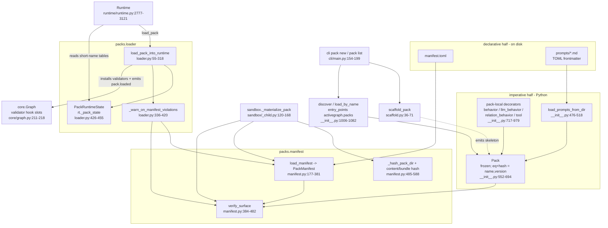

# Packs

## Responsibility

`activegraph/packs/` is the extension format. A **pack** is a frozen, versioned bundle of object
types, relation types, behaviors, tools, prompts, policies, a settings schema, and declared gateway
capabilities for one domain (`activegraph/packs/__init__.py:1-33`, `:552-582`). The subsystem owns
four things: the in-memory `Pack` value object plus pack-local decorators that build its contents
*without* touching the global behavior/tool registries; `manifest.toml`, the static content-hashed
description of a pack on disk, with its validator and canonical hashing; the loader that merges a
`Pack` into a live `Runtime` atomically, namespacing contributed names under `{pack}.{name}`; and a
scaffolder that emits a runnable new-pack skeleton.

The design axis running through all four is **two halves that must agree** — the imperative half (a
`Pack` built by Python decorators) and the declarative half (`manifest.toml`) — cross-checked by
`verify_surface`, so a reviewer approving a manifest is approving what actually loads
(`activegraph/packs/manifest.py:384-400`). The manifest module is marked **PROVISIONAL**: "expect one
round of breaking edits before the API is contract-stable" (`activegraph/packs/manifest.py:9-11`).

## Component map



## Key types & entry points

Value objects and public API (`activegraph/packs/__init__.py`):

- `Pack` — frozen dataclass; equality/hash by `(name, version)` only — `activegraph/packs/__init__.py:552-694`
- `ObjectType(name, schema, description)` — `schema` is a Pydantic `BaseModel` subclass — `activegraph/packs/__init__.py:387-407`
- `RelationType(name, source_types, target_types, description)` — `activegraph/packs/__init__.py:410-429`
- `PackPolicy(name, requires_approval, auto_apply)` — `activegraph/packs/__init__.py:432-448`
- `PackPrompt(name, version, body, content_hash)` with `compute_hash` / `from_body` — `activegraph/packs/__init__.py:451-473`
- `EmptySettings` — zero-field Pydantic default `settings_schema` — `activegraph/packs/__init__.py:376-384`
- `PendingApproval(id, kind, object_type, data, reason, pack)` — `activegraph/packs/__init__.py:1093-1108`
- `DiscoveredPack(name, version, entry_point, pack)` — `activegraph/packs/__init__.py:985-1000`
- `load_prompts_from_dir(path) -> tuple[PackPrompt, ...]` — `activegraph/packs/__init__.py:476-518`
- `discover() -> tuple[DiscoveredPack, ...]` — entry-point group `activegraph.packs`, process-cached — `activegraph/packs/__init__.py:1006-1053`
- `clear_discovery_cache()` — `activegraph/packs/__init__.py:1056-1065`
- `load_by_name(name) -> Pack` — `activegraph/packs/__init__.py:1068-1082`
- Pack-local `@behavior` / `@llm_behavior` / `@relation_behavior` / `@tool` — `activegraph/packs/__init__.py:717-979`
- `__all__`, the declared public surface — `activegraph/packs/__init__.py:1111-1135`

Manifest layer (`activegraph/packs/manifest.py`):

- `PackManifest` — frozen, 20 fields plus `raw` — `activegraph/packs/manifest.py:145-174`
- `CapabilityDecl(provider, capability, risk_class, credential_ref, action_class)` — `activegraph/packs/manifest.py:124-143`
- `load_manifest(path) -> PackManifest` — `activegraph/packs/manifest.py:177-381`
- `verify_surface(manifest, pack) -> None` — `activegraph/packs/manifest.py:384-482`
- `compute_content_hash(pack_root)` — excludes `manifest.toml` — `activegraph/packs/manifest.py:556-570`
- `compute_bundle_hash(pack_root)` — includes `manifest.toml` — `activegraph/packs/manifest.py:573-588`
- `verify_content_hash(manifest, pack_root)` — `activegraph/packs/manifest.py:621-640`
- `verify_bundle_hash(expected, pack_root)` — `activegraph/packs/manifest.py:591-618`
- `_hash_pack_dir(pack_root, include_manifest)` — the §4 canonicalization — `activegraph/packs/manifest.py:485-553`

Loader layer (`activegraph/packs/loader.py`):

- `load_pack_into_runtime(rt, pack, settings) -> bool` — `activegraph/packs/loader.py:55-318`
- `PackRuntimeState` — per-runtime bookkeeping stored at `rt._pack_state` — `activegraph/packs/loader.py:426-455`
- `_ensure_pack_state(rt) -> PackRuntimeState` — `activegraph/packs/loader.py:458-465`
- `AMBIGUOUS = "<<AMBIGUOUS>>"` sentinel and `_add_short_name` — `activegraph/packs/loader.py:468`, `:471-479`
- `_warn_on_manifest_violations(pack)` / `_locate_pack_manifest(pack)` — `activegraph/packs/loader.py:336-420`
- `_install_graph_validators(graph, state)` — `activegraph/packs/loader.py:835-843`
- `_build_pack_loaded_payload(pack, settings_obj)` — `activegraph/packs/loader.py:890-922`

Scaffold layer (`activegraph/packs/scaffold.py`):

- `normalize_pack_name(raw) -> (dir_name, module_name)` — `activegraph/packs/scaffold.py:20-33`
- `scaffold_pack(target_dir, raw_name) -> Path` — `activegraph/packs/scaffold.py:36-71`

Errors:

- `PackError` — re-exported root, defined in `activegraph/errors.py` — `activegraph/packs/__init__.py:84-88`
- `PackNotFoundError(RegistrationError, LookupError)` — `activegraph/packs/__init__.py:91-146`
- `PackValidationError(RegistrationError, PackError)` — `activegraph/packs/__init__.py:149-158`
- `PackConflictError(RegistrationError, PackError)` — `activegraph/packs/__init__.py:161-168`
- `PackVersionConflictError(RegistrationError, PackError)` — `activegraph/packs/__init__.py:171-178`
- `PackSchemaViolation(PackError, ValueError)` plus three factories — `activegraph/packs/__init__.py:181-344`
- `PackSettingsMissingError(RegistrationError, PackError)` — `activegraph/packs/__init__.py:347-357`
- `PackPromptLoadError(RegistrationError, PackError)` — `activegraph/packs/__init__.py:360-370`
- `PackManifestError(PackError, ValueError)` carrying `violations: list[str]` — `activegraph/packs/manifest.py:80-121`

## Interfaces & contracts at each seam

### packs <-> author code (building a `Pack`)

Pack authors import decorators from `activegraph.packs`, not from `activegraph` — the decorators are
deliberately *not* re-exported at top level so the import path makes the no-global-registration
boundary explicit (`activegraph/__init__.py:121-124`). Every decorator compiles its subscription
pattern at decoration time via `runtime.patterns.parse(...).compile()` and resolves
`activate_after` through `runtime.scheduler.parse_activate_after`
(`activegraph/packs/__init__.py:731-732`, `:803-804`, `:876-877`), and validates the handler
signature through `activegraph/_signature.py` (`activegraph/packs/__init__.py:743`, `:815`, `:888`,
`:944-947`). Everything a `Pack` can reject is rejected at `Pack(...)` construction time, not at
load time.

```ebnf
pack-decl       ::= "Pack" "(" "name=" pack-name "," "version=" string
                    [ "," "description="     string             ]
                    [ "," "object_types="    ObjectType-seq     ]
                    [ "," "relation_types="  RelationType-seq   ]
                    [ "," "behaviors="       behavior-seq       ]
                    [ "," "tools="           tool-seq           ]
                    [ "," "policies="        PackPolicy-seq     ]
                    [ "," "prompts="         PackPrompt-seq     ]
                    [ "," "settings_schema=" BaseModel-subclass ]
                    [ "," "capabilities="    CapabilityDecl-seq ]
                    ")" "!" PackValidationError ;

behavior-decl   ::= "@behavior"          "(" behavior-args ")" plain-handler
                  | "@llm_behavior"      "(" llm-args      ")" llm-handler
                  | "@relation_behavior" "(" rel-args      ")" rel-handler ;

plain-handler   ::= "(" "event" "," "graph" "," "ctx" { "," typed-extra } ")" "->" None ;
llm-handler     ::= "(" "event" "," "graph" "," "ctx" "," "llm_output"
                        { "," typed-extra } ")" "->" None ;
rel-handler     ::= "(" "relation" "," "event" "," "graph" "," "ctx"
                        { "," typed-extra } ")" "->" None ;
tool-handler    ::= "(" "args" "," "ctx" ")" "->" any ;   (* NO typed extras allowed *)
typed-extra     ::= identifier ":" settings-class ;       (* injected by the loader *)

pack-identity   ::= (name, version) ;   (* Pack.__eq__ / __hash__ use ONLY this *)
invariant       ::= every behavior/tool carries _pack_local == True ;
```

Contract notes — all violations raise `PackValidationError`:

1. `Pack.name` and manifest `pack.name` share one validator and must match
   `^[a-z][a-z0-9_]{0,63}$` (1–64 characters). The original spelling is the
   identity spelling; it is never normalized.
2. `Pack.version` must be a non-empty `str` — **no PEP 440 check here**
   (`activegraph/packs/__init__.py:596-597`). PEP 440 is enforced only manifest-side
   (`activegraph/packs/manifest.py:64-67`, `:229-231`).
3. `settings_schema` must be a Pydantic `BaseModel` subclass (`activegraph/packs/__init__.py:600-603`).
4. Within-pack name uniqueness across object types, relation types, behaviors, tools, policies, and
   prompts (`activegraph/packs/__init__.py:606-611`, `_check_unique` at `:697-704`).
5. Every behavior must be a `Behavior`/`RelationBehavior` **and** carry `_pack_local is True` — this
   is how using `activegraph.behavior` instead of `activegraph.packs.behavior` is caught
   (`activegraph/packs/__init__.py:614-626`); the same rule applies to tools (`:627-636`).
6. `capabilities` entries must be `CapabilityDecl` with `risk_class ∈ {low, medium, high, critical}`,
   `action_class ∈ {R0..R4}` or empty, and `(provider, capability)` unique within the pack
   (`activegraph/packs/__init__.py:645-676`). `action_class` is **never** derived from `risk_class`
   (ADR 0016, `activegraph/packs/manifest.py:73-75`).
7. Equality and `hash` are `(name, version)` only — deliberately not deep structural comparison,
   because that identity is exactly what idempotent loading hinges on
   (`activegraph/packs/__init__.py:552-561`, `:679-685`).

Prompt loading (`load_prompts_from_dir`) reads `*.md` files with `---`-delimited **TOML**
frontmatter; `version` is required and `name` defaults to the filename stem
(`activegraph/packs/__init__.py:479-495`, `:521-543`). Hidden files and symlinks are skipped so the
loader reads exactly the byte set the manifest content hash pins
(`activegraph/packs/__init__.py:509-511`). `content_hash` is
`"sha256:" + sha256(body).hexdigest()[:16]` — **16 hex chars, truncated** — and it, not the declared
`version`, is the replay contract (`activegraph/packs/__init__.py:466-469`, `:455-459`). Missing dir,
non-dir path, missing or malformed frontmatter, missing `version`, duplicate prompt name, and IO
failure all raise `PackPromptLoadError` (`activegraph/packs/__init__.py:497-517`, `:526-540`).

### packs <-> on-disk bundle (`manifest.toml`)

`manifest.toml` is the declarative half a human or CI reviewer signs off on. `load_manifest` is
**collect-all-then-raise**: every violation is gathered and raised in a single `PackManifestError`
carrying `violations: list[str]` (`activegraph/packs/manifest.py:80-121`, `:356-357`). Grammar
derived from `activegraph/packs/manifest.py:177-381` and grounded in the concrete example at
`tests/test_pack_manifest.py:31-71`.

```ebnf
manifest        ::= pack-table provenance-table integrity-table
                    dependencies-table surface-table fixtures-table ;
                    (* all six REQUIRED; missing -> violation, manifest.py:204-222 *)

pack-table      ::= "[pack]"
                    "name"        "=" pack-name        (* ^[a-z][a-z0-9_]{0,63}$ *)
                    "version"     "=" pep440-version
                    "description" "=" nonempty-string
                    [ "license"   "=" string ] ;       (* parsed, never validated *)

provenance-table::= "[pack.provenance]"
                    "authored_by" "=" ( "human" | "agent" )
                    { any-key "=" any-value } ;        (* authors / generator / source_url /
                                                          created_at pass through to .raw *)

integrity-table ::= "[pack.integrity]"
                    "content_hash" "=" sha256-hex64
                    [ "signature"  "=" "" ] ;          (* RESERVED: nonempty -> REJECT *)

sha256-hex64    ::= "sha256:" 64 * hex-lower ;

dependencies-table
                ::= "[dependencies]"
                    "activegraph"   "=" pep440-specifier-set     (* REQUIRED *)
                    [ "python"      "=" pep440-specifier-set ]
                    [ "python-deps" "=" string-list ]
                    [ "[dependencies.packs]"          { name "=" pep440-specifier-set } ]
                    [ "[dependencies.optional-packs]" { name "=" pep440-specifier-set } ] ;

surface-table   ::= "[surface]"
                    [ "object_types"    "=" string-list ]
                    [ "relation_types"  "=" string-list ]
                    [ "behaviors"       "=" string-list ]  (* SHORT names, unprefixed *)
                    [ "tools"           "=" string-list ]
                    [ "settings_schema" "=" class-name ]   (* "" == EmptySettings *)
                    [ "consumes"        "=" string-list ]  (* declared, NOT verified *)
                    { capability-entry } ;

capability-entry::= "[[surface.capabilities]]"
                    "provider"         "=" string
                    "capability"       "=" string
                    "risk_class"       "=" ( "low" | "medium" | "high" | "critical" )
                    [ "credential_ref" "=" string ]
                    [ "action_class"   "=" ( "R0"|"R1"|"R2"|"R3"|"R4" ) ] ;
                    (* risk_class and action_class are INDEPENDENT vocabularies;
                       neither is ever inferred from the other — ADR 0016 *)

fixtures-table  ::= "[fixtures]"
                    "entrypoint"    "=" nonempty-string
                    "deterministic" "=" boolean ;
```

```ebnf
manifest-api    ::= load-manifest | verify-surface | hash-op ;

load-manifest   ::= "load_manifest" "(" (manifest-path | pack-root) ")" "->" PackManifest
                    "!" PackManifestError{ violations: [string, ...] } ;

verify-surface  ::= "verify_surface" "(" PackManifest "," Pack ")" "->" None
                    "!" PackManifestError ;
                    (* two-way: declared ⊆ actual AND actual ⊆ declared *)

hash-op         ::= ( "compute_content_hash" | "compute_bundle_hash" ) "(" pack-root ")"
                      "->" sha256-hex64
                  | "verify_content_hash" "(" PackManifest "," pack-root ")" "->" None
                  | "verify_bundle_hash"  "(" external-pin "," pack-root ")" "->" None ;

canonical-stream::= { file-entry } ;                (* sorted by utf8(relpath) *)
file-entry      ::= utf8(relpath) 0x00 u64be(len(bytes)) bytes ;
excluded        ::= "__pycache__/**" | "*.pyc" | ".*"
                  | "manifest.toml" ;               (* content hash ONLY *)
rejected        ::= symlink(file|dir) | non-NFC-path | non-UTF8-path ;
```

Contract notes:

- `pack.integrity.signature` is **reserved**: a non-empty value is *rejected*, never ignored, so the
  seam cannot be used for a downgrade (`activegraph/packs/manifest.py:252-260`).
- `dependencies.activegraph` is required and must be a PEP 440 specifier set
  (`activegraph/packs/manifest.py:262-267`). Ranges are checked **syntactically only** — semantic
  resolution against a running runtime is explicitly out of scope
  (`activegraph/packs/manifest.py:183-185`).
- `fixtures.entrypoint` must be non-empty and `fixtures.deterministic` must be a bool
  (`activegraph/packs/manifest.py:348-354`).
- Two hashes exist deliberately. `compute_content_hash` **excludes** `manifest.toml` (a hash cannot
  cover itself) and is an **internal-consistency** check only, never authenticity, since the manifest
  travels with the pack (`activegraph/packs/manifest.py:556-570`, `:621-640`).
  `compute_bundle_hash` **includes** it and is what external pins verify — because the manifest is
  the very document a reviewer approves (`activegraph/packs/manifest.py:573-588`, `:591-618`).
- `_hash_pack_dir` rejects symlinks (file **and** directory) loudly, rejects paths that are not
  UTF-8-encodable or not NFC-normalized, sorts entries by UTF-8 path bytes, and frames each file as
  `path_bytes ‖ 0x00 ‖ u64be(len) ‖ raw_bytes` (`activegraph/packs/manifest.py:485-553`).
- `verify_surface` is a two-way identity mapping over `object_types`, `relation_types`, `behaviors`,
  `tools`, `settings_schema`, and `capabilities` (`activegraph/packs/manifest.py:403-478`). `name`
  and `version` must match exactly (`:409-417`); `settings_schema` is compared as the **class name
  string**, with `""` meaning `EmptySettings` (`:430-441`); capabilities are keyed by
  `(provider, capability)` with mandatory agreement on **both** `risk_class` and `action_class` — a
  relabeled risk class is precisely the swap the decision surface must catch (`:442-478`). Only
  `consumes` is out of scope: it is imperative gateway wiring the loader cannot observe (`:397-399`).

### packs <-> runtime

This is the primary seam. `Runtime` holds three pack-owned attributes initialized empty at
construction — `_pack_state: Optional[PackRuntimeState]`, `_pack_behaviors`, `_pack_tools`
(`activegraph/runtime/runtime.py:517-523`) — imports `PackRuntimeState` under `TYPE_CHECKING` only
(`activegraph/runtime/runtime.py:137`), and makes every other pack import function-local and lazy.
The reverse direction is equally narrow: `packs` imports only two pure parser functions from
`runtime.patterns` / `runtime.scheduler` at decoration time, and `Runtime` itself under
`TYPE_CHECKING` (`activegraph/packs/loader.py:51-52`). The edge is bidirectional but lazy in both
directions.

| Runtime member | Calls into packs | file:line |
|---|---|---|
| `Runtime.load_pack(pack, settings=None) -> bool` | `loader.load_pack_into_runtime` | `activegraph/runtime/runtime.py:2777-2788` |
| `Runtime.loaded_packs() -> list[Pack]` | reads `_pack_state.loaded_packs` | `activegraph/runtime/runtime.py:2790-2794` |
| `Runtime.disable_pack(name) -> bool` | `PackNotFoundError`, `loader.AMBIGUOUS` | `activegraph/runtime/runtime.py:2796-2925` |
| `Runtime.get_behavior(name)` | `loader.AMBIGUOUS`, `behavior_short_to_canonical` | `activegraph/runtime/runtime.py:2927-2967` |
| `Runtime.get_tool(name) -> Tool` | `loader.AMBIGUOUS`, `tool_short_to_canonical` | `activegraph/runtime/runtime.py:2969-3009` |
| `Runtime._pack_settings_for_behavior(b)` | `_pack_state.pack_settings[b._pack_owner]` | `activegraph/runtime/runtime.py:3011-3020` |
| `Runtime.pending_approvals()` | `_pack_state.pending_approvals` | `activegraph/runtime/runtime.py:3024-3037` |
| `Runtime._add_pending_approval(...) -> str` | `PendingApproval`, `loader._ensure_pack_state` | `activegraph/runtime/runtime.py:3039-3087` |
| `Runtime.approve(approval_id, approved_by)` | pops `pending_approvals`; emits `approval.granted` then adds the object | `activegraph/runtime/runtime.py:3089-3121` |
| `Ctx.pack_settings(pack_name)` | `_runtime._pack_state.pack_settings` | `activegraph/runtime/runtime.py:184-190` |
| `Ctx.propose_object(object_type, data, *, reason)` | `_runtime._add_pending_approval` | `activegraph/runtime/runtime.py:192-214` |
| approval-queue rebuild on `Runtime.load` / `fork` | `PendingApproval`, `loader._ensure_pack_state` | `activegraph/runtime/runtime.py:4578-4593` |
| `Runtime._ensure_registry()` | merges `_pack_behaviors` into `Registry`, `_pack_tools` into `tool_registry`, re-registers short name when `_export_globally` | `activegraph/runtime/runtime.py:955-1019` |

```ebnf
load-call       ::= "load_pack_into_runtime" "(" Runtime "," Pack [ "," settings ] ")"
                    "->" boolean ;             (* True = newly loaded, False = idempotent *)
settings        ::= BaseModel-instance | dict | None ;

load-phases     ::= idempotency-check version-check settings-build
                    conflict-scan mutation event-emit manifest-warn ;
                    (* every phase before `mutation` is side-effect free *)

conflict-scan   ::= { canonical-behavior-check } { canonical-tool-check }
                    { object-type-check } { relation-type-check }
                    { canonical-policy-check } { global-export-check } ;

canonical-name  ::= pack-name "." short-name ;  (* behaviors, tools, policies *)
flat-name       ::= short-name ;                (* object types, relation types — NOT prefixed *)

mutation        ::= register(loaded_packs, pack_settings)
                    { register-behavior } { register-tool }
                    { register-object-type } { register-relation-type }
                    { register-policy }
                    "rt.registry = None"        (* force registry rebuild *)
                    [ install-graph-validators ] ;

register-behavior
                ::= wrap(fn, settings) rename(canonical)
                    stamp(_pack_local, _pack_owner, _short_name)
                    push(rt._pack_behaviors)
                    own(state.behavior_owners[canonical] = pack)
                    short(state.behavior_short_to_canonical) ;

short(table)    ::= if absent    -> table[short] = canonical
                  | if different -> table[short] = "<<AMBIGUOUS>>" ;

load-failure    ::= PackVersionConflictError   (* same name, different version *)
                  | PackConflictError          (* canonical / flat / global-export collision *)
                  | PackSettingsMissingError ; (* schema needs values, none given *)

disable-call    ::= "disable_pack" "(" pack-name ")" "->" boolean "!" PackNotFoundError ;
disable-effect  ::= deregister(behaviors, tools, object_types, relation_types,
                               policies, settings)
                    rebuild(short-name-tables)  (* removal can RESOLVE ambiguity *)
                    rebuild(registry)
                    emit("pack.disabled") ;
disable-nonEffect
                ::= graph-state-unchanged ∧ memory-not-reclaimed
                    ∧ pending-approvals-retained ;
```

Contract notes:

- **Load atomicity (CONTRACT v0.9 #6)**: a failed `load_pack` leaves the runtime unchanged
  (`activegraph/packs/loader.py:19-22`). All validation precedes the first mutation — idempotency and
  version check (`:63-99`), settings build (`:101-103`), then every conflict check (`:105-238`). The
  first mutation is `state.loaded_packs[pack.name] = pack` at `activegraph/packs/loader.py:244`.
  See Open question 4 for a hole in this guarantee.
- **Namespacing asymmetry**: behaviors, tools, and policies register under `f"{pack.name}.{short}"`
  (`activegraph/packs/loader.py:113-115`, `:251-271`, `:283`), and canonical collisions across packs
  raise `PackConflictError` (`:117-183`, `:198-204`). **Object types and relation types are NOT
  prefixed** — they occupy a flat global namespace keyed by bare name, and a cross-pack collision
  raises `PackConflictError` (`activegraph/packs/loader.py:184-197`, `:274-280`). This is the single
  most surprising rule in the subsystem.
- **Ambiguity, not silent choice**: the same *short* name across two packs is structurally allowed;
  the short-name table is poisoned with the `AMBIGUOUS` sentinel so an unqualified lookup raises
  rather than picking one (`activegraph/packs/loader.py:206-215`, `_add_short_name` at `:471-479`,
  consumed at `activegraph/runtime/runtime.py:2960-2966` -> `AmbiguousBehaviorError` and `:3003-3008`
  -> `AmbiguousToolError`). `disable_pack` rebuilds the tables from surviving canonicals because
  removal can *resolve* an ambiguity, not only delete an entry
  (`activegraph/runtime/runtime.py:2878-2892`).
- **Global export**: `export_globally=True` tools additionally claim the bare short name; a collision
  with the global `@tool` registry or another pack's global export raises `PackConflictError`
  (`activegraph/packs/loader.py:218-238`; registration at `activegraph/runtime/runtime.py:1013-1018`).
- **Settings**: with no `settings=`, `pack.settings_schema()` is constructed and a schema with
  required fields raises `PackSettingsMissingError` (`activegraph/packs/loader.py:496-505`); a `dict`
  is coerced through the schema and anything else that is not an instance of the schema raises the
  same error (`:506-518`). Fork-local `pack.settings_overridden` events are replayed and recursively
  merged at load time, because that is where the schema is known; an unknown override key raises
  `PackSettingsMissingError` naming the recording event id (`activegraph/packs/loader.py:522-602`).
  Settings reach behaviors three ways (`activegraph/packs/diligence/settings.py:15-22`): typed
  parameter injection (the loader inspects the handler signature with `typing.get_type_hints` and
  binds any extra parameter annotated with the settings class, with a string-annotation fallback —
  `activegraph/packs/loader.py:757-829`), `ctx.settings`, and `ctx.pack_settings(name)`
  (`activegraph/runtime/runtime.py:184-190`).
- **Originals are never mutated**: the loader constructs fresh `Behavior`/`LLMBehavior`/
  `RelationBehavior` and `Tool` objects with the canonical name
  (`activegraph/packs/loader.py:608-686`, `:739-754`), stamping `_pack_local`, `_pack_owner`,
  `_short_name` (and `_export_globally` on tools). `_pack_owner` is what `disable_pack` filters on
  (`activegraph/runtime/runtime.py:2894-2903`).
- **Prompts are not `prompt_template`**: markdown bodies routinely contain literal `{...}` that would
  crash `str.format`, so the same-named prompt body is appended to the behavior's `description`,
  landing under "Role:" in the system prompt (`activegraph/packs/loader.py:689-717`).
- **Manifest warning tier (CONTRACT v1.6 #1)**: when a `manifest.toml` is discoverable, `load_pack`
  runs `load_manifest` + `verify_surface` and logs violations via
  `logging.getLogger("activegraph.packs.manifest")` at WARNING with structured `extra`
  (`reason="pack.manifest_invalid"`) — once per `(name, version, path)` per process, and **never
  raises before 2.0** (`activegraph/packs/loader.py:321-334`, `:372-420`). A pack with no manifest
  loads exactly as before, silently (`:377-378`). The tier is wrapped in a bare `except Exception`
  that downgrades to DEBUG (`:412-420`). Hash verification is explicitly *not* on this hot path — it
  stays host/CI/sandbox territory (`activegraph/packs/loader.py:326-327`).

### packs <-> core

`core.Graph` does **not** import packs. It declares two nullable hook slots that the loader fills
(`activegraph/core/graph.py:213-218`), so this is a callback seam — the `core -> packs` edge does not
exist in the import graph. Both slots are `None` when no typed pack contributes, preserving pre-v0.9
untyped semantics (`activegraph/core/graph.py:211-215`). The loader also constructs the `pack.loaded`
`Event` using `core.event.Event` (`activegraph/packs/loader.py:38`).

```ebnf
validator-install
                ::= "graph._pack_object_validator"   ":=" object-validator
                  | "graph._pack_relation_validator" ":=" relation-validator ;
                    (* installed at load_pack; idempotent — replaces prior *)

object-validator::= "(" object-type "," data ")" "->" validated-data
                    "!" PackSchemaViolation.for_object ;
                    (* unknown type -> passthrough, preserving untyped semantics *)

relation-validator
                ::= "(" relation-type "," source-type "," target-type ")" "->" None
                    "!" PackSchemaViolation.for_relation_source
                      | PackSchemaViolation.for_relation_target ;

call-sites      ::= Graph.add_object   -> object-validator   (* core/graph.py:640-643 *)
                  | Graph.add_relation -> relation-validator (* core/graph.py:690-696 *)
                  | Runtime.promote    -> both, pre-mutation (* runtime/runtime.py:3735-3754 *) ;

pack-loaded     ::= Event{ type = "pack.loaded", actor = "runtime", caused_by = null,
                           payload = loaded-payload } ;
loaded-payload  ::= "{" "name" ":" pack-name "," "version" ":" string ","
                        "description"    ":" string ","
                        "object_types"   ":" [ flat-name, ... ] ","
                        "relation_types" ":" [ flat-name, ... ] ","
                        "behaviors"      ":" [ canonical-name, ... ] ","
                        "tools"          ":" [ canonical-name, ... ] ","
                        "policies"       ":" [ canonical-name, ... ] ","
                        "prompts"        ":" { prompt-name ":" { "version", "hash" } } ","
                        "settings"       ":" json-canonical ","
                        "capabilities"   ":" [ capability-payload, ... ] "}" ;
capability-payload
                ::= "{" "provider", "capability", "risk_class", "credential_ref"
                    [ "," "action_class" ] "}" ;  (* omitted when undeclared *)

pack-disabled   ::= Event{ type = "pack.disabled", payload =
                    { name, version, behaviors, tools, object_types, relation_types } } ;

settings-override
                ::= Event{ type = "pack.settings_overridden",
                           payload = { "pack": pack-name, "overrides": nested-dict } } ;

approval-flow   ::= "ctx.propose_object" "(" object-type "," data [ "," reason ] ")"
                      "->" approval-id
                    Event{ type = "approval.proposed",
                           payload = { approval_id, object_type, data, reason, pack } }
                    "runtime.approve" "(" approval-id [ "," approved_by ] ")" "->" object-id
                    Event{ type = "approval.granted" } Event{ type = "object.created" } ;
approval-id     ::= "approval_" 3 * digit ;
```

Contract notes:

- The object validator is called inside `add_object` **after** reserved-field rejection and **before**
  provenance (`activegraph/core/graph.py:640-643`); the relation validator inside `add_relation`
  (`:690-696`). `Runtime.promote` calls both pre-mutation
  (`activegraph/runtime/runtime.py:3735-3754`).
- `pack.loaded` is emitted with `actor="runtime"`, `caused_by=None`
  (`activegraph/packs/loader.py:302-314`); payload built at `:890-922`. `prompts` is
  `Pack.prompt_manifest()`, a `{name: {version, hash}}` map
  (`activegraph/packs/__init__.py:687-694`). `settings` is JSON-canonical with sorted keys and
  `default=str`, so it is byte-stable across runs (`activegraph/packs/loader.py:925-930`).
- **Legacy-invariance rule**: `action_class` joins a capability entry *only when declared*, so a pack
  without it produces a byte-identical `pack.loaded` event to pre-v1.9 runtimes
  (`activegraph/packs/loader.py:905-921`).
- `pack.disabled` is the symmetric event (`activegraph/runtime/runtime.py:2907-2924`).

### packs <-> sandbox

`sandbox/_child.py:_materialize_pack(job)` is the only place the *hash* half of the manifest API is
exercised in-tree (`activegraph/sandbox/_child.py:120-168`). The ordering is load-bearing
(`activegraph/sandbox/_child.py:127-131`): bundle hash **before any import**, then manifest schema,
then import, then the two-way surface check. Job-spec fields come from `sandbox.PackSource`
(`activegraph/sandbox/__init__.py:103-115`), are serialized at
`activegraph/sandbox/__init__.py:432-441`, and validated on parse at
`activegraph/sandbox/executor.py:315-339`. `extra_packs` entries use the identical chain
(`activegraph/sandbox/_child.py:229`).

```ebnf
pack-source     ::= "{" "pack_root" ":" abs-path ","
                        "expected_bundle_hash" ":" ( sha256-hex64 | "" ) ","
                        "manifest_required" ":" boolean "}" ;

materialize     ::= [ verify_bundle_hash(expected, root) ]  (* BEFORE any import *)
                    [ manifest := load_manifest(root) ]
                    import(root / "__init__.py")
                    pack := unique-module-level-Pack [ named manifest.name ]
                    [ verify_surface(manifest, pack) ]
                    "->" Pack ;
ordering-invariant
                ::= hash-before-import ;   (* an unverified pack is never exec'd *)
failure         ::= PackManifestError
                  | RuntimeError("must expose exactly one ... Pack") ;
```

Contract notes: the pack module must expose **exactly one** module-level `Pack`, name-matched against
the manifest when one is present (`activegraph/sandbox/_child.py:156-165`). The
`hash-before-import` ordering is the whole point of this seam — code is never executed before its
bundle hash matches the reviewer-approved pin.

### packs <-> cli

The CLI exposes the authoring and inventory surface. `activegraph pack new <name>` calls
`scaffold_pack(Path(output_dir), name)`, mapping `FileExistsError` -> `EXIT_GENERIC_ERROR` and
`ValueError` -> `EXIT_USAGE_ERROR` (`activegraph/cli/main.py:154-183`). `activegraph pack list` calls
`discover()` and prints `name / version / entry_point` (`activegraph/cli/main.py:186-199`).
`activegraph inspect --pack-version` prints every `pack.loaded` event in a run — it reads the event
and does not import packs (`activegraph/cli/main.py:228-236`). `cli/quickstart.py` imports the
bundled example pack directly (`activegraph/cli/quickstart.py:71`, `:378`, and its fixtures at `:75`,
`:382`).

```ebnf
scaffold-call   ::= "scaffold_pack" "(" target-dir "," raw-name ")" "->" created-path
                    "!" FileExistsError | ValueError ;
raw-name        ::= /^[a-z][a-z0-9-]{0,63}$/ ; (* kebab allowed here only *)
module-name     ::= raw-name with "-" -> "_" ;

emitted-layout  ::= <pack-name>/
                      "pyproject.toml"    (* declares [project.entry-points."activegraph.packs"] *)
                      "README.md"
                      <module-name>/
                        "__init__.py"     (* module-level `pack = Pack(...)` *)
                        "object_types.py" "behaviors.py" "tools.py" "settings.py"
                        "prompts/example_prompt.md"
                      "tests/test_pack_loads.py" ;
                    (* NOTE: no manifest.toml is emitted *)

entry-point-decl::= "[project.entry-points.\"activegraph.packs\"]"
                    pack-name "=" "\"" module-name ":pack\"" ;

discover-call   ::= "discover" "(" ")" "->" [ DiscoveredPack, ... ] ;   (* process-cached *)
load-by-name    ::= "load_by_name" "(" pack-name ")" "->" Pack
                    "!" PackNotFoundError ;   (* lists what IS installed *)
```

Contract notes: `discover()` reads entry-point group `activegraph.packs`, one `Pack` per entry point
(`activegraph/packs/__init__.py:1006-1053`). A broken third-party pack **soft-fails** with a
`warnings.warn` rather than poisoning the framework (`:1027-1035`); a non-`Pack` object is skipped
with a warning (`:1036-1043`). Results are memoized process-wide in `_DISCOVERY_CACHE` (`:1003`,
`:1011-1013`), reset by `clear_discovery_cache()` for tests (`:1056-1065`).
`activegraph/packs/scaffold.py` imports **nothing** from activegraph — every `activegraph` import in
that file lives inside a template string (`activegraph/packs/scaffold.py:111-112`, `:138-143`, `:186`,
`:211`, `:234`, `:293`).

### packs <-> top-level `activegraph`

`activegraph/__init__.py:125-145` re-exports the *using* surface: `Pack`, `ObjectType`,
`RelationType`, `PackPolicy`, `PackPrompt`, `EmptySettings`, `DiscoveredPack`, `PendingApproval`, all
seven error classes, `discover`, `load_by_name`, `clear_discovery_cache`, and
`load_prompts_from_dir`. The pack-aware decorators are **deliberately not re-exported** — authors
must write `from activegraph.packs import behavior` so the import path makes the
no-global-registration boundary explicit (`activegraph/__init__.py:121-124`).

### packs <-> behaviors / tools

Outbound-only, verified by exhaustive grep of `activegraph/packs/*.py`:

| Target | Symbols | file:line |
|---|---|---|
| `behaviors.base` | `Behavior`, `LLMBehavior`, `RelationBehavior`, `_llm_behavior_fn_placeholder` | `activegraph/packs/__init__.py:59-64`; `activegraph/packs/loader.py:37` |
| `tools.base` | `Tool` | `activegraph/packs/__init__.py:65`; `activegraph/packs/loader.py:49` |
| `tools.decorators` | `get_tool_registry` (lazy, to check global short-name collisions) | `activegraph/packs/loader.py:222` |
| `activegraph.errors` | `PackError`, `RegistrationError`, `MissingOptionalDependency` | `activegraph/packs/__init__.py:52`, `:84-88`; `activegraph/packs/manifest.py:58` |
| `activegraph._signature` | `validate_handler_signature`, `infer_tool_input_schema` | `activegraph/packs/__init__.py:743`, `:815`, `:888`, `:944-947` |
| pydantic | `BaseModel`, `ValidationError` | `activegraph/packs/__init__.py:50`; `activegraph/packs/loader.py:35` |

Contract note: pack decorators construct `Behavior`/`Tool` instances but never register them
anywhere; the `_pack_local` stamp is what proves that. There is **no `activegraph.llm` import in the
pack machinery** — that edge exists only through the bundled example pack's recorded fixtures
(`activegraph/packs/diligence/fixtures/__init__.py:19`, `:204`). Any system-map `packs -> llm` edge
should be labeled example-pack-only.

## Sequence: a pack loads and registers its behaviors

```mermaid
sequenceDiagram
    autonumber
    participant Caller as caller
    participant RT as Runtime
    participant LD as packs.loader
    participant ST as PackRuntimeState
    participant MF as packs.manifest
    participant GR as core.Graph

    Caller->>RT: load_pack(pack, settings)
    RT->>LD: load_pack_into_runtime(rt, pack, settings)

    Note over LD: phase 1-3 — side-effect free
    LD->>ST: _ensure_pack_state(rt)
    LD->>LD: idempotency + version check (loader.py:63-99)
    LD-->>RT: return False if (name, version) already loaded
    LD->>LD: _build_settings(pack, settings) (loader.py:496-602)
    LD->>LD: conflict scan — canonical behaviors/tools/policies,<br/>flat object/relation types, global exports (loader.py:105-238)

    Note over LD,ST: phase 4 — mutation (loader.py:244+)
    LD->>ST: loaded_packs[name] = pack; pack_settings[name] = settings_obj
    LD->>LD: wrap each behavior -> fresh Behavior named "{pack}.{short}"<br/>stamp _pack_local/_pack_owner/_short_name (loader.py:608-686)
    LD->>ST: behavior_owners[canonical] = pack
    LD->>ST: _add_short_name(behavior_short_to_canonical, short, canonical)
    Note right of ST: differing prior mapping -> AMBIGUOUS sentinel
    LD->>LD: same for tools (loader.py:739-754), object/relation types, policies
    LD->>RT: rt.registry = None (force _ensure_registry rebuild)
    LD->>GR: _install_graph_validators(graph, state) (loader.py:835-843)

    Note over LD,GR: phase 5-6 — event then advisory manifest check
    LD->>LD: _build_pack_loaded_payload(pack, settings_obj) (loader.py:890-922)
    LD->>GR: emit(Event "pack.loaded", actor="runtime", caused_by=None)
    LD->>LD: _locate_pack_manifest(pack) (loader.py:336-369)
    LD->>MF: load_manifest(root) then verify_surface(manifest, pack)
    MF-->>LD: PackManifestError{violations} or None
    LD->>LD: log WARNING reason="pack.manifest_invalid", once per (name, version, path)
    LD-->>RT: True
    RT-->>Caller: True
```

## Open questions

1. **`PackPolicy` gating is declared but never enforced.** `requires_approval` populates
   `state.gated_object_types` (`activegraph/packs/loader.py:284-286`), but the only consumers read it
   to *attribute* a proposal to an owning pack (`activegraph/runtime/runtime.py:3052-3053`) and to
   clean up on disable (`:2867-2876`). Nothing in `Graph.add_object` or the loader's object validator
   blocks a gated type. `ctx.propose_object`'s docstring concedes this: behaviors "can just call
   `graph.add_object` if their pack settings say auto-approval is on; this helper is the explicit
   path" (`activegraph/runtime/runtime.py:203-207`). Policy gating is **advisory / opt-in by the
   behavior author**, not runtime-enforced. If the system map presents policies as a control, this
   gap must be explicit.

2. **`PackPolicy.auto_apply` is entirely unused.** Declared and list-to-tuple normalized
   (`activegraph/packs/__init__.py:441`, `:447-448`) and read nowhere in `activegraph/` or `tests/`.
   Reads as reserved surface or a dead field.

3. **Dead code in the loader.** `pre_ambiguous_behaviors` / `pre_ambiguous_tools` are computed at
   `activegraph/packs/loader.py:210-215` and never read; `_compute_new_ambiguous_shorts` (`:482-489`)
   exists solely to feed them. `import copy` at `activegraph/packs/loader.py:27` is unused.

4. **Partial-mutation hole if `rt.graph is None`.** The loader guards validator installation with
   `if rt.graph is not None` (`activegraph/packs/loader.py:299-300`) but then calls `rt.graph.emit(...)`
   unguarded four lines later (`:304`). A runtime without a graph would `AttributeError` *after*
   `state.loaded_packs` and the registries were mutated, violating the stated CONTRACT v0.9 #6
   atomicity. Whether `rt.graph` can actually be `None` at that point is a runtime-side question that
   remains unresolved.

5. **No `manifest.toml` exists anywhere in the repo** — including for the bundled
   `activegraph/packs/diligence/` pack. The manifest warning tier therefore never fires for the
   in-tree pack, and the only manifests are synthesized in tests (`tests/test_pack_manifest.py`,
   `tests/test_manifest_warning_tier.py`, `tests/test_sandbox_trial.py`). The scaffolder does not emit
   one either (`activegraph/packs/scaffold.py:50-68`). The declarative half is real machinery with no
   in-tree production instance — a maturity gap, not proven coverage.

6. **Pack names now share one boundary.** Pack construction and manifest parsing use
   `^[a-z][a-z0-9_]{0,63}$`. The scaffolder separately accepts a normalized 1–64 character kebab
   distribution slug, then validates its derived snake identity with the common validator. Existing
   strip/lowercase scaffold normalization remains compatible; underscores are not distribution slugs.

7. **Two incompatible hash conventions.** `PackPrompt.content_hash` is `sha256:` + **16** hex chars
   (`activegraph/packs/__init__.py:466-469`); the manifest's `content_hash` / `bundle_hash` are
   `sha256:` + **64** hex chars (`activegraph/packs/manifest.py:245-247`). Both surface near
   `pack.loaded`. Not a bug, but they must not be conflated.

8. **`Pack.version` is unvalidated as a version.** Only non-emptiness is checked
   (`activegraph/packs/__init__.py:596-597`), while `verify_surface` demands exact string equality with
   the manifest's PEP 440-validated `version` (`activegraph/packs/manifest.py:413-417`). A pack whose
   Python-side version is `"nightly"` constructs fine and only fails at manifest verification — which
   is a warning, not an error, before 2.0.

9. **The manifest module is explicitly PROVISIONAL**, with "expect one round of breaking edits before
   the API is contract-stable" (`activegraph/packs/manifest.py:9-11`). Every consumer of this spec
   should carry that qualifier.

10. **`_locate_pack_manifest` is best-effort and can silently miss.** It resolves modules from
    `pack.behaviors[*].fn`, `pack.tools[*].fn`, `settings_schema`, and `object_types[*].schema` only
    (`activegraph/packs/loader.py:342-346`); a pack whose components all live in `__main__`, or one
    with no behaviors, tools, or object types, has no discovery anchor and its manifest is never
    checked. The whole tier is also swallowed by a bare `except Exception` (`:412-420`), so a discovery
    bug is invisible at default log levels.

11. **`consumes` is declared in the manifest but verified nowhere in-tree.** It is parsed and stored
    (`activegraph/packs/manifest.py:341-347`, `:377`) and deliberately excluded from `verify_surface`
    as "imperative gateway wiring the loader cannot observe" (`activegraph/packs/manifest.py:397-399`),
    left to static CI / evolution gates that live outside this repo. The same holds for *capability
    registration*: `Pack.capabilities` is purely declarative and the runtime never registers a gateway
    from it (`activegraph/packs/__init__.py:573-581`).

12. **Import-graph correction.** `packs -> llm` is not a machinery dependency; it exists only via the
    bundled example pack's recorded fixtures (`activegraph/packs/diligence/fixtures/__init__.py:19`,
    `:204`). Likewise `activegraph/packs/scaffold.py` has zero activegraph imports — all are inside
    template strings.
