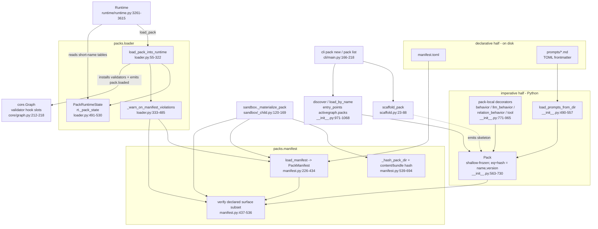

# Packs

## Responsibility

`activegraph/packs/` is the extension format. A **pack** is a shallow-frozen, versioned bundle of object
types, relation types, behaviors, tools, prompts, policies, a settings schema, and declared gateway
capabilities for one domain (`activegraph/packs/__init__.py:1-33`, `:563-730`). The subsystem owns
four things: the in-memory `Pack` value object plus pack-local decorators that build its contents
*without* touching the global behavior/tool registries; `manifest.toml`, the static content-hashed
description of a pack on disk, with its validator and canonical hashing; the loader that merges a
`Pack` into a live `Runtime`, namespacing behaviors, tools, and policies under `{pack}.{name}` while
object and relation type names remain flat; and a scaffolder that emits a runnable new-pack skeleton.

The imperative `Pack` and declarative `manifest.toml` halves meet at a scoped surface check:
`verify_surface` compares name/version and the declared object-type, relation-type, behavior, tool,
settings-schema, and capability surface. Policies, prompts, descriptions, licenses, dependencies,
fixtures, and `consumes` are outside that comparison (`activegraph/packs/manifest.py:437-536`). The
manifest module remains **PROVISIONAL** (`activegraph/packs/manifest.py:9-17`).

## Component map



## Key types & entry points

Value objects and public API (`activegraph/packs/__init__.py`):

- `Pack` — frozen dataclass; equality/hash by `(name, version)` only;
  `capabilities` is verified/audited declaration data, while gateway
  registration and credential resolution remain host-owned —
  `activegraph/packs/__init__.py:563-730`
- `ObjectType(name, schema, description)` — `schema` is a Pydantic `BaseModel` subclass — `activegraph/packs/__init__.py:394-415`
- `RelationType(name, source_types, target_types, description)` — `activegraph/packs/__init__.py:417-437`
- `PackPolicy(name, requires_approval, auto_apply)` — `auto_apply` is reserved
  compatibility metadata: list input is normalized to a tuple, but the loader
  and runtime do not read it. Its values have no defined object-type, setting,
  exemption, or automatic grant semantics — `activegraph/packs/__init__.py:439-462`
- `PackPrompt(name, version, body, content_hash)` with `compute_hash` / `from_body` — `activegraph/packs/__init__.py:465-487`
- `EmptySettings` — zero-field Pydantic default `settings_schema` — `activegraph/packs/__init__.py:383-391`
- `PendingApproval(id, kind, object_type, data, reason, pack)` — `activegraph/packs/__init__.py:1079-1095`
- `DiscoveredPack(name, version, entry_point, pack)` — `activegraph/packs/__init__.py:971-986`
- `load_prompts_from_dir(path) -> tuple[PackPrompt, ...]` — `activegraph/packs/__init__.py:490-557`
- `discover() -> tuple[DiscoveredPack, ...]` — entry-point group `activegraph.packs`, process-cached — `activegraph/packs/__init__.py:989-1040`
- `clear_discovery_cache()` — `activegraph/packs/__init__.py:1043-1052`
- `load_by_name(name) -> Pack` — `activegraph/packs/__init__.py:1055-1068`
- Pack-local `@behavior` / `@llm_behavior` / `@relation_behavior` / `@tool` — `activegraph/packs/__init__.py:771-965`
- `__all__`, the declared public surface — `activegraph/packs/__init__.py:1097-1121`

Manifest layer (`activegraph/packs/manifest.py`):

- `PackManifest` — frozen, 20 fields plus `raw` — `activegraph/packs/manifest.py:193-223`
- `CapabilityDecl(provider, capability, risk_class, credential_ref, action_class)` — `activegraph/packs/manifest.py:170-190`
- `load_manifest(path) -> PackManifest` — `activegraph/packs/manifest.py:226-434`
- `verify_surface(manifest, pack) -> None` — `activegraph/packs/manifest.py:437-536`
- `compute_content_hash(pack_root)` — excludes `manifest.toml` — `activegraph/packs/manifest.py:610-624`
- `compute_bundle_hash(pack_root)` — includes `manifest.toml` — `activegraph/packs/manifest.py:627-642`
- `verify_content_hash(manifest, pack_root)` — `activegraph/packs/manifest.py:675-694`
- `verify_bundle_hash(expected, pack_root)` — `activegraph/packs/manifest.py:645-672`
- `_hash_pack_dir(pack_root, include_manifest)` — the §4 canonicalization — `activegraph/packs/manifest.py:539-607`

Loader layer (`activegraph/packs/loader.py`):

- `load_pack_into_runtime(rt, pack, settings) -> bool` — `activegraph/packs/loader.py:55-322`
- `PackRuntimeState` — per-runtime bookkeeping stored at `rt._pack_state` — `activegraph/packs/loader.py:491-520`
- `_ensure_pack_state(rt) -> PackRuntimeState` — `activegraph/packs/loader.py:523-530`
- `AMBIGUOUS = "<<AMBIGUOUS>>"` sentinel and `_add_short_name` — `activegraph/packs/loader.py:533-544`
- `_warn_on_manifest_violations(pack)` / `_locate_pack_manifest(pack)` — `activegraph/packs/loader.py:333-485`
- `_install_graph_validators(graph, state)` — `activegraph/packs/loader.py:918-967`
- `_build_pack_loaded_payload(pack, settings_obj)` — `activegraph/packs/loader.py:973-1013`

Scaffold layer (`activegraph/packs/scaffold.py`):

- `normalize_pack_name(raw) -> (dir_name, module_name)` — `activegraph/packs/scaffold.py:23-39`
- `scaffold_pack(target_dir, raw_name) -> Path` — `activegraph/packs/scaffold.py:42-88`

Errors:

- `PackError` — re-exported root, defined in `activegraph/errors.py` — `activegraph/errors.py:213-219`
- `PackNotFoundError(RegistrationError, LookupError)` — `activegraph/packs/__init__.py:96-152`
- `PackValidationError(RegistrationError, PackError)` — `activegraph/packs/__init__.py:154-166`
- `PackConflictError(RegistrationError, PackError)` — `activegraph/packs/__init__.py:168-176`
- `PackVersionConflictError(RegistrationError, PackError)` — `activegraph/packs/__init__.py:178-186`
- `PackSchemaViolation(PackError, ValueError)` plus three factories — `activegraph/packs/__init__.py:188-352`
- `PackSettingsMissingError(RegistrationError, PackError)` — `activegraph/packs/__init__.py:354-364`
- `PackPromptLoadError(RegistrationError, PackError)` — `activegraph/packs/__init__.py:367-377`
- `PackManifestError(PackError, ValueError)` carrying `violations: list[str]` — `activegraph/packs/manifest.py:126-167`

## Interfaces & contracts at each seam

### packs <-> author code (building a `Pack`)

Pack authors import decorators from `activegraph.packs`, not from `activegraph` — the decorators are
deliberately *not* re-exported at top level so the import path makes the no-global-registration
boundary explicit (`activegraph/__init__.py:141-166`). Pack-local decorators delegate construction
to the shared side-effect-free `behaviors._factory` and `tools._factory` modules, then stamp
`_pack_local` and author metadata without global registration
(`activegraph/packs/__init__.py:771-965`; `activegraph/behaviors/_factory.py:68-205`;
`activegraph/tools/_factory.py:19-58`). Pack declaration invariants are checked at construction;
mutable LLM tool membership is defensively rechecked before loader state initialization
(`activegraph/packs/__init__.py:607-712,743-762`; `activegraph/packs/loader.py:63-66`).

```ebnf
pack-decl       ::= "Pack" "(" "name=" pack-name "," "version=" string
                    [ "," "description="     string             ]
                    [ "," "object_types="    ObjectType-seq     ]
                    [ "," "relation_types="  RelationType-seq   ]
                    [ "," "behaviors="       behavior-seq       ]
                    [ "," "tools="           tool-seq           ]
                    [ "," "policies="        PackPolicy-seq     ]
                    [ "," "prompts="         PackPrompt-seq     ]
                    [ "," "settings_schema=" BaseModel-subclass ]
                    [ "," "capabilities="    CapabilityDecl-seq ]
                    [ "," "manifest_path="   absolute-Path      ]
                    ")" "!" PackValidationError ;

behavior-decl   ::= "@behavior"          "(" behavior-args ")" plain-handler
                  | "@llm_behavior"      "(" llm-args      ")" llm-handler
                  | "@relation_behavior" "(" rel-args      ")" rel-handler ;

plain-handler   ::= "(" "event" "," "graph" "," "ctx" { "," typed-extra } ")" "->" None ;
llm-handler     ::= "(" "event" "," "graph" "," "ctx" "," "llm_output"
                        { "," typed-extra } ")" "->" None ;
rel-handler     ::= "(" "relation" "," "event" "," "graph" "," "ctx"
                        { "," typed-extra } ")" "->" None ;
tool-handler    ::= "(" "args" "," "ctx" ")" "->" any ;   (* NO typed extras allowed *)
typed-extra     ::= identifier ":" settings-class ;       (* injected by the loader *)

pack-identity   ::= (name, version) ;   (* Pack.__eq__ / __hash__ use ONLY this *)
invariant       ::= every behavior/tool carries _pack_local == True ;
```

Contract notes — all violations raise `PackValidationError`:

1. `Pack.name` and manifest `pack.name` share one validator and must match
   `^[a-z][a-z0-9_]{0,63}$` (1–64 characters). The original spelling is the
   identity spelling; it is never normalized.
2. `Pack.version` and manifest `pack.version` share the complete PEP 440
   validator from `packaging.version.Version`. Surrounding whitespace and
   non-strings fail. Valid spelling is preserved exactly rather than normalized.
3. `settings_schema` must be a Pydantic `BaseModel` subclass (`activegraph/packs/__init__.py:634-638`).
4. Within-pack name uniqueness across object types, relation types, behaviors, tools, policies, and
   prompts (`activegraph/packs/__init__.py:642-648`).
5. Every behavior must be a `Behavior`/`RelationBehavior` **and** carry `_pack_local is True` — this
   is how using `activegraph.behavior` instead of `activegraph.packs.behavior` is caught
   (`activegraph/packs/__init__.py:651-663`); the same rule applies to tools (`:664-674`).
6. `capabilities` entries must be `CapabilityDecl` with `risk_class ∈ {low, medium, high, critical}`,
   `action_class ∈ {R0..R4}` or empty, and `(provider, capability)` unique within the pack
   (`activegraph/packs/__init__.py:681-712`). `action_class` is **never** derived from `risk_class`
   (ADR 0016, `activegraph/packs/manifest.py:119-121`).
7. Equality and `hash` are `(name, version)` only — deliberately not deep structural comparison,
   because that identity is exactly what idempotent loading hinges on
   (`activegraph/packs/__init__.py:714-721`).
8. `manifest_path`, when present, is an absolute `pathlib.Path`. It is the final defaulted field,
   never participates in identity, and names the exact file to check without fallback.

Prompt loading (`load_prompts_from_dir`) reads `*.md` files with `---`-delimited **TOML**
frontmatter; `version` is required and `name` defaults to the filename stem
(`activegraph/packs/__init__.py:490-557`). Hidden files and symlinks are skipped so the
loader reads exactly the byte set the manifest content hash pins
(`activegraph/packs/__init__.py:512-516`). `content_hash` is
`"sha256:" + sha256(body).hexdigest()[:16]` — **16 hex chars, truncated** — and it, not the declared
`version`, is recorded as prompt-body audit identity in `pack.loaded`; no runtime/replay path
compares it (`activegraph/packs/__init__.py:480-487,723-730`; `activegraph/packs/loader.py:973-1005`). Missing dir,
non-dir path, missing or malformed frontmatter, missing `version`, duplicate prompt name, and IO
failure all raise `PackPromptLoadError` (`activegraph/packs/__init__.py:490-557`).

### packs <-> on-disk bundle (`manifest.toml`)

`manifest.toml` is the declarative half a human or CI reviewer signs off on. After successful file
read, UTF-8 decode, and TOML parsing, `load_manifest` collects schema/semantic violations and raises
them together in one `PackManifestError`; read/decode/TOML failures raise immediately with one
violation (`activegraph/packs/manifest.py:226-410`). Grammar derived from
`activegraph/packs/manifest.py:226-434` and grounded in the concrete example at
`tests/test_pack_manifest.py:31-71`.

```ebnf
manifest        ::= pack-table provenance-table integrity-table
                    dependencies-table surface-table fixtures-table ;
                    (* all six REQUIRED; missing -> violation, manifest.py:253-271 *)

pack-table      ::= "[pack]"
                    "name"        "=" pack-name        (* ^[a-z][a-z0-9_]{0,63}$ *)
                    "version"     "=" pep440-version
                    "description" "=" nonempty-string
                    [ "license"   "=" string ] ;       (* parsed, never validated *)

provenance-table::= "[pack.provenance]"
                    "authored_by" "=" ( "human" | "agent" )
                    { any-key "=" any-value } ;        (* authors / generator / source_url /
                                                          created_at pass through to .raw *)

integrity-table ::= "[pack.integrity]"
                    "content_hash" "=" sha256-hex64
                    [ "signature"  "=" "" ] ;          (* RESERVED: nonempty -> REJECT *)

sha256-hex64    ::= "sha256:" 64 * hex-lower ;

dependencies-table
                ::= "[dependencies]"
                    "activegraph"   "=" pep440-specifier-set     (* REQUIRED *)
                    [ "python"      "=" pep440-specifier-set ]
                    [ "python-deps" "=" string-list ]
                    [ "[dependencies.packs]"          { name "=" pep440-specifier-set } ]
                    [ "[dependencies.optional-packs]" { name "=" pep440-specifier-set } ] ;

surface-table   ::= "[surface]"
                    [ "object_types"    "=" string-list ]
                    [ "relation_types"  "=" string-list ]
                    [ "behaviors"       "=" string-list ]  (* SHORT names, unprefixed *)
                    [ "tools"           "=" string-list ]
                    [ "settings_schema" "=" class-name ]   (* "" == EmptySettings *)
                    [ "consumes"        "=" string-list ]  (* declared, NOT verified *)
                    { capability-entry } ;

capability-entry::= "[[surface.capabilities]]"
                    "provider"         "=" string
                    "capability"       "=" string
                    "risk_class"       "=" ( "low" | "medium" | "high" | "critical" )
                    [ "credential_ref" "=" string ]
                    [ "action_class"   "=" ( "R0"|"R1"|"R2"|"R3"|"R4" ) ] ;
                    (* risk_class and action_class are INDEPENDENT vocabularies;
                       neither is ever inferred from the other — ADR 0016 *)

fixtures-table  ::= "[fixtures]"
                    "entrypoint"    "=" contained-regular-resource
                    "deterministic" "=" boolean ;
```

```ebnf
manifest-api    ::= load-manifest | verify-surface | hash-op ;

load-manifest   ::= "load_manifest" "(" (manifest-path | pack-root) ")" "->" PackManifest
                    "!" PackManifestError{ violations: [string, ...] } ;

verify-surface  ::= "verify_surface" "(" PackManifest "," Pack ")" "->" None
                    "!" PackManifestError ;
                    (* two-way only for the declared surface subset *)

hash-op         ::= ( "compute_content_hash" | "compute_bundle_hash" ) "(" pack-root ")"
                      "->" sha256-hex64
                  | "verify_content_hash" "(" PackManifest "," pack-root ")" "->" None
                  | "verify_bundle_hash"  "(" external-pin "," pack-root ")" "->" None ;

canonical-stream::= { file-entry } ;                (* sorted by utf8(relpath) *)
file-entry      ::= utf8(relpath) 0x00 u64be(len(bytes)) bytes ;
excluded        ::= "__pycache__/**" | "*.pyc" | ".*"
                  | "manifest.toml" ;               (* content hash ONLY *)
rejected        ::= symlink(file|dir) | non-NFC-path | non-UTF8-path ;
```

Contract notes:

- `pack.integrity.signature` is **reserved**: a non-empty value is *rejected*, never ignored, so the
  seam cannot be used for a downgrade (`activegraph/packs/manifest.py:297-313`).
- `dependencies.activegraph` is required and must be a PEP 440 specifier set
  (`activegraph/packs/manifest.py:315-351`). Ranges are checked **syntactically only** — semantic
  resolution against a running runtime is explicitly out of scope
  (`activegraph/packs/manifest.py:226-434`).
- `fixtures.entrypoint` must be a nonempty relative path from the manifest directory, contain no
  `..` or symlink component, resolve inside the pack, and name an existing regular file.
  `fixtures.deterministic` must be a bool. The entrypoint is a resource declaration, not an
  executable sandbox scenario.
- Two hashes exist deliberately. `compute_content_hash` **excludes** `manifest.toml` (a hash cannot
  cover itself) and is an **internal-consistency** check only, never authenticity, since the manifest
  travels with the pack (`activegraph/packs/manifest.py:610-624`, `:675-694`).
  `compute_bundle_hash` **includes** it and is what external pins verify — because the manifest is
  the very document a reviewer approves (`activegraph/packs/manifest.py:627-672`).
- `_hash_pack_dir` rejects symlinks (file **and** directory) loudly, rejects paths that are not
  UTF-8-encodable or not NFC-normalized, sorts entries by UTF-8 path bytes, and frames each file as
  `path_bytes ‖ 0x00 ‖ u64be(len) ‖ raw_bytes` (`activegraph/packs/manifest.py:539-607`).
- `verify_surface` is a two-way identity mapping over `object_types`, `relation_types`, `behaviors`,
  `tools`, `settings_schema`, and `capabilities` (`activegraph/packs/manifest.py:437-536`). `name`
  and `version` must match exactly (`:445-453`); `settings_schema` is compared as the **class name
  string**, with `""` meaning `EmptySettings` (`:463-477`); capabilities are keyed by
  `(provider, capability)` with mandatory agreement on **both** `risk_class` and `action_class` — a
  relabeled risk class is precisely the swap the decision surface must catch (`:478-532`). Policies,
  prompts, descriptions, licenses, dependencies, fixtures, and `consumes` remain outside this
  declared-surface comparison.

### packs <-> runtime

This is the primary seam. `Runtime` holds three pack-owned attributes initialized empty at
construction — `_pack_state: Optional[PackRuntimeState]`, `_pack_behaviors`, `_pack_tools`
(`activegraph/runtime/runtime.py:603-612`) — imports `PackRuntimeState` under `TYPE_CHECKING` only
(`activegraph/runtime/runtime.py:156-158`), and makes its runtime pack imports function-local. In
the reverse direction, the pack module imports shared `behaviors._factory` and `tools._factory`
modules at import time; those factories own signature/pattern/scheduler construction. The runtime
direction remains lazy except for type checking.

| Runtime member | Calls into packs | file:line |
|---|---|---|
| `Runtime.load_pack(pack, settings=None) -> bool` | `loader.load_pack_into_runtime` | `activegraph/runtime/runtime.py:3261-3273` |
| `Runtime.loaded_packs() -> list[Pack]` | reads `_pack_state.loaded_packs` | `activegraph/runtime/runtime.py:3275-3279` |
| `Runtime.disable_pack(name) -> bool` | `PackNotFoundError`, `loader.AMBIGUOUS` | `activegraph/runtime/runtime.py:3281-3420` |
| `Runtime.get_behavior(name)` | `loader.AMBIGUOUS`, `behavior_short_to_canonical` | `activegraph/runtime/runtime.py:3422-3462` |
| `Runtime.get_tool(name) -> Tool` | `loader.AMBIGUOUS`, `tool_short_to_canonical` | `activegraph/runtime/runtime.py:3464-3504` |
| `Runtime._pack_settings_for_behavior(b)` | `_pack_state.pack_settings[b._pack_owner]` | `activegraph/runtime/runtime.py:3506-3515` |
| `Runtime.pending_approvals()` | `_pack_state.pending_approvals` | `activegraph/runtime/runtime.py:3519-3532` |
| `Runtime._add_pending_approval(...) -> str` | `PendingApproval`, `loader._ensure_pack_state` | `activegraph/runtime/runtime.py:3534-3582` |
| `Runtime.approve(approval_id, approved_by)` | pops `pending_approvals`; emits `approval.granted` then adds the object | `activegraph/runtime/runtime.py:3584-3615` |
| `Ctx.pack_settings(pack_name)` | `_runtime._pack_state.pack_settings` | `activegraph/runtime/runtime.py:207-213` |
| `Ctx.propose_object(object_type, data, *, reason)` | `_runtime._add_pending_approval` | `activegraph/runtime/runtime.py:215-251` |
| approval-queue rebuild on `Runtime.load` / `fork` | `PendingApproval`, `loader._ensure_pack_state` | calls `activegraph/runtime/runtime.py:3872,4096`; implementation `:5094-5135` |
| `Runtime._ensure_registry()` | merges `_pack_behaviors` into `Registry`, `_pack_tools` into `tool_registry`, re-registers short name when `_export_globally` | `activegraph/runtime/runtime.py:1243-1328` |

```ebnf
load-call       ::= "load_pack_into_runtime" "(" Runtime "," Pack [ "," settings ] ")"
                    "->" boolean ;             (* True = newly loaded, False = idempotent *)
settings        ::= BaseModel-instance | dict | None ;

load-phases     ::= membership-revalidation state-ensure idempotency-check version-check
                    settings-build conflict-scan prepare-canonical-copies
                    mutation event-emit manifest-warn ;
                    (* contribution registries remain unchanged before `mutation`; state-ensure
                       may initialize empty private bookkeeping *)

conflict-scan   ::= { canonical-behavior-check } { canonical-tool-check }
                    { object-type-check } { relation-type-check }
                    { canonical-policy-check } { global-export-check } ;

canonical-name  ::= pack-name "." short-name ;  (* behaviors, tools, policies *)
flat-name       ::= short-name ;                (* object types, relation types — NOT prefixed *)

prepare-canonical-copies
                ::= { wrap-behavior } { clone-tool } ;

mutation        ::= register(loaded_packs, pack_settings)
                    { register-behavior } { register-tool }
                    { register-object-type } { register-relation-type }
                    { register-policy }
                    "rt.registry = None"        (* force registry rebuild *)
                    [ install-graph-validators ] ;

register-behavior
                ::= push(prepared-behavior)
                    own(state.behavior_owners[canonical] = pack)
                    short(state.behavior_short_to_canonical) ;

short(table)    ::= if absent    -> table[short] = canonical
                  | if different -> table[short] = "<<AMBIGUOUS>>" ;

load-failure    ::= PackVersionConflictError   (* same name, different version *)
                  | PackConflictError          (* canonical / flat / global-export collision *)
                  | PackSettingsMissingError ; (* schema needs values, none given *)

disable-call    ::= "disable_pack" "(" pack-name ")" "->" boolean "!" PackNotFoundError ;
disable-effect  ::= deregister(behaviors, tools, object_types, relation_types,
                               policies, settings)
                    rebuild(short-name-tables)  (* removal can RESOLVE ambiguity *)
                    rebuild(registry)
                    emit("pack.disabled") ;
disable-nonEffect
                ::= graph-state-unchanged ∧ memory-not-reclaimed
                    ∧ pending-approvals-retained ;
```

Contract notes:

- **Load boundary**: membership, version, settings, conflict checks, and preparation of canonical
  behavior/tool copies finish before contribution mutation (`activegraph/packs/loader.py:63-255`).
  `_ensure_pack_state` may first initialize empty private bookkeeping (`:68-69,523-530`); the first
  contribution mutation is at `:259`. A failure of the final `pack.loaded` emit can still occur
  after mutation (`:306-318`), so the source's absolute atomicity wording is not a universal
  guarantee; this remains a code-only gap.
- **Namespacing asymmetry**: behaviors, tools, and policies register under `f"{pack.name}.{short}"`
  (`activegraph/packs/loader.py:117-120,264-290`), and canonical collisions across packs
  raise `PackConflictError` (`:110-232`). **Object types and relation types are NOT
  prefixed** — they occupy a flat global namespace keyed by bare name, and a cross-pack collision
  raises `PackConflictError` (`activegraph/packs/loader.py:189-209,277-284`). This is the single
  most surprising rule in the subsystem.
- **Ambiguity, not silent choice**: the same *short* name across two packs is structurally allowed;
  the short-name table is poisoned with the `AMBIGUOUS` sentinel so an unqualified lookup raises
  rather than picking one (`activegraph/packs/loader.py:533-544`,
  consumed at `activegraph/runtime/runtime.py:3439-3459` -> `AmbiguousBehaviorError` and `:3478-3501`
  -> `AmbiguousToolError`). `disable_pack` rebuilds the tables from surviving canonicals because
  removal can *resolve* an ambiguity, not only delete an entry
  (`activegraph/runtime/runtime.py:3364-3378`).
- **Global export**: `export_globally=True` tools additionally claim the bare short name; a collision
  with the global `@tool` registry or another pack's global export raises `PackConflictError`
  (`activegraph/packs/loader.py:211-232`; registration at `activegraph/runtime/runtime.py:1284-1318`).
- **Settings**: with no `settings=`, `pack.settings_schema()` is constructed and a schema with
  required fields raises `PackSettingsMissingError` (`activegraph/packs/loader.py:560-584`); a `dict`
  is coerced through the schema and anything else that is not an instance of the schema raises the
  same error (`:560-584`). Fork-local `pack.settings_overridden` events are replayed and recursively
  merged at load time, because that is where the schema is known; an unknown override key raises
  `PackSettingsMissingError` naming the recording event id (`activegraph/packs/loader.py:587-660`).
  Settings reach behaviors three ways (`activegraph/packs/diligence/settings.py:15-22`): typed
  parameter injection (the loader inspects the handler signature with `typing.get_type_hints` and
  binds any extra parameter annotated with the settings class, with a string-annotation fallback —
  `activegraph/packs/loader.py:840-912`), `ctx.settings`, and `ctx.pack_settings(name)`
  (`activegraph/runtime/runtime.py:207-213`).
- **Originals are never mutated**: the loader constructs fresh `Behavior`/`LLMBehavior`/
  `RelationBehavior` and `Tool` objects with the canonical name
  (`activegraph/packs/loader.py:673-759`, `:822-837`), stamping `_pack_local`, `_pack_owner`,
  `_short_name` (and `_export_globally` on tools). `_pack_owner` is what `disable_pack` filters on
  (`activegraph/runtime/runtime.py:3379-3388`).
- **Prompts are not `prompt_template`**: markdown bodies routinely contain literal `{...}` that would
  crash `str.format`, so the same-named prompt body is appended to the behavior's `description`,
  landing under "Role:" in the system prompt (`activegraph/packs/loader.py:762-790`).
- **Manifest warning tier (CONTRACT v1.6 #1, Set 4 amendment #7)**: an explicit absolute
  `Pack.manifest_path` is authoritative even when missing; without it, legacy discovery anchors on
  behavior/tool functions, the settings class, and object schemas. Schema/TOML/surface failures log
  `pack.manifest_invalid`; missing, unreadable, and unexpected locator/checker failures log
  `pack.manifest_check_failed`. All are structured WARNINGs once per `(name, version)` and **never
  raise before 2.0**. A legacy pack with no discoverable manifest stays silent. Hash verification is
  not on the runtime hot path; it remains host/CI/sandbox territory.

### packs <-> core

`core.Graph` does **not** import packs. It declares two nullable hook slots that the loader fills
(`activegraph/core/graph.py:212-218`), so this is a callback seam — the `core -> packs` edge does not
exist in the import graph. Both slots are `None` when no typed pack contributes, preserving pre-v0.9
untyped semantics (`activegraph/core/graph.py:212-218`). The loader also constructs the `pack.loaded`
`Event` using `core.event.Event` (`activegraph/packs/loader.py:38`).

```ebnf
validator-install
                ::= "graph._pack_object_validator"   ":=" object-validator
                  | "graph._pack_relation_validator" ":=" relation-validator ;
                    (* installed at load_pack; idempotent — replaces prior *)

object-validator::= "(" object-type "," data ")" "->" validated-data
                    "!" PackSchemaViolation.for_object ;
                    (* unknown type -> passthrough, preserving untyped semantics *)

relation-validator
                ::= "(" relation-type "," source-type "," target-type ")" "->" None
                    "!" PackSchemaViolation.for_relation_source
                      | PackSchemaViolation.for_relation_target ;

call-sites      ::= Graph.add_object   -> object-validator   (* core/graph.py:658-664 *)
                  | Graph.add_relation -> relation-validator (* core/graph.py:711-719 *)
                  | Runtime.promote    -> both, pre-mutation (* runtime/runtime.py:4251-4280 *) ;

pack-loaded     ::= Event{ type = "pack.loaded", actor = "runtime", caused_by = null,
                           payload = loaded-payload } ;
loaded-payload  ::= "{" "name" ":" pack-name "," "version" ":" string ","
                        "description"    ":" string ","
                        "object_types"   ":" [ flat-name, ... ] ","
                        "relation_types" ":" [ flat-name, ... ] ","
                        "behaviors"      ":" [ canonical-name, ... ] ","
                        "tools"          ":" [ canonical-name, ... ] ","
                        "policies"       ":" [ canonical-name, ... ] ","
                        "prompts"        ":" { prompt-name ":" { "version", "hash" } } ","
                        "settings"       ":" json-canonical ","
                        "capabilities"   ":" [ capability-payload, ... ] "}" ;
capability-payload
                ::= "{" "provider", "capability", "risk_class", "credential_ref"
                    [ "," "action_class" ] "}" ;  (* omitted when undeclared *)

pack-disabled   ::= Event{ type = "pack.disabled", payload =
                    { name, version, behaviors, tools, object_types, relation_types } } ;

settings-override
                ::= Event{ type = "pack.settings_overridden",
                           payload = { "pack": pack-name, "overrides": nested-dict } } ;

approval-flow   ::= "ctx.propose_object" "(" object-type "," data [ "," reason ] ")"
                      "->" approval-id
                    Event{ type = "approval.proposed",
                           payload = { approval_id, object_type, data, reason, pack } }
                    "runtime.approve" "(" approval-id [ "," approved_by ] ")" "->" object-id
                    Event{ type = "approval.granted" } Event{ type = "object.created" } ;
approval-id     ::= "approval_" digit digit digit { digit } ;
```

Contract notes:

- The object validator is called inside `add_object` **after** reserved-field rejection and **before**
  provenance (`activegraph/core/graph.py:658-664`); the relation validator inside `add_relation`
  (`:711-719`). `Runtime.promote` calls both pre-mutation
  (`activegraph/runtime/runtime.py:4251-4280`). Approval identifiers use a minimum-width
  three-digit numeric suffix (`activegraph/runtime/runtime.py:3547-3549`).
- `pack.loaded` is emitted with `actor="runtime"`, `caused_by=None`
  (`activegraph/packs/loader.py:306-318`); payload built at `:973-1013`. `prompts` is
  `Pack.prompt_manifest()`, a `{name: {version, hash}}` map
  (`activegraph/packs/__init__.py:723-730`). `settings` is JSON-canonical with sorted keys and
  `default=str`, so it is byte-stable across runs (`activegraph/packs/loader.py:1007-1013`).
- **Legacy-invariance rule**: `action_class` joins a capability entry *only when declared*, so a pack
  without it produces a byte-identical `pack.loaded` event to pre-v1.9 runtimes
  (`activegraph/packs/loader.py:985-1004`).
- `pack.disabled` is the symmetric event (`activegraph/runtime/runtime.py:3399-3416`).

### packs <-> sandbox

The sandbox is the strict runtime consumer of the external bundle-pin verification chain
(`activegraph/sandbox/_child.py:120-169`); the scaffolder is also a production caller of the
manifest content-hash API (`activegraph/packs/scaffold.py:16-17,57-87`). Bundle verification is
unconditional and precedes import. Manifest parsing and the declared-surface check are conditional
on `manifest_required`. Public/serialized sources use `root_dir`; the internal child job translates
that field to `pack_root` (`activegraph/sandbox/__init__.py:441-455`;
`activegraph/sandbox/executor.py:318-349`).

```ebnf
pack-source     ::= PackSource{ root_dir: path,
                               expected_bundle_hash: sha256-hex64,
                               manifest_required: boolean } ;
child-pack-job ::= "{" "pack_root" ":" abs-path ","
                        "expected_bundle_hash" ":" sha256-hex64 ","
                        "manifest_required" ":" boolean "}" ;

materialize     ::= verify_bundle_hash(expected, root)      (* BEFORE any import *)
                    [ manifest := load_manifest(root) ]
                    import(root / "__init__.py")
                    pack := unique-module-level-Pack [ named manifest.name ]
                    [ verify_surface(manifest, pack) ]
                    "->" Pack ;
ordering-invariant
                ::= hash-before-import ;   (* an unverified pack is never exec'd *)
failure         ::= PackManifestError
                  | RuntimeError("must expose exactly one ... Pack") ;
```

Contract notes: malformed or empty pins fail at construction (`activegraph/sandbox/__init__.py:102-126`).
Without a manifest the pack module must expose exactly one module-level `Pack`; with a manifest,
exactly one pack matching its name is required (`activegraph/sandbox/_child.py:146-169`). The
`hash-before-import` ordering is the whole point of this seam — code is never executed before its
bundle hash matches the reviewer-approved pin.

### packs <-> cli

The CLI exposes the authoring and inventory surface. `activegraph pack new <name>` calls
`scaffold_pack(Path(output_dir), name)`, mapping `FileExistsError` -> `EXIT_GENERIC_ERROR` and
`ValueError` -> `EXIT_USAGE_ERROR` (`activegraph/cli/main.py:166-201`). `activegraph pack list` calls
`discover()` and prints `name / version / entry_point` (`activegraph/cli/main.py:204-218`).
`activegraph inspect --pack-version` prints every `pack.loaded` event in a run — it reads the event
and does not import packs (`activegraph/cli/main.py:224-320,391-433`). `cli/quickstart.py` imports the
bundled example pack directly (`activegraph/cli/quickstart.py:70-79,378-386`).

```ebnf
scaffold-call   ::= "scaffold_pack" "(" target-dir "," raw-name ")" "->" created-path
                    "!" FileExistsError | ValueError ;
normalized-name ::= lower(trim(raw-name)) ;
distribution-name ::= normalized-name matching /^[a-z][a-z0-9-]{0,63}$/ ;
module-name     ::= distribution-name with "-" -> "_" ;

emitted-layout  ::= <pack-name>/
                      "pyproject.toml"    (* declares [project.entry-points."activegraph.packs"] *)
                      "README.md"
                      <module-name>/
                        "__init__.py"     (* module-level `pack = Pack(...)` *)
                        "manifest.toml"   (* schema/surface/content-valid; package data *)
                        "object_types.py" "behaviors.py" "tools.py" "settings.py"
                        "fixtures/__init__.py"
                        "prompts/example_prompt.md"
                      "tests/test_pack_loads.py" ;

entry-point-decl::= "[project.entry-points.\"activegraph.packs\"]"
                    pack-name "=" "\"" module-name ":pack\"" ;

discover-call   ::= "discover" "(" ")" "->" [ DiscoveredPack, ... ] ;   (* process-cached *)
load-by-name    ::= "load_by_name" "(" pack-name ")" "->" Pack
                    "!" PackNotFoundError ;   (* lists what IS installed *)
```

Contract notes: `discover()` reads entry-point group `activegraph.packs`, one `Pack` per entry point
(`activegraph/packs/__init__.py:989-1040`). A broken third-party pack **soft-fails** with a
`warnings.warn` rather than poisoning the framework (`:1011-1021`); a non-`Pack` object is skipped
with a warning (`:1022-1029`). Results are memoized process-wide in `_DISCOVERY_CACHE` (`:989`,
`:997-999,1038-1039`), reset by `clear_discovery_cache()` for tests (`:1042-1052`).
`activegraph/packs/scaffold.py` imports the shared name validator and normative content-hash helper;
it renders hashed module content first and writes `manifest.toml` last, avoiding a duplicate hash
implementation.

### packs <-> top-level `activegraph`

`activegraph/__init__.py:141-166` re-exports the *using* surface: `Pack`, `ObjectType`,
`RelationType`, `PackPolicy`, `PackPrompt`, `EmptySettings`, `DiscoveredPack`, `PendingApproval`, all
`PackError` plus seven concrete error classes, `discover`, `load_by_name`, `clear_discovery_cache`, and
`load_prompts_from_dir`. The pack-aware decorators are **deliberately not re-exported** — authors
must write `from activegraph.packs import behavior` so the import path makes the
no-global-registration boundary explicit (`activegraph/__init__.py:141-166`).

### packs <-> behaviors / tools

Outbound-only, verified by exhaustive grep of `activegraph/packs/*.py`:

| Target | Symbols | file:line |
|---|---|---|
| `behaviors.base` | `Behavior`, `LLMBehavior`, `RelationBehavior`, `ToolRef`, `_llm_behavior_fn_placeholder` | `activegraph/packs/__init__.py:60-66`; `activegraph/packs/loader.py:36` |
| `behaviors._factory` | `build_behavior`, `build_llm_behavior`, `build_relation_behavior` | `activegraph/packs/__init__.py:67,788-900` |
| `tools.base` | `Tool` | `activegraph/packs/__init__.py:68`; `activegraph/packs/loader.py:49` |
| `tools._factory` | `build_tool` | `activegraph/packs/__init__.py:69,943-951` |
| `tools.decorators` | `get_tool_registry` (lazy, to check global short-name collisions) | `activegraph/packs/loader.py:211-218` |
| `activegraph.errors` | `PackError`, `RegistrationError`, `MissingOptionalDependency` | `activegraph/packs/__init__.py:50-58,89-93`; `activegraph/packs/manifest.py:60` |
| pydantic | `BaseModel`, `ValidationError` | `activegraph/packs/__init__.py:50-58`; `activegraph/packs/loader.py:34` |

Contract note: pack decorators construct `Behavior`/`Tool` instances but never register them
anywhere; the `_pack_local` stamp is what proves that. Signature and schema inference are owned by
the shared factory modules. There is **no executable `activegraph.llm` import in the pack
machinery** — that edge exists only through the bundled example pack's recorded fixtures
(`activegraph/packs/diligence/fixtures/__init__.py:19,205`). A repair-pack docstring contains an
Anthropic import example, but does not execute it. Any system-map `packs -> llm` edge should be
labeled example-pack-only.

## Sequence: a pack loads and registers its behaviors

```mermaid
sequenceDiagram
    autonumber
    participant Caller as caller
    participant RT as Runtime
    participant LD as packs.loader
    participant ST as PackRuntimeState
    participant MF as packs.manifest
    participant GR as core.Graph

    Caller->>RT: load_pack(pack, settings)
    RT->>LD: load_pack_into_runtime(rt, pack, settings)

    Note over LD: validate mutable membership first
    LD->>LD: _validate_pack_tool_membership(pack)
    LD->>ST: _ensure_pack_state(rt)
    LD->>LD: idempotency + version check (loader.py:68-108)
    LD-->>RT: return False if (name, version) already loaded
    LD->>LD: _build_settings(pack, settings) (loader.py:560-660)
    LD->>LD: conflict scan — canonical behaviors/tools/policies,<br/>flat object/relation types, global exports (loader.py:110-232)
    LD->>LD: prepare fresh canonical behavior/tool copies and wrappers<br/>still pre-contribution-mutation (loader.py:234-255)

    Note over LD,ST: contribution mutation (loader.py:257+)
    LD->>ST: loaded_packs[name] = pack; pack_settings[name] = settings_obj
    LD->>ST: behavior_owners[canonical] = pack
    LD->>ST: _add_short_name(behavior_short_to_canonical, short, canonical)
    Note right of ST: differing prior mapping -> AMBIGUOUS sentinel
    LD->>LD: register prepared behaviors/tools, object/relation types, policies
    LD->>RT: rt.registry = None (force _ensure_registry rebuild)
    LD->>GR: _install_graph_validators(graph, state) (loader.py:918-967)

    Note over LD,GR: phase 5-6 — event then advisory manifest check
    LD->>LD: _build_pack_loaded_payload(pack, settings_obj) (loader.py:973-1013)
    LD->>GR: emit(Event "pack.loaded", actor="runtime", caused_by=None)
    LD->>LD: explicit manifest_path or legacy module discovery
    LD->>MF: load_manifest(path) then verify_surface(manifest, pack)
    MF-->>LD: validation / IO / checker failure or None
    LD->>LD: classify, then log structured WARNING once per (name, version)
    LD-->>RT: True
    RT-->>Caller: True
```

## Open questions

1. **Resolved boundary — approval policy is explicit-proposal attribution, not write interception.**
   `requires_approval` identifies the owning pack when code chooses `Context.propose_object`; direct
   `Graph.add_object` remains immediate (`activegraph/packs/__init__.py:439-451`;
   `activegraph/runtime/runtime.py:226-247,3542-3549`; `tests/test_packs.py:105-188`).

2. **Resolved boundary: `PackPolicy.auto_apply` is reserved compatibility metadata.** It is
   declared and list-to-tuple normalized, but intentionally unread by the loader and runtime
   (`activegraph/packs/__init__.py:439-462`; `tests/test_packs.py:191-249`). Its values have no defined object-type,
   setting, exemption, or automatic grant semantics. No content validation is added beyond the
   existing sequence normalization; a future contract must define semantics before activation.

3. **Partially resolved — only one orphan remains.** The unused `pre_ambiguous_behaviors`,
   `pre_ambiguous_tools`, and `copy` import are gone. `_compute_new_ambiguous_shorts` remains at
   `activegraph/packs/loader.py:547-554` with no callers.

4. **Resolved — supported Runtime instances always have a Graph.** `Runtime.__init__(graph: Graph,
   ...)` requires and unconditionally assigns it (`activegraph/runtime/runtime.py:407-410,449-462`);
   `Runtime.load_pack` passes `self` to the private loader (`:3261-3273`). A graph-less runtime is
   outside the supported public seam.

5. **Resolved — production manifests exist.** The bundled Diligence pack ships a
   wheel-included manifest verified against its live surface and normative content hash. The
   scaffolder emits the same verified artifact, an explicit absolute locator, package-data rules,
   and a real fixture resource (`activegraph/packs/scaffold.py:42-87,151-180`).

6. **Resolved — one Pack identity validator plus scaffold normalization.** Pack construction and manifest parsing use
   `^[a-z][a-z0-9_]{0,63}$`. The scaffolder separately accepts a normalized 1–64 character kebab
   distribution slug, then validates its derived snake identity with the common validator. Existing
   strip/lowercase scaffold normalization remains compatible; underscores are not distribution
   slugs (`activegraph/packs/validation.py:11-35`; `activegraph/packs/scaffold.py:23-39`).

7. **Resolved distinction — different hashes serve different scopes.** `PackPrompt.content_hash` is
   `sha256:` plus 16 hex characters and is recorded in `pack.loaded`
   (`activegraph/packs/__init__.py:465-487,723-730`). Manifest content/bundle hashes are 64 hex
   characters and remain manifest/external-pin data (`activegraph/packs/manifest.py:539-694`).
   Prompt hashes are recorded for audit but are not replay-compared by current runtime code.

8. **Resolved — shared exact-preserving PEP 440 validation.** Pack construction and manifest parsing
   reject invalid/non-string/padded values at their earliest boundary, preserve the caller's exact
   valid spelling, and `verify_surface` still requires exact textual equality. Thus `1.0` and `1.0.0`
   are individually valid but deliberately do not describe the same Pack identity
   (`activegraph/packs/validation.py:25-35`; `activegraph/packs/manifest.py:445-453`).

9. **Status qualifier — the manifest module is explicitly PROVISIONAL**
   (`activegraph/packs/manifest.py:1-17`). Every consumer of this spec should carry that qualifier.

10. **Resolved boundary — best-effort legacy discovery plus explicit locator.** It resolves modules from behavior/tool
    functions, `settings_schema`, and object schemas only. A relation-only/componentless pack, or
    one whose components live in `__main__`, must declare `manifest_path`. Unexpected discovery or
    checking failures are visible as identity-deduped structured WARNINGs rather than DEBUG noise
    (`activegraph/packs/loader.py:343-485`).

11. **Resolved boundary: capabilities are verified/audited; wiring and `consumes` are host-owned.**
    `Pack.capabilities` validates declaration entry type, the closed risk/action values, and pair
    uniqueness. `verify_surface` compares capability identity, `risk_class`, and `action_class` in
    both directions. Normal `Runtime.load_pack` warns but remains loaded/dispatchable on a mismatch;
    sandbox materialization applies the same comparison strictly. A successful load records the
    declarations in `pack.loaded`, but no gateway or credential is registered. Manifest `consumes`
    parses to a tuple and remains excluded from both connector comparisons, so a consumes-only
    difference neither warns nor fails materialization (`activegraph/packs/manifest.py:437-453,496-532`;
    `activegraph/packs/loader.py:985-1004`; `tests/test_pack_manifest.py`,
    `tests/test_manifest_warning_tier.py`, `tests/test_sandbox_trial.py`).

12. **Resolved import-graph correction.** `packs -> llm` is not a machinery dependency; it exists only via the
    bundled example pack's recorded fixtures. The scaffolder does import its sibling manifest and
    validation helpers so generated artifacts use the authoritative validators and hash algorithm.
