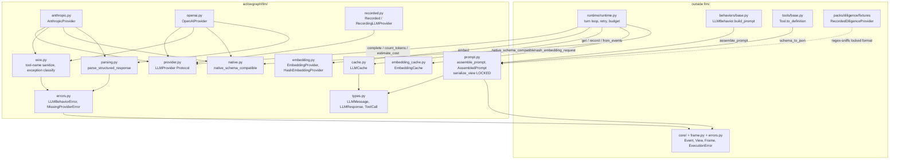
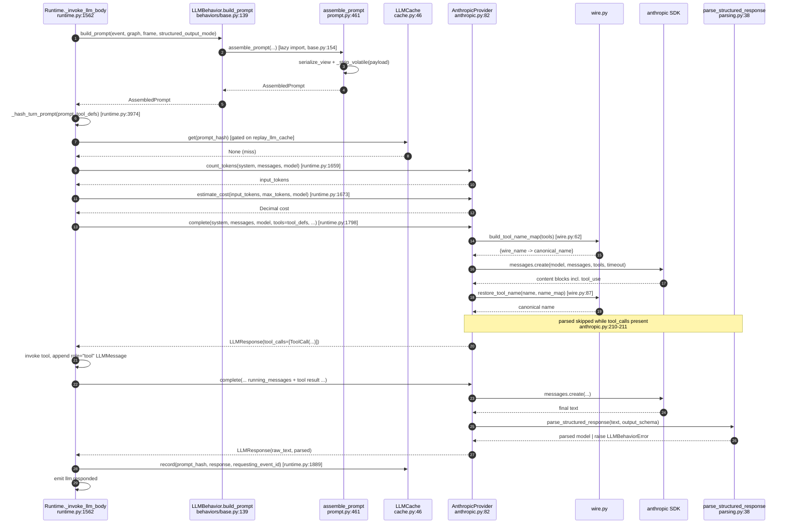

# LLM — the external-model boundary

## Responsibility

`activegraph/llm/` owns everything that touches an external model and nothing that decides *when*
to touch one. It supplies the deterministic prompt assembler, the two narrow provider Protocols
every backend implements, the wire-format translation into vendor SDKs, the content-keyed replay
caches, and the LLM-specific error taxonomy. It deliberately does **not** orchestrate: there is no
turn loop, no retry, no budget, and no event emission inside the package — "the loop is
orchestrated by the runtime, not the provider" (`activegraph/llm/provider.py:32-36`). Two provider
seams live here: `LLMProvider` for text completion (`activegraph/llm/provider.py:48`) and
`EmbeddingProvider`, "the runtime's second provider seam" (`activegraph/llm/embedding.py:5`,
`:32`). The dependency direction is strictly one-way — `llm/` never imports `runtime/`, `store/`,
`sinks/`, `observability/`, `packs/`, `tools/`, or `behaviors/`.

## Component map



## Key types & entry points

### Protocols

- `LLMProvider` — `runtime_checkable` Protocol; 3 required methods + 3 additive, getattr-guarded members — `activegraph/llm/provider.py:48`
- `EmbeddingProvider` — `runtime_checkable` Protocol; `embed()` + `default_model` — `activegraph/llm/embedding.py:32`
- `HashEmbeddingProvider` — deterministic dependency-free test double, sha256-bucket + L2 norm; vectors are explicitly **not** semantically meaningful — `activegraph/llm/embedding.py:54`, `:61-65`

### Data shapes (public contract)

- `LLMMessage(role, content, tool_use_id, tool_name, tool_calls)` — frozen dataclass — `activegraph/llm/types.py:35`
- `Role = Literal["user","assistant","tool"]` — `activegraph/llm/types.py:31`
- `ToolCall(id, name, args)` — frozen dataclass — `activegraph/llm/types.py:75`
- `LLMResponse(raw_text, parsed, input_tokens, output_tokens, cost_usd, latency_seconds, model, finish_reason, seed, cache_hit, provider_meta, tool_calls)` — mutable dataclass — `activegraph/llm/types.py:94`
- `AssembledPrompt(system, messages, model, max_tokens, temperature, top_p, output_schema_name, output_schema_json, deterministic, structured_output_mode, sections)` — `activegraph/llm/prompt.py:53`

### Prompt assembly (pure, no I/O)

- `assemble_prompt(...) -> AssembledPrompt` — top-level assembler; "Pure function over its arguments — no I/O, no provider calls" — `activegraph/llm/prompt.py:461`, docstring `:486`
- `serialize_view(view, *, around, depth) -> str` — **format is locked and snapshot-tested; changing it is a breaking change** — `activegraph/llm/prompt.py:112`, `:120-122`
- `build_system_prompt(...)` — `activegraph/llm/prompt.py:192`
- `build_user_message(...)` — `activegraph/llm/prompt.py:347`
- `build_instruction(creates, output_schema_name)` — `activegraph/llm/prompt.py:405`
- `schema_to_json(schema) -> Optional[dict]` — Pydantic v2 `model_json_schema()` with a name-only shell fallback — `activegraph/llm/prompt.py:441`
- `example_instance_from_schema(schema)` — deterministic placeholder instance, depth-bounded at 6 — `activegraph/llm/prompt.py:258`; worker `_example_instance` at `:285`
- `_strip_volatile(value)` — recursively drops `provenance`, `timestamp`, `run_id` from the event payload before hashing/prompting — `activegraph/llm/prompt.py:378-399`

### Providers

- `AnthropicProvider` — `activegraph/llm/anthropic.py:82`; `default_model = "claude-sonnet-4-5"` (`:85`)
- `OpenAIProvider` — `activegraph/llm/openai.py:85`; `default_model = "gpt-4o-mini"` (`:90`)
- `RecordedLLMProvider(fixtures_dir, *, structured_output_mode="prompt")` — `activegraph/llm/recorded.py:112`
- `RecordingLLMProvider(inner, fixtures_dir)` — `activegraph/llm/recorded.py:250`
- `RecordedDiligenceProvider` — a fourth, out-of-package scripted provider, duck-typed rather than a Protocol subclass — `activegraph/packs/diligence/fixtures/__init__.py:56`

### Wire helpers, classification, structured output

- `sanitize_tool_name(name)` — `.` → `__`, other non-`[A-Za-z0-9_-]` → `_` — `activegraph/llm/wire.py:41`
- `build_tool_name_map(tools) -> dict[wire, canonical]`; **raises `ValueError` on collision** — `activegraph/llm/wire.py:62`, raise at `:76-83`
- `restore_tool_name(name, name_map)` — table lookup, never a blind string replace — `activegraph/llm/wire.py:87`
- `classify_provider_exception(e) -> reason_code` — `activegraph/llm/wire.py:113`
- `parse_structured_response(text, schema)` — the sole boundary between raw provider text and typed objects — `activegraph/llm/parsing.py:38`
- `native_schema_compatible(schema) -> bool` — offline pre-flight for constrained decoding — `activegraph/llm/native.py:51`
- `inject_additional_properties_false(schema)` — the only permitted schema mutation — `activegraph/llm/native.py:140`

### Caches and errors

- `LLMCache` — `get / has / __len__ / record / from_events` — `activegraph/llm/cache.py:46`
- `EmbeddingCache` — same surface — `activegraph/llm/embedding_cache.py:40`
- `hash_embedding_request(*, texts, model) -> sha256hex` — `activegraph/llm/embedding_cache.py:20`
- `MissingProviderError(behavior_name)` — subclasses `RegistrationError, RuntimeError` — `activegraph/llm/errors.py:200`
- `LLMBehaviorError(reason, message, *, payload_extras)` — subclasses `ExecutionError, Exception` — `activegraph/llm/errors.py:254`

## Interfaces & contracts at each seam

Exactly five modules outside `activegraph/llm/` import from it (verified by grep over the package),
plus `activegraph/__init__.py:41`, which re-exports `LLMBehaviorError` and `MissingProviderError`
into the public namespace.

### llm <-> runtime (completion turn loop)

The primary seam. `runtime/runtime.py` imports `LLMProvider`, `LLMMessage`, `ToolCall`,
`LLMBehaviorError`, and `MissingProviderError` at module level (`runtime.py:81-86`) and lazily
imports `native_schema_compatible` / `schema_to_json` at `runtime.py:937-940`. The single hot call
site is `Runtime._invoke_llm_body` (`runtime.py:1562`), whose documented step order lives at
`runtime.py:1489-1502`. Registration-time entry is `Runtime._ensure_registry` (`runtime.py:949`),
which raises `MissingProviderError(behavior_name=b.name)` at `runtime.py:968` when any `LLMBehavior`
is registered with `llm_provider is None`.

```ebnf
completion-request ::= complete( "system" "=" string ,
                                 "messages" "=" message-list ,
                                 "model" "=" model-name ,
                                 "max_tokens" "=" int ,
                                 "temperature" "=" float ,
                                 "top_p" "=" float ,
                                 "output_schema" "=" ( pydantic-model | None ) ,
                                 "timeout_seconds" "=" float ,
                                 [ "tools" "=" tool-def-list ] ,
                                 [ "structured_output_mode" "=" "native" ] )
                       (* keyword-only, all of them; the mode kwarg is passed ONLY
                          when native resolved — runtime.py:1789-1797 *)

message-list       ::= message { message }
message            ::= LLMMessage( role , content [ , tool_use_id ]
                                                  [ , tool_name ]
                                                  [ , tool_calls ] )
role               ::= "user" | "assistant" | "tool"

tool-def-list      ::= tool-def { tool-def }
tool-def           ::= "{" "name" ":" canonical-name ,
                           "description" ":" string ,
                           "input_schema" ":" json-schema "}"
canonical-name     ::= [ pack-name "." ] identifier

completion-response ::= LLMResponse( raw_text , parsed , input_tokens , output_tokens ,
                                     cost_usd , latency_seconds , model , finish_reason ,
                                     seed , cache_hit , provider_meta , tool_calls )
tool-call          ::= ToolCall( id , canonical-name , args-dict )
                       (* names are ALWAYS canonical on return — wire.py restores *)

completion-failure ::= LLMBehaviorError( reason , message , payload_extras )
reason             ::= terminal-reason | transient-reason
terminal-reason    ::= "llm.parse_error" | "llm.schema_violation" | "llm.fixture_missing"
                     | "llm.auth_error" | "llm.request_error"
transient-reason   ::= "llm.network_error" | "llm.rate_limited"
payload_extras     ::= "{" "model" , "exception_type" , "message"
                           [ , "retry_after_seconds" ] "}"

(* additive declarations, all getattr-guarded by the runtime *)
provider-decls     ::= "default_model" ":" model-name
                     | recognizes_model( name ) "->" bool
                     | supports_native_structured_output( model ) "->" bool
                     | estimate_cost( input_tokens , output_tokens , model ) "->" Decimal
                     | count_tokens( system , messages , model ) "->" int

mode-resolution    ::= "native"  when runtime.native_structured_output
                                  and behavior.model is not None
                                  and getattr(provider,"supports_native_structured_output")(model)
                                  and native_schema_compatible( schema_to_json(output_schema) )
                     | "prompt"  otherwise     (* silent, debug-logged, audited *)
```

**Contract notes.**

- All Protocol methods are keyword-only (`provider.py:54-86`). Three are required — `complete`,
  `estimate_cost`, `count_tokens`. Three are additive and getattr-guarded by the runtime —
  `default_model`, `recognizes_model`, `supports_native_structured_output` (`provider.py:26-30`,
  `:88-101`), so custom pre-v1.0.2 providers keep working; they just require explicit `model=` and
  never get native mode.
- `recognizes_model` must be **permissive**: unknown names — fine-tuned models, internal deployment
  names, experimental prefixes — should return `False` (`provider.py:109-112`).
- No streaming, no multi-model orchestration (`provider.py:32-33`). Tool-loop ownership is the
  runtime's: the provider returns `tool_calls`, the runtime invokes the tools and re-calls
  `complete()` with a `role="tool"` message (`provider.py:33-36`).
- `count_tokens` is called **only** when `cached is None and self.budget.has_cost_limit()`
  (`runtime.py:1657-1659`); a raise there becomes `behavior.failed` with
  `reason="llm.network_error", extras={"phase":"count_tokens"}` (`runtime.py:1665-1672`).
- `estimate_cost` prices the **worst case** — `max_tokens` is passed as the output-token estimate
  (`runtime.py:1673`).
- Native fallback is **silent-but-audited, never an error** (`native.py:16-17`,
  `runtime.py:926-928`): a non-qualifying schema logs one debug line at registration
  (`runtime.py:941-945`) and the resolved mode rides every `llm.requested` payload
  (`runtime.py:1726-1730`).
- `native_schema_compatible` is deliberately conservative (`native.py:51-63`): root must be an
  object; only 14 allowlisted keywords (`native.py:30-48`); **every object property must be in
  `required`** — optional fields would need a semantic rewrite "the framework refuses to do
  silently" (`native.py:106`); `additionalProperties` must be absent or `false`; `$ref` must be
  internal (`#/`-prefixed) and non-recursive (`native.py:90-97`).
- `inject_additional_properties_false` is the **single permitted mutation**, justified as "a pure
  narrowing — Pydantic validation ignored extra keys, so forbidding them changes what the model may
  emit, never what a conforming response means" (`native.py:143-147`).
- **Retry/backoff is entirely the runtime's.** There is no retry logic anywhere in
  `activegraph/llm/`; every provider makes exactly one SDK call per `complete()`. **CONTRACT v1.11
  #1 capability exception**: `ClaudeCodeProvider`'s "one call" is additionally constrained to "one
  call, `max_turns=1`, 0-or-1 tool calls" — the Claude Agent SDK backend has no `max_tokens`/
  `temperature`/`top_p` controls at all (accepted for Protocol conformance, never forwarded). Unlike
  a per-call guard, this is enforced by `Runtime`'s capability-binding validation
  (`activegraph/llm/provider.py`'s additive `LLMProviderCapabilities`, read at all three binding
  moments): a `deterministic=True` behavior or a hard `max_cost_usd` budget is refused at binding
  time, before any provider call, rather than silently degraded or raised mid-run. See
  `claude_code.py`'s module docstring and `CONTRACT.md` v1.11 #1 for the full capability-limited-
  provider record. Config lives at
  `runtime.py:347-349` (`llm_retry_max_attempts=3`, `initial_delay=0.5s`, `max_delay=8.0s`), clamped
  at `runtime.py:420-426`. `_llm_retry_delay_seconds` (`runtime.py:3916`) lets a provider-supplied
  `retry_after_seconds` win when present, clamped to `[0, maximum]` (`:3924-3929`), else
  `min(initial * 2**attempt_index, maximum)` (`:3932`). The transient set is runtime-side:
  `_TRANSIENT_LLM_REASONS = {"llm.network_error", "llm.rate_limited"}` (`runtime.py:3909`), checked
  by `_is_transient_llm_reason` (`:3912`).
- **Every failed attempt is logged** as its own `llm.responded` event carrying an `error` object
  (`runtime.py:2412-2457`), so "a provider outage cannot be confused with a valid empty response"
  (`errors.py:121-123`). Retried events chain via `retry_of` and `caused_by = <previous error event
  id>` (`runtime.py:1731-1735`, `:1833`). Retries reuse the **same turn hash**, and only
  `attempt_index == 0` gets the strict-replay hash check (`runtime.py:1765-1766`).
- **There is no rate limiter, concurrency cap, RPM tracker, or circuit breaker** anywhere in the LLM
  path. Rate limiting is purely reactive: 429 → classify → backoff, and the sleep is a blocking
  `time.sleep` on the runtime thread (`runtime.py:1835`, `:1875`).
- Error classification order is load-bearing and documented: rate-limit first (it is also a 4xx),
  then auth, then other 4xx, then network (`wire.py:117-121`). Classification prefers the SDK's
  `status_code` attribute and falls back to type-name heuristics (`wire.py:122-139`). **The fallback
  is the transient code on purpose** — "anything unrecognized stays `llm.network_error` so unknown
  failure shapes keep their pre-v1.3 retry behavior rather than being silently promoted to terminal"
  (`wire.py:26-28`). The historical bug this fixed: before v1.3 "a bad API key was retried with
  exponential backoff before failing" (`wire.py:19-22`).
- `LLMBehaviorError.__init__(reason, message, *, payload_extras)` is frozen "so the ~8 internal raise
  sites in providers do not change" (`errors.py:263-265`). `MissingProviderError` fires **at
  registration, not per-invocation** (`errors.py:205-206`), because "silently no-op'ing the behavior
  would corrupt the audit trail" (`errors.py:235-239`).

Reason-code raise sites:

| reason | terminal / transient | raised at |
|---|---|---|
| `llm.parse_error` | terminal | `parsing.py:67`; also `runtime.py:2052` when `parsed is None` despite a schema |
| `llm.schema_violation` | terminal | `parsing.py:76`; also `runtime.py:2037` on cache-hydration failure |
| `llm.fixture_missing` | terminal | `recorded.py:182` |
| `llm.rate_limited` | **transient** | via `wire.py:126-127` |
| `llm.network_error` | **transient** | via `wire.py:140` (the fallback) |
| `llm.auth_error` | terminal | via `wire.py:128-133` |
| `llm.request_error` | terminal | via `wire.py:134-139` |

### llm <-> runtime (cache and replay)

`LLMCache` is keyed by **prompt hash (content match), not event id** — "that's what lets a fork's
regenerated prompts hit the same recorded responses" (`cache.py:3-5`). The originating
`llm.requested` id is stored for lineage but is not the key (`cache.py:6-7`; `CachedEntry` at
`:41`). The runtime populates it from an event stream on `Runtime.load(..., replay_llm_cache=True)`
and `runtime.fork(...)` (`runtime.py:3325`, `:3508`, `:4244`), and records inline after each live
call (`runtime.py:1889-1896`) so same-run repeats hit too.

```ebnf
cache-read     ::= get( prompt_hash ) "->" ( LLMResponse{cache_hit=true} | None )
                 | has( prompt_hash ) "->" bool
cache-write    ::= record( prompt_hash , LLMResponse , requesting_event_id )
                   (* stores a copy with cache_hit=false *)
cache-hydrate  ::= from_events( event-stream ) "->" LLMCache

pairing-rule   ::= responded-event
                   where responded.type = "llm.responded"
                     and not responded.payload["error"]
                     and requested = lookup( responded.caused_by )
                     and requested.type = "llm.requested"
                     and requested.payload["prompt_hash"] is truthy
                   yields ( requested.payload["prompt_hash"] -> responded )

turn-cache-key ::= sha256( canonical-json( "{" model , system , messages ,
                     output_schema_name , output_schema_json , max_tokens ,
                     temperature , top_p , deterministic ,
                     "tools" ":" ( tool-def-list | null )
                     [ , "structured_output_mode" ":" "native" ] "}" ) )
                   (* _hash_turn_prompt, runtime.py:3974 — includes running_messages,
                      so each turn of a tool loop keys distinctly *)
```

**Contract notes.**

- `get()` returns a **copy with `cache_hit=True`**, never the stored object, so a second hit on the
  same hash also reports `cache_hit=True` (`cache.py:55-75`); `record()` stores an un-flagged copy
  (`cache.py:93-109`).
- `from_events` **skips events with a truthy `payload["error"]`** — failed attempts are not reusable
  model output (`cache.py:133`).
- `tool_calls` round-trip through both `get`/`record` (`cache.py:73-74`, `:108`) and through the
  event payload via `_response_from_event_payload` (`cache.py:151-184`), "so the turn loop sees the
  same shape live vs cached" (`cache.py:72-73`).
- **No eviction, no TTL, no size bound** — `_by_hash` is an unbounded dict (`cache.py:48`).
- Cache **reads** are gated on `self.replay_llm_cache` (`runtime.py:1651`); **writes** are not — the
  runtime lazily creates an `LLMCache` if none exists (`runtime.py:1892-1896`). A cache hit forces
  `max_attempts = 1` (`runtime.py:1696`).

**Three distinct hash schemes cross this seam.** All use
`sha256(json.dumps(payload, sort_keys=True, separators=(",",":")))`:

| # | Function | Key set | Consumer |
|---|---|---|---|
| A | `AssembledPrompt.hash()` — `prompt.py:105`, payload at `:81-98` | model, system, messages, output_schema_name, output_schema_json, max_tokens, temperature, top_p, deterministic (+ `structured_output_mode` iff native). **No `tools` key.** | Tests only — `tests/test_llm_behavior.py:233`, `tests/test_llm_determinism.py:80-81` |
| B | `_hash_turn_prompt` — `runtime.py:3974`, payload at `:3990-4006` | Same as A **plus `"tools": tool_defs or None` (always present)**; `deterministic` = `prompt.deterministic` | The real `LLMCache` key and the `prompt_hash` on every `llm.requested` / `llm.responded` |
| C | `_hash_payload(_canonical_prompt_payload(...))` — `recorded.py:104`, `:65` | Same key set as B, but `deterministic` is **derived**: `(temperature == 0.0 and top_p == 1.0)` (`recorded.py:175`, `:327`) | `RecordedLLMProvider` fixture filename |

A ≠ B always, because B always emits a `"tools"` key and A never does. B == C in the common case,
which is why fixture filenames match the logged `llm.requested.prompt_hash`; they diverge only when
a behavior declares `deterministic=False` while `temperature == 0.0` and `top_p == 1.0`.
`timeout_seconds` is in **none** of the three — a timeout change never invalidates a cache entry or
a fixture. `EmbeddingCache` uses a fourth, unrelated scheme (`embedding_cache.py:20`).

### llm <-> runtime (embedding)

`Runtime.embed` (`runtime.py:1136`) hashes the request with `hash_embedding_request`
(`runtime.py:1167`), consults `EmbeddingCache`, and only then calls `provider.embed(texts=, model=)`
at `runtime.py:1224`, defaulting the model from `provider.default_model` (`runtime.py:1163`).

```ebnf
embed-request    ::= embed( "texts" "=" string-list , "model" "=" model-name )
                     "->" vector-list
vector-list      ::= vector { vector }     (* len == len(texts), order-preserving *)
vector           ::= float { float }       (* uniform dimensionality per model *)
embed-failure    ::= any-exception         (* MUST raise, never return partial *)

embed-cache-key  ::= sha256( json( "{" "model" ":" model , "texts" ":" string-list "}" ,
                                   sort_keys , ensure_ascii=false ) )
embed-cache-read ::= get( inputs_hash ) "->" ( fresh-list-copies | None )
embed-hydrate    ::= from_events( event-stream ) "->" EmbeddingCache
                     accepting only pairs where every vector is a list of finite
                     non-bool numbers, all vectors share one dimension, and
                     len(vectors) == requested.payload["input_count"]
```

**Contract notes.**

- `EmbeddingProvider.embed` must be order-preserving with uniform dimensionality, and
  "implementations should raise on failure rather than returning partial results" because "a
  silently short list would misalign every downstream score" (`embedding.py:44-50`).
- The cache key uses `ensure_ascii=False` (`embedding_cache.py:20-29`) — note the divergence from
  the LLM hashes, which use `json.dumps` defaults (`ensure_ascii=True`).
- `EmbeddingCache.get()` returns fresh `list` copies "so callers cannot mutate the replay authority"
  (`embedding_cache.py:5-6`, `:46-52`, `:62-74`); storage is an immutable tuple-of-tuples.
- `from_events` validation is strict and silent: it skips error responses and rejects non-list
  vectors, mixed dimensionality, bool/non-numeric components, non-finite floats, and an input-count
  mismatch, `continue`-ing past the offending pair (`embedding_cache.py:76-127`).
- The `embedding.requested` event stores **only the content hash, never the input text**
  (`runtime.py:1146-1147`, payload at `:1177-1182`); the response event stores the vectors
  (`runtime.py:1246-1254`).
- Under `replay_strict`, `Runtime.embed` refuses to fall through to live I/O **even when a provider
  is configured** (`runtime.py:1203-1210`).

### llm <-> behaviors

`LLMBehavior.build_prompt` (`behaviors/base.py:139`) is the only behaviors-side entry into `llm/`.
It lazily imports `assemble_prompt` at `:154` and calls it at `:176-193`; `AssembledPrompt` is a
`TYPE_CHECKING`-only import at `:25`, so `behaviors` carries no runtime import edge for the type.
The runtime calls it at `runtime.py:1598-1603` with `structured_output_mode=so_mode`. It is public
per CONTRACT v0.6 #20 — "Reproducible (pure over inputs); cheap (no I/O)" (`behaviors/base.py:150-151`).

```ebnf
prompt-assembly ::= assemble_prompt( behavior_name , description , model , output_schema ,
                                     creates , view , event , frame , around , depth ,
                                     max_tokens , temperature , top_p , deterministic ,
                                     [ prompt_template ] , [ structured_output_mode ] )
                    "->" AssembledPrompt

assembled-prompt ::= system-text , user-message-list , call-params , sections

system-text     ::= identity-line
                    [ "Mission: " goal ]
                    [ "Constraints:" bullet-list ]
                    [ "Role: " description ]
                    [ schema-block ]                  (* joined with "\n\n" — prompt.py:255 *)
identity-line   ::= 'You are an active-graph behavior named "' name '".'
schema-block    ::= native-schema-sentence | prompt-schema-block
native-schema-sentence
                ::= "Respond with JSON that matches the `" name "` schema."
prompt-schema-block
                ::= instance-framing , "Schema:" json , "Example instance..." json

user-message    ::= view-block "\n\n" "## Triggering event\n" event-block
                    "\n\n" "## Task\n" instruction
                  | prompt_template.format( system , view , event , instruction )

view-block      ::= "## Graph context" [ " (" header-bits ")" ]
                    "### Objects"       object-line-list
                    "### Relations"     relation-line-list
                    "### Recent events" event-line-list
                    (* FORMAT IS LOCKED — snapshot-tested, prompt.py:120-122 *)
header-bits     ::= [ "depth=" int ] [ ", " ] [ "around=" object-id ]
object-line     ::= "- " id " (" type "): " canonical-json | "- (none)"
relation-line   ::= "- " source " --" type "--> " target | "- (none)"
event-line      ::= "- " id " " type [ summary-tail ] | "- (none)"

event-block     ::= "- id: " id "\n- type: " type "\n- actor: " actor
                    "\n- payload:\n```\n" volatile-stripped-json "\n```"
volatile-stripped ::= json minus keys { "provenance" , "timestamp" , "run_id" }
```

**Contract notes.**

- **Four locked sources, fixed order**: system → view → event → instruction (`prompt.py:7-14`).
  `prompt_template=` (a `str.format` over `{system}{view}{event}{instruction}`) is "the only escape
  hatch — and it still receives the same four runtime-assembled inputs. There is no raw
  string-concat path in user code" (`prompt.py:30-33`). An unknown placeholder raises `ValueError`
  naming the allowed set (`prompt.py:516-520`).
- **View serialization format is part of the public contract**, snapshot-tested; changing it is a
  breaking change (`prompt.py:16-18`, `:120-122`).
- **Volatile-field stripping** removes `provenance`, `timestamp`, `run_id` recursively before
  hashing/prompting, because provenance embeds the parent `run_id` and "without this, the cache
  would miss on every fork" (`prompt.py:364-367`, `:378-399`). The runtime advertises this as
  `prompt_normalized: True` on every `llm.requested` (`runtime.py:1721-1724`).
- **Determinism normalization**: `deterministic=True` forces `temperature=0.0` and `top_p=1.0`
  (`prompt.py:526-527`).
- **Structured-output modes shape the system prompt.** In prompt mode (default),
  `build_system_prompt` embeds the JSON Schema *plus* a generated example instance with explicit
  "Return an INSTANCE ... NOT the schema itself" framing — added because "some models echo the JSON
  Schema definition back instead of an instance, triggering `llm.schema_violation`"
  (`prompt.py:233-253`, rationale `:238-242`); `build_instruction` repeats the framing
  (`prompt.py:417-428`). In native mode the schema dump, example, and framing are all **omitted** in
  favor of one sentence, because constrained decoding eliminates the failure mode
  (`prompt.py:224-232`).
- When `self.model is None`, `build_prompt` falls back to the hardcoded `"claude-sonnet-4-5"` **for
  inspection only** (`behaviors/base.py:175`).

### llm <-> tools

`Tool.to_definition()` (`tools/base.py:52`) lazily imports `schema_to_json` at `:59` and emits
`{"name", "description", "input_schema"}` (`:61-68`) — the *framework* tool-definition shape that
both providers then translate on the wire. The runtime calls it at `runtime.py:1592` to build
`tool_defs`.

```ebnf
tool-definition ::= schema_to_json( input_schema ) "->" ( json-schema | None )
json-schema     ::= pydantic_v2.model_json_schema()
                  | "{" "type" ":" "object" , "title" ":" class-name "}"   (* fallback *)
```

**Contract notes.** `tools/cache.py:3` and `tools/recorded.py:3` state that they *mirror*
`activegraph.llm.cache` / `activegraph.llm.recorded` — they are **copies, not imports**; there is no
code edge in that direction.

### llm <-> runtime/_live (cross-provider model validation)

`_which_shipped_provider_claims(name, *, exclude)` (`runtime/_live.py:151`) imports both concrete
provider classes at `:155-156`, instantiates each, and calls `recognizes_model(name)` (`:171`) to
produce the cross-provider-mismatch diagnostic (`_live.py:120-148`). Constructor failure is
swallowed defensively (`:167-170`).

```ebnf
model-validation ::= for each LLMBehavior b in registration source:
                       if b.model is None -> b.model := provider.default_model
                                             (fallback "claude-sonnet-4-5" — runtime.py:3953)
                       else               -> _validate_one( b , provider )
claim-lookup     ::= _which_shipped_provider_claims( name , exclude=type(provider) )
                     "->" ( AnthropicProvider | OpenAIProvider | None )
mismatch-outcome ::= InvalidRuntimeConfiguration  when another shipped provider claims it
                   | pass-through                 when nobody claims it (permissive)
```

### llm <-> packs

`packs/diligence/fixtures/__init__.py` imports `LLMMessage, LLMResponse` at `:19` and `ToolCall`
lazily at `:204` to implement `RecordedDiligenceProvider` (`:56`) — a scripted, **duck-typed**
`LLMProvider` that does not subclass the Protocol. Critically, its dispatch is a consumer of the
*locked prompt format*, not just the types: `_extract_behavior_name` (`:151`) regexes
`behavior named "([^"]+)"` out of the system prompt, matching `prompt.py:210-211` exactly, and
`_extract_company_name` (`:171`) splits on the literal `"## Triggering event"` header (`:176-179`),
matching `build_user_message` (`prompt.py:356`). `cli/quickstart.py:112`, `:410` construct
`Runtime(..., llm_provider=RecordedDiligenceProvider(...))`, so the CLI reaches `llm/` only through
this pack.

```ebnf
scripted-provider ::= duck-typed LLMProvider    (* NOT a Protocol subclass *)
dispatch-key      ::= sniff( system-prompt , 'behavior named "..."' )
                      x sniff( user-message , "## Triggering event" section )
                      x output_schema
                      (* hard dependency on the LOCKED prompt format *)
```

**Contract note.** This is the strongest practical argument for why `prompt.py:16-18` calls format
changes breaking — a scripted provider's dispatch silently misroutes if the header text moves.

### llm <-> core / frame / errors (outbound)

`llm/` reaches out to exactly four activegraph targets, and no others:

| Target | Symbol | Site | Why |
|---|---|---|---|
| `core/event.py` | `Event` | `prompt.py:43`, `cache.py:36`, `embedding_cache.py:17` | Prompt serializes the triggering event (`prompt.py:363`); both caches walk an event log in `from_events` |
| `core/view.py` | `View` | `prompt.py:44` | `serialize_view` reads `view.objects()`, `view.relations()`, `view.events()` (`prompt.py:133`, `:146`, `:151`) |
| `activegraph/frame.py` (top-level, **not** `core/`) | `Frame` | `prompt.py:45` | `build_system_prompt` reads `frame.goal` and `frame.constraints` (`prompt.py:214-219`) |
| `activegraph/errors.py` (top-level) | `ExecutionError`, `RegistrationError` | `errors.py:30` | Parent classes for the two LLM error types (`errors.py:200`, `:254`, `:284`) |

### llm -> vendor SDKs (the external wire)

Both shipped providers translate the framework shapes into vendor payloads. SDK imports are lazy —
`anthropic.Anthropic` at `anthropic.py:113` inside `_client()` with `ImportError` → `RuntimeError`
plus install hint (`:115-119`), and `openai.OpenAI` at `openai.py:158` with the same shape
(`:160-164`). API keys come from `os.environ[api_key_env]` only (`anthropic.py:122`,
`openai.py:167`) — "never from code, never from a checked-in config" (`anthropic.py:5`,
`openai.py:34-35`).

```ebnf
anthropic-wire  ::= messages.create( "model" , "max_tokens" , "messages" , "temperature" ,
                                     [ "system" ] ,
                                     [ "top_p" ]        (* iff top_p < 1.0 *) ,
                                     [ "tools" ] , [ "output_config" ] , "timeout" )
output_config   ::= "{" "format" ":" "{" "type" ":" "json_schema" ,
                                        "schema" ":" narrowed-schema "}" "}"
anth-message    ::= "{" "role" ":" ("user"|"assistant") , "content" ":" string "}"
                  | "{" "role" ":" "user" , "content" ":"
                        "[" "{" "type" ":" "tool_result" ,
                                "tool_use_id" ":" id , "content" ":" string "}" "]" "}"
                  | "{" "role" ":" "assistant" , "content" ":" block-list "}"
block-list      ::= [ text-block ] tool-use-block { tool-use-block }

openai-wire     ::= chat.completions.create( "model" , "messages" , "timeout" ,
                                             ( "max_tokens" "," "temperature" [ "," "top_p" ]
                                             | "max_completion_tokens" )  (* reasoning families *) ,
                                             [ "tools" ] , [ "response_format" ] )
response_format ::= "{" "type" ":" "json_schema" ,
                        "json_schema" ":" "{" "name" , "schema" ":" narrowed-schema ,
                                              "strict" ":" true "}" "}"
openai-tool-def ::= "{" "type" ":" "function" ,
                        "function" ":" "{" "name" ":" wire-name ,
                                           "description" , "parameters" "}" "}"

wire-name       ::= sanitize( canonical-name )
sanitize        ::= replace( "." , "__" ) then replace( ~[A-Za-z0-9_-] , "_" )
narrowed-schema ::= json-schema with additionalProperties:false injected on every
                    object node                      (* native.py:140 *)
```

**Contract notes.**

- **Tool-name sanitization (CONTRACT v1.3 #3).** Canonical dotted names
  (`diligence.fetch_company_docs`) stay canonical *everywhere inside the runtime* — event log,
  registry, `get_tool()` — and are rewritten **only on the wire** (`wire.py:8-15`). The reverse
  mapping is an explicit per-request table, "never a blind string replace, so a tool legitimately
  named with `__` cannot be mangled" (`wire.py:13-15`). **Collisions raise `ValueError`**
  (`wire.py:76-83`) because "silently dispatching the wrong tool would corrupt the event log's
  causality" (`wire.py:66-68`). Wire-safe names pass through byte-identically (`wire.py:49-50`), so
  non-pack tools produce pre-v1.3-identical requests. Echoed assistant `tool_calls` are
  **re-sanitized on the way back out** (`anthropic.py:355-364`, `openai.py:411-430`) "or the provider
  rejects the conversation it produced itself" (`openai.py:413-415`).
- **`top_p` is forwarded only when `< 1.0`** — "1.0 is the model default; only forward when
  narrowing" (`anthropic.py:154-156`, `openai.py:212-213`).
- **Reasoning families** (`o1`, `o3`, `o4`, `gpt-5` — `openai.py:120`) take `max_completion_tokens`
  and get **no** `temperature`/`top_p` at all (`openai.py:204-213`). "Before v1.3 the provider sent
  the GPT-4-era parameters unconditionally, so every call to these families was a guaranteed 400"
  (`openai.py:116-118`).
- **Structured-output parsing is skipped mid-tool-loop**: `parsed` is computed only when
  `output_schema is not None and not tool_calls` (`anthropic.py:210-211`, `openai.py:258-259`) —
  "Parsing structured output happens on the final turn, not mid-loop" (`anthropic.py:207-209`).
- **Multi-turn assistant echo (v1.0.3 #4)**: an assistant message carrying `tool_calls` must be
  reconstructed as full content blocks (text + `tool_use`), not raw text — "Direct Anthropic API
  access tolerated raw_text-only echo; the Vertex AI proxy enforces the spec strictly and 400s
  without it" (`anthropic.py:330-335`, impl `:348-365`).
- `LLMMessage.to_dict()` **omits `tool_use_id` / `tool_name` / `tool_calls` when `None`** so recorded
  fixture hashes for single-turn flows stay byte-identical (`types.py:61-71`, rationale `:67-68`).
  The same omit-when-absent pattern governs `structured_output_mode` in every hash
  (`prompt.py:96-97`, `recorded.py:99-100`, `runtime.py:4005-4006`).
- Both providers set `seed=None` — Anthropic's messages API has no seed parameter
  (`anthropic.py:227`); OpenAI does the same (`openai.py:285`) despite the API having one.
- `parse_structured_response` extraction order: verbatim `json.loads` → fenced ` ```json ` block →
  first balanced `{...}` / `[...]` span (`parsing.py:51-65`, regexes at `:34-35`). Provider symmetry
  is an explicit promise: "AnthropicProvider and OpenAIProvider produce identical errors for
  identical responses through this function" (`parsing.py:21-22`).
- **Cost accounting** in both providers is pure `Decimal` arithmetic over a per-million-token
  family-prefix table using **longest matching prefix** (`anthropic.py:45-61`, `openai.py:66-82`);
  unknown models fall back to `claude-sonnet-4` / `gpt-4o` (`anthropic.py:58-59`, `openai.py:79-80`).
  Tables are constructor-overridable via `pricing=` (`anthropic.py:92`, `openai.py:127`). Providers
  surface `retry_after_seconds` by reading the `retry-after` response header (`anthropic.py:378-389`,
  `openai.py:517-528`).
- **Replay determinism.** `RecordedLLMProvider` "raises if a fixture is missing (so tests fail loud
  rather than regressing into live calls)" (`recorded.py:6-8`); the raise is
  `LLMBehaviorError("llm.fixture_missing", ...)` at `recorded.py:182-186` carrying `prompt_hash` and
  `fixtures_dir` in `payload_extras`, and there is **no silent fallthrough to a real call**
  (`recorded.py:117-118`). Fixture path is `<fixtures_dir>/<sha256_hex>.json` (`recorded.py:180`,
  layout at `:17-36`); `recorded_at` sits deliberately outside the hashed `prompt` payload so it
  "doesn't perturb lookups but stays available for future debugging when fixtures drift"
  (`recorded.py:38-40`). `recognizes_model` returns `True` unconditionally so cross-provider
  validation never fires against fixtures (`recorded.py:137-140`), and
  `supports_native_structured_output` is **per-instance, not model-derived** — it returns
  `self._structured_output_mode == "native"` (`recorded.py:142-149`) — because fixture-backed replay
  must assemble prompts exactly the way the recording run did. `estimate_cost` returns `Decimal("0")`
  (`recorded.py:191-195`) and `count_tokens` is `chars//4` floored at 1 (`recorded.py:197-201`).
  `RecordingLLMProvider` delegates `default_model` (`recorded.py:267-269`), `recognizes_model`
  (`:271-275`), `supports_native_structured_output` (`:277-285`), `estimate_cost` and `count_tokens`
  (`:344-356`) to the inner provider so wrapping does not change the resolution surface, and forwards
  `structured_output_mode` **only when native** so pre-v1.3 inner providers "are never called with a
  parameter they do not accept" (`recorded.py:301-306`).
- The sandbox seam is the *absence* of a provider: the child process "configures NO llm_provider, so
  key-freedom is structural" (`sandbox/_child.py:247`).

## Sequence: one live LLM turn with a tool call



On the failure path, `classify_provider_exception` (`wire.py:113`) maps the SDK exception to a reason
code, the provider raises `LLMBehaviorError` with `retry_after_seconds` lifted from the `retry-after`
header (`anthropic.py:378-389`), the runtime logs an `llm.responded` carrying an `error` object
(`runtime.py:2412-2457`), and — if the reason is in `_TRANSIENT_LLM_REASONS` (`runtime.py:3909`) —
re-enters at the same turn hash after a blocking `time.sleep` (`runtime.py:1835`).

## Open questions

1. **`AssembledPrompt.hash()` is documentation-drifted and effectively unused in production.**
   `prompt.py:20-24` declares it "the cache key used by the replay layer," but the runtime keys the
   cache with `_hash_turn_prompt` (`runtime.py:3974`), which always adds a `"tools"` field, so the
   two can never agree. `hash()` / `canonical_json()` are referenced only from tests
   (`tests/test_llm_behavior.py:233`, `tests/test_llm_determinism.py:80-81`). Not dead code — it is
   public API and snapshot-tested — but the docstring is stale.

2. **Three hand-maintained implementations of the same hash payload** (`prompt.py:81-98`,
   `runtime.py:3990-4006`, `recorded.py:80-101`), each carrying "omit when absent" comments
   cross-referencing the others. Any future field added to prompt identity must land in all three or
   fixtures silently stop matching. A structural risk worth tracking.

3. **`deterministic` is computed differently in the fixture hash than in the cache hash.**
   `recorded.py:175` and `:327` derive `deterministic = (temperature == 0.0 and top_p == 1.0)`, while
   `runtime.py:3999` uses the declared `prompt.deterministic`. These agree except when a behavior
   sets `deterministic=False` with `temperature=0.0, top_p=1.0`. Recording and replay both use the
   derived form, so fixtures stay self-consistent; the mismatch surfaces only when correlating a
   fixture filename against a logged `prompt_hash`. No test found covering this corner.

4. **`_pricing_for`'s docstring claims a warning it does not emit.** `anthropic.py:50-52` says
   unknown models "fall back to sonnet-4 pricing and emit a warning via the returned `Decimal`
   (caller can detect by comparing to family default)" — there is no warning and no signal; the
   caller cannot distinguish a fallback from a real match. `openai.py:73` states the same fallback
   without the warning claim, so the OpenAI docstring is the accurate one.

5. **The `getattr(provider, "supports_native_structured_output", None)` guard (`runtime.py:932`)
   doesn't work by the mechanism its comment describes for Protocol subclasses.**
   `AnthropicProvider`, `OpenAIProvider`, `RecordedLLMProvider`, and `RecordingLLMProvider` all
   explicitly subclass `LLMProvider` (`anthropic.py:82`, `openai.py:85`, `recorded.py:112`, `:250`).
   Because the Protocol's method bodies are `...`, a subclass that omits an override **inherits a
   method returning `None`** rather than raising `AttributeError`. The getattr guard therefore only
   protects duck-typed providers such as `RecordedDiligenceProvider`. The outcome is still correct
   (`None` is falsy → prompt mode), but the described mechanism is not the operative one.

6. **`_retry_after_seconds` is duplicated byte-for-byte** in `anthropic.py:378-389` and
   `openai.py:517-528`, as is `_classify_provider_exception`'s one-line delegation
   (`anthropic.py:369-375` / `openai.py:508-514`). The shared parts already live in `wire.py`;
   `_retry_after_seconds` was apparently not lifted with them.

7. **No rate limiting, concurrency control, or circuit breaker anywhere in the LLM path.** Backoff is
   purely reactive to a classified 429 plus the provider's `retry-after` header, and the retry sleep
   is a blocking `time.sleep` on the runtime thread (`runtime.py:1835`, `:1875`). Called out
   explicitly because "rate limiting" is an expected item in an LLM-layer spec and its absence is a
   deliberate design point, not an oversight to be assumed away.

8. **`native.py` has no `__all__` and is not re-exported** from `llm/__init__.py` (compare
   `embedding_cache.py:130`, which does define `__all__`). It is reachable only via lazy imports from
   `anthropic.py:175`, `openai.py:225`, and `runtime.py:937`. Deliberate-looking for an internal
   module, but inconsistent with the rest of the package's export posture.

9. **`llm/__init__.py`'s declared public surface is narrower than actual usage.** Its `__all__`
   (`llm/__init__.py:49-69`) omits `sanitize_tool_name` and `native_schema_compatible` while
   including `serialize_view`, and its docstring does not mention `native`, `wire`, the `ToolCall`
   rationale, or `EmbeddingCache`'s v1.8 role. In practice `runtime.py` imports from submodules
   directly and never from `activegraph.llm`. Worth deciding what the intended public surface is.

10. **The package-level import graph entry "llm -> core" is incomplete.** `llm/` also depends on the
    top-level `activegraph.frame` (`prompt.py:45`) and `activegraph.errors` (`errors.py:30`).
    Verified: no other activegraph packages are imported from `llm/`.

11. **`RecordedDiligenceProvider`'s class docstring is stale.** `packs/diligence/fixtures/__init__.py:60-63`
    describes sniffing a `'## Behavior:'` line; the code actually regexes `behavior named "..."`
    (`:151`) and splits on `"## Triggering event"` (`:176-179`). The code is correct and matches
    `prompt.py:210-211` / `:356`; only the docstring describes an older format.
