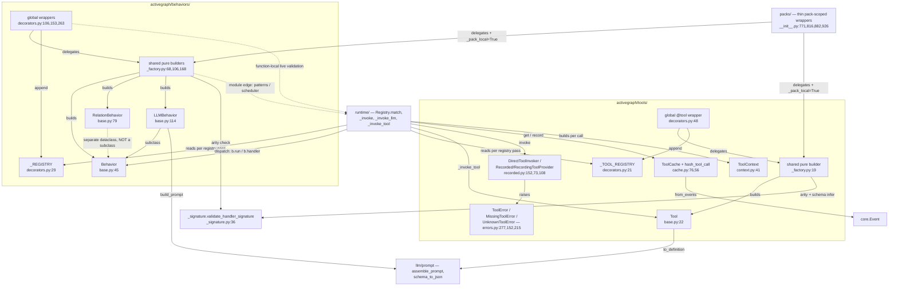
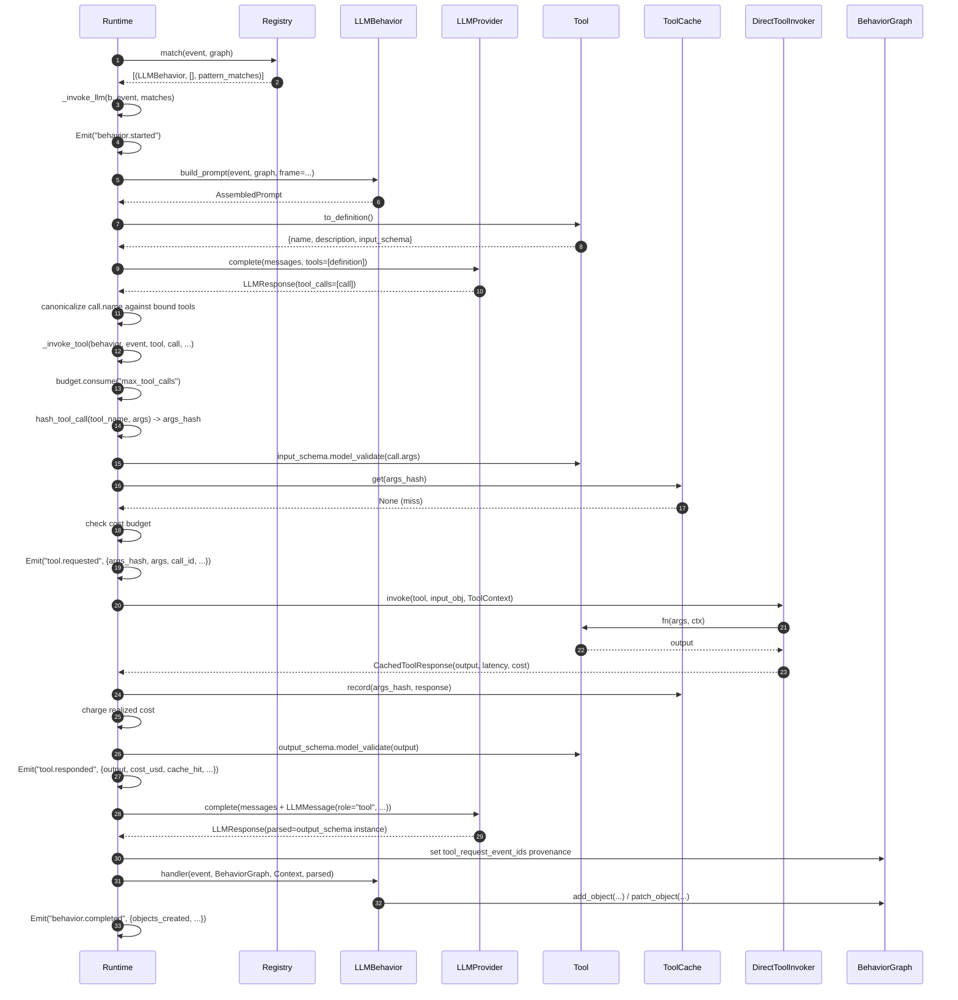

# Tools & Behaviors

## Responsibility

`behaviors/` and `tools/` are the two **extension-point declaration** subsystems. Their dataclasses,
shared factories, and decorator wrappers declare "metadata + a callable"; the wrappers themselves
do not dispatch application logic. The global wrappers append to module-level registries and the
pack wrappers stamp pack-local metadata. `behaviors/base.py:4-6` states it directly — "A Behavior is
data, not magic". Runtime owns behavior dispatch and its LLM tool-loop lifecycle. The tools package
also ships explicit direct/recorded invokers that execute a Tool when a caller invokes them.

A **Behavior** is the unit of registered logic that fires in response to an `Event` and may mutate
the graph. A **Tool** is a schema-aware, cost-bearing callable; schemas are optional and Runtime
validates them only when present. Runtime-owned tool
invocation occurs only mid-turn inside an `@llm_behavior` tool loop; the public direct and recorded
invokers also expose the same call seam for explicit use. `tools/base.py:1-12` calls Tool "a mirror
image of Behavior." The two subsystems have parallel registry/construction surfaces: global registry +
`clear_*` test hook + `get_*` snapshot + explicit `Runtime(behaviors=/tools=)` override. Their
pack-scoped wrappers reuse the same construction factories and skip global registration.

## Component map



## Key types & entry points

### behaviors/

- `Behavior` — dataclass carrying `name`, `fn`, `on`, `where`, `view_spec`, `creates`, `budget`,
  `priority`, `pattern`, `pattern_matcher`, `activate_after` — `behaviors/base.py:45-75`
- `Behavior.run(event, graph, ctx)` — the invocation shim; just `self.fn(event, graph, ctx)` —
  `behaviors/base.py:74-75`
- `RelationBehavior` — **not** a subclass of `Behavior`; adds `relation_type`; 4-arg
  `run(relation, event, graph, ctx)` — `behaviors/base.py:79-110`
- `LLMBehavior(Behavior)` — adds `handler`, `description`, `model`, `output_schema`,
  `deterministic`, `max_tokens`, `temperature`, `top_p`, `timeout_seconds`, `prompt_template`,
  `tools`, `max_tool_turns` — `behaviors/base.py:114-144`
- `LLMBehavior.build_prompt(event, graph, *, frame=None, structured_output_mode="prompt") -> AssembledPrompt`
  — public, pure, no I/O; the only outbound call from `behaviors/` into `llm/` —
  `behaviors/base.py:146-200`
- `_llm_behavior_fn_placeholder` — poison pill assigned to `LLMBehavior.fn`; raises `RuntimeError`
  if `.run()` is ever called on an LLM behavior — `behaviors/base.py:34-41`
- `@behavior`, `@llm_behavior`, `@relation_behavior` — `behaviors/decorators.py:106`, `:153`, `:263`
- `_REGISTRY: list[Behavior | RelationBehavior]` — module-global — `behaviors/decorators.py:29`
- `register(obj)` / `get_registry()` / `clear_registry()` — `behaviors/decorators.py:63`, `:50`, `:32`
- `build_behavior` / `build_llm_behavior` / `build_relation_behavior` — side-effect-free,
  two-stage constructors shared by global and pack wrappers — `behaviors/_factory.py:68-205`
- `_validate_output_schema(output_schema)` — strict Pydantic-`BaseModel`-subclass check at
  decoration time; raises `TypeError` — `behaviors/_factory.py:36-65`

### tools/

- `Tool` — dataclass carrying `name`, `fn`, `description`, `input_schema`, `output_schema`,
  `cost_per_call: Decimal`, `timeout_seconds`, `deterministic` — `tools/base.py:22-50`
- `Tool.to_definition() -> dict` — provider-facing `{name, description, input_schema}`; the outbound
  call into `llm/prompt.schema_to_json` — `tools/base.py:52-69`
- `ToolContext` — `behavior_name`, `event_id`, `frame`, `idempotency_key`, `timeout_seconds`,
  `logger`, `external_io_mode` — `tools/context.py:41-67`
- `@tool` + `_TOOL_REGISTRY` + `get_tool_registry()` / `clear_tool_registry()` —
  `tools/decorators.py:48`, `:21`, `:37`, `:24`
- `ToolCache` — content-keyed replay cache; `get` / `has` / `record` / `from_events` —
  `tools/cache.py:76-151`
- `hash_tool_call(*, tool_name, args) -> str` — `sha256(canonical_json({tool, args}))` —
  `tools/cache.py:56-59`; `canonicalize_args` — `tools/cache.py:34-53`
- `CachedToolResponse` — `output`, `error`, `latency_seconds`, `cost_usd`, `cache_hit`,
  `requesting_event_id` — `tools/cache.py:62-73`
- `DirectToolInvoker` / `RecordedToolProvider` / `RecordingToolProvider` — three implementations of
  one `invoke(tool, args, ctx) -> CachedToolResponse` signature — `tools/recorded.py:152`, `:73`, `:108`
- `ToolError(reason, message, *, payload_extras=)` / `MissingToolError` / `UnknownToolError` —
  `tools/errors.py:277`, `:152`, `:215`
- `make_graph_query_tool(graph) -> Tool` — factory, deliberately **not** globally registered —
  `tools/graph_query.py:59-94`
- `web_fetch` — the one global-registry built-in inside `activegraph.tools` — `tools/web_fetch.py:33-76`

### shared

- `validate_handler_signature(...)` — arity check reached by all six behavior wrappers and both
  `@tool` wrappers through their shared factories — `_signature.py:36-134`
- `infer_tool_input_schema(fn)` — fills `input_schema` from the first parameter's Pydantic
  annotation when omitted — `_signature.py:137-194`

## Interfaces & contracts at each seam

The complete inbound set was verified by grepping every non-self import. `behaviors/` is imported
by `runtime/`, `packs/`, and top-level `activegraph`; `tools/` is imported by those same three plus
`behaviors/base.py` for `Tool`/`ToolRef`. `_signature.py` is a dependency of the shared factories,
not an inbound consumer. `sandbox/`, `sinks/`, `store/`, `cli/`, `observability/`, `trace/`, and
`core/` never import either subsystem.

### tools+behaviors <-> author code (declaration & registration)

The decorators are the supported construction path for global use. Their shared factories validate
arity eagerly; the behavior factory also validates LLM `output_schema` type, pattern syntax, and
`activate_after` syntax at the `@` line.
Global `@llm_behavior` additionally validates against already-live runtimes; pack wrappers defer
that provider-dependent check until the Runtime's next registry pass after pack loading. The
rationale is at `_signature.py:8-14`:
a wrong-arity handler used to register fine and then fail at runtime with the `TypeError` swallowed
into a `behavior.failed` event. `register(obj)` is the manual escape hatch for objects built by hand.

```ebnf
behavior-registration   ::= global-registration | pack-registration
global-registration     ::= decorator "(" params ")" handler-def
                            (* side effect: _REGISTRY.append(obj)
                               + for @llm_behavior, live-runtime validation *)
                          | "register" "(" behavior-obj ")"
pack-registration       ::= packs-decorator "(" params ")" handler-def
                            (* no global append; obj._pack_local = True *)

decorator               ::= "@behavior" | "@llm_behavior" | "@relation_behavior"

params                  ::= common-params
                          | common-params "," llm-params
                          | "relation_type" "," common-params
common-params           ::= [ "name" ] [ "on" ":" event-type-list ]
                            [ "where" ":" payload-filter ]
                            [ "view" ":" view-spec ] [ "creates" ":" type-list ]
                            [ "budget" ":" budget-dict ] [ "priority" ":" int ]
                            [ "pattern" ":" cypher-subset ]
                            [ "activate_after" ":" ( int | "N events" ) ]
llm-params              ::= [ "description" ] [ "model" ] [ "output_schema" ":" BaseModel ]
                            [ "deterministic" ] [ "max_tokens" ] [ "temperature" ]
                            [ "top_p" ] [ "timeout_seconds" ] [ "prompt_template" ]
                            [ "tools" ":" tool-ref-list ] [ "max_tool_turns" ":" int ]
tool-ref-list           ::= "[" { Tool | tool-name-string } "]"

handler-def             ::= plain-handler | relation-handler | llm-handler
plain-handler           ::= "(" "event" "," "graph" "," "ctx" { "," extra } ")" "->" None
relation-handler        ::= "(" "relation" "," "event" "," "graph" "," "ctx"
                                { "," extra } ")" "->" None
llm-handler             ::= "(" "event" "," "graph" "," "ctx" "," "llm_output"
                                { "," extra } ")" "->" None
extra                   ::= param-with-default | annotated-param   (* settings injection *)

tool-registration       ::= "@tool" "(" tool-params ")" tool-fn-def
                            (* side effect: _TOOL_REGISTRY.append(t) *)
                          | "packs.tool" "(" tool-params [ "," "export_globally" ] ")" tool-fn-def
                            (* no global append; t._pack_local = True *)
                          | "make_graph_query_tool" "(" graph ")" -> Tool
                            (* factory; NEVER registered globally *)
tool-params             ::= [ "name" ] [ "description" ] [ "input_schema" ":" BaseModel ]
                            [ "output_schema" ":" BaseModel ] [ "cost_per_call" ":" Decimal ]
                            [ "timeout_seconds" ":" float ] [ "deterministic" ":" bool ]
tool-fn-def             ::= "(" "args" "," "ctx" { "," param-with-default } ")" "->" OutputSchema
                            (* extras MUST have defaults — allow_annotated_extras=False *)
input-schema-resolution ::= explicit-input_schema
                          | infer_tool_input_schema(fn)   (* 1st param annotation *)
                          | None                          (* -> empty JSON schema *)

registration-error      ::= TypeError(arity)          (* representative, not exhaustive *)
                          | TypeError(output_schema)  (* behaviors/_factory.py:50 *)
                          | UnsupportedPatternError
                          | InvalidActivateAfter
                          | InvalidRuntimeConfiguration(model/capability) (* runtime/_live.py:65-285 *)
                          | PackValidationError(not-pack-local) (* packs/__init__.py:648-672 *)
```

Contract notes:

- **Arity is checked at decoration time, not first invocation.** `@behavior` → `(event, graph, ctx)`,
  `@llm_behavior` → `(event, graph, ctx, llm_output)`, `@relation_behavior` →
  `(relation, event, graph, ctx)`. The shared builders declare those conventions at
  `behaviors/_factory.py:82-88`, `:132-138`, `:183-189`; wrong arity raises `TypeError` with a
  worked example at `_signature.py:87-104`.
- `validate_handler_signature` checks positional **arity only**, not names; `*args` satisfies any
  arity; uninspectable callables pass through — `_signature.py:36-134`. Behaviors pass
  `allow_annotated_extras=True` (for pack settings injection); tools pass `False`, so tool extras
  must carry defaults — `_signature.py:197-204`. The validator accepts annotated extras on global
  behavior handlers too, but Runtime supplies typed settings extras only through pack loader
  wrappers; a required global annotated extra is therefore accepted at decoration and fails when
  invoked. This is a current implementation gap, not a supported global injection seam.
- **`output_schema=` must be a Pydantic `BaseModel` subclass or `None`** — `TypeError` at the
  global or pack `@llm_behavior` line otherwise — `behaviors/_factory.py:36-65`, called at `:130`.
- **`register()` type-checks** its argument: `TypeError` for anything that is not a `Behavior` or
  `RelationBehavior` — `behaviors/decorators.py:90-96`.
- **`get_registry()` / `get_tool_registry()` return shallow copies**, so callers cannot mutate the
  registries through the returned lists (`behaviors/decorators.py:50-60`,
  `tools/decorators.py:37-45`). Explicit `behaviors=` / `tools=` inputs are snapshotted at Runtime
  construction; omitted inputs intentionally re-read the global registries on each registry pass,
  so decorating after Runtime construction is supported (`runtime/runtime.py:516-537`,
  `:1243-1248`, `:1284-1289`).
- **`activegraph/__init__.py` re-exports the full behavior surface** (`Behavior`, `LLMBehavior`,
  `RelationBehavior`, `behavior`, `clear_registry`, `get_registry`, `llm_behavior`, `register`,
  `relation_behavior` — `__init__.py:6-14`) but only **8 of the 13** names in
  `tools/__init__.py:50-64` (`__init__.py:122-131`). `ToolCache`, `RecordedToolProvider`,
  `RecordingToolProvider`, `make_graph_query_tool`, and `web_fetch` are reachable only via
  `activegraph.tools`.

### behaviors <-> runtime (dispatch + invocation, and a registration-time back-edge)

`runtime/` owns the entire invocation lifecycle; `behaviors/` supplies only metadata and a callable.
`Registry.match` reads `b.on`, `b.pattern_matcher`, `b.where`, and `b.relation_type` and returns
triples in registration order (`runtime/registry.py:91-104`); `Runtime` then fans out by concrete type.
`priority` is reserved metadata and is never a sort key: unequal values and ties both preserve this
registration order across plain, LLM, relation, global/pack, status, and same-tick delayed paths
(CONTRACT #10).
The edge is bidirectional: the decorators call back into `runtime.patterns`, `runtime.scheduler`, and
`runtime._live` at decoration time, while `LLMBehavior.build_prompt` calls `runtime.view_builder`.
The construction factory has module imports of `runtime.patterns` and `runtime.scheduler`
(`behaviors/_factory.py:14-15`); live-runtime validation stays function-local
(`behaviors/decorators.py:101`, `:255`), as do `build_prompt`'s LLM/view imports
(`behaviors/base.py:161-166`).

```ebnf
dispatch          ::= Registry.match(event, graph) -> { triple }
triple            ::= "(" behavior "," relation-list "," pattern-match-list ")"
match-predicate   ::= [ event.type ∈ behavior.on ]
                      ∧ [ behavior.pattern_matcher.matches(event, graph) ≠ ∅ ]
                      ∧ [ evaluate_where(behavior.where, event.payload) ]
                      ∧ [ ¬behavior.on ⇒ classify_event_type(event.type).triggers_pattern_only ]

invocation        ::= scheduled | plain-or-llm-immediate | relation-immediate
scheduled         ::= Emit("behavior.scheduled") ";" push-delayed-exact-identity
                      (* fires at tick + activate_after; current relation/pattern,
                         original-event where, one pattern marker before fan-out *)
plain-or-llm-immediate
                  ::= Emit("behavior.started") ";" handler-call
                      ";" ( Emit("behavior.completed") | Emit("behavior.failed") )
                      ";" [ Emit("context.read") ]
relation-immediate::= Emit("relation_behavior.started") ";" handler-call
                      ";" ( Emit("behavior.completed") | Emit("behavior.failed") )
                      ";" [ Emit("context.read") ]

handler-call      ::= b.run(event, BehaviorGraph, Context)
                    | b.run(relation, event, BehaviorGraph, Context)
                    | b.handler(event, BehaviorGraph, Context, parsed-output)

Context           ::= { view, frame, policy, random, clock, llm_provider?, matches,
                        settings, _runtime, _behavior_name, _event_id }
                      (* NO tool-invocation method *)
BehaviorGraph     ::= { add_object, add_relation, patch_object, propose_patch, emit,
                        get_object, get_relation }
                      (* auto-stamps actor, caused_by, frame_id,
                         llm_request_event_id, tool_request_event_ids *)

outcome           ::= None            (* return value is ignored *)
side-effects      ::= { Object | Relation | Patch | Proposal | Event }
failure           ::= Emit("behavior.failed", { behavior, event_id, reason?,
                                                exception_type, message, traceback })
                      (* ReplayDivergenceError alone propagates *)

back-edge         ::= runtime.patterns.parse(pattern).compile()
                    | runtime.scheduler.parse_activate_after(activate_after) -> int
                    | runtime._live.validate_behavior_against_live_runtimes(obj)
                    | runtime.view_builder.build_view(behavior, event, graph) -> View
```

Contract notes:

- Dispatch fan-out is by concrete type — `runtime/runtime.py:1697-1734`: `RelationBehavior` →
  `_invoke_relation(b, r, event, matches)` once **per matching relation**
  (`runtime/runtime.py:2983-3065`); `LLMBehavior` → `_invoke_llm` (`:1910`); plain `Behavior` →
  `_invoke` (`:1822`). `activate_after is not None` short-circuits to `_schedule(...)`; due entries
  re-match and dispatch all three concrete types at `:1738-1800`.
- Call sites into user code: `b.run(event, bgraph, ctx)` — `runtime/runtime.py:1868`;
  `b.run(relation, event, bgraph, ctx)` — `:3033`; `b.handler(event, bgraph, ctx, response.parsed)`
  — `:2530`. For LLM behaviors it is **`handler`, not `fn`** — `fn` is the poison-pill placeholder.
- **`LLMBehavior.fn` must never be called.** It raises `RuntimeError("… This is a bug.")` —
  `behaviors/base.py:34-41`, assigned by the shared builder at `behaviors/_factory.py:139-142`.
- **Return values are ignored.** Every handler signature is `-> None` and the runtime never reads a
  return — `runtime/runtime.py:1868`, `:2530`, `:3033`.
- **A behavior's only legal graph mutations go through `BehaviorGraph`**, not the raw `Graph`.
  Allowed: `add_object`, `add_relation`, `patch_object`, `propose_patch`, `emit`; reads:
  `get_object`, `get_relation` — `runtime/behavior_graph.py:1-8`. The wrapper auto-stamps
  `actor` / `caused_by` / `frame_id` and (for LLM behaviors) `llm_request_event_id` +
  `tool_request_event_ids` into provenance — `behavior_graph.py:51-62`, `:71-139`. Iteration goes
  through `ctx.view`, not the wrapper — `behavior_graph.py:155`. All five mutation counters are
  reported in every `behavior.completed` payload — `runtime/runtime.py:1894-1905`, `:2549-2561`,
  `:3051-3062`.
- **A behavior has no Runtime-owned tool-call method.** `Context` (`runtime/runtime.py:187-274`)
  exposes `view`, `frame`, `policy`, `random`, `clock`, `llm_provider`, `matches`, `settings`, plus
  `pack_settings()`, `propose_object()`, `embed()` — there is no tool-invocation method anywhere on
  it. Tools are reachable only from the LLM tool loop in `_invoke_llm_body` —
  `runtime/runtime.py:2383-2470`. Public invokers remain available for explicit calls outside
  behavior dispatch.
- **`ctx.llm_provider` is set only for LLM behaviors** — `runtime/runtime.py:1954-1966`; plain and
  relation behaviors get the field's `None` default — `:1837-1848`, `:3008-3019`. This is
  compatibility exposure, not a raw generation API: handlers must not call `complete()` directly.
  Recorded generation goes through `@llm_behavior`, and embeddings through `ctx.embed`, so events,
  cache, budgets, retry, tools, provenance, and replay remain Runtime-owned.
- **A developer behavior-handler exception never propagates.** `_invoke` catches everything except
  `ReplayDivergenceError` and emits `behavior.failed` — `runtime/runtime.py:1869-1887`; same in
  `_invoke_relation` (`:3034-3043`) and around the LLM handler (`:2531-2541`).
- **Pattern-only behaviors (empty `on=`) obey the central `triggers_pattern_only` policy gate.**
  They do not fire on event types classified with `triggers_pattern_only=False`, including the
  bookkeeping prefixes and `context.read` (`runtime/registry.py:52-66`,
  `runtime/event_policy.py:13-54`).
- **`activate_after` re-checks `where=` AND the pattern at fire time**, and skips silently if either
  no longer holds. It also recomputes relation candidates from current graph state and dispatches
  relation behaviors normally — `runtime/runtime.py:1765-1800`, `runtime/registry.py:52-89`.
- **Cross-provider model validation fires when a behavior binds to a registry.** Global
  `register()` / `@llm_behavior` validate immediately against already-live runtimes. Pack wrappers
  do not; after `load_pack` invalidates `rt.registry`, pack behavior validation occurs on the next
  `_ensure_registry()` pass. Unrecognized model names pass silently
  (`runtime/_live.py:65-90,204-255`; `runtime/runtime.py:1243-1328`).
- `runtime/view_builder.py:16-19` `build_view(behavior, event, graph) -> View` reads
  `behavior.view_spec` — the metadata→`ctx.view` seam.

### tools <-> runtime (registry assembly + invocation)

`Runtime` assembles a name→`Tool` map at `_ensure_registry` and is the only caller of `_invoke_tool`.
Every Runtime-owned tool invocation is driven by an LLM `tool_call` inside an `@llm_behavior`'s turn loop; the
runtime gates budget, checks declaration, validates input, consults cache/cost, emits the request,
calls the invoker on a miss, records/charges, validates output, emits the response, and echoes the
result back to the model. Imports are at
`runtime/runtime.py:147-164`; constructor knobs `tools=`, `replay_tool_cache=`, `tool_cache=`,
`tool_invoker=` are at `:426-430`, defaulting to `ToolCache()` and `DirectToolInvoker()` at
`:516-529`.

```ebnf
registry-assembly ::= ( explicit-tools | get_tool_registry() )
                      ";" merge(_pack_tools)
                      ";" merge({ t | t ∈ LLMBehavior.tools, t : Tool })
                      ";" ∀ name ∈ LLMBehavior.tools : resolve(name) ∨ raise MissingToolError
registry-error    ::= InvalidToolRegistration(non-Tool entry)

turn-loop        ::= { turn }                    (* at most max_tool_turns *)
turn             ::= llm-request ";" llm-response ";"
                     canonicalize-returned-tool-names ";"
                     ( final-response | { tool-invocation } )
llm-request      ::= provider.complete(messages, tools = [ Tool.to_definition() ])
tool-definition  ::= "{" "name" "," "description" "," "input_schema" "}"
canonicalize-returned-tool-names ::= exact canonical name
                                   | one distinct declared suffix match
                                   | raise UnknownToolError

tool-invocation  ::= call-count-gate
                     ";" remaining-budget-gate
                     ";" declaration-invariant
                     ";" consume-call-budget
                     ";" compute-args-hash
                     ";" input-validation
                     ";" cache-lookup
                     ";" cost-gate-on-cache-miss
                     ";" Emit("tool.requested", req-payload)
                     ";" ( cache-hit | invoker-call ";" cache-record ";" charge-realized-cost )
                     ";" output-validation
                     ";" Emit("tool.responded", resp-payload)
                     ";" append-tool-message

call-count-gate  ::= used < max_tool_calls
remaining-budget-gate ::= runtime budget remains
declaration-invariant ::= call.name ∈ { t.name | t ∈ bound-tools }
consume-call-budget ::= budget.consume("max_tool_calls")
compute-args-hash ::= hash_tool_call(tool.name, call.args)
input-validation ::= [ tool.input_schema => model_validate(call.args) | raw call.args ]
cache-lookup     ::= [ replay_tool_cache ] ∧ cache.get(args-hash)
cost-gate-on-cache-miss ::= [ cache-hit | budget.cost_remaining(tool.cost_per_call) ]
invoker-call     ::= invoker.invoke(Tool, args, ToolContext) -> CachedToolResponse
cache-record     ::= cache.record(args-hash, response)
charge-realized-cost ::= budget.add_cost(response.cost_usd)
output-validation ::= [ tool.output_schema ∧ output != None =>
                          model_validate(output) ";" model_dump(mode="json")
                        | raw output ]
invoker          ::= DirectToolInvoker | RecordedToolProvider | RecordingToolProvider

ToolContext      ::= "{" behavior_name, event_id, frame, idempotency_key,
                       timeout_seconds, logger, external_io_mode "}"
external_io_mode ::= "forbid" | "runtime_recorded" | "live_unrecorded"

args-hash        ::= sha256(json(sort_keys, "{" tool: name, args: canonical "}"))
req-payload      ::= "{" behavior, tool, args_hash, args, call_id, cache_hit,
                       [ deterministic ] "}"
resp-payload     ::= "{" behavior, tool, args_hash, [ output ], error, cache_hit,
                       latency_seconds, cost_usd, [ deterministic ] "}"

handled-failure  ::= input-validation-error | ToolError(exception)
                   | output-validation-error | loop/gate failure
tool-error       ::= "{" reason, message, ...payload_extras "}"
reason           ::= string
                     (* conventional emitted codes are catalogued below;
                        ToolError itself does not enforce a closed vocabulary *)
behavior-only-tool-failure
                 ::= "tool.unknown_tool" | "tool.max_turns_exhausted"
                   | "budget.tool_calls_exhausted" | "budget.cost_exhausted"
                     (* no tool.responded ToolError outcome on these pre-invocation paths *)

tool-message     ::= LLMMessage(role="tool", content=json(output),
                                tool_use_id=call.id, tool_name=tool.name)
loop-exit        ::= final-response(parsed) -> handler(event, graph, ctx, parsed)
                   | Emit("behavior.failed", reason)
```

Contract notes:

- **Registry merge order** — explicit `tools=` **or** `get_tool_registry()`, then `_pack_tools`, then
  any distinct `Tool` objects embedded in `LLMBehavior.tools` — `runtime/runtime.py:1284-1305`.
  Non-`Tool` registry entries raise `InvalidToolRegistration` (`:1306-1311`);
  `export_globally` tools get a second short-name key (`:1312-1318`).
- **A declared-but-unregistered tool fails at registration, not first call** — `MissingToolError`,
  `runtime/runtime.py:1319-1387`, `tools/errors.py:152-212`. Rationale: "a misconfiguration fails
  before any LLM call burns budget."
- **One immutable binding tuple owns definitions, authorization, and dispatch for a registry
  pass** (`runtime/runtime.py:1319-1396`). Returned tool calls are copied to exact canonical names;
  one distinct undotted suffix is accepted, while zero/multiple matches raise `UnknownToolError`
  before caching, success-event emission, message append, or dispatch (`:1398-1436`, `:2339-2359`).
  The defensive lookup immediately before dispatch is at `:2432-2449`. The authorization rationale
  is at `tools/errors.py:258-264`.
- **Calling convention is exactly `fn(args, ctx)`**, enforced at decoration with
  `allow_annotated_extras=False` — `tools/_factory.py:35-41`.
- **Input is validated before invocation, output after** —
  `tool.input_schema.model_validate(call.args)` (`runtime/runtime.py:2586-2592`) and
  `tool.output_schema.model_validate(tool_response.output)` (`:2713-2724`). On success the validated
  model is re-dumped to `mode="json"` before it lands in the event (`:2717-2723`); without an
  `output_schema`, the invoker's output is used as returned.
- Payload shape follows the branch: invalid-input requests omit `deterministic`; tool-body and
  invalid-output responses omit `output` and `deterministic`; successful responses carry `output`,
  `error=None`, and `deterministic` (`runtime/runtime.py:2595-2622,2683-2701,2724-2768`).
- **Every emitted `tool.requested` has a matching `tool.responded` on the handled paths.** Even a
  schema-invalid input emits both before failing, "so the trace is complete"
  (`runtime/runtime.py:2592-2628`). Undeclared/ambiguous returned names, call-count exhaustion, and
  the pre-request cost gate remain behavior-only failures (`:2339-2359`, `:2415-2431`,
  `:2639-2651`). `tool.responded.caused_by` is the `tool.requested` id;
  `tool.requested.caused_by` is the `llm.requested` id.
- **`ToolContext` deliberately has no graph reference.** Graph-touching tools must close over a
  `Graph` at registration via a factory — `tools/context.py:24-28`, `tools/graph_query.py:59-68`;
  stated reason: such tools "should be obvious (named, constructed deliberately) rather than every
  tool having ambient graph access." Correspondingly, `make_graph_query_tool` is **not** pushed into
  the global registry — a global entry would silently bind all runtimes to whichever graph
  constructed it first — `tools/graph_query.py:62-68`.
- **`external_io_mode` gates unrecorded network I/O.** Default `"forbid"` (`tools/context.py:65-67`);
  runtime dispatch supplies `"runtime_recorded"` (`runtime/runtime.py:2672-2680`); a direct call
  must opt into `"live_unrecorded"`. `web_fetch` raises
  `ToolError("tool.unrecorded_external_io", …)`
  otherwise — `tools/web_fetch.py:43-49`.
- **`timeout_seconds` is advisory** — "tools may enforce via signal/select; the runtime does NOT
  forcibly preempt" — `tools/context.py:16-18`, `:47-50`. `DirectToolInvoker` measures latency but
  does not enforce a deadline — `tools/recorded.py:157-199`.
- **`idempotency_key` is a fresh `uuid4` per call and is never used by the runtime for dedupe** —
  dedupe is the cache's job — `tools/context.py:11-15`, `runtime/runtime.py:2672-2679`.
- **Budget: `max_tool_calls` is checked before dispatch** (`runtime/runtime.py:2410-2423`) and
  consumed at `_invoke_tool` entry (`:2583`). The cost gate follows cache lookup (`:2630-2651`),
  and realized cost is charged only after a cache-miss invocation (`:2708-2711`); tools and LLM
  share the same `max_cost_usd`.
- **`DirectToolInvoker` re-raises `ToolError` unchanged and wraps every other exception** as
  `ToolError("tool.execution_error", …)` — `tools/recorded.py:166-182`. Schema errors are explicitly
  not its job (`:166-168`).
- **A tool failure ends the whole behavior**, not just the turn: `_invoke_tool` returns `None` and
  the loop returns after `behavior.failed` — `runtime/runtime.py:2450-2460`, `:2565-2781`.
- **The handler never sees raw tool calls** — only the final parsed structured output —
  `behaviors/base.py:117-125`, `runtime/runtime.py:2530`. Tool provenance is stamped into everything
  the handler creates: the list of `tool.requested` ids is pushed onto the `BehaviorGraph` before the
  handler runs — `runtime/runtime.py:2525-2530`, `runtime/behavior_graph.py:55-62`.
- **Tool metrics observe the event pair, not a nonexistent `tool.failed` event.** Every
  `tool.requested` increments calls (and literal cache hits); mapping-shaped response errors
  increment bounded failures; duration uses valid latency, with cache hits and explicit early
  errors at zero — `runtime/runtime.py:1094-1181`, catalog at
  `observability/metrics.py:263-285`.

Error taxonomy:

| reason | raised at | prose |
|---|---|---|
| `tool.timeout` | tool body (e.g. `tools/web_fetch.py:70-75`) | `tools/errors.py:31-44` |
| `tool.network_error` | tool body (`tools/web_fetch.py:64-69`) | `tools/errors.py:47-59` |
| `tool.invalid_input` | runtime, pre-invoke (`runtime/runtime.py:2592-2628`) | generic behavior-failure formatting; `ToolError` also defines tailored prose at `tools/errors.py:62-75` |
| `tool.invalid_output` | runtime, post-invoke (`runtime/runtime.py:2724-2750`) | generic behavior-failure formatting; `ToolError` also defines tailored prose at `tools/errors.py:78-89` |
| `tool.execution_error` | `DirectToolInvoker` (`tools/recorded.py:174-182`) | `tools/errors.py:92-106` |
| `tool.fixture_missing` | `RecordedToolProvider` (`tools/recorded.py:87-97`) | `tools/errors.py:109-124` |
| `tool.unknown_tool` | runtime (`runtime/runtime.py:1422`, `:2439`) | dedicated `UnknownToolError` prose (`tools/errors.py:215-274`) |
| `tool.max_turns_exhausted` | runtime `RuntimeError` (`runtime/runtime.py:2473-2481`) | generic behavior-failure formatting |
| `tool.unrecorded_external_io` | `web_fetch` (`tools/web_fetch.py:44`) | `ToolError` fallback prose |
| `budget.tool_calls_exhausted` | runtime (`runtime/runtime.py:2415-2422`) | n/a |
| `budget.cost_exhausted` | runtime (`runtime/runtime.py:2424-2430`, `:2639-2651`) | n/a |

`ToolError`'s docstring lists 11 conventional codes (`tools/errors.py:277-291`), but its constructor
accepts any reason string. Its tailored prose table covers only the first six (`:127-134`); other
`ToolError` reasons use `_tool_fallback_prose`
(`:137-149`, dispatched at `:305-309`). `_REASON_PREFIX_TO_DOC_SLUG` maps the `tool.` prefix to the
`tool-error` doc page for the WARNING log's `More:` URL — `runtime/runtime.py:326-331`.

### tools <-> core (event log & replay cache)

`tools/cache.py:31` imports `Event` at module level — the only hard `core` dependency in either
subsystem. `ToolCache.from_events` rebuilds the cache purely from the event log: it walks
`tool.responded` events, follows `caused_by` back to the matching `tool.requested`, and harvests
`payload["args_hash"]` as the key — `tools/cache.py:122-151`. Hydration happens at
`Runtime.load(replay_tool_cache=True)` (`runtime/runtime.py:3819-3828`) and `runtime.fork(...)`
(`:4019-4032`).

```ebnf
cache-hydration   ::= ToolCache.from_events(events)
harvest-rule      ::= ∀ e : e.type = "tool.responded"
                        ∧ ∃ req = by_id[e.caused_by]
                        ∧ req.type = "tool.requested"
                        ∧ req.payload.args_hash ≠ ∅
                      ⇒ record(args_hash, CachedToolResponse(e.payload))
cache-lookup      ::= [ replay_tool_cache ] ∧ cache.get(args_hash)
reinvoke-override ::= replay_reinvoke_deterministic ∧ tool.deterministic
                      ⇒ discard-cache-entry, re-invoke
fixture-path      ::= fixtures_dir "/" tool.name "/" args_hash ".json"
fixture           ::= "{" tool, args_hash, recorded_at, args, output, error,
                        latency_seconds, cost_usd "}"
                      (* recorded_at is OUTSIDE the hash *)
```

Contract notes:

- **The cache key excludes everything but `(tool_name, args)`** — `tools/cache.py:56-59`. In fixtures,
  `recorded_at` sits outside the hash — `tools/recorded.py:4-5`, `:136-145`.
- **Replay serves from cache for ALL tools by default**, deterministic or not. Only
  `Runtime(replay_reinvoke_deterministic=True)` lets a `deterministic=True` tool re-invoke —
  `tools/cache.py:16-20`, `runtime/runtime.py:2630-2637`. Rationale at `tools/graph_query.py:14-22`:
  even a deterministic tool's correctness depends on the reconstructed graph state matching the
  recorded state, and the runtime cannot cheaply verify that.
- `ToolCache.from_events` and `RecordedToolProvider` both preserve error responses
  (`tools/cache.py:127-149`, `tools/recorded.py:100-105`). The current invocation path does not
  inspect `CachedToolResponse.error` after either a cache hit or an invoker return before output
  handling (`runtime/runtime.py:2669-2768`); this is a code defect, not a replay contract to rely
  on.
- `tools/` never imports `core.Graph`. `make_graph_query_tool(graph)` takes an **unannotated** `graph`
  and calls `graph.objects(type=..., where=...)` — `tools/graph_query.py:59`, `:71`. The coupling is
  structural (duck-typed) only.

### tools+behaviors -> llm

Two calls, both function-local imports, both pure:

```ebnf
prompt-assembly ::= LLMBehavior.build_prompt(event, graph, frame?, structured_output_mode?)
                    -> assemble_prompt(...) -> AssembledPrompt
                    (* no I/O, no provider contact *)
model-fallback  ::= [ behavior.model = None ] ⇒ "claude-sonnet-4-5"
                    (* inspection-time hash stability only *)
schema-render   ::= Tool.to_definition() -> schema_to_json(input_schema)
```

Contract notes:

- `build_prompt` is documented pure and cheap — no I/O, no provider — `behaviors/base.py:154-158`;
  the lazy import/call are at `:161`, `:183-200`. When `model is None` it substitutes
  `"claude-sonnet-4-5"` for inspection-time stability rather than reaching a provider —
  `behaviors/base.py:176-182`.
- `Tool.to_definition()` calls `activegraph.llm.prompt.schema_to_json` — `tools/base.py:59-68`.

### behaviors -> core (types only)

`behaviors/base.py:26-31` imports `Event`, `Graph`, `Relation`, `Frame`, `AssembledPrompt`, and
`Context` under `TYPE_CHECKING` only. `behaviors/` has **zero runtime dependency on `core/`**.

### tools+behaviors <-> packs

`packs/__init__.py:60-69` imports the behavior/tool types and both shared factories, then defines
thin **pack-scoped wrappers** for all four decorators (`packs/__init__.py:771`, `:816`, `:882`,
`:926`). The header at `:765-768` states the boundary: construction semantics are shared, while
packs stamp local metadata instead of globally registering or validating against live runtimes.
Each object gets `_pack_local = True` and a `fn.__pack_meta__` dict;
`Pack.__post_init__` refuses any behavior or tool lacking `_pack_local is True`, naming the global
decorator as the likely mistake — `packs/__init__.py:648-672`.

```ebnf
pack-load        ::= collision-check ";" rename-all ";" merge-into-runtime
rename-behavior  ::= Behavior{name} -> Behavior{name = pack "." name,
                                                fn = inject_settings(fn),
                                                tools = canonicalize(tools)}
rename-tool      ::= Tool{name} -> Tool{name = pack "." name,
                                        _short_name = name,
                                        _export_globally}
registry-keys    ::= { pack "." name } ∪ { name | export_globally }
merge-target     ::= rt._pack_behaviors | rt._pack_tools
                     (* merged in Runtime._ensure_registry *)
pack-guard       ::= _pack_local is True, else PackValidationError
```

Contract notes:

- `load_pack` builds canonical copies before mutating Runtime state (`packs/loader.py:234-255`).
  `_wrap_behavior_for_pack` renames and injects typed settings (`:673-759`); `_rename_tool` creates
  canonical Tool copies with `_short_name` / `_export_globally` (`:822-837`). Own-pack object refs
  in `LLMBehavior.tools` become the **same exact canonical Tool copies** placed in the runtime,
  while strings and global Tool refs retain their authoring forms (`:793-819`). The prepared tools
  and behaviors append at `:269` and `:295`.
- **Pack tools are pack-scoped by default**; `export_globally=True` opts into a second short-name
  registry key — `packs/__init__.py:926-965`, `runtime/runtime.py:1312-1318`.

## Sequence: an `@llm_behavior` fires, calls a tool, and its handler mutates the graph



Message sources: `runtime/registry.py:91-104`; `runtime/runtime.py:1697-1732`, `:1910-2022`,
`:2339-2470`, `:2525-2561`, `:2565-2781`; `behaviors/base.py:146-200`;
`tools/base.py:52-69`; `tools/cache.py:56-59`, `:76-151`; `tools/recorded.py:152-200`;
`runtime/behavior_graph.py:55-62`.

## Finding status

### Still open or intentionally bounded

1. **Tailored `ToolError` prose covers only six of the 11 documented reason codes.**
   `tool.unrecorded_external_io` therefore uses the generic fallback. `tool.unknown_tool` is a
   distinct `UnknownToolError` with its own prose, while `tool.max_turns_exhausted` is emitted from a
   `RuntimeError`, so neither passes through `ToolError`'s table (`tools/errors.py:127-149`,
   `:215-321`; `runtime/runtime.py:2473-2481`).

2. **`_normalize_args(tool, args)` retains an unused `tool` parameter.** Its docstring now says so
   and the body truthfully delegates all shapes to `canonicalize_args` (`tools/recorded.py:63-70`).
   This is minor public/internal surface, not two hidden normalization branches.

3. **`priority` is deliberately reserved metadata.** Behavior objects retain it, while
   `Registry.match` and the delayed queue preserve registration/FIFO order
   (`behaviors/base.py:65`, `:98-100`; `runtime/registry.py:91-104`; `runtime/scheduler.py:64-99`).
   Activating priority would require a separate contract amendment.

4. **`ctx.llm_provider` is deliberately LLM-invocation-only.** It is the exact configured provider
   for `@llm_behavior` and `None` for plain/relation contexts. Direct `complete()` calls remain
   unsupported because they bypass Runtime-owned events, cache, budget, retry, tools, provenance,
   and replay; use `@llm_behavior` for generation and `ctx.embed()` for embeddings
   (`runtime/runtime.py:187-215`, `:1954-1966`).

5. **The fixture invokers and reference tools are intentional public leaves.**
   `RecordedToolProvider`, `RecordingToolProvider`, `web_fetch`, and `make_graph_query_tool` have no
   in-package consumers beyond exports/registration, but all are part of `activegraph.tools.__all__`
   (`tools/__init__.py:50-64`).

### Resolved findings from the 2026-08 repair sets

- **09.1–09.2 resolved:** all four `activegraph_tools_*` catalog metrics are emitted from the
  `tool.requested` / `tool.responded` pair, and no contract claims a `tool.failed` event
  (`runtime/runtime.py:1094-1181`, `observability/metrics.py:263-285`).
- **09.3 reconciled:** `ToolError`'s legal-code list includes `tool.max_turns_exhausted` and
  `tool.unrecorded_external_io`; the remaining tailored-prose boundary is documented above
  (`tools/errors.py:277-291`).
- **09.4 resolved:** the dead `_invoke_tool` refactor narration and unused message-stash local were
  removed. The remaining `_json` alias is live at `runtime/runtime.py:2774-2779`.
- **09.5 documented:** `priority` is explicitly reserved on behavior metadata and every wrapper.
- **09.6 resolved:** due `RelationBehavior` entries re-match current relations/patterns and run the
  normal relation lifecycle (`runtime/runtime.py:1765-1800`).
- **09.7 documented:** Context and all three invocation constructors characterize the provider
  compatibility field (`runtime/runtime.py:187-215`, `:1837-1848`, `:1954-1966`, `:3008-3019`).
- **09.8 resolved:** pack-local Tool object refs become the exact canonical copies used by Runtime
  (`packs/loader.py:234-255`, `:793-819`).
- **09.9 resolved:** global and pack wrappers delegate to shared behavior/tool factories, so model,
  cost, schema validation, timing, and arity defaults no longer drift
  (`behaviors/_factory.py:68-205`, `tools/_factory.py:19-58`, `packs/__init__.py:765-965`).
- **09.10 resolved:** `_normalize_args`'s docstring matches its current single delegation.
- **09.11 resolved:** `behaviors/__init__.py:1` names the actual types-only core, LLM, and runtime
  dependencies; the detailed import modes are mapped above.
