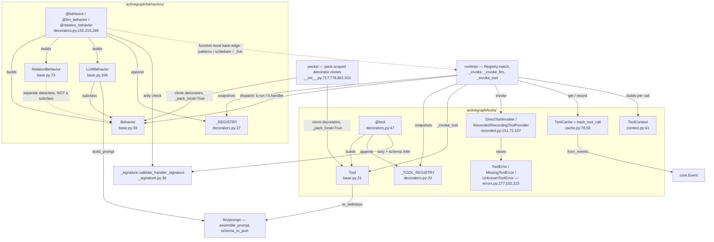
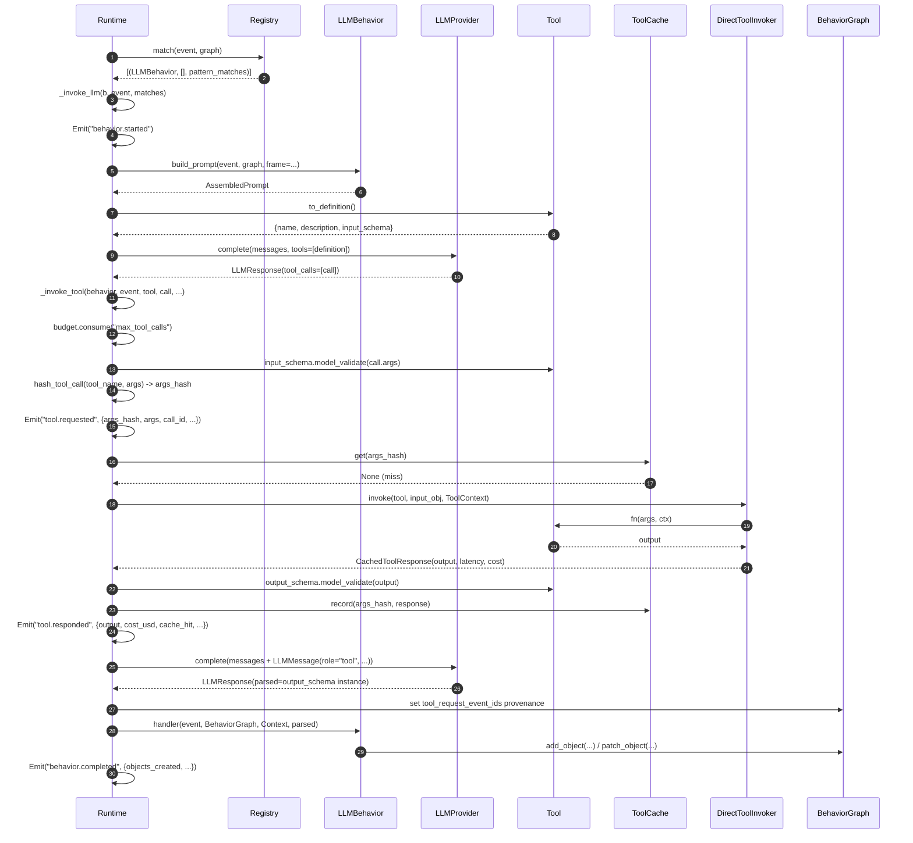

# Tools & Behaviors

## Responsibility

`behaviors/` and `tools/` are the two **extension-point declaration** subsystems. Neither executes
anything: both are "metadata + a callable" dataclasses, plus decorators that build them and append
them to a module-level registry. `behaviors/base.py:41` states it directly — "A Behavior is data,
not magic". The runtime introspects that metadata to decide *when* to fire, and owns the entire
invocation lifecycle.

A **Behavior** is the unit of registered logic that fires in response to an `Event` and may mutate
the graph. A **Tool** is a typed, schema-validated, cost-bearing callable that only an LLM can
invoke, mid-turn, inside an `@llm_behavior`'s tool loop — `tools/base.py:1-12` calls Tool "a mirror
image of Behavior." The two subsystems are structurally near-identical by design: global registry +
`clear_*` test hook + `get_*` snapshot + explicit `Runtime(behaviors=/tools=)` override. Both also
have a second, pack-scoped copy of their decorators in `packs/__init__.py` that skips global
registration.

## Component map



## Key types & entry points

### behaviors/

- `Behavior` — dataclass carrying `name`, `fn`, `on`, `where`, `view_spec`, `creates`, `budget`,
  `priority`, `pattern`, `pattern_matcher`, `activate_after` — `behaviors/base.py:39-70`
- `Behavior.run(event, graph, ctx)` — the invocation shim; just `self.fn(event, graph, ctx)` —
  `behaviors/base.py:69-70`
- `RelationBehavior` — **not** a subclass of `Behavior`; adds `relation_type`; 4-arg
  `run(relation, event, graph, ctx)` — `behaviors/base.py:73-103`
- `LLMBehavior(Behavior)` — adds `handler`, `description`, `model`, `output_schema`,
  `deterministic`, `max_tokens`, `temperature`, `top_p`, `timeout_seconds`, `prompt_template`,
  `tools`, `max_tool_turns` — `behaviors/base.py:106-137`
- `LLMBehavior.build_prompt(event, graph, *, frame=None, structured_output_mode="prompt") -> AssembledPrompt`
  — public, pure, no I/O; the only outbound call from `behaviors/` into `llm/` —
  `behaviors/base.py:139-193`
- `_llm_behavior_fn_placeholder` — poison pill assigned to `LLMBehavior.fn`; raises `RuntimeError`
  if `.run()` is ever called on an LLM behavior — `behaviors/base.py:29-36`
- `@behavior`, `@llm_behavior`, `@relation_behavior` — `behaviors/decorators.py:152`, `:215`, `:348`
- `_REGISTRY: list[Behavior | RelationBehavior]` — module-global — `behaviors/decorators.py:27`
- `register(obj)` / `get_registry()` / `clear_registry()` — `behaviors/decorators.py:109`, `:96`, `:78`
- `_validate_output_schema(output_schema)` — strict Pydantic-`BaseModel`-subclass check at
  decoration time; raises `TypeError` — `behaviors/decorators.py:30-75`

### tools/

- `Tool` — dataclass carrying `name`, `fn`, `description`, `input_schema`, `output_schema`,
  `cost_per_call: Decimal`, `timeout_seconds`, `deterministic` — `tools/base.py:21-50`
- `Tool.to_definition() -> dict` — provider-facing `{name, description, input_schema}`; the outbound
  call into `llm/prompt.schema_to_json` — `tools/base.py:52-69`
- `ToolContext` — `behavior_name`, `event_id`, `frame`, `idempotency_key`, `timeout_seconds`,
  `logger`, `external_io_mode` — `tools/context.py:41-67`
- `@tool` + `_TOOL_REGISTRY` + `get_tool_registry()` / `clear_tool_registry()` —
  `tools/decorators.py:47`, `:20`, `:36`, `:23`
- `ToolCache` — content-keyed replay cache; `get` / `has` / `record` / `from_events` —
  `tools/cache.py:76-151`
- `hash_tool_call(*, tool_name, args) -> str` — `sha256(canonical_json({tool, args}))` —
  `tools/cache.py:56-59`; `canonicalize_args` — `tools/cache.py:34-53`
- `CachedToolResponse` — `output`, `error`, `latency_seconds`, `cost_usd`, `cache_hit`,
  `requesting_event_id` — `tools/cache.py:62-73`
- `DirectToolInvoker` / `RecordedToolProvider` / `RecordingToolProvider` — three implementations of
  one `invoke(tool, args, ctx) -> CachedToolResponse` signature — `tools/recorded.py:151`, `:72`, `:107`
- `ToolError(reason, message, *, payload_extras=)` / `MissingToolError` / `UnknownToolError` —
  `tools/errors.py:277`, `:152`, `:215`
- `make_graph_query_tool(graph) -> Tool` — factory, deliberately **not** globally registered —
  `tools/graph_query.py:59-94`
- `web_fetch` — the one globally `@tool`-registered built-in — `tools/web_fetch.py:33-76`

### shared

- `validate_handler_signature(...)` — arity check used by all six behavior decorators and both
  `@tool` variants — `_signature.py:36-134`
- `infer_tool_input_schema(fn)` — fills `input_schema` from the first parameter's Pydantic
  annotation when omitted — `_signature.py:137-194`

## Interfaces & contracts at each seam

The complete inbound set was verified by grepping every non-self import of `activegraph.tools` /
`activegraph.behaviors`: **only `runtime/`, `packs/`, top-level `__init__.py`, and `_signature.py`**.
`sandbox/`, `sinks/`, `store/`, `cli/`, `observability/`, `trace/`, and `core/` never import either
subsystem.

### tools+behaviors <-> author code (declaration & registration)

The decorators are the only supported way to construct a `Behavior`/`Tool` for global use. They
validate eagerly at *decoration* time — arity, `output_schema` type, pattern syntax, `activate_after`
syntax, and cross-provider model compatibility all raise at the `@` line rather than at first fire.
The rationale is at `_signature.py:8-14`: a wrong-arity handler used to register fine and then fail
at runtime with the `TypeError` swallowed into a `behavior.failed` event. `register(obj)` is the
manual escape hatch for objects built by hand.

```ebnf
behavior-registration   ::= global-registration | pack-registration
global-registration     ::= decorator "(" params ")" handler-def
                            (* side effect: _REGISTRY.append(obj)
                               + validate_behavior_against_live_runtimes(obj) *)
pack-registration       ::= packs-decorator "(" params ")" handler-def
                            (* no global append; obj._pack_local = True *)
                          | "register" "(" behavior-obj ")"

decorator               ::= "@behavior" | "@llm_behavior" | "@relation_behavior"

params                  ::= common-params
                          | common-params "," llm-params
                          | "relation_type" "," common-params
common-params           ::= [ "name" ] [ "on" ":" event-type-list ]
                            [ "where" ":" payload-filter ]
                            [ "view" ":" view-spec ] [ "creates" ":" type-list ]
                            [ "budget" ":" budget-dict ] [ "priority" ":" int ]
                            [ "pattern" ":" cypher-subset ]
                            [ "activate_after" ":" ( int | "N events" ) ]
llm-params              ::= [ "description" ] [ "model" ] [ "output_schema" ":" BaseModel ]
                            [ "deterministic" ] [ "max_tokens" ] [ "temperature" ]
                            [ "top_p" ] [ "timeout_seconds" ] [ "prompt_template" ]
                            [ "tools" ":" tool-ref-list ] [ "max_tool_turns" ":" int ]
tool-ref-list           ::= "[" { Tool | tool-name-string } "]"

handler-def             ::= plain-handler | relation-handler | llm-handler
plain-handler           ::= "(" "event" "," "graph" "," "ctx" { "," extra } ")" "->" None
relation-handler        ::= "(" "relation" "," "event" "," "graph" "," "ctx" ")" "->" None
llm-handler             ::= "(" "event" "," "graph" "," "ctx" "," "llm_output" ")" "->" None
extra                   ::= param-with-default | annotated-param   (* settings injection *)

tool-registration       ::= "@tool" "(" tool-params ")" tool-fn-def
                            (* side effect: _TOOL_REGISTRY.append(t) *)
                          | "packs.tool" "(" tool-params [ "," "export_globally" ] ")" tool-fn-def
                            (* no global append; t._pack_local = True *)
                          | "make_graph_query_tool" "(" graph ")" -> Tool
                            (* factory; NEVER registered globally *)
tool-params             ::= [ "name" ] [ "description" ] [ "input_schema" ":" BaseModel ]
                            [ "output_schema" ":" BaseModel ] [ "cost_per_call" ":" Decimal ]
                            [ "timeout_seconds" ":" float ] [ "deterministic" ":" bool ]
tool-fn-def             ::= "(" "args" "," "ctx" { "," param-with-default } ")" "->" OutputSchema
                            (* extras MUST have defaults — allow_annotated_extras=False *)
input-schema-resolution ::= explicit-input_schema
                          | infer_tool_input_schema(fn)   (* 1st param annotation *)
                          | None                          (* -> empty JSON schema *)

registration-error      ::= TypeError(arity)          (* _signature.py:93 *)
                          | TypeError(output_schema)  (* behaviors/decorators.py:60 *)
                          | InvalidRuntimeConfiguration(model)  (* runtime/_live.py:111 *)
                          | PackValidationError(not-pack-local) (* packs/__init__.py:622 *)
```

Contract notes:

- **Arity is checked at decoration time, not first invocation.** `@behavior` → `(event, graph, ctx)`,
  `@llm_behavior` → `(event, graph, ctx, llm_output)`, `@relation_behavior` →
  `(relation, event, graph, ctx)`. Wrong arity raises `TypeError` with a worked example —
  `behaviors/decorators.py:190-195`, `:305-310`, `:381-386`; `_signature.py:87-104`.
- `validate_handler_signature` checks positional **arity only**, not names; `*args` satisfies any
  arity; uninspectable callables pass through — `_signature.py:36-134`. Behaviors pass
  `allow_annotated_extras=True` (for pack settings injection); tools pass `False`, so tool extras
  must carry defaults — `_signature.py:197-204`.
- **`output_schema=` must be a Pydantic `BaseModel` subclass or `None`** — `TypeError` at the
  `@llm_behavior` line otherwise — `behaviors/decorators.py:30-75`, called at `:299`.
- **`register()` type-checks** its argument: `TypeError` for anything that is not a `Behavior` or
  `RelationBehavior` — `behaviors/decorators.py:136-142`.
- **`get_registry()` / `get_tool_registry()` return shallow copies**, so a `Runtime` that already
  snapshotted the registry is immune to later registrations — `behaviors/decorators.py:106`,
  `tools/decorators.py:44`.
- **`activegraph/__init__.py` re-exports the full behavior surface** (`Behavior`, `LLMBehavior`,
  `RelationBehavior`, `behavior`, `clear_registry`, `get_registry`, `llm_behavior`, `register`,
  `relation_behavior` — `__init__.py:6-14`) but only **8 of the 13** names in
  `tools/__init__.py:50-64` (`__init__.py:99-109`). `ToolCache`, `RecordedToolProvider`,
  `RecordingToolProvider`, `make_graph_query_tool`, and `web_fetch` are reachable only via
  `activegraph.tools`.

### behaviors <-> runtime (dispatch + invocation, and a registration-time back-edge)

`runtime/` owns the entire invocation lifecycle; `behaviors/` supplies only metadata and a callable.
`Registry.match` reads `b.on`, `b.pattern_matcher`, `b.where`, and `b.relation_type` and returns
triples in registration order (`runtime/registry.py:40-70`); `Runtime` then fans out by concrete type.
`priority` is reserved metadata and is never a sort key: unequal values and ties both preserve this
registration order across plain, LLM, relation, global/pack, status, and same-tick delayed paths
(CONTRACT #10).
The edge is bidirectional: the decorators call back into `runtime.patterns`, `runtime.scheduler`, and
`runtime._live` at decoration time. All four back-edges are **function-local imports**, so there is
no load-time cycle — `behaviors/decorators.py:176-177`, `:184`, `:148-149`; `behaviors/base.py:155-161`.

```ebnf
dispatch          ::= Registry.match(event, graph) -> { triple }
triple            ::= "(" behavior "," relation-list "," pattern-match-list ")"
match-predicate   ::= [ event.type ∈ behavior.on ]
                      ∧ [ behavior.pattern_matcher.matches(event, graph) ≠ ∅ ]
                      ∧ [ evaluate_where(behavior.where, event.payload) ]
                      ∧ [ ¬behavior.on ⇒ ¬is_lifecycle(event) ]

invocation        ::= scheduled | immediate
scheduled         ::= Emit("behavior.scheduled") ";" push-delayed-exact-identity
                      (* fires at tick + activate_after; current relation/pattern,
                         original-event where, one pattern marker before fan-out *)
immediate         ::= Emit("behavior.started")
                      ";" handler-call
                      ";" ( Emit("behavior.completed") | Emit("behavior.failed") )
                      ";" [ Emit("context.read") ]

handler-call      ::= b.run(event, BehaviorGraph, Context)
                    | b.run(relation, event, BehaviorGraph, Context)
                    | b.handler(event, BehaviorGraph, Context, parsed-output)

Context           ::= { view, frame, policy, random, clock, llm_provider?, matches,
                        settings, _runtime, _behavior_name, _event_id }
                      (* NO tool-invocation method *)
BehaviorGraph     ::= { add_object, add_relation, patch_object, propose_patch, emit,
                        get_object, get_relation }
                      (* auto-stamps actor, caused_by, frame_id,
                         llm_request_event_id, tool_request_event_ids *)

outcome           ::= None            (* return value is ignored *)
side-effects      ::= { Object | Relation | Patch | Proposal | Event }
failure           ::= Emit("behavior.failed", { behavior, event_id, reason?,
                                                error_type, message })
                      (* ReplayDivergenceError alone propagates *)

back-edge         ::= runtime.patterns.parse(pattern).compile()
                    | runtime.scheduler.parse_activate_after(activate_after) -> int
                    | runtime._live.validate_behavior_against_live_runtimes(obj)
                    | runtime.view_builder.build_view(behavior, event, graph) -> View
```

Contract notes:

- Dispatch fan-out is by concrete type — `runtime/runtime.py:1288-1296`: `RelationBehavior` →
  `_invoke_relation(b, r, event, matches)` once **per matching relation**
  (`runtime/runtime.py:2516-2562`); `LLMBehavior` → `_invoke_llm` (`:1481`); plain `Behavior` →
  `_invoke` (`:1389`). `activate_after is not None` short-circuits to `_schedule(...)` and a
  `behavior.scheduled` event — `:1279-1281`, `:1302-1328`.
- Call sites into user code: `b.run(event, bgraph, ctx)` — `runtime/runtime.py:1435`;
  `b.run(relation, event, bgraph, ctx)` — `:2562`; `b.handler(event, bgraph, ctx, response.parsed)`
  — `:2068`. For LLM behaviors it is **`handler`, not `fn`** — `fn` is the poison-pill placeholder.
- **`LLMBehavior.fn` must never be called.** It raises `RuntimeError("… This is a bug.")` —
  `behaviors/base.py:29-36`, assigned at `behaviors/decorators.py:313`.
- **Return values are ignored.** Every handler signature is `-> None` and the runtime never reads a
  return — `runtime/runtime.py:1435`, `:2068`, `:2562`.
- **A behavior's only legal graph mutations go through `BehaviorGraph`**, not the raw `Graph`.
  Allowed: `add_object`, `add_relation`, `patch_object`, `propose_patch`, `emit`; reads:
  `get_object`, `get_relation` — `runtime/behavior_graph.py:1-8`. The wrapper auto-stamps
  `actor` / `caused_by` / `frame_id` and (for LLM behaviors) `llm_request_event_id` +
  `tool_request_event_ids` into provenance — `behavior_graph.py:51-62`, `:71-139`. Iteration goes
  through `ctx.view`, not the wrapper — `behavior_graph.py:155`. All five mutation counters are
  reported in the `behavior.completed` payload — `runtime/runtime.py:1465-1476`.
- **A behavior may NOT call a tool.** `Context` (`runtime/runtime.py:158-239`) exposes `view`,
  `frame`, `policy`, `random`, `clock`, `llm_provider`, `matches`, `settings`, plus
  `pack_settings()`, `propose_object()`, `embed()` — there is no tool-invocation method anywhere on
  it. Tools are reachable only from the LLM tool loop in `_invoke_llm_body` —
  `runtime/runtime.py:1942-2006`.
- **`ctx.llm_provider` is set only for LLM behaviors** — `runtime/runtime.py:1529`; plain and
  relation behaviors get the field's `None` default — `:1404-1415`, `:2538-2549`. This is
  compatibility exposure, not a raw generation API: handlers must not call `complete()` directly.
  Recorded generation goes through `@llm_behavior`, and embeddings through `ctx.embed`, so events,
  cache, budgets, retry, tools, provenance, and replay remain Runtime-owned.
- **A behavior exception never propagates.** `_invoke` catches everything except
  `ReplayDivergenceError` and emits `behavior.failed` — `runtime/runtime.py:1436-1458`; same in
  `_invoke_relation` (`:2563-2572`) and around the LLM handler (`:2069-2079`).
- **Pattern-only behaviors (empty `on=`) skip lifecycle events**, so a pattern cannot fire on
  `behavior.*` / `llm.*` / `tool.*` / `embedding.*` / `dev.*` / `runtime.*` —
  `runtime/registry.py:55-56`, `:73-82`.
- **`activate_after` re-checks `where=` AND the pattern at fire time**, and skips silently if either
  no longer holds — `runtime/runtime.py:1344-1357`.
- **Cross-provider model validation fires at registration** — both at `Runtime(...)` construction
  and at `register()` / `@llm_behavior` decoration — raising `InvalidRuntimeConfiguration`;
  unrecognized model names pass silently — `runtime/_live.py:59-148`, `:99-100`.
- `runtime/view_builder.py:16-19` `build_view(behavior, event, graph) -> View` reads
  `behavior.view_spec` — the metadata→`ctx.view` seam.

### tools <-> runtime (registry assembly + invocation)

`Runtime` assembles a name→`Tool` map at `_ensure_registry` and is the only caller of `_invoke_tool`.
Every tool invocation is driven by an LLM `tool_call` inside an `@llm_behavior`'s turn loop; the
runtime gates budget, checks declaration, validates input, emits the event pair, consults the cache,
calls the invoker, validates output, and echoes the result back to the model. Imports are at
`runtime/runtime.py:127-144`; constructor knobs `tools=`, `replay_tool_cache=`, `tool_cache=`,
`tool_invoker=` at `:351-355`, defaulting to `ToolCache()` and `DirectToolInvoker()` at `:439-442`.

```ebnf
registry-assembly ::= ( explicit-tools | get_tool_registry() )
                      ";" merge(_pack_tools)
                      ";" merge({ t | t ∈ LLMBehavior.tools, t : Tool })
                      ";" ∀ name ∈ LLMBehavior.tools : resolve(name) ∨ raise MissingToolError
registry-error    ::= InvalidToolRegistration(non-Tool entry)

turn-loop        ::= { turn }                    (* at most max_tool_turns *)
turn             ::= llm-request ";" llm-response ";"
                     ( final-response | { tool-invocation } )
llm-request      ::= provider.complete(messages, tools = [ Tool.to_definition() ])
tool-definition  ::= "{" "name" "," "description" "," "input_schema" "}"

tool-invocation  ::= budget-gate
                     ";" declaration-gate
                     ";" input-validation
                     ";" Emit("tool.requested", req-payload)
                     ";" ( cache-hit | invoker-call )
                     ";" output-validation
                     ";" Emit("tool.responded", resp-payload)
                     ";" append-tool-message

budget-gate      ::= budget.consume("max_tool_calls")
                     ∧ [ used < max_tool_calls ]
                     ∧ [ ¬cache-hit ⇒ cost_remaining(tool.cost_per_call) ]
declaration-gate ::= call.name ∈ { t.name | t ∈ behavior.tools }
input-validation ::= tool.input_schema.model_validate(call.args)
invoker-call     ::= invoker.invoke(Tool, args, ToolContext) -> CachedToolResponse
invoker          ::= DirectToolInvoker | RecordedToolProvider | RecordingToolProvider

ToolContext      ::= "{" behavior_name, event_id, frame, idempotency_key,
                       timeout_seconds, logger, external_io_mode "}"
external_io_mode ::= "forbid" | "runtime_recorded" | "live_unrecorded"

args-hash        ::= sha256(json(sort_keys, "{" tool: name, args: canonical "}"))
req-payload      ::= "{" behavior, tool, args_hash, args, call_id, cache_hit,
                       deterministic "}"
resp-payload     ::= "{" behavior, tool, args_hash, output, error, cache_hit,
                       latency_seconds, cost_usd, deterministic "}"

tool-outcome     ::= Ok(output_json) | Err(tool-error)
tool-error       ::= "{" reason, message, ...payload_extras "}"
reason           ::= "tool.timeout"      | "tool.network_error"
                   | "tool.invalid_input" | "tool.invalid_output"
                   | "tool.execution_error" | "tool.fixture_missing"
                   | "tool.unknown_tool"  | "tool.max_turns_exhausted"
                   | "tool.unrecorded_external_io"
                   | "budget.tool_calls_exhausted" | "budget.cost_exhausted"

tool-message     ::= LLMMessage(role="tool", content=json(output),
                                tool_use_id=call.id, tool_name=tool.name)
loop-exit        ::= final-response(parsed) -> handler(event, graph, ctx, parsed)
                   | Emit("behavior.failed", reason)
```

Contract notes:

- **Registry merge order** — explicit `tools=` **or** `get_tool_registry()`, then `_pack_tools`, then
  any `Tool` objects embedded in `LLMBehavior.tools` — `runtime/runtime.py:984-1029`. Non-`Tool`
  entries raise `InvalidToolRegistration` (`:1007-1011`); `export_globally` tools get a second
  short-name key (`:1015-1018`).
- **A declared-but-unregistered tool fails at registration, not first call** — `MissingToolError`,
  `runtime/runtime.py:1019-1029`, `tools/errors.py:152-212`. Rationale: "a misconfiguration fails
  before any LLM call burns budget."
- **An LLM may only call tools the behavior declared.** Undeclared → `UnknownToolError` →
  `behavior.failed reason="tool.unknown_tool"` — `runtime/runtime.py:1966-1986`. Reason at
  `tools/errors.py:258-264`: an undeclared tool could perform side effects the audit trail does not
  account for, breaking replay determinism.
- **Calling convention is exactly `fn(args, ctx)`**, enforced at decoration with
  `allow_annotated_extras=False` — `tools/decorators.py:84-89`.
- **Input is validated before invocation, output after** —
  `tool.input_schema.model_validate(call.args)` (`runtime/runtime.py:2120-2121`) and
  `tool.output_schema.model_validate(tool_response.output)` (`:2247-2249`). On success the validated
  model is re-dumped to `mode="json"` before it lands in the event (`:2250-2255`), so
  `tool.responded.output` is always JSON, never a Pydantic instance.
- **Every invocation is a `tool.requested` / `tool.responded` pair, always** — even a schema-invalid
  input emits both before failing, "so the trace is complete" — `runtime/runtime.py:2125-2154`.
  `tool.responded.caused_by` is the `tool.requested` id; `tool.requested.caused_by` is the
  `llm.requested` id.
- **`ToolContext` deliberately has no graph reference.** Graph-touching tools must close over a
  `Graph` at registration via a factory — `tools/context.py:24-28`, `tools/graph_query.py:59-68`;
  stated reason: such tools "should be obvious (named, constructed deliberately) rather than every
  tool having ambient graph access." Correspondingly, `make_graph_query_tool` is **not** pushed into
  the global registry — a global entry would silently bind all runtimes to whichever graph
  constructed it first — `tools/graph_query.py:62-68`.
- **`external_io_mode` gates unrecorded network I/O.** Default `"forbid"` (`tools/context.py:65-67`);
  runtime dispatch supplies `"runtime_recorded"` (`runtime/runtime.py:2211`); a direct call must opt
  into `"live_unrecorded"`. `web_fetch` raises `ToolError("tool.unrecorded_external_io", …)`
  otherwise — `tools/web_fetch.py:43-49`.
- **`timeout_seconds` is advisory** — "tools may enforce via signal/select; the runtime does NOT
  forcibly preempt" — `tools/context.py:16-18`, `:47-50`. `DirectToolInvoker` measures latency but
  does not enforce a deadline — `tools/recorded.py:157-199`.
- **`idempotency_key` is a fresh `uuid4` per call and is never used by the runtime for dedupe** —
  dedupe is the cache's job — `tools/context.py:11-15`, `runtime/runtime.py:2208`.
- **Budget: `max_tool_calls` is consumed BEFORE the call** (`runtime/runtime.py:2115`), and the
  counter is checked before the cost gate so an exhausted call-count wins (`:1944-1954`). Cost is
  charged only on a cache miss (`:2172-2183`, `:2243`); tools and LLM share the same `max_cost_usd`.
- **`DirectToolInvoker` re-raises `ToolError` unchanged and wraps every other exception** as
  `ToolError("tool.execution_error", …)` — `tools/recorded.py:169-181`. Schema errors are explicitly
  not its job (`:165-167`).
- **A tool failure ends the whole behavior**, not just the turn: `_invoke_tool` returns `None` and
  the loop breaks after `behavior.failed` — `runtime/runtime.py:1996-1999`, `:2097-2321`.
- **The handler never sees raw tool calls** — only the final parsed structured output —
  `behaviors/base.py:116-118`, `runtime/runtime.py:2068`. Tool provenance is stamped into everything
  the handler creates: the list of `tool.requested` ids is pushed onto the `BehaviorGraph` before the
  handler runs — `runtime/runtime.py:2066`, `runtime/behavior_graph.py:55-62`.

Error taxonomy:

| reason | raised at | prose |
|---|---|---|
| `tool.timeout` | tool body (e.g. `tools/web_fetch.py:70-75`) | `tools/errors.py:31-44` |
| `tool.network_error` | tool body (`tools/web_fetch.py:64-69`) | `tools/errors.py:47-59` |
| `tool.invalid_input` | runtime, pre-invoke (`runtime/runtime.py:2140`, `:2157`) | `tools/errors.py:62-75` |
| `tool.invalid_output` | runtime, post-invoke (`runtime/runtime.py:2264`, `:2276`) | `tools/errors.py:78-89` |
| `tool.execution_error` | `DirectToolInvoker` (`tools/recorded.py:174`) | `tools/errors.py:92-106` |
| `tool.fixture_missing` | `RecordedToolProvider` (`tools/recorded.py:87`) | `tools/errors.py:109-124` |
| `tool.unknown_tool` | runtime (`runtime/runtime.py:1587`, `:1984`) | fallback prose |
| `tool.max_turns_exhausted` | runtime (`runtime/runtime.py:2019`) | fallback prose |
| `tool.unrecorded_external_io` | `web_fetch` (`tools/web_fetch.py:44`) | fallback prose |
| `budget.tool_calls_exhausted` | runtime (`runtime/runtime.py:1953`) | n/a |
| `budget.cost_exhausted` | runtime (`runtime/runtime.py:1960`, `:2177`) | n/a |

Any unrecognized reason falls through to `_tool_fallback_prose` — `tools/errors.py:137-149`,
dispatched at `:304-308`. `_REASON_PREFIX_TO_DOC_SLUG` maps the `tool.` prefix to the `tool-error`
doc page for the WARNING log's `More:` URL — `runtime/runtime.py:291-296`.

### tools <-> core (event log & replay cache)

`tools/cache.py:31` imports `Event` at module level — the only hard `core` dependency in either
subsystem. `ToolCache.from_events` rebuilds the cache purely from the event log: it walks
`tool.responded` events, follows `caused_by` back to the matching `tool.requested`, and harvests
`payload["args_hash"]` as the key — `tools/cache.py:122-151`. Hydration happens at
`Runtime.load(replay_tool_cache=True)` (`runtime/runtime.py:3327-3328`) and `runtime.fork(...)`
(`:3511-3513`).

```ebnf
cache-hydration   ::= ToolCache.from_events(events)
harvest-rule      ::= ∀ e : e.type = "tool.responded"
                        ∧ ∃ req = by_id[e.caused_by]
                        ∧ req.type = "tool.requested"
                        ∧ req.payload.args_hash ≠ ∅
                      ⇒ record(args_hash, CachedToolResponse(e.payload))
cache-lookup      ::= [ replay_tool_cache ] ∧ cache.get(args_hash)
reinvoke-override ::= replay_reinvoke_deterministic ∧ tool.deterministic
                      ⇒ discard-cache-entry, re-invoke
fixture-path      ::= fixtures_dir "/" tool.name "/" args_hash ".json"
fixture           ::= "{" tool, args_hash, recorded_at, args, output, error,
                        latency_seconds, cost_usd "}"
                      (* recorded_at is OUTSIDE the hash *)
```

Contract notes:

- **The cache key excludes everything but `(tool_name, args)`** — `tools/cache.py:56-59`. In fixtures,
  `recorded_at` sits outside the hash — `tools/recorded.py:4-5`, `:136-145`.
- **Replay serves from cache for ALL tools by default**, deterministic or not. Only
  `Runtime(replay_reinvoke_deterministic=True)` lets a `deterministic=True` tool re-invoke —
  `tools/cache.py:16-20`, `runtime/runtime.py:2164-2169`. Rationale at `tools/graph_query.py:14-22`:
  even a deterministic tool's correctness depends on the reconstructed graph state matching the
  recorded state, and the runtime cannot cheaply verify that.
- `tools/` never imports `core.Graph`. `make_graph_query_tool(graph)` takes an **unannotated** `graph`
  and calls `graph.objects(type=..., where=...)` — `tools/graph_query.py:59`, `:71`. The coupling is
  structural (duck-typed) only.

### tools+behaviors -> llm

Two calls, both function-local imports, both pure:

```ebnf
prompt-assembly ::= LLMBehavior.build_prompt(event, graph, frame?, structured_output_mode?)
                    -> assemble_prompt(...) -> AssembledPrompt
                    (* no I/O, no provider contact *)
model-fallback  ::= [ behavior.model = None ] ⇒ "claude-sonnet-4-5"
                    (* inspection-time hash stability only *)
schema-render   ::= Tool.to_definition() -> schema_to_json(input_schema)
```

Contract notes:

- `build_prompt` is documented pure and cheap — no I/O, no provider — `behaviors/base.py:147-152`;
  the `assemble_prompt` call is at `:154`, `:176-193`. When `model is None` it substitutes
  `"claude-sonnet-4-5"` for hash stability rather than reaching a provider — `behaviors/base.py:169-175`.
- `Tool.to_definition()` calls `activegraph.llm.prompt.schema_to_json` — `tools/base.py:59-68`.

### behaviors -> core (types only)

`behaviors/base.py:21-26` imports `Event`, `Graph`, `Relation`, `Frame`, `AssembledPrompt`, and
`Context` under `TYPE_CHECKING` only. `behaviors/` has **zero runtime dependency on `core/`**.

### tools+behaviors <-> packs

`packs/__init__.py:59-65` imports `Behavior`, `LLMBehavior`, `RelationBehavior`, and `Tool`, then
defines **pack-scoped clones** of all four decorators (`packs/__init__.py:717`, `:778`, `:861`,
`:921`). The header comment at `:707-714` states the only difference is that `_REGISTRY.append(...)`
is skipped. Each object gets `_pack_local = True` and a `fn.__pack_meta__` dict;
`Pack.__post_init__` refuses any behavior or tool lacking `_pack_local is True`, naming the global
decorator as the likely mistake — `packs/__init__.py:613-636`.

```ebnf
pack-load        ::= collision-check ";" rename-all ";" merge-into-runtime
rename-behavior  ::= Behavior{name} -> Behavior{name = pack "." name,
                                                fn = inject_settings(fn),
                                                tools = canonicalize(tools)}
rename-tool      ::= Tool{name} -> Tool{name = pack "." name,
                                        _short_name = name,
                                        _export_globally}
registry-keys    ::= { pack "." name } ∪ { name | export_globally }
merge-target     ::= rt._pack_behaviors | rt._pack_tools
                     (* merged in Runtime._ensure_registry *)
pack-guard       ::= _pack_local is True, else PackValidationError
```

Contract notes:

- `load_pack` renames every pack behavior and tool to `{pack}.{name}` (`_rename_behavior`
  `packs/loader.py:609-687`, `_rename_tool` `:739-754`, stamping `_short_name` / `_export_globally`),
  wraps behavior `fn`s with typed-settings keyword injection (`_wrap_with_injection` `:757+`),
  rewrites `LLMBehavior.tools` refs to canonical strings (`_resolve_pack_tool_refs` `:720-736`), and
  appends into `rt._pack_behaviors` / `rt._pack_tools` (`:269`, `:291`).
- **Pack tools are pack-scoped by default**; `export_globally=True` opts into a second short-name
  registry key — `packs/__init__.py:930-936`, `runtime/runtime.py:1015-1018`.

## Sequence: an `@llm_behavior` fires, calls a tool, and its handler mutates the graph



Message sources: `runtime/registry.py:40-70`; `runtime/runtime.py:1288-1296`, `:1481`, `:1942-2006`,
`:2066`, `:2068`, `:2097-2321`, `:2115`, `:2120-2121`, `:2125-2154`, `:2214`, `:2247-2255`,
`:2315-2320`, `:1465-1476`; `behaviors/base.py:139-193`; `tools/base.py:52-69`;
`tools/cache.py:56-59`, `:76-151`; `tools/recorded.py:157-199`; `runtime/behavior_graph.py:55-62`.

## Open questions

1. **`activegraph_tools_*` metrics are declared but never emitted.** `observability/metrics.py:140-163`
   declares `activegraph_tools_calls_total`, `_cache_hits_total`, `_failed_total`,
   `_duration_seconds`. A repo-wide grep finds no increment/observe call anywhere — contrast with
   behaviors, which are instrumented (`runtime/runtime.py:1420-1422`, `:1439-1447`, `:1460-1464`).
   Tool observability is a declared-but-unwired gap.

2. **`tool.failed` is a phantom event type.** `observability/metrics.py:156` describes
   `activegraph_tools_failed_total` as counting "tool calls that produced a `tool.failed` event", but
   no such event type exists — failures ride on `tool.responded.payload.error` plus `behavior.failed`.

3. **Two reason codes are outside the documented `ToolError` set.** `tools/errors.py:280-285` lists
   nine legal reasons; `tool.max_turns_exhausted` (`runtime/runtime.py:2019`) and
   `tool.unrecorded_external_io` (`tools/web_fetch.py:44`) are not among them and have no entry in
   `_TOOL_REASON_PROSE` (`tools/errors.py:127-134`), so both fall through to generic fallback prose.
   Reads as docstring drift rather than a bug, but should be reconciled.

4. **Dead comment block in `_invoke_tool`.** `runtime/runtime.py:2302-2314` contains in-progress
   refactor narration ("Refactor: pass running_messages by reference…") plus an unused local
   `running_messages_append = getattr(self, "_current_running_messages", None)` and an unused
   `import json as _json` alias. The stash-on-`self` mechanism (`self._last_tool_result_message`,
   `:470`, `:2315`, consumed at `:2004-2006`) works but is not re-entrant.

5. **`priority` is deliberately reserved metadata.** `Behavior.priority` /
   `RelationBehavior.priority` retain the caller's value, while `Registry.match`
   (`runtime/registry.py:40-70`) and the delayed queue preserve registration/FIFO order. Runtime
   does not sort unequal values or ties, and status exposes registration order. Activating priority
   would require a separate contract amendment.

6. **Resolved: `relation_behavior` + `activate_after` executes at fire time.** Runtime reuses the
   shared one-behavior matcher for current relation candidates/pattern bindings, keeps `where=` on
   the original event payload, validates exact behavior identity/name, emits one pattern marker,
   and fans out through the normal relation lifecycle. Pack disable cancels exact pending wrappers;
   due-entry suffixes are FIFO-resumable before start, while started relation fan-out has no cursor.

7. **`ctx.llm_provider` is deliberately LLM-invocation-only.** It is the exact configured provider
   for `@llm_behavior` and `None` for plain/relation contexts. The identity is characterized for
   compatibility, but direct `complete()` calls remain unsupported because they bypass the
   Runtime-owned LLM event, cache, budget, retry, tool, provenance, and replay path. The supported
   alternatives are `@llm_behavior` for generation and `ctx.embed()` for embeddings.

8. **`_resolve_pack_tool_refs` cannot rename in place.** `packs/loader.py:727-733` substitutes a
   *string* `"{pack}.{tool}"` for a pack-local `Tool` object in an `LLMBehavior.tools` list, with a
   comment acknowledging it cannot rename the object. Consequence: after `load_pack`, `b.tools` is a
   mixed list of `Tool` objects and strings — handled at `runtime/runtime.py:1579-1591` and
   `:1022-1023`, but it makes `LLMBehavior.tools` a heterogeneous type in practice.

9. **Duplicated decorator implementations, already drifting.** `behaviors/decorators.py` and
   `packs/__init__.py:717-979` are near-verbatim copies differing only in the registry append and the
   `_pack_local` stamp. Observed drift: `packs.llm_behavior` defaults `model="claude-sonnet-4-5"`
   (`packs/__init__.py:784`) while the global one defaults `model=None` and resolves the provider
   default at registration (`behaviors/decorators.py:220`, `:251-262`); `packs.tool` defaults
   `cost_per_call="0.0"` (a string, `packs/__init__.py:927`) vs `Decimal("0")`
   (`tools/decorators.py:53`); `packs.tool` also skips the `_validate_output_schema` call the global
   `@llm_behavior` performs.

10. **`RecordedToolProvider` / `RecordingToolProvider` / `web_fetch` / `make_graph_query_tool` have
    no in-package callers.** Verified by grep across `activegraph/`. They are exported public API
    (`tools/__init__.py:50-64`) consumed by tests and docs only — reference implementations rather
    than dead code, but leaf nodes on the map.

11. **`tools/recorded.py:63-69` `_normalize_args(tool, args)` ignores its `tool` parameter** and just
    delegates to `canonicalize_args`. The docstring describes a two-branch behavior the body does not
    implement.

12. **Stale import-direction claim.** `behaviors/__init__.py:1` claims "Imports core only
    (CONTRACT #14)", but `behaviors/decorators.py` calls into `runtime.patterns`, `runtime.scheduler`,
    and `runtime._live` (function-local imports at `:176-177`, `:148`, `:341`), and
    `behaviors/base.py:154-159` calls into `llm.prompt` and `runtime.view_builder`. The lazy imports
    avoid a load-time cycle, but the real edge set is `behaviors -> {core (types only), llm, runtime}`.
