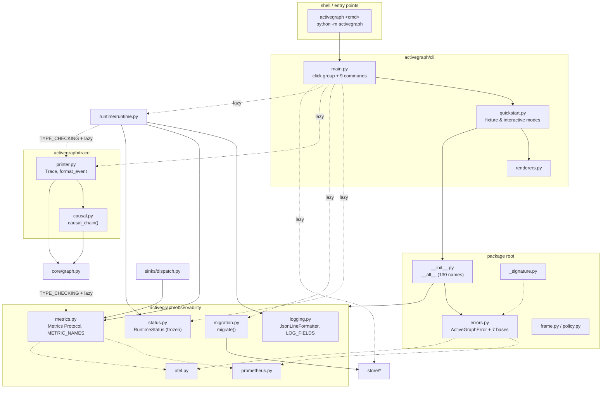

# Observability, Trace, CLI & Package Root

Four cross-cutting areas that sit at the outer edges of `activegraph`: the operator-facing
instrumentation surface (`activegraph/observability/`), the audit-rendering surface
(`activegraph/trace/`), the shell surface (`activegraph/cli/`), and the package root files
that define the public API and the error taxonomy everything else inherits from.

---

## Responsibility

**`observability/`** is the *operator-facing* surface: structured logging, a three-method
metrics protocol with two optional backends, a frozen runtime-introspection snapshot, and a
store-to-store migration tool. Every pillar is opt-in and the framework never auto-configures
any of them — "a library that does is hostile to operators who already have their own config"
(`observability/__init__.py:14-15`, `observability/logging.py:5-7`). Its modules deliberately
sit at the bottom of the dependency graph: `logging.py`, `metrics.py`, `status.py`, `otel.py`
and `prometheus.py` have **zero** activegraph imports at module scope, so `core` and `runtime`
can import them without a cycle.

**`trace/`** is the *audit* surface: a read-only facade over a run's event log that renders the
locked CONTRACT #18 line format, plus a causal-chain walker that reconstructs an object's full
lineage back to the goal that started the run (`trace/printer.py:1`, `trace/causal.py:1-11`).
The rendered format *is* the contract — it is snapshot-tested and consumed by the quickstart
transcript.

**`cli/`** is a *thin argument-parsing and formatting shell* over library APIs — "The CLI does
no business logic — it parses arguments, calls into Python, and formats output. Programmatic
users get the same behavior by importing the called functions directly" (`cli/main.py:6-8`,
`cli/__init__.py:3-5`). Every library import is lazy, inside a command body.

**Package root** holds the public API re-export surface (`__init__.py`, 130 names), the root
error taxonomy every other error module subclasses (`errors.py`), and three small
value/validation modules (`frame.py`, `policy.py`, `_signature.py`).

---

## Component map



Dotted edges are lazy / `TYPE_CHECKING`-only imports — that is what keeps `core ↔ observability`
and `runtime ↔ trace` acyclic by construction rather than by accident (`core/graph.py:39`,
`:386`; `runtime/runtime.py:138`, `:3125`).

---

## Key types & entry points

### observability/

- `configure_logging(level, *, json_output, stream, payload_redactor) -> logging.Logger` — installs a JSON-line handler on the `activegraph` logger; idempotent (replaces its own handler, never stacks) — `observability/logging.py:169-209`
- `get_logger(name="activegraph") -> logging.Logger` — namespace helper; `get_logger("runtime")` → `logging.getLogger("activegraph.runtime")` — `observability/logging.py:137-145`
- `runtime_log_extra(**fields) -> dict` — builds an `extra=` dict, dropping `None`s and renaming reserved `LogRecord` attrs to `ag_<name>` — `observability/logging.py:148-166`
- `LOG_FIELDS: tuple[str, ...]` — the 15-field operator log schema — `observability/logging.py:28-48`
- `JsonLineFormatter` — one JSON object per record; emits *only* fields in `LOG_FIELDS` — `observability/logging.py:81-117`
- `set_payload_redactor(fn)` / `redact_payload(payload)` — module-global redactor hook — `observability/logging.py:68-78`
- `Metrics` — `@runtime_checkable` Protocol; `counter`, `histogram`, `gauge` — `observability/metrics.py:27-38`
- `NoOpMetrics` — `__slots__ = ()`, three bare `return` bodies; the default everywhere — `observability/metrics.py:44-61`
- `MetricSpec(name, kind, tags, description)` frozen dataclass; `METRIC_NAMES` — the 24-entry declared operator catalog — `observability/metrics.py:71-224`
- `validate_cardinality_rule(metrics=METRIC_NAMES)` — called at **import time** (`observability/metrics.py:244`); raises `AssertionError` if a counter or histogram declares `run_id`
- `PrometheusMetrics(registry=None)` / `.available()` — lazy `prometheus_client`, per-instrument creation locks — `observability/prometheus.py:19-114`
- `OpenTelemetryMetrics(meter=None, *, meter_name="activegraph")` / `.available()` — gauges emulated via `UpDownCounter` deltas against a tracked last-value map — `observability/otel.py:20-108`
- `RuntimeState` literal — `observability/status.py:20`
- `RuntimeStatus` frozen dataclass + `BudgetSnapshot`, `FrameSnapshot`, `BehaviorInfo`, `EventSummary` — `observability/status.py:24-73`
- `status_to_dict(status) -> dict` — recursive dataclass→dict for `--json` — `observability/status.py:76-93`
- `migrate(source_url, dest_url, *, only_run_ids, on_progress, skip_corrupted) -> MigrationReport` — `observability/migration.py:76-119`
- `MigrationReport` (`.ok`, `.failures`) / `MigrationRunReport` — `observability/migration.py:34-73`
- `_StoreFacade` / `_resolve(url)` — the driver-dispatch shim migration uses to reach past `EventStore` — `observability/migration.py:126-175`

### trace/

- `Trace(graph)` — read-only facade exposed as `runtime.trace` — `trace/printer.py:516-528`
  - `.events() -> list[Event]` — copy of `graph.events` (v1.3) — `trace/printer.py:531-548`
  - `.failures() -> list[Event]` — filters `behavior.failed` — `trace/printer.py:550-564`
  - `.lines() -> list[str]` — `trace/printer.py:566-594`
  - `.print()` / `.export(path)` — `trace/printer.py:596-603`
  - `.causal_chain(object_id) -> str` — `trace/printer.py:605-608`
- `format_event(event, *, hide_prompt_normalized=False) -> str` — dispatches via the `_FORMATTERS` dict, falls back to `_fmt_event_emitted` — `trace/printer.py:398-429`
- `TAG_COL = 26` and `_format_tag(tag_text)` — the locked column layout — `trace/printer.py:24-32`
- `causal_chain(graph, object_id) -> str` — `trace/causal.py:22-107`

### cli/

- `main(argv=None) -> int` — programmatic entry; **returns** an exit code rather than raising `SystemExit`, so `CliRunner` tests work — `cli/main.py:1159-1176`
- `cli` — the `click.group` — `cli/main.py:129-132`
- `EXIT_CODES` dict / `EXIT_OK..EXIT_DIVERGENCE` constants (0–5) — `cli/main.py:38-52`
- `cmd_inspect` — `cli/main.py:204-248`; `cmd_replay` — `:507-511`; `cmd_fork` — `:542-575`; `cmd_diff` — `:821-826`; `cmd_promote` — `:872-882`; `cmd_export_trace` — `:991`; `cmd_migrate` — `:1102` (lazy `migrate` import)
- `cmd_pack` group — `cli/main.py:149-150`, with `pack new` (`:160`) and `pack list` (`:187`)
- `cmd_quickstart` — registered onto the group at `cli/main.py:141-143`; implemented in `cli/quickstart.py:449-477`
- `run_fixture_mode(stream=None) -> int` — `cli/quickstart.py:61-159`
- `run_interactive_mode(stream=None, *, prompt_fn=None) -> int` — `cli/quickstart.py:290-354`
- `company_name_for_memo(rt, memo)`, `print_memo_section(write, rt, memo)` — `cli/renderers.py:11-78`

### package root

- `activegraph/__init__.py` — 130 re-exported names in `__all__` + `__version__ = "1.10.0"` — `__init__.py:148-274`
- `ActiveGraphError` — `errors.py:58`; seven category bases at `errors.py:141` (`ConfigurationError`), `:154` (`RegistrationError`), `:162` (`ExecutionError`), `:171` (`ReplayError`), `:179` (`StorageError`), `:193` (`PatternError`), `:206` (`PackError`); `MissingOptionalDependency` — `errors.py:215`
- `DOCS_BASE_URL = "https://docs.activegraph.ai"` — the single swap point for every `More:` URL — `errors.py:43`
- `GITHUB_NEW_ISSUE_URL` (`errors.py:301`) + `internal_bug_fields(...)` (`errors.py:304-364`) — uniform framework-bug error fields
- `Frame(goal, id, constraints, success_criteria, permissions)` — mission context, **descriptive only** — `frame.py:10-24`
- `Policy(behavior, can_create, can_create_relation, can_propose, can_apply, can_call_tool, requires_approval)` — declared allowlists, **mostly unenforced in v0** — `policy.py:13-31`
- `validate_handler_signature(fn, *, expected_params, decorator, allow_annotated_extras)` — registration-time arity check; raises `TypeError` — `_signature.py:36-134`
- `infer_tool_input_schema(fn) -> type[BaseModel] | None` — v1.3 first-param annotation inference — `_signature.py:137-194`
- `__main__.py` — `python -m activegraph` → `raise SystemExit(main())` — `__main__.py:1-5`

---

## Interfaces & contracts at each seam

## A. Observability seams

### A1. runtime / core / sinks <-> observability.metrics

`Runtime.__init__` takes `metrics: Optional[Metrics] = None` and defaults to `NoOpMetrics()`
(`runtime/runtime.py:357`, `:458`); `Graph.attach_sink` does the same for the sink worker
(`core/graph.py:376`, `:410`). `sinks/dispatch.py` is the one hard (non-`TYPE_CHECKING`) importer
(`sinks/dispatch.py:17`, `:67`, `:81`). Callers emit observations inline on the hot path, so the
protocol's non-throwing guarantee is load-bearing.

```ebnf
metrics-backend      ::= NoOpMetrics | PrometheusMetrics | OpenTelemetryMetrics | <user impl>
metrics-observation  ::= counter( name , tags , value? )
                       | histogram( name , tags , value )
                       | gauge( name , tags , value )
name                 ::= standard-metric-name | <any str>      (* impls MUST tolerate unknown *)
standard-metric-name ::= "activegraph_" component "_" measure
tags                 ::= "{" { tag-key ":" tag-value } "}"
tag-key              ::= "event_type" | "behavior" | "model" | "tool"
                       | "reason" | "sink" | "operation" | "run_id"
value                ::= float
(* CONTRACT v0.8 #C4, import-time enforced: *)
constraint           ::= "run_id" ∈ tags  ⟹  kind = gauge
guarantee            ::= observation never raises ∧ thread-safe ∧ unknown-name-tolerant
```

Contract notes:

1. **Three methods only.** No timers, no summaries, no custom types. "Adding a metric is a public API change" — `observability/metrics.py:2-6`.
2. **Cardinality rule (locked, #C4)**: `run_id` MAY tag gauges (bounded by concurrent runs); MUST NOT tag counters or histograms. Enforced at **import time** — an in-tree violation raises `AssertionError` on `import activegraph` — `observability/metrics.py:229-244`.
3. Implementations MUST tolerate unknown metric names and unknown tag keys; all three methods are best-effort and non-throwing; they may be called concurrently by independent runtime and sink workers — `observability/metrics.py:30-34`.
4. `NoOpMetrics` is the default everywhere (`runtime/runtime.py:458`, `core/graph.py:410`). The runtime is fully functional with no backend.
5. Sink metric calls are *additionally* exception-swallowing at the call site via `_safe_counter`/`_safe_gauge` — `sinks/dispatch.py:543-557`. A broken backend cannot take down a sink worker.
6. `PrometheusMetrics` tag keys are **fixed by the first observation** for a given name; a later differing key set raises (prometheus_client behavior) — `observability/prometheus.py:22-26`.
7. Naming: counters end `_total`, duration histograms end `_seconds` — test-enforced, `tests/test_observability_metrics.py:87-100`.

Actual emit sites (only two modules emit at all):

| Metric | Site |
|---|---|
| `activegraph_events_emitted_total{event_type}` | `runtime/runtime.py:858` |
| `activegraph_queue_depth{}` (gauge) | `runtime/runtime.py:903` |
| `activegraph_behaviors_invoked_total{behavior}` | `runtime/runtime.py:1420` |
| `activegraph_behaviors_duration_seconds{behavior}` | `runtime/runtime.py:1439`, `:1460` |
| `activegraph_behaviors_failed_total{behavior, reason}` | `runtime/runtime.py:1444` (`reason=f"exception.{type(e).__name__}"`) |
| the four `activegraph_sink_*` metrics | `sinks/dispatch.py:520`, `:526`, `:532`, `:538` |

`METRIC_NAMES` is therefore a *declared catalog*, not a guaranteed emission set — see Open
question 1.

### A2. runtime <-> observability.logging

`runtime/runtime.py:146` imports `get_logger` and `runtime_log_extra` at module scope. There are
exactly three logging sites in the whole package: logger construction at `runtime/runtime.py:459`,
an INFO "event emitted" at `:911`, and a WARNING "behavior failed" at `:2503` carrying `doc_url`
from `_doc_url_for_reason`. The CLI calls `configure_logging(level="ERROR", json_output=False)` to
silence the framework during the demo (`cli/quickstart.py:91`, `:405`).

```ebnf
log-call     ::= logger "." level "(" message "," "extra=" runtime_log_extra( fields ) ")"
logger       ::= get_logger( dotted-suffix )        (* → "activegraph." dotted-suffix *)
level        ::= "debug" | "info" | "warning" | "error"
fields       ::= { field-name "=" ( value | None ) }
field-name   ::= "run_id" | "event_id" | "behavior" | "tool" | "model"
               | "cache_hit" | "cost_usd" | "latency_seconds" | "reason"
               | "error_type" | "error_message" | "doc_url"
log-record   ::= "{" '"timestamp"' ":" iso8601-ms "," '"level"' ":" level-name ","
                     '"logger"' ":" name "," '"message"' ":" text
                     { "," documented-field } "}"        (* one JSON object per line *)
(* invariants: None-valued fields dropped; undocumented fields dropped;
   reserved LogRecord attrs renamed to "ag_" name *)
```

Contract notes (CONTRACT v0.8 #6–#7, #16):

1. **Never auto-configure on import.** The framework attaches to `logging.getLogger("activegraph")` and lets the operator's config handle output — `observability/logging.py:5-7`.
2. **`configure_logging` is idempotent** — repeated calls remove handlers tagged `_activegraph` before adding a new one, never stacking — `observability/logging.py:192-197`.
3. **`propagate = False`** once activegraph owns a handler, so operators with a root handler don't double-print — `observability/logging.py:206-208`.
4. **Schema stability**: `JsonLineFormatter` emits *only* keys in `LOG_FIELDS`; inapplicable fields are **omitted, not nulled** — `observability/logging.py:27`, `:102-108`.
5. Reserved `LogRecord` attribute collisions are renamed `ag_<name>` rather than smashing stdlib internals — `observability/logging.py:161-164`.

### A3. Runtime -> observability.status -> `cli inspect`

`Runtime.status(recent=20)` builds a `RuntimeStatus` (`runtime/runtime.py:148`, `:2592`);
`cmd_inspect` lazily imports `status_to_dict` (`cli/main.py:265`) to render `--json`. Nothing in
the chain mutates runtime state.

```ebnf
status-request  ::= runtime.status( recent : int≥0 )   (* recent<0 ⟹ InvalidRuntimeConfiguration *)
RuntimeStatus   ::= run_id , state , queue_depth , events_processed ,
                    BudgetSnapshot , FrameSnapshot? ,
                    BehaviorInfo* , EventSummary*
state           ::= "idle" | "running" | "stopped" | "exhausted"
BudgetSnapshot  ::= used:{str→float} , limits:{str→float?} ,
                    cost_used_usd:str , cost_limit_usd:str? , exhausted_by:str?
BehaviorInfo    ::= name , kind , subscribed_to:tuple , pattern? , activate_after?
kind            ::= "function" | "relation" | "llm"
EventSummary    ::= id , type , actor? , timestamp
serialization   ::= status_to_dict( RuntimeStatus ) -> json-object   (* tuples → arrays *)
(* invariant: every field frozen; no last_error field by design *)
```

Contract notes (CONTRACT v0.8 #11):

1. **Cheap to call**: no graph traversal; outside a local drain, `status()` walks the log backwards only to the latest terminal lifecycle event. During a local drain the active-count overlay avoids that scan.
2. **All returned data is immutable** — every dataclass is `frozen=True`; collections are tuples — `observability/status.py:24-73`.
3. **There is deliberately no `last_error` field.** "Errors are events; filter `recent_events` for type `behavior.failed`… Convenience accessors that look the same as the source of truth but mean different things are bug-bait" — `observability/status.py:9-12`.
4. `recent < 0` raises `InvalidRuntimeConfiguration` rather than coercing — `runtime/runtime.py:2601-2632`.
5. `state` is log-derived while no local public drain is active: default `"stopped"`; `runtime.budget_exhausted` → `"exhausted"`; `runtime.idle` → `"idle"`. A lock-protected, non-persisted active-drain reference count temporarily takes precedence as `"running"`. Nested drains count independently and unwind in `finally`. The count lock does not make Runtime mutation thread-safe.
6. Same-instance observers may see `"running"`; freshly loaded runtimes and `activegraph inspect` remain dormant/log-derived. Live-versus-loaded equality applies outside active drains.
7. `registered_behaviors` is empty when `self.registry is None` (pre-run) — the intended operator signal, not a bug.

### A4. observability.migration -> store

`migration.py` is the only module in `observability/` with an outbound activegraph dependency at
module scope. It imports `Event` (`migration.py:26`), `EventStore`/`RunRecord` (`:27`),
`CorruptedEventPayloadError` (`:28`), `decode_event` (`:29`), and `parse_store_url` (`:30`), then
reaches *past* the `EventStore` abstraction into driver internals — `SQLiteEventStore.list_runs`
/ `_ensure_schema` (`migration.py:139-141`, `:324`), `PostgresEventStore.list_runs`,
`_ConnectionSource`, `_EVENT_COLUMNS`, `_ensure_schema` (`:142-144`, `:274`, `:373-377`) — and
opens raw `sqlite3.connect` connections (`:248`, `:326`).

```ebnf
migration       ::= migrate( source_url , dest_url ,
                             only_run_ids? , on_progress? , skip_corrupted? )
store_url       ::= "sqlite:///" path | "postgres://" host [ "/" db ]
per-run-txn     ::= BEGIN , upsert-run , { upsert-event } , COMMIT
                  | BEGIN , … , ROLLBACK                      (* on any failure *)
upsert-run      ::= INSERT runs(run_id,parent_run_id,forked_at_event_id,
                                label,created_at,goal,frame_id)
                    "ON CONFLICT(run_id) DO NOTHING"
upsert-event    ::= INSERT events(id,type,actor,payload,frame_id,
                                  caused_by,timestamp,run_id)
                    "ON CONFLICT(id,run_id) DO NOTHING"
MigrationReport ::= source_url , dest_url , MigrationRunReport+
MigrationRunReport ::= run_id , status , events_migrated , error? , skipped_events*
status          ::= "ok" | "skipped" | "failed"
report.ok       ::= ∀ r ∈ runs : r.status ≠ "failed"
(* invariants: per-run atomicity; idempotent replay; runs independent *)
```

Contract notes (CONTRACT v0.8 #5 revised, v1.0 CLI follow-on):

1. **Transaction-per-run**: each run migrates in a single destination transaction; a mid-run failure leaves that run's destination state unchanged — `observability/migration.py:1-6`, `:330-365` (sqlite `BEGIN`/`COMMIT`/`ROLLBACK`), `:382-421` (postgres).
2. **Idempotent**: `ON CONFLICT(id, run_id) DO NOTHING` — re-running after a failure writes only the delta, and `events_migrated` reports only rows actually inserted this invocation — `migration.py:354`, `:406`, `:358-359`, `:419-420`.
3. **Runs migrate independently** — a bad run does not block the others — `migration.py:7-8`, `:111-115`.
4. **One-directional and explicit.** No sync mode, no rollback, no automatic recovery — `migration.py:11-12`.
5. `MigrationReport.ok` is True when nothing **failed** — a `skipped` run (already present at destination) still counts as success — `migration.py:69`. The CLI's summary line counts only `status == "ok"` (`cli/main.py:1148`), so `skipped` runs are invisible in the printed count while still passing `report.ok`.
6. `skip_corrupted=True` produces a **partial** destination run; the operator is put on notice via `skipped_events` — `migration.py:93-96`; CLI help repeats it in caps — `cli/main.py:1077-1080`.
7. Skip-corrupted needs driver-specific raw-row iteration because "Python generators die after raising" — `iter_events()` can't be wrapped per-row — `migration.py:16-18`, `:224-231`.
8. **CLI compatibility preflight:** before calling `migrate()`, the CLI lists source runs first and destination runs second. A source `SchemaVersionMismatch` exits 4 without touching a fresh destination; a destination mismatch exits 4 before any per-run report or write. Preflighting a fresh destination eagerly creates only its current schema and metadata. This does not add cross-version reading to the library, whose direct source-raise and destination-failed-report behavior remains unchanged.

## B. Trace seams

### B1. Runtime <-> trace.printer.Trace

`Runtime.trace` is a property that lazily imports and returns `Trace(self.graph)`
(`runtime/runtime.py:3124-3127`, with the `TYPE_CHECKING` import at `:138`);
`Runtime.print_trace()` delegates to `self.trace.print()` (`:3129-3130`). The CLI imports `Trace`
directly only in `cmd_export_trace`'s text path (`cli/main.py:1032-1034`). `Trace` is **not**
re-exported from `activegraph/__init__.py` — the only public route is the `runtime.trace`
property, and `trace/__init__.py` is a single docstring line (`trace/__init__.py:1`).

```ebnf
trace           ::= { replay-line } [ replay-boundary ] [ flags-line ] { live-line }
replay-boundary ::= "[replay.complete]" N "events replayed, graph reconstructed"
                    NEWLINE "[runtime.idle]" "ready to resume"
flags-line      ::= "[trace.flags]" "prompt_normalized=true" "(" N "llm requests)"
replay-line     ::= tag("replay.event") event-id event-type summary
live-line       ::= tag(event-type) rendered-body
tag(t)          ::= "[" t "]" ljust(26)          (* or "] " if len ≥ 26 *)

event-type      ::= "goal.created" | "object.created" | "object.removed"
                  | "relation.created" | "relation.removed"
                  | "patch.applied" | "patch.proposed" | "patch.rejected"
                  | "behavior.started" | "behavior.completed" | "behavior.failed"
                  | "behavior.scheduled" | "relation_behavior.started"
                  | "llm.requested" | "llm.responded"
                  | "tool.requested" | "tool.responded"
                  | "pattern.matched" | "runtime.idle" | "pack.loaded"
                  | "runtime.budget_exhausted" | "promote.applied"
                  | "runtime.snapshot"
                  | <any-other>                  (* → "[event.emitted]" fallback *)

llm-requested-body  ::= event-id behavior "model=" m [ "cache_hit=true" ]
                        [ "retry=" i "/" n ] [ "turn=" k ]
                        [ "tokens_in~" est ] [ "budget_remaining=$" usd ]
                        [ "prompt_normalized=true" ]
llm-responded-body  ::= event-id behavior ( "error=" reason [ "latency=" s "s" ]
                                          | [ "cache_hit=true" ] [ "tokens_in=" n ]
                                            [ "tokens_out=" n ] [ "cost=$" usd ]
                                            [ "latency=" s "s" ] )
tool-requested-body ::= event-id behavior "tool=" name "args_hash=" hash8
                        [ "cache_hit=true" ] [ "deterministic=true" ]
(* invariant: cache_hit=true suppresses cost and latency segments *)
```

Contract notes (CONTRACT #18, v0.5 #22, v0.9.1):

1. **The format is the public contract** — `trace/printer.py:1`.
2. Tag column: bracketed tag left-aligned to `TAG_COL = 26`; if the tag itself is longer, **exactly one space** follows — `trace/printer.py:4-5`, `:27-32`.
3. Unknown event types fall back to `[event.emitted] {type} k=v...` — `trace/printer.py:346-352`, `:428`.
4. Replay boundary: replayed events get a `[replay.event]` prefix; after the last replayed event two **synthetic** lines appear — `[replay.complete] N events replayed, graph reconstructed` and `[runtime.idle] ready to resume` — `trace/printer.py:9-13`, `:505-510`, `:582-585`. The boundary is also emitted if the log ends while still replaying (`:591-593`). `lines()` reads `graph.replayed_ids` (`trace/printer.py:567`), backed by `Graph._replayed_ids` (`core/graph.py:207`, `:227-228`, `:618`).
5. **`prompt_normalized` rollup (v0.9.1)**: when *every* non-replayed `llm.requested` carries `prompt_normalized=true`, the per-line flag is dropped and a single `[trace.flags]` header is emitted instead. **Mixed state keeps the per-line flag** — mixed "signals a real divergence worth seeing" — `trace/printer.py:435-452`, `:586-588`.
6. Cache hits render `cache_hit=true` and **suppress** cost/latency segments — `trace/printer.py:211-215`, `:265-268`.
7. `behavior.completed` prints the count summary **only** when the behavior produced ≥ 2 combined mutations — `trace/printer.py:126-133`.
8. `Trace.events()` returns a **copy** — mutating it changes nothing — `trace/printer.py:534-535`, `:548`.
9. Every event id from `Trace.events()` is a valid `Runtime.fork(at_event=...)` argument — `trace/printer.py:537-542`.
10. `behavior.failed` payloads carry `behavior, event_id, exception_type, message`, and since v1.0.3 the full `traceback` string — `trace/printer.py:552-556`.

### B2. trace.causal <-> core.graph (the provenance protocol)

`Trace.causal_chain(object_id)` lazily imports `causal_chain` from `trace.causal`
(`trace/printer.py:606`). `causal.py` imports only `Event` and `Graph` from `core`
(`trace/causal.py:18-19`) and uses them read-only: `graph.get_object()` plus a scan of
`graph.events`. The walk depends on a provenance convention that `runtime` writes into
`obj.provenance`.

```ebnf
causal-request ::= causal_chain( graph , object_id )
chain          ::= object-line { llm-block } { tool-block } { ancestor-line }
                 | "(no such object: " object_id ")"
object-line    ::= object_id "(" object_type ")" [ '"' label '"' ]
label          ::= obj.data["title"] | obj.data["text"]
llm-block      ::= "← " actor "(" req-id ") llm.requested  model=" m
                   [ NEWLINE "  (" resp-id ") llm.responded"
                     ( " (cache_hit)" | " cost=$" usd ) ]
tool-block     ::= "← " actor "(" req-id ") tool.requested  tool=" name
                   [ NEWLINE "  (" resp-id ") tool.responded"
                     ( " error=" reason | " (cache_hit)" | " cost=$" usd ) ]
ancestor-line  ::= "← " actor "(" event-id ") " event-type
                 | "← (cycle at " event-id ")"

(* the provenance contract this seam depends on: *)
provenance     ::= { "llm_request_event_id"  : event-id ?
                   , "tool_request_event_ids": event-id* ? }
response-link  ::= ∃ e : e.type = resp-type ∧ e.caused_by = req-id
termination    ::= caused_by = null  ∨  type = "goal.created"  ∨  id ∈ seen
```

Contract notes (CONTRACT v0.6 #15, v0.7 #19):

1. Walks `caused_by` back until `goal.created` or a `caused_by is None` — `trace/causal.py:1-2`, `:102-104`.
2. **LLM link is followed first**: `obj.provenance["llm_request_event_id"]` renders the `llm.requested`/`llm.responded` round-trip *before* continuing up the triggering event — `trace/causal.py:4-11`, `:44`, `:53-67`.
3. v0.7 #19: `obj.provenance["tool_request_event_ids"]` (a list) enumerates contributing tool calls in the same shape — `trace/causal.py:46-51`, `:68-91`.
4. **Cycle-safe**: a `seen` set breaks the walk with `← (cycle at {id})` — `trace/causal.py:93`, `:96-98`.
5. Missing object returns the string `"(no such object: {id})"` rather than raising — `trace/causal.py:24-25`.
6. Indent grows by two spaces per hop up the chain — `trace/causal.py:105`.

## C. CLI seams

### C1. shell -> cli

Three inbound routes: the console script `activegraph = "activegraph.cli.main:main"`
(`pyproject.toml:93-94`), `python -m activegraph` (`__main__.py:3-5`), and tests via
`click.testing.CliRunner` — `main(argv)` returns an int specifically for that
(`cli/main.py:1160-1161`).

```ebnf
invocation      ::= "activegraph" [ "-h" | "--help" | "--version" ] | "activegraph" command
                    (* also: python -m activegraph <same> *)
command         ::= quickstart | pack-cmd | inspect | replay | fork
                  | diff | promote | export-trace | migrate

quickstart      ::= "quickstart" [ "--interactive" ]
pack-cmd        ::= "pack" ( "new" NAME [ ("-o"|"--output-dir") DIR ]
                           | "list" )
inspect         ::= "inspect" URL [ "--run-id" RID ] [ "--tail" N ] [ "--json" ]
                    [ selector ]
selector        ::= "--event" EVENT_ID | "--behaviors" | "--pack-version"
                  | "--memo" | "--search" QUERY
                    (* mutually exclusive: >1 ⟹ exit 2 *)
replay          ::= "replay" URL "--run-id" RID [ "--json" ]
fork            ::= "fork" URL "--run-id" RID "--at-event" EID
                    [ "--label" L ] [ "--to" URL ] [ "--record" ]
                    { "--set" PACK "." SETTING { "." SETTING } "=" VALUE }
                    [ "--json" ]
diff            ::= "diff" URL "--run-a" RID "--run-b" RID [ "--json" ]
promote         ::= "promote" URL "--run-id" RID "--from-run" RID
                    [ "--dry-run" ] [ "--json" ]
export-trace    ::= "export-trace" URL "--run-id" RID
                    [ "--format" ("text"|"jsonl") ] [ ("-o"|"--output") PATH ]
migrate         ::= "migrate" "--from" URL "--to" URL
                    { "--run-id" RID } [ "--skip-corrupted" ] [ "--json" ]

URL             ::= "sqlite:///" PATH | "postgres://" ...
exit-code       ::= 0 (* ok *)        | 1 (* generic *)   | 2 (* usage *)
                  | 3 (* not found *) | 4 (* corruption *) | 5 (* divergence *)
schema-mismatch ::= SchemaVersionMismatch -> stderr-once , exit-code 4
                    (* exact leaf at every CLI store boundary; direct
                       library calls still raise or report normally *)
```

Contract notes (CONTRACT v0.8 #12–#13):

1. **Exit codes are contract**: 0 ok, 1 generic, 2 usage (click's default), 3 not found, 4 corruption, 5 divergence — `cli/main.py:10-16`, `:38-52`.
2. **No business logic in the CLI** — every subcommand calls into the library — `cli/main.py:6-8`.
3. `main(argv)` **returns** an exit code rather than raising `SystemExit`, converting click's `UsageError` → 2 and `ClickException` → 1 — `cli/main.py:1159-1176`.
4. click is a **hard dependency** (`pyproject.toml:28`) but is imported in a `try/except ImportError` that prints an actionable message and exits 2 — `cli/main.py:27-35`.
5. `inspect` selector flags (`--event`, `--behaviors`, `--pack-version`, `--memo`, `--search`) are **mutually exclusive** — "they're selectors, not filters" — `cli/main.py:262-273`.
6. `promote` is **fail-closed and atomic**: any conflict aborts with nothing applied (exit 5), and a **conflicted `--dry-run` also exits 5** so scripts can gate on it — `cli/main.py:886-891`, `:962-963`, `:979-985`.
7. `promote` validates both run ids against the runs table **before** `Runtime.load`, because "load upserts a run row for whatever id it's given, so loading a mistyped id would insert a phantom empty run and then fail with a misleading lineage error" — `cli/main.py:906-918`.
8. Cross-store `fork` is explicitly unsupported; the guidance is fork-then-migrate — `cli/main.py:599-605`.
9. `--set` overrides are validated against `pack.loaded` events at or before the fork point; an unmatched pack is a usage error — `cli/main.py:613-623`, `:764-784`.
10. `migrate` exits `EXIT_GENERIC_ERROR` when `not report.ok` — `cli/main.py:1152-1153`.
11. Every store-opening command maps the exact `SchemaVersionMismatch` leaf to one structured stderr rendering and exit 4. The old `RuntimeError` string match remains only in the two legacy helper paths where it already existed.
12. `migrate` performs a source-first, destination-second compatibility preflight. A fresh destination may therefore be initialized with empty current-schema tables after the source succeeds; no migration report or run write precedes both checks. Cross-version migration remains a separate design concern.

### C2. cli -> library (the lazy-import discipline)

All CLI→library imports live **inside command bodies**, so `--help` stays fast and a missing
optional dependency only bites the command that needs it.

| Target package | Symbols | Sites |
|---|---|---|
| `core/` | `IDGen`, `Event` | `cli/main.py:586`, `:794` |
| `observability/` | `status_to_dict`, `migrate` | `cli/main.py:265`, `:1102` |
| `packs/` | `scaffold_pack`, `discover` | `cli/main.py:169`, `:191` |
| `runtime/` | `Runtime`, `_now_iso`, `compute_diff`, `PromoteConflictError`, `PromoteLineageError` | `cli/main.py:266,513,829,897,1009`, `:587`, `:828`, `:893-896` |
| `store/` | `open_store`, `InvalidStoreURL`, `parse_store_url`, `SQLiteEventStore`, `PostgresEventStore` | `cli/main.py:60`, `:81`, `:90,118,628`, `:94,121,639` |
| `trace/` | `Trace` | `cli/main.py:1032` |
| `packs/diligence` fixtures | `RecordedDiligenceProvider`, `THREE_COMPANIES`, `company_goal` | `cli/quickstart.py:76-79` |

`cli/quickstart.py` imports `Graph, IDGen, FrozenClock, Runtime, clear_registry,
configure_logging` from the *top-level* `activegraph` package (`quickstart.py:70`, `:370-377`) —
so the CLI depends on the public re-export surface, not just internal modules. It also pulls
`errors.DOCS_BASE_URL` (`quickstart.py:199`).

Quickstart contract notes (CONTRACT v1.0 #1, #C3, #4d):

1. **Byte-deterministic across machines**: `FrozenClock("2026-01-01T00:00:00Z")` + fixed `run_id="quickstart_demo_run"` + `seed=0` — `cli/quickstart.py:45-46`, `:107`, `:119`.
2. The transcript at `examples/quickstart_session.txt` is the contract for both modes — `cli/quickstart.py:11-13`.
3. **Trace lines come from the canonical `Trace`** — "the quickstart command does not reformat trace output… any drift is a bug in this code path, not the printer" — `cli/quickstart.py:13-15`, `:138-142`.
4. No API key, no network: `RecordedDiligenceProvider` is fixture-backed — `cli/quickstart.py:5-6`, `:104`.
5. `--live` mode was **explicitly rejected** by CONTRACT v1.0 #C3 — `cli/quickstart.py:18-19`.
6. Fixed DB path is wiped (including `-wal`/`-shm` sidecars) on each run, because stale sidecars caused `sqlite3.OperationalError: disk I/O error` on macOS — `cli/quickstart.py:97-102`.
7. Interactive mode **does not watch the filesystem** — "explicit over magic" — `cli/quickstart.py:326-328` — and deliberately does not use `importlib.reload` (auto-reload rejected per v1.0 BEAT 5 errata) — `cli/quickstart.py:357-367`.
8. Directory collision offers overwrite/suffix/quit and **re-prompts on unrecognized input** — the pre-rc2 fall-through swallowed typeahead (v1.0-rc2 finding M1) — `cli/quickstart.py:269-287`.
9. `prompt_fn` is injectable for testing — `cli/quickstart.py:293-294`, `:440-443`.

## D. Package-root seams

### D1. library consumer -> `activegraph` (the public API)

`__init__.py` imports eagerly from all ten subpackages (`__init__.py:6-146`) — there is no lazy
`__getattr__` — so `import activegraph` pulls in `behaviors, core, errors, runtime, frame, llm,
policy, sinks, store, tools, observability, packs` and transitively triggers
`validate_cardinality_rule()` (`observability/metrics.py:244`).

```ebnf
public-import   ::= "from activegraph import" exported-name { "," exported-name }
exported-name   ::= core-type | behavior-api | error-type | store-api
                  | sink-api | tool-api | observability-api | pack-api

core-type       ::= "Graph" | "Object" | "Relation" | "Event" | "Patch" | "View"
                  | "IDGen" | "Clock" | "FrozenClock" | "TickingClock"
                  | "Frame" | "Policy" | "Budget" | "Runtime"
                  | "BehaviorFailure" | "RunQuantumResult" | "Diff"
                  | "DivergentObject" | "DivergentRelation" | "DevOverride"
                  | "AuthorityDecision" | "PromotePlan" | "PromoteResult"
                  | "PromoteConflict"
behavior-api    ::= "Behavior" | "LLMBehavior" | "RelationBehavior"
                  | "behavior" | "llm_behavior" | "relation_behavior"
                  | "register" | "get_registry" | "clear_registry"
tool-api        ::= "Tool" | "ToolContext" | "tool"
                  | "get_tool_registry" | "clear_tool_registry"
store-api       ::= "EventStore" | "GraphStore" | "RunRecord"
                  | "InMemoryEventStore" | "InMemoryGraphStore"
                  | "SQLiteEventStore" | "FalkorDBGraphStore"
                  | "open_store" | "parse_store_url"
sink-api        ::= "EventSink" | "JSONLEventSink" | "RecordingSink"
                  | "SinkConfig" | "SinkHandle" | "SinkState" | "SinkStatus"
                  | "DeliveryContext" | "RecordedDelivery" | "OverflowPolicy"
observability-api ::= "Metrics" | "NoOpMetrics" | "PrometheusMetrics"
                  | "OpenTelemetryMetrics" | "RuntimeStatus"
                  | "configure_logging" | "migrate"
                  | "MigrationReport" | "MigrationRunReport"
pack-api        ::= "Pack" | "DiscoveredPack" | "ObjectType" | "RelationType"
                  | "PackPolicy" | "PackPrompt" | "PendingApproval"
                  | "EmptySettings" | "discover" | "load_by_name"
                  | "load_prompts_from_dir" | "clear_discovery_cache"
error-type      ::= "ActiveGraphError" | category-base | concrete-leaf
category-base   ::= "ConfigurationError" | "RegistrationError" | "ExecutionError"
                  | "ReplayError" | "StorageError" | "PatternError" | "PackError"

NOT-exported    ::= "Trace" | "causal_chain" | "format_event"
                  | "get_logger" | "runtime_log_extra" | "LOG_FIELDS"
                  | "METRIC_NAMES" | "status_to_dict"
                  | pack-authoring-decorators   (* CONTRACT v0.9 #3: import from
                                                   activegraph.packs explicitly *)
version         ::= activegraph.__version__ = "1.10.0"
```

Contract notes:

1. `__all__` lists **130 names**, sorted; `__version__ = "1.10.0"` — `__init__.py:148-274`.
2. **Deliberate omission**: pack-aware decorators are NOT re-exported. "Pack authors must import them from `activegraph.packs` so the import path makes the boundary explicit. CONTRACT v0.9 #3" — `__init__.py:121-124`.
3. `trace/` has **no** public top-level surface at all — `Trace`, `causal_chain`, and `format_event` are absent from `__all__`; the supported route is `runtime.trace`.
4. Ten observability names are re-exported — `__init__.py:110-120`.

### D2. any subsystem -> `activegraph.errors`

Every subpackage error module imports its category base from here. Verified by grep: **all 34
concrete error leaves in the package root under one of the seven categories** —
`llm/errors.py:200,254`; `runtime/errors.py:38`; `runtime/exec_errors.py:41,99,148,198,235,298,354`;
`runtime/config_errors.py:33,66,96`; `runtime/registration_errors.py:21,79,140,193,250`;
`runtime/patterns.py:60`; `runtime/scheduler.py:91`; `store/errors.py:27,41,53,66`;
`store/url.py:42`; `tools/errors.py:152,215,277`; `packs/__init__.py:91,149,161,171,181,347,360`.
`SandboxStartupError(ConfigurationError, RuntimeError)` at `sandbox/__init__.py:174` now roots in
`ActiveGraphError` while preserving built-in `RuntimeError` catches. It remains a subsystem-only
export and intentionally uses the legacy one-message constructor until AF-wse's separately
reviewed next-major structured-rendering migration. `MissingOptionalDependency` is raised from
five subsystems:
`observability/otel.py:122`, `observability/prometheus.py:122`, `packs/__init__.py:53`,
`store/postgres.py:74`, `store/falkordb.py:82,97`.

```ebnf
raise-site      ::= "raise" concrete-leaf "(" construction ")"
construction    ::= structured | legacy
structured      ::= summary "," "what_failed=" str "," "why=" str
                    "," "how_to_fix=" str [ "," "context=" dict ]
legacy          ::= message                      (* single positional; verbatim __str__ *)
concrete-leaf   ::= <class> "(" category-base [ "," builtin-exception ] ")"
category-base   ::= ConfigurationError | RegistrationError | ExecutionError
                  | ReplayError | StorageError | PatternError | PackError
builtin-exception ::= ValueError | TypeError | LookupError | KeyError
                  | RuntimeError | ImportError | SyntaxError | Exception

rendered-error  ::= ClassName ": " summary CRLF CRLF
                    "What failed:" CRLF "  " indented-block CRLF CRLF
                    "Why:"         CRLF "  " indented-block CRLF CRLF
                    "How to fix:"  CRLF "  " indented-block CRLF CRLF
                    "More:"        CRLF "  " doc-url
doc-url         ::= DOCS_BASE_URL "/errors/" _doc_slug

routing-rule    ::= configuration-failure ⟹ raise at entry point (never behavior.failed)
                  | storage-failure       ⟹ raise (never emit)
                  | behavior-failure      ⟹ behavior.failed event (never raise)
internal-bug    ::= internal_bug_fields( summary, what_happened, why_invariant,
                                          location, extra_context? )
                    (* context always carries internal:True, framework_version,
                       internal_error_location, report_url *)
```

Contract notes (CONTRACT v1.0 #3, #4):

1. **Every framework error inherits from `ActiveGraphError`.** Structured errors render in the
   locked five-block format — `errors.py:1-25`, `:124-131`. `SandboxStartupError` is the explicit
   narrow exception to rendering only: its ancestry is compliant, while exact one-line
   `str`/`.args` stay compatible until AF-wse.
2. **The seven category bases are stable** — `errors.py:141-212`. External code can `except RegistrationError:` today and have it cover leaves that migrate later — `errors.py:136-138`.
3. **Dual construction mode** during the v1.0 transition: structured (summary + 3 named fields → locked format) or legacy (single positional message → verbatim). `is_structured()` gates which — `errors.py:83-111`, `:126-129`.
4. **Every concrete leaf multi-inherits a builtin** so existing `except ValueError:` / `except LookupError:` code keeps working — e.g. `ApprovalNotFoundError(ExecutionError, LookupError)`, `InvalidStoreURL(StorageError, ValueError)`, `MissingOptionalDependency(RegistrationError, ImportError)` (`errors.py:215`).
5. **`_doc_slug` is class-level**; `doc_url = f"{DOCS_BASE_URL}/errors/{_doc_slug}"` — `errors.py:113-115`. `DOCS_BASE_URL` is the documented **single swap point** — `errors.py:37-43`.
6. **Error routing rule (#4b)**: configuration failures are *exceptions at the entry point*, never `behavior.failed` events, "because there is no run yet to record them in" — `errors.py:146-149`. Conversely, storage failures raise rather than emit: "a store that can't be trusted can't record its own failure" — `errors.py:185-188`.
7. `ExecutionError` is deliberately **not** named `RuntimeError`, to avoid shadowing the builtin — `errors.py:164-166`.
8. Framework-bug raises go through `internal_bug_fields(...)` for a uniform context dict and uniform recovery prose — `errors.py:304-364`. Three known call sites: two in `runtime/patterns.py`, one in `core/graph.py` (`errors.py:315-320`).
9. `errors.py` has exactly one deferred inbound import — `from activegraph import __version__` inside `internal_bug_fields` (`errors.py:341`) — function-local specifically to avoid a cycle.

### D3. decorators -> `activegraph._signature`

Called from eight decorator sites, always as a **lazy import inside the decorator body**:
`behaviors/decorators.py:188,303,379` (`@behavior`, `@relation_behavior`, `@llm_behavior`),
`packs/__init__.py:743,815,888,944` (the pack-scoped variants plus `@pack.tool`, which also uses
`infer_tool_input_schema`), and `tools/decorators.py:79-84` (`@tool`). `_signature.py` imports
only stdlib `inspect`, plus lazy `typing` and `pydantic` (`_signature.py:32`, `:179`, `:189`).

```ebnf
validation-call ::= validate_handler_signature( fn ,
                      expected_params = ( param-name+ ) ,
                      decorator = "@" decorator-name ,
                      allow_annotated_extras = bool )
expected_params ::= ( "event" , "graph" , "ctx" )      (* @behavior family *)
                  | ( "args" , "ctx" )                 (* @tool *)
outcome         ::= ok | TypeError( arity-message ) | TypeError( extras-message )
ok              ::= uninspectable(fn)
                  | ( |positional| ≥ |expected| ∨ has-var-positional )
                    ∧ ∀ extra : satisfiable(extra)
satisfiable(p)  ::= p.default ≠ empty
                  | allow_annotated_extras ∧ p.annotation ≠ empty
schema-inference ::= infer_tool_input_schema( fn )
                     -> pydantic-model  (* iff first positional param annotated
                                            with a BaseModel subclass *)
                      | None            (* everything else *)
precedence      ::= explicit input_schema=  ≻  inferred  ≻  None
```

Contract notes:

1. `validate_handler_signature` raises **`TypeError`** (not an `ActiveGraphError`) at decoration time — `_signature.py:62`, `:93`, `:127`. Rationale: a wrong-arity handler used to register fine and then fail at first invocation with a `TypeError` swallowed into a `behavior.failed` event — `_signature.py:9-14`.
2. **Deliberately permissive**: uninspectable callables pass through unvalidated; `*args` satisfies any positional arity; extra params are OK if they have a default, or (behaviors only, `allow_annotated_extras=True`) carry a type annotation marking them as pack-settings injection candidates — `_signature.py:16-27`, `:66-69`, `:197-204`.
3. Tools use `allow_annotated_extras=False` "because tools are always invoked as exactly `fn(args, ctx)`" — `_signature.py:52-54`.
4. `infer_tool_input_schema` returns the first positional param's annotation **only if** it is a Pydantic `BaseModel` subclass; anything else returns `None`. **Explicit `input_schema=` always wins** — `_signature.py:150-155`, `:192-194`. PEP-563 string annotations are resolved via `typing.get_type_hints` — `_signature.py:174-186`.

### D4. `frame.py` / `policy.py` (leaf value modules)

Both are leaf modules with **zero** activegraph imports.

- **`Frame` describes intent; it does not enforce.** "A frame describes intent — enforcement lives in `Policy` and the budget, not here" — `frame.py:16-18`. Fields are stamped into assembled LLM prompts and visible as `ctx.frame`.
- **`Policy` is largely recorded-not-enforced in v0.** "fields are recorded with the run for audit; the actively enforced gate today is approval routing (pack policies, CONTRACT v0.9)" — `policy.py:1-3`, `:19-23`.

---

## Sequence: `activegraph quickstart` — CLI → runtime → observability → trace

The flow that best exercises three of the four areas at once: the CLI silences framework logging,
drives a fixture-backed run, then renders the canonical trace.

```mermaid
sequenceDiagram
    autonumber
    actor Op as operator
    participant CLI as cli/main.py<br/>cmd_quickstart
    participant QS as cli/quickstart.py<br/>run_fixture_mode
    participant LOG as observability/logging.py
    participant RT as runtime/runtime.py<br/>Runtime
    participant MET as observability/metrics.py<br/>NoOpMetrics
    participant TR as trace/printer.py<br/>Trace

    Op->>CLI: activegraph quickstart
    CLI->>QS: run_fixture_mode(stream)
    QS->>LOG: configure_logging(level=ERROR, json_output=False)
    Note over LOG: idempotent; propagate=False<br/>logging.py:192-208
    QS->>QS: wipe fixed DB path + -wal/-shm sidecars<br/>quickstart.py:97-102
    QS->>RT: Runtime(graph, clock=FrozenClock(...), run_id=quickstart_demo_run, seed=0)
    Note over RT: metrics defaults to NoOpMetrics()<br/>runtime.py:458
    QS->>RT: run()
    RT->>MET: counter(activegraph_events_emitted_total, tags event_type)
    RT->>MET: gauge(activegraph_queue_depth, no tags)
    RT->>MET: counter(activegraph_behaviors_invoked_total, tags behavior)
    RT->>MET: histogram(activegraph_behaviors_duration_seconds, tags behavior)
    QS->>RT: rt.trace (property)
    RT->>TR: Trace(self.graph)
    Note over RT,TR: lazy import, runtime.py:3124-3127
    QS->>TR: lines()
    TR->>TR: format_event(e, hide_prompt_normalized=...)
    Note over TR: prompt_normalized rollup<br/>printer.py:435-452, 586-588
    TR-->>QS: list[str] (CONTRACT #18 format)
    QS-->>Op: transcript matching examples/quickstart_session.txt
    QS-->>CLI: 0
    CLI-->>Op: exit 0
```

## Sequence: `activegraph migrate` — CLI → observability.migration → store drivers

```mermaid
sequenceDiagram
    autonumber
    actor Op as operator
    participant CLI as cli/main.py<br/>cmd_migrate
    participant MIG as observability/migration.py<br/>migrate()
    participant FAC as _StoreFacade
    participant SRC as source driver<br/>(SQLite/Postgres EventStore)
    participant DST as dest driver<br/>(raw sqlite3 / psycopg)

    Op->>CLI: activegraph migrate --from URL --to URL --skip-corrupted
    CLI->>MIG: migrate(source_url, dest_url, only_run_ids, on_progress, skip_corrupted)
    Note over CLI,MIG: lazy import, main.py:1102
    MIG->>FAC: _resolve(source_url)
    Note over FAC: not sqlite implies postgres<br/>migration.py:171-175
    MIG->>SRC: list_runs()
    loop per run (independent)
        MIG->>SRC: iter_events(run_id)
        alt skip_corrupted
            MIG->>SRC: _iter_sqlite_skip_corrupted / _iter_postgres_skip_corrupted
            Note over MIG,SRC: raw-row iteration; generators<br/>die after raising — migration.py:224-231
        end
        MIG->>DST: BEGIN
        MIG->>DST: INSERT runs … ON CONFLICT(run_id) DO NOTHING
        MIG->>DST: INSERT events … ON CONFLICT(id,run_id) DO NOTHING
        alt success
            MIG->>DST: COMMIT
            MIG-->>MIG: MigrationRunReport(status=ok, events_migrated=N)
        else failure
            MIG->>DST: ROLLBACK
            MIG-->>MIG: MigrationRunReport(status=failed, error=...)
        end
        MIG-->>CLI: on_progress(run_report)
    end
    MIG-->>CLI: MigrationReport
    alt report.ok
        CLI-->>Op: summary counts only status ok + exit 0
    else
        CLI-->>Op: exit 1 (EXIT_GENERIC_ERROR, main.py:1152-1153)
    end
```

---

## Open questions

1. **14 of the 24 declared standard metrics have no emit site anywhere in the package.**
   Verified by grepping each `METRIC_NAMES` entry across `activegraph/`. Unemitted:
   `activegraph_llm_calls_total`, `_llm_cache_hits_total`, `_llm_failed_total`, `_llm_tokens_in`,
   `_llm_tokens_out`, `_llm_cost_usd`, `_tools_calls_total`, `_tools_cache_hits_total`,
   `_tools_failed_total`, `_tools_duration_seconds`, `_budget_cost_remaining_usd`,
   `_budget_events_remaining`, `_patterns_evaluated_total`,
   `_patterns_evaluation_duration_seconds`, `_replay_divergence_detected_total`. Only 10 are wired
   (5 in `runtime/runtime.py`, 4 in `sinks/dispatch.py`, plus `queue_depth`).
   `tests/test_observability_metrics.py:71-85` asserts only that the *names exist in the table* —
   never that anything emits them. `runtime/runtime.py:1418-1419` claims LLM and relation behaviors
   "have their own invocation paths and their own metrics hooks", but no such hooks were found.
   This is the largest gap between the declared operator contract and the implementation; treat
   `METRIC_NAMES` as a *declared catalog*, not a guaranteed emission set.

2. **Resolved — `running` is a process-local active-drain overlay.** All four public drains use a
   lock-protected reference count, so same-instance observers see `running`, nested
   `run_goal -> run_until_idle` cannot clear the outer state, and exceptional unwind restores the
   exact dormant log-derived state. The count is not persisted; CLI inspection remains dormant.

3. **`activegraph inspect --runs` is referenced but does not exist.** The `promote` not-found
   error tells the operator `"(activegraph inspect {url} --runs lists them)"` (`cli/main.py:915`),
   but `cmd_inspect` has no `--runs` option (`cli/main.py:204-247`). Following that advice yields a
   click usage error. Real UX bug.

4. **Dead branch in `export-trace --output`.** `cli/main.py:1037` reads
   `trace.print(file=f) if _supports_file_arg(trace.print) else _fallback_text(trace, f)`.
   `Trace.print` has signature `(self) -> None` with no `file` parameter (`trace/printer.py:596-598`),
   so `_supports_file_arg` always returns False and the `trace.print(file=f)` branch is unreachable.
   The comment at `:1053` calls it "backward-compat", but no in-tree version of `Trace.print` takes
   `file`. Meanwhile `Trace.export(path)` (`trace/printer.py:600-603`) already does exactly this job
   and is never called by the CLI.

5. **`status()`'s "cheap to call" claim is weaker than documented.** The docstring says "No graph
   traversal beyond a tail-slice of the event log" (`runtime/runtime.py:2595-2596`) and
   `observability/status.py:5-6` says "no event log scan", but state derivation walks the log
   backwards (`runtime/runtime.py:2644-2653`). Bounded by the distance to the last terminal
   lifecycle event — usually short, but O(n) on a long run with no
   `runtime.idle`/`runtime.budget_exhausted` event.

6. **`set_payload_redactor` is module-global mutable state and is never read by any framework code.**
   `redact_payload` (`observability/logging.py:75-78`) has zero call sites outside its own module.
   The redactor is installed by `configure_logging(payload_redactor=...)` (`:189`) but nothing ever
   applies it, so the documented promise — "applied to any payload before it's added to a log
   record's extra fields" (`:186-187`) — is currently unfulfilled. Also: because it is
   process-global, a second `configure_logging()` call with no `payload_redactor` silently clears it.

7. **`migration.py` breaks the store abstraction, and its home is questionable.** It imports four
   private symbols (`_ConnectionSource`, `_EVENT_COLUMNS`, `_ensure_schema` ×2) and opens raw
   `sqlite3.connect` connections (`migration.py:248`, `:326`). Adding a third store backend requires
   editing `_StoreFacade` (`migration.py:126-168`) and `_resolve` (`:171-175`), which hard-codes
   "not sqlite ⟹ postgres". FalkorDB (a `GraphStore`, not an `EventStore`) is not migratable.
   Separately, `migration.py` living under `observability/` is odd — it is a store operation, not
   instrumentation; the only thing tying it to observability is that the CLI exposes it near
   `inspect`.

8. **`Policy` is essentially a data class with no enforcement.** `policy.py:1-3` says "v0 is
   permissive — fields are recorded but not enforced beyond a couple of obvious checks" and `:19-23`
   narrows the enforced surface to approval routing. Worth confirming against `runtime/authority.py`
   which of `can_create`, `can_apply`, `can_call_tool`, `requires_approval` actually gate anything
   today.

9. **`quickstart` writes to a fixed `/tmp/activegraph_quickstart/` path** (`cli/quickstart.py:47-48`)
   shared across all users on a multi-user host — a permissions/collision hazard. `tempfile` and
   `shutil` are imported at `cli/quickstart.py:26-28` but never used, suggesting an abandoned tempdir
   approach; `os` (`:25`) also appears unused.

10. **Interactive quickstart's fire counter is name-coupled.** `_run_user_behavior` counts
    `behavior.completed` events whose payload `behavior == "growth_flagger"`
    (`cli/quickstart.py:433-437`); a developer who renames the behavior silently gets 0. The code
    itself flags this as "a finding worth surfacing in v1.1" (`:429-432`).

11. **`SandboxStartupError(ConfigurationError, RuntimeError)` is no longer an ancestry outlier.**
    The `ConfigurationError`/`ActiveGraphError` route repairs the framework hierarchy, while the
    built-in base preserves existing startup handlers. The remaining one-line rendering is an
    explicit deprecated compatibility waiver tracked by AF-wse, not a claim that the leaf already
    obeys the five-block format; the class stays out of top-level exports.

12. **`DOCS_BASE_URL` is documented as knowingly 404ing.** `errors.py:37-42` states the URL "renders
    the same 404 the rc2 user-test surfaced" until Pages/DNS land, and that the v1.1 #9
    deploy-verification gate fails until then — "which is the correct signal". So every `More:` link
    and every `--try-next` doc link in quickstart (`cli/quickstart.py:206-209`) may currently be
    dead. Verify rather than documenting as working.

13. **`format_event`'s dispatch has one hard-coded special case.** All 23 event-type formatters are
    correctly registered in `_FORMATTERS` (`trace/printer.py:398-422`) — no gap there. But
    `format_event` special-cases `llm.requested` by name *before* the table lookup, purely to thread
    the `hide_prompt_normalized` kwarg (`trace/printer.py:425-429`). Any future per-line rollup flag
    on a different event type needs the same bespoke branch; there is no general mechanism for
    passing render options to a formatter.

14. **Bidirectional `core ↔ observability`?** Not observed. `observability` imports
    `core.event.Event` (only in `migration.py:26`) and `core` imports `observability.metrics` — but
    `core/graph.py:39` is under `TYPE_CHECKING` and `:386` is a function-local runtime import. The
    cycle is broken by construction, not by accident. Same pattern for `runtime → trace`
    (`runtime/runtime.py:138` `TYPE_CHECKING`, `:3125` function-local). Worth preserving as an
    explicit rule rather than an emergent property.
