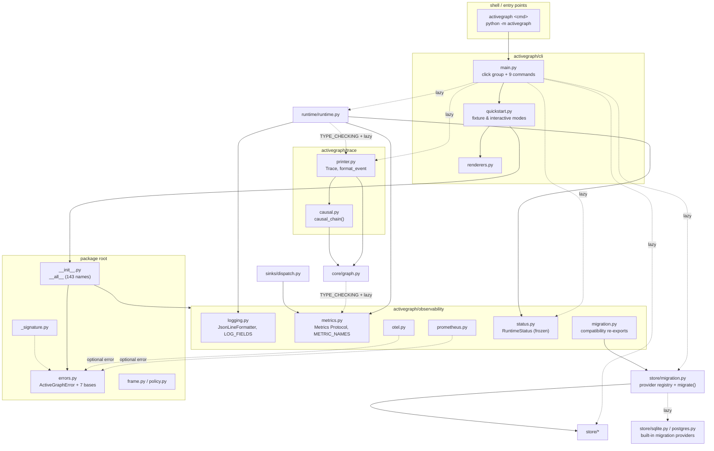
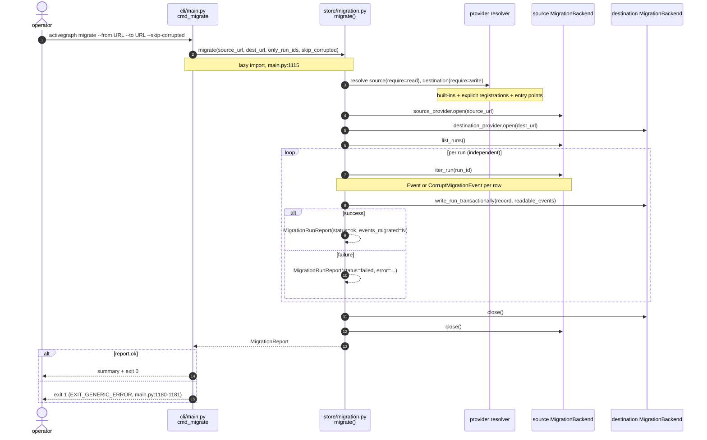

# Observability, Trace, CLI & Package Root

Four cross-cutting areas that sit at the outer edges of `activegraph`: the operator-facing
instrumentation surface (`activegraph/observability/`), the audit-rendering surface
(`activegraph/trace/`), the shell surface (`activegraph/cli/`), and the package root files
that define the public API and the error taxonomy everything else inherits from.

---

## Responsibility

**`observability/`** is the *operator-facing* surface: structured logging, a three-method
metrics protocol with two optional backends, and a frozen runtime-introspection snapshot. All
three pillars are opt-in and the framework never auto-configures them — "a library that does is
hostile to operators who already have their own config" (`observability/__init__.py:3-15`,
`observability/logging.py:3-9`). `observability/migration.py` is now only a compatibility
re-export of the canonical store-owned migration API (`store/migration.py`). The leaf
instrumentation modules (`logging.py`, `metrics.py`, `status.py`, `otel.py`, `prometheus.py`)
have no ActiveGraph imports at module scope; the optional adapters import
`MissingOptionalDependency` only in their dependency-loader functions.

**`trace/`** is the *audit* surface: a read-only facade over a run's event log that renders the
locked CONTRACT #18 line format, plus a causal-chain walker that reconstructs an object's full
available `caused_by` lineage (normally back to the goal that started the run)
(`trace/printer.py:1`, `trace/causal.py:22-107`).
The rendered format *is* the contract — it is snapshot-tested and consumed by the quickstart
transcript.

**`cli/`** is a *thin argument-parsing and formatting shell* over library APIs — "The CLI does
no business logic — it parses arguments, calls into Python, and formats output. Programmatic
users get the same behavior by importing the called functions directly" (`cli/main.py:6-8`,
`cli/__init__.py:3-5`). Runtime, store, migration, and trace imports are lazy inside command or
helper bodies; the module-scope quickstart registration imports only `cli.quickstart`, whose own
module-scope dependency is `cli.renderers` (`cli/main.py:155-163`, `cli/quickstart.py:23-34`).

**Package root** holds the public API re-export surface (`__init__.py`, 143 names), the root
error taxonomy every other error module subclasses (`errors.py`), and three small
value/validation modules (`frame.py`, `policy.py`, `_signature.py`).

---

## Component map



Dotted edges are lazy / `TYPE_CHECKING`-only imports — that is what keeps `core ↔ observability`
and `runtime ↔ trace` acyclic by construction rather than by accident (`core/graph.py:38-42`,
`:394-398`; `runtime/runtime.py:156-159`, `:3618-3621`). Migration's driver imports are also
function-local (`store/migration.py:139-149`).

---

## Key types & entry points

### observability/

- `configure_logging(level, *, json_output, stream, payload_redactor) -> logging.Logger` — installs a JSON-line handler on the `activegraph` logger; idempotent (replaces its own handler, never stacks) — `observability/logging.py:206-246`
- `get_logger(name="activegraph") -> logging.Logger` — namespace helper; `get_logger("runtime")` → `logging.getLogger("activegraph.runtime")` — `observability/logging.py:174-182`
- `runtime_log_extra(**fields) -> dict` — builds an `extra=` dict, dropping `None`s and renaming reserved `LogRecord` attrs to `ag_<name>`; it does not redact — `observability/logging.py:185-203`
- `LOG_FIELDS: tuple[str, ...]` — the exact 17-field operator log schema, ending in optional `payload` — `observability/logging.py:28-53`
- `JsonLineFormatter` — one JSON object per record; emits *only* fields in `LOG_FIELDS` and prepares explicit payloads at its final boundary — `observability/logging.py:87-161`
- `set_payload_redactor(fn)` / `redact_payload(payload)` — process-global redactor hook; a later `configure_logging(..., payload_redactor=None)` clears it — `observability/logging.py:68-84`
- `Metrics` — `@runtime_checkable` Protocol; `counter`, `histogram`, `gauge` — `observability/metrics.py:151-162`
- `NoOpMetrics` — `__slots__ = ()`, three bare `return` bodies; the default everywhere — `observability/metrics.py:167-184`
- `MetricSpec(name, kind, tags, description)` frozen dataclass; `METRIC_NAMES` — the exact 24-entry emitted operator catalog — `observability/metrics.py:194-347`
- `validate_cardinality_rule(metrics=METRIC_NAMES)` — called at **import time**; raises `AssertionError` if a counter or histogram declares `run_id` — `observability/metrics.py:352-367`
- `PrometheusMetrics(registry=None)` / `.available()` — lazy `prometheus_client`, per-instrument creation locks — `observability/prometheus.py:19-114`
- `OpenTelemetryMetrics(meter=None, *, meter_name="activegraph")` / `.available()` — gauges emulated via `UpDownCounter` deltas against a tracked last-value map — `observability/otel.py:20-108`
- `RuntimeState` literal — `observability/status.py:26`
- `RuntimeStatus` frozen dataclass + `BudgetSnapshot`, `FrameSnapshot`, `BehaviorInfo`, `EventSummary` — `observability/status.py:29-79`
- `status_to_dict(status) -> dict` — recursive dataclass→dict for `--json` — `observability/status.py:82-99`
- `migrate(source_url, dest_url, *, only_run_ids, on_progress, skip_corrupted) -> MigrationReport` — canonical in `store/migration.py:363-417`, compatibility-re-exported by `observability/migration.py:1-31`
- `MigrationBackend` / `MigrationBackendProvider` — administrative session and URL-provider protocols, separate from `EventStore` — `store/migration.py:30-68`
- `register_migration_backend(...)` / `resolve_migration_backend(...)` / `BackendRegistration` — explicit and entry-point-backed extension seam — `store/migration.py:99-316`
- `MigrationReport` (`.ok`, `.failures`) / `MigrationRunReport` — `store/migration.py:71-96`

### trace/

- `Trace(graph)` — read-only facade exposed as `runtime.trace` — `trace/printer.py:516-528`
  - `.events() -> list[Event]` — copy of `graph.events` (v1.3) — `trace/printer.py:531-548`
  - `.failures() -> list[Event]` — filters `behavior.failed` — `trace/printer.py:550-564`
  - `.lines() -> list[str]` — `trace/printer.py:566-594`
  - `.print()` / `.export(path)` — `trace/printer.py:596-603`
  - `.causal_chain(object_id) -> str` — `trace/printer.py:605-608`
- `format_event(event, *, hide_prompt_normalized=False) -> str` — dispatches via the `_FORMATTERS` dict, falls back to `_fmt_event_emitted` — `trace/printer.py:398-429`
- `TAG_COL = 26` and `_format_tag(tag_text)` — the locked column layout — `trace/printer.py:24-32`
- `causal_chain(graph, object_id) -> str` — `trace/causal.py:22-107`

### cli/

- `main(argv=None) -> int` — programmatic entry; **returns** an exit code rather than raising `SystemExit` — `cli/main.py:1187-1204`
- `cli` — the `click.group` — `cli/main.py:149-152`
- `EXIT_CODES` dict / `EXIT_OK..EXIT_DIVERGENCE` constants (0–5) — `cli/main.py:39-53`
- `cmd_inspect` — `cli/main.py:224-350`; `cmd_replay` — `:528-558`; `cmd_fork` — `:564-710`; `cmd_diff` — `:845-893`; `cmd_promote` — `:897-1011`; `cmd_export_trace` — `:1016-1064`; `cmd_migrate` — `:1070-1180`
- `cmd_pack` group — `cli/main.py:169-171`, with `pack new` (`:174-196`) and `pack list` (`:201-215`)
- `cmd_quickstart` — registered onto the group at `cli/main.py:161-163`; implemented in `cli/quickstart.py:449-477`
- `run_fixture_mode(stream=None) -> int` — `cli/quickstart.py:61-159`
- `run_interactive_mode(stream=None, *, prompt_fn=None) -> int` — `cli/quickstart.py:290-354`
- `company_name_for_memo(rt, memo)`, `print_memo_section(write, rt, memo)` — `cli/renderers.py:11-78`

### package root

- `activegraph/__init__.py` — 143 re-exported names in `__all__` + `__version__ = "1.10.0"` — `__init__.py:168-314`
- `ActiveGraphError` — `errors.py:64`; seven category bases at `errors.py:148` (`ConfigurationError`), `:161` (`RegistrationError`), `:169` (`ExecutionError`), `:178` (`ReplayError`), `:186` (`StorageError`), `:200` (`PatternError`), `:213` (`PackError`); `MissingOptionalDependency` — `errors.py:222`
- `DOCS_BASE_URL = "https://docs.activegraph.ai"` — the base-domain swap point used to construct every `More:` URL — `errors.py:43-49`, `:120-122`
- `GITHUB_NEW_ISSUE_URL` (`errors.py:308`) + `internal_bug_fields(...)` (`errors.py:311-371`) — uniform framework-bug error fields
- `Frame(goal, id, constraints, success_criteria, permissions)` — mission context, **descriptive only** — `frame.py:10-24`
- `Policy(behavior, can_create, can_create_relation, can_propose, can_apply, can_call_tool, requires_approval)` — audit/future-hardening metadata; it does not intercept graph mutations — `policy.py:1-34`
- `validate_handler_signature(fn, *, expected_params, decorator, allow_annotated_extras)` — registration-time arity check; raises `TypeError` — `_signature.py:36-134`
- `infer_tool_input_schema(fn) -> type[BaseModel] | None` — v1.3 first-param annotation inference — `_signature.py:137-194`
- `__main__.py` — `python -m activegraph` → `raise SystemExit(main())` — `__main__.py:1-5`

---

## Interfaces & contracts at each seam

## A. Observability seams

### A1. runtime / core / sinks <-> observability.metrics

`Runtime.__init__` takes `metrics: Optional[Metrics] = None` and defaults to `NoOpMetrics()`
(`runtime/runtime.py:407-448`, `:543-550`, `:635-644`); `Graph.add_sink` defaults its worker to
`NoOpMetrics()` when `metrics` is omitted (`core/graph.py:374-419`). `sinks/dispatch.py` is the
one hard (non-`TYPE_CHECKING`) importer outside `runtime` (`sinks/dispatch.py:16-24`, `:59-82`).
Callers emit observations inline on the hot path, so the protocol's non-throwing guarantee is
load-bearing.

```ebnf
metrics-backend      ::= NoOpMetrics | PrometheusMetrics | OpenTelemetryMetrics | <user impl>
metrics-observation  ::= counter( name , tags , value? )
                       | histogram( name , tags , value )
                       | gauge( name , tags , value )
name                 ::= standard-metric-name | <any str>      (* impls MUST tolerate unknown *)
standard-metric-name ::= "activegraph_" component "_" measure
tags                 ::= "{" { tag-key ":" tag-value } "}"
tag-key              ::= "event_type" | "behavior" | "model" | "tool"
                       | "reason" | "sink" | "operation" | "run_id"
value                ::= float
(* CONTRACT v0.8 #C4, import-time enforced: *)
constraint           ::= "run_id" ∈ tags  ⟹  kind = gauge
protocol-requirement ::= observation never raises ∧ thread-safe ∧ unknown-name-tolerant
```

Contract notes:

1. **Three methods only.** No timers, no summaries, no custom types. "Adding a metric is a public API change" — `observability/metrics.py:2-6`.
2. **Cardinality rule (locked, #C4)**: `run_id` MAY tag gauges (bounded by concurrent runs); MUST NOT tag counters or histograms. Enforced at **import time** — an in-tree violation raises `AssertionError` on `import activegraph` — `observability/metrics.py:352-367`.
3. The protocol requires implementations to tolerate unknown metric names and tag keys, remain
   best-effort/non-throwing, and accept concurrent calls from runtime and sink workers —
   `observability/metrics.py:150-161`. The optional adapters do not catch SDK/instrument errors,
   so the requirement is not fully contained by the current implementations; Prometheus's
   fixed-label behavior is one concrete propagation path.
4. `NoOpMetrics` is the default for `Runtime` and direct `Graph.add_sink` attachments (`runtime/runtime.py:543-550`, `core/graph.py:389-419`). The runtime is fully functional with no backend.
5. Sink metric calls are *additionally* exception-swallowing at the call site via `_safe_counter`/`_safe_gauge` — `sinks/dispatch.py:511-558`. A broken backend cannot take down a sink worker.
6. `PrometheusMetrics` tag keys are **fixed by the first observation** for a given name; a later differing key set raises (prometheus_client behavior) — `observability/prometheus.py:22-26`.
7. Naming: counters end `_total`, duration histograms end `_seconds` — test-enforced, `tests/test_observability_metrics.py:152-164`.

Emission ownership is closed in v1.11 #7. Runtime's accepted-event listener
owns the generic event counter and the four-type LLM/tool mapper; invocation
paths own behavior counts and handler duration; queue/budget helpers own live
gauges; the shared Registry matcher observer owns pattern count/duration; the
strict replay boundary owns one divergence counter; and attached sink workers
retain their four existing families. The executable `MetricProductionCase`
matrix drives only public Runtime/Graph/replay/attached-sink paths and proves
`union(case.proves) == set(METRIC_BY_NAME)`, exact metric kind, and exact tag
keys for all 24 rows (`tests/test_observability_metrics.py:627-632`, `:1177-1299`).

LLM/tool mapping treats `cache_hit is True` literally, uses each event's own
model/tool label, and classifies only a Mapping-valued response `error` as a
failure. Missing/`None` means success; another non-`None` shape is malformed and
omits family-specific response observations. Successful token fields are exact
nonnegative integers. Successful costs and tool latency must be finite and
nonnegative; cached cost/duration and explicit early tool-error duration are
logical zero. Invalid tool input is post-request and therefore records call,
failure, and duration zero. Metric-only name/reason normalizers bound open
payloads without changing event or log diagnostics.

Queue depth is the last publishing Runtime's untagged local main-queue depth,
not an aggregate. Finite budget gauges cover Runtime-owned observations only;
direct mutation/replacement of public `Runtime.budget` has no immediate
freshness promise. Reconstruction and verification use NoOp metrics, then a
successful activation publishes the recovered snapshot. Failed construction or
strict load leaves no initial queue/budget gauge series.

### A2. runtime <-> observability.logging

`runtime/runtime.py:166` imports `get_logger` and `runtime_log_extra` at module scope. The built-in
runtime logger is constructed at `runtime/runtime.py:550`; its INFO "event emitted" call at
`:1084-1092` and WARNING "behavior failed" call at `:2969-2979` carry only named metadata, never the corresponding
graph-event payload or traceback. The failure line carries `doc_url`
from `_doc_url_for_reason`. The CLI calls `configure_logging(level="ERROR", json_output=False)` to
silence the framework during the demo (`cli/quickstart.py:91`, `:405`).

```ebnf
log-call     ::= logger "." level "(" message "," "extra=" runtime_log_extra( fields ) ")"
logger       ::= get_logger( dotted-suffix )        (* → "activegraph." dotted-suffix *)
level        ::= "debug" | "info" | "warning" | "error"
fields       ::= { field-name "=" ( value | None ) }
field-name   ::= "run_id" | "event_id" | "behavior" | "tool" | "model"
               | "cache_hit" | "cost_usd" | "latency_seconds" | "reason"
               | "error_type" | "error_message" | "doc_url" | "payload"
payload      ::= explicit Mapping extra -> detached concrete dict
                 -> configured redactor -> concrete dict -> exact JSON validation
log-record   ::= "{" '"timestamp"' ":" iso8601-ms "," '"level"' ":" level-name ","
                     '"logger"' ":" name "," '"message"' ":" text
                     { "," documented-field } "}"        (* one JSON object per line *)
(* invariants: None-valued fields dropped; undocumented fields dropped;
   reserved LogRecord attrs renamed to "ag_" name; invalid payload omitted *)
```

Contract notes (CONTRACT v0.8 #6–#7, #16):

1. **Never auto-configure on import.** The framework attaches to `logging.getLogger("activegraph")` and lets the operator's config handle output — `observability/logging.py:5-7`.
2. **`configure_logging` is idempotent** — repeated calls remove handlers tagged `_activegraph` before adding a new one, never stacking — `observability/logging.py:226-242`.
3. **`propagate = False`** once ActiveGraph owns a handler, so operators with a root handler don't double-print — `observability/logging.py:243-245`.
4. **Schema stability**: the exact sequence is `timestamp, level, logger, message, run_id, event_id, behavior, tool, model, cache_hit, cost_usd, latency_seconds, reason, error_type, error_message, doc_url, payload`. Inapplicable fields are **omitted, not nulled** — `observability/logging.py:28-53`, `:98-128`.
5. **Payload boundary**: helper extras and direct stdlib `extra={"payload": ...}` both cross the configured ActiveGraph `JsonLineFormatter`. It accepts any `Mapping`, detaches it into a concrete deep-copied `dict`, calls the configured callback exactly once, requires a concrete `dict` result, and validates with the final compact, Unicode-preserving JSON settings. Without a callback it emits the detached mapping unchanged — `observability/logging.py:108-112`, `:138-161`.
6. **Fail closed**: non-Mapping/copy/callback/type/serialization failure omits only `payload`; it never emits the original and never loses the log line. Callback/copy/serialization catches `Exception`, not `BaseException` — `observability/logging.py:138-161`.
7. **Scope**: this redaction promise covers only the JSON handler installed by `configure_logging`. Arbitrary operator-installed handlers are outside it; `json_output=False` never interpolates payload; durable event storage and `EventSink` export require separate policy. Built-in runtime/LLM/tool/pack logs attach no payload.
8. Reserved `LogRecord` attribute collisions are renamed `ag_<name>` rather than smashing stdlib internals — `observability/logging.py:194-202`.

### A3. Runtime -> observability.status -> `cli inspect`

`Runtime.status(recent=20)` builds a `RuntimeStatus` (`runtime/runtime.py:177-184`, `:3069-3187`);
`cmd_inspect` lazily imports `status_to_dict` (`cli/main.py:287`) to render `--json`. Nothing in
the chain mutates runtime state.

```ebnf
status-request  ::= runtime.status( recent : int≥0 )   (* recent<0 ⟹ InvalidRuntimeConfiguration *)
RuntimeStatus   ::= run_id , state , queue_depth , events_processed ,
                    BudgetSnapshot , FrameSnapshot? ,
                    BehaviorInfo* , EventSummary*
state           ::= "idle" | "running" | "stopped" | "exhausted"
BudgetSnapshot  ::= used:{str→float} , limits:{str→float?} ,
                    cost_used_usd:str , cost_limit_usd:str? , exhausted_by:str?
BehaviorInfo    ::= name , kind , subscribed_to:tuple , pattern? , activate_after?
kind            ::= "function" | "relation" | "llm"
EventSummary    ::= id , type , actor? , timestamp
serialization   ::= status_to_dict( RuntimeStatus ) -> json-object   (* tuples → arrays *)
(* invariant: dataclass shells frozen; budget dicts are detached mutable copies;
   no last_error field by design *)
```

Contract notes (CONTRACT v0.8 #11):

1. **Side-effect-free and in-memory, but not constant-time**: with `N` materialized events and `B` registered behaviors, current work is `O(N + B + min(N, recent))`. Accessing `graph.events` materializes a copy, and outside a local drain state derivation scans backward to the latest terminal lifecycle event. There is no store I/O or object/relation traversal — `observability/status.py:3-12`, `runtime/runtime.py:3072-3078`, `:3123-3137`.
2. **All returned containers are snapshot values** — every status dataclass is `frozen=True`; collections exposed by `RuntimeStatus` are tuples — `observability/status.py:29-79`. The nested `used`/`limits` dicts are detached copies, not immutable mappings (`runtime/runtime.py:3114-3121`).
3. **There is deliberately no `last_error` field.** "Errors are events; filter `recent_events` for type `behavior.failed`… Convenience accessors that look the same as the source of truth but mean different things are bug-bait" — `observability/status.py:14-17`.
4. `recent < 0` raises `InvalidRuntimeConfiguration` rather than coercing — `runtime/runtime.py:3083-3113`.
5. `state` is log-derived while no local public drain is active: default `"stopped"`; `runtime.budget_exhausted` → `"exhausted"`; `runtime.idle` → `"idle"`. A lock-protected, non-persisted active-drain reference count temporarily takes precedence as `"running"`. Nested drains count independently and unwind in `finally`. The count lock does not make Runtime mutation thread-safe.
6. Same-instance observers may see `"running"`; freshly loaded runtimes and `activegraph inspect` remain dormant/log-derived. Live-versus-loaded equality applies outside active drains.
7. `registered_behaviors` is empty when `self.registry is None` (pre-run) — the intended operator signal, not a bug (`runtime/runtime.py:3146-3151`).

### A4. observability compatibility -> store.migration -> providers

Migration moved out of observability ownership. `observability/migration.py` contains only
compatibility re-exports (`observability/migration.py:1-31`); the canonical implementation is
`store/migration.py`. Administrative migration deliberately uses a separate provider/session
capability instead of widening the per-run `EventStore` protocol (`store/migration.py:1-6`,
`:30-68`). Built-in SQLite and Postgres providers live with their drivers; third-party schemes can
arrive through explicit registration or the `activegraph.migration_backends` entry-point group
(`store/migration.py:99-106`, `:139-220`, `:268-316`).

```ebnf
migration       ::= migrate( source_url , dest_url ,
                             only_run_ids? , on_progress? , skip_corrupted? )
provider        ::= builtin-sqlite | builtin-postgres | explicit-registration
                  | entry-point("activegraph.migration_backends", scheme)
capability      ::= "read" | "write"
session         ::= list_runs() , iter_run(run_id) ,
                    write_run_transactionally(record, events) , close()
per-run-result  ::= source.iter_run(run_id)
                    -> destination.write_run_transactionally(record, readable-events)
MigrationReport ::= source_url , dest_url , MigrationRunReport+
MigrationRunReport ::= run_id , status , events_migrated , error? , skipped_events*
status          ::= "ok" | "failed"
report.ok       ::= ∀ r ∈ runs : r.status ≠ "failed"
(* built-in writer invariants: per-run atomicity; idempotent inserts;
   independent per-run reports *)
```

Contract notes (CONTRACT v0.8 #5 revised, v1.0 CLI follow-on):

1. **Resolution is pure; opening is ordered.** `migrate()` resolves and validates the read provider and write provider, then opens the source before the destination. A source schema/open failure therefore cannot initialize a fresh destination — `store/migration.py:363-383`.
2. **Transaction-per-run is a provider contract.** The built-in SQLite backend uses explicit `BEGIN`/`COMMIT`/`ROLLBACK` (`store/sqlite.py:243-290`); Postgres uses `_ConnectionSource.transaction()` (`store/postgres.py:361-403`). A third-party writer owns the same guarantee behind `write_run_transactionally`.
3. **Built-in writes are idempotent.** Run and event inserts use `ON CONFLICT ... DO NOTHING`, and `events_migrated` counts only rows inserted this invocation — `store/sqlite.py:251-290`, `store/postgres.py:364-403`. An already-complete run reports `status="ok", events_migrated=0`; there is no `"skipped"` status.
4. **Runs migrate independently.** Read or write failure becomes that run's failed report and the loop continues — `store/migration.py:319-360`, `:388-399`. Failures that occur before per-run iteration (provider resolution/open/listing) still escape the call.
5. `MigrationReport.ok` is true exactly when no run report has `status == "failed"`; `.failures` filters those reports — `store/migration.py:82-96`.
6. `skip_corrupted=True` writes a **partial** destination run and records each omitted id in `skipped_events`; without it, that run fails before writing — `store/migration.py:319-360`. The CLI help repeats the partial-run warning (`cli/main.py:1078-1088`).
7. Drivers surface corrupt rows as `CorruptMigrationEvent` values so iteration can continue per row — `store/sqlite.py:224-241`, `store/postgres.py:345-359`.
8. **Backend ownership is explicit.** `BackendRegistration.unregister()` reveals the previous mapping; conflicts, unsupported schemes/capabilities, entry-point load failures, and close failures have typed store errors — `store/migration.py:152-201`, `:243-316`, `:403-417`.
9. The CLI calls canonical `activegraph.store.migration.migrate`, maps backend configuration failures to usage exit 2, and relies on source-first open ordering instead of its old built-in-only preflight — `cli/main.py:1115-1157`.

## B. Trace seams

### B1. Runtime <-> trace.printer.Trace

`Runtime.trace` is a property that lazily imports and returns `Trace(self.graph)`
(`runtime/runtime.py:3617-3621`, with the `TYPE_CHECKING` import at `:156-159`);
`Runtime.print_trace()` delegates to `self.trace.print()` (`:3623-3624`). The CLI imports `Trace`
directly only in `cmd_export_trace`'s text path (`cli/main.py:1057-1064`). `Trace` is **not**
re-exported from `activegraph/__init__.py`; the documented consumer route is the `runtime.trace`
property, and `trace/__init__.py` is a single docstring line (`trace/__init__.py:1`).

```ebnf
trace           ::= { replay-line } [ replay-boundary ] [ flags-line ] { live-line }
replay-boundary ::= "[replay.complete]" N "events replayed, graph reconstructed"
                    NEWLINE "[runtime.idle]" "ready to resume"
flags-line      ::= "[trace.flags]" "prompt_normalized=true" "(" N "llm requests)"
replay-line     ::= tag("replay.event") event-id event-type summary
live-line       ::= tag(event-type) rendered-body
tag(t)          ::= "[" t "]" ljust(26)          (* or "] " if len ≥ 26 *)

event-type      ::= "goal.created" | "object.created" | "object.removed"
                  | "relation.created" | "relation.removed"
                  | "patch.applied" | "patch.proposed" | "patch.rejected"
                  | "behavior.started" | "behavior.completed" | "behavior.failed"
                  | "behavior.scheduled" | "relation_behavior.started"
                  | "llm.requested" | "llm.responded"
                  | "tool.requested" | "tool.responded"
                  | "pattern.matched" | "runtime.idle" | "pack.loaded"
                  | "runtime.budget_exhausted" | "promote.applied"
                  | "runtime.snapshot"
                  | <any-other>                  (* → "[event.emitted]" fallback *)

llm-requested-body  ::= event-id behavior "model=" m [ "cache_hit=true" ]
                        [ "retry=" i "/" n ] [ "turn=" k ]
                        [ "tokens_in~" est ] [ "budget_remaining=$" usd ]
                        [ "prompt_normalized=true" ]
llm-responded-body  ::= event-id behavior ( "error=" reason [ "latency=" s "s" ]
                                          | [ "cache_hit=true" ] [ "tokens_in=" n ]
                                            [ "tokens_out=" n ] [ "cost=$" usd ]
                                            [ "latency=" s "s" ] )
tool-requested-body ::= event-id behavior "tool=" name "args_hash=" hash8
                        [ "cache_hit=true" ] [ "deterministic=true" ]
(* invariant: cache_hit=true suppresses cost and latency segments *)
```

Contract notes (CONTRACT #18, v0.5 #22, v0.9.1):

1. **The format is the public contract** — `trace/printer.py:1`.
2. Tag column: bracketed tag left-aligned to `TAG_COL = 26`; if the tag itself is longer, **exactly one space** follows — `trace/printer.py:4-5`, `:27-32`.
3. Unknown event types fall back to `[event.emitted] {type} k=v...` — `trace/printer.py:346-352`, `:428`.
4. Replay boundary: replayed events get a `[replay.event]` prefix; after the last replayed event two **synthetic** lines appear — `[replay.complete] N events replayed, graph reconstructed` and `[runtime.idle] ready to resume` — `trace/printer.py:9-13`, `:505-510`, `:577-585`. The boundary is also emitted if the log ends while still replaying (`:591-593`). `lines()` reads `graph.replayed_ids` (`trace/printer.py:567`), backed by `Graph._replayed_ids` (`core/graph.py:207`, `:227-228`, `:638`).
5. **`prompt_normalized` rollup (v0.9.1)**: when *every* non-replayed `llm.requested` carries `prompt_normalized=true`, the per-line flag is dropped and a single `[trace.flags]` header is emitted instead. **Mixed state keeps the per-line flag** — mixed "signals a real divergence worth seeing" — `trace/printer.py:435-452`, `:586-588`.
6. Successful cache-hit response lines render `cache_hit=true` and suppress cost/latency segments — `trace/printer.py:190-215`, `:255-268`.
7. `behavior.completed` prints the count summary **only** when the behavior produced ≥ 2 combined mutations — `trace/printer.py:126-133`.
8. `Trace.events()` returns a **copy** — mutating it changes nothing — `trace/printer.py:534-535`, `:548`.
9. Every event id from `Trace.events()` is a valid `Runtime.fork(at_event=...)` argument — `trace/printer.py:537-542`.
10. `behavior.failed` payloads carry `behavior, event_id, exception_type, message`, and since v1.0.3 the full `traceback` string — `trace/printer.py:552-556`.

### B2. trace.causal <-> core.graph (the provenance protocol)

`Trace.causal_chain(object_id)` lazily imports `causal_chain` from `trace.causal`
(`trace/printer.py:606`). `causal.py` imports only `Event` and `Graph` from `core`
(`trace/causal.py:18-19`) and uses them read-only: `graph.get_object()` plus a scan of
`graph.events`. The walk depends on a provenance convention that `runtime` writes into
`obj.provenance`.

```ebnf
causal-request ::= causal_chain( graph , object_id )
chain          ::= object-line { llm-block } { tool-block } { ancestor-line }
                 | "(no such object: " object_id ")"
object-line    ::= object_id "(" object_type ")" [ '"' label '"' ]
label          ::= obj.data["title"] | obj.data["text"]
llm-block      ::= "← " actor "(" req-id ") llm.requested  model=" m
                   [ NEWLINE "  (" resp-id ") llm.responded"
                     ( " (cache_hit)" | " cost=$" usd ) ]
tool-block     ::= "← " actor "(" req-id ") tool.requested  tool=" name
                   [ NEWLINE "  (" resp-id ") tool.responded"
                     ( " error=" reason | " (cache_hit)" | " cost=$" usd ) ]
ancestor-line  ::= "← " actor "(" event-id ") " event-type
                 | "← (cycle at " event-id ")"

(* the provenance contract this seam depends on: *)
provenance     ::= { "llm_request_event_id"  : event-id ?
                   , "tool_request_event_ids": event-id* ? }
response-link  ::= ∃ e : e.type = resp-type ∧ e.caused_by = req-id
termination    ::= caused_by = null  ∨  caused_by not in event-index  ∨  id ∈ seen
```

Contract notes (CONTRACT v0.6 #15, v0.7 #19):

1. Walks `caused_by` until it is `None` or is absent from the event-id index. In normal runs the
   root is `goal.created`, whose `caused_by` is `None`; the walker does not special-case that event
   type — `trace/causal.py:93-105`.
2. **LLM link is followed first**: `obj.provenance["llm_request_event_id"]` renders the `llm.requested`/`llm.responded` round-trip *before* continuing up the triggering event — `trace/causal.py:4-11`, `:44`, `:53-67`.
3. v0.7 #19: `obj.provenance["tool_request_event_ids"]` (a list) enumerates contributing tool calls in the same shape — `trace/causal.py:46-51`, `:68-91`.
4. **Cycle-safe**: a `seen` set breaks the walk with `← (cycle at {id})` — `trace/causal.py:93`, `:96-98`.
5. Missing object returns the string `"(no such object: {id})"` rather than raising — `trace/causal.py:24-25`.
6. Indent grows by two spaces per hop up the chain — `trace/causal.py:105`.

## C. CLI seams

### C1. shell -> cli

Three inbound routes: the console script `activegraph = "activegraph.cli.main:main"`
(`pyproject.toml:157-158`), `python -m activegraph` (`__main__.py:3-5`), and tests via
`click.testing.CliRunner` — `main(argv)` returns an int specifically for that
(`cli/main.py:1187-1204`).

```ebnf
invocation      ::= "activegraph" [ "-h" | "--help" | "--version" ] | "activegraph" command
                    (* also: python -m activegraph <same> *)
command         ::= quickstart | pack-cmd | inspect | replay | fork
                  | diff | promote | export-trace | migrate

quickstart      ::= "quickstart" [ "--interactive" ]
pack-cmd        ::= "pack" ( "new" NAME [ ("-o"|"--output-dir") DIR ]
                           | "list" )
inspect         ::= "inspect" URL [ "--run-id" RID ] [ "--tail" N ] [ "--json" ]
                    [ selector ]
selector        ::= "--event" EVENT_ID | "--behaviors" | "--pack-version"
                  | "--memo" | "--search" QUERY
                    (* mutually exclusive: >1 ⟹ exit 2 *)
replay          ::= "replay" URL "--run-id" RID [ "--json" ]
fork            ::= "fork" URL "--run-id" RID "--at-event" EID
                    [ "--label" L ] [ "--to" URL ] [ "--record" ]
                    { "--set" PACK "." SETTING { "." SETTING } "=" VALUE }
                    [ "--json" ]
diff            ::= "diff" URL "--run-a" RID "--run-b" RID [ "--json" ]
promote         ::= "promote" URL "--run-id" RID "--from-run" RID
                    [ "--dry-run" ] [ "--json" ]
export-trace    ::= "export-trace" URL "--run-id" RID
                    [ "--format" ("text"|"jsonl") ] [ ("-o"|"--output") PATH ]
migrate         ::= "migrate" "--from" URL "--to" URL
                    { "--run-id" RID } [ "--skip-corrupted" ] [ "--json" ]

URL             ::= "sqlite:///" PATH | "postgres://" ...
                    | registered-migration-scheme "://" ...  (* migrate only *)
exit-code       ::= 0 (* ok *)        | 1 (* generic *)   | 2 (* usage *)
                  | 3 (* not found *) | 4 (* corruption *) | 5 (* divergence *)
schema-mismatch ::= SchemaVersionMismatch -> stderr-once , exit-code 4
                    (* exact leaf at every CLI store boundary; direct
                       library calls still raise or report normally *)
```

Contract notes (CONTRACT v0.8 #12–#13):

1. **Exit codes are contract**: 0 ok, 1 generic, 2 usage (click's default), 3 not found, 4 corruption, 5 divergence — `cli/main.py:10-16`, `:38-52`.
2. **No business logic in the CLI** — every subcommand calls into the library — `cli/main.py:6-8`.
3. `main(argv)` **returns** an exit code rather than raising `SystemExit`, converting click's `UsageError` → 2 and `ClickException` → 1 — `cli/main.py:1187-1204`.
4. click is a **hard dependency** (`pyproject.toml:28`) but is imported in a `try/except
   ImportError` that prints install guidance and exits 2 (`cli/main.py:26-36`). One suggested form,
   `activegraph[cli]`, does not correspond to an extra declared in `pyproject.toml`; ordinary
   `pip install activegraph` already installs click.
5. `inspect` selector flags (`--event`, `--behaviors`, `--pack-version`, `--memo`, `--search`) are **mutually exclusive** — "they're selectors, not filters" — `cli/main.py:229-283`, `:290-299`.
6. `promote` is **fail-closed and atomic**: any conflict aborts with nothing applied (exit 5), and a **conflicted `--dry-run` also exits 5** so scripts can gate on it — `cli/main.py:907-919`, `:955-962`, `:985-1010`.
7. `promote` validates both run ids against the runs table **before** `Runtime.load`, because load would otherwise upsert a phantom run row — `cli/main.py:931-947`.
8. Cross-store `fork` is explicitly unsupported; the guidance is fork-then-migrate — `cli/main.py:621-627`.
9. `--set` overrides are validated against `pack.loaded` events at or before the fork point; an unmatched pack is a usage error — `cli/main.py:635-645`, `:787-807`.
10. `migrate` exits `EXIT_GENERIC_ERROR` when `not report.ok` — `cli/main.py:1180-1181`.
11. Every store-opening command maps the exact `SchemaVersionMismatch` leaf to one structured stderr rendering and exit 4. The old `RuntimeError` string match remains only in the two legacy helper paths where it already existed.
12. `migrate` no longer performs a CLI-level built-in-only preflight. The provider layer validates both URLs, then opens the source before the destination; that preserves the "bad source cannot initialize destination" guarantee while allowing registered schemes — `cli/main.py:1118-1132`, `store/migration.py:373-383`.

### C2. cli -> library (the lazy-import discipline)

CLI→library imports live inside command or helper bodies, so `--help` does not import runtime,
store drivers, migration backends, or trace. The module-scope registration import is only
`cli.quickstart`, whose own module-scope dependency is `cli.renderers` (`cli/main.py:155-163`,
`cli/quickstart.py:23-34`).

| Target package | Symbols | Sites |
|---|---|---|
| `core/` | `IDGen`, `Event` | `cli/main.py:608`, `:817` |
| `observability/` | `status_to_dict` | `cli/main.py:285` |
| `packs/` | `scaffold_pack`, `discover` | `cli/main.py:189`, `:211` |
| `runtime/` | `Runtime`, `_now_iso`, `compute_diff`, `PromoteConflictError`, `PromoteLineageError` | `cli/main.py:286,534,818,853,922,1034`, `:609`, `:852`, `:918-922` |
| `store/` | schema/open/list helpers, built-in drivers, migration errors, canonical `migrate` | `cli/main.py:62-73`, `:95-141`, `:610`, `:651-662`, `:923`, `:1109-1116` |
| `trace/` | `Trace` | `cli/main.py:1058` |
| `packs/diligence` fixtures | `RecordedDiligenceProvider`, `THREE_COMPANIES`, `company_goal` | `cli/quickstart.py:76-79` |

`cli/quickstart.py` imports `Graph, IDGen, FrozenClock, Runtime, clear_registry,
configure_logging` from the *top-level* `activegraph` package (`quickstart.py:70`, `:370-377`) —
so the CLI depends on the public re-export surface, not just internal modules. It also pulls
`errors.DOCS_BASE_URL` (`quickstart.py:199`).

Quickstart contract notes (CONTRACT v1.0 #1, #C3, #4d):

1. **Byte-deterministic across machines**: `FrozenClock("2026-01-01T00:00:00Z")` + fixed `run_id="quickstart_demo_run"` + `seed=0` — `cli/quickstart.py:45-46`, `:107`, `:119`.
2. The transcript at `examples/quickstart_session.txt` is the contract for both modes — `cli/quickstart.py:11-13`.
3. **Trace lines come from the canonical `Trace`** — "the quickstart command does not reformat trace output… any drift is a bug in this code path, not the printer" — `cli/quickstart.py:13-15`, `:138-142`.
4. No API key, no network: `RecordedDiligenceProvider` is fixture-backed — `cli/quickstart.py:5-6`, `:104`.
5. `--live` mode was **explicitly rejected** by CONTRACT v1.0 #C3 — `cli/quickstart.py:18-19`.
6. Fixed DB path is wiped (including `-wal`/`-shm` sidecars) on each run, because stale sidecars caused `sqlite3.OperationalError: disk I/O error` on macOS — `cli/quickstart.py:97-102`.
7. Interactive mode **does not watch the filesystem** — "explicit over magic" — `cli/quickstart.py:326-328` — and deliberately does not use `importlib.reload` (auto-reload rejected per v1.0 BEAT 5 errata) — `cli/quickstart.py:357-367`.
8. Directory collision offers overwrite/suffix/quit and **re-prompts on unrecognized input** — the pre-rc2 fall-through swallowed typeahead (v1.0-rc2 finding M1) — `cli/quickstart.py:269-287`.
9. `prompt_fn` is injectable for testing — `cli/quickstart.py:293-294`, `:440-443`.

## D. Package-root seams

### D1. library consumer -> `activegraph` (the public API)

`__init__.py` eagerly imports across the package's behavior, core, error, runtime, frame, LLM,
policy, sink, store, tool, observability, and pack domains (`__init__.py:6-166`) — there is no
lazy `__getattr__`. Consequently `import activegraph` transitively triggers
`validate_cardinality_rule()` (`observability/metrics.py:366-367`).

```ebnf
public-import   ::= "from activegraph import" exported-name { "," exported-name }
exported-name   ::= member-of(activegraph.__all__)   (* 143 unique strings; authoritative *)
selected-name  ::= core-type | behavior-api | error-type | store-api
                  | sink-api | tool-api | observability-api | pack-api
                  (* boundary-bearing subset shown below, not an exhaustive expansion *)

core-type       ::= "Graph" | "Object" | "Relation" | "Event" | "Patch" | "View"
                  | "IDGen" | "Clock" | "FrozenClock" | "TickingClock"
                  | "Frame" | "Policy" | "Budget" | "Runtime"
                  | "BehaviorFailure" | "RunQuantumResult" | "Diff"
                  | "DivergentObject" | "DivergentRelation" | "DevOverride"
                  | "AuthorityDecision" | "PromotePlan" | "PromoteResult"
                  | "PromoteConflict"
behavior-api    ::= "Behavior" | "LLMBehavior" | "RelationBehavior"
                  | "behavior" | "llm_behavior" | "relation_behavior"
                  | "register" | "get_registry" | "clear_registry"
tool-api        ::= "Tool" | "ToolContext" | "tool"
                  | "get_tool_registry" | "clear_tool_registry"
store-api       ::= "EventStore" | "GraphStore" | "RunRecord"
                  | "InMemoryEventStore" | "InMemoryGraphStore"
                  | "SQLiteEventStore" | "FalkorDBGraphStore"
                  | "open_store" | "parse_store_url"
                  | "MigrationBackend" | "MigrationBackendProvider"
                  | "MigrationReport" | "MigrationRunReport" | "migrate"
                  | "register_migration_backend" | "resolve_migration_backend"
sink-api        ::= "EventSink" | "JSONLEventSink" | "RecordingSink"
                  | "SinkConfig" | "SinkHandle" | "SinkState" | "SinkStatus"
                  | "DeliveryContext" | "RecordedDelivery" | "OverflowPolicy"
observability-api ::= "Metrics" | "NoOpMetrics" | "PrometheusMetrics"
                  | "OpenTelemetryMetrics" | "RuntimeStatus"
                  | "configure_logging"
pack-api        ::= "Pack" | "DiscoveredPack" | "ObjectType" | "RelationType"
                  | "PackPolicy" | "PackPrompt" | "PendingApproval"
                  | "EmptySettings" | "discover" | "load_by_name"
                  | "load_prompts_from_dir" | "clear_discovery_cache"
error-type      ::= "ActiveGraphError" | category-base | concrete-leaf
category-base   ::= "ConfigurationError" | "RegistrationError" | "ExecutionError"
                  | "ReplayError" | "StorageError" | "PatternError" | "PackError"

NOT-exported    ::= "Trace" | "causal_chain" | "format_event"
                  | "get_logger" | "runtime_log_extra" | "LOG_FIELDS"
                  | "METRIC_NAMES" | "status_to_dict"
                  | pack-authoring-decorators   (* CONTRACT v0.9 #3: import from
                                                   activegraph.packs explicitly *)
version         ::= activegraph.__version__ = "1.10.0"
```

Contract notes:

1. `__all__` lists **143 names** and `__version__ = "1.10.0"` — `__init__.py:168-314`. The list is curated by domain rather than globally sorted.
2. **Deliberate omission**: pack-aware decorators are NOT re-exported. "Pack authors must import them from `activegraph.packs` so the import path makes the boundary explicit. CONTRACT v0.9 #3" — `__init__.py:121-124`.
3. `trace/` has **no** public top-level surface at all — `Trace`, `causal_chain`, and `format_event` are absent from `__all__`; the supported route is `runtime.trace`.
4. Six instrumentation/status names are imported directly from `activegraph.observability`; migration APIs are imported from canonical `activegraph.store` — `__init__.py:87-140`.

### D2. any subsystem -> `activegraph.errors`

Every framework error class in the current tree roots under one of the seven categories. Leaves
now span LLM, runtime, store/migration, retention, sandbox, tools, and packs; the root surface
also re-exports the public subset (`errors.py:64-222`, `__init__.py:21-73`, `:87-166`).
`SandboxStartupError(ConfigurationError, RuntimeError)` at `sandbox/__init__.py:183` now roots in
`ActiveGraphError` while preserving built-in `RuntimeError` catches. It remains a subsystem-only
export and intentionally uses the legacy one-message constructor until AF-wse's separately
reviewed next-major structured-rendering migration. `MissingOptionalDependency` is raised from
five subsystems:
`observability/otel.py:123`, `observability/prometheus.py:122`, `packs/__init__.py:54`,
`store/postgres.py:76`, `store/falkordb.py:82,97`.

```ebnf
raise-site      ::= "raise" concrete-leaf "(" construction ")"
construction    ::= structured | legacy
structured      ::= summary "," "what_failed=" str "," "why=" str
                    "," "how_to_fix=" str [ "," "context=" dict ]
legacy          ::= message                      (* single positional; verbatim __str__ *)
concrete-leaf   ::= <class> "(" framework-error-parent
                    { "," ( framework-error-parent | builtin-exception ) } ")"
framework-error-parent ::= category-base | intermediate-framework-error
category-base   ::= ConfigurationError | RegistrationError | ExecutionError
                  | ReplayError | StorageError | PatternError | PackError
builtin-exception ::= ValueError | TypeError | LookupError | KeyError
                  | RuntimeError | ImportError | SyntaxError | Exception

rendered-error  ::= ClassName ": " summary CRLF CRLF
                    "What failed:" CRLF "  " indented-block CRLF CRLF
                    "Why:"         CRLF "  " indented-block CRLF CRLF
                    "How to fix:"  CRLF "  " indented-block CRLF CRLF
                    "More:"        CRLF "  " doc-url
doc-url         ::= DOCS_BASE_URL "/errors/" _doc_slug

routing-rule    ::= configuration-failure ⟹ raise at entry point (never behavior.failed)
                  | storage-failure       ⟹ raise (never emit)
                  | behavior-failure      ⟹ behavior.failed event (never raise)
internal-bug    ::= internal_bug_fields( summary, what_happened, why_invariant,
                                          location, extra_context? )
                    (* context always carries internal:True, framework_version,
                       internal_error_location, report_url *)
```

Contract notes (CONTRACT v1.0 #3, #4):

1. **Every framework error inherits from `ActiveGraphError`.** Structured errors render in the
   locked five-block format — `errors.py:1-25`, `:124-131`. `SandboxStartupError` is the explicit
   narrow exception to rendering only: its ancestry is compliant, while exact one-line
   `str`/`.args` stay compatible until AF-wse.
2. **The seven category bases are stable** — `errors.py:148-219`. External code can `except RegistrationError:` today and have it cover leaves that migrate later — `errors.py:136-138`.
3. **Dual construction mode** during the v1.0 transition: structured (summary + 3 named fields → locked format) or legacy (single positional message → verbatim). `is_structured()` gates which — `errors.py:83-111`, `:126-129`.
4. Concrete leaves multi-inherit a builtin only where compatibility requires it — e.g. `ApprovalNotFoundError(ExecutionError, LookupError)`, `InvalidStoreURL(StorageError, ValueError)`, and `MissingOptionalDependency(RegistrationError, ImportError)`. Other leaves inherit only their framework category.
5. **`_doc_slug` is class-level**; `doc_url = f"{DOCS_BASE_URL}/errors/{_doc_slug}"` — `errors.py:113-115`. `DOCS_BASE_URL` is the documented **single swap point** — `errors.py:37-43`.
6. **Error routing rule (#4b)**: configuration failures are *exceptions at the entry point*, never `behavior.failed` events, "because there is no run yet to record them in" — `errors.py:146-149`. Conversely, storage failures raise rather than emit: "a store that can't be trusted can't record its own failure" — `errors.py:185-188`.
7. `ExecutionError` is deliberately **not** named `RuntimeError`, to avoid shadowing the builtin — `errors.py:164-166`.
8. Framework-bug raises go through `internal_bug_fields(...)` for a uniform context dict and recovery prose — `errors.py:311-371`. Current call sites are `core/graph.py:1166`, `runtime/patterns.py:818,868`, and `llm/errors.py:337`.
9. `errors.py` has exactly one deferred inbound import — `from activegraph import __version__` inside `internal_bug_fields` (`errors.py:348`) — function-local specifically to avoid a cycle.

### D3. decorators -> `activegraph._signature`

Eight public decorator families share four factory binders. Global and pack-scoped behavior
decorators delegate to `behaviors/_factory.py`, while global and pack-scoped tools delegate to
`tools/_factory.py` (`behaviors/decorators.py:133,226,285`, `packs/__init__.py:788,844,900,943`,
`tools/decorators.py:69`). Validation therefore has one implementation call per binder rather
than eight copied call sites (`behaviors/_factory.py:82-88`, `:132-138`, `:183-189`,
`tools/_factory.py:35-46`). `_signature.py` imports stdlib `inspect`, plus lazy `typing` and
`pydantic` (`_signature.py:32`, `:179`, `:189`).

```ebnf
validation-call ::= validate_handler_signature( fn ,
                      expected_params = ( param-name+ ) ,
                      decorator = "@" decorator-name ,
                      allow_annotated_extras = bool )
expected_params ::= ( "event" , "graph" , "ctx" )
                                                    (* @behavior *)
                  | ( "event" , "graph" , "ctx" , "llm_output" )
                                                    (* @llm_behavior *)
                  | ( "relation" , "event" , "graph" , "ctx" )
                                                    (* @relation_behavior *)
                  | ( "args" , "ctx" )            (* @tool *)
outcome         ::= ok | TypeError( arity-message ) | TypeError( extras-message )
ok              ::= uninspectable(fn)
                  | ( |positional| ≥ |expected| ∨ has-var-positional )
                    ∧ ∀ extra : satisfiable(extra)
satisfiable(p)  ::= p.default ≠ empty
                  | allow_annotated_extras ∧ p.annotation ≠ empty
schema-inference ::= infer_tool_input_schema( fn )
                     -> pydantic-model  (* iff first positional param annotated
                                            with a BaseModel subclass *)
                      | None            (* everything else *)
precedence      ::= explicit input_schema=  ≻  inferred  ≻  None
```

Contract notes:

1. `validate_handler_signature` raises **`TypeError`** (not an `ActiveGraphError`) at decoration time — `_signature.py:62`, `:93`, `:127`. Rationale: a wrong-arity handler used to register fine and then fail at first invocation with a `TypeError` swallowed into a `behavior.failed` event — `_signature.py:9-14`.
2. **Deliberately permissive**: uninspectable callables pass through unvalidated; `*args` satisfies any positional arity; extra params are OK if they have a default, or (behaviors only, `allow_annotated_extras=True`) carry a type annotation marking them as pack-settings injection candidates — `_signature.py:16-27`, `:66-69`, `:197-204`.
3. Tools use `allow_annotated_extras=False` "because tools are always invoked as exactly `fn(args, ctx)`" — `_signature.py:52-54`.
4. `infer_tool_input_schema` returns the first positional param's annotation **only if** it is a Pydantic `BaseModel` subclass; anything else returns `None`. **Explicit `input_schema=` always wins** — `_signature.py:150-155`, `:192-194`. PEP-563 string annotations are resolved via `typing.get_type_hints` — `_signature.py:174-186`.

### D4. `frame.py` / `policy.py` (leaf value modules)

Both are leaf modules with **zero** activegraph imports.

- **`Frame` describes intent; it does not enforce.** Its fields are stamped into assembled LLM
  prompts and visible as `ctx.frame` (`frame.py:11-24`). The docstring's phrase that enforcement
  lives in `Policy` and budget overstates the current `Policy` half.
- **`Policy` is recorded-not-enforced metadata.** Its allowlists do not intercept graph mutations,
  and `requires_approval` does not convert direct writes into proposals. Behavior code must call
  `Context.propose_object` explicitly; pack policy then supplies owner attribution for that
  proposal (`policy.py:1-25`).

---

## Sequence: `activegraph quickstart` — CLI → runtime → observability → trace

The flow that best exercises three of the four areas at once: the CLI silences framework logging,
drives a fixture-backed run, then renders the canonical trace.

```mermaid
sequenceDiagram
    autonumber
    actor Op as operator
    participant CLI as cli/main.py<br/>cmd_quickstart
    participant QS as cli/quickstart.py<br/>run_fixture_mode
    participant LOG as observability/logging.py
    participant G as core/graph.py<br/>Graph
    participant RT as runtime/runtime.py<br/>Runtime
    participant MET as observability/metrics.py<br/>NoOpMetrics
    participant TR as trace/printer.py<br/>Trace

    Op->>CLI: activegraph quickstart
    CLI->>QS: run_fixture_mode(stream)
    QS->>LOG: configure_logging(level=ERROR, json_output=False)
    Note over LOG: idempotent; propagate=False<br/>logging.py:206-245
    QS->>QS: wipe fixed DB path + -wal/-shm sidecars<br/>quickstart.py:97-102
    QS->>G: Graph(ids=IDGen(), clock=FrozenClock(...), run_id=quickstart_demo_run)
    QS->>RT: Runtime(graph, llm_provider=fixture, persist_to=fixed DB, seed=0)
    Note over RT: metrics defaults to NoOpMetrics()<br/>runtime.py:543-550
    loop each fixture company
        QS->>RT: run_goal(company_goal(company))
    end
    RT->>MET: counter(activegraph_events_emitted_total, tags event_type)
    RT->>MET: gauge(activegraph_queue_depth, no tags)
    RT->>MET: counter(activegraph_behaviors_invoked_total, tags behavior)
    RT->>MET: histogram(activegraph_behaviors_duration_seconds, tags behavior)
    QS->>RT: rt.trace (property)
    RT->>TR: Trace(self.graph)
    Note over RT,TR: lazy import, runtime.py:3617-3621
    QS->>TR: lines()
    TR->>TR: format_event(e, hide_prompt_normalized=...)
    Note over TR: prompt_normalized rollup<br/>printer.py:435-452, 586-588
    TR-->>QS: list[str] (CONTRACT #18 format)
    QS-->>Op: transcript matching examples/quickstart_session.txt
    QS-->>CLI: 0
    CLI-->>Op: exit 0
```

## Sequence: `activegraph migrate` — CLI → store.migration → providers



---

## Historical finding disposition and current boundaries

1. **Resolved in v1.11 #7: all 24 standard metrics have executable production paths.**
   The public-path `MetricProductionCase` matrix covers Runtime, Graph, strict
   replay, and attached sink workers; its declared union equals
   `METRIC_BY_NAME` exactly, each row must actually be observed, and every
   observation is checked against the catalog's kind and exact tag-key set.
   Names and tag keys are unchanged. Queue ownership is local last-writer state,
   budget freshness is Runtime-owned, pattern observation uses the shared
   matcher seam, and strict replay counts one escaping closed-kind divergence.

2. **Resolved — `running` is a process-local active-drain overlay.** All four public drains use a
   lock-protected reference count, so same-instance observers see `running`, nested
   `run_goal -> run_until_idle` cannot clear the outer state, and exceptional unwind restores the
   exact dormant log-derived state. The count is not persisted; CLI inspection remains dormant.

3. **Resolved: the false `activegraph inspect --runs` hint was removed.** `promote` now reports
   only the missing option value and store URL (`cli/main.py:931-942`); `inspect` still has no
   `--runs` option (`cli/main.py:224-283`).

4. **Resolved: `export-trace --output` delegates to `Trace.export`.** Text stdout uses
   `Trace.print`; a path uses `Trace.export(out_path)` with no signature-probing branch —
   `cli/main.py:1057-1064`, `trace/printer.py:596-603`.

5. **Resolved in documentation: status complexity now matches implementation.** Both status
   docstrings state `O(N + B + min(N, recent))`, note history materialization and the reverse
   dormant-state scan, and reserve only store I/O and object/relation traversal as absent —
   `observability/status.py:3-12`, `runtime/runtime.py:3069-3078`.

6. **Resolved in v1.11: explicit log payload redaction is formatter-owned.**
   `JsonLineFormatter` now applies the process-global hook to detached explicit `Mapping` extras
   from both `runtime_log_extra(payload=...)` and direct stdlib `extra={"payload": ...}`. A later
   `configure_logging(..., payload_redactor=None)` intentionally clears the hook. Built-in logs
   remain payload-free; arbitrary handlers, human formatting, event persistence, and sinks remain
   outside this redaction boundary.

7. **Resolved: migration is store-owned and extensible.** Canonical logic and provider protocols
   live in `store/migration.py`; SQLite/Postgres implementation details stay in their drivers;
   explicit registration and entry points add schemes without editing the resolver.
   `observability/migration.py` remains only as a compatibility re-export. FalkorDB still has no
   event-log migration provider because it is a `GraphStore`, not an `EventStore`.

8. **Resolved as an explicit non-enforcement contract.** `Policy` fields are audit and
   future-hardening metadata; none intercept graph mutations, and `requires_approval` requires an
   explicit `Context.propose_object` call. Pack policy supplies attribution for explicit proposals
   but likewise does not intercept direct writes — `policy.py:1-25`.

9. **`quickstart` writes to a fixed `/tmp/activegraph_quickstart/` path** (`cli/quickstart.py:47-48`)
   shared across all users on a multi-user host — a permissions/collision hazard. `tempfile` and
   `shutil` are imported at `cli/quickstart.py:26-28` but never used, suggesting an abandoned tempdir
   approach; `os` (`:25`) also appears unused.

10. **Interactive quickstart's fire counter is name-coupled.** `_run_user_behavior` counts
    `behavior.completed` events whose payload `behavior == "growth_flagger"`
    (`cli/quickstart.py:433-437`); a developer who renames the behavior silently gets 0. The code
    itself flags this as "a finding worth surfacing in v1.1" (`:429-432`).

11. **Resolved: `SandboxStartupError(ConfigurationError, RuntimeError)` is no longer an ancestry outlier.**
    The `ConfigurationError`/`ActiveGraphError` route repairs the framework hierarchy, while the
    built-in base preserves existing startup handlers. The remaining one-line rendering is an
    explicit deprecated compatibility waiver tracked by AF-wse, not a claim that the leaf already
    obeys the five-block format; the class stays out of top-level exports.

12. **Partially resolved externally: the docs domain and quickstart links are live, but generated
    `More:` paths still 404.** As verified on 2026-08-13, the base site, `/quickstart`, graph,
    behaviors, and cookbook paths resolve. Error pages are deployed under
    `/reference/errors/<slug>/`, while `ActiveGraphError.doc_url` still builds
    `/errors/<slug>` (`errors.py:120-122`); for example the generated replay-divergence URL returns
    404. The source comment at `errors.py:43-48` is therefore stale about the base domain but the
    error-link contract remains broken.

13. **`format_event`'s dispatch has one hard-coded special case.** All 23 event-type formatters are
    correctly registered in `_FORMATTERS` (`trace/printer.py:398-422`) — no gap there. But
    `format_event` special-cases `llm.requested` by name *before* the table lookup, purely to thread
    the `hide_prompt_normalized` kwarg (`trace/printer.py:425-429`). Any future per-line rollup flag
    on a different event type needs the same bespoke branch; there is no general mechanism for
    passing render options to a formatter.

14. **Confirmed invariant: no `core ↔ observability` or `runtime ↔ trace` import cycle.** Core's
    metrics type import is under `TYPE_CHECKING` and its `NoOpMetrics` import is function-local;
    Runtime's trace type import is under `TYPE_CHECKING` and construction is property-local —
    `core/graph.py:38-42`, `:394-398`; `runtime/runtime.py:156-159`, `:3617-3621`.
