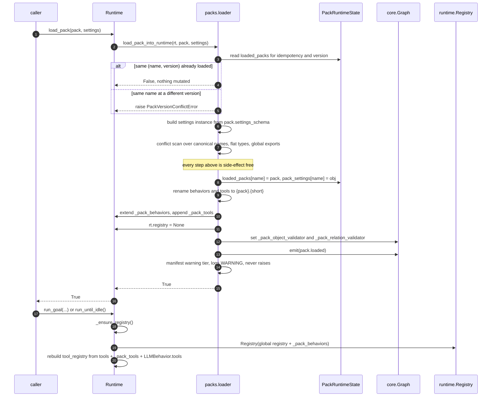
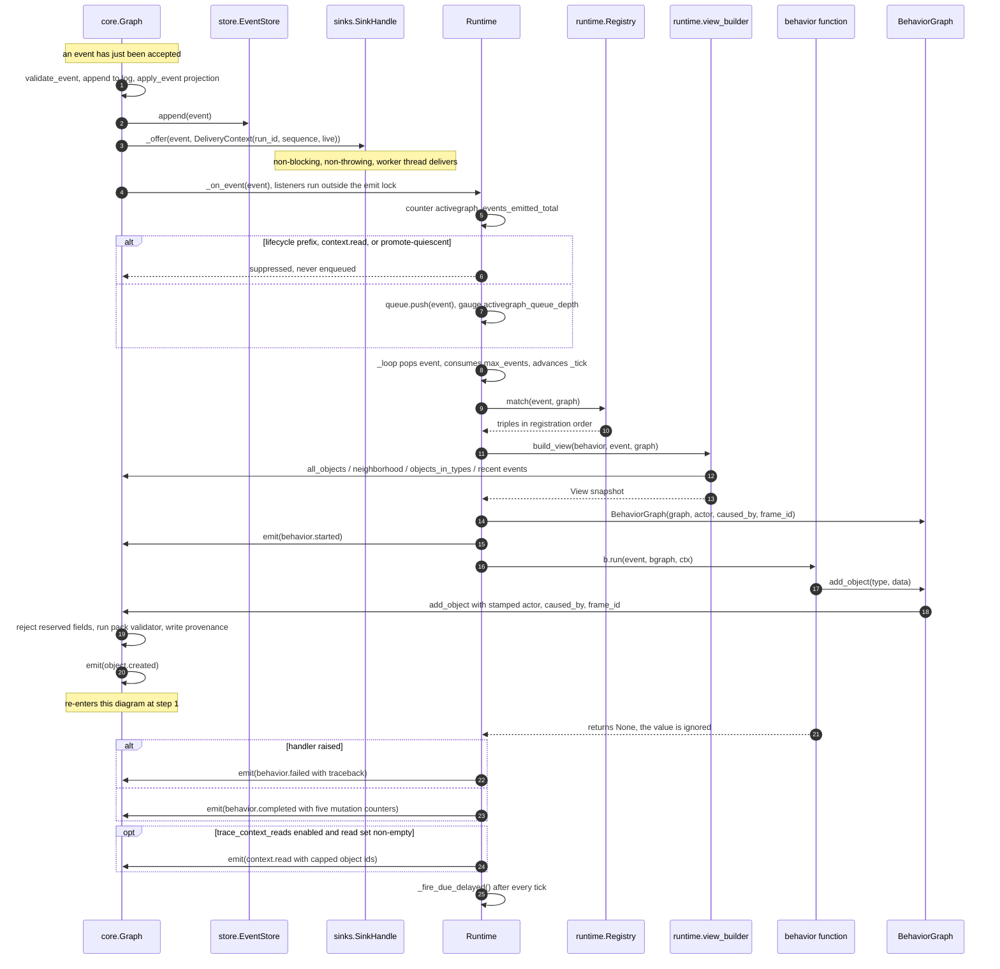
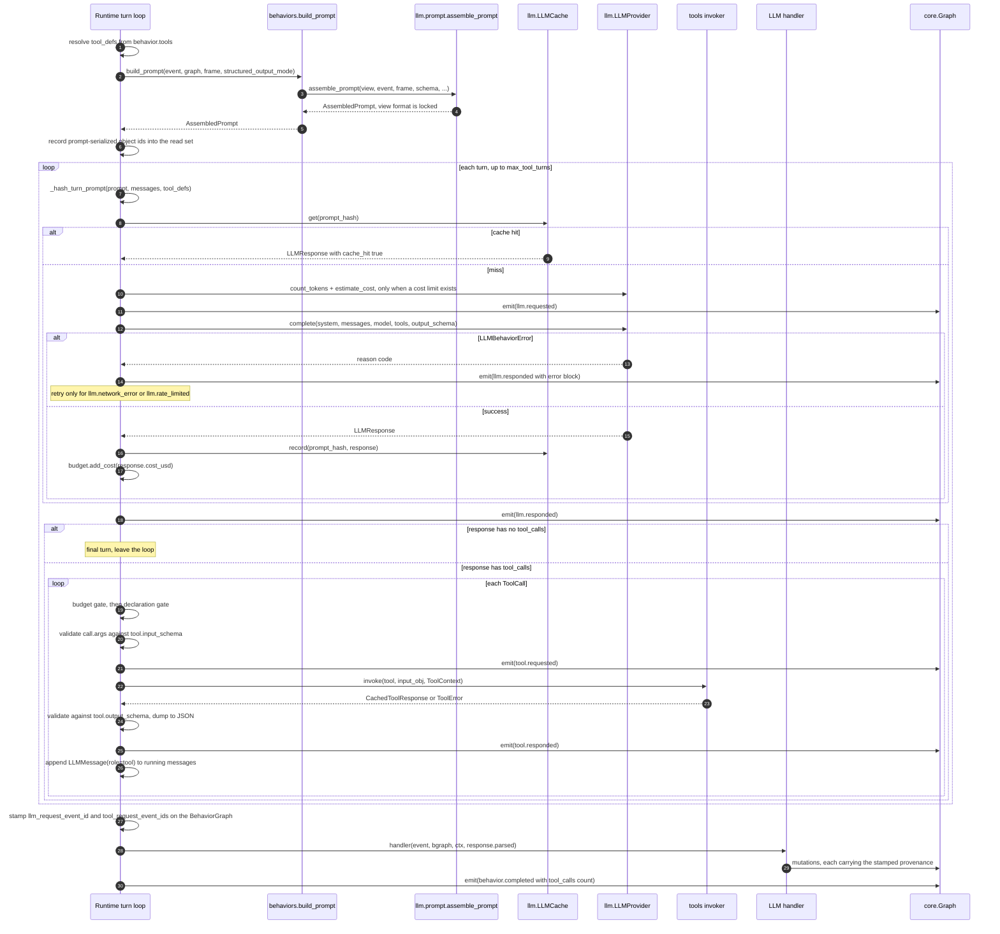
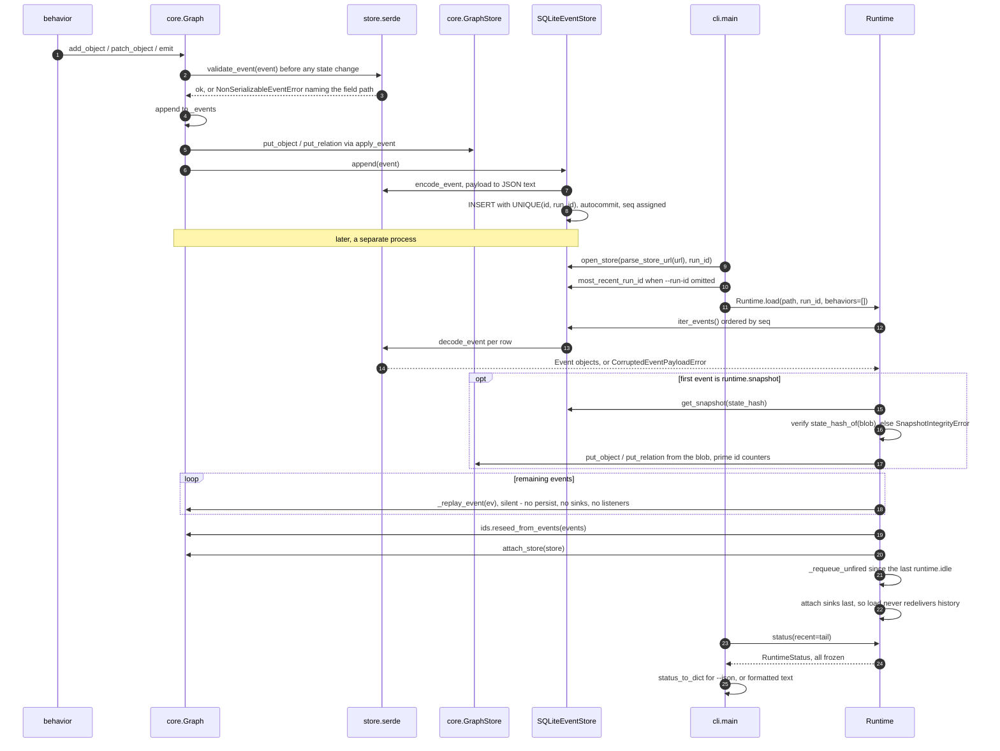
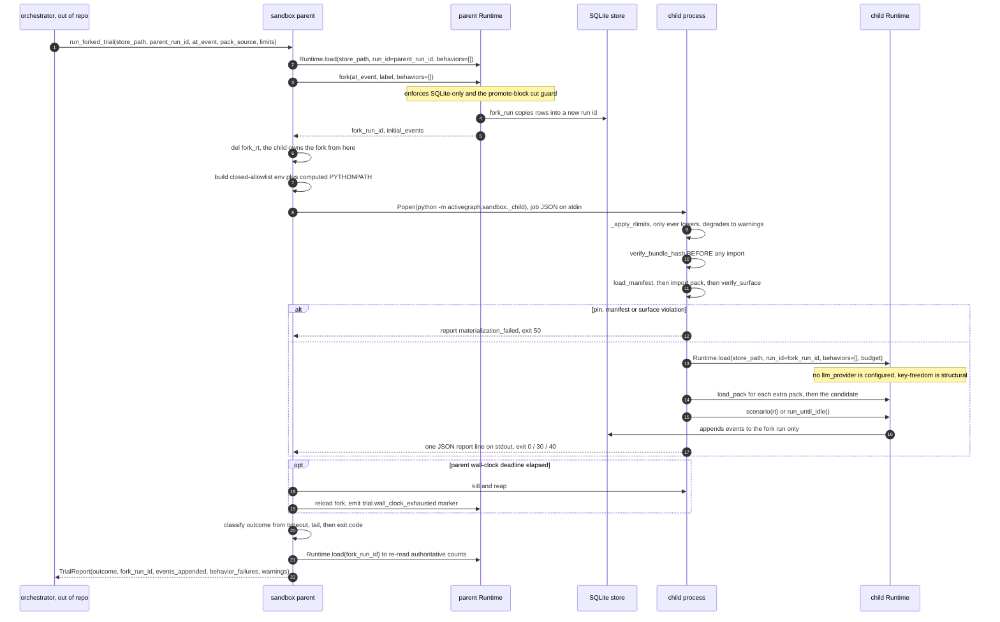
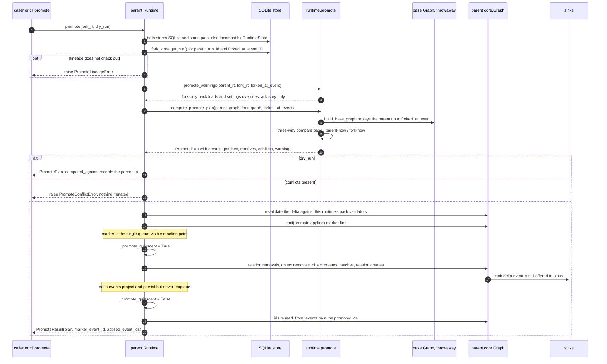

# End-to-End Sequence Diagrams

Six flows that cross subsystem boundaries. Each diagram is preceded by the prose that carries the
`file:line` evidence; the diagrams themselves stay free of citations so they remain readable.
Only steps substantiated by the subsystem research are shown — where a flow is knowingly
incomplete (the sandbox's out-of-repo orchestrator, for instance) that is stated rather than
invented.

Subsystem detail lives in [01-core.md](01-core.md) … [10-observability-trace-cli.md](10-observability-trace-cli.md);
the dependency graph is in [00-overview.md](00-overview.md).

---

## 1. A pack loads and its behaviors reach the runtime

`Runtime.load_pack(pack, settings=None) -> bool` (`activegraph/runtime/runtime.py:2777-2788`) is a
thin front door over `load_pack_into_runtime` (`activegraph/packs/loader.py:55-318`). The load is
**atomic by construction** (CONTRACT v0.9 #6): the idempotency and version checks
(`activegraph/packs/loader.py:63-99`), the settings build (`:101-103`) and the entire conflict scan
(`:105-238`) are side-effect free, and the first mutation is
`state.loaded_packs[pack.name] = pack` at `activegraph/packs/loader.py:244`. Behaviors and tools are
never mutated in place — the loader constructs fresh objects under the canonical name
`{pack}.{short}` (`_rename_behavior` at `:609-687`, `_rename_tool` at `:739-754`) and appends them
to the runtime's private `_pack_behaviors` (`:291`) and `_pack_tools` (`:269`) lists.

Object types and relation types are the asymmetry worth remembering: they are **not** prefixed and
occupy a flat global namespace, so a cross-pack collision raises `PackConflictError`
(`activegraph/packs/loader.py:184-197`, `:274-280`). Two packs contributing the same *short*
behavior or tool name is legal — the short-name lookup table is poisoned with the `AMBIGUOUS`
sentinel (`activegraph/packs/loader.py:206-215`, `:468`) so an unqualified `rt.get_behavior(name)`
raises rather than silently picking one (`activegraph/runtime/runtime.py:2960-2966`).

Nothing is registered with the dispatch `Registry` at load time. The loader sets
`rt.registry = None` and the merge happens on the next entry point, inside `_ensure_registry`
(`activegraph/runtime/runtime.py:955-1019`), which rebuilds `tool_registry` from scratch on **every**
call. The loader also installs the schema-validator callbacks onto the graph
(`activegraph/packs/loader.py:835-843`) and emits `pack.loaded` with a byte-stable settings blob
(`:302-314`, payload built at `:890-922`).

---

## 2. A behavior fires: dispatch, read, mutate, persist, observe

`Graph.emit` is the hinge. Its ordering is contractual (CONTRACT v1.8 #2,
`activegraph/core/graph.py:564-606`): validate → append to the in-memory log → `apply_event`
project → `store.append` → offer to sinks → **release the lock** → call listeners synchronously.
Sinks are offered *before* legacy listeners so a listener re-entering `emit` cannot reverse
observation order (`activegraph/core/graph.py:577-580`), and listeners run outside the `RLock` so a
listener that waits on a second emitting thread cannot deadlock (`:601-603`).

The runtime is one of those listeners. `Runtime._on_event`
(`activegraph/runtime/runtime.py:853-916`) counts every event, then returns early for the
promote-quiescent flag (`:866-867`) and for the lifecycle suppression list — prefixes `behavior.`,
`relation_behavior.`, `runtime.`, `llm.`, `tool.`, `pattern.`, `approval.`, `dev.`, `authority.`
plus the exact type `context.read` (`:873-897`). Everything else is pushed onto a bare `deque`
FIFO (`activegraph/runtime/queue.py:11-27`).

The drain loop is 37 lines (`activegraph/runtime/runtime.py:1262-1298`): pop, consume
`max_events`, advance `_tick`, ask `Registry.match(event, graph)`
(`activegraph/runtime/registry.py:40-70`) which returns matches in **registration order**, then
dispatch. `_invoke` (`activegraph/runtime/runtime.py:1389-1479`) builds the `View` via
`build_view` (`activegraph/runtime/view_builder.py:16-52`), wraps the graph in a `BehaviorGraph`
(`activegraph/runtime/behavior_graph.py:24-169`), emits `behavior.started`, calls
`b.run(event, bgraph, ctx)` (`:1435`), and on any exception other than `ReplayDivergenceError`
emits `behavior.failed` rather than propagating (`:1436-1458`).

Every mutation the behavior makes re-enters `Graph.emit` at the top of this diagram, carrying
framework-written provenance the behavior cannot forge — `actor`, `caused_by`, `frame_id`, plus
`llm_request_event_id` and `tool_request_event_ids` for LLM behaviors
(`activegraph/runtime/behavior_graph.py:36-67`, stamped by `Graph._provenance` at
`activegraph/core/graph.py:968-995`). The five mutation counters ride the `behavior.completed`
payload (`activegraph/runtime/runtime.py:1465-1476`).

---

## 3. An LLM behavior's turn loop calls a tool

`_invoke_llm` (`activegraph/runtime/runtime.py:1481-1560`) is a wrapper whose only job is to make
the context-read trace commit wrap all ~15 failure returns of the body without restructuring the
loop (`:1546-1551`). The body (`activegraph/runtime/runtime.py:1562-2093`) has a documented order
at `:1489-1503`.

Prompt assembly is pure and lives in `llm/`: `LLMBehavior.build_prompt`
(`activegraph/behaviors/base.py:139-193`) lazily calls `assemble_prompt`
(`activegraph/llm/prompt.py:461`), which serializes the `View` in a **locked, snapshot-tested
format** (`activegraph/llm/prompt.py:112`, `:16-18`) and strips `provenance` / `timestamp` /
`run_id` from the event payload so a fork's regenerated prompt still hits cache
(`activegraph/llm/prompt.py:364-367`, `:378-399`).

The cache key is `_hash_turn_prompt` (`activegraph/runtime/runtime.py:3974`, payload at
`:3990-4006`) — note this is **not** `AssembledPrompt.hash()`, which omits the `tools` key and is
now test-only (`activegraph/llm/prompt.py:81-98`). Cache reads are gated on `replay_llm_cache`
(`:1651`); writes are not (`:1889-1896`). A cache hit forces `max_attempts = 1` (`:1696`).

Retries live entirely in the runtime — there is no retry logic anywhere in `activegraph/llm/`.
The transient set is `{"llm.network_error", "llm.rate_limited"}`
(`activegraph/runtime/runtime.py:3909`); a retry emits a fresh `llm.requested` carrying
`attempt_index` / `max_attempts` / `retry_of` (`:1731-1735`) and the sleep is a blocking
`time.sleep` on the runtime thread (`:1835`, `:1875`).

Tool dispatch runs inside the turn: budget gates first (`max_tool_calls` before the cost gate,
`:1943-1964`), then the declaration gate — an LLM may only call tools the behavior declared, or the
call fails as `tool.unknown_tool` (`:1966-1987`). `_invoke_tool`
(`activegraph/runtime/runtime.py:2097-2321`) always emits a complete `tool.requested` /
`tool.responded` pair, *even for schema-invalid input*, so the trace is never partial (`:2125-2160`).
The validated output is re-dumped to JSON before it lands in the event (`:2250-2255`) and echoed
back to the model as `LLMMessage(role="tool", ...)` (`:2315-2320`).

Provenance for the whole turn is stamped just before the handler runs (`:2064-2066`) so every
object the handler creates carries the `llm.requested` id whose response actually fed it, plus
every `tool.requested` id from the loop.

---

## 4. A run is persisted, then re-opened by the CLI

On the write side, serialization is a **pre-check, not a post-hoc encode**: `Graph.emit` calls
`validate_event` (`activegraph/store/serde.py:201-203`) *before* touching any state, so a
non-serializable payload can never enter the in-memory log either
(`activegraph/core/graph.py:569-572`). Note the guard is conditional on a store being attached —
a store-less graph accepts unserializable payloads despite the comment claiming otherwise. The
encode adapters narrow `Decimal → str`, `datetime/date → ISO 8601`, `set → sorted list`
(`activegraph/store/serde.py:40-48`), and the narrowing is **one-way**: decoding does not
reconstruct those types (`:8-11`).

Ordering authority in SQLite is the `seq` AUTOINCREMENT column, never `timestamp` — *"wall clocks
can lie; AUTOINCREMENT cannot"* (`activegraph/store/sqlite.py:28-29`); every `iter_events` sorts
`ORDER BY seq` (`:256`). Event ids are unique per `(id, run_id)` rather than globally, precisely so
a fork can preserve the parent's `evt_017` (`activegraph/store/sqlite.py:31-36`).

`activegraph inspect <url>` (`activegraph/cli/main.py:204-247`) does no business logic. It resolves
the store through `_open_store_or_die` (`:58-75`) and `_most_recent_run_id_or_die` (`:78-106`),
constructs the runtime via `Runtime.load` — never a bare `Runtime(...)` — at `:280`, then calls
`rt.status(recent=tail)` (`activegraph/runtime/runtime.py:2592-2701`) and renders it, using
`status_to_dict` (`activegraph/observability/status.py:76-93`) for `--json`.

`Runtime.load` (`activegraph/runtime/runtime.py:3308-3361`) is where the round trip closes: if the
first event is `runtime.snapshot` it materializes the compaction snapshot with a hash check that
fails loud (`_materialize_snapshot`, `:4489-4549`, raising `SnapshotIntegrityError`), replays every
event through `graph._replay_event` — the *silent* mutator that never persists, never offers sinks
and never fires listeners (`activegraph/core/graph.py:610-618`) — then reseeds the id generators
(`activegraph/core/ids.py:90-136`), attaches the store, and re-pushes any non-lifecycle events
emitted after the last `runtime.idle` high-water mark (`_requeue_unfired`,
`activegraph/runtime/runtime.py:4106-4172`). Sinks are attached **last**, after replay, so a load
never redelivers history (`:3390`).

---

## 5. A candidate pack is trialed in the sandbox

The division of authority is fixed: **the parent forks, the child only appends to that fork's run
id** (`activegraph/sandbox/__init__.py:11-14`). `run_forked_trial`
(`activegraph/sandbox/__init__.py:533-563`) is a compatibility wrapper over
`_run_forked_trial_local` (`:378-530`), which since CONTRACT v1.8 #9–#12 sits behind the
serialized, provider-neutral `TrialExecutor` protocol (`activegraph/sandbox/executor.py:218-231`).

The parent creates the fork with full `fork()` semantics — SQLite-only, promote-block cut guard —
then **drops its handle** (`del fork_rt`, `activegraph/sandbox/__init__.py:426`). Two channels
cross into the child and are kept strictly separate (`:207-232`): the environment is a **closed
allow-list** of `PATH`, `HOME`, `LANG` plus explicit `env_passthrough`, so no ambient API key
reaches candidate code; the code location is an **explicit** `PYTHONPATH` computed from the
parent's resolved `sys.path`, never forwarded from ambient env (`:183-204`).

Materialization inside the child is **pin-first** and the order is load-bearing
(`activegraph/sandbox/_child.py:138-167`): `verify_bundle_hash` **before any import**, then
`load_manifest`, then import, then `verify_surface` two-way against the live `Pack`. Schema v2
requires an exact lowercase SHA-256 pin for the candidate and every extra; the child verifies it
unconditionally even when manifest checks are disabled. The reader accepts schema v1 only as a
pinned migration input and rejects missing/empty v1 pins before the parent fork seam (2026-08-12
Set 4 amendment #4).

Three independent nets bound the trial: rlimits in the child (`RLIMIT_AS`, `RLIMIT_CPU`, which only
ever *lower* and degrade loudly to warnings rather than crashing —
`activegraph/sandbox/_child.py:57-109`), a parent-side wall-clock kill (`:289-292`), and the
runtime's own `Budget` (`activegraph/sandbox/_child.py:243-252`). Key-freedom is structural: the
child configures no LLM provider at all, so an LLM-calling candidate fails loud at registration
(`:254-259`).

Classification is total and closed (`activegraph/sandbox/__init__.py:451-466`), and **the store is
the record** — `events_appended` and `behavior_failures` are re-read from the fork's run after the
child exits; the stdout tail is a signal only (`:489-518`). On timeout the parent appends its own
`trial.wall_clock_exhausted` marker (`:496-514`).

Not verifiable from this repo: the orchestration *around* the trial — proposal, static gate, promote
— lives in the out-of-repo `activegraph-packs` evolution pack. Nothing under `activegraph/` calls
`run_forked_trial`.

---

## 6. A fork is promoted into its parent

`Runtime.promote(fork, *, dry_run=False)` (`activegraph/runtime/runtime.py:3586-3887`) is
**fail-closed and atomic**: any conflict raises `PromoteConflictError` *before the first mutation*
(`:3718-3723`), and there is no `force=` flag — the escape hatch is to re-fork
(`activegraph/runtime/promote.py:22-23`).

Preconditions are checked in a fixed order and lineage comes from the **store**, not from what the
caller claims: both runtimes must be on `SQLiteEventStore` (`:3637-3667`) and on the same file path
(`:3668-3677`); `fork_store.get_run().parent_run_id` must equal `self.run_id` (`:3679-3690`); a
`forked_at_event_id` must be recorded (`:3691-3698`). Grandchildren promote one level at a time.

The plan is a **pure three-way comparison**, not event replay. `build_base_graph`
(`activegraph/runtime/promote.py:161-182`) replays the parent's log up to `forked_at_event` into a
throwaway `Graph`, and `compute_promote_plan` (`:188-353`) compares base / parent-now / fork-now:
fork-only changes promote, both-sides changes conflict — *including identical concurrent edits*,
because v1 makes no semantic judgment (`:243-247`) — and parent-only changes are left alone.
Referential integrity is part of the conflict check, via `dangling_relation` (`:294-314`) and
`orphaning_removal` (`:316-337`). Relation "patches" are modelled as a remove+create pair sharing
one id, which is why `PromotePlan` has no `relation_patches` field (`:277-281`).

Application is **quiescent**: the `promote.applied` marker is emitted *first*, then
`_promote_quiescent` is raised (`activegraph/runtime/runtime.py:3798`) so the delta events project
and persist but never enqueue for behavior matching — the marker is the single reaction point
(`activegraph/runtime/runtime.py:862-867`). Apply order is load-bearing: relation removals → object
removals → object creates → object patches → relation creates (`:3800-3871`). Sinks still observe
the delta events even though scheduling ignores them. Finally the id generators are reseeded past
the promoted ids so future mints cannot collide (`:3875-3877`).

Pack code is never adopted — fork-only `pack.loaded` and `pack.settings_overridden` events surface
as plan **warnings** only (`activegraph/runtime/promote.py:356-411`) — but the delta *is*
revalidated against this runtime's pack schemas before it is applied
(`activegraph/runtime/runtime.py:3735-3754`).

