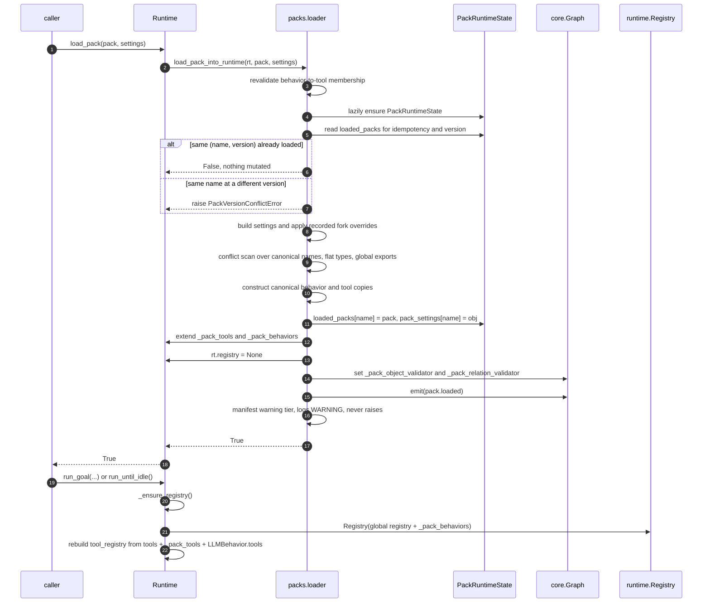
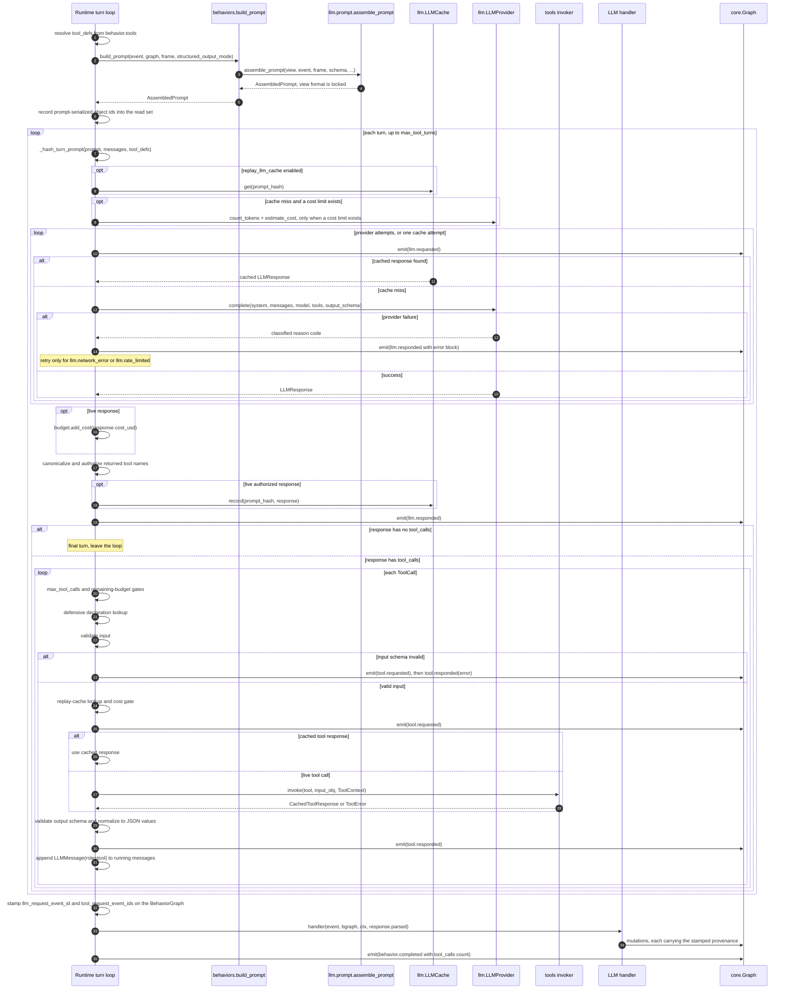
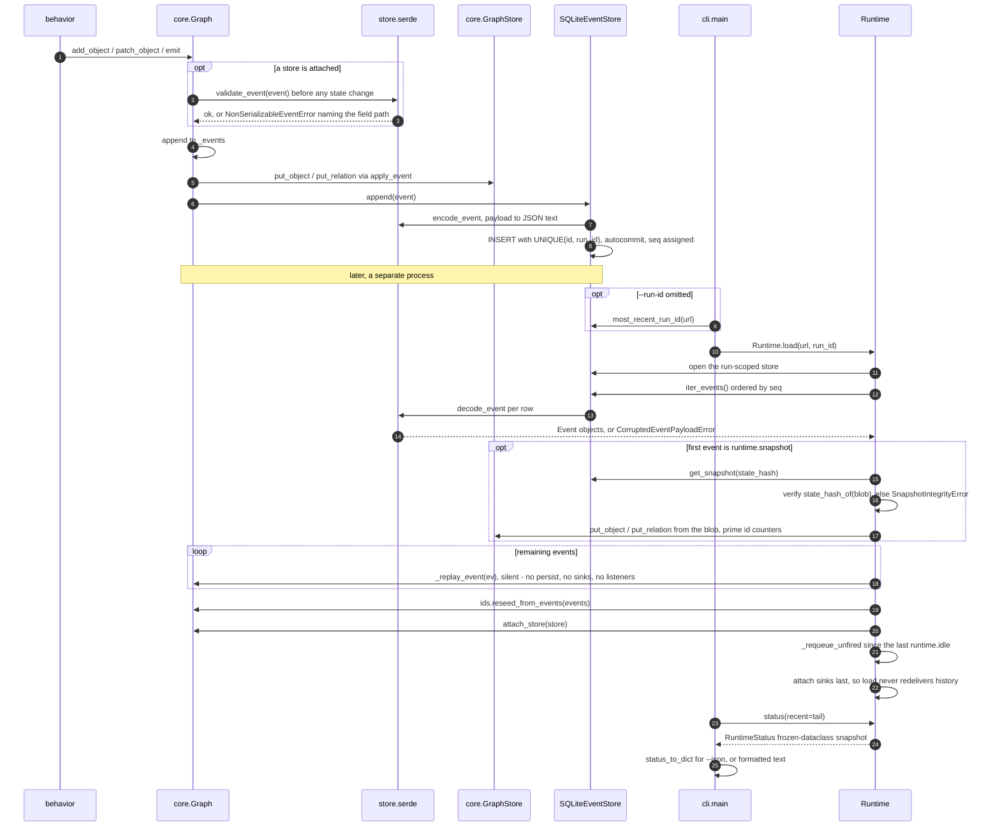
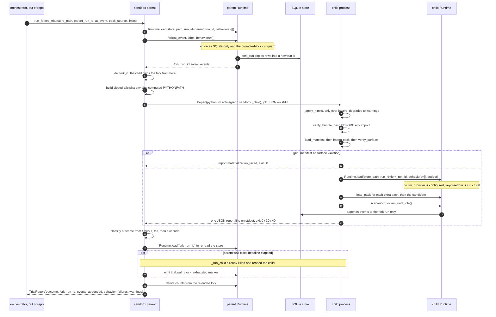
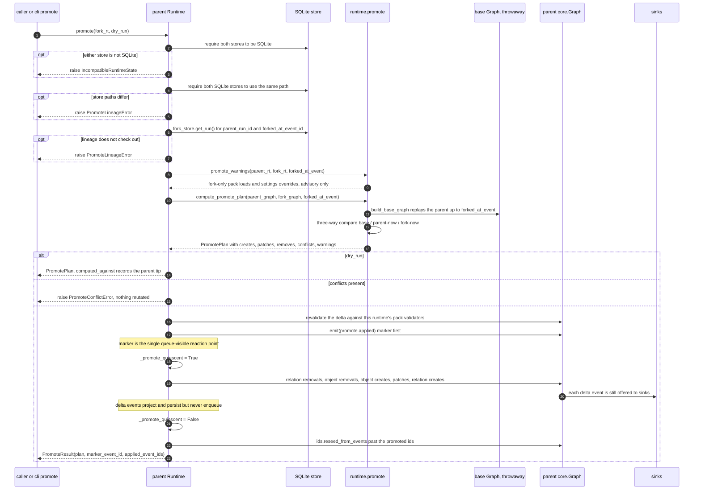

# End-to-End Sequence Diagrams

Six flows that cross subsystem boundaries. Each diagram is preceded by the prose that carries the
`file:line` evidence; the diagrams themselves stay free of citations so they remain readable.
Only steps substantiated by the subsystem research are shown — where a flow is knowingly
incomplete (the sandbox's out-of-repo orchestrator, for instance) that is stated rather than
invented.

Subsystem detail lives in [01-core.md](01-core.md) … [10-observability-trace-cli.md](10-observability-trace-cli.md);
the dependency graph is in [00-overview.md](00-overview.md).

---

## 1. A pack loads and its behaviors reach the runtime

`Runtime.load_pack(pack, settings=None) -> bool` (`activegraph/runtime/runtime.py:3261-3273`) is a
thin front door over `load_pack_into_runtime` (`activegraph/packs/loader.py:55-322`). Pack
contributions are committed only after the loader revalidates tool membership (`:63-66`), builds
and applies settings (`:106-109`), completes the conflict scan (`:110-232`), and constructs all
canonical behavior and tool copies (`:234-255`). The contribution mutation begins with
`state.loaded_packs[pack.name] = pack` at `:259`. One internal caveat narrows the docstring's
stronger “runtime exactly unchanged” wording: `_ensure_pack_state` initializes the otherwise-empty
lazy state container at `:69` before settings validation, so a failed *first* settings build can
leave that empty container installed. A later failure from the attached store or a listener while
emitting `pack.loaded` can also propagate after the contribution mutations at `:259-304`; the
atomicity guarantee therefore covers the loader's own validation/conflict failures, not arbitrary
failures at that late event boundary. Behaviors and tools themselves are never mutated in place —
`_wrap_behavior_for_pack` (`:673-759`) and `_rename_tool` (`:822-837`) return fresh objects under
the canonical name `{pack}.{short}`, which are appended to `_pack_behaviors` (`:292-295`) and
`_pack_tools` (`:269`).

Object types and relation types are the asymmetry worth remembering: they are **not** prefixed and
occupy a flat global namespace, so a cross-pack collision raises `PackConflictError`
(`activegraph/packs/loader.py:189-202`, registrations at `:277-284`). Two packs contributing the
same *short* behavior or tool name is legal — the short-name lookup table is poisoned with the
`AMBIGUOUS` sentinel (`activegraph/packs/loader.py:533-544`) so an unqualified
`rt.get_behavior(name)` raises rather than silently picking one
(`activegraph/runtime/runtime.py:3419-3459`).

Nothing is registered with the dispatch `Registry` at load time. The loader sets
`rt.registry = None` and the merge happens on the next entry point, inside `_ensure_registry`
(`activegraph/runtime/runtime.py:1243-1328`), which rebuilds `tool_registry` from scratch on
**every** call. The loader also installs the schema-validator callbacks onto the graph
(`activegraph/packs/loader.py:918-926`) and emits `pack.loaded` (`:306-318`) with the byte-stable
settings value built at `:973-1013`.

---

## 2. A behavior fires: dispatch, read, mutate, persist, observe

`Graph.emit` is the hinge. Its ordering is contractual (CONTRACT v1.8 #2,
`activegraph/core/graph.py:584-625`): validate → append to the in-memory log → `apply_event`
project → `store.append` → offer to sinks → **release the lock** → call listeners synchronously.
Sinks are offered *before* legacy listeners so a listener re-entering `emit` cannot reverse
observation order (`activegraph/core/graph.py:597-620`), and listeners run outside the `RLock` so a
listener that waits on a second emitting thread cannot deadlock (`:621-625`).

The runtime is one of those listeners. `Runtime._on_event`
(`activegraph/runtime/runtime.py:1060-1092`) counts every event and records LLM/tool event metrics,
then returns early for the promote-quiescent flag (`:1070-1075`) or when the centralized event
policy says the type does not schedule behaviors (`:1076-1079`). That policy suppresses the
prefixes `behavior.`, `relation_behavior.`, `runtime.`, `llm.`, `tool.`, `pattern.`, `approval.`,
`embedding.`, `dev.`, and `authority.`, plus the exact type `context.read`
(`activegraph/runtime/event_policy.py:13-53`). Everything else is pushed onto a bare `deque` FIFO
(`activegraph/runtime/queue.py:11-27`).

The drain loop (`activegraph/runtime/runtime.py:1697-1734`) pops, consumes `max_events`, advances
`_tick`, and asks `Registry.match(event, graph)`
(`activegraph/runtime/registry.py:91-104`) which returns matches in **registration order**, then
dispatches or schedules them. `_invoke` (`activegraph/runtime/runtime.py:1822-1908`) builds the
`View` via `build_view` (`activegraph/runtime/view_builder.py:16-52`), wraps the graph in a
`BehaviorGraph` (`activegraph/runtime/behavior_graph.py:35-169`), emits `behavior.started`, calls
`b.run(event, bgraph, ctx)` (`activegraph/runtime/runtime.py:1868`), and on any exception other
than `ReplayDivergenceError` emits `behavior.failed` rather than propagating (`:1869-1887`).

Every mutation the behavior makes re-enters `Graph.emit` at the top of this diagram, carrying
framework-written provenance the behavior cannot forge — `actor`, `caused_by`, `frame_id`, plus
`llm_request_event_id` and `tool_request_event_ids` for LLM behaviors
(`activegraph/runtime/behavior_graph.py:35-67`, stamped by `Graph._provenance` at
`activegraph/core/graph.py:994-1021`). The five mutation counters ride the `behavior.completed`
payload (`activegraph/runtime/runtime.py:1894-1905`).

---

## 3. An LLM behavior's turn loop calls a tool

`_invoke_llm` (`activegraph/runtime/runtime.py:1910-2000`) prepares the view, context,
`BehaviorGraph`, metrics, and `behavior.started` event, then delegates to `_invoke_llm_body`
(`:2002-2561`). Keeping the turn loop in that body lets the wrapper emit one context-read trace
after every normal body exit without duplicating it across the body's many failure returns
(`:1977-2000`). A propagating `ReplayDivergenceError` skips that commit.

Prompt assembly is pure and lives in `llm/`: `LLMBehavior.build_prompt`
(`activegraph/behaviors/base.py:146-200`) lazily calls `assemble_prompt`
(`activegraph/llm/prompt.py:458-483`), which serializes the `View` in a **locked,
snapshot-tested format** (`activegraph/llm/prompt.py:106-118`) and recursively strips
`provenance`, `timestamp`, and `run_id` keys from the event payload so a fork's regenerated prompt
still hits cache (`:360-396`).

The runtime cache key is `_hash_turn_prompt` (`activegraph/runtime/runtime.py:4527-4555`), which
uses the shared prompt-identity builder and explicitly includes the current running messages and a
`tools` key. It is deliberately a different identity domain from the public
`AssembledPrompt.hash()`, which omits `tools` (`activegraph/llm/prompt_identity.py:19-55`;
`activegraph/llm/prompt.py:82-103`). Cache reads are gated on `replay_llm_cache`
(`activegraph/runtime/runtime.py:2078-2081`); successful live responses are recorded regardless
of that read flag (`:2361-2368`). A cache hit forces `max_attempts = 1` (`:2123-2128`).

Retry attempts and sleeps are owned by the runtime; provider adapters only classify failures and
surface any `retry_after_seconds`. The transient set is
`{"llm.network_error", "llm.rate_limited"}` (`activegraph/runtime/runtime.py:4435-4439`); a retry
emits a fresh `llm.requested` carrying `attempt_index`, `max_attempts`, and `retry_of`
(`:2160-2164`), and the delay is a blocking `time.sleep` on the runtime thread
(`:2271-2281`, `:2311-2321`).

Tool dispatch runs inside the turn. The response's tool names are canonicalized against the
behavior's resolved declarations before the response is cached or emitted; an undeclared name
fails as `tool.unknown_tool` (`activegraph/runtime/runtime.py:2344-2359`). For each authorized call,
the specific `max_tool_calls` gate runs before the generic remaining-budget gate and defensive
declaration lookup (`:2409-2449`). `_invoke_tool` (`:2565-2781`) validates input before its cache
and cost gates; schema-invalid input still emits a complete `tool.requested` / `tool.responded`
error pair (`:2583-2628`). A valid output-schema result is normalized with
`model_dump(mode="json")` when supported (`:2713-2723`), placed in `tool.responded` (`:2752-2768`),
and JSON-encoded into `LLMMessage(role="tool", ...)` for the next turn (`:2770-2780`). A tool cost
rejection occurs before `tool.requested` (`:2639-2651`) and therefore has no tool-event pair.

Provenance for the whole turn is stamped just before the handler runs (`:2525-2530`) so every
object the handler creates carries the `llm.requested` id whose response actually fed it, plus
every `tool.requested` id from the loop.

---

## 4. A run is persisted, then re-opened by the CLI

On the write side, serialization is a **pre-check, not a post-hoc encode**: `Graph.emit` calls
`validate_event` (`activegraph/store/serde.py:201-203`) *before* touching any state, so a
non-serializable payload can never enter the in-memory log either
(`activegraph/core/graph.py:584-596`). The guard is intentionally conditional on a store being
attached, so a store-less graph accepts unserializable payloads. The
encode adapters narrow `Decimal → str`, `datetime/date → ISO 8601`, `set → sorted list`
(`activegraph/store/serde.py:40-48`), and the narrowing is **one-way**: decoding does not
reconstruct those types (`:8-11`).

Ordering authority in SQLite is the `seq` AUTOINCREMENT column, never `timestamp` — *"wall clocks
can lie; AUTOINCREMENT cannot"* (`activegraph/store/sqlite.py:28-29`); every `iter_events` sorts
`ORDER BY seq` (`:366-381`). Event ids are unique per `(id, run_id)` rather than globally,
precisely so a fork can preserve the parent's `evt_017` (`activegraph/store/sqlite.py:31-36`,
schema at `:59-72`).

For its default status path, `activegraph inspect <url>` (`activegraph/cli/main.py:224-325`) selects
the run with `_most_recent_run_id_or_die` when `--run-id` is absent (`:92-125`, call at `:295`),
then constructs the runtime via `Runtime.load` — never a bare `Runtime(...)` — at `:301`. It calls
`rt.status(recent=tail)` (`activegraph/runtime/runtime.py:3069-3184`) and renders the snapshot,
using `status_to_dict` (`activegraph/observability/status.py:82-89`) for `--json`. `inspect` does not
call `_open_store_or_die`; `Runtime.load` owns the store open on this path.

`Runtime.load` (`activegraph/runtime/runtime.py:3745-3903`) is where the round trip closes: if the
first event is `runtime.snapshot` it materializes the compaction snapshot with a hash check that
fails loud (`_materialize_snapshot`, `:5031-5091`, raising `SnapshotIntegrityError`), replays every
event through `graph._replay_event` — the *silent* mutator that never persists, never offers sinks
and never fires listeners (`activegraph/core/graph.py:630-638`) — then reseeds the id generators
(`activegraph/core/ids.py:90-136`), attaches the store, and re-pushes any non-lifecycle events
emitted after the last `runtime.idle` high-water mark (`_requeue_unfired`,
`activegraph/runtime/runtime.py:4648-4725`). Sinks are attached **last**, after replay and strict
verification, so a load never redelivers history (`:3895-3898`).

---

## 5. A candidate pack is trialed in the sandbox

The division of authority is fixed: **the parent forks, the child only appends to that fork's run
id** (`activegraph/sandbox/__init__.py:11-14`). `run_forked_trial`
(`activegraph/sandbox/__init__.py:546-575`) is a compatibility wrapper over
`_run_forked_trial_local` (`:391-543`), which since CONTRACT v1.8 #9–#12 sits behind the
serialized, provider-neutral `TrialExecutor` protocol (`activegraph/sandbox/executor.py:224-269`).

The parent creates the fork with full `fork()` semantics — SQLite-only, promote-block cut guard —
then **drops its handle** (`del fork_rt`, `activegraph/sandbox/__init__.py:435-439`). Two channels
cross into the child and are kept strictly separate (`:196-245`): the environment is a **closed
allow-list** of `PATH`, `HOME`, `LANG` plus explicit `env_passthrough`, so no ambient API key
reaches candidate code; the code location is an **explicit** `PYTHONPATH` computed from the
parent's resolved `sys.path`, never forwarded from ambient env.

Materialization inside the child is **pin-first** and the order is load-bearing
(`activegraph/sandbox/_child.py:120-169`): `verify_bundle_hash` **before any import**, then
`load_manifest`, then import, then `verify_surface` two-way against the live `Pack`. Schema v2
requires an exact `sha256:` plus 64 lowercase hexadecimal pin for the candidate and every extra
(`activegraph/sandbox/__init__.py:102-126`); the child verifies it unconditionally even when
manifest checks are disabled (`activegraph/sandbox/_child.py:140-144`). The serialized-spec reader
accepts schema v1 only as a pinned migration input, normalizes it to v2, and rejects missing or
invalid v1 pins before the parent fork seam (`activegraph/sandbox/executor.py:77-118`, `:326-349`;
2026-08-12 Set 4 amendment #4). This resolves the original audit finding that bundle pins defaulted
off.

Three independent nets bound the trial: requested rlimits in the child (`RLIMIT_AS`, `RLIMIT_CPU`,
which only ever *lower* and turn `setrlimit` failures into warnings rather than crashing —
`activegraph/sandbox/_child.py:57-109`), a parent-side wall-clock kill
(`activegraph/sandbox/__init__.py:274-305`), and the runtime's own `Budget`
(`activegraph/sandbox/_child.py:242-260`). Key-freedom is structural: the
child configures no LLM provider at all, so an LLM-calling candidate fails loud at registration
(`activegraph/sandbox/_child.py:247-260`).

Classification is total and closed (`activegraph/sandbox/__init__.py:464-479`), and **the store is
the record for counts** — `events_appended` and `behavior_failures` are re-read from the fork's run
after the child exits; the stdout tail supplies outcome/detail rather than authoritative counts
(`:502-531`). On timeout the parent appends its own `trial.wall_clock_exhausted` marker
(`:507-527`). Because `events_appended` is calculated after that append (`:528-530`), the timeout
count includes this one parent-authored marker in addition to child-authored events.

Not verifiable from this repo: the orchestration *around* the trial — proposal, static gate, promote
— lives in the out-of-repo `activegraph-packs` evolution pack. Nothing under `activegraph/` calls
`run_forked_trial`.

---

## 6. A fork is promoted into its parent

`Runtime.promote(fork, *, dry_run=False)` (`activegraph/runtime/runtime.py:4110-4409`) is
**fail-closed and atomic**: any conflict raises `PromoteConflictError` *before the first mutation*
(`:4242-4249`), and there is no `force=` flag — the escape hatch is to re-fork
(`activegraph/runtime/promote.py:14-17`).

Preconditions are checked in a fixed order and lineage comes from the **store**, not from what the
caller claims: both runtimes must be on `SQLiteEventStore` (`:4160-4193`) and on the same file path
(`:4194-4203`); `fork_store.get_run().parent_run_id` must equal `self.run_id` (`:4205-4216`); a
`forked_at_event_id` must be recorded (`:4217-4224`). Grandchildren promote one level at a time.

The plan is a **pure three-way comparison**, not event replay. `build_base_graph`
(`activegraph/runtime/promote.py:160-181`) replays the parent's log up to `forked_at_event` into a
throwaway `Graph`, and `compute_promote_plan` (`:188-353`) compares base / parent-now / fork-now:
fork-only changes promote, both-sides changes conflict — *including identical concurrent edits*,
because v1 makes no semantic judgment (`:241-247`) — and parent-only changes are left alone.
Referential integrity is part of the conflict check, via `dangling_relation` (`:293-313`) and
`orphaning_removal` (`:315-336`). Relation "patches" are modelled as a remove+create pair sharing
one id, which is why `PromotePlan` has no `relation_patches` field (`:277-281`).

Application is **quiescent**: the `promote.applied` marker is emitted *first*, then
`_promote_quiescent` is raised (`activegraph/runtime/runtime.py:4282-4325`) so the delta events
project and persist but never enqueue for behavior matching — the marker is the single reaction
point (`activegraph/runtime/runtime.py:1070-1079`). Apply order is load-bearing: relation removals
→ object removals → object creates → object patches → relation creates (`:4326-4398`). Sinks still
observe the delta events even though scheduling ignores them. Finally the id generators are
reseeded past the promoted ids so future mints cannot collide (`:4401-4403`).

Pack code is never adopted — fork-only `pack.loaded` and `pack.settings_overridden` events surface
as plan **warnings** only (`activegraph/runtime/promote.py:356-411`) — but the delta *is*
revalidated against this runtime's pack schemas before it is applied
(`activegraph/runtime/runtime.py:4251-4280`).

