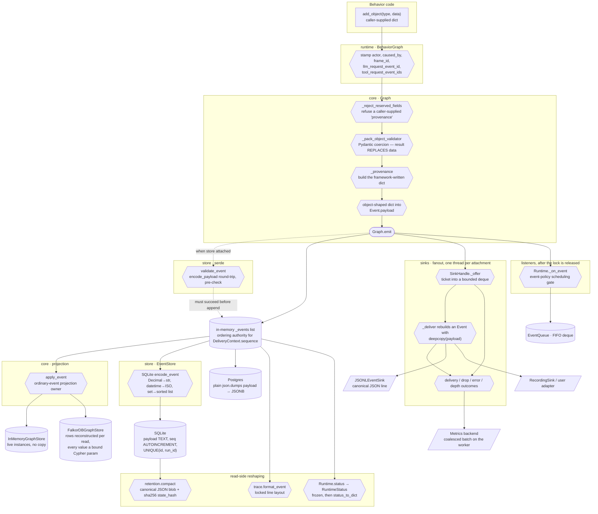
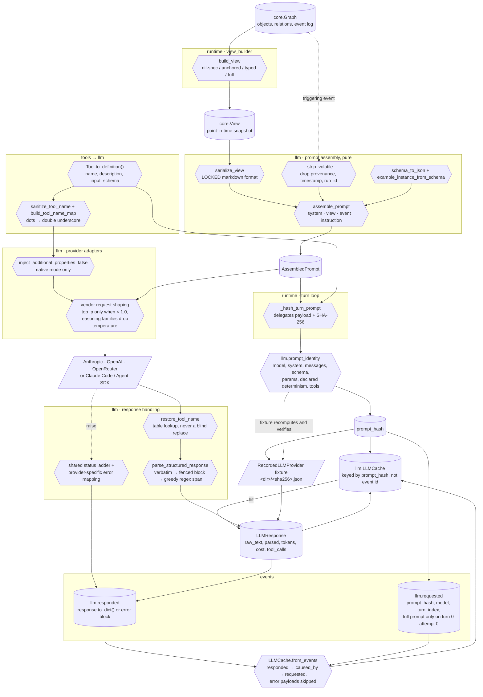

# Data Flow

Where [11-sequence-diagrams.md](11-sequence-diagrams.md) shows *control* — who calls whom, in what
order — this document shows **data**: how one piece of information changes shape as it crosses
subsystem boundaries, and where it fans out to more than one destination.

Two flows cover almost everything the framework does with data:

1. **A graph mutation**, from a behavior's intent to durable bytes and external observers.
2. **An LLM request/response**, from graph state to provider wire format and back into the log.

Each diagram is followed by a table naming every transformation point with its `file:line`.

---

## 1. A graph mutation: intent → provenance → event → bytes → observers

The live mutation path has exactly one funnel: every newly accepted event passes through
`Graph.emit` (`activegraph/core/graph.py:584-626`). Recorded reconstruction is the deliberate
exception: `Graph._replay_event` appends and projects history without persistence, sinks, or
listeners (`activegraph/core/graph.py:630-638`). Downstream, a live event has five possible
outcomes: the in-memory log, the materialized projection, an optional durable event store,
optional sink attachments, and listeners. Each reshapes or consumes it differently.

### Transformation points

| # | Transformation | Where | What changes shape |
|---|---|---|---|
| 1 | Provenance kwargs stamped | `activegraph/runtime/behavior_graph.py:35-67,71-153` | The behavior's plain arguments gain `actor`, `caused_by`, `frame_id`, and for LLM behaviors `llm_request_event_id` + `tool_request_event_ids`. The behavior cannot forge these. |
| 2 | Reserved-field rejection | `activegraph/core/graph.py:109-136,654-657,707-710,814-816,871-873` | A caller-supplied `provenance` key raises `ReservedFieldError`. Pre-v1.10 this was a *silent strip*, so a caller who thought they attached provenance had attached nothing. |
| 3 | Pack schema validation | `activegraph/core/graph.py:658-663`, installed at `activegraph/packs/loader.py:301-304,918-944` | The validator's **return value replaces** `data` — Pydantic coercion is a real transformation, not just a check. Unknown types pass through, preserving pre-v0.9 untyped semantics. |
| 4 | Provenance construction | `activegraph/core/graph.py:992-1021` | Emits `{created_by, caused_by_event, frame_id, timestamp, evidence, run_id}` plus the optional LLM/tool ids. |
| 5 | Object-shaped dict → event payload | `activegraph/core/graph.py:672-690,1037-1103` | The builder combines generated id, validated data, version 1, and framework provenance into the nested `object.created` payload; the projector reconstructs an `Object` from that mirror schema. Seven event types have projection branches; every other type falls through as a projection no-op. |
| 6 | Serialization pre-check | `activegraph/store/serde.py:201-203`, called at `activegraph/core/graph.py:587-592` | `encode_payload` is run and discarded purely to fail fast, but only when a store is attached. A store-less graph accepts unserializable payloads. |
| 7 | Projection | `activegraph/core/graph.py:836-844,1027-1103` | `apply_event` owns ordinary-event projection. For `patch.applied` it applies update or replace, increments `version` exactly once, and writes the object back (`:1085-1096`); the patch builder already placed the changed-field `diff` in the event payload. Snapshot load separately seeds projected state before suffix replay (`activegraph/runtime/runtime.py:5063-5079`). |
| 8 | GraphStore write | `activegraph/core/graph_store.py:294-302,311-346` (memory) vs `activegraph/store/falkordb.py:265-412` | InMemory returns **live instances without copying**; FalkorDB reconstructs `Object`/`Relation` from Cypher rows on reads and binds caller values as parameters on writes. The projector writes the object back for both (`activegraph/core/graph.py:1089-1096`), but external code relying on Python identity/live mutation is backend-dependent. |
| 9 | Wire encoding | `activegraph/store/serde.py:8-11,40-87,175-185` | The shared serde normalizes `Decimal → str`, `datetime/date → ISO 8601`, and `set/frozenset → sorted list`; decoding does not widen them back. SQLite uses it (`activegraph/store/sqlite.py:351-364`), while Postgres currently applies plain `json.dumps` (`activegraph/store/postgres.py:440-462`). |
| 10 | Row insert | `activegraph/store/sqlite.py:1-41,59-75,351-364`, `activegraph/store/postgres.py:1-50,440-462` | Payload lands as TEXT (SQLite) or JSONB (Postgres). `seq` — not `timestamp` — is the ordering authority in SQLite. |
| 11 | Sink offer | `activegraph/sinks/dispatch.py:142-189` | The event gains a monotonic ticket and a `DeliveryContext(run_id, sequence, "live")` built once per emit at `activegraph/core/graph.py:601-613`, where `sequence = len(graph._events)` after append — the one-based log position, **not** the store's sequence column. |
| 12 | Delivery copy | `activegraph/sinks/dispatch.py:365-386` | The worker rebuilds a fresh `Event` with `copy.deepcopy(payload)`, so mutating a delivered payload cannot touch the graph's log. |
| 13 | JSONL line | `activegraph/sinks/jsonl.py:41-61` | `encode_payload` → `json.loads` → re-dump with `sort_keys=True` and compact separators. The sink reuses store-serde value normalization, then applies its own canonical context+event envelope encoding; it does not promise byte identity with a durable store row. |
| 14 | Metric batching | `activegraph/sinks/dispatch.py:103-109,142-189,365-386,425-555` | Local counts record outcomes on the thread that observes them; a fixed-size `_MetricBatch` is drained and published by the attachment worker, so arbitrary metrics-backend code never runs in `Graph.emit`. |
| 15 | Listener dispatch | `activegraph/runtime/event_policy.py:13-54`, `activegraph/runtime/runtime.py:1060-1092,1697-1709` | `_on_event` records metrics, suppresses promotion deltas, and uses the centralized event policy to exclude bookkeeping events and `context.read` from scheduling. Only queue pops advance the `activate_after` tick axis. |
| 16 | Trace rendering | `activegraph/trace/printer.py:1-32,346-352,398-429` | Event → a locked line with the tag column left-aligned to 26. Unknown types fall back to `[event.emitted] {type} k=v...`. |
| 17 | Status projection | `activegraph/runtime/runtime.py:3069-3185`, `activegraph/observability/status.py:26-99` | Log/process state → frozen `RuntimeStatus` dataclasses → plain dict for `--json`. A process-local active drain overlays `running`; when dormant, the log is scanned backward for `runtime.budget_exhausted` or `runtime.idle`, otherwise the run is `stopped`. |
| 18 | Snapshot blob | `activegraph/store/retention.py:153-176,253-371`, `activegraph/runtime/runtime.py:5031-5062` | Projected state → canonical JSON with provenance, sorted ids and keys → `state_hash = "sha256:" + hex` over exactly those bytes. Load rejects a missing or mismatched snapshot sidecar before materialization; archived-prefix verification independently audits the hash. |

### Fan-out characteristics

The fanout at `Graph.emit` is not symmetric, and the asymmetry is the contract:

- **The in-memory log and the projection are synchronous and inside the lock.** Losing them is not
  an option; they define the event's acceptance.
- **The `EventStore` append is synchronous and inside the lock.** A raise here propagates and skips
  sink fanout entirely — storage failures raise rather than emit, because *"a store that can't be
  trusted can't record its own failure"* (`activegraph/errors.py:186-194`;
  `activegraph/core/graph.py:584-619`).
- **Sink offers are non-blocking, at-most-once, with declared and counted loss.** There is no retry,
  no backoff and no dead-letter path anywhere in `activegraph/sinks/dispatch.py`; the drop reason
  (`overflow.drop_newest` / `overflow.drop_oldest` / `overflow.fail_sink` /
  `sink.not_accepting` / `sink.open_failed`) is counted in `SinkStatus.dropped_by_reason`
  (`activegraph/sinks/dispatch.py:153-171,425-469`). `_offer`'s return value is discarded and the
  call is wrapped in a bare `except Exception: continue` as a final containment boundary
  (`activegraph/core/graph.py:609-619`).
- **Listeners run last, outside the lock.** A listener exception cannot suppress observation of an
  already-accepted event, and a re-entrant listener cannot reorder sink observation
  (`activegraph/core/graph.py:620-625`).
- **Replay is silent.** `Graph._replay_event` (`activegraph/core/graph.py:630-638`) appends and
  projects but never persists, never offers sinks and never fires listeners — which is exactly why
  `Runtime.load` and `Runtime.fork` can rebuild a run without redelivering its history.
- **Promotion deltas are quiescent but still observed.** `promote.applied` itself is queue-visible;
  the subsequent delta block projects, persists and reaches sinks while `_on_event` suppresses its
  scheduling (`activegraph/runtime/runtime.py:1070-1079,4110-4145,4289-4399`).

---

## 2. An LLM request/response: graph state → prompt text → hash → wire → back into the log

The LLM path is where the most reshaping happens, because the same information has to exist
simultaneously as graph objects, as deterministic prompt text, as a content hash used for both
caching and fixture lookup, as a vendor-specific JSON body, and finally as an event payload.

Two things dominate this diagram. First, **the prompt's view-serialization format is part of the
public contract** — it is snapshot-tested and changing it is a breaking change
(`activegraph/llm/prompt.py:16-18,109-119`); the bundled example pack's scripted provider parses the
behavior name and triggering company from locked prompt markers/text
(`activegraph/packs/diligence/fixtures/__init__.py:56-74,152-194`). Second, prompt identity now has
one shared owner, with explicit content, turn/fixture, and native-mode domains described below.

### Transformation points

| # | Transformation | Where | What changes shape |
|---|---|---|---|
| 1 | Graph → View | `activegraph/runtime/view_builder.py:13-52` | Four resolutions from the behavior's `view=` metadata: full, anchored (`graph.neighborhood(center, depth)`), typed (`objects_in_types`), or nil-spec (everything plus the last 50 events). |
| 2 | View → prompt text | `activegraph/llm/prompt.py:109-183` | `serialize_view` renders `## Graph context`, `### Objects`, `### Relations`, `### Recent events` in a **locked format**. Object lines carry canonical JSON of `data`. |
| 3 | Volatile stripping | `activegraph/llm/prompt.py:360-396` | `provenance`, `timestamp` and `run_id` are removed recursively from the event payload — provenance embeds the parent `run_id`, so otherwise the cache would miss on every fork. This is advertised as `prompt_normalized: true` on `llm.requested` (`activegraph/runtime/runtime.py:2143-2154`). |
| 4 | Schema → prompt block | `activegraph/llm/prompt.py:221-270,438-452` | In **prompt mode** the JSON Schema plus a deterministic example instance plus "return an INSTANCE, not the schema itself" framing. In **native mode** all of that collapses to one sentence because constrained decoding removes the failure mode. |
| 5 | Assembly | `activegraph/llm/prompt.py:458-544` | Four locked sources in fixed order — system, view, event, instruction. `prompt_template=` is the only escape hatch and receives the same four assembled inputs. The operation is pure: no I/O or provider contact. |
| 6 | Prompt → hash | `activegraph/runtime/runtime.py:4527-4555`, `activegraph/llm/prompt_identity.py:19-64` | Shared identity code hashes canonical JSON over model, system, running messages, schema name/JSON, `max_tokens`, `temperature`, `top_p`, declared `deterministic`, and `tools` (null when absent). Native mode also includes `structured_output_mode`; `timeout_seconds` is excluded. |
| 7 | Cache read | `activegraph/llm/cache.py:46-112` | `get()` returns a **copy with `cache_hit=True`**, never the stored object, so a second hit on the same hash also reports a hit. `record()` stores an unflagged copy. The dictionary has no eviction, TTL, or size bound. |
| 8 | Tool → definition | `activegraph/tools/base.py:52-69` | `Tool` becomes the framework shape `{name, description, input_schema}`; the name stays **canonical and dotted** everywhere inside the runtime. |
| 9 | Tool name → wire | `activegraph/llm/wire.py:41-96` | `.` → `__`, other illegal characters → `_`, with an explicit per-request reverse table so a tool legitimately named with `__` cannot be mangled. Collisions raise `ValueError`; silently dispatching the wrong tool would corrupt causality. |
| 10 | Schema narrowing | `activegraph/llm/native.py:53-75,142-174`, `activegraph/runtime/runtime.py:1214-1241,2155-2159` | `additionalProperties: false` is injected on every object node — the single permitted schema mutation, justified as pure narrowing. Incompatible schemas fall back to prompt mode; the resolved mode is logged for structured-output requests. |
| 11 | Vendor request shaping | `activegraph/llm/anthropic.py:131-174,315-357`; `activegraph/llm/openai.py:117-147,189-300`; `activegraph/llm/openrouter.py:184-199`; `activegraph/llm/claude_code.py:190-196,960-978` | Anthropic conditionally sends `top_p` and rebuilds tool-use blocks. OpenAI reasoning models omit sampling controls. OpenRouter uses `max_completion_tokens`, requires parameters, and conditionally sends `top_p`. Claude Code does not forward generation controls; unsafe bindings require explicit acknowledgement (`activegraph/llm/provider.py:65-142`, `activegraph/runtime/runtime.py:4495-4518`). |
| 12 | Response → typed object | `activegraph/llm/parsing.py:34-84` | Extraction is verbatim `json.loads` → fenced JSON → a greedy `{.*}` / `[.*]` regex span → Pydantic validation. Anthropic, OpenAI, inherited OpenRouter, and prompt-mode Claude Code use the helper for final non-tool responses; native Claude Code validates the SDK's structured object directly (`activegraph/llm/claude_code.py:774-800`). |
| 13 | Exception → reason code | `activegraph/llm/wire.py:113-161`, `activegraph/llm/openrouter.py:201-258`, `activegraph/llm/claude_code.py:563-640,760-883` | HTTP-style exceptions use the shared rate-limit → auth → request → network ladder, with transient fallback. OpenRouter additionally handles in-band errors, and Claude Code maps SDK/result failures through provider-specific logic that reuses the status ladder. |
| 14 | Response → event payload | `activegraph/runtime/runtime.py:2255-2381,2872-2917` | Success merges `LLMResponse.to_dict()` with `{behavior, prompt_hash, turn_index}`. Every failed provider attempt emits a separate audit error payload, so an outage cannot be confused with a valid empty response. |
| 15 | Log → cache, on reload | `activegraph/llm/cache.py:116-148`, `activegraph/runtime/runtime.py:3806-3829,4019-4037` | For each `llm.responded`, follow `caused_by` to its `llm.requested` and key on the **request's** `prompt_hash`; error payloads are skipped. Load uses the loaded run log, while fork deliberately uses the parent's full in-memory log. |
| 16 | Hash → fixture path | `activegraph/llm/recorded.py:17-40,96-181,259-271,438-447` | `<fixtures_dir>/<sha256>.json`; `recorded_at` is outside the hash. The provider recomputes and verifies prompt identity before file I/O, retains a legacy filename fallback, and raises `llm.fixture_missing` rather than falling through to a live call. |
| 17 | Embedding request → hash | `activegraph/llm/embedding_cache.py:20-28`, `activegraph/runtime/runtime.py:1566-1616,1678-1693` | `sha256(json({"model", "texts"}, sort_keys, compact separators))` uses the JSON default `ensure_ascii=True`. `embedding.requested` stores the hash, model, input count, and cache status — never the texts; success stores vectors plus count/dimensions/cache/error metadata. |

### Resolved — prompt identity has one shared owner

`activegraph.llm.prompt_identity` owns payload construction, canonical JSON, and SHA-256
(`activegraph/llm/prompt_identity.py:19-64`). `AssembledPrompt` intentionally omits `tools` for its
public content-identity domain (`activegraph/llm/prompt.py:82-103`); runtime turns and recorded
fixtures explicitly pass tools, producing `"tools": null` when none are offered. Native mode adds
`"structured_output_mode": "native"`, while prompt mode preserves old hashes by omitting it.

Runtime supplies the per-turn hash and declared determinism atomically to fixture providers
(`activegraph/runtime/runtime.py:2229-2254,4527-4555`). Recorded providers recompute the identity
and raise `PromptIdentityError` on mismatch before fixture or provider I/O, retaining a legacy
filename fallback only for old fixtures (`activegraph/llm/recorded.py:66-169`;
`activegraph/llm/errors.py:300-356`). Embedding identity is intentionally a different content
domain and uses the package's normal canonical JSON convention
(`activegraph/llm/embedding_cache.py:20-28`).
