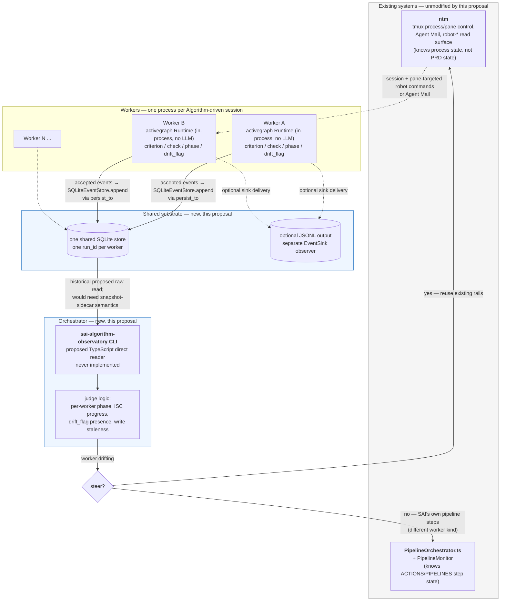

# Historical proposal: Orchestrator/Worker Observability on activegraph

**Status: HISTORICAL PROPOSAL — the two-worker/TypeScript topology below was not built.** Unlike
`00-overview.md` through `12-data-flow.md`, this file records a design explored in the SAI
Algorithm PRD (`~/.claude/MEMORY/WORK/20260810-230518_activegraph-algorithm-replacement/PRD.md`),
not activegraph package architecture as shipped. The PRD's 2026-08-11 recursive state-object
redesign superseded this topology before its proposed two-worker pilot was implemented.

**Current successor status (verified 2026-08-13):** the recursive
`goal`/`evidence`/`check`/`artifact` state object is implemented in the sibling repository at
`/home/maceo/Dev/silmari-agent-memory/apps/sai-algorithm-observatory/`. It is a Python ActiveGraph
pack and Python `sai-state` CLI, not the TypeScript direct-file reader drawn below
(`pyproject.toml:5-14,25-30`; `state_pack/pack.py:27-82`; `state_pack/cli.py:219-258`). The pack,
CLI, and PostToolUse hook are merged on that repository's `main`; its checked-out
`feat/sai-serializing-writer` branch additionally contains the shared-store serializing daemon,
thin socket clients, durable spool, and 60-second observer (`state_pack/client.py:1-74`;
`state_pack/daemon.py:1-25,162-245`; `state_pack/observer.py:171-216`). The diagrams below are
retained as the historical worker/orchestrator proposal, not as a map of that successor.

## Historical problem statement

SAI already has two things that call themselves "orchestrator": `ntm`, a
mature external multi-agent tmux platform, and `SAI/Tools/
PipelineOrchestrator.ts`, an in-repo pipeline runner. Neither understands SAI
Algorithm PRD semantics — neither can answer "is worker B's ISC-3 checked
without evidence." This proposal is the narrow slice that closes that one
gap: **workers write their own Algorithm progress into activegraph; a
CLI-first orchestrator reads across all of them to judge who's on track,
using the two existing systems' own mechanics to act on what it finds.**

## Historical proposed system map (not implemented)



Solid arrows are the write/read path this historical proposal would have added. Dashed arrows into
`ntm` / from `ntm` back to a worker are existing mechanics it proposed reusing; no current
state-pack-to-`ntm` integration exists.

## Historical proposed components and current disposition

| Component | Historical responsibility | Language | Current disposition |
|---|---|---|---|
| Per-worker activegraph `Runtime` | Model one worker with `criterion` / `check` / `phase` / `drift_flag` | Python / activegraph 1.10.0 | Historical spike pattern only; the proposed multi-worker implementation was not built |
| Shared SQLite store | Multiple worker runs in one file | SQLite / `SQLiteEventStore` | Resolved to one shared store; the successor feature branch uses one shared capability store, but not one run per worker |
| `sai-algorithm-observatory` reader | Enumerate runs and report worker drift | Proposed TypeScript direct-file reader | Not built; the successor is the Python `sai-state` CLI and imports ActiveGraph |
| `ntm` | Pane/process control and structured robot surfaces | Go | Existing and still separate from the state pack |
| `PipelineOrchestrator.ts` + `PipelineMonitor` | ACTIONS/PIPELINES execution and live monitor updates | TypeScript | Existing and still separate from the state pack |

## Historical proposed write/read contract

```ebnf
worker-write    ::= worker-runtime-init worker-progress-loop runtime.run_until_idle()
worker-runtime-init
                ::= Graph(run_id = worker-id)
                    Runtime(graph, behaviors=[judge_evidence], persist_to = shared-store-path)
                    (* zero llm_provider — proven unnecessary this session *)
worker-progress-loop
                ::= { graph.add_object("phase", {name})
                    | graph.add_object("criterion", {id, desc})
                    | graph.add_object("check", {criterion_id, evidence_quoted}) }
                    (* judge_evidence is deterministic/in-process and runs when Runtime drains *)
event-persist   ::= each accepted graph event -> attached SQLiteEventStore.append(event)
worker-flush    ::= runtime.save_state()       (* optional attached-store commit *)
                  | runtime.flush_sinks()      (* drains EventSinks only; not SQLite persistence *)

orchestrator-read
                ::= enumerate-runs(shared-store-path)
                    { read-run(run_id) -> WorkerStatus }
enumerate-runs  ::= SQLiteEventStore.list_runs(shared-store-path)
                    (* historical raw-reader pseudocode; compacted runs also require the
                       snapshots sidecar plus archived/hot replay semantics *)
read-run        ::= WorkerStatus {
                       run_id, current_phase,
                       criteria_total, criteria_checked,
                       drift_flags : { criterion_id, reason }*,
                       last_event_timestamp
                     }
staleness-check ::= now() - last_event_timestamp > threshold  ->  "worker unresponsive"

steer-decision  ::= drift_flags != {} | staleness-check
                    -> emit recommendation (not an action)
                    (* this proposal stops here — see Open questions #1 *)
```

## Historical proposed phase-1 pilot (not implemented)

```mermaid
sequenceDiagram
    autonumber
    participant WA as Worker A (on-track)
    participant WB as Worker B (off-track)
    participant DB as Shared SQLite store
    participant CLI as proposed observatory CLI (TS)

    par Worker A writes
        WA->>WA: add_object(phase, criterion x5)
        WA->>WA: add_object(check x5, evidence_quoted=true)
        WA->>WA: run_until_idle()
        WA->>DB: each accepted event persists — run_id=worker_a
    and Worker B writes
        WB->>WB: add_object(phase, criterion x5)
        WB->>WB: add_object(check x5, one evidence_quoted=false)
        WB->>WB: run_until_idle()
        Note over WB: deterministic judge_evidence creates<br/>drift_flag(criterion_id=ISC-3)
        WB->>DB: accepted events persist — run_id=worker_b
    end

    CLI->>DB: enumerate runs
    DB-->>CLI: [worker_a, worker_b]
    CLI->>DB: read-run(worker_a)
    DB-->>CLI: WorkerStatus{drift_flags: []}
    CLI->>DB: read-run(worker_b)
    DB-->>CLI: WorkerStatus{drift_flags: [{ISC-3, "checked without quoted evidence"}]}
    CLI-->>CLI: report: worker_a OK, worker_b DRIFTING (ISC-3)

    opt future PRD, not phase 1
        CLI->>CLI: (steer decision)
        Note over CLI: would call ntm --robot-interrupt=&lt;session&gt;<br/>--panes=&lt;worker-b-pane&gt; --msg="fix ISC-3 evidence"
    end
```

An earlier single-process spike exercised comparable `ON_TRACK` / `OFF_TRACK` scenarios, but no
retained implementation of this proposed extension — two separate runs read by an external
TypeScript process — exists. The successor instead uses recursive goal/evidence objects and a
Python CLI.

## Open questions

1. **Resolved by the successor design — one CLI fronts ActiveGraph.** The separate Python worker /
   TypeScript direct-file-reader split was abandoned. Every caller uses the Python `sai-state`
   CLI; callers do not embed a Runtime themselves, while the CLI/daemon internally owns the
   ActiveGraph Runtime (`state_pack/session.py:20-86`; `state_pack/cli.py:116-176`). This is
   implemented in the sibling app, not in the historical topology above.

2. **Resolved and implemented in the successor — one shared store, one serializing writer.**
   ActiveGraph enables WAL but supplies no cross-process application-level writer queue
   (`activegraph/store/sqlite.py:59-72,123-139,330-364`). The successor feature branch routes
   writes through one long-lived daemon/Runtime; thin clients have no direct-write fallback
   (`state_pack/client.py:1-8,29-70`; `state_pack/daemon.py:162-245,400-424`). Independent reads use
   their own connections.

3. **Resolved and implemented in the successor — the staleness threshold is 60 seconds.** The
   observer requires a satisfied heartbeat for the current boot id within that boundary
   (`state_pack/constants.py:49-56`; `state_pack/observer.py:171-216`). Boundary tests cover 59.9,
   60.0, and 60.1 seconds (the sibling app's `tests/test_observer.py:225-251`). The earlier
   45-second `ntm` sample was only historical input to the policy choice, not an `ntm` contract.

4. **Still out of scope (verified 2026-08-13) — `promote` is not used by the successor.**
   ActiveGraph implements `Runtime.promote()` for direct SQLite forks
   (`activegraph/runtime/runtime.py:4110-4151,4160-4224`), but neither the historical proposal nor
   the current sibling app adopts it.
