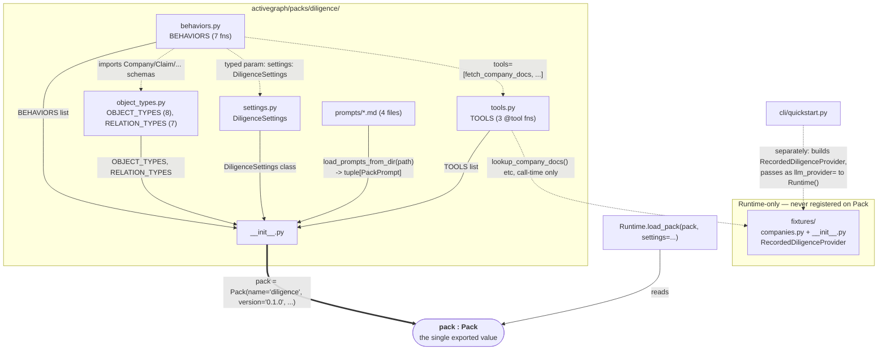
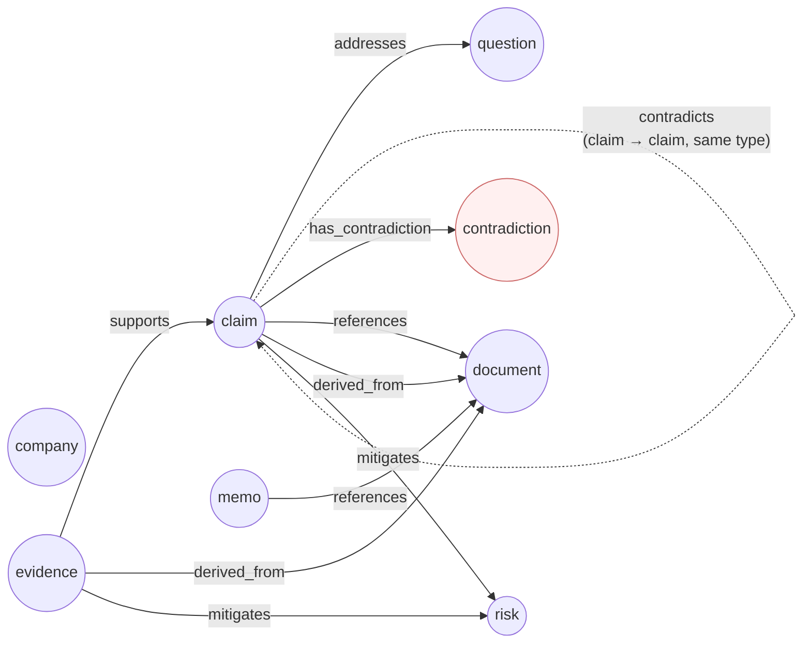
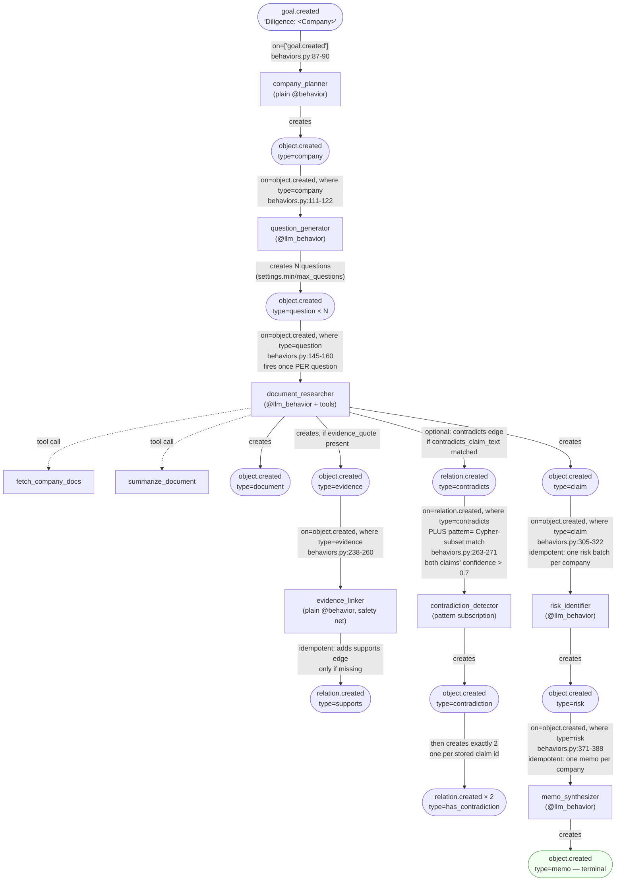

# Pack Anatomy — Reverse-Engineered from `packs/diligence/`

`07-packs.md` documents the pack *format* in the abstract (the `Pack`
dataclass, the loader, `manifest.toml`). This file documents one **concrete,
shipped instance** — `activegraph/packs/diligence/`, the pack the quickstart
transcript's Beat 2 (`examples/quickstart_session.txt:59-144`) actually runs
— file by file, then generalizes what it shows into a grammar any new pack
(including a future worker/orchestrator pack) can follow. Every claim below
is grounded in the pack's own source; nothing here is invented.

Beat 2's own five-point "what just happened" (`quickstart_session.txt:114-
144`) is the reader's map: (1) a pack registers object types, behaviors,
tools, prompts; (2) goals trigger reactive behaviors, not a written
workflow; (3) an LLM provider is swappable — fixtures make the demo
deterministic; (4) the pack enforces a structural contract on its own
output (the "verifiable memo bar"); (5) the event log is the full causal
record. Everything below is the concrete machinery behind those five
sentences.

---

## File catalog

| File | Lines | Registers on `Pack(...)` as | Role |
|---|---|---|---|
| `__init__.py` | 86 | the assembly point itself | Imports every other module's list/schema and builds the single `pack = Pack(...)` value (`__init__.py:59-83`) |
| `object_types.py` | 169 | `object_types=`, `relation_types=` | 8 Pydantic schemas + 8 `ObjectType` wrappers, 7 `RelationType` wrappers |
| `settings.py` | 60 | `settings_schema=` | One Pydantic `BaseModel`, `DiligenceSettings`, 8 fields, every field has a default |
| `tools.py` | 124 | `tools=` | 3 `@tool`-decorated functions, each with its own input/output Pydantic schema |
| `behaviors.py` | 449 | `behaviors=` | 7 `@behavior` / `@llm_behavior` functions plus their LLM-output Pydantic schemas |
| `prompts/*.md` (4 files) | 25–35 each | `prompts=` via `load_prompts_from_dir()` | One markdown file per LLM behavior, TOML frontmatter (`version = "1.0.0"`), matched to the behavior by filename |
| `fixtures/companies.py` | 511 | *not registered on the Pack at all* | Raw fixture data: 3 companies × documents, filings, summaries, questions, findings, risks, memos |
| `fixtures/__init__.py` | 365 | *not registered on the Pack at all* | `RecordedDiligenceProvider` (a scripted `LLMProvider`) + the three tool-lookup functions `tools.py` calls |

Two things worth stating up front because they're easy to assume wrongly:

- **No `manifest.toml` exists for this pack** — confirmed by `find`, zero
  hits. This is the same gap `07-packs.md` open question 5 already flagged
  package-wide: the declarative half of the format is real machinery with
  no in-tree production instance. Diligence is a pure "imperative `Pack()`
  object" example, nothing more.
- **`fixtures/` is not part of the `Pack` value at all.** It's plain Python
  that `tools.py`'s three functions import *at call time* (`tools.py:76`,
  `:96`, `:115` — `from activegraph.packs.diligence.fixtures import
  lookup_...`) and that the quickstart CLI imports *separately* to build a
  `RecordedDiligenceProvider` and hand it to `Runtime(llm_provider=...)`
  (`cli/quickstart.py:76-79`, read earlier this session). A pack ships
  fixtures beside itself by convention; the framework has no `fixtures=`
  field on `Pack`.

---

## System map: six files → one `Pack` value



The two dashed edges into `fixtures` on the right make the point of the
"Runtime-only" box concrete: a pack's *tools* may reach into its bundled
fixtures at call time (that's how `fetch_company_docs` stays offline), and
a *demo harness* may separately wire a fixture-backed provider into the
`Runtime` — but neither path goes through the `Pack` object itself. A pack
consumer who only reads `Pack(...)`'s fields would never discover the
fixtures exist; they're a convention (`CONTRACT v0.9 #18`, cited in
`fixtures/__init__.py:3`), not a registered surface.

---

## The domain: 8 object types, 7 relation types



Each `contradiction` is created as a review aggregate for one `contradicts`
edge between two claims. The detector then emits exactly two
`claim --has_contradiction--> contradiction` relations, using the two real
claim IDs stored on the object. `Graph.neighborhood(claim_id, depth=1)` is
therefore the supported discovery path from either claim to the aggregate.

---

## The trigger cascade: how one goal becomes one memo

This is the mechanical answer to Beat 2 point 2 ("reactive behaviors fired
automatically... pattern-matched against event types and object shapes")
— every arrow below is a `@behavior`/`@llm_behavior`'s `on=`/`where=`/
`pattern=` declaration, not a call from one function to another.



Two mechanisms make this graph converge instead of looping or exploding,
neither obvious from the diagram alone:

- **Idempotency by graph query, not by event count.** `risk_identifier`
  fires on *every* `claim` creation but scans `ctx.view.objects(type=
  "risk")` (plus `ctx._runtime.pending_approvals()`) and returns
  immediately once a risk exists for the company (`behaviors.py:338-344`).
  `memo_synthesizer` does the same for `memo` (`behaviors.py:399-404`).
  Both fire many times per run and no-op after the first. The decorators carry
  no `activate_after=` argument; the idempotent graph scan is what ships.
- **`contradiction_detector` is the only pattern-subscription behavior in
  the pack** — it declares both `on=`/`where=` *and* `pattern=`
  (`behaviors.py:263-271`), so it fires on a `relation.created` event AND
  only when the Cypher-subset pattern (`(c1:claim)-[r:contradicts]->
  (c2:claim) WHERE c1.confidence > 0.7 AND c2.confidence > 0.7`) matches
  the graph shape around it. Every other behavior in this pack uses plain
  `on=`/`where=` — this is the pack's one worked example of the pattern
  subscription mechanism `03-runtime-governance.md` documents abstractly.

---

## Grammar: what any pack (not just diligence) needs to supply

Generalized from the instance above, cross-checked against `07-packs.md`'s
abstract format spec:

```ebnf
pack-source        ::= "__init__.py"                 (* required, the assembly point *)
                        [ "object_types.py" ]         (* optional — a pack with no new
                                                          object types is legal *)
                        [ "settings.py" ]              (* optional — omit for EmptySettings *)
                        [ "tools.py" ]                  (* optional — a pack can be pure
                                                            LLM/deterministic behaviors *)
                        "behaviors.py"                (* the pack's actual reason to exist *)
                        [ "prompts/*.md" ]              (* required 1:1 with every
                                                            @llm_behavior, by filename *)
                        [ "fixtures/" ]                (* convention, not a Pack field —
                                                            needed only for offline/CI demos *)

assembly            ::= "pack" "=" "Pack" "("
                          "name="            snake-case-name ","
                          "version="         string ","
                          "description="     string ","
                          [ "object_types="  object-type-list "," ]
                          [ "relation_types=" relation-type-list "," ]
                          "behaviors="        behavior-list ","
                          [ "tools="          tool-list "," ]
                          [ "policies="       policy-list "," ]
                          [ "prompts="        "load_prompts_from_dir(" prompts-dir ")" "," ]
                          [ "settings_schema=" pydantic-model-class ]
                        ")"

behavior-kind       ::= trigger-only            (* on= only, no LLM, seeds the graph —
                                                     diligence: company_planner *)
                       | llm-with-tools          (* @llm_behavior, tools=[...], multi-turn —
                                                     diligence: document_researcher *)
                       | llm-idempotent-gate     (* @llm_behavior, fires often, no-ops via
                                                     a graph-state check — diligence:
                                                     risk_identifier, memo_synthesizer *)
                       | deterministic-safety-net (* plain @behavior, idempotent edge repair —
                                                      diligence: evidence_linker *)
                       | pattern-subscription     (* on= + where= + pattern=, Cypher-subset —
                                                      diligence: contradiction_detector *)

settings-access     ::= typed-param              (* def fn(event, graph, ctx, *,
                                                     settings: PackSettings): ... — primary *)
                       | ctx-dot-settings         (* ctx.settings.field, same object *)
                       | ctx-pack-settings        (* ctx.pack_settings("other_pack") —
                                                      cross-pack only *)

prompt-binding      ::= filename "==" behavior-name  (* load_prompts_from_dir matches by
                                                          stem; a behavior with no matching
                                                          file gets no prompt body appended *)

fixture-pattern     ::= scripted-provider "keys off" behavior-name
                       ( extracted-from : "system prompt's"
                         '`behavior named "<name>"`' line )
                       "+" per-entity-canned-payload
                       (* diligence: RecordedDiligenceProvider,
                          fixtures/__init__.py:56-146 *)
```

---

## What this means for authoring a new pack

Practical takeaways for a future pack — including a hypothetical worker
pack for the orchestrator/worker proposal in `13-orchestrator-worker-
proposal.md` — stated as direct consequences of the anatomy above, not as
new claims:

1. **A pack needs no LLM at all to be valid.** `company_planner` and
   `evidence_linker` are plain `@behavior`s with zero LLM involvement;
   this session's own iteration-2 experiment (`judge_evidence` behavior)
   is exactly this shape. A pack can be 100% `trigger-only` +
   `deterministic-safety-net` behaviors.
2. **Idempotent-scan is the pack's answer to "don't repeat this
   downstream side effect,"** not event deduplication or
   `activate_after` scheduling — `risk_identifier`/`memo_synthesizer`
   both just query the graph before acting. Worth copying directly for
   any behavior that should fire "once per worker" rather than once per
   triggering event.
3. **Prompts are optional per behavior, not per pack** — only the four
   `@llm_behavior`s have a matching `prompts/*.md`; `company_planner` and
   `evidence_linker` have none, because `load_prompts_from_dir` only
   supplies a body, it doesn't require one per behavior.
4. **Fixtures are a convention that lives beside a pack, not inside its
   registered surface** — a future worker pack that wants to run
   deterministically offline (as this session's judge-behavior
   experiments already do, just without formalizing it as a `fixtures/`
   directory) should follow the same shape: a scripted provider module,
   imported by tools/demo code at call time, never listed on `Pack(...)`.
5. **A pack with zero `object_types=`/`relation_types=`/`tools=`/
   `policies=`/`prompts=`/`settings_schema=` is legal** — diligence
   happens to use all six optional fields, but `07-packs.md`'s grammar
   marks every one of them optional except `name=`/`version=`/
   `behaviors=`. A minimal worker-observability pack could be behaviors
   and object types only.

## Open questions

1. **Contradiction traversal is now explicit.** The former open question is
   resolved by `has_contradiction`: exactly two claim-to-aggregate edges make
   the review item discoverable from either claim without assigning A/B roles.
2. **No `manifest.toml`** — consistent with `07-packs.md`'s open
   question 5, reconfirmed here for this specific pack by direct `find`.
