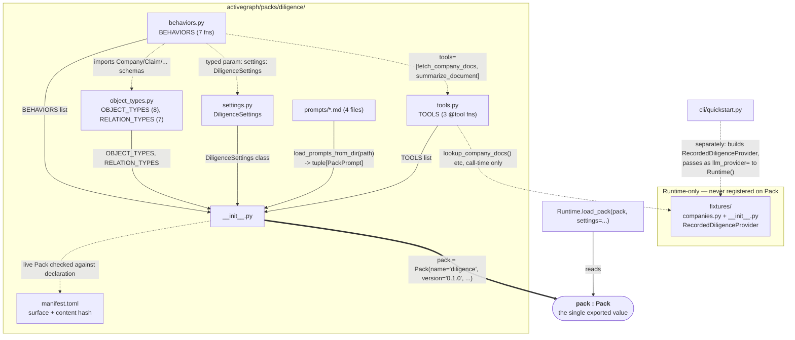
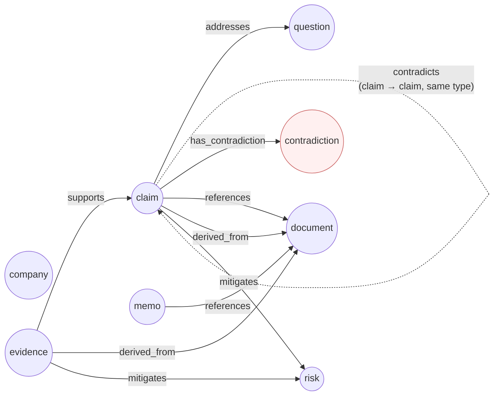
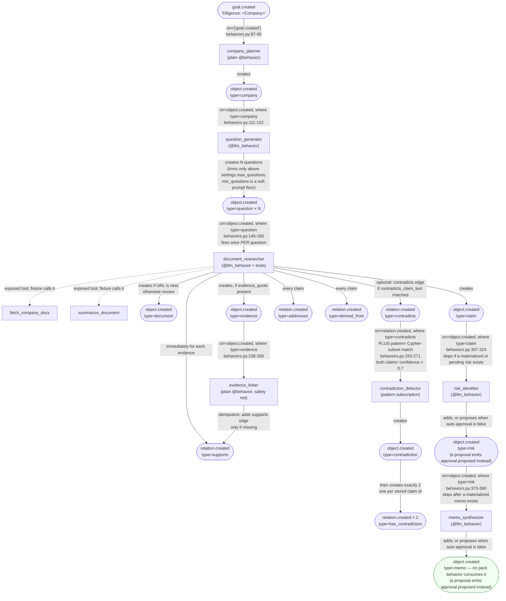

# Pack Anatomy — Reverse-Engineered from `packs/diligence/`

`07-packs.md` documents the pack *format* in the abstract (the `Pack`
dataclass, the loader, `manifest.toml`). This file documents one **concrete,
shipped instance** — `activegraph/packs/diligence/`, the pack the quickstart
transcript's Beat 2 (`examples/quickstart_session.txt:59-144`) actually runs
— file by file, then generalizes what it shows into a grammar any new pack
(including a future worker/orchestrator pack) can follow. Every claim below
is grounded in the pack's own source; nothing here is invented.

Beat 2's own five-point "what just happened" (`quickstart_session.txt:114-
144`) is the reader's map: (1) a pack registers object types, behaviors,
tools, prompts; (2) goals trigger reactive behaviors, not a written
workflow; (3) an LLM provider is swappable — fixtures make the demo
deterministic; (4) the pack enforces a structural contract on its own
output (the "verifiable memo bar"); (5) the event log is the full causal
record. Everything below is the concrete machinery behind those five
sentences.

---

## File catalog

| File | Lines | Registers on `Pack(...)` as | Role |
|---|---|---|---|
| `__init__.py` | 86 | the assembly point itself | Imports the live component lists/schema, defines two policies, loads prompts, and builds the single `pack = Pack(...)` value (`__init__.py:45-83`) |
| `object_types.py` | 169 | `object_types=`, `relation_types=` | 8 Pydantic schemas + 8 `ObjectType` wrappers, 7 `RelationType` wrappers |
| `settings.py` | 60 | `settings_schema=` | One Pydantic `BaseModel`, `DiligenceSettings`, 8 fields, every field has a default |
| `tools.py` | 124 | `tools=` | 3 `@tool`-decorated functions, each with its own input/output Pydantic schema |
| `behaviors.py` | 449 | `behaviors=` | 7 functions: 3 plain `@behavior`s and 4 `@llm_behavior`s, plus the four LLM-output Pydantic schemas |
| `prompts/*.md` (4 files) | 25–35 each | `prompts=` via `load_prompts_from_dir()` | One markdown file per LLM behavior, TOML frontmatter (`version = "1.0.0"`), matched to the behavior by filename |
| `manifest.toml` | 36 | *checked against the Pack* | Declarative identity, dependencies, live surface, fixture resource, and internal-consistency content hash; shipped as wheel package data |
| `fixtures/companies.py` | 511 | *not registered on the Pack at all* | Raw fixture data: 3 companies × documents, filings, summaries, questions, findings, risks, memos |
| `fixtures/__init__.py` | 365 | *not registered on the Pack at all* | `RecordedDiligenceProvider` (a scripted `LLMProvider`) + the three tool-lookup functions `tools.py` calls |

Two things worth stating up front because they're easy to assume wrongly:

- **`manifest.toml` is the declarative counterpart to the live Pack.** Direct
  tests parse it, two-way check every schema-supported live surface, recompute
  its content hash (`tests/test_diligence_pack.py:72-78`), and repeat those
  checks from an installed wheel (`tests/test_wheel_completeness.py:101-126`).
  Policies and prompts are not fields in the current manifest schema.
- **`fixtures/` is not part of the `Pack` value at all.** It's plain Python
  that `tools.py`'s three functions import *at call time* (`tools.py:76`,
  `:96`, `:115` — `from activegraph.packs.diligence.fixtures import
  lookup_...`) and that the quickstart CLI imports *separately* to build a
  `RecordedDiligenceProvider` and hand it to `Runtime(llm_provider=...)`
  (`cli/quickstart.py:75-79,104-113`). A pack ships
  fixtures beside itself by convention; the framework has no `fixtures=`
  field on `Pack`.

---

## System map: five registered inputs → one `Pack` value



The two dashed edges into `fixtures` on the right make the point of the
"Runtime-only" box concrete: a pack's *tools* may reach into its bundled
fixtures at call time (that's how `fetch_company_docs` stays offline), and
a *demo harness* may separately wire a fixture-backed provider into the
`Runtime` — but neither path goes through the `Pack` object itself. A pack
consumer who only reads `Pack(...)`'s fields would never discover the
fixtures exist; they're a convention (`CONTRACT v0.9 #18`, cited in
`fixtures/__init__.py:3`), not a registered surface.

---

## The domain: 8 object types, 7 relation types



Each `contradiction` is created as a review aggregate for one `contradicts`
edge between two claims. The detector then emits exactly two
`claim --has_contradiction--> contradiction` relations, using the two real
claim IDs stored on the object. `Graph.neighborhood(claim_id, depth=1)` is
therefore the supported discovery path from either claim to the aggregate.
The diagram is the registered relation-type inventory and its allowed endpoint
types; the Diligence handlers do not necessarily emit every registered type
(`references` and `mitigates`, for example, are available schema surface but
are not created by these seven handlers).

---

## The trigger cascade: how one goal becomes one memo

This is the mechanical answer to Beat 2 point 2 ("reactive behaviors fired
automatically... pattern-matched against event types and object shapes").
Trigger arrows are `@behavior`/`@llm_behavior` `on=`/`where=`/`pattern=`
subscriptions; arrows out of behavior nodes are mutations performed by the
handler, not direct calls to another behavior.



Two runtime details are not obvious from the diagram alone:

- **Idempotency by state query, not by event count.** `risk_identifier` fires
  on *every* `claim` creation but scans both materialized risks and
  `ctx._runtime.pending_approvals()`, returning once either state contains a
  risk for the company (`behaviors.py:337-346`). `memo_synthesizer` checks only
  materialized memos (`behaviors.py:398-406`): that converges in the default
  `auto_approve_memos=True` path, but pending memo proposals are not part of
  its guard. Neither decorator carries `activate_after=`; these state scans
  are what ship.
- **`contradiction_detector` is the only pattern-subscription behavior in
  the pack** — it declares both `on=`/`where=` *and* `pattern=`
  (`behaviors.py:263-271`), so it fires on a `relation.created` event AND
  only when the Cypher-subset pattern (`(c1:claim)-[r:contradicts]->
  (c2:claim) WHERE c1.confidence > 0.7 AND c2.confidence > 0.7`) matches
  the graph shape around it. The handler then also rejects either claim below
  `settings.confidence_threshold_for_review` (`behaviors.py:285-289`), so the
  effective gate is the hard-coded strict `> 0.7` pattern plus the configurable
  floor. Every other behavior in this pack uses plain `on=`/`where=` — this is
  the pack's one worked example of the pattern subscription mechanism
  `03-runtime-governance.md` documents abstractly.

---

## Grammar: what any pack (not just diligence) needs to supply

Generalized from the instance above, cross-checked against `07-packs.md`'s
abstract format spec:

```ebnf
pack-source        ::= "__init__.py"                 (* conventional assembly point exporting pack *)
                        [ "manifest.toml" ]           (* recommended declarative surface;
                                                          generated packs locate it explicitly *)
                        [ "object_types.py" ]         (* optional — a pack with no new
                                                          object types is legal *)
                        [ "settings.py" ]              (* optional — omit for EmptySettings *)
                        [ "tools.py" ]                  (* optional — a pack can be pure
                                                            LLM/deterministic behaviors *)
                        [ "behaviors.py" ]              (* optional; Pack.behaviors defaults empty *)
                        [ "prompts/*.md" ]              (* optional; a same-named PackPrompt
                                                            augments an LLM behavior *)
                        [ "fixtures/" ]                (* convention, not a Pack field —
                                                            needed only for offline/CI demos *)

assembly            ::= "pack" "=" "Pack" "("
                          "name="            canonical-pack-name     (* ^[a-z][a-z0-9_]{0,63}$ *)
                          ","
                          "version="         pep440-string
                          { "," optional-pack-field }
                          [ "," ]
                        ")"

optional-pack-field ::= "description="       string
                       | "object_types="      object-type-list
                       | "relation_types="    relation-type-list
                       | "behaviors="          behavior-list
                       | "tools="              tool-list
                       | "policies="           policy-list
                       | "prompts="            "load_prompts_from_dir(" prompts-dir ")"
                       | "settings_schema="    pydantic-model-class
                       | "capabilities="       capability-list
                       | "manifest_path="      absolute-pathlib-path

diligence-pattern   ::= trigger-only            (* on= only, no LLM, seeds the graph —
                                                     diligence: company_planner *)
                       | llm-with-tools          (* @llm_behavior, tools=[...], multi-turn —
                                                     diligence: document_researcher *)
                       | llm-idempotent-gate     (* @llm_behavior, fires often, no-ops via
                                                     a graph-state check — diligence:
                                                     risk_identifier; memo_synthesizer after
                                                     a memo is materialized *)
                       | deterministic-safety-net (* plain @behavior, idempotent edge repair —
                                                      diligence: evidence_linker *)
                       | pattern-subscription     (* on= + where= + pattern=, Cypher-subset —
                                                      diligence: contradiction_detector *)

settings-access     ::= typed-param              (* def fn(event, graph, ctx, *,
                                                     settings: PackSettings): ... — primary *)
                       | ctx-dot-settings         (* ctx.settings.field, same object *)
                       | ctx-pack-settings        (* ctx.pack_settings("other_pack") —
                                                      cross-pack lookup; accepts any loaded pack *)

prompt-binding      ::= pack-prompt-name "==" behavior-name
                       (* PackPrompt.name defaults to the filename stem, but TOML
                          frontmatter may override it; an unmatched behavior gets no
                          prompt body appended to its decorator description *)

fixture-pattern     ::= scripted-provider "keys off" behavior-name
                       ( extracted-from : "system prompt's"
                         '`behavior named "<name>"`' line )
                       "+" per-entity-canned-payload
                       (* diligence: RecordedDiligenceProvider,
                          fixtures/__init__.py:56-162 *)
```

---

## What this means for authoring a new pack

Practical takeaways for a future pack — including a hypothetical worker
pack for the orchestrator/worker proposal in `13-orchestrator-worker-
proposal.md` — stated as direct consequences of the anatomy above, not as
new claims:

1. **A pack needs no LLM at all to be valid.** `company_planner`,
   `evidence_linker`, and `contradiction_detector` are plain `@behavior`s with
   zero LLM involvement. A pack can be 100% deterministic behaviors.
2. **Idempotent-scan is the pack's answer to "don't repeat this
   downstream side effect,"** not event deduplication or
   `activate_after` scheduling. Copy the complete `risk_identifier` shape —
   query both materialized and pending state — when approvals are possible.
   `memo_synthesizer`'s materialized-only check is sufficient for its default
   auto-approved path, not a general pending-approval-safe template.
3. **Prompts are optional, including for LLM behaviors.** Diligence's four
   `@llm_behavior`s each have a matching `prompts/*.md`; `company_planner`,
   `evidence_linker`, and `contradiction_detector` have none. The loader
   appends a same-named `PackPrompt` body when one exists and does not require
   a prompt for every behavior.
4. **Fixtures are a convention that lives beside a pack, not inside its
   registered surface** — a future worker pack that wants to run
   deterministically offline can follow the same shape: a scripted provider
   module imported by tools/demo code, never listed on `Pack(...)`.
5. **Only `Pack.name` and `Pack.version` are required.** `description`, all
   registered surface sequences (including `behaviors`), `settings_schema`,
   `capabilities`, and `manifest_path` have defaults
   (`activegraph/packs/__init__.py:580-605`). Diligence populates every live
   surface it needs, while a minimal pack can legally be just
   `Pack(name="...", version="...")`.

## Historical findings — resolved

1. **14.1 (`activate_after=8`) is resolved.** The stale roster entry was in
   `diligence/__init__.py`, not `behaviors.py`; it now describes
   `risk_identifier` as an idempotent graph scan (`__init__.py:12-15`), matching
   the decorator and handler at `behaviors.py:307-346`.
2. **14.2 (missing manifest) is resolved.** `manifest.toml` now declares the
   Diligence identity, surface, fixtures, and content hash. Source-tree and
   installed-wheel tests verify its surface and bytes.
3. **14.3 (unreachable contradiction aggregates) is resolved.** The
   `has_contradiction` relation type and detector's two emitted edges make each
   aggregate reachable from both claims; `tests/test_diligence_pack.py:158-241`
   checks inventory, endpoints, exact edge count, and depth-one traversal.

## Current boundaries

- **Manifest schema scope remains narrower than Pack scope.** Diligence's
  manifest declares every schema-supported live surface plus its fixture
  resource. Prompts and policies are Pack fields but have no manifest fields;
  prompt loading/hashing and policy registration follow their separate Pack
  and loader paths.
- **Approval-safe idempotency is asymmetric.** Risk generation checks pending
  approvals; memo generation does not. With `auto_approve_memos=False`, a
  second risk can therefore lead to another pending memo proposal before the
  first proposal is approved.
- **The pack's own prose disagrees on the LLM count.** The live `BEHAVIORS`
  list has four `LLMBehavior`s. `manifest.toml:4` says four, but
  `__init__.py:64-65` says three and `behaviors.py:3-5` says only two behaviors
  are deterministic and all five others are LLM-backed (incorrectly counting
  plain `company_planner`).
- **Two advertised settings are currently inert.** `llm_model` and
  `max_documents_per_company` are defined in `settings.py:24-31` and supplied
  by the quickstart, but no Diligence handler reads either. LLM behaviors leave
  `model=None` for runtime/provider default resolution, while the recorded
  research provider requests three documents directly.
