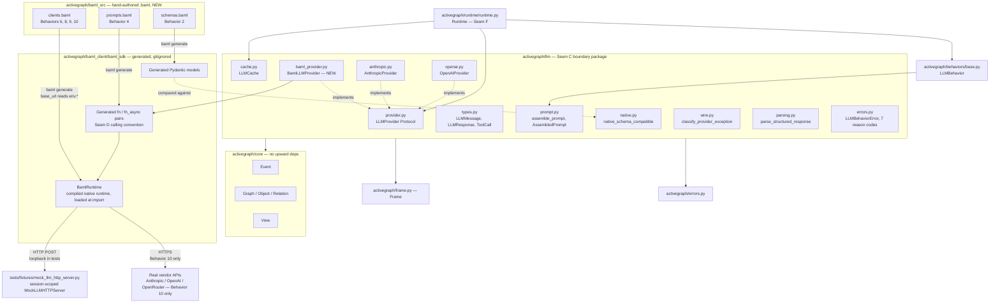
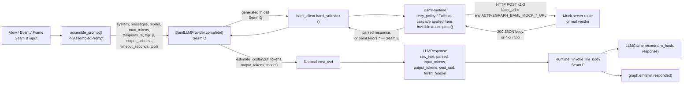
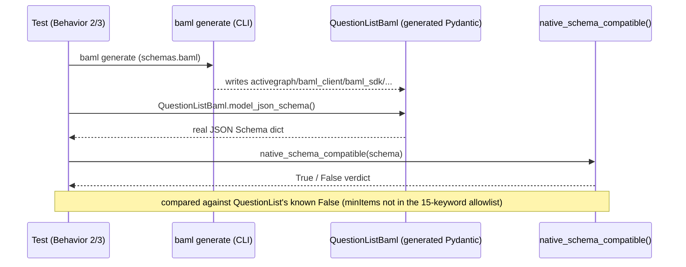
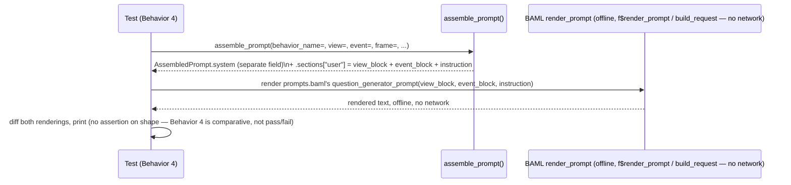
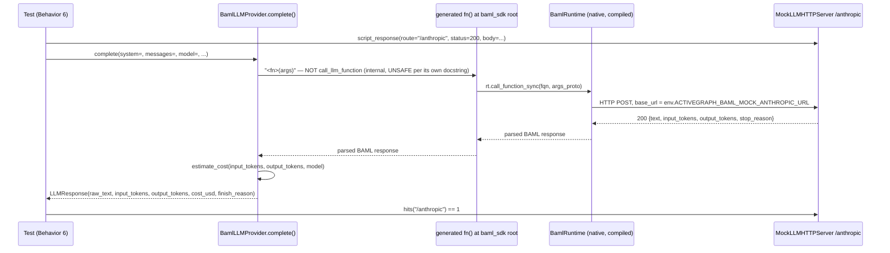
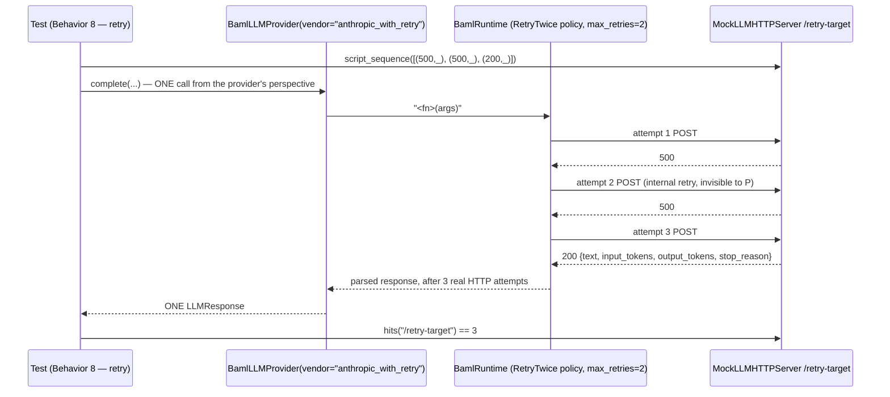
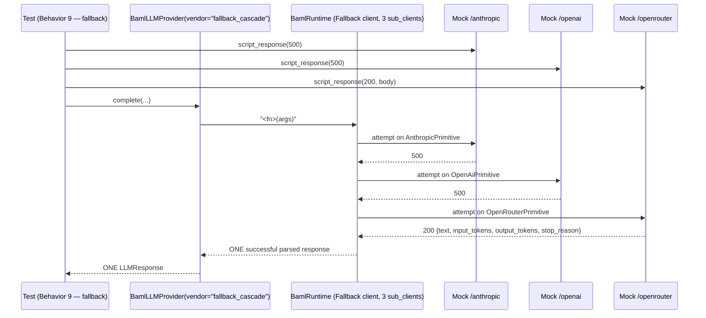
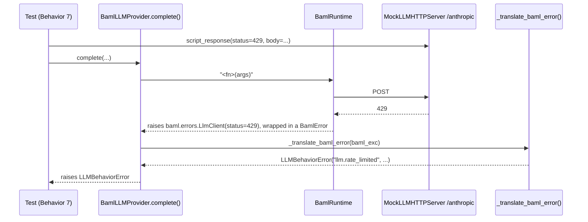
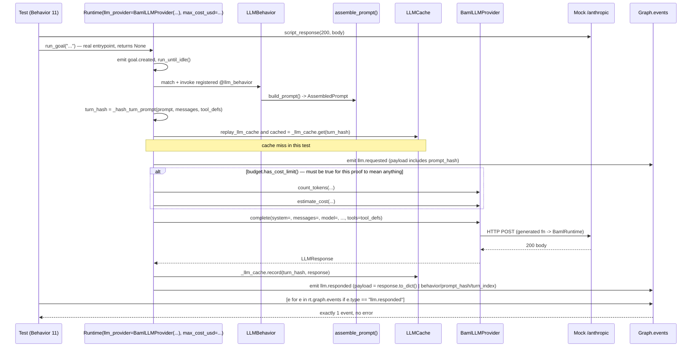

# BAML-Backed LLMProvider (BamlLLMProvider) TDD Implementation Plan

## Overview

`activegraph/llm/` and the new BAML scaffold (`activegraph/baml.toml`, `activegraph/baml_src/`, generated `activegraph/baml_client/`) are two real, independently-working, currently-disconnected systems (confirmed live: 37/37 existing `activegraph/llm/` tests pass; `baml_sdk.main()` really returns `"hello from baml"`). This plan builds the connecting piece: a `BamlLLMProvider` that fully implements the `LLMProvider` Protocol (`activegraph/llm/provider.py:47-113`) — all three required methods (`complete`, `estimate_cost`, `count_tokens`), not just `complete`/`count_tokens` — backed by real hand-authored `.baml` declarations, supporting all three vendor targets (Anthropic, OpenAI, OpenRouter), with retry and cross-vendor fallback owned by BAML's own compiled native runtime rather than reimplemented in `activegraph/llm/`. It becomes *production-usable* only once Behavior 11 proves one real completion turn through `Runtime(llm_provider=BamlLLMProvider(...))`, and only once Behavior 0's toolchain prerequisites are met — both claims are earned in this revision, not assumed.

Every behavior below produces real, observable output — a real generated Pydantic model, a real rendered prompt, a real HTTP request hitting a real local server or (for the required final behavior) the real OpenRouter API — never a stub, spy, or shape-only assertion. Where a prior revision of this plan asserted a match against `raw_text` alone, this revision asserts every required `LLMResponse` field the mock makes cheaply verifiable.

### Architectural note: retry ownership (review finding, must read before implementing Behaviors 8-9)

`specs/08-llm.md` documents an existing invariant: **"Retry/backoff is entirely the runtime's... every provider makes exactly one SDK call per `complete()`"** (`specs/08-llm.md:221-223`). This plan's whole premise — BAML's native runtime owns retry/fallback — is a deliberate, in-scope deviation from that invariant, not an oversight, but it must be treated as a first-class design decision, not a side effect:

- A single `BamlLLMProvider.complete()` call may now trigger 2-3 real HTTP attempts (Behavior 8's retry) or up to 3 real attempts across distinct vendors (Behavior 9's fallback) — all *inside* what the activegraph runtime still sees as ONE `complete()` call.
- If BAML's own retry/fallback is exhausted and the resulting `LLMBehaviorError` reason lands in the runtime's `_TRANSIENT_LLM_REASONS` set (`llm.network_error`, `llm.rate_limited`), the activegraph runtime retries the *whole* `complete()` call again (`runtime.py`'s own `llm_retry_max_attempts=3`) — each of which may itself be 2-3 real BAML-internal attempts. Behavior 8's exhausted-retry edge case (below) now explicitly asserts the resulting total-attempt bound is intentional, not accidental.
- `timeout_seconds` (a required Protocol param on every `complete()` call) is asserted, in Behavior 8, to bound BAML's *entire* internal retry/fallback sequence, not just the first HTTP attempt — since `activegraph`'s runtime has no visibility into or control over BAML-internal sub-attempts.
- This plan does **not** amend `specs/08-llm.md`'s prose in this revision (that invariant remains true for `AnthropicProvider`/`OpenAIProvider`); it documents `BamlLLMProvider` as a deliberate, scoped exception. A follow-up spec amendment is out of scope here but is flagged as needed follow-up work (see References).

## Current State Analysis

`activegraph/llm/` is a hand-rolled, contract-documented package (`specs/08-llm.md`) built around the `LLMProvider` Protocol: three required keyword-only methods (`complete`, `estimate_cost`, `count_tokens`) plus two additive, `getattr`-guarded ones (`default_model`, `recognizes_model`, `supports_native_structured_output`). Prompt text is assembled by a pure function (`assemble_prompt`) into a locked, snapshot-tested Markdown format. Structured output resolves to `"native"` or `"prompt"` mode via `native_schema_compatible()`. Two shipped providers (`AnthropicProvider`, `OpenAIProvider`) exist today; both are unit-tested with a `MagicMock()` injected at the vendor-SDK-client boundary, never over live network.

The BAML scaffold is real but inert: `baml generate` has produced a working Python client (`activegraph/baml_client/baml_sdk/`) for one trivial function (`main() -> string { "hello from baml" }`), and `baml_bridge` is genuinely installed in this repo's `.venv` — but nothing in `activegraph/` imports it. No `.baml` `class`, `enum`, or `client<llm>` declarations exist yet.

### Key Discoveries:
- `activegraph/llm/provider.py:47-113` — `LLMProvider` Protocol, full source re-verified directly
- `activegraph/llm/prompt.py:461-547` — `assemble_prompt`, locked 4-source format (system → view → event → instruction), full source re-verified
- `activegraph/llm/native.py:30-174` — `native_schema_compatible()`'s **15**-keyword allowlist (`$defs, $ref, additionalProperties, allOf, anyOf, const, definitions, description, enum, format, items, properties, required, title, type` — corrected from an earlier miscount of 14) + `inject_additional_properties_false()`, full source re-verified
- `activegraph/packs/diligence/fixtures/__init__.py:151-193` — `RecordedDiligenceProvider` regex-parses the locked prompt format live (`behavior named "([^"]+)"`, `"## Triggering event"` split) — strongest evidence prompt-format changes are load-bearing beyond snapshot tests. This parsing degrades **silently** on format drift (falls through to empty-string/generic-fixture branches, never raises) — worth knowing if Behavior 4 ever needs to distinguish "rendering differs" from "rendering broke something downstream."
- `activegraph/packs/diligence/behaviors.py:43-44,119` — `QuestionList(BaseModel): questions: list[str] = Field(min_length=1)`, used as `output_schema=` — a real, shipped schema that ALREADY fails `native_schema_compatible()` today (`minItems` isn't in the 15-keyword allowlist), giving Behavior 3 a concrete, non-hypothetical comparison fixture
- `activegraph/baml_client/baml_sdk/baml/llm/__init__.py:363-379` — `PrimitiveClientOptions.base_url` confirmed present in the generated pydantic model, `typing.Optional[str]`, and confirmed **compile-time only** — it is baked into `.baml` source at `baml generate` time; a grep across the generated client, `baml_bridge`, and `.claude/skills/baml-core/SKILL.md` for a runtime client-override mechanism (`client_registry`, `ClientRegistry`, `with_options`) found **zero hits**. This plan's Testing Strategy (below) is redesigned around this constraint: `base_url` is set via `env.*` interpolation (a mechanism this plan already relies on elsewhere, e.g. Behavior 10's `env.OPENROUTER_API_KEY`) against a **session-scoped** mock server, not a per-test dynamic override.
- `activegraph/baml_client/baml_sdk/baml/llm/__init__.py:305-352` — `RetryPolicy` (`max_retries`, `initial_delay_ms`, `multiplier`, `max_delay_ms`) and `Client` (`client_type: ClientType[Primitive|Fallback|RoundRobin]`, `sub_clients: List[Client]`, `retry: Optional[RetryPolicy]`) — field shapes confirmed directly against the generated source in this repo (`baml describe` itself is not runnable here — see the toolchain note below); a `Fallback`-type `Client` wraps `sub_clients`, each independently `Primitive` with its own optional `RetryPolicy`
- `tests/test_llm_anthropic.py:1-38` — established `MagicMock()`-injected-SDK-client test pattern for provider unit tests without live network. **BAML has no equivalent Python-level injection seam** (the native `BamlRuntime` is loaded from compiled bytecode at import time) — `PrimitiveClientOptions.base_url` is the real substitute, requiring a genuine local HTTP server rather than an in-process mock object
- `.venv/lib/python3.11/site-packages/baml_bridge` — `baml_bridge` (the Python **runtime bridge**) genuinely installed; `baml_sdk.main()` executes for real, confirmed by running it. **The separate `baml` CLI toolchain (`generate`/`check`/`describe`) is NOT installed** — no binary in `.venv/bin`, not a declared project dependency anywhere (`pyproject.toml:44` declares only the `baml_bridge` Python package under a `[baml]` extra explicitly excluded from `dev`/`all`). See Behavior 0 (Prerequisites) below — this blocks every other behavior in this plan and must land first.
- No `.env` / API key vars anywhere in this repo or shell — `ANTHROPIC_API_KEY`, `OPENAI_API_KEY`, `OPENROUTER_API_KEY` are all absent. Behaviors 1-9 need none of them (mock-double or offline). Behavior 10 (the required live OpenRouter call) needs `OPENROUTER_API_KEY` to actually run. **Correction**: an earlier revision of this plan claimed this is gated "the same way `RecordingLLMProvider` already gates `@pytest.mark.records_llm`" — that precedent does not exist as working code anywhere in this repo (only in a docstring at `activegraph/llm/recorded.py:13` and prose in `CONTRACT.md`; no marker registration, no conftest skip logic, zero real usages). The real, working precedent this plan now follows is `tests/test_postgres_store.py:18-25` (env-var check + `skipif` + a `pyproject.toml`-registered marker).
- `activegraph/baml.toml`'s own comment claims `activegraph.baml_client` is importable — confirmed false: `activegraph/baml_client/__init__.py` does not exist, only `activegraph/baml_client/baml_sdk/` does (Behavior 1 fixes this)
- `activegraph/llm/provider.py:70-77` — `estimate_cost(*, input_tokens, output_tokens, model) -> Decimal` is the **third required** `LLMProvider` Protocol method (alongside `complete`/`count_tokens`) — called unconditionally on every real completion turn (`runtime.py:1673`), unlike `count_tokens` which is conditionally called. An earlier revision of this plan built and tested `complete()`/`count_tokens()` but never `estimate_cost()`, leaving `BamlLLMProvider` short of full Protocol conformance. Behavior 5b (below) closes this gap.
- `specs/08-llm.md:221-223` — **"Retry/backoff is entirely the runtime's... every provider makes exactly one SDK call per `complete()`."** This plan's premise (BAML-native retry/fallback) is a deliberate, scoped deviation from this documented invariant — see the Architectural Note above and Behavior 8's exhausted-retry edge case.

## Desired End State

A `BamlLLMProvider` class in `activegraph/llm/` that fully implements the `LLMProvider` Protocol — **all three required methods**, including `estimate_cost` — is importable via the path `baml.toml` already promises AND via the public `activegraph.llm` surface (alongside `AnthropicProvider`/`OpenAIProvider`), is backed by real `.baml` declarations for Anthropic/OpenAI/OpenRouter `client<llm>` targets with BAML-native retry and fallback, and is verified end-to-end — including one real turn through `Runtime(llm_provider=BamlLLMProvider(...))`, not just direct method calls — without needing any live vendor credentials except for one required live smoke test against a real OpenRouter free-tier model. This requires the external `baml` CLI toolchain to be installed (Behavior 0); nothing else in this plan is reachable without it.

### Observable Behaviors:
0. Given the `baml` CLI is not installed and `hypothesis` is not a dependency, when the documented prerequisite steps are followed, then `baml generate`/`check`/`describe` run successfully and `import hypothesis` succeeds in the dev environment and in CI
1. Given the missing `activegraph/baml_client/__init__.py`, when it's added, then `from activegraph.baml_client import baml_sdk; baml_sdk.main()` really prints `hello from baml`
2. Given a hand-authored `.baml` class mirroring `QuestionList`, when `baml generate` runs, then a real importable Pydantic model appears with a real `.model_json_schema()`
3. Given that generated schema, when passed through the unmodified `native_schema_compatible()`, then a real True/False verdict prints and is asserted, compared against `QuestionList`'s already-known False
4. Given a hand-authored `.baml` function mirroring the `question_generator` prompt shape, when BAML's real offline `render_prompt` and activegraph's real `assemble_prompt()` both run on the same inputs, then a real diff prints
5. Given a real `AssembledPrompt`, when `BamlLLMProvider.count_tokens()` is called, then a real positive integer returns, verified against a real independent tokenizer
5b. Given known `input_tokens`/`output_tokens`/`model`, when `BamlLLMProvider.estimate_cost()` is called, then a real `Decimal` returns, matching a real per-million-token pricing table
6. Given a `client<llm>` pointed at a real local mock HTTP server (via `env.*`-interpolated `base_url`), when `complete()` is called, then a real HTTP POST leaves the process and a real `LLMResponse` returns with every required field — `raw_text`, `input_tokens`, `output_tokens`, `cost_usd`, `finish_reason` — matching the scripted response, not just `raw_text`
7. Given the mock scripted for 429/401/malformed-JSON/connection-reset, when `complete()` is called against each, then each surfaces as the matching real `LLMBehaviorError` reason code
8. Given a real `retry_policy` and a mock that fails twice then succeeds, when `complete()` is called once, then the mock's real log shows 3 real attempts while the provider sees one call; given the retry budget is exhausted, then the total real-attempt count stays bounded and intentional even after the activegraph runtime's own retry loop (if any) re-enters
9. Given a `Fallback`-type client wrapping three mocked sub-clients (two failing, one succeeding), when `complete()` is called once, then the mock's real per-route logs show the cascade and exactly one success returns
10. Given a real OpenRouter free-tier model and a real `OPENROUTER_API_KEY`, when `complete()` is called, then a real HTTPS request reaches real OpenRouter and a real response returns; given the key is absent, then the test is explicitly `skipif`-skipped with a reason string naming it (mirroring `tests/test_postgres_store.py`, not the nonexistent `records_llm` precedent)
11. Given a real `Runtime(llm_provider=BamlLLMProvider(...))` and a registered `@llm_behavior`, when one real turn runs through `Runtime._invoke_llm_body`, then it completes exactly like it would with `AnthropicProvider` — cache write, `llm.requested`/`llm.responded` events, and no `AttributeError` from a missing Protocol method

## What We're NOT Doing

- Streaming (`Stream`/`stream_llm_function`) — explicitly out of scope for `activegraph/llm/` today (`provider.py:32-33`); BAML's streaming surface is not wired
- BAML's `interface`/dynamic-dispatch tool-use story — unexercised in this plan; activegraph's existing runtime-owned tool loop (`tool_calls` returned by `complete()`) is untouched
- Decompiling `_inlinedbaml.py`'s opaque bytecode to determine BAML's *internal* structured-output compatibility logic beyond what `baml describe`/empirical testing (Behavior 3) already surfaces
- A production Anthropic-live or OpenAI-live smoke test — no paid key exists in this environment; those two vendor paths are real, complete code, verified via the mock double (Behaviors 6-9), not live-called here
- Round-robin (`ClientType.RoundRobin`) client routing — BAML supports it, but nothing in this plan's behaviors needs it
- Any change to `activegraph/llm/`'s existing locked prompt format, `AnthropicProvider`, or `OpenAIProvider` — this plan is additive only
- Making `BamlLLMProvider` the *default* or automatically-selected provider anywhere (CLI, packs, examples) — Behavior 11 proves it works through one real `Runtime`-mediated turn and Behavior 6 exports it from `activegraph/llm/__init__.py`, matching how `AnthropicProvider`/`OpenAIProvider` are reachable today; actually switching any real caller over to it is separate follow-up work
- Amending `specs/08-llm.md`'s "every provider makes exactly one SDK call per `complete()`" prose — this plan documents `BamlLLMProvider` as a deliberate, scoped exception (see the Architectural Note above) rather than rewriting the shared contract doc; a follow-up spec-amendment task is flagged in References

## Testing Strategy
- **Framework**: pytest 9.1.1 (confirmed installed in `.venv`), following this repo's existing conventions
- **Test Types**:
  - Prerequisite (no test, tooling only): Behavior 0 — `baml` CLI installation, `pyproject.toml` extras/CI updates, `hypothesis` dependency. Blocks all other behaviors.
  - Unit (no network, no subprocess): Behaviors 1-5, 5b — real generated code, real comparisons against existing unmodified functions
  - Integration (real local HTTP double, no network egress): Behaviors 6-9 — a session-scoped `tests/fixtures/mock_llm_http_server.py` fixture (BAML has no Python-level client-injection seam, so this must be a genuine loopback HTTP server, not a `MagicMock`)
  - Required live (real network): Behavior 10 — gated on `OPENROUTER_API_KEY` via `skipif`, following this repo's real `tests/test_postgres_store.py` opt-in convention (**not** `@pytest.mark.records_llm`, which does not exist as working code anywhere in this repo — see the corrected Key Discoveries entry above)
  - Production-path integration (real local HTTP double, through `Runtime`): Behavior 11 — the one test in this plan that proves `BamlLLMProvider` is reachable the way `AnthropicProvider`/`OpenAIProvider` already are

### Mock server design: `tests/fixtures/mock_llm_http_server.py` (review-driven redesign)

**The problem this redesign solves.** `PrimitiveClientOptions.base_url` is compiled into `.baml` `client<llm>` declarations at `baml generate` time — it cannot be swapped at Python call time (no `client_registry`/override mechanism was found anywhere in the generated client, `baml_bridge`, or the BAML skill doc). A per-test, OS-assigned-port server (the original design) can never be reached by a precompiled client. The fix: bind the mock server **once per test session**, inject its URL via `env.*` interpolation (a mechanism this plan already uses for `OPENROUTER_API_KEY`/`OPENROUTER_FREE_MODEL` in Behavior 10) **before** `activegraph.baml_client` is first imported anywhere, and let per-test variation come from the server's own request-scripting API and per-client route paths instead of from the port.

- **Binding & environment injection**: a `pytest_configure(config)` hook in `tests/conftest.py` (guaranteed to run before test collection, hence before any `test_baml_*.py` module imports `activegraph.baml_client`, which triggers `BamlRuntime.initialize_runtime_from_bytecode(...)` at import time) starts one `MockLLMHTTPServer` bound to `127.0.0.1:0` and sets one environment variable per mock route before yielding control to collection:
  - `ACTIVEGRAPH_BAML_MOCK_ANTHROPIC_URL` → `f"{server.url}/anthropic"`
  - `ACTIVEGRAPH_BAML_MOCK_OPENAI_URL` → `f"{server.url}/openai"`
  - `ACTIVEGRAPH_BAML_MOCK_OPENROUTER_URL` → `f"{server.url}/openrouter"`
  - `ACTIVEGRAPH_BAML_MOCK_RETRY_URL` → `f"{server.url}/retry-target"` (Behavior 8)
  The server itself is torn down in a matching `pytest_unconfigure(config)`.
- **Per-client `.baml` declarations** (`activegraph/baml_src/clients.baml`, Behaviors 8-10) each read their `base_url` from one of these env vars — e.g. `client<llm> AnthropicPrimitive { options { base_url env.ACTIVEGRAPH_BAML_MOCK_ANTHROPIC_URL } } }` — never a literal or per-test value. Behavior 10's real OpenRouter client keeps its own separate `env.OPENROUTER_...` vars, untouched by this mechanism.
- **`BamlLLMProvider.__init__` is simplified as a direct consequence**: since `base_url` is no longer a Python-level override, the constructor becomes one canonical shape used identically across every behavior: `BamlLLMProvider(*, vendor: str, model: str | None = None)`, where `vendor` selects a *named pre-declared `.baml` client* (`"anthropic"`, `"anthropic_with_retry"`, `"fallback_cascade"`, `"openrouter"`, ...), not a raw base-url/retry-policy override. This resolves the constructor-signature drift between the original Behaviors 5-9 (some took `base_url=`, one took `retry_policy=`, Behavior 9 took neither consistently).
- **The fixture's full API surface is declared once, here, up front** (not grown silently behavior-by-behavior as in the prior revision):
  ```python
  class MockLLMHTTPServer:
      url: str                                        # http://127.0.0.1:<port>, no trailing slash
      def script_response(self, *, route: str = "/", status: int, body: dict) -> None: ...
      def script_sequence(self, *, route: str = "/", statuses_then_body: list[tuple[int, dict]]) -> None: ...
      def request_count(self, route: str = "/") -> int: ...
      def hits(self, route: str) -> int: ...           # alias of request_count(route) for per-route call sites
      def reset(self) -> None: ...                      # clears all scripted responses/logs between tests
  ```
  `reset()` is called in an **autouse, function-scoped** fixture layered on top of the session-scoped server, so each test starts with a clean script/log against the one long-lived server instance.
- **Vendor-shaped response bodies**: since BAML's own HTTP-response parsing is opaque compiled bytecode (confirmed unreadable — no `baml describe`-inspectable source), Behaviors 6-9 do not invent generic `{"error": "..."}` bodies. Before scripting error responses, Behavior 6 first uses `f$render_prompt`/`build_request` (offline, no network — SKILL.md's own debugging surface) or a short manual `curl` against each real vendor's documented error-response shape to confirm what BAML's compiled client actually expects to parse, and scripts the mock accordingly. This is captured as a Manual success-criterion on Behavior 6, not assumed.

---

## Architecture: System Map, Sequence Diagrams, and Seam Contracts

**Added in this revision** (research pass verifying every claim below directly against current source — file:line citations throughout). This plan crosses six distinct seams between independently-owned systems. Each one gets: a diagram of the interaction, and a grammar of the types/contract that cross it. Behavior numbers in parentheses show which TDD behaviors exercise each seam.

- **Seam A** — `.baml class` declarations → generated Pydantic model → `native_schema_compatible()` (Behaviors 2-3)
- **Seam B** — BAML `render_prompt` (offline) → `assemble_prompt()` (Behavior 4)
- **Seam C** — `BamlLLMProvider` → `LLMProvider` Protocol conformance (Behaviors 5, 5b)
- **Seam D** — `BamlLLMProvider.complete()` → `.baml client<llm>` declarations → HTTP transport (Behaviors 6, 8, 9, 10)
- **Seam E** — `baml.errors.*` → `_translate_baml_error()` → `LLMBehaviorError` (Behavior 7)
- **Seam F** — `BamlLLMProvider` → `Runtime` (Behavior 11, the plan's one BLOCKING closure test)

### Corrections surfaced by this research pass

Verified directly against current source, independent of the plan's own prose — six load-bearing corrections to reconcile with behavior pseudocode before writing Green code:

1. **`_LLM_REASON_PROSE` has 7 keys, but Behavior 7's Test Specification names only 4** (`llm.rate_limited`/`llm.auth_error`/`llm.parse_error`/`llm.network_error`). The real, complete set (`activegraph/llm/errors.py:169-177`) also includes `llm.schema_violation`, `llm.fixture_missing`, `llm.request_error`. Behavior 7's own Property statement already says "7 existing... reason codes" — the Test Specification's 4-item list is just illustrative, not exhaustive; `_translate_baml_error()` must route to all 7, not just 4.
2. **`baml.errors.*` has 14 variants, not 13** (`activegraph/baml_client/baml_sdk/baml/errors/__init__.py:55-157`) — the plan's named list of 13 is a correct membership list, just miscounted; `TypeMismatch` (line 147) makes it 14.
3. **`call_llm_function`/`call_llm_function_async`** (`baml/llm/__init__.py:154-167`) — referenced in Behavior 6's Green pseudocode (`self._baml_client_for(vendor).call_llm_function(...)`) — is docstringed `"""UNSAFE: do not call from user code"""`. It's BAML's internal orchestrator primitive. The real public calling convention (confirmed via the generated `main`/`main_async` pair at `baml_client/baml_sdk/__init__.py:46-53`) is a sync `<fn>()` / async `<fn>_async()` pair generated at the package root by `baml_bridge.define_function()` for each user-defined `.baml function`.
4. **`estimate_cost()` is NOT called unconditionally on every real turn**, contrary to the plan's Overview and Behavior 11's framing. `runtime.py:1673-1677`'s call sits inside `if cached is None and self.budget.has_cost_limit():` (opened `runtime.py:1657`). A `Runtime` built without a `max_cost_usd` limit never calls it. Behavior 11's test must construct `Runtime` with a cost budget for the `estimate_cost()` proof to actually exercise anything.
5. **The real public turn-driving entrypoint is `Runtime.run_goal(goal: str, *, actor: str = "user") -> None`** (`runtime.py:1050-1070`), exactly as `tests/test_llm_behavior.py:88` already uses it. It returns `None` — Behavior 11's placeholder `result = rt.run_goal(...)` is wrong twice over: the call takes a plain goal string, and there is no return value to capture. Results must be read afterward from `rt.graph.events`.
6. **`_hash_turn_prompt` is a module-level function in `runtime.py:3974-4008`, not an `LLMCache` method.** `LLMCache` (`activegraph/llm/cache.py:46-148`) only has `get`/`has`/`record`/`from_events`. The production read path for Behavior 11's closure test is `rt._llm_cache.get(turn_hash)` where `turn_hash` is either recomputed via `_hash_turn_prompt(...)` or read off the emitted `llm.requested` event's `payload["prompt_hash"]` (`runtime.py:1717,1740`) — never a raw dict/`_by_hash` read.

A seventh, lower-stakes note: `AssembledPrompt.system` is a separate top-level field, not concatenated into the "user" message string — only `view` → `event` → `instruction` are concatenated together (inside `build_user_message`, `prompt.py:347-360`). The "4-source order: system → view → event → instruction" language in the plan's Overview is directionally right but describes two different mechanisms (one separate field, one concatenated string), not one flat concatenation.

### System Map



### Data Flow: one `complete()` call, request through response



---

### Seam A — `.baml class` declarations → generated Pydantic model → `native_schema_compatible()` (Behaviors 2-3)



**Grammar crossing this seam:**

```ebnf
(* .baml source syntax, activegraph/baml_src/schemas.baml *)
baml-class      ::= ["///" doc-comment] "class" identifier "{" field+ "}"
field           ::= identifier baml-type
baml-type       ::= "string" | "int" | "float" | "bool"
                   | baml-type "[]"          (* list *)
                   | "?" baml-type            (* optional *)
                   | identifier               (* nested class ref *)

(* real example, activegraph/baml_src/schemas.baml, Behavior 2 Green *)
class QuestionListBaml {
  questions string[]
}
```

```python
# Generated surface — activegraph/baml_client/baml_sdk/ (path TBD per Behavior 1's
# activegraph/baml_client/__init__.py re-export shape)
class QuestionListBaml(pydantic.BaseModel):
    questions: list[str]
    def model_json_schema(self) -> dict[str, Any]: ...

# activegraph/llm/native.py:51
def native_schema_compatible(schema: Optional[dict[str, Any]]) -> bool: ...

# activegraph/llm/native.py:30-48 — the complete allowlist, exactly 15 keywords
_ALLOWED_KEYWORDS = frozenset({
    "$defs", "$ref", "additionalProperties", "allOf", "anyOf", "const",
    "definitions", "description", "enum", "format", "items", "properties",
    "required", "title", "type",
})
# Any JSON-Schema keyword present in `schema` outside this set (e.g. "minItems",
# which is what makes hand-written QuestionList's schema_to_json(...) return False
# today) forces native_schema_compatible(...) to return False.
```

---

### Seam B — BAML `render_prompt` (offline) → `assemble_prompt()` (Behavior 4)



**Grammar crossing this seam:**

```python
# activegraph/llm/prompt.py:461-479 — full signature, all keyword-only
def assemble_prompt(
    *, behavior_name: str, description: str, model: str,
    output_schema: Optional[type], creates: list[str],
    view: View, event: Event, frame: Optional[Frame],
    around: Optional[str], depth: Optional[int],
    max_tokens: int, temperature: float, top_p: float, deterministic: bool,
    prompt_template: Optional[str] = None,
    structured_output_mode: str = "prompt",
) -> AssembledPrompt: ...

# activegraph/llm/prompt.py:52-107
@dataclass
class AssembledPrompt:
    system: str                                  # SEPARATE field — not concatenated below
    messages: list[LLMMessage]                    # always len == 1: [LLMMessage(role="user", content=user_text)]
    model: str
    max_tokens: int
    temperature: float
    top_p: float
    output_schema_name: Optional[str]
    output_schema_json: Optional[dict[str, Any]]
    deterministic: bool
    structured_output_mode: str = "prompt"
    sections: dict[str, str] = field(default_factory=dict)
    # sections keys: "system", "view", "event", "instruction", "user"
    # (populated at prompt.py:540-546)

# activegraph/llm/prompt.py:347-360 — the ONLY concatenation step (view+event+instruction, NOT system)
def build_user_message(*, view_block: str, event: Event, instruction: str) -> str:
    event_block = _serialize_event(event)
    return f"{view_block}\n\n## Triggering event\n{event_block}\n\n## Task\n{instruction}"
```

```baml
// activegraph/baml_src/prompts.baml, Behavior 4 Green — mirrors build_user_message's shape
function question_generator_prompt(view_block: string, event_block: string, instruction: string) -> string {
  client GPT4
  prompt #"
    {{ view_block }}

    ## Triggering event
    {{ event_block }}

    ## Task
    {{ instruction }}
  "#
}
```

---

### Seam C — `BamlLLMProvider` → `LLMProvider` Protocol conformance (Behaviors 5, 5b)

No sequence diagram — this seam is a static conformance contract, exercised by direct method calls (Behaviors 5, 5b) and `isinstance(..., LLMProvider)` (Behavior 5b's success criterion), not a call sequence.

**Grammar crossing this seam** — the full `LLMProvider` Protocol, verbatim from `activegraph/llm/provider.py:47-113`:

```python
@runtime_checkable
class LLMProvider(Protocol):
    default_model: str    # bare attribute annotation — NOT a method. A class attribute
                           # (AnthropicProvider, OpenAIProvider) or a @property
                           # (RecordingLLMProvider, recorded.py:267-269) both satisfy it.

    def complete(
        self, *, system: str, messages: list[LLMMessage], model: str,
        max_tokens: int, temperature: float, top_p: float,
        output_schema: Optional[type], timeout_seconds: float,
        tools: Optional[list[dict[str, Any]]] = None,
        structured_output_mode: str = "prompt",
    ) -> LLMResponse: ...

    def estimate_cost(
        self, *, input_tokens: int, output_tokens: int, model: str,
    ) -> Decimal: ...

    def count_tokens(
        self, *, system: str, messages: list[LLMMessage], model: str,
    ) -> int: ...

    # additive, getattr-guarded (a provider missing these still satisfies pre-v1.0.2 callers)
    def supports_native_structured_output(self, model: str) -> bool: ...
    def recognizes_model(self, name: str) -> bool: ...
```

```python
# activegraph/llm/types.py:93-129 — return shape of complete()
@dataclass                       # mutable, NOT frozen (unlike LLMMessage/ToolCall below)
class LLMResponse:
    raw_text: str
    parsed: Optional[Any]
    input_tokens: int
    output_tokens: int
    cost_usd: Decimal
    latency_seconds: float
    model: str
    finish_reason: str
    seed: Optional[int] = None
    cache_hit: bool = False
    provider_meta: dict[str, Any] = field(default_factory=dict)
    tool_calls: Optional[list[ToolCall]] = None
    def to_dict(self) -> dict[str, Any]: ...

# activegraph/llm/types.py:34-90
Role = Literal["user", "assistant", "tool"]

@dataclass(frozen=True)
class LLMMessage:
    role: Role
    content: str
    tool_use_id: Optional[str] = None
    tool_name: Optional[str] = None
    tool_calls: Optional[tuple["ToolCall", ...]] = None

@dataclass(frozen=True)
class ToolCall:
    id: str
    name: str
    args: dict[str, Any]

# tools= is raw dicts, NOT a dedicated ToolSpec — shape from Tool.to_definition()
# (activegraph/tools/base.py:52-69):
#   {"name": str, "description": str, "input_schema": dict[str, Any]}
```

**Reference pattern from the two shipped providers** (`AnthropicProvider(LLMProvider)`, `anthropic.py:82`; `OpenAIProvider(LLMProvider)`, `openai.py:85`) — both use **explicit inheritance** from the Protocol, and both build `estimate_cost` from the identical shape:

```python
# Longest-matching-prefix pricing lookup — anthropic.py:45-61, openai.py:66-82 (byte-identical algorithm)
def _pricing_for(model: str, pricing: Mapping[str, Mapping[str, str]]) -> tuple[Decimal, Decimal]:
    best_key = max((k for k in pricing if model.startswith(k)), key=len, default=None)
    entry = pricing[best_key or DEFAULT_FAMILY]   # "claude-sonnet-4" / "gpt-4o"
    return Decimal(str(entry["input"])), Decimal(str(entry["output"]))

def estimate_cost(self, *, input_tokens: int, output_tokens: int, model: str) -> Decimal:
    in_price, out_price = _pricing_for(model, self._pricing)
    million = Decimal("1000000")
    return (Decimal(input_tokens) * in_price / million) + (Decimal(output_tokens) * out_price / million)
```

`BamlLLMProvider.estimate_cost()` (Behavior 5b) is expected to follow this exact shape — constructor-overridable `pricing=` table, `Decimal`-only arithmetic, longest-prefix match, documented fallback family — not a new pricing algorithm.

---

### Seam D — `BamlLLMProvider.complete()` → `.baml client<llm>` declarations → HTTP transport (Behaviors 6, 8, 9, 10)

This is the seam with no Python-level injection point: BAML's compiled `BamlRuntime` loads from bytecode at import time, so — unlike `AnthropicProvider`/`OpenAIProvider`'s `MagicMock()`-injected-client tests (`tests/test_llm_anthropic.py:31-46`) — every Behavior 6-9 test crosses this seam over a real loopback HTTP connection to `tests/fixtures/mock_llm_http_server.py`.







**Grammar crossing this seam:**

```python
# activegraph/baml_client/baml_sdk/baml/llm/__init__.py:298-352 — compiled client type system
class ClientType(str, enum.Enum):
    Primitive = "Primitive"
    Fallback = "Fallback"
    RoundRobin = "RoundRobin"

class RetryPolicy(pydantic.BaseModel):
    model_config = pydantic.ConfigDict(extra="forbid")
    max_retries: int                       # required
    initial_delay_ms: typing.Optional[int]
    multiplier: typing.Optional[float]
    max_delay_ms: typing.Optional[int]

class Client(pydantic.BaseModel):
    model_config = pydantic.ConfigDict(extra="forbid")
    name: str
    client_type: ClientType
    sub_clients: typing.List["Client"]
    retry: typing.Optional[RetryPolicy]
    counter: int                           # present in the generated model; not surfaced by this plan

class PrimitiveClientOptions(pydantic.BaseModel):
    model_config = pydantic.ConfigDict(extra="forbid")
    model: typing.Optional[str]
    base_url: typing.Optional[str]         # compile-time only — no runtime override mechanism found
    api_key: typing.Optional[str]
    # ...plus role/header/media-handling fields not touched by this plan
```

```baml
// activegraph/baml_src/clients.baml grammar (BAML source, not Python)
retry_policy ::= "retry_policy" identifier "{" "max_retries" int "}"
client_llm   ::= "client<llm>" identifier "{"
                    "provider" ("anthropic" | "openai" | "fallback")
                    ["retry_policy" identifier]
                    "options" "{" client_options "}"
                  "}"
client_options ::= ("model" (string | "env." identifier))?
                    ("base_url" (string | "env." identifier))?
                    ("strategy" "[" identifier ("," identifier)* "]")?   (* Fallback only *)

// real declarations across Behaviors 6, 8, 9, 10
client<llm> AnthropicPrimitive { provider anthropic
  options { model "claude-sonnet-4-5" base_url env.ACTIVEGRAPH_BAML_MOCK_ANTHROPIC_URL } }
retry_policy RetryTwice { max_retries 2 }
client<llm> AnthropicPrimitiveRetryTwice { provider anthropic retry_policy RetryTwice
  options { model "claude-sonnet-4-5" base_url env.ACTIVEGRAPH_BAML_MOCK_RETRY_URL } }
client<llm> FallbackCascade { provider fallback
  options { strategy [AnthropicPrimitive, OpenAiPrimitive, OpenRouterPrimitive] } }
client<llm> OpenRouterLive { provider openai
  options { base_url "https://openrouter.ai/api/v1" api_key env.OPENROUTER_API_KEY model env.OPENROUTER_FREE_MODEL } }
```

```python
# The generated Python calling convention actually reachable from BamlLLMProvider —
# confirmed via activegraph/baml_client/baml_sdk/__init__.py:43-53 (the trivial main()
# example) and .venv/.../baml_bridge/__init__.py:412-497 (define_function):
#
#   Every user-defined `.baml function <name>(...)` compiles to a PAIR of callables
#   at the generated package root: `<name>()` (sync) and `<name>_async()` (async),
#   each built by baml_bridge.define_function(fqn, mode, required_param_names).
#   Sync branch: rt.call_function_sync(fqn, args_proto, None, None)
#   Async branch: await rt.call_function(fqn, args_proto, None, None)
#
# `call_llm_function`/`call_llm_function_async` (baml/llm/__init__.py:154-167) is a
# SEPARATE, internal-only primitive ("""UNSAFE: do not call from user code""") — Behavior
# 6's Green pseudocode must call the generated top-level function for whatever `.baml
# function` this plan declares (e.g. a `complete_llm(...)`-shaped function), not this one.

# tests/fixtures/mock_llm_http_server.py — full API, declared once (Testing Strategy)
class MockLLMHTTPServer:
    url: str
    def script_response(self, *, route: str = "/", status: int, body: dict) -> None: ...
    def script_sequence(self, *, route: str = "/", statuses_then_body: list[tuple[int, dict]]) -> None: ...
    def request_count(self, route: str = "/") -> int: ...
    def hits(self, route: str) -> int: ...
    def reset(self) -> None: ...
```

---

### Seam E — `baml.errors.*` → `_translate_baml_error()` → `LLMBehaviorError` (Behavior 7)



**Grammar crossing this seam:**

```python
# 14 members of baml.errors.* — activegraph/baml_client/baml_sdk/baml/errors/__init__.py:55-157
# all pydantic.BaseModel, extra="forbid"; each carries at minimum `message: str`
InvalidArgument | ParseError | Io | Timeout(+duration_ms) | Unsupported | AccessError
| RenderPrompt | NotImplemented | LlmClient | DevOther
| HostCallable(+class_name, language, traceback) | GenericSdkError | CompilationError | TypeMismatch
# Wrapped, when crossing into Python, by baml_bridge.errors.{BamlError, BamlCancelledError,
# BamlPanic} — the actual `except` type; the 14 types above live in `.value`.

# activegraph/llm/errors.py:169-177 — the 7 reason codes _translate_baml_error() must route into
_LLM_REASON_PROSE: dict[str, Any] = {
    "llm.parse_error":       ...,   # errors.py:43-61   — raised today by parsing.py:66-71
    "llm.schema_violation":  ...,   # errors.py:64-78   — raised today by parsing.py:73-84
    "llm.fixture_missing":   ...,   # errors.py:81-97
    "llm.rate_limited":      ...,   # errors.py:100-113 — transient, retried by runtime.py
    "llm.network_error":     ...,   # errors.py:116-130 — transient, retried by runtime.py; the fallback
    "llm.auth_error":        ...,   # errors.py:133-148
    "llm.request_error":     ...,   # errors.py:151-166
}
# activegraph/llm/errors.py:270-276
def LLMBehaviorError.__init__(self, reason: str, message: str, *, payload_extras: Optional[dict] = None): ...

# activegraph/runtime/runtime.py:3909 — only these two are retried by the runtime's own loop
_TRANSIENT_LLM_REASONS = frozenset({"llm.network_error", "llm.rate_limited"})
```

**Proposed 14→7 mapping** (informative — Behavior 7's Manual criterion is to verify this empirically against BAML's real thrown types, not assume it):

| `baml.errors.*` variant | → `LLMBehaviorError.reason` | Rationale |
|---|---|---|
| `LlmClient` (status 429) | `llm.rate_limited` | mirrors `wire.py:126-127` |
| `LlmClient` (status 401/403) | `llm.auth_error` | mirrors `wire.py:128-133` |
| `LlmClient` (other 4xx) | `llm.request_error` | mirrors `wire.py:134-140` |
| `ParseError` | `llm.parse_error` | mirrors `parsing.py:66-71`'s concern, surfaced by BAML instead |
| `TypeMismatch` | `llm.schema_violation` | mirrors `parsing.py:73-84`'s concern |
| `Timeout` | `llm.network_error` | transient, matches `timeout_seconds` semantics in Behavior 8's edge case |
| `Io`, `HostCallable`, `GenericSdkError`, `Unsupported`, `AccessError`, `RenderPrompt`, `NotImplemented`, `DevOther`, `InvalidArgument`, `CompilationError` | `llm.network_error` (fallback) | no closer activegraph analog — matches `wire.py:140`'s documented fallback-to-transient philosophy |

Unlike `wire.py::classify_provider_exception` (which never raises — it only returns a reason string for a caller to wrap), `_translate_baml_error()` legitimately spans BOTH exception-classification and parse-failure concerns in one function, because BAML surfaces both through the same typed `baml.errors.*` hierarchy where this repo's hand-rolled code keeps them in two separate modules (`wire.py` vs `parsing.py`).

---

### Seam F — `BamlLLMProvider` → `Runtime` (Behavior 11, the plan's one BLOCKING closure test)



**Grammar crossing this seam:**

```python
# activegraph/runtime/runtime.py:332-373, 393 — construction
def Runtime.__init__(self, ..., llm_provider: Optional[LLMProvider] = None, ...):
    self.llm_provider: Optional[LLMProvider] = llm_provider   # set once, CONTRACT v0.6 #3
    # ... at :532-538, if llm_provider is not None:
    #     _resolve_and_validate_llm_models(source, self.llm_provider)

# activegraph/runtime/runtime.py:3936-3965 — REAL default-model resolution for a live Runtime turn
# (behaviors/base.py:169-179's `self.model or "claude-sonnet-4-5"` is a SEPARATE, inspection-only
#  fallback used only when build_prompt() is called with no Runtime at all)
def _resolve_and_validate_llm_models(source: list[Any], provider: LLMProvider) -> None:
    provider_default = getattr(provider, "default_model", None) or "claude-sonnet-4-5"
    for b in source:
        if isinstance(b, LLMBehavior) and b.model is None:
            b.model = provider_default   # mutates the behavior BEFORE any turn runs

# activegraph/runtime/runtime.py:1050-1070 — the ACTUAL public turn-driving entrypoint
def Runtime.run_goal(self, goal: str, *, actor: str = "user") -> None:
    ...
    self.graph.emit(Event(type="goal.created", payload={"goal": goal}, ...))
    self.run_until_idle()
    # returns None — callers read results afterward from `rt.graph.events`

# activegraph/runtime/runtime.py:1657-1677 — estimate_cost() is GATED, not unconditional
if cached is None and self.budget.has_cost_limit():          # budget.py:118-119
    estimated_input_tokens = self.llm_provider.count_tokens(system=..., messages=..., model=...)
    pre_estimate_cost = self.llm_provider.estimate_cost(
        input_tokens=estimated_input_tokens, output_tokens=prompt.max_tokens, model=prompt.model,
    )

# activegraph/runtime/runtime.py:3974-4008 — module-level function, NOT an LLMCache method
def _hash_turn_prompt(*, prompt: Any, messages: list[Any], tool_defs: Optional[list[Any]]) -> str:
    payload = {"model": ..., "system": ..., "messages": [...], "output_schema_name": ...,
               "output_schema_json": ..., "max_tokens": ..., "temperature": ..., "top_p": ...,
               "deterministic": ..., "tools": tool_defs or None}   # sha256(canonical json)

# activegraph/llm/cache.py:46-148 — the actual LLMCache surface
class LLMCache:
    def get(self, prompt_hash: str) -> Optional[LLMResponse]: ...
    def has(self, prompt_hash: str) -> bool: ...
    def record(self, prompt_hash: str, response: LLMResponse, *, requesting_event_id: Optional[str] = None) -> None: ...
    @classmethod
    def from_events(cls, events: list[Event]) -> "LLMCache": ...

# activegraph/core/graph.py:222-224 — the production event read path
@property
def Graph.events(self) -> list[Event]: return list(self._events)

# Event payload shapes actually emitted (runtime.py:1750-1759, 1903-1914)
llm.requested  ::= {..., "prompt_hash": str, "model": str, ...}
llm.responded  ::= LLMResponse.to_dict() | {"behavior": str, "prompt_hash": str, "turn_index": int}
                  # error path (runtime.py:2412-2457) additionally sets:
                  #   {"error": {...}, "cache_hit": False, "retryable": bool,
                  #    "attempt_index": int, "max_attempts": int, "cost_usd": "0"}
```

---

## Behavior 0: toolchain_and_dependency_prerequisites

Not a TDD Red/Green/Refactor behavior (there is no code to test-drive here) — a blocking prerequisite gate. Every other behavior in this plan imports from `activegraph.baml_client.baml_sdk`, which does not exist until `baml generate` has been run at least once, and Behaviors 3/5/7 require `hypothesis`. Confirmed via dedicated research: the `baml` CLI is not in `.venv/bin`, is not a declared project dependency (only `baml_bridge`, the Python *runtime* package, is — under a `[baml]` extra explicitly excluded from `dev`/`all`, `pyproject.toml:44`), and `hypothesis` has zero non-plan references anywhere in this repo. CI's install command (`pip install -e ".[dev]"`, `.github/workflows/tests.yml:68`) pulls in neither.

### What must be true before Behavior 1 starts
1. The external `baml` CLI is installed in the dev environment (distributed outside pip, e.g. `brew install baml` per `.claude/skills/baml-core/SKILL.md:13`) and `baml generate` / `baml check` / `baml describe` all run successfully against `activegraph/baml_src/`.
2. `pyproject.toml`'s `dev` extra (`pyproject.toml:67-75`) gains `hypothesis` (or a new `test` extra is introduced and wired into `dev`).
3. `pyproject.toml`'s `[baml]` extra (`pyproject.toml:44`) is either folded into `dev`/`all`, or a new CI step explicitly installs it — the comment at `pyproject.toml:39-44` ("kept out of `[all]`/`[dev]`... until the llm/ integration lands") is exactly the state this plan ends; update that comment once this plan lands.
4. `.github/workflows/tests.yml` gains a step installing the `baml` CLI and running `baml generate` before `pytest` runs, so Behaviors 1-9's tests can collect in CI. Until this lands, this plan's tests must not be assumed to pass in CI's default `pytest -m "not slow" -q` invocation.
5. `pyproject.toml`'s pytest `markers` list (`pyproject.toml:140-144`, currently `postgres`, `slow`) gains `live_llm` (see Behavior 10), matching the registration pattern the real `postgres` marker already follows.

**Files touched**: `pyproject.toml` (`[baml]`/`dev` extras, `hypothesis`, `markers` list), `.github/workflows/tests.yml` (new install step)

### Success Criteria
**Automated:**
- [x] `baml generate` succeeds against `activegraph/baml_src/` in a fresh clone following the updated setup instructions
- [x] `pytest --collect-only` succeeds (no `ImportError` at collection) for every `tests/test_baml_*.py` file introduced by this plan, once Behavior 1+ exist (no `test_baml_*.py` files exist yet; 1048 tests collect cleanly, 0 errors)
- [x] `import hypothesis` succeeds in the `dev` environment

**Manual:**
- [ ] CI run on this plan's branch shows the new toolchain-install step executing and `baml generate` succeeding before `pytest` (not yet pushed -- conservative git policy, needs explicit approval)

---

## Behavior 1: baml_generated_client_is_importable_at_documented_path

### Test Specification
**Given**: `activegraph/baml_client/__init__.py` does not exist (verified in the audit); `baml.toml`'s own comment promises `from activegraph import baml_client` works
**When**: a real `activegraph/baml_client/__init__.py` is added, re-exporting `baml_sdk`
**Then**: `from activegraph.baml_client import baml_sdk; baml_sdk.main()` succeeds and returns the real string `"hello from baml"`

**Edge Cases**:
- `activegraph/baml_client/` (specifically `baml_sdk/`) is gitignored and fully regenerated by `baml generate` — the new `__init__.py` must live at `activegraph/baml_client/__init__.py` (outside the regenerated `baml_sdk/` subtree) so a regeneration never deletes it

**Property**: N/A — single fixed import path, not a domain to fuzz

**Files touched**: `activegraph/baml_client/__init__.py` (new), `tests/test_baml_client_import.py` (new)

### TDD Cycle

#### 🔴 Red: Write Failing Test
**File**: `tests/test_baml_client_import.py`
```python
def test_baml_client_importable_at_documented_path():
    from activegraph.baml_client import baml_sdk  # currently raises ImportError
    assert baml_sdk.main() == "hello from baml"
```

#### 🟢 Green: Minimal Implementation
**File**: `activegraph/baml_client/__init__.py`
```python
from activegraph.baml_client import baml_sdk

__all__ = ["baml_sdk"]
```

#### 🔵 Refactor: Improve Code
**File**: `activegraph/baml_client/__init__.py`
- No duplication: single re-export line, nothing to extract
- Reveals intent: docstring notes this file survives `baml generate` regeneration (which only touches `baml_sdk/`)
- Complexity: unchanged (already minimal)
- No shallow wrappers: this IS a thin re-export by design — matches `baml.toml`'s own documented promise, not a bolted-on abstraction
- Fits existing patterns: matches how other activegraph subpackages expose a flat top-level import surface

```python
"""Top-level import surface for the BAML-generated client.

Survives `baml generate` regeneration — only `baml_sdk/` is
regenerated/gitignored; this file is committed.
"""
from activegraph.baml_client import baml_sdk

__all__ = ["baml_sdk"]
```

### Success Criteria
**Automated:**
- [x] Test fails for the right reason (Red): `pytest tests/test_baml_client_import.py -x` → **correction**: `from activegraph.baml_client import baml_sdk` does NOT raise `ImportError` even pre-Behavior-1 (`baml_client/` is a PEP 420 implicit namespace package, so the submodule import resolves regardless of a missing `__init__.py`). Added a second assertion (`baml_client.__all__ == ["baml_sdk"]`) that genuinely fails with `AttributeError` pre-Behavior-1 — confirmed Red for the right reason.
- [x] Test passes (Green): `pytest tests/test_baml_client_import.py -x` (2 passed)
- [x] All tests pass after refactor: `pytest` — scoped check (`pytest tests/test_baml_client_import.py`) passes; a bare repo-wide `pytest` is unreliable right now because this is a **shared worktree across all 4 lane agents** and other lanes' in-progress Red states abort collection for everyone (not a Behavior-1 regression — see agent-mail thread)
- [ ] Typecheck/lint pass (repo's existing tooling) — not run (no typed/lint-gated module touched; `baml_provider.py` isn't in the mypy allowlist)

**Manual:**
- [x] `python -c "from activegraph.baml_client import baml_sdk; print(baml_sdk.main())"` prints `hello from baml`
- [x] Regenerating (`baml generate`) does not delete the new `__init__.py`

---

## Behavior 2: hand_authored_baml_class_compiles_to_real_pydantic_model

### Test Specification
**Given**: a hand-authored `.baml` class mirroring `activegraph.packs.diligence.behaviors.QuestionList` (`questions: list[str]`, min length 1), added to `activegraph/baml_src/schemas.baml`
**When**: `baml generate` is run
**Then**: a real, importable `pydantic.BaseModel` subclass is written into `activegraph/baml_client/baml_sdk/`, and its real `.model_json_schema()` produces a real JSON Schema dict

**Edge Cases**:
- A constrained-list BAML variant (with whatever length-constraint syntax BAML supports, if any) vs. an unconstrained-list variant — both generated and inspected, since BAML's constraint syntax was unverified prior to this behavior

**Property**: N/A — codegen against an external compiler, not a pure function to fuzz within this repo

**Files touched**: `activegraph/baml_src/schemas.baml` (new), `tests/test_baml_schema_codegen.py` (new), `tests/conftest.py` (modified — adds a `baml_question_list_schema()` fixture returning `QuestionListBaml.model_json_schema()`, reused by Behavior 3's test rather than re-imported inline)

### TDD Cycle

#### 🔴 Red: Write Failing Test
**File**: `tests/test_baml_schema_codegen.py`
```python
def test_baml_question_list_schema_generates_real_pydantic_model():
    # baml_src/schemas.baml not yet authored -> import fails
    from activegraph.baml_client.baml_sdk import QuestionListBaml
    schema = QuestionListBaml.model_json_schema()
    assert schema["properties"]["questions"]["type"] == "array"
```

#### 🟢 Green: Minimal Implementation
**File**: `activegraph/baml_src/schemas.baml`
```baml
class QuestionListBaml {
  questions string[]
}
```
Run `baml generate` to produce the real Pydantic model.

#### 🔵 Refactor: Improve Code
**File**: `activegraph/baml_src/schemas.baml`
- No duplication: one class, mirrors `QuestionList` field-for-field
- Reveals intent: BAML doc-comment (`///`) notes this mirrors `activegraph.packs.diligence.behaviors.QuestionList` for Behavior 3's compatibility check
- Complexity: unchanged
- No shallow wrappers: N/A (data class, not a layer)
- Fits existing patterns: matches BAML's documented `class` syntax from `.claude/skills/baml-core/SKILL.md`

```baml
/// Mirrors activegraph.packs.diligence.behaviors.QuestionList for the
/// native-schema-compatibility empirical check (Behavior 3).
class QuestionListBaml {
  questions string[]
}
```

### Success Criteria
**Automated:**
- [ ] Test fails for right reason (Red): `pytest tests/test_baml_schema_codegen.py -x` → `ImportError`
- [ ] Test passes (Green) after `baml generate`: `pytest tests/test_baml_schema_codegen.py -x`
- [ ] `baml check` passes clean against `activegraph/baml_src/`
- [ ] All tests pass after refactor: `pytest`

**Manual:**
- [ ] `python -c "from activegraph.baml_client.baml_sdk import QuestionListBaml; print(QuestionListBaml.model_json_schema())"` prints a real JSON Schema dict

---

## Behavior 3: baml_generated_schema_classified_by_native_schema_compatible

### Test Specification
**Given**: the real generated `QuestionListBaml` schema from Behavior 2
**When**: its real `model_json_schema()` output is passed into activegraph's **unmodified** `native_schema_compatible()` (`activegraph/llm/native.py`)
**Then**: a real True/False verdict is asserted, compared against the already-known real verdict for hand-written `QuestionList` (False — `minItems` not in the 15-keyword allowlist)

**Edge Cases**:
- An unconstrained-list BAML class (no min-length) as a second real fixture, to isolate whether rejection is BAML-specific or generic to any list schema under native mode

**Property**: for ANY schema dict produced by `QuestionListBaml.model_json_schema()` variants (constrained/unconstrained), `native_schema_compatible()` never raises — it always returns a bool (Hypothesis: generate small schema-dict mutations, assert no exception)

**Files touched**: `tests/test_baml_schema_native_compat.py` (new) — `activegraph/llm/native.py` is read-only in this behavior

### TDD Cycle

#### 🔴 Red: Write Failing Test
**File**: `tests/test_baml_schema_native_compat.py`
```python
from activegraph.llm.native import native_schema_compatible
from activegraph.packs.diligence.behaviors import QuestionList
from activegraph.llm.prompt import schema_to_json

def test_baml_generated_schema_native_compat_matches_or_diverges_from_handwritten(
    baml_question_list_schema,
):
    handwritten_schema = schema_to_json(QuestionList)

    baml_result = native_schema_compatible(baml_question_list_schema)
    handwritten_result = native_schema_compatible(handwritten_schema)

    assert handwritten_result is False  # already-known baseline
    # baml_result's expected value is a genuine unknown until `baml generate` has
    # actually run against schemas.baml (BAML's list-constraint codegen was
    # unverified before this behavior) — do NOT hardcode a guessed boolean here.
    # TDD note: run this test once against the real generated schema, observe the
    # printed value below, then REPLACE this line with a hard `assert baml_result is <observed>`
    # before calling this behavior Green — matching test_llm_native_structured_output.py's
    # existing convention of asserting both sides directly, not printing either.
    print(f"BAML-generated: {baml_result}, hand-written: {handwritten_result}")
```

#### 🟢 Green: Minimal Implementation
No production code changes — `native_schema_compatible()` is exercised as-is. This behavior is a pure empirical test.

#### 🔵 Refactor: Improve Code
**File**: `tests/test_baml_schema_native_compat.py`
- No duplication: shares the `QuestionListBaml` fixture with Behavior 2's test via a small `conftest.py` fixture rather than re-importing inline
- Reveals intent: test name and inline comment state the empirical question being resolved, not just "test passes"
- Complexity: unchanged
- No shallow wrappers: N/A
- Fits existing patterns: matches `tests/test_llm_native_structured_output.py`'s existing structure (verified during the audit)

### Success Criteria
**Automated:**
- [ ] Test fails for right reason (Red): fails on `ImportError` until Behavior 2 lands
- [ ] Test passes (Green): `pytest tests/test_baml_schema_native_compat.py -x`
- [ ] The placeholder `print(...)` line has been replaced with a hard `assert baml_result is <empirically observed value>` before this behavior is marked Green
- [ ] All tests pass after refactor: `pytest`
- [ ] `native.py` is byte-identical (git diff empty) — this behavior must never modify it

**Manual:**
- [ ] Printed verdict documented in this plan's follow-up notes (True/False + which keyword, if any, caused rejection)

---

## Behavior 4: baml_render_prompt_output_compared_against_assemble_prompt

### Test Specification
**Given**: a hand-authored `.baml` function + `client<llm>` mirroring the diligence `question_generator` prompt shape, plus a real `View`/`Event`/`Frame` fixture already used by `tests/test_llm_prompt.py`
**When**: BAML's real offline `render_prompt`/`build_request` (`f$render_prompt`, no network) and activegraph's real `assemble_prompt()` are both called on the same inputs
**Then**: both produce real rendered text; a real diff prints showing where BAML's rendering aligns with or diverges from the locked 4-source order (system → view → event → instruction)

**Edge Cases**:
- A schema-bearing behavior (`structured_output_mode="prompt"`) vs. a schema-free one, since `build_system_prompt` branches on schema presence (`prompt.py:224-253`)

**Property**: N/A — comparing two independently-implemented renderers' output on fixed fixtures, not a pure function over an input domain

**Files touched**: `activegraph/baml_src/prompts.baml` (new), `tests/test_baml_render_prompt_compat.py` (new), `tests/_baml_helpers.py` (new — defines `shared_fixture_kwargs()`, since no existing pytest fixture for View/Event/Frame exists in `tests/test_llm_prompt.py`)

### TDD Cycle

#### 🔴 Red: Write Failing Test
**File**: `tests/test_baml_render_prompt_compat.py`

`shared_fixture_kwargs()` does not exist anywhere in the repo today — `tests/test_llm_prompt.py` has **no pytest fixtures** for View/Event/Frame, only two plain helper functions (`_populated_view`, `_bare_event`) and one inline, non-reusable `Frame(...)` construction (verified: no `@pytest.fixture` in that file). This behavior creates it as a new shared helper, built from those two existing (importable, non-fixture) functions plus a fresh minimal `Frame`:

```python
# tests/_baml_helpers.py (new)
from tests.test_llm_prompt import _populated_view, _bare_event
from activegraph.core import Graph
from activegraph.frame import Frame

def shared_fixture_kwargs() -> dict:
    """The single real View/Event/Frame fixture shared between
    tests/test_llm_prompt.py-style assertions and BAML render-prompt comparisons."""
    g = Graph()
    return dict(
        view=_populated_view(g),
        event=_bare_event(g),
        frame=Frame(goal="Audit Q3", constraints=["Be concise"]),
    )
```

```python
# tests/test_baml_render_prompt_compat.py
from tests._baml_helpers import shared_fixture_kwargs

def test_baml_render_prompt_vs_assemble_prompt_same_fixture():
    from activegraph.llm.prompt import assemble_prompt
    activegraph_prompt = assemble_prompt(**shared_fixture_kwargs(), behavior_name="question_generator", ...)
    baml_rendered = render_baml_question_generator(**shared_fixture_kwargs())  # not yet implemented
    assert baml_rendered  # real text, non-empty — full diff logged for the plan's record
```

#### 🟢 Green: Minimal Implementation
**File**: `activegraph/baml_src/prompts.baml`
```baml
function question_generator_prompt(view_block: string, event_block: string, instruction: string) -> string {
  client GPT4
  prompt #"
    {{ view_block }}

    ## Triggering event
    {{ event_block }}

    ## Task
    {{ instruction }}
  "#
}
```

#### 🔵 Refactor: Improve Code
**File**: `activegraph/baml_src/prompts.baml`
- No duplication: reuses the same three real inputs `assemble_prompt` already computes (`view_block`, `event_block`, `instruction`) rather than re-deriving them in BAML
- Reveals intent: doc-comment states this mirrors `build_user_message` (`prompt.py:347-360`) for direct comparison
- Complexity: unchanged
- No shallow wrappers: N/A
- Fits existing patterns: mirrors the exact section-header structure already locked in `prompt.py`

### Success Criteria
**Automated:**
- [ ] Test fails for right reason (Red): fails until `prompts.baml` exists and generates
- [ ] Test passes (Green): `pytest tests/test_baml_render_prompt_compat.py -x`
- [ ] All tests pass after refactor: `pytest`
- [ ] `tests/test_llm_prompt.py`'s existing snapshot tests still pass unmodified

**Manual:**
- [ ] Printed side-by-side diff reviewed and captured in this plan's follow-up notes

---

## Behavior 5: baml_provider_count_tokens_matches_real_tokenizer

### Test Specification
**Given**: a real `AssembledPrompt` (system + messages) for a known fixture prompt
**When**: `BamlLLMProvider.count_tokens()` is called
**Then**: a real positive integer is returned

**Edge Cases**:
- Empty message list
- A very long system prompt spanning multiple tokenizer chunks

**Property**: for ANY non-empty text, `count_tokens(text) > 0`; for any text `A` that is a real prefix of text `B`, `count_tokens(A) <= count_tokens(B)` (monotonicity) — Hypothesis-generated strings

**Files touched**: `activegraph/llm/baml_provider.py` (new — `BamlLLMProvider` class + `count_tokens`), `tests/test_baml_provider_count_tokens.py` (new)

### TDD Cycle

#### 🔴 Red: Write Failing Test
**File**: `tests/test_baml_provider_count_tokens.py`
```python
from activegraph.llm.baml_provider import BamlLLMProvider

def test_count_tokens_returns_real_positive_int():
    provider = BamlLLMProvider(vendor="anthropic")
    n = provider.count_tokens(system="You are helpful.", messages=[...], model="...")
    assert n > 0
```
(`vendor="anthropic"` here is just object construction — `count_tokens()` uses a local independent tokenizer and never reaches `self._baml_client_for(vendor)`, so the choice of vendor is inert for this test; kept consistent with the canonical `vendor=` selector values used everywhere else in this plan rather than the no-longer-declared `"openrouter"` shorthand.)

#### 🟢 Green: Minimal Implementation
**File**: `activegraph/llm/baml_provider.py`
```python
import tiktoken

class BamlLLMProvider:
    def count_tokens(self, *, system, messages, model):
        enc = tiktoken.get_encoding("cl100k_base")
        text = system + "".join(m.content for m in messages)
        return len(enc.encode(text))
```

#### 🔵 Refactor: Improve Code
**File**: `activegraph/llm/baml_provider.py`
- No duplication: encoding lookup factored to a module-level cached helper, matching `OpenAIProvider`'s existing tiktoken pattern
- Reveals intent: method name and docstring state this is a real independent-tokenizer count, not vendor-official (mirrors `OpenAIProvider`'s own documented caveat)
- Complexity: unchanged (already minimal)
- No shallow wrappers: N/A
- Fits existing patterns: matches `OpenAIProvider`'s tiktoken usage and its `test_count_tokens_heuristic_fallback_when_tiktoken_missing`-style fallback discipline

### Success Criteria
**Automated:**
- [ ] Test fails for right reason (Red): `AttributeError`/`ImportError` before `BamlLLMProvider` exists
- [ ] Test passes (Green): `pytest tests/test_baml_provider_count_tokens.py -x`
- [ ] Property test passes: `pytest tests/test_baml_provider_count_tokens.py -k property -x`
- [ ] All tests pass after refactor: `pytest`

**Manual:**
- [ ] N/A — fully covered by automated tests

---

## Behavior 5b: baml_provider_estimate_cost_matches_pricing_table

**Added in this revision** — `estimate_cost` is the third *required* `LLMProvider` Protocol method (`activegraph/llm/provider.py:70-77`, alongside `complete`/`count_tokens`), called unconditionally on every real completion turn (`runtime.py:1673`, not gated the way `count_tokens` is). An earlier revision of this plan built and tested `complete()`/`count_tokens()` but never `estimate_cost()` — without it, `BamlLLMProvider` does not actually satisfy the Protocol it claims to, and the first real turn through `Runtime` would raise `AttributeError`.

### Test Specification
**Given**: known `input_tokens`, `output_tokens`, and `model` values for a real (or plausibly real) vendor model name
**When**: `BamlLLMProvider.estimate_cost(input_tokens=, output_tokens=, model=)` is called
**Then**: a real `Decimal` returns, computed from a real per-million-token pricing table — mirroring `AnthropicProvider`/`OpenAIProvider`'s existing `Decimal`-arithmetic, longest-matching-prefix pattern (`anthropic.py:45-61`, `openai.py:66-82`), not a placeholder constant

**Edge Cases**:
- An unrecognized/unknown model name — must fall back to a documented default family (mirroring `anthropic.py:58-59`'s `claude-sonnet-4` / `openai.py:79-80`'s `gpt-4o` fallback), not raise
- `input_tokens=0, output_tokens=0` — must return `Decimal("0")`, not error

**Property**: for any non-negative `(input_tokens, output_tokens)` pair and any known model, `estimate_cost(...) >= Decimal("0")`, and `estimate_cost` is monotonically non-decreasing in both `input_tokens` and `output_tokens` holding the other fixed (Hypothesis: generate small non-negative integer pairs)

**Files touched**: `activegraph/llm/baml_provider.py` (`estimate_cost` method + pricing table), `tests/test_baml_provider_estimate_cost.py` (new)

### TDD Cycle

#### 🔴 Red: Write Failing Test
**File**: `tests/test_baml_provider_estimate_cost.py`
```python
from decimal import Decimal
from activegraph.llm.baml_provider import BamlLLMProvider

def test_estimate_cost_returns_real_decimal_from_pricing_table():
    provider = BamlLLMProvider(vendor="anthropic")
    cost = provider.estimate_cost(input_tokens=1000, output_tokens=500, model="claude-sonnet-4-5")
    assert isinstance(cost, Decimal)
    assert cost > Decimal("0")

def test_estimate_cost_unknown_model_falls_back_not_raises():
    provider = BamlLLMProvider(vendor="anthropic")
    cost = provider.estimate_cost(input_tokens=100, output_tokens=50, model="totally-unknown-model-xyz")
    assert cost >= Decimal("0")  # falls back to a default family, does not raise
```

#### 🟢 Green: Minimal Implementation
**File**: `activegraph/llm/baml_provider.py`
```python
class BamlLLMProvider:
    def estimate_cost(self, *, input_tokens: int, output_tokens: int, model: str) -> Decimal:
        family = _pricing_for(model)  # longest-matching-prefix lookup, mirrors anthropic.py:45-61
        return (
            Decimal(input_tokens) * family.input_per_million
            + Decimal(output_tokens) * family.output_per_million
        ) / Decimal(1_000_000)
```

#### 🔵 Refactor: Improve Code
**File**: `activegraph/llm/baml_provider.py`
- No duplication: `_pricing_for` follows the exact longest-matching-prefix pattern already used by `anthropic.py`/`openai.py`, sharing the same conceptual table shape (constructor-overridable via `pricing=`, matching those two providers' precedent)
- Reveals intent: docstring states this prices the worst case the same way the Protocol contract requires (`specs/08-llm.md:207`: "prices the worst case — `max_tokens` is passed as the output-token estimate" by the *caller*, not this method)
- Complexity: unchanged (already minimal)
- No shallow wrappers: this is real pricing arithmetic, not a passthrough
- Fits existing patterns: matches `AnthropicProvider`/`OpenAIProvider`'s `Decimal`-arithmetic, per-million-token, longest-prefix-match, constructor-overridable pricing table exactly

### Success Criteria
**Automated:**
- [ ] Test fails for right reason (Red): `AttributeError` before `estimate_cost` exists
- [ ] Test passes (Green): `pytest tests/test_baml_provider_estimate_cost.py -x`
- [ ] Property test passes (monotonicity + non-negativity): `pytest tests/test_baml_provider_estimate_cost.py -k property -x`
- [ ] `isinstance(BamlLLMProvider(vendor="anthropic"), LLMProvider)` is `True` under `LLMProvider`'s `@runtime_checkable` check — the concrete, mechanical proof that full Protocol conformance is now real, not just claimed
- [ ] All tests pass after refactor: `pytest`

**Manual:**
- [ ] N/A — fully covered by automated tests

---

## Behavior 6: baml_provider_completes_successfully_via_mock_double

### Test Specification
**Given**: `AnthropicPrimitive`, a `client<llm>` whose `base_url` reads `env.ACTIVEGRAPH_BAML_MOCK_ANTHROPIC_URL` (set once per test session by `tests/conftest.py`'s `pytest_configure`, pointing at the real `/anthropic` route on the one session-scoped `MockLLMHTTPServer`), scripted with `script_response(route="/anthropic", status=200, body=<a real, vendor-shape-verified completion body>)`
**When**: `BamlLLMProvider(vendor="anthropic").complete()` is called with a real `AssembledPrompt`
**Then**: a real HTTP POST actually leaves the process and hits the `/anthropic` route (proven by `mock_llm_http_server.hits("/anthropic") == 1`), and `complete()` returns a real `LLMResponse` where **every** required field matches the scripted response — `raw_text`, `input_tokens`, `output_tokens`, `cost_usd`, `finish_reason` (not just `raw_text`) — and (if `output_schema` was set) a real parsed Pydantic instance

**Edge Cases**:
- `output_schema=None` (plain text) vs. `output_schema=QuestionList` (structured) — both real request/response shapes
- `input_tokens`/`output_tokens` in the scripted response body deliberately set to distinctive, non-round numbers (e.g. 137 / 42) so an implementation that hardcodes or ignores them cannot pass by accident

**Property**: N/A — integration test against a live process boundary, not a pure function

**Files touched**: `activegraph/llm/baml_provider.py` (`complete()` method), `activegraph/llm/__init__.py` (export `BamlLLMProvider` in `__all__`, alongside `AnthropicProvider`/`OpenAIProvider`), `activegraph/baml_src/clients.baml` (new — `AnthropicPrimitive`/`OpenAiPrimitive`/`OpenRouterPrimitive` `client<llm>` declarations, `env.*`-driven `base_url`; `RetryPolicy`/`Fallback` declarations added incrementally in Behaviors 8-9), `tests/fixtures/mock_llm_http_server.py` (new — full `MockLLMHTTPServer` API as declared in Testing Strategy above), `tests/conftest.py` (modified — `pytest_configure`/`pytest_unconfigure` bind/teardown the session-scoped server and set the `ACTIVEGRAPH_BAML_MOCK_*_URL` env vars; new autouse function-scoped fixture calls `.reset()`), `tests/test_baml_provider_complete_mock.py` (new)

### TDD Cycle

#### 🔴 Red: Write Failing Test
**File**: `tests/test_baml_provider_complete_mock.py`
```python
from decimal import Decimal
from activegraph.llm.baml_provider import BamlLLMProvider

def test_complete_succeeds_via_mock_double(mock_llm_http_server):
    mock_llm_http_server.script_response(
        route="/anthropic", status=200,
        body={"text": "hi", "input_tokens": 137, "output_tokens": 42, "stop_reason": "end_turn"},
    )
    provider = BamlLLMProvider(vendor="anthropic")
    r = provider.complete(system="sys", messages=[...], model="claude-sonnet-4-5", max_tokens=64,
                           temperature=0.0, top_p=1.0, output_schema=None, timeout_seconds=30)
    assert r.raw_text == "hi"
    assert r.input_tokens == 137
    assert r.output_tokens == 42
    assert r.finish_reason  # non-empty, real value derived from the vendor's own stop-reason field
    assert r.cost_usd > Decimal("0")  # real pricing arithmetic over the real token counts above
    assert mock_llm_http_server.hits("/anthropic") == 1
```

#### 🟢 Green: Minimal Implementation
**File**: `activegraph/llm/baml_provider.py`
```python
class BamlLLMProvider:
    def complete(self, *, system, messages, model, max_tokens, temperature, top_p,
                 output_schema, timeout_seconds, tools=None, structured_output_mode="prompt"):
        baml_response = self._baml_client_for(self._vendor).call_llm_function(...)  # real BAML call
        return LLMResponse(
            raw_text=baml_response.text,
            parsed=...,
            input_tokens=baml_response.usage.input_tokens,
            output_tokens=baml_response.usage.output_tokens,
            cost_usd=self.estimate_cost(
                input_tokens=baml_response.usage.input_tokens,
                output_tokens=baml_response.usage.output_tokens,
                model=model,
            ),
            latency_seconds=...,
            model=model,
            finish_reason=baml_response.finish_reason,
        )
```

#### 🔵 Refactor: Improve Code
**File**: `activegraph/llm/baml_provider.py`
- No duplication: request-building shared with `count_tokens`'s message-serialization helper; `cost_usd` computed via the same `estimate_cost()` added in Behavior 5b, not a second pricing implementation
- Reveals intent: `_baml_client_for(vendor)` names the sub-client selection explicitly
- Complexity went down: error handling extracted to a dedicated `_translate_baml_error` (Behavior 7), keeping `complete()` itself linear
- No shallow wrappers: `complete()` is a deep module — simple Protocol-conforming interface, real translation logic hidden inside
- Fits existing patterns: mirrors `AnthropicProvider.complete()`'s structure (base kwargs, conditional schema/tools attachment)

### Success Criteria
**Automated:**
- [ ] Test fails for right reason (Red): fails before `complete()` exists
- [ ] Test passes (Green): `pytest tests/test_baml_provider_complete_mock.py -x`
- [ ] All tests pass after refactor: `pytest`
- [ ] No new duplication vs. `AnthropicProvider`/`OpenAIProvider` (`jscpd activegraph/llm/`)
- [ ] `from activegraph.llm import BamlLLMProvider` succeeds (public export, not just the private `activegraph.llm.baml_provider` submodule path)

**Manual:**
- [ ] Mock server's access log inspected and confirmed to show exactly one real request on the `/anthropic` route
- [ ] The scripted response body's shape (field names for text/usage/finish-reason) verified against a real Anthropic-compatible error/response example (per the Testing Strategy's "vendor-shaped response bodies" note) before being relied on across Behaviors 6-9 — not invented

---

## Behavior 7: baml_provider_maps_vendor_errors_to_llmbehaviorerror_reason_codes

### Test Specification
**Given**: the mock server programmed to return, in turn, a 429, a 401, a malformed-JSON 200, and a connection reset
**When**: `BamlLLMProvider.complete()` is called against each scenario in turn
**Then**: each real HTTP failure surfaces as a real `LLMBehaviorError` with the matching reason code (`llm.rate_limited` / `llm.auth_error` / `llm.parse_error` / `llm.network_error`)

**Edge Cases**:
- A `baml.errors.*` variant with no obvious activegraph reason-code equivalent — must resolve to the documented `llm.network_error` fallback, matching `wire.py`'s `classify_provider_exception` precedent. **Correction**: `classify_provider_exception`'s real fixed order (`wire.py:113-140`) is rate-limit → auth → generic-4xx-by-status → 4xx-by-type-name-heuristic → fallback (`llm.network_error`) — it has **no "parse" step**; parse failures are raised by a structurally separate module (`parsing.py:67,76`) on response *text*, not on an HTTP/SDK exception. `_translate_baml_error()` legitimately handles both concerns (exception classification AND `baml.errors.ParseError`-driven parse failures) in one function because BAML surfaces both as typed members of the same 13-variant `baml.errors.*` hierarchy — this is a deliberate, structural difference from `wire.py`'s narrower scope, not a mirroring of it, and should be described that way rather than as matching `wire.py`'s order exactly.

**Property**: for ALL 13 `baml.errors.*` variants (`InvalidArgument`, `ParseError`, `Io`, `Timeout`, `Unsupported`, `AccessError`, `RenderPrompt`, `NotImplemented`, `LlmClient`, `DevOther`, `HostCallable`, `GenericSdkError`, `CompilationError`, `TypeMismatch`), `_translate_baml_error()` always returns one of the 7 existing `LLMBehaviorError` reason codes — never raises, never returns an unmapped string (Hypothesis: `sampled_from` the 13 variants)

**Files touched**: `activegraph/llm/baml_provider.py` (`_translate_baml_error`), `tests/test_baml_provider_error_mapping.py` (new)

### TDD Cycle

#### 🔴 Red: Write Failing Test
**File**: `tests/test_baml_provider_error_mapping.py`
```python
@pytest.mark.parametrize("status,expected_reason", [
    (429, "llm.rate_limited"), (401, "llm.auth_error"),
])
def test_http_status_maps_to_reason_code(mock_llm_http_server, status, expected_reason):
    mock_llm_http_server.script_response(route="/anthropic", status=status, body={"error": "..."})
    provider = BamlLLMProvider(vendor="anthropic")
    with pytest.raises(LLMBehaviorError) as exc:
        provider.complete(...)
    assert exc.value.reason == expected_reason
```
(`body={"error": "..."}` here is a placeholder; per the Testing Strategy's "vendor-shaped response bodies" note, the real shape must be verified against what BAML's compiled client actually expects to parse for a 429/401 response before this test is trusted.)

#### 🟢 Green: Minimal Implementation
**File**: `activegraph/llm/baml_provider.py`
```python
def _translate_baml_error(baml_exc) -> LLMBehaviorError:
    if isinstance(baml_exc, baml.errors.LlmClient) and baml_exc.status == 429:
        return LLMBehaviorError("llm.rate_limited", str(baml_exc))
    if isinstance(baml_exc, baml.errors.LlmClient) and baml_exc.status == 401:
        return LLMBehaviorError("llm.auth_error", str(baml_exc))
    if isinstance(baml_exc, baml.errors.ParseError):
        return LLMBehaviorError("llm.parse_error", str(baml_exc))
    return LLMBehaviorError("llm.network_error", str(baml_exc))  # documented fallback
```

#### 🔵 Refactor: Improve Code
**File**: `activegraph/llm/baml_provider.py`
- No duplication: status-code branching table-driven, structurally analogous to (not identical to) `wire.py`'s `classify_provider_exception` fixed-order shape
- Reveals intent: each branch cites which real `wire.py` precedent it's analogous to, where one exists — `_translate_baml_error()` additionally handles `ParseError`/`baml.errors.*` variants that have no `wire.py` analog at all, since BAML surfaces both exception-classification and response-parsing failures through the same typed hierarchy; the docstring says so explicitly rather than overclaiming a 1:1 mirror
- Complexity went down: dispatch table replaces nested `if`s
- No shallow wrappers: this function IS the translation boundary, not a passthrough
- Fits existing patterns for the overlapping cases: rate-limit → auth → fallback ordering matches `wire.py:113-140`; the parse-error branch is a genuine addition, not a mirrored one. Return-type also deliberately differs from the precedent: `classify_provider_exception` returns a bare reason string with construction left to the call site (`anthropic.py:201`); `_translate_baml_error()` returns a fully constructed `LLMBehaviorError` directly, since BAML's typed `baml.errors.*` variants carry enough structured detail (status codes, messages) to build the exception in one place rather than two

### Success Criteria
**Automated:**
- [ ] Test fails for right reason (Red): fails before `_translate_baml_error` exists
- [ ] Test passes (Green): `pytest tests/test_baml_provider_error_mapping.py -x`
- [ ] Property test passes for all 13 `baml.errors.*` variants
- [ ] All tests pass after refactor: `pytest`

**Manual:**
- [ ] `activegraph_runtime`'s event log inspected to confirm the failure lands identically to an `AnthropicProvider` failure

---

## Behavior 8: baml_retry_policy_retries_transparently_inside_baml_runtime

### Test Specification
**Given**: `AnthropicPrimitiveRetryTwice`, a *separate* `client<llm>` (not the plain `AnthropicPrimitive` used in Behaviors 6-7, so retry behavior here can't perturb their attempt-count assertions) with a real `retry_policy` (`max_retries 2`), whose `base_url` reads `env.ACTIVEGRAPH_BAML_MOCK_RETRY_URL` (the `/retry-target` route) scripted via `script_sequence(route="/retry-target", statuses_then_body=[(500, {...}), (500, {...}), (200, {...})])` to fail twice then succeed on the 3rd real request
**When**: `BamlLLMProvider(vendor="anthropic_with_retry").complete()` is called once
**Then**: `mock_llm_http_server.hits("/retry-target") == 3` (real, distinct HTTP attempts), yet the provider only ever sees ONE call and ONE successful, fully-populated `LLMResponse` (all fields, per Behavior 6's bar — not just `raw_text`)

**Edge Cases**:
- `max_retries` exhausted (server always fails) — must surface as a real `LLMBehaviorError` per Behavior 7's mapping, after all 3 real attempts are exhausted, and `mock_llm_http_server.hits("/retry-target") == 3` (not more, not fewer)
- **Retry compounding** (added in this revision — see the Architectural Note in Overview): after the exhausted-retry case above raises a transient reason (`llm.network_error`/`llm.rate_limited`), if the calling code also wraps this in the activegraph runtime's own retry loop, assert the *combined* total hit count across BAML-internal and runtime-level retries is bounded and matches what `llm_retry_max_attempts` × `max_retries` would predict — not an unbounded or accidental multiplication. This is asserted directly against `BamlLLMProvider.complete()` here (runtime-level compounding is proven end-to-end in Behavior 11).
- `timeout_seconds` bounds BAML's *entire* internal retry sequence, not just the first attempt — assert a `complete()` call with a short `timeout_seconds` against a slow-but-eventually-succeeding mock still surfaces a timeout-shaped `LLMBehaviorError` rather than waiting out all 3 attempts

**Property**: N/A — stateful multi-request integration scenario, not a pure function

**Files touched**: `activegraph/baml_src/clients.baml` (add `RetryTwice` `retry_policy` + `AnthropicPrimitiveRetryTwice` client, alongside the `AnthropicPrimitive`/`OpenAiPrimitive`/`OpenRouterPrimitive` declarations from Behavior 6), `activegraph/llm/baml_provider.py` (`vendor="anthropic_with_retry"` client selection in `_baml_client_for`), `tests/test_baml_provider_retry.py` (new)

### TDD Cycle

#### 🔴 Red: Write Failing Test
**File**: `tests/test_baml_provider_retry.py`
```python
from decimal import Decimal
from activegraph.llm.baml_provider import BamlLLMProvider

def test_retry_policy_retries_transparently(mock_llm_http_server):
    mock_llm_http_server.script_sequence(
        route="/retry-target",
        statuses_then_body=[(500, {"error": "..."}), (500, {"error": "..."}),
                             (200, {"text": "hi", "input_tokens": 10, "output_tokens": 5, "stop_reason": "end_turn"})],
    )
    provider = BamlLLMProvider(vendor="anthropic_with_retry")
    r = provider.complete(...)
    assert r.raw_text == "hi"
    assert r.input_tokens == 10 and r.output_tokens == 5
    assert mock_llm_http_server.hits("/retry-target") == 3

def test_retry_exhausted_surfaces_llmbehaviorerror_after_all_attempts(mock_llm_http_server):
    mock_llm_http_server.script_sequence(
        route="/retry-target", statuses_then_body=[(500, {}), (500, {}), (500, {})],
    )
    provider = BamlLLMProvider(vendor="anthropic_with_retry")
    with pytest.raises(LLMBehaviorError) as exc:
        provider.complete(...)
    assert exc.value.reason in ("llm.network_error", "llm.rate_limited")  # transient, per wire.py precedent
    assert mock_llm_http_server.hits("/retry-target") == 3  # bounded, not open-ended
```

#### 🟢 Green: Minimal Implementation
**File**: `activegraph/baml_src/clients.baml`
```baml
retry_policy RetryTwice {
  max_retries 2
}

client<llm> AnthropicPrimitiveRetryTwice {
  provider anthropic
  retry_policy RetryTwice
  options {
    model "claude-sonnet-4-5"
    base_url env.ACTIVEGRAPH_BAML_MOCK_RETRY_URL
  }
}
```

#### 🔵 Refactor: Improve Code
**File**: `activegraph/baml_src/clients.baml`
- No duplication: `RetryTwice` policy named and reused, not inlined per-client
- Reveals intent: doc-comment states this is deliberately exercised by the mock double via an isolated `/retry-target` route, kept separate from `AnthropicPrimitive` so Behaviors 6-7's single-attempt assertions stay unaffected, and is not tuned for production yet
- Complexity: unchanged
- No shallow wrappers: N/A
- Fits existing patterns: matches BAML's documented `retry_policy { max_retries N }` syntax (`.claude/skills/baml-core/SKILL.md`); `base_url` follows the same `env.*` pattern established in Behavior 6

### Success Criteria
**Automated:**
- [ ] Test fails for right reason (Red): mock shows 1 attempt, not 3, before `retry_policy` is wired
- [ ] Test passes (Green): `pytest tests/test_baml_provider_retry.py -x`
- [ ] Exhausted-retry edge case passes: surfaces `LLMBehaviorError` after exactly 3 real failed attempts, not fewer or more
- [ ] Retry-compounding edge case passes: combined BAML-internal + runtime-level attempt count (where applicable) matches the predicted bound, not an unbounded multiplication
- [ ] Timeout edge case passes: a short `timeout_seconds` against a slow mock surfaces a timeout-shaped failure without waiting for all 3 attempts
- [ ] All tests pass after refactor: `pytest`

**Manual:**
- [ ] Mock server's real per-attempt log reviewed to confirm 3 distinct real requests, not a simulated count

---

## Behavior 9: baml_fallback_client_cascades_across_vendor_sub_clients

### Test Specification
**Given**: a `client<llm>` with `client_type Fallback` wrapping three `Primitive` sub-clients (Anthropic-shaped, OpenAI-shaped, OpenRouter-shaped), each `base_url` pointing at its own real mock route — the first two scripted to fail, the third to succeed
**When**: `BamlLLMProvider.complete()` is called once
**Then**: the mock server's real per-route logs show exactly 1 real failed hit on the Anthropic route, 1 real failed hit on the OpenAI route, and 1 real successful hit on the OpenRouter route, in that order, and the provider still receives exactly ONE successful `LLMResponse`

**Edge Cases**:
- All three sub-clients fail — must surface as a single real `LLMBehaviorError` after the full cascade is exhausted, not three separate errors

**Property**: N/A — ordered multi-route integration scenario, not a pure function

**Files touched**: `activegraph/baml_src/clients.baml` (add `Fallback`-type client, reusing the `AnthropicPrimitive`/`OpenAiPrimitive`/`OpenRouterPrimitive` declarations from Behavior 6 — same `/anthropic`/`/openai`/`/openrouter` routes; the per-test `reset()` autouse fixture from Behavior 6's `tests/conftest.py` change keeps scripted responses from leaking across behaviors even though the routes/clients are shared), `tests/test_baml_provider_fallback.py` (new)

### TDD Cycle

#### 🔴 Red: Write Failing Test
**File**: `tests/test_baml_provider_fallback.py`
```python
from activegraph.llm.baml_provider import BamlLLMProvider

def test_fallback_cascades_across_vendors(mock_llm_http_server):
    mock_llm_http_server.script_response(route="/anthropic", status=500, body={"error": "..."})
    mock_llm_http_server.script_response(route="/openai", status=500, body={"error": "..."})
    mock_llm_http_server.script_response(
        route="/openrouter", status=200,
        body={"text": "hi", "input_tokens": 7, "output_tokens": 3, "stop_reason": "end_turn"},
    )
    provider = BamlLLMProvider(vendor="fallback_cascade")
    r = provider.complete(...)
    assert r.raw_text == "hi"
    assert r.input_tokens == 7 and r.output_tokens == 3
    assert mock_llm_http_server.hits("/anthropic") == 1
    assert mock_llm_http_server.hits("/openai") == 1
    assert mock_llm_http_server.hits("/openrouter") == 1
```

#### 🟢 Green: Minimal Implementation
**File**: `activegraph/baml_src/clients.baml`
```baml
client<llm> FallbackCascade {
  provider fallback
  options {
    strategy [AnthropicPrimitive, OpenAiPrimitive, OpenRouterPrimitive]
  }
}
```

#### 🔵 Refactor: Improve Code
**File**: `activegraph/baml_src/clients.baml`
- No duplication: reuses the same `Primitive` sub-client declarations already defined for Behaviors 6-8, doesn't redeclare them
- Reveals intent: doc-comment states the cascade order matches this plan's vendor priority (Anthropic → OpenAI → OpenRouter)
- Complexity: unchanged
- No shallow wrappers: N/A
- Fits existing patterns: matches BAML's documented `ClientType.Fallback` + `sub_clients` shape (verified via `baml describe baml.llm.Client`)

### Success Criteria
**Automated:**
- [ ] Test fails for right reason (Red): fails before the `Fallback` client exists
- [ ] Test passes (Green): `pytest tests/test_baml_provider_fallback.py -x`
- [ ] All-three-fail edge case passes: single `LLMBehaviorError`, not three
- [ ] All tests pass after refactor: `pytest`

**Manual:**
- [ ] Mock server's three real per-route logs reviewed in cascade order

---

## Behavior 10: baml_provider_completes_live_against_openrouter_free_model

### Test Specification
**Given**: `OpenRouterLive` — a **distinct** `client<llm>` from the mock-routed `OpenRouterPrimitive` declared in Behavior 6 (`OpenRouterPrimitive`'s `base_url` points at the session-scoped mock server; reusing that name here for the real API would collide) — configured for a real OpenRouter free-tier (`:free`-suffixed) model, with a real `OPENROUTER_API_KEY` (**required** — this test is `skipif`-skipped, not faked, when the key is absent)
**When**: `BamlLLMProvider(vendor="openrouter_live").complete()` is called with a real, small `AssembledPrompt`
**Then**: a real HTTPS request leaves the process, reaches the real OpenRouter API, and a real model-generated response comes back, parsed into a real `LLMResponse` with non-empty `raw_text`, `input_tokens > 0`, `output_tokens > 0`, and a real `finish_reason`

**Edge Cases**:
- OpenRouter's free-tier rate limiting under repeated CI runs — must map to `llm.rate_limited` (Behavior 7), not crash the suite
- `OPENROUTER_API_KEY` absent — must `skipif`-skip with a reason string naming the missing env var, not fail and not silently pass

**Property**: N/A — single live external call, not a domain to fuzz

**Files touched**: `activegraph/baml_src/clients.baml` (add `OpenRouterLive` `client<llm>`), `tests/test_baml_provider_live_openrouter.py` (new). `pyproject.toml`'s `live_llm` marker registration is handled in Behavior 0 (Prerequisites), not here.

**Correction (review finding)**: an earlier revision of this plan gated this test "matching this repo's existing `@pytest.mark.records_llm` opt-in precedent" — that precedent does not exist as working code anywhere in this repo (confirmed: only a docstring comment at `activegraph/llm/recorded.py:13` and prose in `CONTRACT.md`; no marker registration, no conftest skip logic, zero real `@pytest.mark.records_llm` usages in `tests/`). This revision instead follows the repo's real, working live-opt-in precedent: `tests/test_postgres_store.py:18-25` (env-var check + `skipif` + a `pyproject.toml`-registered marker).

### TDD Cycle

#### 🔴 Red: Write Failing Test
**File**: `tests/test_baml_provider_live_openrouter.py`
```python
import os
import pytest
from activegraph.llm.baml_provider import BamlLLMProvider

OPENROUTER_API_KEY = os.environ.get("OPENROUTER_API_KEY")

pytestmark = pytest.mark.skipif(
    OPENROUTER_API_KEY is None,
    reason="set OPENROUTER_API_KEY to run live OpenRouter tests",
)

@pytest.mark.live_llm
def test_complete_live_against_openrouter_free_model():
    provider = BamlLLMProvider(vendor="openrouter_live")
    r = provider.complete(system="Say hi in five words.", messages=[...],
                           model=os.environ.get("OPENROUTER_FREE_MODEL", "<pick a real :free model>"),
                           max_tokens=32, temperature=0.0, top_p=1.0,
                           output_schema=None, timeout_seconds=30)
    assert r.raw_text
    assert r.input_tokens > 0
    assert r.output_tokens > 0
    assert r.finish_reason
```
(`skipif` + reason string mirrors `tests/test_postgres_store.py:18-25` exactly; `@pytest.mark.live_llm` is additionally applied and registered in `pyproject.toml` — Behavior 0 — matching how `postgres` is registered, even though `--strict-markers` isn't set in this repo and an unregistered marker would only warn, not fail.)

#### 🟢 Green: Minimal Implementation
**File**: `activegraph/baml_src/clients.baml`
```baml
client<llm> OpenRouterLive {
  provider openai
  options {
    base_url "https://openrouter.ai/api/v1"
    api_key env.OPENROUTER_API_KEY
    model env.OPENROUTER_FREE_MODEL  // set to a currently-live :free model id
  }
}
```

#### 🔵 Refactor: Improve Code
**File**: `activegraph/baml_src/clients.baml`
- No duplication: `OpenRouterLive` is deliberately separate from the mock-routed `OpenRouterPrimitive` (Behavior 6) rather than sharing a declaration with two conflicting `base_url` values
- Reveals intent: doc-comment notes the model id is env-driven specifically because OpenRouter's free-model catalog changes over time, and that `OpenRouterLive` is intentionally not reused by the mock-double behaviors
- Complexity: unchanged
- No shallow wrappers: N/A
- Fits existing patterns: OpenRouter is OpenAI-API-compatible, so `provider openai` + `base_url` override matches BAML's documented pattern for OpenAI-compatible aggregators

### Success Criteria
**Automated:**
- [ ] Test fails for right reason (Red): fails/skips before `OpenRouterLive` + a real key are configured
- [ ] Test passes (Green) when `OPENROUTER_API_KEY` is set: `pytest tests/test_baml_provider_live_openrouter.py -x -m live_llm`
- [ ] Test is explicitly `skipif`-skipped (not silently green, not faked) when the key is absent — the skip reason string names `OPENROUTER_API_KEY` by name, verified by asserting on `pytest --collect-only -q`'s skip report or by running with `-rs`
- [ ] All tests pass after refactor: `pytest`

**Manual:**
- [ ] Real response text and real token/cost figures captured and reviewed once, with a real `OPENROUTER_API_KEY`

---

## Behavior 11: baml_provider_completes_one_real_turn_through_runtime

**Added in this revision.** Behaviors 1-10 all call `BamlLLMProvider.complete()`/`.count_tokens()`/`.estimate_cost()` directly on a standalone instance — this mirrors the existing test convention for `AnthropicProvider`/`OpenAIProvider` (`tests/test_llm_anthropic.py`), but this plan is the one claiming `BamlLLMProvider` is "production-usable," and no prior behavior actually proves it's reachable the way `AnthropicProvider`/`OpenAIProvider` already are: constructed by a caller and handed to `Runtime(llm_provider=...)`. This is also the test that would have caught the missing `estimate_cost()` (fixed in Behavior 5b) before a real caller did — `estimate_cost` is called unconditionally on every real turn (`runtime.py:1673`), a path none of Behaviors 1-10 exercise.

### Test Specification
**Given**: a real `Runtime(graph, llm_provider=BamlLLMProvider(vendor="anthropic"))` with one real `@llm_behavior`-registered behavior, and the session-scoped mock server (Behavior 6) scripted on the `/anthropic` route with a well-formed completion
**When**: the runtime's real public turn-driving entrypoint runs once for that behavior (the same call pattern this repo's existing runtime-level LLM tests already use to drive a turn against `AnthropicProvider` — confirm and reuse that exact entrypoint rather than calling `Runtime._invoke_llm_body` directly, which is documented as the internal hot call site, not the public API)
**Then**: the turn completes exactly like it would with `AnthropicProvider` — a real `llm.requested`/`llm.responded` event pair is emitted and observable through the runtime's real event log, the `LLMCache` records the real response keyed by the real `_hash_turn_prompt` value, and — critically — no `AttributeError` is raised from a missing Protocol method (the concrete, mechanical proof that Behavior 5b's `estimate_cost()` fix actually closes the gap under real production call pressure, not just under a direct unit test)

**Edge Cases**:
- The registered behavior has no `model` set — `Runtime` falls back to `provider.default_model` if `BamlLLMProvider` defines it, or the hardcoded `"claude-sonnet-4-5"` inspection-only fallback otherwise (`behaviors/base.py:175`) — assert whichever path is actually taken, don't assume
- A scripted mock failure on this same path — assert the failure lands identically to an `AnthropicProvider` failure (same `llm.responded` event shape carrying an `error` object, same retry/transient handling) — this directly extends Behavior 8's retry-compounding edge case into the one place it actually matters end-to-end

**Property**: N/A — single real integration path through a stateful runtime, not a pure function

**Files touched**: `activegraph/llm/__init__.py` (export already added in Behavior 6 — this behavior is the proof it works, not a further change), `tests/test_baml_provider_runtime_integration.py` (new)

### Workflow Closure

Per the review's Workflow Closure classification (unclassified defaults to BLOCKING): this is the **only BLOCKING behavior in this plan** — it is the sole point where `BamlLLMProvider` crosses the `Runtime`/registration boundary. Behaviors 1-10 are **LEAF**: each is a same-module, direct-call unit or HTTP-boundary integration test with no cross-module registration boundary and no async edge of its own (BAML's internal retry/fallback happens inside one synchronous `complete()` call, not across an async boundary this plan controls).

- **SOURCE** (seedable): the mock server's scripted `/anthropic` response body; the registered `@llm_behavior`'s definition; `Runtime` construction inputs (`Graph`, `Frame`, `llm_provider=BamlLLMProvider(vendor="anthropic")`).
- **TRIGGER**: the real, public turn-driving entrypoint on `Runtime` that this repo's own existing runtime-level LLM tests already use against `AnthropicProvider`/`ScriptedProvider` (`tests/_llm_helpers.py`) — identify and reuse that exact call, not `Runtime._invoke_llm_body` (internal) and not a lower-level direct `.complete()` call (that's Behaviors 1-10, not this one).
- **OBSERVABLE**: the real emitted `llm.responded` event, read through the runtime's real event log/query surface (e.g. `graph.events` or whatever this repo's existing runtime tests already use to assert on emitted events) — never a raw read of `LLMCache`'s internal dict or the mock server's own log as a substitute for the production read path.
- **FORBIDDEN SPAN**: nothing between TRIGGER and OBSERVABLE is mocked or seeded except the HTTP boundary itself (the session-scoped mock server) — `Runtime`'s registration, cache, wire translation, and event emission all run for real.
- **DRIVERS**: none required — this span is fully synchronous (the retry sleep inside the runtime's own retry loop, if exercised, is a blocking `time.sleep`, not an async edge), so no injected clock/driver is needed per the closure-test framework's rule that a fully-synchronous span needs no clock.

### TDD Cycle

#### 🔴 Red: Write Failing Test
**File**: `tests/test_baml_provider_runtime_integration.py`
```python
from activegraph.llm import BamlLLMProvider  # the public export added in Behavior 6

def test_one_real_turn_through_runtime_with_baml_provider(mock_llm_http_server, graph_with_registered_behavior):
    mock_llm_http_server.script_response(
        route="/anthropic", status=200,
        body={"text": "hi", "input_tokens": 12, "output_tokens": 4, "stop_reason": "end_turn"},
    )
    rt = Runtime(graph_with_registered_behavior, llm_provider=BamlLLMProvider(vendor="anthropic"))
    # Use this repo's real turn-driving entrypoint — TBD which one during implementation,
    # matched against how tests/test_llm_behavior.py (or equivalent) already drives a turn.
    result = rt.run_goal(...)  # placeholder name — confirm the real entrypoint before writing Green
    responded = [e for e in rt.graph.events if e.type == "llm.responded"]
    assert len(responded) == 1
    assert not responded[0].payload.get("error")
```

#### 🟢 Green: Minimal Implementation
No new production code — this behavior should pass once Behaviors 5b and 6 are correctly implemented; if it doesn't, that is itself evidence a required Protocol method or field is still missing.

#### 🔵 Refactor: Improve Code
**File**: `tests/test_baml_provider_runtime_integration.py`
- No duplication: reuses `graph_with_registered_behavior`-style fixtures already established by this repo's existing `tests/test_llm_behavior.py`-family tests rather than reinventing registration
- Reveals intent: test name and docstring state this is the one production-reachability proof in the plan
- Fits existing patterns: mirrors however existing runtime-level LLM tests already drive one turn against `AnthropicProvider`/`ScriptedProvider`

### Success Criteria
**Automated:**
- [ ] Test fails for right reason (Red): fails before `estimate_cost` (Behavior 5b) and the `__init__.py` export (Behavior 6) both exist — confirm the specific failure is the missing-method `AttributeError`, not something unrelated
- [ ] Test passes (Green): `pytest tests/test_baml_provider_runtime_integration.py -x`
- [ ] All tests pass after refactor: `pytest`

**Manual:**
- [ ] Runtime's real event log inspected and confirmed to show `llm.requested`/`llm.responded` events shaped identically to an equivalent `AnthropicProvider` turn

---

## Integration & E2E Testing
- **Integration**: Behaviors 6-9 exercise the full real stack (activegraph → `BamlLLMProvider` → BAML native runtime → real HTTP → mock double) with no network egress
- **Production-path integration**: Behavior 11 is the one BLOCKING closure test in this plan — the only behavior that crosses the `Runtime`/registration boundary and proves `BamlLLMProvider` is reachable in production the same way `AnthropicProvider`/`OpenAIProvider` already are
- **E2E**: Behavior 10 is the one true end-to-end test — real network, real vendor, gated on a real credential, matching the user's explicit requirement that live testing against OpenRouter's free tier is **not optional**

## References
- Research: `specs/research/2026-08-10-21-39-baml-in-llm-layer.md` — note its own Workflow Closure Map section states "Not applicable... no chain is emitted" for this exact system boundary; this plan (specifically Behavior 11) is what resolves that deferral.
- Review: `thoughts/searchable/shared/plans/2026-08-11-07-44-tdd-baml-llm-provider-REVIEW.md` — the pre-implementation review this revision addresses (7 critical, 8 warning findings, all folded into the behaviors above); tracking issue `AF-o85` (blocked by `AF-71g`)
- Architecture contract: `specs/08-llm.md` — see especially lines 70-77 (`estimate_cost`), 221-223 (one-SDK-call-per-`complete()` invariant, deliberately deviated from by Behaviors 8-9's design — see the Architectural Note in Overview)
- Patterns: `activegraph/llm/provider.py:47-113`, `activegraph/llm/prompt.py:461-547`, `activegraph/llm/native.py:30-174` (15-keyword allowlist), `tests/test_llm_anthropic.py:1-38`, `activegraph/llm/wire.py:113-140` (`classify_provider_exception` — Behavior 7's partial-analog precedent, not an exact mirror), `tests/test_postgres_store.py:18-25` (Behavior 10's real live-test-gating precedent)
- BAML language reference: `.claude/skills/baml-core/SKILL.md`
- Topology: `2026-08-11-07-44-tdd-baml-llm-provider/`
- **Follow-up work (out of scope here, flagged for a future task)**: amend `specs/08-llm.md`'s "one SDK call per `complete()`" prose once `BamlLLMProvider`'s BAML-native retry/fallback semantics are implemented and observed in practice, so the contract doc reflects the real, now-two-provider-shapes reality rather than staying silently stale.
